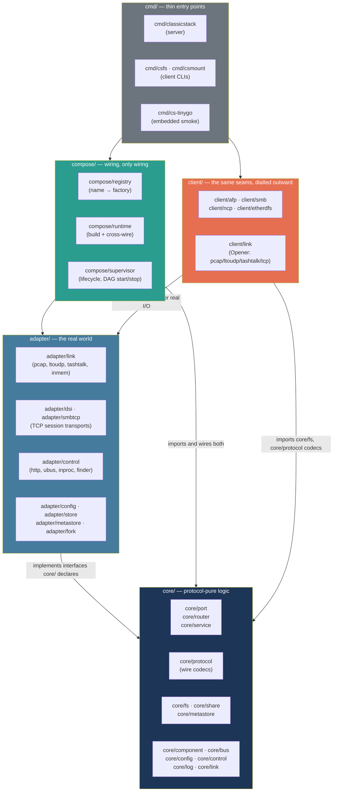
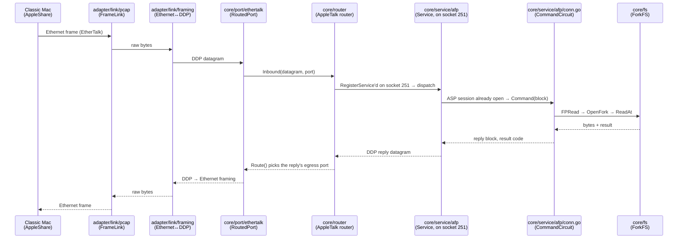
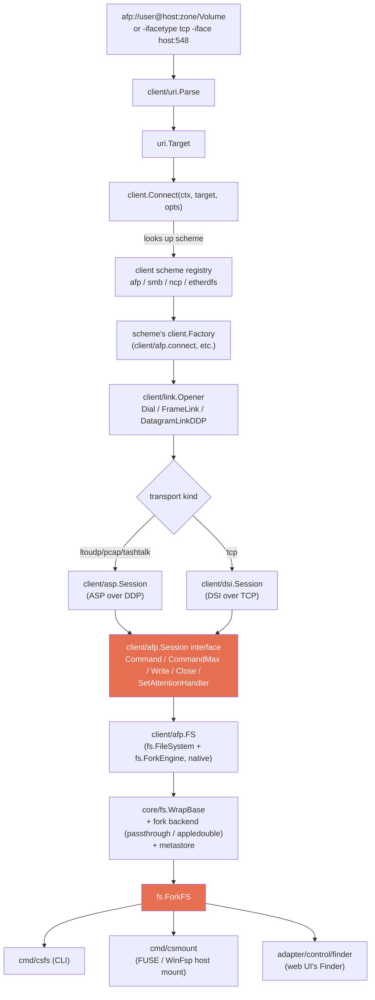
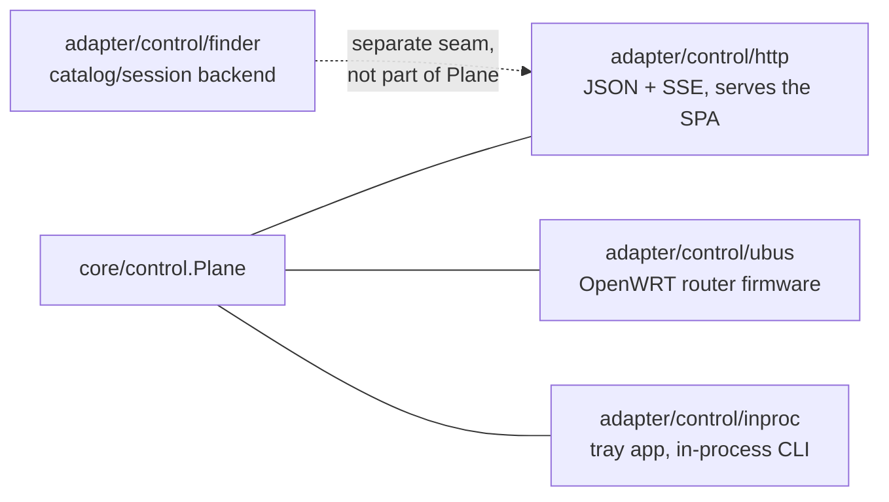

# ClassicStack Architecture

ClassicStack is built as a **hexagonal (ports-and-adapters) architecture** split into
five rings — `core/`, `adapter/`, `compose/`, `client/`, `cmd/` — plus a `hardware/`
tree for embedded targets. This document explains what each ring is, *why* the split
exists, how a request actually moves through the system, how the file **client** fits
in (it is not an afterthought — it is the same seams, driven from the other end), and
how to extend any part of it.

For the underlying design charter and its numbered sections (§1, §3-bis, …) referenced
throughout this codebase's comments, see [`.refactor/00-DESIGN.md`](.refactor/00-DESIGN.md).
For protocol wire formats, see [`spec/`](spec). For the config/build/testing operator
docs, see [`docs/`](docs).

---

## 1. The rings, at a glance

| Ring | Owns | May import |
|---|---|---|
| `core/` | Protocol logic, state machines, wire codecs, the seams (interfaces) everything else is measured against | stdlib only, and only itself |
| `adapter/` | Concrete I/O: NICs, TCP sockets, sqlite, HTTP, serial ports, the filesystem | `core/`, stdlib, third-party libs |
| `compose/` | Turning a `config.Model` into a running, supervised set of components | `core/`, `adapter/` |
| `client/` | The *outbound* mirror of the server: dial a remote AFP/SMB/NCP/EtherDFS server and present it as an `fs.FileSystem` | `core/`, `adapter/link` (for real transports) |
| `cmd/` | `main()` — flags, wiring the above together, nothing else | everything |

The arrows only point one way. That single rule — **core imports nothing but
itself and the standard library** — is what makes every other property in this
document true, and it's worth understanding *why* before touring the packages.

---

## 2. Rationale: why this shape

**The dependency rule is enforced, not aspirational.** `core/internal/archtest`
walks the real import graph of every `core/...` package (via `go list -deps -json`)
and fails the build if any of them reaches a forbidden package:

| Forbidden in `core/` | Why |
|---|---|
| `net/http` | Control front-ends are adapters, not core |
| `reflect` (and `encoding/binary`, `encoding/json`, which pull it in transitively) | No-reflection rule — TinyGo compatibility and allocation discipline |
| `log/slog` | `core/log` is the logging *contract*; slog is an adapter-level sink |
| `database/sql`, `modernc.org/sqlite` | The sqlite metastore is an adapter |
| `github.com/google/gopacket` | Capture/link backends are adapters |
| `github.com/knadh/koanf/v2` | Config codecs (TOML/UCI) are adapters |

This buys four concrete things, in order of how often they actually matter day to day:

1. **Protocol logic is unit-testable with zero hardware.** `core/service/afp`,
   `core/service/smb`, the router, the codecs — all testable with plain `go test`,
   no NIC, no pcap, no sqlite. `test/e2e` proves whole protocol×transport stacks
   end-to-end over `net.Pipe()`/in-memory links for exactly this reason.
2. **One protocol implementation, many transports.** AFP's command core
   (`core/service/afp/conn.go`'s `CommandHandler`/`CommandCircuit` seam) is reached
   identically whether the session arrived over ASP-over-DDP or DSI-over-TCP
   (`adapter/dsi`) — the transport hands over a command block and gets back a reply
   block; it holds no AFP knowledge, and AFP holds no transport knowledge. SMB has the
   identical split (`core/service/smb/conn.go`'s `SessionConsumer`/`SessionCircuit`)
   across NBF, NBIPX, direct-IPX, and direct-TCP (`adapter/smbtcp`). This is *why*
   adding DSI as a fourth AFP transport in 2026-08 touched exactly one new adapter
   package plus a handful of wiring lines, not the AFP command set.
3. **The embedded targets are real, not aspirational.** `cmd/cs-tinygo` is a
   genuine TinyGo-compiled binary over the `core/` subset (ports, router, codecs);
   CI's "TinyGo amd64 gates" job builds it on every push. The dependency rule is what
   makes that possible — a `core/router` that could import `net/http` could never
   link on a microcontroller.
4. **Config and transport choices don't leak into protocol code.** `core/config`
   defines *what* a config section looks like (`Section`/`NamedSection`/`Model`);
   `adapter/config/{toml,uci}` decide how it's serialized. A service asks its config
   section for a value; it never parses TOML.

**Why `compose/` is a separate ring from `core/` and `adapter/`, rather than living in
`cmd/`:** the wiring logic — "build every configured component in dependency order,
then cross-wire the ones that need each other" — is itself substantial and
independently testable (`compose/runtime`'s tests build a full in-memory stack and
assert cross-wiring without ever touching `cmd/`). Keeping it out of `cmd/` means the
Windows service wrapper, the Unix daemon, and the interactive binary all share
*exactly* the same `runtime.Build`/`runtime.Load` path (`cmd/internal/cli`) rather than
three copies of assembly logic drifting apart.

**Why `client/` is its own ring instead of living under `adapter/`:** the client
isn't an adapter *for* the server — it's a peer consumer of the same `core/fs` and
`core/protocol` seams, dialling *outward* instead of listening. See §5.

---

## 3. Directory map

### `core/`

| Package | Role |
|---|---|
| `core/component` | The `Component` lifecycle contract (`Name`/`Start`/`Stop`) plus optional capabilities every component may implement: `Bindable`, `Statful`, `StatsEmitter`, `Describable`, `Configurable`, `Attachable`, `DependsOn`, `TransportBinder`, `Enableable` |
| `core/bus` | The pub/sub primitive (`Bus`/`Event`) — telemetry, state changes, log records, stats samples, Finder pushes, all one small interface |
| `core/config` | `Section`/`NamedSection`/`Model` — the in-memory, codec-agnostic config contract; the schema registry (`config.Register`) |
| `core/control` | `Plane` — the single transport-agnostic management contract (status, `Reconfigure`, `AddInstance`/`RemoveInstance`, `Save`) every front-end drives |
| `core/log` | The logging contract (`Logger`, `Field`, `Sink`) — ring/stderr sinks live here; the bus-backed sink is an adapter |
| `core/link` | `FrameLink`/`DatagramLink`/`Framer`/`CaptureSink` — the seam every raw transport (pcap, LToUDP, TashTalk, in-memory) implements |
| `core/protocol/*` | Wire codecs only — one package per protocol (`ddp`, `atp`, `asp`, `afp`, `dsi`, `smb`, `netbios`, `ipx`, `netbeui`, `nbp`, `rip`, `llap`, `aarp`, `abp`, `pap`, `etherdfs`, `macipx`, `mailslot`, `browser`, `messenger`, `ncp`) — no I/O, no goroutines |
| `core/port/*` | Transport ports: `ethertalk`, `localtalk` (LToUDP + TashTalk), `ipx`, `netbeui`, `etherdfs` — bind a `core/link` to a protocol codec |
| `core/router` + `core/router/{ipx,netbeui}` | The AppleTalk DDP router (RTMP/ZIP, routing table, zone info table) and the IPX/NetBEUI NetBIOS-transport mini-routers |
| `core/service/*` | DDP/session services: `afp`, `smb`, `ncp`, `etherdfs` (file services); `macip`, `ipxgw` (gateways); `rtmp`, `zip`, `nbp`, `aep`, `sap`, `rip` (AppleTalk/IPX housekeeping); `netbios`, `browser`, `messenger`, `mailslot`, `netboot`, `ipxdiag` |
| `core/fs` | The shared storage seam every file service and the client sit on: `FileSystem`, `ForkEngine`, `ForkFS`, the fork/meta-backend registries (`RegisterForkAdapter`, `RegisterFSWithParams`) |
| `core/share` | The thin `Share` descriptor + `Manager` CRUD that AFP volumes and SMB shares both hold, so config `Reconfigure` can add/update/remove a share live |
| `core/metastore` | CNID / short-name / DOS-attribute persistence (`Store` interface; `mem` impl — `sqlite` is an adapter) |
| `core/auth` | The `Authenticate(user, pass) (ok, err)` seam AFP/SMB/NCP session setup consults |
| `core/hostinfo` | Pcap-free host/NIC introspection (primary interface, gateway, board info) — the one package with an explicit `!tinygo`/`tinygo` split throughout, see §6 |
| `core/binaryprimitives`, `core/encoding`, `core/hash`, `core/macresources`, `core/appledouble`, `core/buf` | Small, self-contained leaf utilities (BE/LE codecs, MacRoman transcoding, Snefru, DeRez text format, AppleDouble layout, per-target buffer sizing) |

### `adapter/`

| Package | Role |
|---|---|
| `adapter/link/*` | Real `core/link` implementations: `pcap` (libpcap/Npcap, `-tags pcap`), `ltoudp` (LocalTalk-over-UDP multicast), `tashtalk` (serial), `tap`, `ppp`, `slip`, `kerneldp`, `driversnet` (stubs/less-common), `inmem` (loopback, tests), `framing` (Ethernet/SNAP ↔ DDP) |
| `adapter/dsi` | AFP-over-TCP (DSI) server transport — drives `afp.CommandHandler`/`CommandCircuit` |
| `adapter/smbtcp` | SMB direct-TCP (`:445`) and NBT (`:139`) server transport — drives `smb.SessionConsumer`/`SessionCircuit` |
| `adapter/serial` | The one shared serial-port opener (TashTalk, and anything else serial-backed) |
| `adapter/capture/{pcapfile,libpcap}` | pcap file writers behind `core/link.CaptureSink` — `pcapfile` is pure-Go/TinyGo-safe, `libpcap` uses gopacket |
| `adapter/control/{http,ubus,inproc,finder,diag}` | Control-plane front-ends over `core/control.Plane`, plus the Finder catalog/session backend (§5) |
| `adapter/config/{toml,uci,describe}` | Config codecs (TOML for desktop, UCI for OpenWRT) and the params-form describer the web UI reads |
| `adapter/store/{file,uci}` | Config persistence backends |
| `adapter/metastore/sqlite` | The durable CNID/metadata store |
| `adapter/fork/hfs` | Native HFS+ resource-fork backend (macOS) |
| `adapter/auth/local` | Local user-store authenticator |
| `adapter/log/bus` | The bus-backed log sink (fans `core/log` records onto the telemetry bus for the web UI's Logs tab) |
| `adapter/archive`, `adapter/extmap`, `adapter/bridge`, `adapter/fswatch`, `adapter/macgarden`, `adapter/macipgw`, `adapter/metrics`, `adapter/zipfs` | Feature-specific adapters: zip-backed `fs.FileSystem` (`zipfs`), a scrape-backed one (`macgarden`), extension-map parsing, the shared bridge/Wi-Fi decorator, filesystem change notification, the MacIP IP-side egress, `expvar` performance counters |

### `compose/`

| Package | Role |
|---|---|
| `compose/registry` | `Register(name, Factory)` — every component's name → build function, gated behind its build tag's `init()`; `BuildContext` carries the shared collaborators (Router, Telemetry, Opener, Serial) a factory needs |
| `compose/runtime` | `Load` (config in), `Build` (component graph out, `crossWireTransports` wires the NetBIOS-transport mini-routers + TCP transports + browse-list + MacIP egress), `Runtime` (Start/Stop/Supervisor/Model) |
| `compose/supervisor` | The dependency-ordered start/stop DAG every built component runs under |
| `compose/stats`, `compose/diag` | The stats-sample subscriber and diagnostics probe wiring |

### `client/`

| Package | Role |
|---|---|
| `client` (root) | `RegisterClient`/`Connect` — the scheme registry (`"afp"`, `"smb"`, `"ncp"`, `"etherdfs"`) and the fork-backend wrap every scheme's factory returns through |
| `client/uri` | URI parsing → `Target{Scheme, Server, Volume, User, Pass, ...}` |
| `client/link` | `Opener` — turns a transport selection (`pcap`/`ltoudp`/`tashtalk`/`tcp`/`inmem`) into whichever link view a scheme needs: a raw `FrameLink`, a DDP `DatagramLink`, or a `net.Conn` |
| `client/afp` | AFP client: `FS` (native `fs.ForkEngine`), the `Session` interface (§5), login/UAM negotiation |
| `client/asp`, `client/dsi` | The two `client/afp.Session` implementations — ASP-over-DDP and DSI-over-TCP |
| `client/smb` | SMB client over NBF/NBIPX/direct-IPX/direct-TCP, the `Transport` interface |
| `client/ncp` | NetWare NCP client |
| `client/etherdfs` | EtherDFS (raw Ethernet) client |
| `client/atalk` | Shared AppleTalk endpoint helpers (NBP lookup, AEP, ZIP) the AFP client's DDP path uses |
| `client/netbios`, `client/browse` | NetBIOS Messenger send + SMB browse-list discovery, shared by the diagnostic CLIs and the in-process Finder client |
| `client/xfer` | Host↔remote copy preserving forks/attributes — the one code path `csfs`/`csmount`/the Finder use |
| `client/fuse`, `client/winfsp` | Host-mount adapters (macFUSE/libfuse, WinFsp) |
| `client/trace` | The `-v` wire-trace logger every scheme's client narrates through |

### `cmd/`

| Binary | Role |
|---|---|
| `cmd/classicstack` | Interactive server — thin `main()` over `cmd/internal/cli` |
| `cmd/classicstack-svc`, `cmd/classicstackd` | Windows service / Unix daemon wrappers around the same run-core |
| `cmd/classicstack-tray` | macOS/Windows tray app |
| `cmd/csfs`/`cmd/csclient`, `cmd/csmount` | File-client CLI and host-mount tool, both over `client/` |
| `cmd/csecho`, `cmd/csnbp`, `cmd/csgetzones`, `cmd/cspap`, `cmd/csipxping`, `cmd/csncpinfo`, `cmd/csnetsend`, `cmd/csnetview` | AppleTalk/IPX/NetBIOS diagnostic tools |
| `cmd/cs-tinygo` | The minimal TinyGo-safe core subset smoke target (§6) |
| `cmd/internal/cli` | The shared run-core: flag/TOML/UCI parsing, `runtime.Load`/`Build`, the interactive/service/daemon entry points all call into this |
| `cmd/internal/csconnect` | Shared CLI flag/URI plumbing between `csfs`/`csmount` |
| `cmd/internal/atlink`, `cmd/internal/buildinfo` | AppleTalk probe-utility link shim; link-time version metadata |

Everything else at the repo root is support tooling, not runtime code:
`hardware/` (embedded boards, §6), `packaging/` (Windows installer), `netboot/`
(ROM payload sources), `openwrt/` (UCI/procd init scripts), `tools/` (native
end-to-end test clients, HFS inspection scripts), `test/e2e/` (the cross-cutting
protocol×transport harness), `site/` (this documentation's published form),
`third_party/` (the `classicstack-web` submodule, `cgofuse`, `go-winfsp`).

---

## 4. Runtime composition: config → running stack

```mermaid
flowchart LR
    CFG["server.toml / UCI<br/>on disk"] -->|Store + Codec| LOAD["runtime.Load"]
    LOAD --> MODEL["config.Model<br/>(in memory)"]
    MODEL --> BUILD["runtime.Build"]

    subgraph REG["compose/registry"]
        F1["Factory: AFP"]
        F2["Factory: SMB"]
        F3["Factory: EtherTalk port"]
        F4["Factory: Router"]
        F5["Factory: DSI transport<br/>(built INERT)"]
    end

    BUILD -->|"one Factory call<br/>per configured/built component"| REG
    REG --> COMPS["map[string]Component"]
    COMPS --> XWIRE["crossWireTransports<br/>+ crossWireRouter"]
    XWIRE -->|"tr.SetHandler(afp)<br/>tr.SetAddr(cfg.tcp_addr)"| WIRED["fully wired components"]
    WIRED --> SUP["compose/supervisor<br/>DAG start in Dependencies() order"]
    SUP --> RUN["Runtime.Start(ctx)<br/>→ live server"]

    style REG fill:#2a9d8f,color:#fff
    style SUP fill:#2a9d8f,color:#fff
```

Two details worth internalising because they explain a lot of the code you'll read in
`compose/`:

- **Components are built inert, then wired.** `compose/registry/reg_dsi.go` builds a
  `dsi.Transport` with no handler and no address — `Start` on an inert transport is a
  documented no-op. `compose/runtime/transports.go`'s `wireDSI` (mirroring `wireSMBTCP`)
  only installs the real `afp.CommandHandler` and listen address *after* asking the AFP
  service itself (`af.Binds(afp.TransportTCP)`, `af.TCPListenAddr()`) whether it wants
  to be reachable that way. A component that ends up with nothing to do — no address
  configured, no service present, a build without the tag — stays inert rather than
  erroring, the same posture a NIC with no link takes. This is why an "empty" build
  (route-only, no file services) still boots cleanly.
- **The service, not the compose root, owns "am I bound?".** `*afp.Service.Binds()`
  and `*smb.Service.Binds()` are the single source of truth compose asks — not a
  second copy of the config section. This is deliberate: the dashboard's `Props()`
  and the wiring decision read the exact same state, so they can never disagree.

---

## 5. Data flow: a file read, end to end

Take the concrete case of a classic Mac reading a file over AFP-over-EtherTalk. Every
arrow below is a real interface crossing, not a metaphor:

The same read over **DSI (AFP-over-TCP)** replaces the top three participants —
`adapter/link/pcap` → `adapter/link/framing` → `core/port/ethertalk` → `core/router` —
with a single `adapter/dsi.Transport` reading length-framed TCP directly into
`svc.NewConn()`'s `Conn`. Everything from `Conn` (`core/service/afp/conn.go`) downward
— the AFP command dispatch, `core/fs`, the reply — is **identical code**, not a
parallel implementation. That's the entire point of the `CommandHandler`/
`CommandCircuit` split described in §2.

The same shape repeats for SMB (`core/service/smb/conn.go`'s `SessionConsumer`/
`SessionCircuit`, driven by NBF/NBIPX/direct-IPX ports *or* `adapter/smbtcp`) and for
NCP/EtherDFS. **One command core per protocol, N session transports.**

---

## 6. The client: the same seams, dialled outward

The file **client** (`client/`) is not a bolt-on utility — it is architecturally the
mirror image of the server, built on the identical `core/fs` seam. A remote AFP volume
and a local `local_fs` share both end up as an `fs.ForkFS`; `client/xfer`'s
host↔remote copy code, the Finder catalog, and `csfs` never know or care which one
they're holding.

Three things worth calling out explicitly, since they're easy to miss from reading any
one file in isolation:

- **`client/afp.Session` is the client-side mirror of `CommandHandler`/
  `CommandCircuit`.** Exactly as the server holds one AFP command core behind a
  transport-agnostic seam, `client/afp.FS` holds its command plumbing —
  including reconnect-on-drop (`FS.reestablish`) — behind a `Session` interface
  (`Command`/`CommandMax`/`Write`/`Close`/`SetAttentionHandler`) that
  `client/asp.Session` and `client/dsi.Session` both satisfy structurally. Adding
  DSI as a client transport in 2026-08 meant implementing that one interface, not
  touching `client/afp`'s command logic. `client/smb` has the parallel shape
  (`Transport` interface; `client/smb.DialTCP` and the pcap-carrier dialers both
  implement it).
- **Reconnection is a *dial strategy*, injected, not hard-coded.** `FS.redial` is a
  `func() (Session, error)` closure the connect factory builds — for ASP it re-opens a
  session on the same DDP endpoint; for DSI it re-dials TCP from scratch. `FS` itself
  holds no transport-specific state (no `ep`/`sls` fields) — that lives inside the
  closure the factory that built it captured.
- **The fork backend is chosen by what the remote side actually offers.** AFP speaks
  native forks on the wire, so `client.RegisterClient("afp", "passthrough", …)` wraps
  the connection with `core/fs`'s `"passthrough"` adapter (forward straight to the
  already-native `fs.ForkEngine`). SMB/NCP/EtherDFS have no fork concept, so they
  register `"appledouble"` and forks round-trip as `._name` sidecars instead — the
  same backend the *server* side uses for the same reason (see
  [`spec/16-storage-seam.md`](spec/16-storage-seam.md)).

The in-process file **client** the web UI's Finder drives (`[Client]` in
`server.toml`, `adapter/control/finder`) is the *same* `client.Connect` path — the
server binary is also, optionally, a client of other AFP/SMB/NCP/EtherDFS servers on
the LAN.

---

## 7. Control plane and the web UI

`core/control.Plane` is the single transport-agnostic management contract — status,
`Reconfigure`, `AddInstance`/`RemoveInstance` (repeated-section create/delete, e.g. an
AFP volume), `Save`, config marshal/topic subscription. Three front-ends drive it
identically:

Because every front-end sits over the identical `Plane`, a feature implemented once at
that layer is immediately available through HTTP, `ubus`, and in-process callers with
no per-front-end drift — `adapter/control/parity_test.go` asserts exactly this: the
same operation driven through `inproc` and `http` must produce the same result.

The Finder browsing surface (`/finder`) is a *separate* seam from `Plane` —
`adapter/control/finder` is the server-side backend that speaks `client.Connect` to
local and remote shares alike and hands the SPA a protocol-agnostic catalog view; the
browser never speaks AFP/SMB/NCP/EtherDFS itself. The SPA's own source lives in a
separate repository (`third_party/classicstack-web`, a git submodule) so its component
set can be shared with a standalone browser-only LocalTalk PWA — see
[`docs/web-ui.md`](docs/web-ui.md) for the full split and the submodule mechanics.

---

## 8. Embedded targets

Two different things both live under the TinyGo umbrella, and conflating them is the
single easiest mistake to make when touching this area:

- **`cmd/cs-tinygo`** is this project's own deliberately narrow "TinyGo-safe core
  subset" — ports, router, core codecs, nothing else. It's what CI's "TinyGo amd64
  gates" job (`scripts/ci/tinygo-gate.sh`) actually builds on every push, and it
  passes. It exists specifically to prove `core/` stays link-clean for a
  memory-constrained target as it grows.
- **`hardware/{esp32,pico}`** are real board targets (WT32-ETH01, Raspberry Pi
  Pico/Pico W/Pico 2), and their `main.go`s currently import the **full** desktop
  stack — `compose/registry`, `compose/runtime`, `adapter/control/http` (a web UI!),
  TOML file config — a much wider surface than `cmd/cs-tinygo`'s. As of 2026-08 those
  board builds are **not** green: beyond several now-fixed bugs (a package-name typo,
  a wrong TinyGo target flag, missing `go.mod` entries, `core/fs`/`core/hostinfo`
  code paths that assumed real-OS `syscall`/`net` APIs TinyGo's baremetal targets
  don't implement), WT32-ETH01 additionally binds directly against the ESP-IDF C SDK
  (`#cgo LDFLAGS: -lesp_eth`, `#include <esp_eth.h>`) which CI's toolchain doesn't
  install, and both boards pull in `golang.org/x/net`-internals-requiring-real-syscalls
  transitively through the full compose graph. Getting a board target reliably green
  needs curating a minimal embedded import surface closer to `cmd/cs-tinygo`'s — a
  scope decision, not a bug fix.

**The pattern for TinyGo-incompatible code**, already established in several places
(`core/fs/diskusage_{unix,other}.go`, `core/hostinfo/diagnostics_tinygo.go`,
`core/hostinfo/primary_interfaces{,_tinygo}.go`): split the real implementation behind
`&& !tinygo`, and add a `tinygo`-tagged sibling file with a graceful-degradation stub
(commonly "0/0 unknown" or `ErrNo*`) — never leave a package uncompilable for an
embedded target because one function it doesn't need drags in a real-OS-only API. Note
the trap: TinyGo's baremetal targets report `GOOS=linux` for stdlib-coverage
purposes, so a plain `//go:build linux` (or `_linux.go` filename) constraint is **not**
sufficient by itself — it will happily match a TinyGo build too.

---

## 9. Testing structure

| Layer | What it proves | Where |
|---|---|---|
| Per-package unit tests | One codec, one port, one service in isolation | alongside the code, `go test ./...` |
| `test/e2e` | Every protocol × transport combination, real client + real server, over `net.Pipe()`/in-memory links — no NIC, no hardware | `test/e2e/*_test.go` |
| `core/internal/archtest` | The dependency rule itself (§2) | `go test ./core/internal/archtest/...` |
| `scripts/ci/tinygo-gate.sh` | `cmd/cs-tinygo` actually compiles+links for an embedded target | CI, "TinyGo amd64 gates" |
| `tools/end-to-end/{macos,windows,dos,os2}` | Real (or accurately emulated) vintage OS clients — AppleShare, the Windows redirector, DOS `net`/`login` — driven against a live ClassicStack, off a floppy image under 86Box/Mini vMac | manual/CI-adjacent, see `docs/testing.md` |

See [`docs/testing.md`](docs/testing.md) for how to run each of these.

---

## 10. How to expand ClassicStack

Every extension point below follows the same shape: implement a small interface in
`core/`, register it, and let `compose/` (or `client/`) find it. None of these require
touching an unrelated package.

### Add a new AppleTalk/IPX port (transport)

1. `core/protocol/<proto>`: wire codec, pure functions, no I/O.
2. `core/port/<name>`: bind a `core/link.FrameLink`/`DatagramLink` to the codec;
   implement `router.RoutedPort` if it joins the AppleTalk router.
3. `adapter/link/<name>` (only if the real I/O doesn't already exist — pcap/serial/tap
   are already shared).
4. `compose/registry/reg_<name>.go`: `Register(name, factory)` gated by the package's
   build tag; the factory reads its `core/config` section (`RegisterPort` if it's a
   repeated instance like EtherTalk/IPX) and returns the built `component.Component`.
5. If it needs cross-wiring to a service (like the NetBEUI/IPX mini-routers do to
   NetBIOS/SMB), add that to `compose/runtime/transports.go`'s `crossWireTransports`.

Reference: `core/port/netbeui` + `compose/registry/reg_netbeui.go` is one of the
smaller complete examples.

### Add a new DDP/session service

1. `core/service/<name>`: the service `struct` (`component.Component` +
   whatever optional capabilities apply — `Bindable`, `TransportBinder`, `Describable`)
   and its `router.Service` registration on a DDP socket, or its
   `SessionConsumer`/`CommandHandler`-style seam if it rides a session transport.
2. `compose/registry/reg_<name>.go`: build it from its `core/config` section, wire
   `SetRouter`/register on socket if it's DDP-addressed.
3. Add a `core/config` section (`config.Register(config.SectionSchema{...})`) if it
   needs operator-visible settings.

Reference: `core/service/aep` is close to the smallest complete DDP service; `core/
service/afp` + `adapter/dsi` is the fullest example of the transport-agnostic
command-core pattern (§4/§5).

### Add a new session transport for an existing protocol

Implement the protocol's `CommandHandler`/`SessionConsumer`-shaped seam
(`core/service/afp/conn.go` or `core/service/smb/conn.go`) in a new `adapter/<name>`
package as a `component.Component`, built inert by its registry factory, wired by a
`wire<Name>` function in `compose/runtime/transports.go` that asks the owning
*service* (not the config section directly) whether and where to bind — see
`wireDSI`/`wireSMBTCP` for the exact shape to copy.

### Add a new `fs.FileSystem` backend

Call `core/fs.RegisterFSWithParams("my_type", factory, params...)` from an `init()` in
a new `adapter/<name>` package; the factory signature is
`func(ShareSpec, bus.Bus, metastore.Store) (FileSystem, error)`. Any file service's
`fs_type = "my_type"` config then resolves to it automatically — no changes needed in
AFP/SMB/NCP/EtherDFS. Reference: `adapter/zipfs` (read-write, archive-backed) is a
compact real example; its doc comment calls it "the canonical 'VFS structure works
standalone' check."

### Add a new client scheme

Call `client.RegisterClient(scheme, defaultForkBackend, Transports{...}, factory,
params...)` from an `init()` in a new `client/<name>` package; the factory dials
through the `opts.Opener` it's handed and returns an `fs.FileSystem` (plus
`fs.ForkEngine` if the protocol carries native forks — otherwise the registered fork
backend, typically `"appledouble"`, wraps it). `csfs`, `csmount`, the in-process
`[Client]`, and the web Finder all pick it up with no further wiring. Reference: see
[`docs/manual.md` §5](docs/manual.md#5-extending-classicstack--the-client-sdk) for a
worked minimal example.

### Add a new control front-end

Implement `core/control.Plane` consumption in a new `adapter/control/<name>` package
(see `adapter/control/inproc` for the smallest real one); every `Plane` method you
call is already implemented identically for every existing front-end, so there is
nothing else to keep in sync.

### Add a new config section

Define a `config.Section` (or `NamedSection` for a repeated one, like a volume or
port instance) and call `config.Register(config.SectionSchema{Key, New, Validate,
DisplayName, Description})`, typically from the same package's `RegisterX()` function
that the owning service's registry factory calls. Both shipped codecs (TOML, UCI) and
the web UI's params-form describer (`adapter/config/describe`) pick up struct tags
(`toml`, `display`, `desc`, `widget`, `example`, `secret`) reflectively — no
per-field codec code needed for the common cases.

---

## 11. See also

- [`.refactor/00-DESIGN.md`](.refactor/00-DESIGN.md) — the full target-architecture charter (numbered §-sections this codebase's comments cite)
- [`.refactor/TODO.md`](.refactor/TODO.md) — the migration's step-by-step record and current status
- [`docs/config.md`](docs/config.md) — the full `server.toml` reference
- [`docs/protocols.md`](docs/protocols.md) — exact protocol versions/dialects supported
- [`docs/web-ui.md`](docs/web-ui.md) — the control-API split and the `classicstack-web` submodule in depth
- [`docs/testing.md`](docs/testing.md) — running every layer in §9
- [`docs/manual.md`](docs/manual.md) — the operator/developer manual, including the client SDK walkthrough
- [`spec/`](spec) — wire-level protocol documentation, one file per protocol
