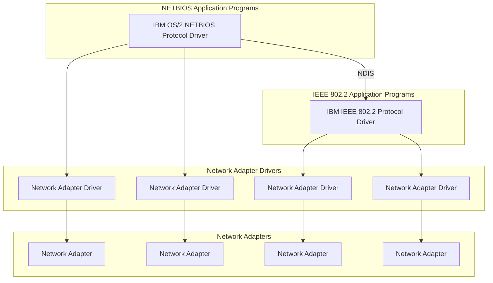
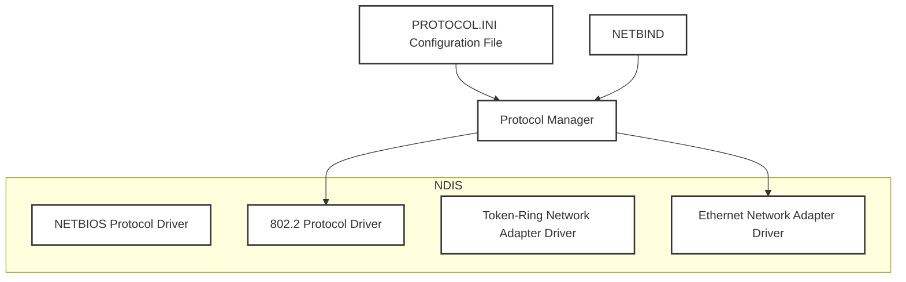

## Page 1

LAN Technical Reference: 802.2 and NetBIOS APIs
Book Cover

COVER Book Cover
---
LAN Technical Reference
IEEE 802.2 and NetBIOS
Application Program Interfaces
Document Number SC30-3587-01
---
| Copyright IBM Corp. 1986, 1996
COVER - 1

---


## Page 2

NOTICES Notices

+--- Note -----------------------------------------------------------+
| Before using this information and the products it supports, be       |
| sure to read the general information under "Notices" in              |
| topic FRONT_1.                                                     |
+-------------------------------------------------------------------+

<footer>Copyright IBM Corp. 1986, 1996</footer>
<footer>NOTICES - 1</footer>

---


## Page 3

LAN Technical Reference: 802.2 and NetBIOS APIs
Edition Notice

EDITION Edition Notice
Second Edition (May 1996)

Order publications through your IBM representative or the IBM branch office serving your locality. Publications are not stocked at the address given below.

A form for readers' comments appears at the back of this publication. If the form has been removed, address your comments to:

Department CGF
Design & Information Development
IBM Corporation
PO Box 12195
RESEARCH TRIANGLE PARK NC 27709
USA

When you send information to IBM, you grant IBM a nonexclusive right to use or distribute the information in any way it believes appropriate without incurring any obligation to you.

| Copyright International Business Machines Corporation 1986, 1996.
All rights reserved.
Note to U.S. Government Users -- Documentation related to restricted rights -- Use, duplication or disclosure is subject to restrictions set forth in GSA ADP Schedule Contract with IBM Corp.

<footer>Copyright IBM Corp. 1986, 1996
EDITION - 1</footer>

---


## Page 4

LAN Technical Reference: 802.2 and NetBIOS APIs
Table of Contents

<table>
  <tr>
    <td>CONTENTS</td>
    <td>Table of Contents</td>
  </tr>
  <tr>
    <td>COVER</td>
    <td>Book Cover</td>
  </tr>
  <tr>
    <td>NOTICES</td>
    <td>Notices</td>
  </tr>
  <tr>
    <td>EDITION</td>
    <td>Edition Notice</td>
  </tr>
  <tr>
    <td>CONTENTS</td>
    <td>Table of Contents</td>
  </tr>
  <tr>
    <td>FIGURES</td>
    <td>Figures</td>
  </tr>
  <tr>
    <td>TABLES</td>
    <td>Tables</td>
  </tr>
  <tr>
    <td>FRONT_1</td>
    <td>Notices</td>
  </tr>
  <tr>
    <td>FRONT_1.1</td>
    <td>Trademarks</td>
  </tr>
  <tr>
    <td>PREFACE</td>
    <td>Preface</td>
  </tr>
  <tr>
    <td>PREFACE.1</td>
    <td>How This Manual Is Organized</td>
  </tr>
  <tr>
    <td>PREFACE.2</td>
    <td>Related IBM Publications</td>
  </tr>
  <tr>
    <td>PREFACE.3</td>
    <td>Guide to Information about the TCP/IP Interface</td>
  </tr>
  <tr>
    <td>PREFACE.3.1</td>
    <td>General Publications</td>
  </tr>
  <tr>
    <td>PREFACE.3.2</td>
    <td>Programming Publications</td>
  </tr>
  <tr>
    <td>PREFACE.4</td>
    <td>Guide to Information About the Open Data-Link Interface (ODI)</td>
  </tr>
  <tr>
    <td>PREFACE.5</td>
    <td>IBM LAN OEMI</td>
  </tr>
  <tr>
    <td>CHANGES</td>
    <td>How This Manual Differs from the Previous Edition of the IBM LAN Technical Reference 802.2 and NetBIOS APIs</td>
  </tr>
  <tr>
    <td>1.0</td>
    <td>Chapter 1. LAN Overview and Interfaces</td>
  </tr>
  <tr>
    <td>1.1</td>
    <td>About This Chapter</td>
  </tr>
  <tr>
    <td>1.2</td>
    <td>Drivers and Programs That Provide the APIs</td>
  </tr>
  <tr>
    <td>1.2.1</td>
    <td>NDIS and non-NDIS Adapters</td>
  </tr>
  <tr>
    <td>1.2.2</td>
    <td>IBM Programs to Support LAN Adapters</td>
  </tr>
  <tr>
    <td>1.2.3</td>
    <td>IBM LAN Client</td>
  </tr>
  <tr>
    <td>1.3</td>
    <td>Where to Find Information about IBM Adapter Interfaces</td>
  </tr>
  <tr>
    <td>1.4</td>
    <td>Introduction to the Networks</td>
  </tr>
  <tr>
    <td>1.5</td>
    <td>LANS</td>
  </tr>
  <tr>
    <td>1.5.1</td>
    <td>The IBM Token-Ring Network</td>
  </tr>
  <tr>
    <td>1.5.2</td>
    <td>The IBM PC Network (Broadband)</td>
  </tr>
  <tr>
    <td>1.5.3</td>
    <td>The IBM PC Network (Baseband)</td>
  </tr>
  <tr>
    <td>1.5.4</td>
    <td>Ethernet Support</td>
  </tr>
  <tr>
    <td>1.6</td>
    <td>Related Software</td>
  </tr>
  <tr>
    <td>1.7</td>
    <td>OS/2 Communications Manager (OS/2 EE 1.3)</td>
  </tr>
  <tr>
    <td>1.7.1</td>
    <td>IEEE 802.2 Application Program Interface in OS/2</td>
  </tr>
  <tr>
    <td>1.7.2</td>
    <td>Differences between the Dynamic Link Routine Interface and the Device Driver Interface</td>
  </tr>
  <tr>
    <td>1.8</td>
    <td>Why Use IEEE 802.2 or NetBIOS?</td>
  </tr>
  <tr>
    <td>1.9</td>
    <td>IBM LAN Application Program Interfaces</td>
  </tr>
  <tr>
    <td>1.10</td>
    <td>IEEE 802.2 Interface</td>
  </tr>
  <tr>
    <td>1.10.1</td>
    <td>Direct Interface</td>
  </tr>
  <tr>
    <td>1.10.2</td>
    <td>DLC Interface</td>
  </tr>
  <tr>
    <td>1.11</td>
    <td>APPC/PC Interface</td>
  </tr>
  <tr>
    <td>1.12</td>
    <td>NetBIOS</td>
  </tr>
  <tr>
    <td>1.13</td>
    <td>Token-Ring Network Frame Definition</td>
  </tr>
  <tr>
    <td>1.13.1</td>
    <td>Routing Information Field</td>
  </tr>
  <tr>
    <td>1.13.2</td>
    <td>Routing Control Field</td>
  </tr>
  <tr>
    <td>1.13.3</td>
    <td>Route Designator Fields</td>
  </tr>
  <tr>
    <td>1.14</td>
    <td>Frame Format on the PC Network</td>
  </tr>
  <tr>
    <td>1.15</td>
    <td>Ethernet IEEE 802.3 Frame Format</td>
  </tr>
  <tr>
    <td>1.16</td>
    <td>Ethernet DIX Version 2.0 Frame Format</td>
  </tr>
  <tr>
    <td>1.16.1</td>
    <td>Ethernet Frame Field Descriptions</td>
  </tr>
  <tr>
    <td>2.0</td>
    <td>Chapter 2. Programming Conventions for the IEEE 802.2 Interface</td>
  </tr>
  <tr>
    <td>2.1</td>
    <td>About This Chapter</td>
  </tr>
  <tr>
    <td>2.2</td>
    <td>IBM Program Products for LAN Adapter Support</td>
  </tr>
  <tr>
    <td>2.3</td>
    <td>IEEE 802.2 Programming Conventions with DOS</td>
  </tr>
  <tr>
    <td>2.3.1</td>
    <td>LAN Support Program (CCB1) Calling Conventions</td>
  </tr>
  <tr>
    <td>2.3.2</td>
    <td>LAN Support Program (CCB1) Command Completion</td>
  </tr>
  <tr>
    <td>2.3.3</td>
    <td>LAN Support Program (CCB1) Control Blocks</td>
  </tr>
  <tr>
    <td>2.4</td>
    <td>Programming Conventions with OS/2</td>
  </tr>
  <tr>
    <td>2.4.1</td>
    <td>OS/2 DLR Interface</td>
  </tr>
  <tr>
    <td>2.4.2</td>
    <td>OS/2 DD Interface</td>
  </tr>
  <tr>
    <td>2.5</td>
    <td>Control Blocks for All CCBs</td>
  </tr>
  <tr>
    <td>2.5.1</td>
    <td>CCB Field Explanations</td>
  </tr>
  <tr>
    <td>2.6</td>
    <td>Addressing</td>
  </tr>
  <tr>
    <td>2.7</td>
    <td>Adapter Addresses</td>
  </tr>
  <tr>
    <td>2.7.1</td>
    <td>Stations, SAPs, and IDs</td>
  </tr>
  <tr>
    <td>2.7.2</td>
    <td>SAP Assignments</td>
  </tr>
  <tr>
    <td>2.8</td>
    <td>DLC</td>
  </tr>
  <tr>
    <td>2.8.1</td>
    <td>Types of Service</td>
  </tr>
  <tr>
    <td>2.8.2</td>
    <td>Command Sequences</td>
  </tr>
  <tr>
    <td>2.8.3</td>
    <td>Link Station States</td>
  </tr>
  <tr>
    <td>2.8.4</td>
    <td>Timers</td>
  </tr>
  <tr>
    <td>2.8.5</td>
    <td>Guidelines for Selecting Parameter Values</td>
  </tr>
  <tr>
    <td>2.9</td>
    <td>Transmitting, Receiving, and Buffers</td>
  </tr>
  <tr>
    <td>2.9.1</td>
    <td>Buffer Pools</td>
  </tr>
  <tr>
    <td>2.9.2</td>
    <td>Receive Buffers</td>
  </tr>
  <tr>
    <td>2.9.3</td>
    <td>Transmit Buffers</td>
  </tr>
  <tr>
    <td>3.0</td>
    <td>Chapter 3. The Command Control Blocks</td>
  </tr>
  <tr>
    <td>3.1</td>
    <td>About This Chapter</td>
  </tr>
  <tr>
    <td>3.2</td>
    <td>IBM LAN Client 802.2 Application Program Interface (API)</td>
  </tr>
  <tr>
    <td>3.3</td>
    <td>Command Descriptions</td>
  </tr>
  <tr>
    <td>3.3.1</td>
    <td>BUFFER.FREE</td>
  </tr>
  <tr>
    <td>3.3.2</td>
    <td>BUFFER.GET</td>
  </tr>
  <tr>
    <td>3.3.3</td>
    <td>DIR.CLOSE.ADAPTER</td>
  </tr>
  <tr>
    <td>3.3.4</td>
    <td>DIR.CLOSE.DIRECT</td>
  </tr>
</table>

<footer>Copyright IBM Corp. 1986, 1996</footer>
&lt;page_number&gt;CONTENTS - 1&lt;/page_number&gt;

---


## Page 5

LAN Technical Reference: 802.2 and NetBIOS APIs
Table of Contents

<table>
  <tr>
    <td>3.3.5</td>
    <td>DIR.DEFINE.MIF.ENVIRONMENT</td>
  </tr>
  <tr>
    <td>3.3.6</td>
    <td>DIR.INITIALIZE</td>
  </tr>
  <tr>
    <td>3.3.7</td>
    <td>DIR.INTERRUPT</td>
  </tr>
  <tr>
    <td>3.3.8</td>
    <td>DIR.MODIFY.OPEN.PARMS</td>
  </tr>
  <tr>
    <td>3.3.9</td>
    <td>DIR.OPEN.ADAPTER</td>
  </tr>
  <tr>
    <td>3.3.10</td>
    <td>DIR.OPEN.DIRECT</td>
  </tr>
  <tr>
    <td>3.3.11</td>
    <td>DIR.READ.LOG</td>
  </tr>
  <tr>
    <td>3.3.12</td>
    <td>DIR.RESET.MULT.GROUP.ADDRESS</td>
  </tr>
  <tr>
    <td>3.3.13</td>
    <td>DIR.RESTORE.OPEN.PARMS</td>
  </tr>
  <tr>
    <td>3.3.14</td>
    <td>DIR.SET.EXCEPTION.FLAGS</td>
  </tr>
  <tr>
    <td>3.3.15</td>
    <td>DIR.SET.FUNCTIONAL.ADDRESS</td>
  </tr>
  <tr>
    <td>3.3.16</td>
    <td>DIR.SET.GROUP.ADDRESS</td>
  </tr>
  <tr>
    <td>3.3.17</td>
    <td>DIR.SET.MULT.GROUP.ADDRESS</td>
  </tr>
  <tr>
    <td>3.3.18</td>
    <td>DIR.SET.USER.APPENDAGE</td>
  </tr>
  <tr>
    <td>3.3.19</td>
    <td>DIR.STATUS</td>
  </tr>
  <tr>
    <td>3.3.20</td>
    <td>DIR.TIMER.CANCEL</td>
  </tr>
  <tr>
    <td>3.3.21</td>
    <td>DIR.TIMER.CANCEL.GROUP</td>
  </tr>
  <tr>
    <td>3.3.22</td>
    <td>DIR.TIMER.SET</td>
  </tr>
  <tr>
    <td>3.3.23</td>
    <td>DLC.CLOSE.SAP</td>
  </tr>
  <tr>
    <td>3.3.24</td>
    <td>DLC.CLOSE.STATION</td>
  </tr>
  <tr>
    <td>3.3.25</td>
    <td>DLC.CONNECT.STATION</td>
  </tr>
  <tr>
    <td>3.3.26</td>
    <td>DLC.FLOW.CONTROL</td>
  </tr>
  <tr>
    <td>3.3.27</td>
    <td>DLC.MODIFY</td>
  </tr>
  <tr>
    <td>3.3.28</td>
    <td>DLC.OPEN.SAP</td>
  </tr>
  <tr>
    <td>3.3.29</td>
    <td>DLC.OPEN.STATION</td>
  </tr>
  <tr>
    <td>3.3.30</td>
    <td>DLC.REALLOCATE</td>
  </tr>
  <tr>
    <td>3.3.31</td>
    <td>DLC.RESET</td>
  </tr>
  <tr>
    <td>3.3.32</td>
    <td>DLC.SET.THRESHOLD</td>
  </tr>
  <tr>
    <td>3.3.33</td>
    <td>DLC.STATISTICS</td>
  </tr>
  <tr>
    <td>3.3.34</td>
    <td>PDT.TRACE.OFF</td>
  </tr>
  <tr>
    <td>3.3.35</td>
    <td>PDT.TRACE.ON</td>
  </tr>
  <tr>
    <td>3.3.36</td>
    <td>PURGE.RESOURCES</td>
  </tr>
  <tr>
    <td>3.3.37</td>
    <td>READ</td>
  </tr>
  <tr>
    <td>3.3.38</td>
    <td>READ.CANCEL</td>
  </tr>
  <tr>
    <td>3.3.39</td>
    <td>RECEIVE</td>
  </tr>
  <tr>
    <td>3.3.40</td>
    <td>RECEIVE.CANCEL</td>
  </tr>
  <tr>
    <td>3.3.41</td>
    <td>RECEIVE.MODIFY</td>
  </tr>
  <tr>
    <td>3.3.42</td>
    <td>TRANSMIT.DIR.FRAME</td>
  </tr>
  <tr>
    <td>3.3.43</td>
    <td>TRANSMIT.I.FRAME</td>
  </tr>
  <tr>
    <td>3.3.44</td>
    <td>TRANSMIT.TEST.CMD</td>
  </tr>
  <tr>
    <td>3.3.45</td>
    <td>TRANSMIT.UI.FRAME</td>
  </tr>
  <tr>
    <td>3.3.46</td>
    <td>TRANSMIT.XID.CMD</td>
  </tr>
  <tr>
    <td>3.3.47</td>
    <td>TRANSMIT.XID.RESP.FINAL</td>
  </tr>
  <tr>
    <td>3.3.48</td>
    <td>TRANSMIT.XID.RESP.NOT.FINAL</td>
  </tr>
  <tr>
    <td>4.0</td>
    <td>Chapter 4. NetBIOS</td>
  </tr>
  <tr>
    <td>4.1</td>
    <td>About This Chapter</td>
  </tr>
  <tr>
    <td>4.2</td>
    <td>NetBIOS Overview</td>
  </tr>
  <tr>
    <td>4.3</td>
    <td>IBM LAN Client NetBIOS Application Program Interface (API)</td>
  </tr>
  <tr>
    <td>4.3.1</td>
    <td>NCB.RESET</td>
  </tr>
  <tr>
    <td>4.3.2</td>
    <td>NCB.STATUS (Adapter Status)</td>
  </tr>
  <tr>
    <td>4.4</td>
    <td>The Network Control Block</td>
  </tr>
  <tr>
    <td>4.4.1</td>
    <td>NCB Field Explanations</td>
  </tr>
  <tr>
    <td>4.5</td>
    <td>NetBIOS Operational Parameters</td>
  </tr>
  <tr>
    <td>4.5.1</td>
    <td>LAN Support Program Old Parameters</td>
  </tr>
  <tr>
    <td>4.5.2</td>
    <td>LAN Support Program New Parameters</td>
  </tr>
  <tr>
    <td>4.5.3</td>
    <td>NetBIOS 3.0 (OS/2 EE)</td>
  </tr>
  <tr>
    <td>4.5.4</td>
    <td>NetBIOS 4.0</td>
  </tr>
  <tr>
    <td>4.5.5</td>
    <td>NetBIOS DLC Timers</td>
  </tr>
  <tr>
    <td>4.5.6</td>
    <td>NetBIOS Calling Conventions Using the LAN Support Program</td>
  </tr>
  <tr>
    <td>4.5.7</td>
    <td>NetBIOS Calling Conventions Using the Dynamic Link Routine Interface</td>
  </tr>
  <tr>
    <td>4.5.8</td>
    <td>NetBIOS Calling Conventions Using the Device Driver Interface</td>
  </tr>
  <tr>
    <td>4.5.9</td>
    <td>NCB Completion with Wait Type Commands</td>
  </tr>
  <tr>
    <td>4.5.10</td>
    <td>NCB Completion with No-Wait Type Commands</td>
  </tr>
  <tr>
    <td>4.6</td>
    <td>NetBIOS Command Descriptions</td>
  </tr>
  <tr>
    <td>4.6.1</td>
    <td>NCB.ADD.GROUP.NAME</td>
  </tr>
  <tr>
    <td>4.6.2</td>
    <td>NCB.ADD.NAME</td>
  </tr>
  <tr>
    <td>4.6.3</td>
    <td>NCB.CALL</td>
  </tr>
  <tr>
    <td>4.6.4</td>
    <td>NCB.CANCEL</td>
  </tr>
  <tr>
    <td>4.6.5</td>
    <td>NCB.CHAIN.SEND</td>
  </tr>
  <tr>
    <td>4.6.6</td>
    <td>NCB.CHAIN.SEND.NO.ACK</td>
  </tr>
  <tr>
    <td>4.6.7</td>
    <td>NCB.DELETE.NAME</td>
  </tr>
  <tr>
    <td>4.6.8</td>
    <td>NCB.FIND.NAME</td>
  </tr>
  <tr>
    <td>4.6.9</td>
    <td>NCB.HANG.UP</td>
  </tr>
  <tr>
    <td>4.6.10</td>
    <td>NCB.LAN.STATUS.ALERT</td>
  </tr>
  <tr>
    <td>4.6.11</td>
    <td>NCB.LISTEN</td>
  </tr>
  <tr>
    <td>4.6.12</td>
    <td>NCB.RECEIVE</td>
  </tr>
  <tr>
    <td>4.6.13</td>
    <td>NCB.RECEIVE.ANY</td>
  </tr>
  <tr>
    <td>4.6.14</td>
    <td>NCB.RECEIVE.BROADCAST.DATAGRAM</td>
  </tr>
  <tr>
    <td>4.6.15</td>
    <td>NCB.RECEIVE.DATAGRAM</td>
  </tr>
  <tr>
    <td>4.6.16</td>
    <td>NCB.RESET</td>
  </tr>
  <tr>
    <td>4.6.17</td>
    <td>NCB.SEND</td>
  </tr>
  <tr>
    <td>4.6.18</td>
    <td>NCB.SEND.BROADCAST.DATAGRAM</td>
  </tr>
  <tr>
    <td>4.6.19</td>
    <td>NCB.SEND.DATAGRAM</td>
  </tr>
  <tr>
    <td>4.6.20</td>
    <td>NCB.SEND.NO.ACK</td>
  </tr>
</table>

<footer>Copyright IBM Corp. 1986, 1996</footer>
<footer>CONTENTS -2</footer>

---


## Page 6

LAN Technical Reference: 802.2 and NetBIOS APIs
Table of Contents

<table>
  <tr>
    <td>4.6.21</td>
    <td>NCB.SESSION.STATUS</td>
  </tr>
  <tr>
    <td>4.6.22</td>
    <td>NCB.STATUS</td>
  </tr>
  <tr>
    <td>4.6.23</td>
    <td>NCB.TRACE</td>
  </tr>
  <tr>
    <td>4.6.24</td>
    <td>NCB.UNLINK</td>
  </tr>
  <tr>
    <td>5.0</td>
    <td>Chapter 5. The NetBIOS Frames Protocol</td>
  </tr>
  <tr>
    <td>5.1</td>
    <td>About This Chapter</td>
  </tr>
  <tr>
    <td>5.1.1</td>
    <td>Assumptions</td>
  </tr>
  <tr>
    <td>5.1.2</td>
    <td>Related Documents</td>
  </tr>
  <tr>
    <td>5.2</td>
    <td>NetBIOS Protocol in the IBM LAN Client</td>
  </tr>
  <tr>
    <td>5.3</td>
    <td>Terms and Definitions</td>
  </tr>
  <tr>
    <td>5.4</td>
    <td>NetBIOS Commands</td>
  </tr>
  <tr>
    <td>5.5</td>
    <td>General Information on Remote Name Directory</td>
  </tr>
  <tr>
    <td>5.5.1</td>
    <td>New NCB Commands</td>
  </tr>
  <tr>
    <td>5.5.2</td>
    <td>Header Format Overview</td>
  </tr>
  <tr>
    <td>5.5.3</td>
    <td>NetBIOS Header</td>
  </tr>
  <tr>
    <td>5.5.4</td>
    <td>NetBIOS Frame Summary</td>
  </tr>
  <tr>
    <td>5.6</td>
    <td>NetBIOS Frame Formats and Descriptions</td>
  </tr>
  <tr>
    <td>5.6.1</td>
    <td>ADD_GROUP_NAME_QUERY</td>
  </tr>
  <tr>
    <td>5.6.2</td>
    <td>ADD_NAME_QUERY</td>
  </tr>
  <tr>
    <td>5.6.3</td>
    <td>NAME_IN_CONFLICT</td>
  </tr>
  <tr>
    <td>5.6.4</td>
    <td>STATUS_QUERY</td>
  </tr>
  <tr>
    <td>5.6.5</td>
    <td>TERMINATE_TRACE</td>
  </tr>
  <tr>
    <td>5.6.6</td>
    <td>DATAGRAM</td>
  </tr>
  <tr>
    <td>5.6.7</td>
    <td>DATAGRAM_BROADCAST</td>
  </tr>
  <tr>
    <td>5.6.8</td>
    <td>NAME_QUERY</td>
  </tr>
  <tr>
    <td>5.6.9</td>
    <td>ADD_NAME_RESPONSE</td>
  </tr>
  <tr>
    <td>5.6.10</td>
    <td>NAME_RECOGNIZED</td>
  </tr>
  <tr>
    <td>5.6.11</td>
    <td>STATUS_RESPONSE</td>
  </tr>
  <tr>
    <td>5.6.12</td>
    <td>TERMINATE_TRACE</td>
  </tr>
  <tr>
    <td>5.6.13</td>
    <td>DATA_ACK</td>
  </tr>
  <tr>
    <td>5.6.14</td>
    <td>DATA_FIRST_MIDDLE</td>
  </tr>
  <tr>
    <td>5.6.15</td>
    <td>DATA_ONLY_LAST</td>
  </tr>
  <tr>
    <td>5.6.16</td>
    <td>SESSION_CONFIRM</td>
  </tr>
  <tr>
    <td>5.6.17</td>
    <td>SESSION_END</td>
  </tr>
  <tr>
    <td>5.6.18</td>
    <td>SESSION_INITIALIZE</td>
  </tr>
  <tr>
    <td>5.6.19</td>
    <td>NO_RECEIVE</td>
  </tr>
  <tr>
    <td>5.6.20</td>
    <td>RECEIVE_OUTSTANDING</td>
  </tr>
  <tr>
    <td>5.6.21</td>
    <td>RECEIVE_CONTINUE</td>
  </tr>
  <tr>
    <td>5.6.22</td>
    <td>SESSION_ALIVE</td>
  </tr>
  <tr>
    <td>5.7</td>
    <td>NetBIOS Protocol Examples without RND</td>
  </tr>
  <tr>
    <td>5.7.1</td>
    <td>Name Management Examples</td>
  </tr>
  <tr>
    <td>5.7.2</td>
    <td>Remote Adapter Status Examples</td>
  </tr>
  <tr>
    <td>5.7.3</td>
    <td>Session Establishment Examples</td>
  </tr>
  <tr>
    <td>5.7.4</td>
    <td>Session Data Transfer Examples</td>
  </tr>
  <tr>
    <td>5.7.5</td>
    <td>NetBIOS Protocol Examples with RND</td>
  </tr>
  <tr>
    <td>5.7.6</td>
    <td>Session Establishment RND Examples</td>
  </tr>
  <tr>
    <td>5.7.7</td>
    <td>NetBIOS Protocol SEND.NO.ACK Examples</td>
  </tr>
  <tr>
    <td>5.7.8</td>
    <td>Session Establishment Examples</td>
  </tr>
  <tr>
    <td>5.7.9</td>
    <td>Session Data Transfer Examples</td>
  </tr>
  <tr>
    <td>6.0</td>
    <td>Chapter 6. Support of NDIS Adapters Using IBM OS/2 LAN Adapter and Protocol Support</td>
  </tr>
  <tr>
    <td>6.1</td>
    <td>LAN Adapter and Protocol Support Overview</td>
  </tr>
  <tr>
    <td>6.2</td>
    <td>LAN Adapters Supported</td>
  </tr>
  <tr>
    <td>6.3</td>
    <td>Programming Information--IEEE 802.2 API</td>
  </tr>
  <tr>
    <td>6.3.1</td>
    <td>Dynamic Link Interface</td>
  </tr>
  <tr>
    <td>6.3.2</td>
    <td>Device Driver Interface</td>
  </tr>
  <tr>
    <td>6.3.3</td>
    <td>Memory Restriction</td>
  </tr>
  <tr>
    <td>6.4</td>
    <td>Programming Information--NetBIOS API</td>
  </tr>
  <tr>
    <td>6.4.1</td>
    <td>No Wait Command and Post Routines</td>
  </tr>
  <tr>
    <td>6.4.2</td>
    <td>Dynamic Link Interface</td>
  </tr>
  <tr>
    <td>6.4.3</td>
    <td>Device Driver Interface</td>
  </tr>
  <tr>
    <td>6.4.4</td>
    <td>Memory Restriction</td>
  </tr>
  <tr>
    <td>6.4.5</td>
    <td>Resource Information</td>
  </tr>
  <tr>
    <td>6.4.6</td>
    <td>NCB Reserve Field Change</td>
  </tr>
  <tr>
    <td>6.4.7</td>
    <td>NCB.STATUS Command Extension</td>
  </tr>
  <tr>
    <td>6.4.8</td>
    <td>Piggybacked Acknowledgment Behavior</td>
  </tr>
  <tr>
    <td>6.5</td>
    <td>Differences and Restrictions</td>
  </tr>
  <tr>
    <td>6.6</td>
    <td>Message Logging Facility</td>
  </tr>
  <tr>
    <td>6.7</td>
    <td>Operating System/2 Trace Facility</td>
  </tr>
  <tr>
    <td>6.7.1</td>
    <td>New Tracing Parameters for the NetBIOS and IEEE 802.2 APIs</td>
  </tr>
  <tr>
    <td>6.7.2</td>
    <td>Minor Codes for IEEE 802.2 Traces</td>
  </tr>
  <tr>
    <td>6.7.3</td>
    <td>PROTOCOL.INI TRACE Parameter--IEEE 802.2</td>
  </tr>
  <tr>
    <td>6.7.4</td>
    <td>Minor Codes for NetBIOS Traces</td>
  </tr>
  <tr>
    <td>6.7.5</td>
    <td>PROTOCOL.INI OS2TRACEMASK Parameter--NetBIOS</td>
  </tr>
  <tr>
    <td>6.7.6</td>
    <td>Tracing for OS/2 2.0 Virtual DOS LAN Support</td>
  </tr>
  <tr>
    <td>A.0</td>
    <td>Appendix A. Valid Commands</td>
  </tr>
  <tr>
    <td>A.1</td>
    <td>DLC and Direct Interface Commands</td>
  </tr>
  <tr>
    <td>A.2</td>
    <td>NetBIOS Commands</td>
  </tr>
  <tr>
    <td>B.0</td>
    <td>Appendix B. Return Codes</td>
  </tr>
  <tr>
    <td>B.1</td>
    <td>About This Appendix</td>
  </tr>
  <tr>
    <td>B.2</td>
    <td>CCB Return Codes Listed by Interface</td>
  </tr>
  <tr>
    <td>B.2.1</td>
    <td>CCB Return Codes Listed by Command</td>
  </tr>
  <tr>
    <td>B.2.2</td>
    <td>CCB Return Codes Cause and Action</td>
  </tr>
  <tr>
    <td>B.3</td>
    <td>DLC Status Codes</td>
  </tr>
  <tr>
    <td>B.3.1</td>
    <td>DLC Status Table</td>
  </tr>
</table>

<footer>Copyright IBM Corp. 1986, 1996</footer>
<footer>CONTENTS - 3</footer>

---


## Page 7

LAN Technical Reference: 802.2 and NetBIOS APIs
Table of Contents

<table>
  <tr>
    <td>B.3.2</td>
    <td>DLC Status Codes</td>
  </tr>
  <tr>
    <td>B.3.3</td>
    <td>Suggested Actions in Response to DLC Status</td>
  </tr>
  <tr>
    <td>B.4</td>
    <td>NCB Return Codes</td>
  </tr>
  <tr>
    <td>B.4.1</td>
    <td>NCB Return Codes Listed by Command</td>
  </tr>
  <tr>
    <td>B.4.2</td>
    <td>NCB Return Codes Cause and Action</td>
  </tr>
  <tr>
    <td>B.5</td>
    <td>Adapter Status Parameter Table</td>
  </tr>
  <tr>
    <td>B.6</td>
    <td>Exception Indications</td>
  </tr>
  <tr>
    <td>B.7</td>
    <td>Adapter Check</td>
  </tr>
  <tr>
    <td>B.7.1</td>
    <td>Adapter Check for CCB1</td>
  </tr>
  <tr>
    <td>B.7.2</td>
    <td>Adapter Check for CCB2</td>
  </tr>
  <tr>
    <td>B.7.3</td>
    <td>Adapter Check for CCB3</td>
  </tr>
  <tr>
    <td>B.8</td>
    <td>Token-Ring Network Adapter Check Reason Codes for All CCBs</td>
  </tr>
  <tr>
    <td>B.9</td>
    <td>PC Network and Ethernet Adapter Check Reason Codes for All CCBs</td>
  </tr>
  <tr>
    <td>B.10</td>
    <td>Network Status</td>
  </tr>
  <tr>
    <td>B.10.1</td>
    <td>Network Status for CCB1</td>
  </tr>
  <tr>
    <td>B.10.2</td>
    <td>Network Status for CCB2</td>
  </tr>
  <tr>
    <td>B.10.3</td>
    <td>Network Status for CCB3</td>
  </tr>
  <tr>
    <td>B.10.4</td>
    <td>Token-Ring Network Status Codes for All CCBs</td>
  </tr>
  <tr>
    <td>B.10.5</td>
    <td>PC Network and Ethernet Status Codes for All CCBs</td>
  </tr>
  <tr>
    <td>B.11</td>
    <td>Bring-Up Errors for All CCBs</td>
  </tr>
  <tr>
    <td>B.12</td>
    <td>Token-Ring Network Adapter Open Errors for All CCBs</td>
  </tr>
  <tr>
    <td>B.12.1</td>
    <td>Open Error Codes for All CCBs</td>
  </tr>
  <tr>
    <td>B.12.2</td>
    <td>Suggested Actions in Response to Open Errors</td>
  </tr>
  <tr>
    <td>B.13</td>
    <td>PC Network and Ethernet Adapter Open Errors for All CCBs</td>
  </tr>
  <tr>
    <td>B.14</td>
    <td>PC System Detected Errors</td>
  </tr>
  <tr>
    <td>B.14.1</td>
    <td>PC System Detected Errors for CCB1</td>
  </tr>
  <tr>
    <td>B.14.2</td>
    <td>PC System Detected Errors for CCB2</td>
  </tr>
  <tr>
    <td>B.14.3</td>
    <td>PC System Detected Errors for CCB3</td>
  </tr>
  <tr>
    <td>B.15</td>
    <td>System Action Exceptions for OS/2 EE 1.3</td>
  </tr>
  <tr>
    <td>B.15.1</td>
    <td>System Action Exceptions for CCB2</td>
  </tr>
  <tr>
    <td>B.15.2</td>
    <td>System Action Exceptions for CCB3</td>
  </tr>
  <tr>
    <td>C.0</td>
    <td>Appendix C. LAN Sample Program Listings Diskette</td>
  </tr>
  <tr>
    <td>D.0</td>
    <td>Appendix D. The LAN Support Program Interrupt Arbitrator</td>
  </tr>
  <tr>
    <td>D.1</td>
    <td>About This Appendix</td>
  </tr>
  <tr>
    <td>D.2</td>
    <td>The LAN Support Program Interrupt Arbitrator (DXMA0MOD.SYS)</td>
  </tr>
  <tr>
    <td>D.2.1</td>
    <td>Registration Process Overview</td>
  </tr>
  <tr>
    <td>E.0</td>
    <td>Appendix E. Operating System/2 Extended Edition Information</td>
  </tr>
  <tr>
    <td>E.1</td>
    <td>About This Appendix</td>
  </tr>
  <tr>
    <td>E.2</td>
    <td>CONFIG.SYS Commands</td>
  </tr>
  <tr>
    <td>E.2.1</td>
    <td>Adapter Parameters</td>
  </tr>
  <tr>
    <td>E.2.2</td>
    <td>DLC Parameters</td>
  </tr>
  <tr>
    <td>E.3</td>
    <td>OS/2 EE NetBIOS Parameters</td>
  </tr>
  <tr>
    <td>E.4</td>
    <td>OS/2 EE Trace Facility</td>
  </tr>
  <tr>
    <td>E.5</td>
    <td>Trace Code Definition</td>
  </tr>
  <tr>
    <td>E.5.1</td>
    <td>Trace Entry Format</td>
  </tr>
  <tr>
    <td>E.5.2</td>
    <td>Trace Code Formats</td>
  </tr>
  <tr>
    <td>E.6</td>
    <td>OS/2 EE NetBIOS Trace Facility</td>
  </tr>
  <tr>
    <td>F.0</td>
    <td>Appendix F. NDIS Overview</td>
  </tr>
  <tr>
    <td>F.1</td>
    <td>About This Appendix</td>
  </tr>
  <tr>
    <td>F.2</td>
    <td>Description of NDIS</td>
  </tr>
  <tr>
    <td>ABBREVIATION</td>
    <td>List of Abbreviations</td>
  </tr>
  <tr>
    <td>GLOSSARY</td>
    <td>Glossary</td>
  </tr>
  <tr>
    <td>INDEX</td>
    <td>Index</td>
  </tr>
  <tr>
    <td>COMMENTS</td>
    <td>Tell Us What You Think!</td>
  </tr>
</table>

<footer>Copyright IBM Corp. 1986, 1996</footer>
<footer>CONTENTS - 4</footer>

---


## Page 8

LAN Technical Reference: 802.2 and NetBIOS APIs
Figures

FIGURES Figures
1-1. DOS IEEE 802.2 and NetBIOS Interfaces 1.9
1-2. OS/2 EE Communications Manager Interfaces 1.9
1-3. Token-Ring Network Frame Format 1.13
1-4. Routing Information Field 1.13.1
1-5. Routing Control Field 1.13.2
1-6. Route Designator Field 1.13.3
1-7. PC Network Frame Format 1.14
1-8. IEEE 802.3 Frame Format 1.15
1-9. DIX Version 2.0 Frame Format 1.16
2-1. Universally Administered Adapter Address 2.7
2-2. Ethernet Universally Administered Adapter Address 2.7
2-3. Locally Administered Adapter Address 2.7
2-4. SAPs and Link Stations 2.7.2
2-5. Receive Buffer Formats 2.9.2.1
2-6. Transmit Buffers 2.9.3.1
2-7. MAC Frame 2.9.3.1
2-8. Non-MAC I-Format LPDU 2.9.3.1
2-9. Other Non-MAC Frame 2.9.3.1
3-1. Byte 0: Adapter Number (0/1) and Activation Reason Code 3.3.35.2
3-2. Timer Entry 3.3.35.2
3-3. Initialize Entry 3.3.35.2
3-4. CRB Entry 3.3.35.2
3-5. ARB Entry 3.3.35.2
3-6. FCB Entry 3.3.35.2
3-7. TXCB Entry 3.3.35.2
5-1. NetBIOS Frame Example 5.5.2
5-2. General Format 5.5.3
5-3. NetBIOS Non-Session Frame Header (DLC UI-Frame) 5.5.3.1
5-4. NetBIOS Session Frame Header (DLC I-Format LPDU) 5.5.3.2
5-5. Add a Name to the Network Command Sequence 5.7.1.1
5-6. Name Already on Network Command Sequence 5.7.1.2
5-7. Receive Multiple Responses Command Sequence 5.7.1.3
5-8. Remote Adapter Status for a Name That Is Not on the Network Command Sequence 5.7.2.1
5-9. Remote Adapter Status for a Name that Is on the Network Command Sequence 5.7.2.2
5-10. Remote Adapter Status Data: Segmentation Command Sequence 5.7.2.3
5-11. Call a Name: Name Not on Network Command Sequence 5.7.3.1
5-12. Call a Name: Name on Network but No Listen Command Sequence 5.7.3.2
5-13. Call a Name: Name Found--Start Session Command Sequence 5.7.3.3
5-14. Send Session Data: One Send and One Receive Command Sequence 5.7.4.1
5-15. Send Session Data: One Send and Multiple Receives Command Sequence 5.7.4.2
5-16. Send Session Data: Segmentation and One Receive Command Sequence 5.7.4.3
5-17. Send Session Data: Segmentation and Multiple Receives Command Sequence 5.7.4.4
5-18. Remote Adapter Status for a Name Not on Network or RND Command Sequence 5.7.5.1
5-19. Remote Adapter Status for a Name Not in RND but on the Network Command Sequence 5.7.5.2
5-20. Remote Adapter Status for a Remote Name That Is in RND Command Sequence 5.7.5.3
5-21. Call a Name: Name Not on Network or RND Command Sequence 5.7.6.1
5-22. Call a Name: Name Not in RND but Is on Network--Start Session Command Sequence 5.7.6.2
5-23. Call a Name: Name Found--Start Session Command Sequence 5.7.8.1
5-24. Send Session Data: One SEND.NO.ACK and No RECEIVE Command Sequence 5.7.9.1
5-25. Send Session Data: One SEND.NO.ACK and One RECEIVE Command Sequence 5.7.9.2
5-26. Send Session Data: One SEND.NO.ACK and Multiple RECEIVES Command Sequence 5.7.9.3
6-1. LAN Adapter and Protocol Support Diagram 6.1
6-2. Sample LANTRAN.LOG 6.6
E-1. CCB Trace Entry E.5.2.1
E-2. CCB Completion Trace Entry E.5.2.2
E-3. Receive Completion Trace Entry E.5.2.3
E-4. Status Exception Completion Trace Entry E.5.2.4
E-5. Interrupt Received Trace Entry E.5.2.5
E-6. Interrupt Error Trace Entry E.5.2.6
F-1. Major Components in the NDIS Environment F.2

<footer>Copyright IBM Corp. 1986, 1996</footer>
&lt;page_number&gt;FIGURES - 1&lt;/page_number&gt;

---


## Page 9

<table>
  <tr>
    <td colspan="3">LAN Technical Reference: 802.2 and NetBIOS APIs</td>
  </tr>
  <tr>
    <td colspan="3">Tables</td>
  </tr>
  <tr>
    <td colspan="3">TABLES Tables</td>
  </tr>
  <tr>
    <td>2-1.</td>
    <td>CCB1 Command Control Block</td>
    <td>2.3.3</td>
  </tr>
  <tr>
    <td>2-2.</td>
    <td>CCB2 Command Control Block</td>
    <td>2.4.1.6</td>
  </tr>
  <tr>
    <td>2-3.</td>
    <td>CCB3 Command Control Block</td>
    <td>2.4.2.5</td>
  </tr>
  <tr>
    <td>2-4.</td>
    <td colspan="2">Command Completion Appendage Information Table 2.5.1</td>
  </tr>
  <tr>
    <td>2-5.</td>
    <td>Start Command Sequence for CCB1 and CCB3</td>
    <td>2.8.2</td>
  </tr>
  <tr>
    <td>2-6.</td>
    <td>Start Command Sequence for CCB2</td>
    <td>2.8.2</td>
  </tr>
  <tr>
    <td>2-7.</td>
    <td>End Command Sequence</td>
    <td>2.8.2</td>
  </tr>
  <tr>
    <td>2-8.</td>
    <td>DLC Parameters</td>
    <td>2.8.5</td>
  </tr>
  <tr>
    <td>2-9.</td>
    <td colspan="2">Maximum I-field Length for Network Adapters 2.8.5</td>
  </tr>
  <tr>
    <td>2-10.</td>
    <td>Buffer 1: Option = Not Contiguous MAC/DATA</td>
    <td>2.9.2.1</td>
  </tr>
  <tr>
    <td>2-11.</td>
    <td>Buffer 1: Option = Contiguous MAC/DATA</td>
    <td>2.9.2.1</td>
  </tr>
  <tr>
    <td>2-12.</td>
    <td>Buffer 2 and Subsequent Buffers</td>
    <td>2.9.2.2</td>
  </tr>
  <tr>
    <td>2-13.</td>
    <td>Transmit Buffers (XMIT_QUEUE_ONE and XMIT_QUEUE_TWO)</td>
    <td>2.9.3.1</td>
  </tr>
  <tr>
    <td>2-14.</td>
    <td>Transmit Buffer Size in Bytes</td>
    <td>2.9.3.1</td>
  </tr>
  <tr>
    <td>3-1.</td>
    <td>CCB Parameter Table for BUFFER.FREE</td>
    <td>3.3.1</td>
  </tr>
  <tr>
    <td>3-2.</td>
    <td>CCB Parameter Table for BUFFER.GET</td>
    <td>3.3.2</td>
  </tr>
  <tr>
    <td>3-3.</td>
    <td>Appendage Instruction Sequence</td>
    <td>3.3.5</td>
  </tr>
  <tr>
    <td>3-4.</td>
    <td>CCB Parameter Table for DIR.DEFINE.MIF.ENVIRONMENT</td>
    <td>3.3.5</td>
  </tr>
  <tr>
    <td>3-5.</td>
    <td>CCB Parameter Table for DIR.INITIALIZE</td>
    <td>3.3.6</td>
  </tr>
  <tr>
    <td>3-6.</td>
    <td>CCB Parameter Table for DIR.MODIFY.OPEN.PARMS</td>
    <td>3.3.8</td>
  </tr>
  <tr>
    <td>3-7.</td>
    <td>CCB Parameter Table for DIR.OPEN.ADAPTER</td>
    <td>3.3.9</td>
  </tr>
  <tr>
    <td>3-8.</td>
    <td>Adapter Parms Open Parameters</td>
    <td>3.3.9</td>
  </tr>
  <tr>
    <td>3-9.</td>
    <td>IBM Token-Ring Network Adapter OPEN_OPTIONS</td>
    <td>3.3.9</td>
  </tr>
  <tr>
    <td>3-10.</td>
    <td>Product ID Field</td>
    <td>3.3.9</td>
  </tr>
  <tr>
    <td>3-11.</td>
    <td colspan="2">Direct Parms Open Parameters for CCB1 3.3.9</td>
  </tr>
  <tr>
    <td>3-12.</td>
    <td>DLC Parms Open Parameters for All CCBs</td>
    <td>3.3.9</td>
  </tr>
  <tr>
    <td>3-13.</td>
    <td>CCB Parameter Table for DIR.OPEN.DIRECT</td>
    <td>3.3.10</td>
  </tr>
  <tr>
    <td>3-14.</td>
    <td>CCB Parameter Table for DIR.READ.LOG</td>
    <td>3.3.11</td>
  </tr>
  <tr>
    <td>3-15.</td>
    <td>Log Formats for the Adapter Log</td>
    <td>3.3.11.1</td>
  </tr>
  <tr>
    <td>3-16.</td>
    <td colspan="2">Log Formats for the Direct Interface Log. 3.3.11.1</td>
  </tr>
  <tr>
    <td>3-17.</td>
    <td colspan="2">DIR.RESET.MULT.GROUP.ADDRESS Parameter Table for CCB1 3.3.12</td>
  </tr>
  <tr>
    <td>3-18.</td>
    <td>CCB Parameter Table for DIR.SET.EXCEPTION.FLAGS</td>
    <td>3.3.14</td>
  </tr>
  <tr>
    <td>3-19.</td>
    <td colspan="2">DIR.SET.MULT.GROUP.ADDRESS Parameter Table for CCB1 3.3.17</td>
  </tr>
  <tr>
    <td>3-20.</td>
    <td>CCB Parameter Table for DIR.SET.USER.APPENDAGE</td>
    <td>3.3.18</td>
  </tr>
  <tr>
    <td>3-21.</td>
    <td>CCB Parameter Table for DIR.STATUS</td>
    <td>3.3.19</td>
  </tr>
  <tr>
    <td>3-22.</td>
    <td>MICROCODE_LEVEL Fields</td>
    <td>3.3.19</td>
  </tr>
  <tr>
    <td>3-23.</td>
    <td>Extended Status Table</td>
    <td>3.3.19</td>
  </tr>
  <tr>
    <td>3-24.</td>
    <td>GROUP_ADDRESS_LIST</td>
    <td>3.3.19</td>
  </tr>
  <tr>
    <td>3-25.</td>
    <td colspan="2">CCB Parameter Table for DLC.CONNECT.STATION 3.3.25</td>
  </tr>
  <tr>
    <td>3-26.</td>
    <td>CCB Parameter Table for DLC.MODIFY</td>
    <td>3.3.27</td>
  </tr>
  <tr>
    <td>3-27.</td>
    <td>CCB Parameter Table for DLC.OPEN.SAP</td>
    <td>3.3.28</td>
  </tr>
  <tr>
    <td>3-28.</td>
    <td>CCB Parameter Table for DLC.OPEN.STATION</td>
    <td>3.3.29</td>
  </tr>
  <tr>
    <td>3-29.</td>
    <td>CCB Parameter Table for DLC.REALLOCATE</td>
    <td>3.3.30</td>
  </tr>
  <tr>
    <td>3-30.</td>
    <td colspan="2">CCB Parameter Table for DLC.SET.THRESHOLD Command and Paramaters are for CCB2 only 3.3.32</td>
  </tr>
  <tr>
    <td>3-31.</td>
    <td>CCB Parameter Table for DLC.STATISTICS</td>
    <td>3.3.33</td>
  </tr>
  <tr>
    <td>3-32.</td>
    <td>Log Formats for the SAP Log</td>
    <td>3.3.33.1</td>
  </tr>
  <tr>
    <td>3-33.</td>
    <td>Log Formats for the Link Station Log</td>
    <td>3.3.33.1</td>
  </tr>
  <tr>
    <td>3-34.</td>
    <td>CCB Parameter Table for PDT.TRACE.ON</td>
    <td>3.3.35</td>
  </tr>
  <tr>
    <td>3-35.</td>
    <td>CCB Trace Entry</td>
    <td>3.3.35.1</td>
  </tr>
  <tr>
    <td>3-36.</td>
    <td>Byte 1: Flags</td>
    <td>3.3.35.1</td>
  </tr>
  <tr>
    <td>3-37.</td>
    <td colspan="2">Adapter Interrupt Trace Entry (Except Timer) 3.3.35.1</td>
  </tr>
  <tr>
    <td>3-38.</td>
    <td>Byte 0: Interrupt Status Register Processor (ISRP) Even</td>
    <td>3.3.35.1</td>
  </tr>
  <tr>
    <td>3-39.</td>
    <td>Byte 1: Interrupt Status Register Processor (ISRP) Odd</td>
    <td>3.3.35.1</td>
  </tr>
  <tr>
    <td>3-40.</td>
    <td>Adapter Timer Interrupt Trace Entry</td>
    <td>3.3.35.1</td>
  </tr>
  <tr>
    <td>3-41.</td>
    <td>NCB Trace Entry</td>
    <td>3.3.35.1</td>
  </tr>
  <tr>
    <td>3-42.</td>
    <td>CCB Trace Entry</td>
    <td>3.3.35.2</td>
  </tr>
  <tr>
    <td>3-43.</td>
    <td>Byte 1: Flags</td>
    <td>3.3.35.2</td>
  </tr>
  <tr>
    <td>3-44.</td>
    <td>Interrupt Trace Entry</td>
    <td>3.3.35.2</td>
  </tr>
  <tr>
    <td>3-45.</td>
    <td>NCB Trace Entry</td>
    <td>3.3.35.2</td>
  </tr>
  <tr>
    <td>3-46.</td>
    <td>CCB Parameter Table for READ</td>
    <td>3.3.37</td>
  </tr>
  <tr>
    <td>3-47.</td>
    <td>Posted CCB Fields for Each Event</td>
    <td>3.3.37</td>
  </tr>
  <tr>
    <td>3-48.</td>
    <td>CCB Parameter Table for RECEIVE</td>
    <td>3.3.39</td>
  </tr>
  <tr>
    <td>3-49.</td>
    <td>CCB Parameter Table for RECEIVE.MODIFY</td>
    <td>3.3.41</td>
  </tr>
  <tr>
    <td>3-50.</td>
    <td colspan="2">CCB Parameter Table for TRANSMIT Commands 3.3.48.1</td>
  </tr>
  <tr>
    <td>4-1.</td>
    <td>Network Control Block (NCB)</td>
    <td>4.4.1</td>
  </tr>
  <tr>
    <td>4-2.</td>
    <td>NCB_RESERVE for the LAN Support Program</td>
    <td>4.4.1</td>
  </tr>
  <tr>
    <td>4-3.</td>
    <td>NCB_RESERVE for OS/2 EE</td>
    <td>4.4.1</td>
  </tr>
  <tr>
    <td>4-4.</td>
    <td>LAN Support Program Old Parameters</td>
    <td>4.5.1</td>
  </tr>
  <tr>
    <td>4-5.</td>
    <td colspan="2">Data Areas Returned for the NCB.FIND.NAME Command 4.6.8</td>
  </tr>
  <tr>
    <td>4-6.</td>
    <td colspan="2">Data Areas Returned for the NCB.SESSION.STATUS Command 4.6.21</td>
  </tr>
  <tr>
    <td>4-7.</td>
    <td colspan="2">Data Areas Returned for the NCB.STATUS Command 4.6.22</td>
  </tr>
  <tr>
    <td>4-8.</td>
    <td>Adapter Types</td>
    <td>4.6.22</td>
  </tr>
  <tr>
    <td>4-9.</td>
    <td>Trace Entry Format Example</td>
    <td>4.6.23</td>
  </tr>
  <tr>
    <td>4-10.</td>
    <td>The Trace Table Header Format</td>
    <td>4.6.23</td>
  </tr>
  <tr>
    <td>4-11.</td>
    <td>Trace Entry Format (Bytes 0 through 5)</td>
    <td>4.6.23</td>
  </tr>
  <tr>
    <td>4-12.</td>
    <td>Trace Entry Format (Bytes 6 through 31)</td>
    <td>4.6.23</td>
  </tr>
  <tr>
    <td>5-1.</td>
    <td>NetBIOS Frames Listed Alphabetically</td>
    <td>5.5.4</td>
  </tr>
  <tr>
    <td>5-2.</td>
    <td>NetBIOS Frames Listed Numerically</td>
    <td>5.5.4</td>
  </tr>
  <tr>
    <td>5-3.</td>
    <td>NetBIOS Name Management Frames</td>
    <td>5.5.4.1</td>
  </tr>
  <tr>
    <td>5-4.</td>
    <td>NetBIOS Session Establishment and Termination Frames</td>
    <td>5.5.4.1</td>
  </tr>
  <tr>
    <td>5-5.</td>
    <td>NetBIOS Data Transfer Frames</td>
    <td>5.5.4.1</td>
  </tr>
  <tr>
    <td>5-6.</td>
    <td>Additional NetBIOS Frames</td>
    <td>5.5.4.1</td>
  </tr>
</table>

<footer>Copyright IBM Corp. 1986, 1996</footer>
&lt;page_number&gt;TABLES - 1&lt;/page_number&gt;

---


## Page 10

LAN Technical Reference: 802.2 and NetBIOS APIs
Tables

<table>
  <tr>
    <td>5-7.</td>
    <td>NetBIOS UI Frames to Functional Address, Single-Route Broadcast</td>
    <td>5.5.4.2</td>
  </tr>
  <tr>
    <td>5-8.</td>
    <td>NetBIOS UI Frames to Specific Address, No Broadcast</td>
    <td>5.5.4.2</td>
  </tr>
  <tr>
    <td>5-9.</td>
    <td>NetBIOS UI Frames to Specific Address, General Broadcast</td>
    <td>5.5.4.2</td>
  </tr>
  <tr>
    <td>5-10.</td>
    <td>NetBIOS I-Format LPDU to Specific Address, No Broadcast</td>
    <td>5.5.4.2</td>
  </tr>
  <tr>
    <td>5-11.</td>
    <td>ADD_GROUP_NAME_QUERY Frame Format</td>
    <td>5.6.1</td>
  </tr>
  <tr>
    <td>5-12.</td>
    <td>ADD_NAME_QUERY Frame Format</td>
    <td>5.6.2</td>
  </tr>
  <tr>
    <td>5-13.</td>
    <td>NAME_IN_CONFLICT Frame Format</td>
    <td>5.6.3</td>
  </tr>
  <tr>
    <td>5-14.</td>
    <td>STATUS_QUERY Frame Format</td>
    <td>5.6.4</td>
  </tr>
  <tr>
    <td>5-15.</td>
    <td>TERMINATE_TRACE Frame Format</td>
    <td>5.6.5</td>
  </tr>
  <tr>
    <td>5-16.</td>
    <td>DATAGRAM Frame Format</td>
    <td>5.6.6</td>
  </tr>
  <tr>
    <td>5-17.</td>
    <td>DATAGRAM_BROADCAST Frame Format</td>
    <td>5.6.7</td>
  </tr>
  <tr>
    <td>5-18.</td>
    <td>NAME_QUERY Frame Format</td>
    <td>5.6.8</td>
  </tr>
  <tr>
    <td>5-19.</td>
    <td>ADD_NAME_RESPONSE Frame Format</td>
    <td>5.6.9</td>
  </tr>
  <tr>
    <td>5-20.</td>
    <td>NAME_RECOGNIZED Frame Format</td>
    <td>5.6.10</td>
  </tr>
  <tr>
    <td>5-21.</td>
    <td>STATUS_RESPONSE Frame Format</td>
    <td>5.6.11</td>
  </tr>
  <tr>
    <td>5-22.</td>
    <td>TERMINATE_TRACE Frame Format</td>
    <td>5.6.12</td>
  </tr>
  <tr>
    <td>5-23.</td>
    <td>DATA_ACK Frame Format</td>
    <td>5.6.13</td>
  </tr>
  <tr>
    <td>5-24.</td>
    <td>DATA_FIRST_MIDDLE Frame Format</td>
    <td>5.6.14</td>
  </tr>
  <tr>
    <td>5-25.</td>
    <td>DATA_ONLY_LAST Frame Format</td>
    <td>5.6.15</td>
  </tr>
  <tr>
    <td>5-26.</td>
    <td>SESSION_CONFIRM Frame Format</td>
    <td>5.6.16</td>
  </tr>
  <tr>
    <td>5-27.</td>
    <td>SESSION_END Frame Format</td>
    <td>5.6.17</td>
  </tr>
  <tr>
    <td>5-28.</td>
    <td>SESSION_INITIALIZE Frame Format</td>
    <td>5.6.18</td>
  </tr>
  <tr>
    <td>5-29.</td>
    <td>NO_RECEIVE Frame Format</td>
    <td>5.6.19</td>
  </tr>
  <tr>
    <td>5-30.</td>
    <td>RECEIVE_OUTSTANDING Frame Format</td>
    <td>5.6.20</td>
  </tr>
  <tr>
    <td>5-31.</td>
    <td>RECEIVE_CONTINUE Frame Format</td>
    <td>5.6.21</td>
  </tr>
  <tr>
    <td>5-32.</td>
    <td>SESSION_ALIVE Frame Format</td>
    <td>5.6.22</td>
  </tr>
  <tr>
    <td>6-1.</td>
    <td>DLC Status Event Trace Entry</td>
    <td>6.7.2</td>
  </tr>
  <tr>
    <td>6-2.</td>
    <td>Exception Event Trace Entry</td>
    <td>6.7.2</td>
  </tr>
  <tr>
    <td>6-3.</td>
    <td>IEEE 802.2 TRACE Bit Definition</td>
    <td>6.7.3</td>
  </tr>
  <tr>
    <td>6-4.</td>
    <td>DLC Status Event Trace Entry</td>
    <td>6.7.4</td>
  </tr>
  <tr>
    <td>6-5.</td>
    <td>NetBIOS OS2TRACEMASK Bit Definition</td>
    <td>6.7.5</td>
  </tr>
  <tr>
    <td>A-1.</td>
    <td>DLC and Direct Interface Commands</td>
    <td>A.1</td>
  </tr>
  <tr>
    <td>A-2.</td>
    <td>NetBIOS Commands</td>
    <td>A.2</td>
  </tr>
  <tr>
    <td>B-1.</td>
    <td>CCB Return Codes Listed by Interface</td>
    <td>B.2</td>
  </tr>
  <tr>
    <td>B-2.</td>
    <td>DLC Status Table</td>
    <td>B.3.1</td>
  </tr>
  <tr>
    <td>B-3.</td>
    <td>DLC Status Codes</td>
    <td>B.3.2</td>
  </tr>
  <tr>
    <td>B-4.</td>
    <td>NCB Return Codes</td>
    <td>B.4</td>
  </tr>
  <tr>
    <td>B-5.</td>
    <td>Token-Ring Network Adapter Status Parameter Table</td>
    <td>B.5</td>
  </tr>
  <tr>
    <td>B-6.</td>
    <td>PC Network and Ethernet Adapter Status Parameter Table</td>
    <td>B.5</td>
  </tr>
  <tr>
    <td>B-7.</td>
    <td>Adapter Check for CCB1</td>
    <td>B.7.1</td>
  </tr>
  <tr>
    <td>B-8.</td>
    <td>Adapter Check for CCB2</td>
    <td>B.7.2</td>
  </tr>
  <tr>
    <td>B-9.</td>
    <td>Adapter Check for CCB3</td>
    <td>B.7.3</td>
  </tr>
  <tr>
    <td>B-10.</td>
    <td>IBM Token-Ring Network Adapter Check Reason Codes for All CCBs</td>
    <td>B.8</td>
  </tr>
  <tr>
    <td>B-11.</td>
    <td>IBM PC Network Adapter Check Reason Codes for All CCBs</td>
    <td>B.9</td>
  </tr>
  <tr>
    <td>B-12.</td>
    <td>Network Status for CCB2</td>
    <td>B.10.2</td>
  </tr>
  <tr>
    <td>B-13.</td>
    <td>Network Status for CCB3</td>
    <td>B.10.3</td>
  </tr>
  <tr>
    <td>B-14.</td>
    <td>Token-Ring Network Status Codes for All CCBs</td>
    <td>B.10.4</td>
  </tr>
  <tr>
    <td>B-15.</td>
    <td>PC Network and Ethernet Status Codes for All CCBs</td>
    <td>B.10.5</td>
  </tr>
  <tr>
    <td>B-16.</td>
    <td>Bring-up Error Codes for All CCBs (Token-Ring Network Adapters)</td>
    <td>B.11</td>
  </tr>
  <tr>
    <td>B-17.</td>
    <td>Phases</td>
    <td>B.12.1.1</td>
  </tr>
  <tr>
    <td>B-18.</td>
    <td>Errors</td>
    <td>B.12.1.2</td>
  </tr>
  <tr>
    <td>B-19.</td>
    <td>Recommended Actions Table</td>
    <td>B.12.2.1</td>
  </tr>
  <tr>
    <td>B-20.</td>
    <td>PC Network and Ethernet Adapter Open Errors for All CCBs</td>
    <td>B.13</td>
  </tr>
  <tr>
    <td>B-21.</td>
    <td>PC System Detected Errors for CCB2</td>
    <td>B.14.2</td>
  </tr>
  <tr>
    <td>B-22.</td>
    <td>PC System Detected Errors for CCB3</td>
    <td>B.14.3</td>
  </tr>
  <tr>
    <td>B-23.</td>
    <td>System Action Exceptions for CCB2</td>
    <td>B.15.1</td>
  </tr>
  <tr>
    <td>B-24.</td>
    <td>System Action Exceptions for CCB3</td>
    <td>B.15.2</td>
  </tr>
  <tr>
    <td>D-1.</td>
    <td>Interrupt Arbitrator Return Codes</td>
    <td>D.2.1.1</td>
  </tr>
  <tr>
    <td>D-2.</td>
    <td>Interface Registration CCB Parameter Table</td>
    <td>D.2.1.2</td>
  </tr>
  <tr>
    <td>D-3.</td>
    <td>NCB Registration Parameter Table</td>
    <td>D.2.1.3</td>
  </tr>
  <tr>
    <td>D-4.</td>
    <td>CCB Parameter Table Structure</td>
    <td>D.2.1.3</td>
  </tr>
  <tr>
    <td>E-1.</td>
    <td>Token Release Table</td>
    <td>E.2.1</td>
  </tr>
  <tr>
    <td>E-2.</td>
    <td>NetBIOS 3.0 System Default Values</td>
    <td>E.3</td>
  </tr>
  <tr>
    <td>E-3.</td>
    <td>NetBIOS Trace Table</td>
    <td>E.6</td>
  </tr>
</table>

<footer>Copyright IBM Corp. 1986, 1996</footer>
<footer>TABLES - 2</footer>

---


## Page 11

LAN Technical Reference: 802.2 and NetBIOS APIs
Notices

FRONT_1 Notices
References in this publication to IBM products, programs, or services do not imply that IBM intends to make these available in all countries in which IBM operates. Any reference to an IBM product, program, or service is not intended to state or imply that only IBM's product, program, or service may be used. Any functionally equivalent product, program, or service that does not infringe any of IBM's intellectual property rights may be used instead of the IBM product, program, or service. Evaluation and verification of operation in conjunction with other products, except those expressly designated by IBM, are the user's responsibility.

IBM may have patents or pending patent applications covering subject matter in this document. The furnishing of this document does not give you any license to these patents. You can send license inquiries, in writing, to the IBM Director of Licensing, IBM Corporation, 500 Columbus Avenue, THORNWOOD NY 10594 USA.

Subtopics
FRONT_1.1 Trademarks

<footer>Copyright IBM Corp. 1986, 1996
FRONT_1 - 1</footer>

---


## Page 12

LAN Technical Reference: 802.2 and NetBIOS APIs
Trademarks

FRONT_1.1 Trademarks

The following terms are trademarks of the IBM Corporation in the United States or other countries or both:

<table>
  <tr>
    <td>Extended Edition</td>
    <td>Micro Channel</td>
    <td>PC XT</td>
  </tr>
  <tr>
    <td>Extended Services for OS/2</td>
    <td>Operating System/2</td>
    <td>Personal System/2</td>
  </tr>
  <tr>
    <td>IBM</td>
    <td>OS/2</td>
    <td>Presentation Manager</td>
  </tr>
  <tr>
    <td>LANStreamer</td>
    <td>PC AT</td>
    <td>PS/2</td>
  </tr>
</table>

Microsoft and Windows are trademarks or registered trademarks of Microsoft Corporation.

Other company, product, and service names may be trademarks or service marks of others.

<footer>Copyright IBM Corp. 1986, 1996
FRONT_1.1 - 1</footer>

---


## Page 13

PREFACE Preface
This manual describes the IEEE 802.2 and the NetBIOS application program interfaces (APIs) provided by IBM program products for LAN adapters on PC Networks, Token-Ring Networks, and Ethernet networks. These APIs support LAN adapters in IBM Personal Computers (PCs) and IBM Personal System/2 (PS/2) computers.

The chapters of the fourth edition of the IBM LAN Technical Reference that describe the application program interface are republished and updated in this reference manual. You might need to use this manual if you prepare programs that communicate on a LAN from an IBM PC or PS/2 computer. The LAN adapters that attach the workstation to the LAN must be supported by IBM software.

**Note:** If you need information about the adapter interfaces for IBM adapters, refer to the IBM LAN Technical Reference: Adapter Interfaces, which is described in "Related IBM Publications" in topic PREFACE.2.

Subtopics
PREFACE.1 How This Manual Is Organized
PREFACE.2 Related IBM Publications
PREFACE.3 Guide to Information about the TCP/IP Interface
PREFACE.4 Guide to Information About the Open Data-Link Interface (ODI)
PREFACE.5 IBM LAN OEMI

<footer>Copyright IBM Corp. 1986, 1996
PREFACE - 1</footer>

---


## Page 14

LAN Technical Reference: 802.2 and NetBIOS APIs
How This Manual Is Organized

PREFACE.1 How This Manual Is Organized

This reference manual is divided into the following chapters and appendixes:

☐ Chapter 1, "LAN Overview and Interfaces" provides an overview of the IEEE 802.2 and NetBIOS interfaces provided by IBM, and describes the frame formats of the LANs that are supported.

☐ Chapter 2, "Programming Conventions for the IEEE 802.2 Interface" describes methods of writing programs to the IEEE 802.2 and NetBIOS interfaces.

☐ Chapter 3, "The Command Control Blocks" describes the Command Control Blocks that can be issued to IBM adapter support software.

☐ Chapter 4, "NetBIOS" describes the NetBIOS interface.

☐ Chapter 5, "The NetBIOS Frames Protocol" describes the NetBIOS protocol.

☐ Chapter 6, "Support of NDIS Adapters Using IBM OS/2 LAN Adapter and Protocol Support" describes the support of NDIS adapters using the IBM OS/2 LAN Adapter and Protocol Support.

☐ Appendix A, "Valid Commands" contains a directory of all valid commands and the related interfaces for each, as well as topic references for all commands.

☐ Appendix B, "Return Codes" provides return codes and exception condition tables used in programming.

☐ Appendix C, "LAN Sample Program Listings Diskette" describes the program listings on the sample diskette.

☐ Appendix D, "The LAN Support Program Interrupt Arbitrator" provides information specific to the LAN Support Program.

☐ Appendix E, "Operating System/2 Extended Edition Information" provides information specific to the Communications Manager of IBM Operating System/2 (OS/2) Extended Edition.

☐ Appendix F, "NDIS Overview" provides an overview of the NDIS interface.

☐ Following the Appendixes are a list of abbreviations, a glossary list that defines the terms used in this manual, and an index.

<footer>Copyright IBM Corp. 1986, 1996
PREFACE.1 - 1</footer>

---


## Page 15

PREFACE.2 Related IBM Publications

The following IBM publications offer additional, general information:

☐ IBM LAN Technical Reference: Adapter Interfaces, SBOF-6221. This Bill of Forms is a group of IBM publications that can be ordered under one publication number or as separate manuals. Each is available as a single document when ordered under its own publication number. At present, this Bill of Forms is composed of the following individual technical references:

- IBM LAN Technical Reference: Token-Ring Network Adapter Interface, SC30-3588
- IBM LAN Technical Reference: Ethernet Adapter Interface, SC30-3661
- IBM LAN Technical Reference: Token-Ring Network 16/4 Busmaster Server Adapter/A Interface, SC30-3663

☐ The appropriate LAN adapter documentation (provided with the adapter)
☐ IBM Token-Ring Network Architecture Reference, SC30-3374*
☐ A Building Planning Guide for Communication Wiring, G320-8059*
☐ IBM Cabling System Planning and Installation Guide, GA27-3361*
☐ Using the IBM Cabling System with Communication Products, GA27-3620*
☐ IBM Token-Ring Network Introduction and Planning Guide, GA27-3677*
☐ IBM PC Network Adapters Technical Reference, SC30-3520
☐ OS/2 LAN Server Network Administrator Reference Volume 2: Performance Tuning, S10H-9681
☐ IBM NTS/2 LAN Adapter and Protocol Support Configuration Guide, S96F-8489
☐ IBM Token-Ring Network Problem Determination Guide, SX27-3710*
☐ IBM Token-Ring Network Administrator's Guide, GA27-3748*

For assistance in obtaining IBM publications, see your place of purchase. For items marked with an asterisk (*), see your IBM representative or IBM branch office.

---


## Page 16

LAN Technical Reference: 802.2 and NetBIOS APIs
Guide to Information about the TCP/IP Interface

PREFACE.3 Guide to Information about the TCP/IP Interface

This is an abbreviated list of sources that are helpful in understanding the TCP/IP interface. This list is not intended as an endorsement or a promotion of these particular sources. A fuller version of this TCP/IP bibliography is available in the *IBM Transmission Control Protocol/Internet Protocol Version 2.1 for DOS: Programmer's Reference*.

Subtopics
PREFACE.3.1 General Publications
PREFACE.3.2 Programming Publications

<footer>Copyright IBM Corp. 1986, 1996
PREFACE.3 - 1</footer>

---


## Page 17

LAN Technical Reference: 802.2 and NetBIOS APIs
General Publications

PREFACE.3.1 General Publications

☐ *Internetworking With TCP/IP Volume I: Principles, Protocols, and Architecture*, Douglas E. Comer, Prentice Hall, Englewood Cliffs, New Jersey, 1991

☐ *Internetworking With TCP/IP Volume II: Implementation and Internals*, Douglas E. Comer, Prentice Hall, Englewood Cliffs, New Jersey, 1991

<footer>Copyright IBM Corp. 1986, 1996
PREFACE.3.1 - 1</footer>

---


## Page 18

PREFACE.3.2 Programming Publications

☐ IBM Transmission Control Protocol/Internet Protocol Version 2.1 for DOS: Programmer's Reference, SC31-7046
☐ IBM Transmission Control Protocol/Internet Protocol Version 1.2.1 for OS/2: Programmer's Reference, SC31-6077
☐ IBM AIX Communication Concepts and Procedures for RISC SYSTEM/6000, GC23-2203
☐ UNIX Network Programming, W. Richard Stevens, Prentice Hall, Englewood Cliffs, New Jersey, 1990, ISBN 0-13-949876-1

---


## Page 19

LAN Technical Reference: 802.2 and NetBIOS APIs
Guide to Information About the Open Data-Link Interface (ODI)

PREFACE.4 Guide to Information About the Open Data-Link Interface (ODI)

Specifications and other Novell development documentation can be acquired through the Internet, NetWire, or NetWare Express. However, for the complete procedures and documentation required, call 1-800-NETWARE.

<footer>Copyright IBM Corp. 1986, 1996
PREFACE.4 - 1</footer>

---


## Page 20

PREFACE.5 IBM LAN OEMI

The following publications make up the IBM Token-Ring Network Other Equipment Manufacture Interface (OEMI):
☐ IBM Cabling System Technical Interface Information
☐ IBM LAN Technical Reference: IEEE 802.2 and NetBIOS Application Program Interfaces, SC30-3587 (this book)
☐ IBM Token-Ring Network Architecture Reference, SC30-3374
☐ Carrier Sense Multiple Access with Collision Detection, IEEE Std 802.3-1985
☐ Token-Ring Access Method and Physical Layer Specification, IEEE Std 802.5-1985

The following publications make up the IBM PC Network OEMI:
☐ IBM NetBIOS Application Development Guide, S68X-2270
☐ IBM PC Network Adapter Technical Reference
☐ IBM PC Network Adapter II Technical Reference
☐ IBM PC Network Adapter II - Frequency 2 Technical Reference
☐ IBM PC Network Adapter II/A - Frequency 2 Technical Reference
☐ IBM PC Network Adapter II - Frequency 3 Technical Reference
☐ IBM PC Network Adapter II/A - Frequency 3 Technical Reference
☐ IBM PC Network Baseband Adapter Technical Reference
☐ IBM PC Network Baseband Adapter/A Technical Reference
☐ IBM PC Network Baseband Extender Technical Reference
☐ IBM PC Network Translator Unit and Technical Reference

For assistance in obtaining IBM publications, see your place of purchase.

<footer>Copyright IBM Corp. 1986, 1996
PREFACE.5 - 1</footer>

---


## Page 21

LAN Technical Reference: 802.2 and NetBIOS APIs
How This Manual Differs from the Previous Edition of the IBM LAN Technical

CHANGES How This Manual Differs from the Previous Edition of the IBM LAN Technical
Reference 802.2 and NetBIOS Application Program Interfaces
There are many minor corrections and additions to the material published in the previous edition of the IBM LAN Technical Reference
802.2 and NetBIOS Application Program Interfaces.

New sections were added to describe the IBM LAN Client support for 802.2 and NetBIOS interfaces in DOS.

<footer>Copyright IBM Corp. 1986, 1996
CHANGES - 1</footer>

---


## Page 22

LAN Technical Reference: 802.2 and NetBIOS APIs
Chapter 1. LAN Overview and Interfaces

1.0 Chapter 1. LAN Overview and Interfaces

Subtopics
1.1 About This Chapter
1.2 Drivers and Programs That Provide the APIs
1.3 Where to Find Information about IBM Adapter Interfaces
1.4 Introduction to the Networks
1.5 LANS
1.6 Related Software
1.7 OS/2 Communications Manager (OS/2 EE 1.3)
1.8 Why Use IEEE 802.2 or NetBIOS?
1.9 IBM LAN Application Program Interfaces
1.10 IEEE 802.2 Interface
1.11 APPC/PC Interface
1.12 NetBIOS
1.13 Token-Ring Network Frame Definition
1.14 Frame Format on the PC Network
1.15 Ethernet IEEE 802.3 Frame Format
1.16 Ethernet DIX Version 2.0 Frame Format

<footer>Copyright IBM Corp. 1986, 1996</footer>
&lt;page_number&gt;1.0 - 1&lt;/page_number&gt;

---


## Page 23

LAN Technical Reference: 802.2 and NetBIOS APIs
About This Chapter

1.1 About This Chapter

This chapter introduces the software that provides the IEEE 802.2 and NetBIOS application program interfaces (APIs) and then describes interfaces to the following LANs: the IBM Token-Ring Network, the IBM PC Network, IBM Ethernet, and non-IBM Ethernet. Ethernet support includes the IEEE 802.3 networks and Digital Intel Xerox (DIX) Version 2.0. The frame formats used by these networks are also discussed.

<footer>Copyright IBM Corp. 1986, 1996</footer>
&lt;page_number&gt;1.1 - 1&lt;/page_number&gt;

---


## Page 24

LAN Technical Reference: 802.2 and NetBIOS APIs
Drivers and Programs That Provide the APIs

1.2 Drivers and Programs That Provide the APIs
The two APIs provided by IBM LAN support software are IEEE 802.2 and NetBIOS. The IBM LAN support software is composed of protocol drivers that provide communication between the API and the adapter. These protocol drivers provide the IEEE 802.2 and NetBIOS interfaces in one of two ways:

☐ By interfacing with the network adapter hardware and microcode

☐ By interfacing with an adapter driver that provides the Network Driver Interface Specificiation (NDIS) interface and is known as the NDIS MAC driver or the network adapter driver. (1)

(1) Appendix F, "NDIS Overview" provides an overview of NDIS.

Subtopics
1.2.1 NDIS and non-NDIS Adapters
1.2.2 IBM Programs to Support LAN Adapters
1.2.3 IBM LAN Client

<footer>Copyright IBM Corp. 1986, 1996</footer>
&lt;page_number&gt;1.2 - 1&lt;/page_number&gt;

---


## Page 25

LAN Technical Reference: 802.2 and NetBIOS APIs
NDIS and non-NDIS Adapters

1.2.1 NDIS and non-NDIS Adapters

The NDIS MAC driver interfaces with the protocol driver at the NDIS layer and interfaces with the adapter at the MAC layer. The protocol drivers that are supported by NDIS MAC drivers are called NDIS protocol drivers. NDIS configuration requires the NDIS MAC driver and an NDIS protocol driver (along with some other required files, such as a protocol manager) to provide the IEEE 802.2 and NetBIOS interfaces.

When an adapter is supported by an NDIS MAC driver, it is referred to in this manual as an NDIS adapter. When it is supported directly by protocol drivers, it is referred to as a non-NDIS adapter.

The designation as a non-NDIS adapter depends not on the adapter design, but on the type of protocol drivers used to provide the IEEE 802.2 or NetBIOS interfaces. For example, the IBM Token-Ring Network adapters with shared RAM can be either non-NDIS or NDIS. They are non-NDIS when they are supported by protocol drivers that interface with the adapter and NDIS when they are supported by protocol drivers that interface with the NDIS MAC driver.

<footer>Copyright IBM Corp. 1986, 1996</footer>
&lt;page_number&gt;1.2.1 - 1&lt;/page_number&gt;

---


## Page 26

LAN Technical Reference: 802.2 and NetBIOS APIs
IBM Programs to Support LAN Adapters

1.2.2 IBM Programs to Support LAN Adapters

Examples of programs that provide protocol drivers to allow application programs to address IEEE 802.2 or NetBIOS interfaces are IBM LAN Client, the IBM LAN Support Program (LSP) in DOS, and several program products in OS/2, including IBM Extended Services for OS/2 Version 1.0 (ES), IBM OS/2 LAN Server Versions 2.0 and 3.0, Network Transport Services/2 (NTS/2), and the Communications Manager delivered with IBM OS/2 Extended Edition (EE) Version 1.3.

These programs, which are loaded in the host computer in which the LAN adapter is installed, are included in the following list:

☐ IBM LAN Client.

☐ The LAN Support Program. Several versions of this program are available, depending upon your adapter environment.

☐ The Communications Manager provided with OS/2 EE 1.3.

Note: The LAN protocol support delivered with EE 1.3 cannot operate under OS/2 2.0. Therefore, the new LAN Adapter Protocol Support (LAPS) is required for OS/2 2.0 or higher. The new LAPS will also run in the OS/2 1.3 environment.

☐ LAPS provided with ES 1.0, NTS/2, or LAN Server 2.0 or 3.0.

Note: NDIS MAC drivers are shipped with the NDIS adapters, and might not be included in the support program.

<footer>Copyright IBM Corp. 1986, 1996
1.2.2 - 1</footer>

---


## Page 27

LAN Technical Reference: 802.2 and NetBIOS APIs
IBM LAN Client

1.2.3 IBM LAN Client

IBM LAN Client provides support for DOS/Windows programs written to the IEEE 802.2 or NetBIOS application programming interfaces using selected IBM Token-Ring and Ethernet adapters. For more information, see the LNCLIENT.TXT and README.1ST files on the IBM LAN Client diskettes.

IBM LAN Client builds on Novell's NetWare Client-32 for DOS/Windows. In this 32-bit protect-mode environment, all of the components are implemented as NetWare Loadable Modules (NLMs). This is the same 32-bit flat memory model format that is implemented in the NetWare Server. IBM LAN Client provides 32-bit 802.2 and NetBIOS NLMs. IBM LAN Client also provides NLMs that present the 16-bit APIs that are defined in this document. Therefore, applications that worked with IBM LAN Support Program should be compatible with IBM LAN Client. The differences are documented in "IBM LAN Client 802.2 Application Program Interface (API)" in topic 3.2 and "IBM LAN Client NetBIOS Application Program Interface (API)" in topic 4.3.

<footer>Copyright IBM Corp. 1986, 1996</footer>
&lt;page_number&gt;1.2.3 - 1&lt;/page_number&gt;

---


## Page 28

LAN Technical Reference: 802.2 and NetBIOS APIs
Where to Find Information about IBM Adapter Interfaces

1.3 Where to Find Information about IBM Adapter Interfaces

The IBM LAN Technical Reference has been divided into this manual and a group of manuals that describe the adapter interfaces. See "Related IBM Publications" in topic PREFACE.2 for the titles of the manuals that describe the adapter interfaces.

<footer>Copyright IBM Corp. 1986, 1996</footer>
&lt;page_number&gt;1.3 - 1&lt;/page_number&gt;

---


## Page 29

LAN Technical Reference: 802.2 and NetBIOS APIs
Introduction to the Networks

1.4 Introduction to the Networks

The following lans use the interfaces described in this book:

☐ IBM Token-Ring Network
☐ IBM PC Network
☐ IBM PC Network (Baseband)
☐ Ethernet

IBM Personal Computers (PCs) and Personal System/2 (PS/2) computers, often referred to as workstations, can be connected on these networks. The appropriate LAN adapters must be installed in the workstations; these adapters are supported by the IBM program products listed in "IBM Programs to Support LAN Adapters" in topic 1.2.2.

<footer>Copyright IBM Corp. 1986, 1996</footer>
&lt;page_number&gt;1.4 - 1&lt;/page_number&gt;

---


## Page 30

LAN Technical Reference: 802.2 and NetBIOS APIs
LANS

1.5 LANS

Following is a brief description of the applicable LANs.

Subtopics
1.5.1 The IBM Token-Ring Network
1.5.2 The IBM PC Network (Broadband)
1.5.3 The IBM PC Network (Baseband)
1.5.4 Ethernet Support

<footer>Copyright IBM Corp. 1986, 1996
1.5 - 1</footer>

---


## Page 31

LAN Technical Reference: 802.2 and NetBIOS APIs
The IBM Token-Ring Network

1.5.1 The IBM Token-Ring Network

The Token-Ring Network, a token-ring, star-wired LAN, can accommodate on one ring up to 260 attaching devices (printers, processors, controllers). Bridges can connect multiple rings together to form a network of more than 260 devices. These attaching devices connect to one another by a series of cables, access units, and special adapters installed in the attaching devices.

Application programs running in each workstation (such as a PC or PS/2 computer) can direct the adapter to become a part of the ring. This book describes the commands used by programs to control the Token-Ring Network adapter's activity on the network. Refer to the IBM Token-Ring Network Introduction and Planning Guide for more information about the network.

<footer>Copyright IBM Corp. 1986, 1996
1.5.1 - 1</footer>

---


## Page 32

LAN Technical Reference: 802.2 and NetBIOS APIs
The IBM PC Network (Broadband)

1.5.2 The IBM PC Network (Broadband)

The PC Network (Broadband) is a bus-attached, broadband LAN that can accommodate up to 72 attaching devices with IBM components.

<footer>Copyright IBM Corp. 1986, 1996</footer>
&lt;page_number&gt;1.5.2 - 1&lt;/page_number&gt;

---


## Page 33

LAN Technical Reference: 802.2 and NetBIOS APIs
The IBM PC Network (Baseband)

1.5.3 The IBM PC Network (Baseband)

The PC Network (Baseband) is a bus-attached, baseband, LAN that can accommodate up to 80 attaching devices with IBM components.

<footer>Copyright IBM Corp. 1986, 1996</footer>
&lt;page_number&gt;1.5.3 - 1&lt;/page_number&gt;

---


## Page 34

LAN Technical Reference: 802.2 and NetBIOS APIs
Ethernet Support

1.5.4 Ethernet Support

Ethernet networks are bus-attached LANs. IBM supports Ethernet with the Operating System/2 Extended Edition Version 1 Release 3 (OS/2 EE 1.3), LAN Adapter and Protocol Support in OS/2, and the LAN Support Program Version 1.2 or higher support in DOS for IEEE 802.3 and DIX Version 2.0. Refer to the IBM Operating System/2 Extended Edition Version 1.3 System Administrator's Guide for Communications, the documents for Extended Services (ES) and Network Transport Services/2 (NTS/2) listed in "Related IBM Publications" in topic PREFACE.2, and the LAN Support Program User's Guide for additional information about the Ethernet adapters supported.

<footer>Copyright IBM Corp. 1986, 1996</footer>
&lt;page_number&gt;1.5.4 - 1&lt;/page_number&gt;

---


## Page 35

LAN Technical Reference: 802.2 and NetBIOS APIs
Related Software

1.6 Related Software

The software listed below provides the interface to allow communication on the networks using LAN adapters.

☐ For use with IBM Disk Operating System (DOS)
- The protocol drivers provided with the Token-Ring Network PC Adapter and Token-Ring Network PC Adapter II
- The LAN Support Program
- Advanced Program-to-Program Communications for the IBM PC (APPC/PC)

☐ For use with OS/2
- The Communications Manager provided with OS/2 EE 1.3
- The LAPS provided with ES 1.0, NTS/2, and LAN Server.

**Note:** The protocol support in Communications Manager provided with OS/2 EE 1.3 for Ethernet is NDIS-based. Beginning with LAPS for OS/2 2.0, all adapter support is NDIS-based. See Chapter 6, "Support of NDIS Adapters Using IBM OS/2 LAN Adapter and Protocol Support" for a discussion of OS/2 NDIS support.

Application programs use these interfaces to communicate on a LAN.

<footer>Copyright IBM Corp. 1986, 1996</footer>
&lt;page_number&gt;1.6 - 1&lt;/page_number&gt;

---


## Page 36

LAN Technical Reference: 802.2 and NetBIOS APIs
OS/2 Communications Manager (OS/2 EE 1.3)

1.7 OS/2 Communications Manager (OS/2 EE 1.3)

Communications Manager is a component of OS/2 EE 1.3. It provides comprehensive communication capabilities for a variety of interconnections. Functions that were previously available only in various communications programs for DOS are now combined with the functions of multitasking and expanded memory support. Communications Manager enables users to connect to a range of computers, including IBM and non-IBM host systems and other personal computers. In addition, multiple connections can be active concurrently, giving users access to information wherever it is located.

Communications Manager supports a wide range of communication capabilities that include:

☐ 3270 terminal emulation
☐ 5250 terminal emulation
☐ ASCII terminal emulation
☐ IBM Server-Requester Programming Interface (SRPI)
☐ IBM Systems Network Architecture (SNA) Advanced Program-to-Program Communication (APPC)
☐ IBM Asynchronous Communications Device Interface (ACDI)
☐ IEEE 802.2 Application Program Interface (API)
☐ IBM NetBIOS API
☐ Emulator High-Level Language Application Program Interface (EHLLAPI)

Because OS/2 provides multitasking capability, the various communications options can usually run concurrently. In many cases, this eliminates the need to load and unload programs to communicate with different systems.

Subtopics
1.7.1 IEEE 802.2 Application Program Interface in OS/2
1.7.2 Differences between the Dynamic Link Routine Interface and the Device Driver Interface

<footer>Copyright IBM Corp. 1986, 1996</footer>
&lt;page_number&gt;1.7 - 1&lt;/page_number&gt;

---


## Page 37

LAN Technical Reference: 802.2 and NetBIOS APIs
IEEE 802.2 Application Program Interface in OS/2

1.7.1 IEEE 802.2 Application Program Interface in OS/2

The IEEE 802.2 API provided by the Communications Manager and LAPS supports both the direct and data link control (DLC) interfaces described in this manual. Application programs can use the direct interface only or can use both the direct and DLC interfaces.

Two methods are available to access the IEEE 802.2 API: the dynamic link routine (DLR) interface, and the device driver (DD) interface. Using the device driver interface, the protocol drivers interface directly with the LAN device drivers provided by Communications Manager or LAPS.

Application programs communicate across the IEEE 802.2 API using command control blocks (CCBs). For this communication, the DLR interface uses CCB2, and the DD interface uses CCB3. Chapter 2, "Programming Conventions for the IEEE 802.2 Interface," provides more information about CCBs.

A DLR accesses the NetBIOS API provided by Communications Manager. Application programs communicate across the NetBIOS API with network control blocks (NCBs). For more information on NetBIOS and the NCB commands, see Chapter 4, "NetBIOS."

To use the IEEE 802.2 API or the NetBIOS API with OS/2, Communications Manager must be installed and configured. Refer to IBM Operating System/2 Extended Edition Getting Started for information on installing Communications Manager and the LAN device drivers. Refer to IBM Operating System/2 Extended Edition System Administrator's Guide for Communications for information on configuring Communications Manager.

<footer>Copyright IBM Corp. 1986, 1996</footer>
&lt;page_number&gt;1.7.1 - 1&lt;/page_number&gt;

---


## Page 38

LAN Technical Reference: 802.2 and NetBIOS APIs
Differences between the Dynamic Link Routine Interface and the Device Driver Interface

1.7.2 Differences between the Dynamic Link Routine Interface and the Device Driver Interface

Two levels of OS/2 interfaces exist: the Dynamic Link Routine Interface and the Device Driver Interface. An application program can use either interface but cannot use both interfaces at the same time and still be considered a single application program. Resources provided to and resources obtained from one of the OS/2 interfaces cannot be used at the other OS/2 interface.

An application program can easily use one of the DLR interfaces by making the appropriate external references to an OS/2 DLR interface. In order for an application program to use one of the DD interfaces, the application program itself must be a device driver or have a device driver as one of its components. The application program device driver must be set up to support communication between device drivers so that the application program device driver can be called by the protocol drivers for posting of events.

Several factors can be involved in determining the best OS/2 interface for your programming needs. Consider these factors when choosing your OS/2 interface:

- The programming language used to develop your application programs
  - Device driver components of application programs must be written in Assembler because registers must be accessed and processed. In addition, flags must be tested for error conditions.

- Performance
  - The DLR interfaces use semaphores and create threads for application programs in order to post events; therefore, task switches are involved when using the interface. When events occur that affect the application program (for example, command completions and network status changes), the application program can respond to the event after one of its threads is dispatched by a semaphore being cleared.
  - The DD interface calls the application program's device driver to post events. When an event occurs that affects the application program, the application program is notified without delay and can respond immediately to the event without a task switch.

- Complexity
  - The DLR interface manages asynchronous events and allows the application program to process event information at its convenience.
  - Although the DD interface does provide better performance to the application program, it also requires the application program to share in some of the responsibilities associated with processing asynchronous events. When events occur, the protocol drivers call the application program to post the event. No event information is queued for later notification or retrieval by the application program. In addition, the application program device driver is responsible for ensuring that data structures and buffers passed to the protocol drivers are located in valid memory segments and are locked to prevent moving or swapping by OS/2.

<footer>Copyright IBM Corp. 1986, 1996</footer>
&lt;page_number&gt;1.7.2 - 1&lt;/page_number&gt;

---


## Page 39

LAN Technical Reference: 802.2 and NetBIOS APIs
Why Use IEEE 802.2 or NetBIOS?

1.8 Why Use IEEE 802.2 or NetBIOS?

The IEEE 802.2 and NetBIOS APIs consist of the following interfaces:

☐ IEEE 802.2 API
- Direct interface
- DLC interface

☐ NetBIOS API
- NetBIOS interface.

When choosing which interface to use, you should take into account these criteria:

☐ Usability of the interface
The NetBIOS interface provides a simple interface for the application program and does not require the application program to understand DLC.

☐ The performance required by your application program
The IEEE 802.2 interfaces provide better performance but require the application programs to be significantly more complex. Performance advantages can be up to two times that of NetBIOS based on the amount of data transferred between the application programs.

☐ The interfaces used by other application programs with which your application program may interact

<footer>Copyright IBM Corp. 1986, 1996</footer>
&lt;page_number&gt;1.8 - 1&lt;/page_number&gt;

---


## Page 40

LAN Technical Reference: 802.2 and NetBIOS APIs
IBM LAN Application Program Interfaces

1.9 IBM LAN Application Program Interfaces

The LAN Support Program with DOS, Communications Manager with OS/2 EE 1.3, and LAPS provide both IEEE 802.2 and NetBIOS interfaces. Within the IEEE 802.2 interface, the direct interface and the DLC interface are supported.

The application program can issue CCBs to the protocol drivers to interface with the adapter. By using CCBs, the application program is freed from the burden of interacting directly with the adapter. For information on CCBs and communicating with the protocol drivers, see Chapter 2, "Programming Conventions for the IEEE 802.2 Interface," and Chapter 3, "The Command Control Blocks." For information about interacting directly with the adapters, see the adapter interface books listed in "Related IBM Publications" in topic PREFACE.2. Figure 1-1 shows the relationship of application programs, the protocol drivers, and the network adapter when using DOS. Figure 1-2 shows the relationship of application programs, the protocol drivers, and different adapters when using OS/2 EE 1.3.

<mermaid>
graph TD
    subgraph DOS IEEE 802.2 and NetBIOS Interfaces
        A[Application Program for the NetBIOS interface] --> B[NetBIOS Interface]
        B --> C[IBM LAN Support Program]
        C --> D[LAN Adapter's I/O]

        E[Application Program for the IEEE 802.2 Interface] --> F[IEEE 802.2 Interface]
        F --> G[DLC Interface]
        F --> H[Direct Interface]
        G --> C
        H --> C
        C --> I[NDIS Interface]
        I --> J[NDIS MAC Driver]
        J --> K[LAN Adapter's I/O]
    end
</mermaid>

Figure 1-1. DOS IEEE 802.2 and NetBIOS Interfaces

<footer>Copyright IBM Corp. 1986, 1996</footer>
&lt;page_number&gt;1.9 - 1&lt;/page_number&gt;

---


## Page 41

LAN Technical Reference: 802.2 and NetBIOS APIs
IBM LAN Application Program Interfaces

&lt;img&gt;Diagram showing the architecture of IBM LAN Application Program Interfaces. The diagram is a layered block diagram. The top layer is "Network Application Programs" containing "APPC (LU 6.2)", "SRPI", and "3270 EMUL.". Below this is a layer containing "NetBIOS", "ACDI", "IEEE 802.2", and "Common Service (Service Verbs)". The next layer is "Operating System/2 Kernel" containing "ASYNC", "PCN", "TRN", "ETHERNET", "SDLC", and "DFT". The bottom layer is "Communications Adapter's I/O". Arrows point from the "Communications Adapter's I/O" layer up to the "Operating System/2 Kernel" layer, indicating communication flow.&lt;/img&gt;

Figure 1-2. OS/2 EE Communications Manager Interfaces

A network application program assembles a control block containing a command and related information for the adapter. Control passes to the protocol drivers, and the application program awaits the results.

Appendix A, "Valid Commands," contains a directory of all commands, their related interfaces, and a topic reference to a description of each. The functions of the DLC interfaces of the adapter and the protocol drivers are compatible with the service specifications of the IEEE 802.2 Logical Link Control (LLC). Detailed information on these interfaces is contained in the IBM LAN Technical Reference: Adapter Interfaces.

Each of the following interfaces provides a means of communicating with the adapter. Depending on which you choose, the code you provide shares the responsibility for control of the adapter with the protocol drivers found in the IBM support program you are using.

Copyright IBM Corp. 1986, 1996
&lt;page_number&gt;1.9 - 2&lt;/page_number&gt;

---


## Page 42

LAN Technical Reference: 802.2 and NetBIOS APIs
IEEE 802.2 Interface

1.10 IEEE 802.2 Interface
This interface is implemented using CCBs and consists of two types of interface: direct interface and DLC interface.

Subtopics
1.10.1 Direct Interface
1.10.2 DLC Interface

<footer>Copyright IBM Corp. 1986, 1996
1.10 - 1</footer>

---


## Page 43

1.10.1 Direct Interface

The direct interface allows control of the adapter using control blocks.

This interface provides the ability to open and close an adapter, obtain error status, and set addresses. It also permits transmission and reception of MAC (Token-Ring adapter cards only) and non-MAC frames directly without LLC protocol assistance.

Chapter 2, "Programming Conventions for the IEEE 802.2 Interface," describes the use of this interface in detail.

---


## Page 44

LAN Technical Reference: 802.2 and NetBIOS APIs
DLC Interface

1.10.2 DLC Interface

The DLC interface, together with the direct interface, provides an interface to application programs using the LLC sublayer of data link control protocol. The DLC protocol consists of the LLC sublayer and the MAC layer protocol. The interface can be used in two ways:

☐ For IEEE Type 1 communication, which is connectionless communication between devices providing no guarantee of delivery (through the DLC service access point [SAP] interface)

☐ For IEEE Type 2 communication, which is connection-oriented services (through the DLC station interface), providing point-to-point connectivity with guaranteed delivery and retry

The adapter and the protocol drivers provide much of the communication overhead function, which permits less complex application programming.

Chapter 2, "Programming Conventions for the IEEE 802.2 Interface," describes the use of this interface in detail. The IBM Token-Ring Network Architecture Reference explains communication using DLC in more detail.

<footer>Copyright IBM Corp. 1986, 1996</footer>
&lt;page_number&gt;1.10.2 - 1&lt;/page_number&gt;

---


## Page 45

LAN Technical Reference: 802.2 and NetBIOS APIs
APPC/PC Interface

1.11 APPC/PC Interface

The APPC/PC program is a product that uses the protocol drivers provided with the LAN Support Program. Refer to the Advanced Program-to-Program Communications for IBM Personal Computer Installation and Configuration Guide. Also, Advanced Program-to-Program Communications for the IBM Personal Computer Programming Guide explains how to design and write APPC/PC transaction programs.

Note: The Communications Manager provides the APPC/PC support for OS/2.

<footer>Copyright IBM Corp. 1986, 1996
1.11 - 1</footer>

---


## Page 46

LAN Technical Reference: 802.2 and NetBIOS APIs
NetBIOS

1.12 NetBIOS
The IBM NetBIOS API provides a program interface to the LAN so that an application program can have LAN communication without programming to the 802.2 API. NetBIOS provides the necessary DLC communications for the application program. NetBIOS names identify nodes on the LAN, and NetBIOS supports two types of data transfer. Session support provides guaranteed delivery of the data, whereas datagram support does not guarantee delivery.

NetBIOS application programs require that protocol drivers that provide NetBIOS support be used. These drivers are part of the LAN Support Program or the OS/2 programs. (2) See Chapter 4, "NetBIOS" for information about NetBIOS and its use.

(2) When the original PC Network Adapter or the PC Network Protocol Driver is used, the protocol drivers provided by the LAN Support Program or the OS/2 support programs are not required.

<footer>Copyright IBM Corp. 1986, 1996
1.12 - 1</footer>

---


## Page 47

LAN Technical Reference: 802.2 and NetBIOS APIs
Token-Ring Network Frame Definition

1.13 Token-Ring Network Frame Definition

A Token-Ring Network frame contains the following elements:
☐ Start delimiter (SD)-1 byte
☐ Access control (AC)-1 byte with the frame bit on
☐ Frame control (FC)-1 byte
☐ Destination address-6 bytes
☐ Source address-6 bytes
☐ Optional routing field-up to 18 bytes
☐ Optional DLC header field-3 to 4 bytes
☐ Optional information (data) bytes
☐ Frame check sequence (FCS)-4 bytes
☐ End delimiter (ED)-1 byte
☐ Frame status (FS)-1 byte.

Figure 1-3 shows the Token-Ring Network frame format.

&lt;img&gt;Figure 1-3. Token-Ring Network Frame Format. Bits are transmitted in bytes, most significant bit (bit 7) first.&lt;/img&gt;

The physical, or LAN, header consists of the AC byte, the 1-byte FC field, 6 bytes of destination address, 6 bytes of source address, and from 0 to 18 bytes of routing information. This is followed by the information field. Finally, the physical trailer (PT) is included, consisting of 4 bytes of the FCS field, the ED byte, and the FS byte.

The frame can be one of two types:
☐ MAC frame
☐ Non-MAC frame

MAC frames contain information about the status of an adapter or the ring.

Certain MAC frames can be received by the adapter and provided to the application program at the direct interface. Some MAC frames can be sent to the adapter for transmission on the ring using the direct interface of IEEE 802.2.

Some non-MAC frames contain data and messages that users transmit to one another.

Copyright IBM Corp. 1986, 1996
&lt;page_number&gt;1.13 - 1&lt;/page_number&gt;

---


## Page 48

LAN Technical Reference: 802.2 and NetBIOS APIs
Token-Ring Network Frame Definition

Some non-MAC frames contain LLC protocol-only information transmitted by the adapter. These frames are used for Type 2 protocol support.

The 2 most significant bits of the FC byte define the frame type. The types are:

B'00' MAC frame
B'01' LLC frame (non-MAC)
B'10' Reserved
B'11' Reserved

Subtopics
1.13.1 Routing Information Field
1.13.2 Routing Control Field
1.13.3 Route Designator Fields

<footer>Copyright IBM Corp. 1986, 1996</footer>
&lt;page_number&gt;1.13 - 2&lt;/page_number&gt;

---


## Page 49

LAN Technical Reference: 802.2 and NetBIOS APIs
Routing Information Field

1.13.1 Routing Information Field

Bridges use the routing field to forward frames to their destination. This field is required if the frame is forwarded by bridges to other rings.

Bit sequences described in the routing field can differ from IBM PC format in that the most significant bit of a byte is designated 7 for the IBM workstation and can be called 0 elsewhere. Only the representation differs; the byte's content is not altered.

This field, when present, consists of a 2-byte routing control field and up to eight 2-byte route designators, as shown below:

<table>
  <tr>
    <td>Routing Control<br>2 bytes</td>
    <td>Segment Number<br>2 bytes</td>
    <td>Segment Number<br>2 bytes</td>
    <td>Segment Number<br>2 bytes</td>
  </tr>
</table>

Figure 1-4. Routing Information Field

<footer>Copyright IBM Corp. 1986, 1996</footer>
&lt;page_number&gt;1.13.1 - 1&lt;/page_number&gt;

---


## Page 50

LAN Technical Reference: 802.2 and NetBIOS APIs
Routing Control Field

1.13.2 Routing Control Field

The format for the routing control field is shown below:

&lt;img&gt;Diagram showing the structure of the Routing Control Field, which consists of two bytes. Byte 0 contains bits B, B, B, L, L, L, L, L. Byte 1 contains bits D, F, F, F, r, r, r, r. Below the diagram, a legend explains the meaning of each bit: B = Broadcast Indicators, L = Length Bits, D = Direction Bit, F = Largest Frame Bits, r = Reserved Bits.&lt;/img&gt;

Figure 1-5. Routing Control Field

Subtopics
1.13.2.1 Broadcast Indicators
1.13.2.2 Length Bits
1.13.2.3 Direction Bit
1.13.2.4 Largest Frame Bits
1.13.2.5 Reserved Bits

---


## Page 51

LAN Technical Reference: 802.2 and NetBIOS APIs
Broadcast Indicators

1.13.2.1 Broadcast Indicators

The broadcast indicators indicate whether the frame is to be sent along a specified path, to all the segments in a network (potentially resulting in multiple copies on a given segment), or to all the segments so that only one copy of the frame appears on each segment in the network.

☐ B'0XX' = Non-broadcast: This indicates that the route designator field contains a specific route for the frame to travel through the network.

☐ B'10X' = All-routes broadcast: This indicates that the frame will be transmitted along every route in the network to the destination station. Frames transmitted as all-routes broadcast will result in as many copies at the destination station as there are different routes to the destination station.

Note: An all-routes broadcast is independent of an all-stations broadcast, which is indicated by all 1s in the DA field. An all-stations broadcast implies that every station on the segment will copy the frame, whereas an all-routes broadcast implies that every bridge in a network will copy and forward the frame to its adjoining segment (unless the next route designator already appears in the routing information field).

☐ B'11X' = Single-route broadcast: This indicates that only certain designated bridges will relay the frame from one segment to another with the result that the frame will appear exactly once on every segment in the network.

Note: X" means the bit can be either a 0 or a 1. Its value does not affect the meaning of the indicator.

<footer>Copyright IBM Corp. 1986, 1996
1.13.2.1 - 1</footer>

---


## Page 52

LAN Technical Reference: 802.2 and NetBIOS APIs
Length Bits

1.13.2.2 Length Bits

The 5 length bits indicate the length in bytes of the routing information field. Ring stations use the length to parse the rest of the frame correctly. (A ring station parses a frame by separating it into its individual fields. When a station parses a frame, it also checks for errors in the formatting of the frame.)

For all-routes or single-route broadcast frames, the originating ring station initializes the length field to X'2', to represent the 2 routing control bytes. Bridges alter the routing information field in broadcast frames by adding route designators.

For non-broadcast frames, which are already carrying routing information, the length field indicates the length of the routing information field, and remains unchanged as the frame traverses the network.

Each bridge checks the length bits. If the length is an odd number of bytes, or if it is less than 2 bytes or greater than 18 bytes, the bridge does not forward the frame.

For all-routes broadcast frames, the length field indicates to a bridge where to append the route designator. The first bridge to forward the frame adds X'4' to the length value (2 bytes for the first route designator and 2 bytes for the next ring's route designator). After that, every bridge that forwards the frame adds X'2' to the length field (2 bytes for the next ring's route designator).

At any given time after crossing the first bridge, the formula {[(Length - 2)/2] - 1} indicates the number of bridges crossed.

<footer>Copyright IBM Corp. 1986, 1996
1.13.2.2 - 1</footer>

---


## Page 53

LAN Technical Reference: 802.2 and NetBIOS APIs
Direction Bit

1.13.2.3 Direction Bit

The direction bit enables the bridge to correctly interpret the route designators when it forwards the frame.

If the direction bit is set to B'0', the bridge interprets the routing information field from left to right; if it is set to B'1', it interprets the field from right to left. Using this bit allows the list of ring numbers and bridge numbers in the routing information field to appear in the same order for frames traveling in either direction along the route.

For all-routes broadcast frames, the originating ring station sets the direction bit to B'0'. Bridges do not need the direction bit in broadcast frames, but receivers could uniformly complement the received bit when they obtain routing information from frames with routing information fields.

For off-ring, non-broadcast frames, the originating ring station sets the direction bit to B'0' in all frames transmitted to the target, whereas the target sets the direction bit to B'1' in all non-broadcast frames to the originating ring station.

<footer>Copyright IBM Corp. 1986, 1996
1.13.2.3 - 1</footer>

---


## Page 54

LAN Technical Reference: 802.2 and NetBIOS APIs
Largest Frame Bits

1.13.2.4 Largest Frame Bits

These bits specify the largest-size information field for the frame, excluding headers, that can be transmitted between two communicating stations on a specific route.

A station that originates a broadcast frame sets the largest frame bits to B'111', the largest possible frame that can travel any path. Bridges that relay a broadcast frame examine the largest frame bits. If the designated size of the largest frame is greater than the capability of that part of the route, the bridge reduces the largest frame encoding to indicate the maximum information field.

The largest field value returned in the responses to the broadcast indicates the largest possible frame each specified route can handle.

The largest frame code points have the following values:
* 000--As many as 516 bytes in the information field. 516 represents the smallest maximum frame size that a medium access control must support under ISO 8802/2 LLC and ISO connectionless-mode network service (ISO 8473).
* 001--As many as 1470 bytes in the information field. 1470 represents the largest frame size that ISO 8802/3-standard lans can support.
* 010--As many as 2052 bytes in the information field. 2052 represents a frame size that is useful for transferring a (typical) screen-full of data; that is, this frame size will support the transfer of data for an 80 X 24 screen plus control characters.
* 011--As many as 4399 bytes in the information field. 4399 represents the largest frame size that can be transmitted using the Fiber Distributed Data Interface (FDDI) Draft Proposed American National Standard. It is also the largest frame size possible for ISO 8802/5-standard stations.
* 100--As many as 8130 bytes in the information field. 8130 represents the largest frame size that ISO 8802/4-standard lans can support.
* 101--As many as 11 407 bytes in the information field.
* 110--As many as 17 749 bytes in the information field. 17 749 represents the maximum frame size that a medium access control supports for ISO 8802/5-standard stations.
* 111--Used in all-routes broadcast frames and for values greater than 17 749.

Note: Source-routing end stations on media with a maximum frame size should not send frames in which the headers, routing information fields, and information fields exceed that maximum frame size.

Bit definitions for the largest frame bits can be found in the international standard: ISO/IEC 10038:1993 ANSI/IEEE Std 802.1d 1993 edition.

<footer>Copyright IBM Corp. 1986, 1996
1.13.2.4 - 1</footer>

---


## Page 55

LAN Technical Reference: 802.2 and NetBIOS APIs
Reserved Bits

1.13.2.5 Reserved Bits

These bits are reserved by IBM for future use. They are transmitted as B'0's; their value is ignored by receiving ring stations.

<footer>Copyright IBM Corp. 1986, 1996
1.13.2.5 - 1</footer>

---


## Page 56

LAN Technical Reference: 802.2 and NetBIOS APIs
Route Designator Fields

1.13.3 Route Designator Fields

Each ring in a given multiple-ring network is assigned a unique ring number; each bridge is assigned a bridge number, which may or may not be unique. Together, the ring and bridge number form a route designator. When an all-routes broadcast frame is transmitted, each bridge that forwards the frame to another ring adds its bridge number and that ring's number to the frame's routing information field.

When a bridge receives a frame to forward to a ring, the bridge compares the route designators already present in the routing information field with its attached ring numbers and bridge number.

☐ If there is a target ring number match in an all-route or single-route broadcast frame, the bridge discards the frame because it has already circled the target ring.

☐ If there is not a target ring number match in an all-route or single-route broadcast frame, the bridge adds its route designator to the frame's routing information field and forwards it.

☐ If there is a ring number, bridge number, and ring number combination match in a non-broadcast frame, the bridge forwards the frame to the indicated ring.

☐ If there is not a ring number, bridge number, and ring number combination match in a non-broadcast frame, the bridge discards the frame.

When the frame reaches its destination, the sequence of route designators describes the path from the source ring to the destination ring.

The 2 bytes of the route designator are divided into the ring number portion (12 bits) and the individual bridge number portion (4 bits), as shown below. The individual bridge portion allows parallel bridges to exist, and to share traffic between the same two rings.

<table>
  <tr>
    <td>RN</td>
    <td>IB</td>
  </tr>
  <tr>
    <td>(12) bits</td>
    <td>4 bits</td>
  </tr>
</table>

RN = Ring Number Portion
IB = Individual Bridge Portion

Figure 1-6. Route Designator Field

Subtopics
1.13.3.1 Ring Number Portion
1.13.3.2 Individual Bridge Portion

<footer>Copyright IBM Corp. 1986, 1996</footer>
&lt;page_number&gt;1.13.3 - 1&lt;/page_number&gt;

---


## Page 57

LAN Technical Reference: 802.2 and NetBIOS APIs
Ring Number Portion

1.13.3.1 Ring Number Portion

Bridges that are attached to different rings have different values for the ring number portion of the route designator; bridges that are attached to the same ring have the same value.

<footer>Copyright IBM Corp. 1986, 1996
1.13.3.1 - 1</footer>

---


## Page 58

LAN Technical Reference: 802.2 and NetBIOS APIs
Individual Bridge Portion

1.13.3.2 Individual Bridge Portion

Bridges that are attached to the same ring can have the same value for the individual bridge portion of the route designator.

However, parallel bridges (those that are attached to the same two rings) must have different values.

Because the end of a route is a ring and not a bridge, the individual bridge portion of the last route designator in the routing information field is not defined (that is, it is all B'0's).

<footer>Copyright IBM Corp. 1986, 1996
1.13.3.2 - 1</footer>

---


## Page 59

LAN Technical Reference: 802.2 and NetBIOS APIs
Frame Format on the PC Network

1.14 Frame Format on the PC Network

A frame on the PC Network consists of the following fields:
☐ Start delimiter (SD)–1 byte
☐ Destination address–6 bytes
☐ Source address–6 bytes
☐ Zeroes–2 bytes
☐ Optional routing field–up to 18 bytes
☐ Optional DLC header field–3 to 4 bytes
☐ Optional information (data) bytes
☐ The frame check sequence (FCS)–4 bytes
☐ Frame status (FS)–1 byte
☐ Pad characters (flags) if needed to reach the minimum frame length.

&lt;img&gt;
Figure 1-7. PC Network Frame Format. Bits are transmitted in bytes, most significant bit (bit 7) first.
&lt;/img&gt;

The physical, or LAN, header consists of the destination and source addresses, 2 zero bytes, and from 0 to 18 bytes of routing information. This is followed by the user-provided data. The LAN header on the PC Network is different from that on the Token-Ring Network, but to provide compatibility for application programs, the difference is not reflected at the interface to the application program. In cases where the application program provides the access control and frame control bytes (used for the Token-Ring Network), the protocol drivers simply omit the bytes from the transmitted frame and insert 2 bytes of 0s following the source address. Note, however, that the protocol drivers check to make sure that the frame control byte specifies an LLC, not a MAC, frame. They transmit the address fields with the bit sequence expected on the PC Network, not the bit sequence expected on the Token-Ring Network.

The formats of the routing information, the DLC header, and the information fields are identical on both networks; these formats are described in detail in the IBM Token-Ring Network Architecture Reference. Bit sequences in that book, and possibly other documentation, may differ from IBM PC format in that the most significant bit of a byte is designated 7 for the IBM workstation and may be called 0 elsewhere. Only the representation differs; the byte's content is not altered.

<footer>Copyright IBM Corp. 1986, 1996</footer>
&lt;page_number&gt;1.14 - 1&lt;/page_number&gt;

---


## Page 60

LAN Technical Reference: 802.2 and NetBIOS APIs
Ethernet IEEE 802.3 Frame Format

1.15 Ethernet IEEE 802.3 Frame Format

IBM support for IEEE 802.3 Ethernet uses a frame that consists of the following fields:
☐ Preamble–7 bytes
☐ Start delimiter (SD)–1 byte
☐ Destination address–6 bytes
☐ Source address–6 bytes
☐ LPDU length–2 bytes
☐ LPDU
- Destination SAP address (DSAP)–1 byte
- Source SAP address (SSAP)–1 byte
- Control field–1 or 2 bytes
- Information field – 0-1497 bytes
☐ Pad–0 to 43 bytes
☐ Frame check sequence (FCS) or cyclic redundancy check (CRC)–4 bytes.

&lt;img&gt;Diagram showing the IEEE 802.3 Frame Format. The top row displays the frame structure from left to right: Preamble (7 Bytes), SD (1 Byte), Dest. Addr. (6 Bytes), Source Addr. (6 Bytes), LPDU Length (2 Bytes), LPDU Y1 Bytes*, Pad, and FCS (4 Bytes). An arrow points from the LPDU Y1 Bytes* box down to a second row containing DSAP Addr. (1 Byte), SSAP Addr. (1 Byte), DLC Control Field (1 or 2 Bytes), and Information Field. The top row is labeled "Maximum Length Y2 Bytes *".&lt;/img&gt;

Figure 1-8. IEEE 802.3 Frame Format. * See Table 2-14 in topic 2.9.3.1 for the values of Y1 and Y2. See "Ethernet Frame Field Descriptions" in topic 1.16.1 for more information about these fields.

<footer>Copyright IBM Corp. 1986, 1996</footer>
&lt;page_number&gt;1.15 - 1&lt;/page_number&gt;

---


## Page 61

LAN Technical Reference: 802.2 and NetBIOS APIs
Ethernet DIX Version 2.0 Frame Format

1.16 Ethernet DIX Version 2.0 Frame Format

IBM support for DIX Version 2.0 Ethernet uses a frame that consists of the following fields:
☐ Preamble--8 bytes
☐ Destination address--6 bytes
☐ Source address--6 bytes
☐ Type field--2 bytes
☐ Data
- LPDU length--2 bytes
- Leading pad--1 byte
- LPDU
- Destination SAP address--1 byte
- Source SAP address--1 byte
- Control field--1 or 2 bytes
- Information field--0 to 1494 bytes
☐ Pad--0 to 40 bytes
☐ FCS or cyclic redundancy check (CRC)--4 bytes.

&lt;img&gt;Diagram showing the structure of an Ethernet DIX Version 2.0 frame. The frame is divided into several fields: Preamble (8 Bytes), Dest. Addr. (6 Bytes), Source Addr. (6 Bytes), Type Field (2 Bytes), Data (Y1 Bytes*), Pad, and FCS (4 Bytes). The Data field is expanded to show LPDU Length (2 Bytes), Leading Pad (1 Byte), and LPDU. The LPDU field is further expanded to show DSAP Addr. (1 Byte), SSAP Addr. (1 Byte), DLC Control Field (1 or 2 Bytes), and Information Field.&lt;/img&gt;

Figure 1-9. DIX Version 2.0 Frame Format. * See "Ethernet Frame Field Descriptions" in topic 1.16.1 for more information about these fields.

Subtopics
1.16.1 Ethernet Frame Field Descriptions

&lt;page_number&gt;1.16 - 1&lt;/page_number&gt;
<footer>Copyright IBM Corp. 1986, 1996</footer>

---


## Page 62

LAN Technical Reference: 802.2 and NetBIOS APIs
Ethernet Frame Field Descriptions

1.16.1 Ethernet Frame Field Descriptions

The following list gives field descriptions for the Ethernet frames:

**Preamble**
This field is a synchronization pattern that contains alternating binary 1s and 0s. For DIX Version 2.0, it is a 64-bit field that ends with a frame start delimiter of two consecutive 1s. For IEEE 802.3, it is a 56-bit field and does not end with the frame start delimiter of two consecutive ones.

**Start Frame Delimiter (IEEE 802.3)**
This 1-byte field contains binary 1s and 0s, and ends with two consecutive 1s. The contents of this field match the eighth byte of the preamble field in DIX Version 2.0 frames.

**Destination Address**
This 6-byte field specifies the station to which the packet is being transmitted.
☐ The first bit transmitted indicates whether the destination address is an individual address (B'0') or a group address (B'1').
☐ The second bit transmitted indicates whether the address was universally administered (B'0') or locally administered (B'1').

**Source Address**
This 6-byte field contains the unique address of the station transmitting the packet.
☐ The first bit transmitted is always 0.
☐ The second bit transmitted indicates whether the address was universally administered (B'0') or locally administered (B'1').

**Type Field (DIX Version 2.0)**
This 2-byte field contains the registered value that identifies the high-level protocol that will interpret the LPDU. The value registered for this frame description is X'80D5' for SNA communications. This same Type Field value (X'80D5') is also used for any other application using the IEEE 802.2 API (direct or DLC), including NetBIOS. Note that the SAP values are different for SNA path control and NetBIOS. Refer to IBM Token-Ring Network Architecture Reference for more information.

**LPDU Length**
This 2-byte field specifies the byte length of the LPDU, from the destination SAP address to the last byte of the information field, inclusive.

**LPDU**
This LLC protocol data unit consists of SAP addresses, a 1- or 2-byte DLC control field, and an optional information field. The field is 1497 bytes in a DIX Version 2.0 frame, and 1500 bytes in an IEEE 802.3 frame.

**Pad (IEEE 802.3)**
This field is used when needed to reach the minimum frame size requirement of 64 bytes. The pad can be up to 43 bytes. The protocol drivers will add the appropriate pad bytes, if required. The minimum frame size ensures that valid frames are distinguishable from collision fragments.

**Pad (DIX Version 2.0)**
This field is used when needed to reach the minimum frame size requirement of 64 bytes. The trailing pad can contain up to 40 bytes. The protocol drivers will add the appropriate pad bytes, if required. The minimum frame size ensures that valid frames are distinguishable from collision fragments.

**FCS**
This 4-byte frame check sequence is calculated starting with the destination address.

<footer>Copyright IBM Corp. 1986, 1996</footer>
&lt;page_number&gt;1.16.1 - 1&lt;/page_number&gt;

---


## Page 63

LAN Technical Reference: 802.2 and NetBIOS APIs
Chapter 2. Programming Conventions for the IEEE 802.2 Interface

2.0 Chapter 2. Programming Conventions for the IEEE 802.2 Interface

Subtopics
2.1 About This Chapter
2.2 IBM Program Products for LAN Adapter Support
2.3 IEEE 802.2 Programming Conventions with DOS
2.4 Programming Conventions with OS/2
2.5 Control Blocks for All CCBs
2.6 Addressing
2.7 Adapter Addresses
2.8 DLC
2.9 Transmitting, Receiving, and Buffers

<footer>Copyright IBM Corp. 1986, 1996</footer>
&lt;page_number&gt;2.0 - 1&lt;/page_number&gt;

---


## Page 64

LAN Technical Reference: 802.2 and NetBIOS APIs
About This Chapter

2.1 About This Chapter

This chapter includes a discussion of the programming conventions for application programs that run on LANs and use the IEEE 802.2 application program interface. Also included are a description of the command control blocks (CCBs) and the fields of those CCBs, a description of the command sequence for DLC communication, and a discussion of transmitting and receiving on the LANs.

<footer>Copyright IBM Corp. 1986, 1996</footer>
&lt;page_number&gt;2.1 - 1&lt;/page_number&gt;

---


## Page 65

LAN Technical Reference: 802.2 and NetBIOS APIs
IBM Program Products for LAN Adapter Support

2.2 IBM Program Products for LAN Adapter Support

At this time, OS/2 EE 1.3 with Communications Manager, LAN Adapter and Protocol Support in OS/2, NTS/2, OS/2 LAN Server, and the LAN Support Program in DOS are the IBM program products provided to support adapters on LANs. This chapter discusses the IEEE 802.2 LAN interface provided by these products. The 802.2 interface is implemented by commands that are communicated to the protocol drivers of the support program products using CCBs. Most of the commands used by the DOS and OS/2 program products are the same and the structure of the commands is very similar. Where it is possible to discuss one command that can be used for all products, the term command control block (CCB) is used. Where it is not possible to talk about them as one, each is discussed separately as CCB1, CCB2, and CCB3. This chapter explains the major differences in the CCBs. The different CCB structures are referred to as follows:

CCB1 The command control block for the IEEE 802.2 interface provided by the LAN Support Program in DOS.
CCB2 The command control block for the DLR interface provided with the Communications Manager of OS/2 EE 1.3 and with LAPS.
CCB3 The command control block for the DD interface provided with the Communications Manager of OS/2 EE 1.3 and with LAPS.
CCB When CCB is used without a qualifier, the information refers to all three interfaces.

The LAN Support Program, OS/2 EE 1.3, and other OS/2 support software provide software support for the adapter when using any of the supported Token-Ring Network, PC Network, or Ethernet adapters. The LAN Support Program and OS/2 EE 1.3 support up to two adapters in one workstation. The first adapter, numbered 0, is the primary adapter; the second adapter, if used, is numbered 1 and is the alternate adapter.

Starting with LAPS in OS/2, the OS/2 support software provides support for up to four adapters in one workstation. These adapters can be identified using any numbers in the range 0-15.

Programs to support the adapter must be loaded into workstation memory. The IEEE 802.2 interface provided by the protocol drivers offers three levels of entry to the LAN:

☐ The direct interface
☐ The DLC SAP interface
☐ The DLC station interface

If NetBIOS is also loaded into memory, an interface to NetBIOS commands is provided. See Chapter 4, "NetBIOS," for more information about NetBIOS.

The support programs that provide the IEEE 802.2 interface allow an application program to use the adapter by providing control blocks. When the application program uses a CCB to issue a command, the support program calls various protocol drivers that convey the information found in the CCB to the adapter. This process frees the application program from the burden of interacting with the adapter.

<footer>Copyright IBM Corp. 1986, 1996</footer>
&lt;page_number&gt;2.2 - 1&lt;/page_number&gt;

---


## Page 66

LAN Technical Reference: 802.2 and NetBIOS APIs
IEEE 802.2 Programming Conventions with DOS

2.3 IEEE 802.2 Programming Conventions with DOS

The following sections describe the calling conventions, command completion, and control block structures for the LAN Support Program.

Subtopics
2.3.1 LAN Support Program (CCB1) Calling Conventions
2.3.2 LAN Support Program (CCB1) Command Completion
2.3.3 LAN Support Program (CCB1) Control Blocks

<footer>Copyright IBM Corp. 1986, 1996
2.3 - 1</footer>

---


## Page 67

LAN Technical Reference: 802.2 and NetBIOS APIs
LAN Support Program (CCB1) Calling Conventions

2.3.1 LAN Support Program (CCB1) Calling Conventions

To issue a request to the LAN Support Program, a network application program assembles a control block containing a command and related information for the adapter. The application program then puts the workstation's main memory address of this control block into the extra segment (ES) and base (BX) registers. (1) At this point, the application program issues an X'5C' software interrupt. The appropriate protocol driver responds to the X'5C' interrupt by processing the control block. While processing the CCB, the protocol driver enables interrupts.

(1) These are registers in the Intel microprocessors of an IBM PC or PS/2.

<footer>Copyright IBM Corp. 1986, 1996
2.3.1 - 1</footer>

---


## Page 68

LAN Technical Reference: 802.2 and NetBIOS APIs
LAN Support Program (CCB1) Command Completion

2.3.2 LAN Support Program (CCB1) Command Completion

The CCB_RETCODE is initially set to a value of X'FF'. Once any immediate command processing is accomplished, control is returned to the application program. At that point, the application program can continue with other processing but cannot disturb the CCB or associated data. (The CCB_RETCODE is still X'FF'.) When the command is completed, the protocol driver sets the return code in both the AL register of the computer and the CCB_RETCODE field, and checks the CCB_CMD_CMPL field. The CCB_CMD_CMPL field provides the protocol driver with the address of a command completion appendage of an application program.

☐ If the CCB_CMD_CMPL field is not 0, the protocol driver transfers control to the application program at the address provided. The application program continues with the command completion appendage and returns control to the protocol driver when completed.

Upon entry, the command completion appendage can obtain the final return code from either the AL register or the CCB_RETCODE field.

☐ If the CCB_CMD_CMPL field contains X'00000000', the application program has not supplied a command completion appendage. The protocol driver performs no further action for this CCB and does not interrupt the application program. In this case, the application program must monitor the CCB_RETCODE for a change from X'FF', indicating that the protocol driver has completed the command and updated the return code.

If the protocol driver immediately determines that the adapter cannot execute the command, it sets the CCB_RETCODE field with the error code.

Some commands execute entirely in the workstation and do not use the adapter hardware. When this is the case, the following actions happen:

☐ The completion code is set when the protocol driver returns from the interrupt that initiated the command.

☐ If the command completion appendage is defined, it is given control before the protocol driver returns from the interrupt.

This is an exception and is explained with the command descriptions to which it applies.

Subtopics
2.3.2.1 Appendages

<footer>Copyright IBM Corp. 1986, 1996</footer>
&lt;page_number&gt;2.3.2 - 1&lt;/page_number&gt;

---


## Page 69

LAN Technical Reference: 802.2 and NetBIOS APIs
Appendages

2.3.2.1 Appendages

User-supplied appendages provide exit points from the protocol driver. These appendages are short subroutines that might improve the application program's ability to handle information or events. See Chapter 4, "NetBIOS," for routines used with NetBIOS.

To ensure the integrity of the system, the appendages should have the following characteristics:

*   The amount of code executed should be limited, because this routine is an I/O appendage. The appendage is used because a point has been reached where information should be saved for subsequent use.
*   When the appendage is entered, the keyboard and DOS timer are disabled, and no more interrupts can be serviced from this adapter until the appendage is completed.
*   When control passes to the appendage, interrupts are disabled, and it appears to the appendage that the appendage was entered through an 8086 INT instruction. The stack is established so that an 8086 IRET instruction properly returns control and restores flags.

When appendage processing is complete, the appendage code must execute the 8086 IRET as the last instruction.

The protocol driver saves all registers on the stack before giving control to the appendage. Sixteen bytes of the stack are used by the protocol driver when processing the adapter interrupt. When the appendage is entered, 242 bytes of stack space are available.

*   Execution of the IRET instruction by the appendage returns control to the protocol driver at the point at which it had transferred control to the appendage. The protocol driver restores all registers and returns control to the program that was originally interrupted.

Upon entry to the appendages the following things happen:

*   The CX register contains the adapter number.
*   The CS register points to the appendage code (current segment).
*   The SS and SP registers define the current stack.
*   Other specific appendage descriptions define other registers.

The types of user appendages are:

**Command completion appendage**
A per-command exit that allows asynchronous command completion. The application program can provide several command completion appendages and selectively point to a specific one in each CCB.

The address in the CCB_CMD_CMPL field of the related CCB (which should not be X'00000000', indicating no appendage) indicates the entry point.

The address of the CCB that the adapter completed is in registers ES and BX. The return code is in CCB_RETCODE and the AL register (AH=X'00').

**Data received appendage**
The RECEIVED_DATA field of the parameter table of the RECEIVE command defines this appendage. The address of the CCB is placed in registers DS and SI. The address of the first receive data buffer is placed in registers ES and BX.

**Exception or status conditions**
These appendages are a set of exit points that allow the protocol driver to report hardware and software error conditions and certain status information to the user. When any exception state occurs, all pending adapter commands have the CCB_RETCODE field of their CCBs set for the appropriate reason, and are queued and passed to the exception appendage. The command completion appendage is not taken. See the CCB_POINTER field description on topic 2.5.1 for more about queues.

Following are the exception or status condition appendages.

**PC-detected error appendage**
This appendage is defined in the PC_ERROR_EXIT field of the CCB for a DIR.INITIALIZE command and a DIR.MODIFY.OPEN.PARMS command, or in the PC_ERROR_EXIT field of the DIRECT_PARMS table of a DIR.OPEN.ADAPTER command.

The protocol driver passes parameters to the appendage on entry. Register CX contains the adapter number. Register AX contains the error code. See "PC System Detected Errors" in topic B.14 for the code meanings.

**Network status appendage**
This appendage is defined in the NETW_STATUS_EXIT field of the CCB for a DIR.INITIALIZE command and a DIR.MODIFY.OPEN.PARMS command, or in the NETW_STATUS_EXIT field of the DIRECT_PARMS table of a DIR.OPEN.ADAPTER command.

The protocol driver passes parameters to the appendage on entry. Register CX contains the adapter number. Register AX contains the network status. See "Network Status" in topic B.10 for the code meanings.

**Adapter check appendage**
This appendage is defined in the ADAPTER_CHECK_EXIT field of a DIR.INITIALIZE command and a DIR.MODIFY.OPEN.PARMS command, or in the ADAPTER_CHECK_EXIT field of the DIRECT_PARMS table of a DIR.OPEN.ADAPTER command. See topics 3.3.6, 3.3.8, and 3.3.9 for the descriptions of these commands. See "Token-Ring Network Adapter Check Reason Codes for All CCBs" in topic B.8 for the reason code meanings.

Adapter open errors take the normal command completion appendage.

**DLC status appendage**
This appendage is defined in the DLC_STATUS_EXIT field of the CCB parameter table for a DLC.OPEN.SAP command.

The protocol driver passes parameters to the appendage on entry. Register CX contains the adapter number. Register AX

<footer>Copyright IBM Corp. 1986, 1996</footer>
&lt;page_number&gt;2.3.2.1 - 1&lt;/page_number&gt;

---


## Page 70

LAN Technical Reference: 802.2 and NetBIOS APIs
Appendages

contains the DLC status code. Register SI contains a user-defined value from the USER_STAT_VALUE field in the parameter table of the DLC.OPEN.SAP command. Registers ES and BX point to the DLC status table. See "DLC Status Codes" in topic B.3 for the code meanings and the DLC status table.

<footer>Copyright IBM Corp. 1986, 1996
2.3.2.1 - 2</footer>

---


## Page 71

LAN Technical Reference: 802.2 and NetBIOS APIs
LAN Support Program (CCB1) Control Blocks

2.3.3 LAN Support Program (CCB1) Control Blocks

This section describes the format of the CCB1 for DOS. The content of the first field indicates to the protocol driver which type of interface the application program will use. If the first field contains either X'00' or X'01', the block is considered to be a CCB and either the direct interface or the DLC interface is used. In the case where that field is less than X'03', it is considered to be the CCB adapter field. The values X'02' and X'03' cannot be used; they are reserved, and the protocol driver returns an error code if they are used.

If the first field contains a byte greater than X'0F', the NetBIOS interface is used and the control block is considered to be an NCB. The NCB is described under "NCB Field Explanations" in topic 4.4.1. NetBIOS must be loaded before a NetBIOS command is issued, or the protocol driver returns an X'FB' return code.

<table>
  <thead>
    <tr>
      <th colspan="5">Table 2-1. CCB1 Command Control Block</th>
    </tr>
    <tr>
      <th>Offset</th>
      <th>Field Name</th>
      <th>Byte Length</th>
      <th>8086 Type</th>
      <th>Description</th>
    </tr>
  </thead>
  <tbody>
    <tr>
      <td>0</td>
      <td>CCB_ADAPTER</td>
      <td>1</td>
      <td>DB</td>
      <td>Adapter 0 or 1</td>
    </tr>
    <tr>
      <td>1</td>
      <td>CCB_COMMAND</td>
      <td>1</td>
      <td>DB</td>
      <td>Command field</td>
    </tr>
    <tr>
      <td>2</td>
      <td>CCB_RETCODE</td>
      <td>1</td>
      <td>DB</td>
      <td>Completion code</td>
    </tr>
    <tr>
      <td>3</td>
      <td>CCB_WORK</td>
      <td>1</td>
      <td>DB</td>
      <td>Adapter support software work area</td>
    </tr>
    <tr>
      <td>4</td>
      <td>CCB_POINTER</td>
      <td>4</td>
      <td>DD</td>
      <td>Queue pointer and protocol driver work area</td>
    </tr>
    <tr>
      <td>8</td>
      <td>CCB_CMD_CMPL</td>
      <td>4</td>
      <td>DD</td>
      <td>Command completion user appendage</td>
    </tr>
    <tr>
      <td>12</td>
      <td>CCB_PARM_TAB</td>
      <td>4</td>
      <td>--</td>
      <td>Parameters or pointer to CCB parameter table</td>
    </tr>
  </tbody>
</table>

Note: Use this control block definition with both the direct interface and the DLC interface.

Note: CCB2 and CCB3 for OS/2 support more than two adapters.

For a complete description of the fields, see "CCB Field Explanations" in topic 2.5.1.

<footer>Copyright IBM Corp. 1986, 1996</footer>
&lt;page_number&gt;2.3.3 - 1&lt;/page_number&gt;

---


## Page 72

LAN Technical Reference: 802.2 and NetBIOS APIs
Programming Conventions with OS/2

2.4 Programming Conventions with OS/2

The following sections describe the OS/2 DLR interface and the OS/2 DD interface provided with OS/2 EE, OS/2 LAN Server, or NTS/2.

Subtopics
2.4.1 OS/2 DLR Interface
2.4.2 OS/2 DD Interface

<footer>Copyright IBM Corp. 1986, 1996
2.4 - 1</footer>

---


## Page 73

LAN Technical Reference: 802.2 and NetBIOS APIs
OS/2 DLR Interface

2.4.1 OS/2 DLR Interface

DLR calling conventions, command completion, and control block structures are described in the topics that follow.

Subtopics
2.4.1.1 Execution of Multiple Commands with the DLR Interface
2.4.1.2 User's Data Segment Restrictions with the DLR Interface
2.4.1.3 User's Data Segment Guidelines with the DLR Interface
2.4.1.4 DLR Interface (CCB2) Calling Conventions
2.4.1.5 DLR Interface (CCB2) Command Completion
2.4.1.6 DLR Interface (CCB2) Control Blocks

<footer>Copyright IBM Corp. 1986, 1996
2.4.1 - 1</footer>

---


## Page 74

LAN Technical Reference: 802.2 and NetBIOS APIs
Execution of Multiple Commands with the DLR Interface

2.4.1.1 Execution of Multiple Commands with the DLR Interface

To enhance the performance of the protocol driver, the application program can request execution of multiple commands with a single invocation of the protocol driver. This is accomplished by allowing application programs to queue CCB requests using the CCB_POINTER field of the CCBs. All queued CCBs are then linked with the CCB_POINTER fields pointing to the next CCB in the queue of CCBs. All commands queued for a single invocation must be for the same adapter. If the chained commands are not for the same adapter, the processing of the queue is terminated with all unprocessed commands returned to the user with the CCB_RETCODE of the first CCB returned set to X'5F'.

If an error is found while processing the queue of CCB requests, the remaining CCBs in the queue are not processed. The CCB containing the error plus a queue of the commands that have not been processed is returned to the application program using a Bad Command Pointer. The address of this pointer is passed to the DLR interface. See "DLR Interface (CCB2) Calling Conventions" in topic 2.4.1.4 for more information.

Not all commands should be chained, especially commands that are dependent on the completion of other commands. For example, do not chain together DLC.OPEN.SAP, DLC.OPEN.STATION, and DLC.CONNECT.STATION commands because the later two commands are dependent upon the completion of the first command. However, you can chain together synchronous commands that execute in the workstation and commands that are independent of each other without resulting in time-related errors. Commands such as TRANSMIT, READ, BUFFER.FREE, BUFFER.GET, and commands for different station IDs can be issued successfully in a chain of commands.

<footer>Copyright IBM Corp. 1986, 1996</footer>
&lt;page_number&gt;2.4.1.1 - 1&lt;/page_number&gt;

---


## Page 75

LAN Technical Reference: 802.2 and NetBIOS APIs
User's Data Segment Restrictions with the DLR Interface

2.4.1.2 User's Data Segment Restrictions with the DLR Interface

All application program data segments referred to in a call to the protocol driver must be accessible by the OS/2 process that is calling the protocol driver. That is, the CCB and all data areas pointed to by the CCB (for example, SAP buffers and transmit buffers) must be in the current local descriptor table (owned by the current OS/2 process) so the protocol driver has access to these areas in order to lock and update them.

All control blocks (for example, parameter tables) referenced with an offset must be located in the same segment as the associated CCB. As a performance suggestion, control blocks should be limited to 1 segment (64 KB).

<footer>Copyright IBM Corp. 1986, 1996
2.4.1.2 - 1</footer>

---


## Page 76

LAN Technical Reference: 802.2 and NetBIOS APIs
User's Data Segment Guidelines with the DLR Interface

2.4.1.3 User's Data Segment Guidelines with the DLR Interface

Place data to be processed by the protocol driver in separate segments. You can separate segments that are supplied by application programs in requests from data segments that contain static local variables of the application programs. Allocating separate segments for data accessed by the protocol driver is not a requirement. However, using separate segments limits the size of the data area that the protocol driver locks. The protocol driver locks data to ensure that OS/2 does not move data to disk or other segments when the data is not frequently accessed. At interrupt time, the protocol driver must have immediate access to user data associated with CCB requests. By locking the segments containing data, the protocol driver ensures that OS/2 does not disturb the data. However, locking segments consumes RAM area; therefore, locking fewer segments allows more physical RAM to be available. The following data structure types should each be assigned to a separate allocated segment:

☐ Receive buffers
☐ Transmit buffers
☐ CCBs and associated parameter tables.

To maximize overall performance, an application program should use a single segment to contain the above data structures. By providing a single segment, all the associated data structures are locked as long as one of the structures remains in the domain of the protocol driver. With the single segment locked, no additional locks are required when requesting the protocol driver's services, unless the CCB of the request references a segment outside of the locked segment. Also, performance is enhanced if all data structures start on an even-byte boundary.

<footer>Copyright IBM Corp. 1986, 1996
2.4.1.3 - 1</footer>

---


## Page 77

LAN Technical Reference: 802.2 and NetBIOS APIs
DLR Interface (CCB2) Calling Conventions

2.4.1.4 DLR Interface (CCB2) Calling Conventions

To request the DLR interface, you must place two parameters onto the stack. These parameters are:

☐ CCB2 Pointer: Pointer to CCB to be processed
☐ Address of Bad Command Pointer: Address of a returned pointer value

This parameter is the address of a DD (Double Word) pointer or Bad Command Pointer. If an error is found with a command that is included in a chain of CCBs passed to OS/2 EE or other OS/2 support software on a single invocation, the address of the CCB containing the error with all unprocessed CCBs still chained to it is returned. The Bad Command Pointer points to these commands upon return from the OS/2 EE invocation. The Bad Command Pointer is valid only when the immediate return code in AX is set to X'0003'. If an immediate return code is set, the semaphores specified in the CCB are not cleared.

The application program must have access to the segments referenced by all pointers (for example, the CCB and all associated data structures).

When a list of commands are passed to OS/2 EE on a single invocation, all chained commands must be for the same adapter.

For a given application program to make a request to OS/2 EE, it must:

☐ Push the selector of a CCB2 onto the stack.
☐ Push the offset of a CCB2 onto the stack.
☐ Push the selector of address for Bad Command Pointer onto the stack.
☐ Push the offset of address for Bad Command Pointer onto the stack.
☐ Invoke the OS/2 EE DLR interface (ACSLAN module name within the ACSLAN dynamic link library) using the Call Far/Return Far interface. ACSLAN removes the push parameters from the stack before returning to the caller.

Upon return, the AX register contains one of the following immediate return codes:

X'0000' Command accepted or command was completed successfully
X'0001' Invalid CCB pointer
X'0002' CCB in error
X'0003' CCB in error; check Bad Command Pointer
X'0004' Unexpected operating system return code; adapter closed
X'0005' Unexpected operating system return code
X'0006' Invalid command pointer.

If, on return, the AX register is set to X'03', check the Bad Command Pointer. If the Bad Command Pointer is non-0, it points to a queue of commands that were not processed, excluding the first CCB in this queue. The first of these commands had an error and has the CCB_RETCODE field set. All other commands that are queued to the first CCB have not been processed; therefore, no return code is provided.

If, on return, the AX register is set to X'04', the adapter will be closed. If a READ command is outstanding, application program resource information is returned to the READ command's parameter table. See the READ command description on topic 3.3.37 for more information.

If, on return, the AX register is set to X'05', check the CCB_WORK field for an OS/2 EE function and the word at offset 24 of the CCB for the OS/2 EE return code of the failing request.

<footer>Copyright IBM Corp. 1986, 1996</footer>
&lt;page_number&gt;2.4.1.4 - 1&lt;/page_number&gt;

---


## Page 78

LAN Technical Reference: 802.2 and NetBIOS APIs
DLR Interface (CCB2) Command Completion

2.4.1.5 DLR Interface (CCB2) Command Completion

User notification flags, semaphores, and return codes are used to post events to the application programs. The choice of how each event is posted is left up to the application program. Some events can be posted differently.

User notification flags are used to post events as follows:

1. To request that information relating to an event be placed onto a completion list managed by the protocol driver. By placing an event onto the completion list, you can retrieve information relating to the event at a later time.

2. To enable notification of critical exceptions that result in the adapter closing. By enabling critical exception notification, you can be alerted of the event if a READ command is pending before the event occurs.

All flags are 4 bytes long and are preserved across invocations. The flags are set whenever non-0 values are used. If needed, these flags can contain user-specific information. However, if the flags are equal to X'00000000', the flags are considered not set. Nothing is placed onto the completion list, and no notification is given for critical exceptions.

If an event is placed onto the completion list, the application program must issue a READ command to remove the event from the completion list. See the READ command description on topic 3.3.37.

Semaphores can be provided with all commands. Upon completion of a command, the protocol driver clears the semaphore to alert the application program of the command completion.

The application program can also poll the completion return code for each command to determine when the command has completed its function.

**User Notification Flags:** Set the following user flags to place event information onto the completion list.

**Command completion flag (CCB_CMPL_FLAG)**
For each command issued to the adapter support software, a CCB_CMPL_FLAG is included in the CCB. If this flag is set to a non-0 number, the address of the CCB is queued onto a completion list upon completion of the command.

**Receive data flag (RECEIVE_FLAG)**
For each RECEIVE command issued to the protocol driver, a RECEIVE_FLAG is included in the CCB's parameter table. If this flag is set to a non-0 number, the first receive buffer address is queued onto a completion list upon reception of data.

**DLC status change flag (DLC_STATUS_FLAG)**
For each DLC.OPEN.SAP command issued to the protocol driver, a DLC_STATUS_FLAG is included in the CCB's parameter table. If this flag is set to a non-0 number, detection of a DLC status change results in a copy of the current DLC status table being queued onto a completion list. See "DLC Status Codes" in topic B.3 for a list of DLC status codes.

**User exception flags (for non-critical exceptions)**
Use the DIR.SET.EXCEPTION.FLAGS command to set the user exception flags. If these flags are set to a non-0 number, the appropriate information is queued onto a completion list upon detection of an exception condition. See the DIR.SET.EXCEPTION.FLAGS command description on topic 3.3.14. The following is a list of the user exception flags that enable information to be placed onto the completion list for non-critical exceptions:

☐ NETWORK_STATUS_FLAG
☐ SYSTEM_ACTION_FLAG.

Set the following user flags with the DIR.SET.EXCEPTION.FLAGS command to enable notification of critical exceptions:

☐ ADAPTER_CHECK_FLAG
☐ NETWORK_STATUS_FLAG
☐ PC_ERROR_FLAG
☐ SYSTEM_ACTION_FLAG.

If these flags are set to a non-0 number and a READ command that requests notification of critical exceptions is pending, then, when a critical exception condition is detected, the appropriate information is copied to the pending READ command's parameter table. The READ command is then posted as defined by the READ command's CCB.

**Note:** For more information on the exception information, see "Adapter Check for CCB3" in topic B.7.3, "Network Status for CCB3" in topic B.10.3, "PC System Detected Errors for CCB3" in topic B.14.3, and "System Action Exceptions for CCB3" in topic B.15.2.

**Posting of Events:** All commands issued to the protocol driver can be posted using any combination of the three post mechanisms: setting the user flag along with issuing a READ command, waiting on a semaphore, or polling the return code set in the CCB. However, posting exceptions and DLC status changes must be implemented with setting the user flags and issuing a READ command.

If the associated user flag is not set, the event is not queued to the completion list and the user must use one of the other mechanisms to post the event.

For each command, a semaphore can be passed to the protocol driver within the CCB. Upon completion of the command, the protocol driver clears the semaphore. Thus, if an application program has a thread waiting on the semaphore, the thread is dispatched. If neither the user flag nor the semaphore is used, the application program must poll the return code of the CCB to determine when the command has completed.

<footer>Copyright IBM Corp. 1986, 1996</footer>
&lt;page_number&gt;2.4.1.5 - 1&lt;/page_number&gt;

---


## Page 79

LAN Technical Reference: 802.2 and NetBIOS APIs
DLR Interface (CCB2) Command Completion

If both the user flag and a semaphore are used, the semaphore is cleared when the command routine is completed, and the CCB of the command is also placed onto the completion list. By clearing the semaphore, the application program is notified of the command completion. However, the application program must still issue a READ command (if one is not already pending for the given event) to remove the CCB from the completion list.

There are two special cases where events are chained together to lessen the number of READ commands that must be issued to retrieve information from the completion list. Both RECEIVE and TRANSMIT commands can be issued specifying that event information relative to each command be linked together. If the user chooses to have receive data frames chained together and the completed TRANSMIT commands' CCBs chained together, the following conditions apply:

*   If a RECEIVE command is issued with the CMD_CMPL_FLAG and the RECEIVE_FLAG set, all receive data is placed onto the completion list. If the RECEIVE command is issued requesting that received frames be chained and a READ command is issued with one or more frames being received that meet the READ command's requirements, the frames are chained together using the first receive buffer of each frame.
*   If multiple TRANSMIT commands containing the CMD_CMPL_FLAG set have been executed and have requested chaining upon completion, then whenever a READ command is issued and more than one TRANSMIT CCB is executed that matches the READ command's requirements, the TRANSMIT CCBS are chained together using the CCB_POINTER of the TRANSMIT CCB and are returned to the application program.

<footer>Copyright IBM Corp. 1986, 1996
2.4.1.5 - 2</footer>

---


## Page 80

LAN Technical Reference: 802.2 and NetBIOS APIs
DLR Interface (CCB2) Control Blocks

2.4.1.6 DLR Interface (CCB2) Control Blocks

Table 2-2 describes the fields of the CCB2 for OS/2 EE 1.3 and LAPS using the DLR interface.

<table>
  <thead>
    <tr>
      <th colspan="5">Table 2-2. CCB2 Command Control Block</th>
    </tr>
    <tr>
      <th>Offset</th>
      <th>Field Name</th>
      <th>Byte Length</th>
      <th>8086 Type</th>
      <th>Description</th>
    </tr>
  </thead>
  <tbody>
    <tr>
      <td>0</td>
      <td>CCB_ADAPTER</td>
      <td>1</td>
      <td>DB</td>
      <td>Adapter number</td>
    </tr>
    <tr>
      <td>1</td>
      <td>CCB_COMMAND</td>
      <td>1</td>
      <td>DB</td>
      <td>Command field</td>
    </tr>
    <tr>
      <td>2</td>
      <td>CCB_RETCODE</td>
      <td>1</td>
      <td>DB</td>
      <td>Completion code</td>
    </tr>
    <tr>
      <td>3</td>
      <td>CCB_WORK</td>
      <td>1</td>
      <td>DB</td>
      <td>Adapter support software work area</td>
    </tr>
    <tr>
      <td>4</td>
      <td>CCB_POINTER</td>
      <td>4</td>
      <td>DD</td>
      <td>Queue pointer and protocol driver work area</td>
    </tr>
    <tr>
      <td>8</td>
      <td>CCB_CMPL_FLAG</td>
      <td>4</td>
      <td>DD</td>
      <td>Command completion flag</td>
    </tr>
    <tr>
      <td>12</td>
      <td>CCB_PARM_OFFSET</td>
      <td>2</td>
      <td>DW</td>
      <td>Offset to CCB2 parameter table</td>
    </tr>
    <tr>
      <td>14</td>
      <td>CCB_PARAMETER_1</td>
      <td>2</td>
      <td>DW</td>
      <td>Parameter or reserved for an application program</td>
    </tr>
    <tr>
      <td>16</td>
      <td>CCB_SEMAPHORE</td>
      <td>4</td>
      <td>DD</td>
      <td>Command post semaphore</td>
    </tr>
    <tr>
      <td>20</td>
      <td>CCB_APPL_ID</td>
      <td>1</td>
      <td>DB</td>
      <td>Application program ID</td>
    </tr>
    <tr>
      <td>21</td>
      <td>CCB_READ_FLAG</td>
      <td>1</td>
      <td>DB</td>
      <td>READ chained to CCB flag</td>
    </tr>
    <tr>
      <td>22</td>
      <td>CCB_APPL_KEY</td>
      <td>2</td>
      <td>DW</td>
      <td>Application program key code</td>
    </tr>
    <tr>
      <td>24</td>
      <td>CCB_PARAMETER_2</td>
      <td>2</td>
      <td>DW</td>
      <td>Parameter for System Key or reserved</td>
    </tr>
  </tbody>
</table>

Note: Use the control block definition above with both the direct interface and the DLC interface.

For a complete description of the fields, see "CCB Field Explanations" in topic 2.5.1.

<footer>Copyright IBM Corp. 1986, 1996</footer>
&lt;page_number&gt;2.4.1.6 - 1&lt;/page_number&gt;

---


## Page 81

LAN Technical Reference: 802.2 and NetBIOS APIs
OS/2 DD Interface

2.4.2 OS/2 DD Interface

DD calling conventions, command completion, and control block structures are described in the topics that follow.

Subtopics
2.4.2.1 User's Data Segment Restrictions with the DD Interface
2.4.2.2 User's Data Segment Guidelines with the DD Interface
2.4.2.3 DD Interface (CCB3) Calling Conventions
2.4.2.4 DD Interface (CCB3) Command Completion
2.4.2.5 DD Interface (CCB3) Control Blocks

<footer>Copyright IBM Corp. 1986, 1996
2.4.2 - 1</footer>

---


## Page 82

LAN Technical Reference: 802.2 and NetBIOS APIs
User's Data Segment Restrictions with the DD Interface

2.4.2.1 User's Data Segment Restrictions with the DD Interface

All application program data segments referred to in a call to the protocol driver must be accessible by the OS/2 process that is calling the adapter.

Make all segment references with either global descriptor table (GDT) selectors or 32-bit physical addresses (CCB addresses, SAP buffer addresses, transmit buffer addresses) and lock all segments using the OS/2 Device Help routine. See "RECEIVE.MODIFY" in topic 3.3.41 and descriptions of the TRANSMIT commands on topic 3.3.42 for use of the 32-bit physical addresses. Map all other commands and data areas using the GDT selectors.

Locate all control blocks referenced with an offset (for example, parameter tables) in the same segment as the associated CCB.

<footer>Copyright IBM Corp. 1986, 1996
2.4.2.1 - 1</footer>

---


## Page 83

LAN Technical Reference: 802.2 and NetBIOS APIs
User's Data Segment Guidelines with the DD Interface

2.4.2.2 User's Data Segment Guidelines with the DD Interface

Place data that is processed by the protocol driver in separate segments from data segments that contain static local variables of the application programs. Allocating separate segments for data accessed by the protocol driver is not a requirement. However, using separate segments limits the size of the data area that the protocol driver uses. The protocol driver assumes that data segments are locked before they are called from an application program. Therefore, it is the application program's responsibility to lock the data areas. At interrupt time, the protocol driver must have immediate access to user data associated with CCB requests. By having the application program lock the segments containing data, it is ensured that OS/2 does not disturb the data. Following is a list of data structure types that you should assign to a separate allocated segment:

☐ Receive buffers (use GDT selectors)
☐ Transmit buffers (use 32-bit physical addresses for better performance)
☐ CCBs and associated parameter tables (use GDT selectors)

<footer>Copyright IBM Corp. 1986, 1996
2.4.2.2 - 1</footer>

---


## Page 84

LAN Technical Reference: 802.2 and NetBIOS APIs
DD Interface (CCB3) Calling Conventions

2.4.2.3 DD Interface (CCB3) Calling Conventions

To request the DD interface, the application program device driver must place the address of the CCB3 to be executed by the DD interface into registers ES and BX, and push an invocation code of X'0000' onto the stack. The application program device driver then issues a Call Far instruction to the OS/2 EE DD interface intercommunication entry point.

**Note:** The application program device driver must do an ATTACH OS/2 Device Help Function call to obtain the interdevice driver communication entry point of the OS/2 DD interface (LANDD$). Refer to the OS/2 command for details of the call.

Upon return from the DD interface, all registers contain their original values with the exception of the AX register. The AX register contains the immediate return code.

For a given application program's device driver to make a request to the DD interface, it must:
☐ Set register BX to the address offset of the CCB3 to be executed
☐ Set register ES to the address selector of the CCB3 to be executed
☐ Push an invocation code of zero onto the stack
☐ Call the OS/2 DD interface (LANDD$) interdevice driver communication entry point using the Call Far/Return Far interface

Upon return, the AX register contains one of the following immediate return codes:

X'0000' Command accepted or command was completed successfully
X'0001' Invalid CCB pointer
X'0002' CCB in error
X'0004' Unexpected operating system return code; adapter closed
X'0005' Unexpected operating system return code
X'0007' Invalid invocation code

If, on return, the AX register is set to X'04', the adapter will be closed. If the application program has an appendage for workstation-detected errors, then the function code of the Device Help request and the return code of the request that failed are included in the information returned in the 20-byte information table of the workstation-detected appendage.

<footer>Copyright IBM Corp. 1986, 1996</footer>
&lt;page_number&gt;2.4.2.3 - 1&lt;/page_number&gt;

---


## Page 85

LAN Technical Reference: 802.2 and NetBIOS APIs
DD Interface (CCB3) Command Completion

2.4.2.4 DD Interface (CCB3) Command Completion

Use user appendages and return codes to post events to the application programs. The choice of how each event is posted is left up to the application program.

Events are posted to user appendages by one of the following methods:

☐ Appendages request that information relating to an event be passed to the application program by an appendage call from the protocol driver when an event has occurred.

☐ Appendages enable notification of critical exceptions that result in the adapter closing. By enabling critical exception notification, an application program can be alerted of the event by an appendage call from the protocol driver.

The application program must pass the offsets to the appendages for these different events:

☐ Completion of commands
☐ Reception of data
☐ DLC status change
☐ The following exceptions
- Adapter Check
- Network Status
- PC Detected Error
- System Action

The application program can also poll the completion return code for each command to determine when the command has finished processing.

**Posting of Events:** If event information is to be posted to the application program, the user appendages described in this section must be defined by passing an offset to the protocol driver through the different commands. The protocol driver enters the application program's device driver with a Call Far instruction using the application program's device driver entry point obtained when the DIR.OPEN.ADAPTER command is issued. The application program's device driver must return using a Return Far instruction.

**Note:** For all appendage calls and the RECEIVE.MODIFY subroutine call, an invocation code of X'0001' is pushed onto the stack. The called device driver must remove the invocation code from the stack.

**Command Completion**
For each command issued to the protocol driver, a CCB_APPNDG_OFFSET is included in the CCB. The offset is a 2-byte Define Word (DW) field that the protocol driver uses for the address of the appendage that the protocol driver passes to the application program in register DI when the application program device driver is called.

When the protocol driver calls the application program at the address obtained by the ATTACHDD function, it provides the following information:

☐ An invocation code of X'0001' was pushed onto the stack. Before returning to the protocol driver, the application program must remove the invocation code from the stack.

☐ Register DI contains the offset of the command completion appendage.

☐ Register DS contains the application program's device driver protect mode data segment selector.

☐ Register CX contains the adapter number.

☐ Registers ES and BX contain the address of the CCB.

☐ Registers DX and SI contain the address of a 12-byte information table relating to the command. These registers are set to zero if no information is available to be returned to the application program. See Table 2-4 in topic 2.5.1 for the information table.

☐ Register AX contains the CCB return code.

**Receive Data**
When an application program issues a RECEIVE command to the protocol driver, a RCV_DATA_APPNDG is included in the CCB parameter table of the RECEIVE command. The offset is a 2-byte DW field that the protocol driver passes to the application program's device driver when receive data is available and the application program's device driver is called.

When the protocol driver calls the application program at the address obtained by the ATTACHDD function, it provides the following information:

☐ An invocation code of X'0001' was pushed onto the stack. Before returning to the protocol driver, the application program must remove the invocation code from the stack.

☐ Register DI contains the offset of the RECEIVE appendage.

☐ Register DS contains the application program's device driver protect mode data segment selector.

☐ Register CX contains the adapter number.

☐ Registers ES and BX contain the address of the first SAP buffer.

☐ Registers AX and SI contain the address of the RECEIVE command's CCB for which receive data has been processed.

<footer>Copyright IBM Corp. 1986, 1996</footer>
&lt;page_number&gt;2.4.2.4 - 1&lt;/page_number&gt;

---


## Page 86

LAN Technical Reference: 802.2 and NetBIOS APIs
DD Interface (CCB3) Command Completion

**DLC Status**
When an application program issues a DLC.OPEN.SAP command to the protocol driver, a DLC_STATUS_OFFSET is included in the CCB parameter table of the DLC.STATUS command. The offset is a 2-byte DW field that the protocol driver passes to the application program's device driver when DLC status data is available and the application program's device driver is called.

When the protocol driver calls the application program at the address obtained by the ATTACHDD function, it provides the following information:
*   An invocation code of X'0001' was pushed onto the stack. Before returning to the protocol driver, the application program must remove the invocation code from the stack.
*   Register DI contains the offset of the DLC status appendage as defined by the DLC.OPEN.SAP command.
*   Register DS contains the application program's device driver protect mode data segment selector.
*   Register CX contains the adapter number.
*   Registers ES and BX contain the address of a 20-byte information table. See "DLC Status Codes" in topic B.3 for description of DLC status codes.
*   Register AX contains the DLC status code.
*   Register SI contains the USER_STAT_VALUE defined with the DLC.OPEN.SAP command.

**Exception Conditions**
The user appendages associated with exception conditions are set using the DIR.SET.EXCEPTION.FLAGS command. See the DIR.SET.EXCEPTION.FLAGS command description on topic 3.0

An appendage offset is included in the DIR.SET.EXCEPTION.FLAGS command for each of the conditions below. The offset is a 2-byte DW field that the protocol driver passes to the application program's device driver when an exception occurs and the application program's device driver is called.

When the protocol driver calls the application program at the address obtained by the ATTACHDD function, it provides the following information for the different exception conditions:

**Adapter Check**
See "Adapter Check for CCB3" in topic B.7.3 for more information.
*   An invocation code of X'0001' was pushed onto the stack. Before returning to the protocol driver, the application program must remove the invocation code from the stack.
*   Register DI contains the offset of the adapter check appendage as defined by the DIR.SET.EXCEPTIONS.FLAG command.
*   Register DS contains the application program's device driver protect mode data segment selector.
*   Register CX contains the adapter number.
*   Registers ES and BX contain the address of a 20-byte information table.
*   Register AX contains the reason code.

**Network Status**
See "Network Status for CCB3" in topic B.10.3 for more information.
*   An invocation code of X'0001' was pushed onto the stack. Before returning to the protocol driver, the application program must remove the invocation code from the stack.
*   Register DI contains the offset of the network status appendage as defined by the DIR.SET.EXCEPTIONS.FLAG command.
*   Register DS contains the application program's device driver protect mode data segment selector.
*   Register CX contains the adapter number.
*   Registers ES and BX contain the address of a 14-byte information table.
*   Register AX contains the network status.

**PC Detected Error**
See "PC System Detected Errors for CCB3" in topic B.14.3 for more information.
*   An invocation code of X'0001' was pushed onto the stack. Before returning to the protocol driver, the application program must remove the invocation code from the stack.
*   Register DI contains the offset of the workstation-detected error appendage as defined by the DIR.SET.EXCEPTIONS.FLAG command.
*   Register DS contains the application program's device driver protect mode data segment selector.

<footer>Copyright IBM Corp. 1986, 1996
2.4.2.4 - 2</footer>

---


## Page 87

LAN Technical Reference: 802.2 and NetBIOS APIs
DD Interface (CCB3) Command Completion

☐ Register CX contains the adapter number.
☐ Registers ES and BX contain the address of a 20-byte information table.
☐ Register AX contains the error code.

**System Action**
See "System Action Exceptions for CCB3" in topic B.15.2 for more information.

☐ An invocation code of X'0001' was pushed onto the stack. Before returning to the protocol driver, the application program must remove the invocation code from the stack.
☐ Register DI contains the offset of the system action appendage as defined by the DIR.SET.EXCEPTIONS.FLAG command.
☐ Register DS contains the application program's device driver protect mode data segment selector.
☐ Register CX contains the adapter number.
☐ Registers ES and BX contain the address of a 14-byte information table.
☐ Register AL contains the System Action ID.
☐ Register AH contains the SAP value associated with the System Action ID.

If the associated user appendage is not defined, the event is not posted to the user.

<footer>Copyright IBM Corp. 1986, 1996
2.4.2.4 - 3</footer>

---


## Page 88

LAN Technical Reference: 802.2 and NetBIOS APIs
DD Interface (CCB3) Control Blocks

2.4.2.5 DD Interface (CCB3) Control Blocks

This table contains a description of the format of the CCB3 for OS/2 EE and other OS/2 support programs using the DD interface.

<table>
  <thead>
    <tr>
      <th colspan="5">Table 2-3. CCB3 Command Control Block</th>
    </tr>
    <tr>
      <th>Offset</th>
      <th>Field Name</th>
      <th>Byte Length</th>
      <th>8086 Type</th>
      <th>Description</th>
    </tr>
  </thead>
  <tbody>
    <tr>
      <td>0</td>
      <td>CCB_ADAPTER</td>
      <td>1</td>
      <td>DB</td>
      <td>Adapter number</td>
    </tr>
    <tr>
      <td>1</td>
      <td>CCB_COMMAND</td>
      <td>1</td>
      <td>DB</td>
      <td>Command field</td>
    </tr>
    <tr>
      <td>2</td>
      <td>CCB_RETCODE</td>
      <td>1</td>
      <td>DB</td>
      <td>Completion code</td>
    </tr>
    <tr>
      <td>3</td>
      <td>CCB_WORK</td>
      <td>1</td>
      <td>DB</td>
      <td>Adapter support software work area</td>
    </tr>
    <tr>
      <td>4</td>
      <td>CCB_POINTER</td>
      <td>4</td>
      <td>DD</td>
      <td>Queue pointer and protocol driver work area</td>
    </tr>
    <tr>
      <td>8</td>
      <td>CCB_APPNDG_OFFSET</td>
      <td>2</td>
      <td>DW</td>
      <td>Offset to CCB3 completion appendage</td>
    </tr>
    <tr>
      <td>-reserved-</td>
      <td></td>
      <td>2</td>
      <td>DW</td>
      <td>Reserved for application program</td>
    </tr>
    <tr>
      <td>12</td>
      <td>CCB_PARM_OFFSET</td>
      <td>2</td>
      <td>DW</td>
      <td>Offset to CCB3 parameter table</td>
    </tr>
    <tr>
      <td>14</td>
      <td>CCB_PARAMETER_1</td>
      <td>2</td>
      <td>DW</td>
      <td>Parameter or reserved for an application program</td>
    </tr>
    <tr>
      <td>16</td>
      <td>CCB_RESOURCE_ID</td>
      <td>2</td>
      <td>DW</td>
      <td>Resource ID of application program process</td>
    </tr>
    <tr>
      <td>-reserved-</td>
      <td></td>
      <td>2</td>
      <td>DW</td>
      <td>Reserved for application program</td>
    </tr>
    <tr>
      <td>20</td>
      <td>CCB_APPL_ID</td>
      <td>1</td>
      <td>DB</td>
      <td>Application program ID</td>
    </tr>
    <tr>
      <td>21</td>
      <td></td>
      <td>1</td>
      <td>DB</td>
      <td>Reserved for application program</td>
    </tr>
    <tr>
      <td>22</td>
      <td>CCB_APPL_KEY</td>
      <td>2</td>
      <td>DW</td>
      <td>Application program key code</td>
    </tr>
    <tr>
      <td>24</td>
      <td>CCB_PARAMETER_2</td>
      <td>2</td>
      <td>DW</td>
      <td>Parameter for System Key or reserved</td>
    </tr>
  </tbody>
</table>

Note: The above control block definition is to be used with both the direct interface and the DLC interface.

For a complete description of the fields, see "CCB Field Explanations" in topic 2.5.1.

<footer>Copyright IBM Corp. 1986, 1996</footer>
&lt;page_number&gt;2.4.2.5 - 1&lt;/page_number&gt;

---


## Page 89

LAN Technical Reference: 802.2 and NetBIOS APIs
Control Blocks for All CCBs

2.5 Control Blocks for All CCBs

The application program must prepare a control block to request an activity from the adapter when using a protocol driver from one of the IBM support programs. When the protocol driver analyzes the control block, it can determine which interface is needed by the content of the first bytes.

The content of the control blocks is explained in "LAN Support Program (CCB1) Control Blocks" in topic 2.3.3, "DLR Interface (CCB2) Control Blocks" in topic 2.4.1.6, and "DD Interface (CCB3) Control Blocks" in topic 2.4.2.5.

Subtopics
2.5.1 CCB Field Explanations

<footer>Copyright IBM Corp. 1986, 1996
2.5 - 1</footer>

---


## Page 90

LAN Technical Reference: 802.2 and NetBIOS APIs
CCB Field Explanations

2.5.1 CCB Field Explanations

The following CCB field descriptions apply to all three CCBs (CCB1, CCB2, and CCB3) unless otherwise stated.

---

**CCB_ADAPTER**

**Explanation:** This field defines which adapter is to be used.

**For CCB1:** The adapter number has the following binary format:

B'0000ceaa', where

*   **0000** (bits 4-7) are always 0.
*   **c** (bit 3) is the common storage bit. If this bit is on, the CCB was issued from common memory. This bit is used when running under the 3270 Workstation Program. See "3270 Workstation Support" in topic D.2.1.4 for more information.
*   **e** (bit 2) is the extended CCB bit. If this bit is on, the CCB is extended 2 bytes, with the last 2 bytes indicating bank switching information. This bit is used when running under the 3270 Workstation Program. See "3270 Workstation Support" in topic D.2.1.4 for more information.
*   **aa** (bits 0 and 1) are the adapter number, B'00' through B'11' (only B'00' and B'01' are current valid adapter numbers). It must be either X'00' to use the primary adapter or X'01' for the alternate adapter.

If bank switching in the 3270 Workstation Program is not implemented, the extended bank switch information in the CCB is set to a null value: X'FFFF'.

Common and extended bits apply to the 3270 Workstation Program only. The following list describes these bits:

*   If the common and extended bits are both 0 (B'00'), the CCB was issued by an application program in one of the memory banks.
*   If the common and extended bits are 0 and 1 (B'01'), the CCB is a *pseudo-CCB*. This means that a CCB issued by an application program in one of the memory banks was substituted with an internally generated CCB containing the extended memory bank information.
*   If the common and extended bits are 1 and 0 (B'10'), the CCB was issued by code in the common storage area. NetBIOS issues this bit value for all CCBs except transmits of user-defined data. Common storage is accessed by the protocol driver independent of the currently active bank.
*   If the common and extended bits are 1 and 1 (B'11'), the CCB was issued by code in the common storage area. The CCB has extended memory bank information. NetBIOS issues this bit value for CCBs that transmit user-defined data.

If the value is greater than X'0F', the control block is an NCB. Values of X'02' and X'03' are reserved and, if used, a CCB_RETCODE of X'1D' is returned. Values greater than X'03' cause the NetBIOS interface to be used. See Chapter 4, "NetBIOS," for more information about NetBIOS.

When used with a 3270 PC, the adapter number of a CCB has 2 additional bits defined and has the format described above.

---

**CCB_COMMAND**

**Explanation:** This field indicates the command to perform. A value of X'FF' is a permanently defined invalid command code. See Appendix A, "Valid Commands" in topic A.0 for a list of commands.

---

**CCB_RETCODE**

**Explanation:** This field contains the completion code as provided by the protocol driver. For all commands, this field is set to X'FF' by the protocol driver when the CCB is received. While the field is X'FF', the application program must not alter the CCB or any associated data. When the adapter completes the command, the protocol driver sets this field to the appropriate completion code. For all commands, X'00' means successful completion. See "CCB Return Codes Listed by Interface" in topic B.2 for descriptions of all return codes.

---

**CCB_WORK**

**Explanation:** This field is a work area for the protocol driver to use.

---

**CCB_POINTER**

**Explanation:**

**For CCB1:** While the CCB_RETCODE is X'FF', the protocol driver uses this field for command processing.

The application program uses this field as follows:

&lt;page_number&gt;2.5.1 - 1&lt;/page_number&gt;

---


## Page 91

LAN Technical Reference: 802.2 and NetBIOS APIs
CCB Field Explanations

* When the adapter is closed, the application program interrogates this field to find the next command (CCB) in a queue of pending commands.
* When a DLC link station is sending I-format LPDUs, multiple transmissions are acknowledged at one time. All acknowledged I-format LPDUs are queued and presented at one time to the application program. That is, the protocol driver issues an interrupt providing a return code in one CCB. The CCB_POINTER field of that CCB contains the address of a queue of CCBs containing an appropriate return code. This continues until a CCB_POINTER field is 0, ending the queue.

**For CCB2:** While CCB_RETCODE is X'FF', the OS/2 EE DLR interface can use this area for command processing.

Application programs use this field under the following circumstances:

* When it is necessary for the application program to request that multiple commands be processed as a result of a single invocation, the CCB_POINTER is used to chain CCB2 requests.
* When it is necessary for the application program to have a READ chained to the CCB2 to be used for its completion, the READ CCB2 address is placed in CCB_POINTER and the CCB_READ_FLAG is set to a non-zero value.
* When the adapter is closed, a chained list of pending commands is presented to the user through the CCB_POINTER of
    - A CCB whose address is placed into the READ command's CCB parameter table
    - A DIR.CLOSE.ADAPTER command that has been completed successfully.
* If transmissions specify that completed transmission request CCB2s be chained, the CCB2s are linked together upon completion using the CCB_POINTER. For this case the READ command must be used to retrieve the completed command's CCB2. The address of the first CCB is placed into the READ command's CCB2 parameter table.

**For CCB3:** While CCB_RETCODE is X'FF', the protocol driver can use this area for command processing.

When the adapter is closed, the application program interrogates this field to find the next command (CCB) in a queue of pending commands.

---

**CCB_CMD_CMPL**

**Explanation:** This field is the address of a user appendage to which the protocol driver goes upon command completion. The appendage allows the user to obtain control after a command has been completed. See "Appendages" in topic 2.3.2.1 for more information. When the user's appendage receives control at this point, the address of the completed CCB is in registers ES and BX, and the CCB_RETCODE is in register AL. Register AH is X'00'. See "LAN Support Program (CCB1) Command Completion" in topic 2.3.2 for more information.

---

**CCB_CMPL_FLAG**

**Explanation:** This flag indicates whether or not a completed command should be posted using the READ command. The protocol driver checks this field after command completion. If the flag is not 0, the completion is posted to the application program with a READ command. If a READ command is already pending for command completions, this completed command is posted immediately. If there is no pending READ, the command completion is queued internally to the protocol driver that is waiting for a READ for command completions. If the flag is 0, the completion is not posted to the application program with a READ command. After completion, the return code is set.

If the CCB_CMPL_FLAG is not set, the application program either uses the CCB_SEMAPHORE or polls the CCB_RETCODE field for notification of the command completion. It is the application program's responsibility to poll the CCB_RETCODE field for a value other than X'FF'. The value X'FF' signifies that the command is in progress, and that the CCB and its associated data should not be altered.

**Notes:**

1. See the READ command description on topic 3.3.37 for details on posting command completions.
2. As soon as the protocol driver performs any immediate command processing, the command is queued and control is returned to the application program that is using the protocol driver (CCB_RETCODE is set to X'FF'). At that point, the application program can continue with other processing (not disturbing the CCB or any associated data). When the command is completed, the return code is set and the application program is posted if a READ command is pending.

---

**CCB_APPNDG_OFFSET**

**Explanation:** This field is the offset of a user appendage within the application program device driver's code segment that handles the command's completion. When the command is completed, the protocol driver calls the application program device driver at its intercommunication entry point, pushing the invocation code of X'0001' onto the stack. The appendage offset is passed in the DI register. The application program device driver must call the appendage located at the address offset specified in the DI register.

When the protocol driver calls the application program device driver at the intercommunication entry point, the following information is provided:

&lt;page_number&gt;2.5.1 - 2&lt;/page_number&gt;
Copyright IBM Corp. 1986, 1996

---


## Page 92

LAN Technical Reference: 802.2 and NetBIOS APIs
CCB Field Explanations

☐ An invocation code of X'0001' has been pushed onto the stack. Before returning to the protocol driver, the application program must remove the invocation code from the stack.

☐ Register DI contains the appendage offset as defined by each individual command.

☐ Register DS contains the application program's device driver protect mode data segment selector.

☐ Register CX contains the adapter number.

☐ Registers ES and BX contain the address of the completing CCB.

☐ Registers DX and SI contain the address of a 12-byte information table pertaining to the command which has been executed (see Table 2-4). If no information is available for the command, these registers contain zeroes.

☐ Register AX contains the CCB3 return code.

<table>
  <thead>
    <tr>
      <th colspan="5">Table 2-4. Command Completion Appendage Information Table</th>
    </tr>
    <tr>
      <th>Offset</th>
      <th>Field Name</th>
      <th>Byte Length</th>
      <th>8086 Type</th>
      <th>Description</th>
    </tr>
  </thead>
  <tbody>
    <tr>
      <td>0</td>
      <td>CCB_COUNT</td>
      <td>2</td>
      <td>DW</td>
      <td>Count of CCBs chained to EVENT_CCB_POINTER</td>
    </tr>
    <tr>
      <td>2</td>
      <td>EVENT_CCB_POINTER</td>
      <td>4</td>
      <td>DD</td>
      <td>Pointer to CCB terminated as a result of the CCB addressed with the ES and BX registers</td>
    </tr>
    <tr>
      <td>6</td>
      <td>BUFFER_COUNT</td>
      <td>2</td>
      <td>DW</td>
      <td>Count of buffers chained to FIRST_BUFFER_ADDR</td>
    </tr>
    <tr>
      <td>8</td>
      <td>FIRST_BUFFER_ADDR</td>
      <td>4</td>
      <td>DD</td>
      <td>Address of first receive buffer for buffer pool</td>
    </tr>
  </tbody>
</table>

CCB_PARM_TAB

**Explanation:** This field points to additional parameters that are command-specific. These parameters are explained with the related command descriptions.

If the parameters require 4 or fewer bytes, they are provided in the CCB_PARM_TAB field instead of in an area pointed to by the field.

CCB_PARM_OFFSET

**Explanation:** This field points to additional parameters that are command-specific. These parameters are explained with the related command descriptions.

If the parameters require 2 or fewer bytes, they are provided in the CCB_PARM_OFFSET field. If the parameters require more than 2 bytes, the field contains the offset within the selector of the parameter table for this command.

CCB_PARAMETER_1

**Explanation:** This field can contain another 2 bytes of parameter data to combine with the CCB_PARM_OFFSET field for a total of 4 bytes, or it can contain user-specific data, for example, the segment or selector.

CCB_SEMAPHORE

**Explanation:** A system semaphore can be used to notify an application program of a command completion. When the command has been executed, the protocol driver clears the CCB_SEMAPHORE field to alert the application program that the command has been completed. To specify a system semaphore, the CCB_SEMAPHORE field must contain a handle of a system semaphore that is returned from OS/2 EE when the system semaphore is created or opened. System semaphore handles provided on the DIR.OPEN.ADAPTER command should be used to obtain optimum performance.

Only the OS/2 EE process that issues the DIR.OPEN.ADAPTER command and provides system semaphore handles can use these handles. All other processes associated with the application program must provide a handle returned from OS/2 EE for the given process when the system semaphore is created or opened.

If the application program does not use a semaphore, the CCB_SEMAPHORE field should be coded as zero. If the CCB_SEMAPHORE field contains an invalid system semaphore handle (excluding 0s), the process is terminated by OS/2 EE whenever the handle is used in an OS/2 EE call.

**Notes:**

1. The system semaphore must be created so that exclusive ownership is not required.

Copyright IBM Corp. 1986, 1996
2.5.1 - 3

---


## Page 93

LAN Technical Reference: 802.2 and NetBIOS APIs
CCB Field Explanations

2. The protocol driver does not set the CCB_SEMAPHORE; it only clears it.

---

CCB_RESOURCE_ID

**Explanation:** A resource ID must be used to allow proper cleanup of resources owned by terminating processes of an application program. All control blocks that have been passed to the protocol driver can have a resource ID associated with them. This allows the protocol driver to know which resources are associated with which application programs. This ID is required when an application program consists of more than one OS/2 EE process. When a process terminates, the application program's device driver must clean up the resources associated with the process by issuing the PURGE.RESOURCES command with a PURGE_RESOURCE_ID. All control blocks that have a resource ID matching the PURGE_RESOURCE_ID are freed by the protocol driver.

Memory passed to LANDD$ in the form of CCBs or buffers can be owned by different processes of an application program or by an application program's device driver. Because the LAN device drivers cannot guarantee that the active process is the owner of memory being passed to it, all control blocks and buffers are associated with the resource ID. The resource ID is passed as a parameter with the CCB and associated with the CCB and all other control blocks (logs, buffers) referenced by the CCB.

If an application program consists of more than one OS/2 EE process, it is the application program's responsibility to manage the cleanup of each process's resources. For example, if an application program has two OS/2 EE processes (that have both been allocated memory being used in the application program's SAP buffer pool), when one of the processes ends the application program should notify LANDD$ with the PURGE.RESOURCE command. The resource ID is passed as a parameter to specify which control blocks should be removed (cleaned up) from the LAN device driver's internal queues.

---

CCB_APPL_ID

**Explanation:** This field contains the ID of the application program issuing the command. The CCB_APPL_ID is returned on the DIR.OPEN.ADAPTER request and must be used by the application program for all following commands that the application program issues. Some of the CCBs can be issued with the System Key, such as DIR.SET.GROUP.ADDRESS, DIR.READ.LOG and others, in which case the CCB_APPL_ID field is not needed. Otherwise, all of the CCBs (with the exception of the DIR.STATUS command) are required to use CCB_APPL_ID, which is returned on DIR.OPEN.ADAPTER CCB.

**Note:** System Key is for system-administrator use only.

---

CCB_READ_FLAG

**Explanation:** An application program can specify that a READ command is chained to this CCB using the CCB_POINTER field. This READ command is used to process the completion of this CCB only, and not other commands that may have been executed previously.

---

CCB_APPL_KEY

**Explanation:** This field contains a key code used to provide resource security for application programs. For the given command to succeed, the CCB_APPL_KEY parameter must match the CCB_APPL_KEY code provided by the user on the DIR.OPEN.ADAPTER request. If the user chooses not to use a key code (key code is set to zero) when issuing the DIR.OPEN.ADAPTER command, the CCB_APPL_KEY parameter is not checked by the protocol driver when a request is made. Some commands can be issued with the System Key, such as DIR.SET.GROUP.ADDRESS, DIR.READ.LOG, and others. When this is done the CCB_APPL_KEY field is not checked. If the command is issued without the System Key, the CCB is required to have the same CCB_APPL_KEY as the application program did in the DIR.OPEN.ADAPTER command.

**Note:** The System Key is for system-administrator use only.

---

CCB_PARAMETER_2

**Explanation:** Command parameters (2 bytes of parameter data) are usually used for the System Key parameter.

**For System Key:** This parameter is used to enable only a system administrator to perform operations that could stop ring communication for application programs.

This key code is used for the following tasks:
☐ Change functional address
☐ Change group addresses
☐ Reset selected SAPs and stations or all SAPs and all stations
☐ Relinquish ownership of direct stations
☐ Force a physical close for an adapter
☐ Force the adapter to initialize
☐ Read and reset adapter error and direct interface logs

The System Key is not typically used by application programs, but rather for maintenance and problem determination.

This command can be issued by a system administrator with the System Key as defined by configuration parameters. If the adapter has not been opened by the system administrator, only polling of the CCB_RETCODE field can be used for posting of this command completion. CCB2 can post the command completion also using an OS/2 system semaphore. If the adapter has been opened and an application program ID has been returned, this command can be posted like any other command. See "System Action Exceptions for OS/2 EE 1.3" in topic B.15 for more information on the System Key.

If the System Key is not used, this field should be coded as X'0000'.

<footer>Copyright IBM Corp. 1986, 1996</footer>
&lt;page_number&gt;2.5.1 - 4&lt;/page_number&gt;

---


## Page 94

LAN Technical Reference: 802.2 and NetBIOS APIs
Addressing

2.6 Addressing

Each adapter using the network has an address called the node address. When frames are sent on the network by adapters, the frame contains two of these addresses: a source address and a destination address. The frame is sent to the destination address adapter by the source address adapter.

All network addresses, including Ethernet addresses, must be in non-canonical format at the CCB interface. This form of address specification is different from the canonical bit ordering used by Ethernet, where the bits of each byte appear reversed from their representation on the LAN medium. For example, the locally administered group address X'C00000000FBC' (non-canonical) would be represented as X'03000000F03D' using canonical bit ordering.

Additional address and link information to be used in other transmission layers may be included in the frame following the LAN addresses. Additional addressing is used in the implementation of both the LLC and NetBIOS. The LLC sublayer uses an address known as a service access point (SAP), described in the next section. NetBIOS addressing is described further in Chapter 4, "NetBIOS."

An adapter is provided with a permanent, universally administered address. Additionally, the application program has the capability to provide a temporary replacement for this address and to provide a group address for the adapter.

Note: The NODE_ADDRESS field can only be changed by the configuration parameters when CCB2 or CCB3 is used. Group and functional addresses can be set and used as destination addresses; they cannot be used as source addresses.

Refer to IBM Token-Ring Network Architecture Reference for uses and restrictions for these types of addresses.

<footer>Copyright IBM Corp. 1986, 1996
2.6 - 1</footer>

---


## Page 95

LAN Technical Reference: 802.2 and NetBIOS APIs
Adapter Addresses

2.7 Adapter Addresses

Adapters are able to identify the intended recipient of any frame because each adapter has a unique address. There are two types of addresses: universally administered and locally administered.

All Token-Ring and PC Network adapters manufactured by IBM have universally administered addresses encoded on them. These addresses use the following format:

<table>
  <tr>
    <td>00</td>
    <td>MFID</td>
    <td>Universally Administered</td>
  </tr>
  <tr>
    <td>Byte 0</td>
    <td>1</td>
    <td>2</td>
    <td>3</td>
    <td>4</td>
    <td>5</td>
  </tr>
</table>

Figure 2-1. Universally Administered Adapter Address

The first 2 bits (B'00') indicate that the address is a universally administered address. The MFID field contains the manufacturer's identification. The IEEE ensures that every universally administered address is unique.

The format of the universally administered address for Ethernet Networks is different. These addresses use the following format:

<table>
  <tr>
    <td>00</td>
    <td>Universally Administered</td>
  </tr>
  <tr>
    <td>Byte 0</td>
    <td>1</td>
    <td>2</td>
    <td>3</td>
    <td>4</td>
    <td>5</td>
  </tr>
</table>

Figure 2-2. Ethernet Universally Administered Adapter Address

The first 2 bits (B'00') indicate that the address is a universally administered address. The IEEE ensures that every universally administered address is unique.

The application program can assign locally administered addresses. A locally administered address overrides the universally administered address encoded on the adapter. These addresses use the following format:

<table>
  <tr>
    <td>01</td>
    <td>Locally Administered</td>
  </tr>
  <tr>
    <td>Byte 0</td>
    <td>1</td>
    <td>2</td>
    <td>3</td>
    <td>4</td>
    <td>5</td>
  </tr>
</table>

Figure 2-3. Locally Administered Adapter Address

The first 2 bits (B'01') identify the address as locally administered. Because of restrictions placed on addresses by certain networking protocols, you should assign addresses in the range 0000 0001 to 7999 9999 9999 (decimal). Your network administrator is responsible for preserving the uniqueness of these addresses.

For additional information about maintaining addresses, refer to the IBM Token-Ring Network Administrator's Guide.

Subtopics
2.7.1 Stations, SAPs, and IDs
2.7.2 SAP Assignments

<footer>Copyright IBM Corp. 1986, 1996</footer>
&lt;page_number&gt;2.7 - 1&lt;/page_number&gt;

---


## Page 96

LAN Technical Reference: 802.2 and NetBIOS APIs
Stations, SAPs, and IDs

2.7.1 Stations, SAPs, and IDs

The direct station, service access points (SAPs), and link stations can be defined to the IEEE 802.2 interface. They are referred to by the STATION_ID field in command descriptions. The direct station, which is automatically assigned when the CCB interface is opened, is referred to by three station IDs. This station is automatically prepared to receive frames from the network when the DIR.OPEN.ADAPTER command (for DOS) or the DIR.OPEN.DIRECT command (for OS/2) is issued; however, the application program must issue a RECEIVE command to make the information available at the direct interface. The three station IDs, which differ only in how they receive frames, are described in the following list:

**Station ID Description**

**X'0000'** This station ID of the direct station receives all frames (MAC and non-MAC) not directed to other defined stations. This station can transmit MAC and non-MAC (data) frames.

**X'0001'** This station ID of the direct station receives MAC frames and transmits either MAC or non-MAC frames. The PC Network and Ethernet Networks do not use MAC frames.

**X'0002'** This station ID of the direct station receives non-MAC frames and transmits either MAC or non-MAC frames.

Subtopics
2.7.1.1 SAPs

<footer>Copyright IBM Corp. 1986, 1996
2.7.1 - 1</footer>

---


## Page 97

LAN Technical Reference: 802.2 and NetBIOS APIs
SAPs

2.7.1.1 SAPs
SAPs can be opened for communications with SAPs in other devices connected to the network. It is possible to design an application program to communicate with any SAP. However, the NetBIOS interface is designed to communicate only with the NetBIOS SAP (X'F0').

Both uses of the DLC interface, connectionless and connection operations, use SAPs for communication on the network. An application program can open several SAPs for a workstation and each SAP can have several link stations opened that are associated with it. These link stations can then be directed to connect to link stations in other adapters (or even the same adapter). A SAP can operate in one of two ways:
☐ To have exchange ID (XID) command frames handled by the LLC sublayer
☐ To have XID command frames passed to the application for handling

When the SAP is opened, an option is set that defines the handling of received XID commands. XID responses are always passed to the application program. See "Transmitting, Receiving, and Buffers" in topic 2.9.

When an application program opens a SAP, the application program assigns a SAP value (in the SAP_VALUE field) and the protocol driver assigns a station ID. Communication between the application program and the protocol driver refers to a SAP by the 2-byte station ID. For SAPs, the first byte of the STATION_ID field identifies the SAP and the second byte is 0. When a link station is associated with a SAP, a new station ID is assigned. That station ID is 2 bytes: the first byte identifies the associated SAP, and the second byte is the link station number. All link station numbers are unique for a given adapter. Both SAPs and link stations are referenced by using the STATION_ID field. For example, X'0100' represents a SAP and X'0108' represents a link assigned to that SAP.

When a SAP is used to communicate with another SAP, the application program provides the station ID to identify the local SAP and provides a destination address and SAP value (SAP_VALUE) to identify the remote SAP. The same information is needed to open a link station. When both devices have a SAP and link station opened, a connect command actually initiates the link connection.

The LLC header part of a frame contains two, 1-byte SAP values: the destination SAP (DSAP), and the source or sending SAP (SSAP). The SAP value actually uses only 7 of the 8 bits. One bit of the SSAP is used to indicate whether the frame is an LLC command or response, and 1 bit of the DSAP is used to identify the target SAP as a group or individual SAP. The bit used is the low-order bit of the SAP value supplied by the user in the various SAP commands. An individual SAP value is always even, and a group SAP value is always odd.

A group SAP is a set of open individual SAPs. The global SAP is a special case of a group SAP for which the set consists of all currently open individual SAPs. When a frame is sent to a group SAP, a copy of the frame is passed to each individual SAP that is a member of the group. Note that frames cannot be sent from a group SAP because the bit that indicates group or individual has a different meaning in the SSAP.

A SAP can be opened as an individual SAP, a group SAP, or both. This is done using the option bits and the SAP value provided in the parameter list of the DLC.OPEN.SAP command. If the individual option is chosen, frames containing a DSAP equal to the SAP value with the low order bit off are accepted. If the group option is chosen, frames containing a DSAP equal to the SAP value with the low-order bit set on are accepted. If both options are selected, both odd and even DSAP values are recognized.

An additional option bit is used to specify group membership. A SAP opened with the individual option can be designated to be a member of one or more group SAPs, provided that the group member option is also selected. The group SAPs to which it will belong can be specified in the DLC.OPEN.SAP and DLC.MODIFY commands. Membership is deleted using the DLC.MODIFY command before closing the SAP. The only restriction is that all members of a particular group must have selected the same XID handling option.

See Figures 1-3 and 1-7 starting on topic 1.13. For a transmitted frame, the destination address in the LAN header is the remote node address. The source address in the LAN header is the local node address. The DSAP is the destination SAP_VALUE (RSAP_VALUE), and the SSAP is the local SAP value. At the receiving end, the interpreting of local and remote fields is exchanged. For example, the destination address field is the local node address of the receiving adapter.

The maximum number of user-assigned group and individual SAPs possible is 127. The maximum number of link stations per adapter is 255 (all of which can be assigned to the same SAP). However, RAM and memory constraints limit the number of SAPs and link stations that can be open at one time.

More information about these SAPs and links is included with related command descriptions.

<footer>Copyright IBM Corp. 1986, 1996
2.7.1.1 - 1</footer>

---


## Page 98

2.7.2 SAP Assignments

The following SAPs are opened automatically:
☐ Null SAP X'00'
☐ Global SAP X'FF'

The Null SAP is opened automatically (with a SAP value of X'00'). It represents the LLC as a whole. The Null SAP provides the ability to respond to remote nodes even when no SAP has been activated. This SAP supports only connectionless service and responds only to XID and Test Command frames. The Null SAP is not accessible to the local application program.

The Global SAP is opened automatically (with a SAP value of X'FF'). It is a group SAP with all open individual SAPs as members. XID, TEST, and UI frames directed to the Global SAP are passed to each open SAP in turn, with the DSAP field in the received frame buffer set equal to the receiving individual SAP value, where they are handled according to frame type.

Note: In both DOS and OS/2, an NDIS token-ring network adapter with LLC microcode discards frames sent to the global SAP. These frames are not received by the protocol driver.

SAP X'E4' is opened automatically for the PC Network or Ethernet Networks. This SAP is used for management.

If NetBIOS is used, it uses SAP X'F0'. SAPs X'F1' to X'FE' are reserved.

Figure 2-4 shows that you can have more than one SAP on a station and more than one link on a SAP. Type 2, connection-oriented communication is shown by the solid lines. Type 1, connectionless communication is indicated by the dotted line that connects two SAPs rather than two stations.

<footer>Copyright IBM Corp. 1986, 1996
2.7.2 - 1</footer>

---


## Page 99

LAN Technical Reference: 802.2 and NetBIOS APIs
SAP Assignments

&lt;img&gt;Diagram showing two ring station configurations. The top configuration shows Ring Station "A" with SAPs for Link01, Link02, Link04, Link03, Link06, and Link05. These connect to Ring Station "B" which has SAPs for Link05, Link06, Link07, Link01, Link02, Link03, and Link04. A dashed line separates the two stations. The bottom configuration shows Ring Station "C" with SAPs for Link01, Link02, and Link03. These connect to Ring Station "D" which has SAPs for Link01, Link04, Link05, Link07, Link02, Link03, and Link06.&lt;/img&gt;

Figure 2-4. SAPs and Link Stations

Copyright IBM Corp. 1986, 1996
2.7.2 - 2

---


## Page 100

LAN Technical Reference: 802.2 and NetBIOS APIs
DLC

2.8 DLC

The DLC interface provides an interface to application programs using the LLC sublayer of data link control protocol. This interface can be used in two ways:

*   For IEEE Type 1 communication, which is connectionless communication between devices providing no guarantee of delivery
*   For IEEE Type 2 communication, which is connection-oriented services

Much of the communication overhead function is provided by the protocol driver, so that programming is simplified. Refer to *IBM Token-Ring Network Architecture Reference* for more about communication using DLC and LLC.

Subtopics
2.8.1 Types of Service
2.8.2 Command Sequences
2.8.3 Link Station States
2.8.4 Timers
2.8.5 Guidelines for Selecting Parameter Values

<footer>Copyright IBM Corp. 1986, 1996</footer>
&lt;page_number&gt;2.8 - 1&lt;/page_number&gt;

---


## Page 101

2.8.1 Types of Service

The IBM Token-Ring Network and IBM PC Network support IEEE 802.2 Type 1 and Type 2 service as described in *IBM Token-Ring Network Architecture Reference*. Type 1 is connectionless service allowing transmission and receipt of UI frames, XID frames, and TEST frames. Type 1 uses unnumbered LPDUs. Frames sent using this type of service are not followed by a transmission from the receiving device verifying correct receipt and sequence of events unless provided by an application program in that device. Recovery and retry actions must be controlled by the application program. Type 2 is connection-oriented service providing guaranteed delivery and using numbered LPDUs.

<footer>Copyright IBM Corp. 1986, 1996</footer>
&lt;page_number&gt;2.8.1 - 1&lt;/page_number&gt;

---


## Page 102

2.8.2 Command Sequences

When LLC protocols are used, commands must be issued in certain sequences to obtain the desired result.

In all cases, the adapter must be initialized and opened before the use of any TRANSMIT and RECEIVE commands.

Possible command sequences are listed in Tables 2-5, 2-6, and 2-7.

<table>
  <thead>
    <tr>
      <th colspan="2">Table 2-5. Start Command Sequence for CCB1 and CCB3</th>
    </tr>
    <tr>
      <th>CCB1 and CCB3 Command</th>
      <th>Comments</th>
    </tr>
  </thead>
  <tbody>
    <tr>
      <td>DIR.INITIALIZE</td>
      <td>Select, clear, and test the adapter</td>
    </tr>
    <tr>
      <td>DIR.OPEN.ADAPTER</td>
      <td>Make ready, set parameters, and connect the adapter to the ring</td>
    </tr>
    <tr>
      <td>For CCB3:</td>
      <td>Perform a logical open and return parameters</td>
    </tr>
    <tr>
      <td>DIR.SET.EXCEPTION.FLAGS</td>
      <td>For CCB3: Enable exception notification</td>
    </tr>
    <tr>
      <td>DIR.OPEN.DIRECT</td>
      <td>For CCB3: Open the direct station for one application program</td>
    </tr>
    <tr>
      <td>RECEIVE</td>
      <td>Prepare for received data for the direct station</td>
    </tr>
    <tr>
      <td>DLC.OPEN.SAP</td>
      <td>Allocate a SAP</td>
    </tr>
    <tr>
      <td>RECEIVE</td>
      <td>Prepare for received data for this SAP</td>
    </tr>
    <tr>
      <td>DLC.OPEN.STATION</td>
      <td>Prepare a link station</td>
    </tr>
    <tr>
      <td>RECEIVE</td>
      <td>Prepare for received data for this link station</td>
    </tr>
    <tr>
      <td>DLC.CONNECT.STATION</td>
      <td>Initiate the communication link with the remote station</td>
    </tr>
  </tbody>
</table>

For CCB1 only: The DIR.INITIALIZE command should be issued only if the adapter is known to be dedicated to the application program. The return code on the DIR.INTERRUPT command can be used to determine if a DIR.INITIALIZE command is needed.

<table>
  <thead>
    <tr>
      <th colspan="2">Table 2-6. Start Command Sequence for CCB2</th>
    </tr>
    <tr>
      <th>CCB2 Command</th>
      <th>Comments</th>
    </tr>
  </thead>
  <tbody>
    <tr>
      <td>DIR.OPEN.ADAPTER</td>
      <td>Perform a logical open and return parameters</td>
    </tr>
    <tr>
      <td>DIR.STATUS</td>
      <td>Obtain the current status of the network</td>
    </tr>
    <tr>
      <td>DIR.SET.EXCEPTION.FLAGS</td>
      <td>Enable exception notifications</td>
    </tr>
    <tr>
      <td>READ</td>
      <td>Allow for posting of exception events</td>
    </tr>
    <tr>
      <td>DIR.OPEN.DIRECT</td>
      <td>Open the direct station for one application program</td>
    </tr>
    <tr>
      <td>RECEIVE</td>
      <td>Receive for direct stations</td>
    </tr>
    <tr>
      <td>READ</td>
      <td>Allow posting for direct stations, receive data</td>
    </tr>
    <tr>
      <td>DLC.OPEN.SAP</td>
      <td>Allocate a SAP</td>
    </tr>
    <tr>
      <td>READ</td>
      <td>Allow posting for DLC status change</td>
    </tr>
    <tr>
      <td>READ</td>
      <td>Allow posting for SAP station and its link station receive data</td>
    </tr>
    <tr>
      <td>DLC.OPEN.STATION</td>
      <td>Prepare a link station</td>
    </tr>
    <tr>
      <td>DLC.CONNECT.STATION</td>
      <td>Initiate the communication link with the remote station</td>
    </tr>
  </tbody>
</table>

After this sequence has been completed, the application program can transmit and receive data on a link station in the following manner:

&lt;page_number&gt;2.8.2 - 1&lt;/page_number&gt;

---


## Page 103

LAN Technical Reference: 802.2 and NetBIOS APIs
Command Sequences

**Receiving Data**
Check the RECEIVE command's return code if no appendage was used, or check to see whether the appendage routine has received data. After moving data from the receive buffer, issue a BUFFER.FREE command to return the buffer to the pool.

**Transmitting Data**
Any buffer can be used or the application program can issue a BUFFER.GET command to obtain enough buffers to contain the transmit data, move the data to the buffers, and issue a TRANSMIT.I.FRAME command. Issue a BUFFER.FREE command when the transmit is completed to return buffers that were originally retrieved from the buffer pool, with the exception of buffers referenced by the XMIT_QUEUE_TWO fields of the TRANSMIT command.

When preparing to leave the application program, or when network communication is no longer required, the following commands should be issued:

<table>
  <thead>
    <tr>
      <th colspan="2">Table 2-7. End Command Sequence</th>
    </tr>
    <tr>
      <th>Command</th>
      <th>Comments</th>
    </tr>
  </thead>
  <tbody>
    <tr>
      <td>DLC.CLOSE.STATION</td>
      <td>Close the link station</td>
    </tr>
    <tr>
      <td>DLC.CLOSE.SAP</td>
      <td>Close the SAP</td>
    </tr>
    <tr>
      <td>DIR.CLOSE.DIRECT</td>
      <td>For CCB2 and CCB3: Close the direct station</td>
    </tr>
    <tr>
      <td>DIR.CLOSE.ADAPTER</td>
      <td>Remove from the ring</td>
    </tr>
  </tbody>
</table>

---


## Page 104

LAN Technical Reference: 802.2 and NetBIOS APIs
Link Station States

2.8.3 Link Station States

LLC Type 2 protocol maintains primary and secondary states for each link station. Only one of the primary states can be active at a time. If the application program issues a command to a link station that is not valid for the current state, the command is rejected with a return code of X'41'. The DLC.MODIFY and DLC.FLOW.CONTROL commands are accepted in all states. If a link station is not established, there is no control block, and no primary and secondary states exist. Therefore, the link station is non-existent.

Changes in the DLC status of the link station are reported to the interface. See "DLC Status Codes" in topic B.3 and "Suggested Actions in Response to DLC Status" in topic B.3.3 along with the following state information.

The link station primary states are:

**Link Closed**
All received frames are ignored in this state. The state is entered when:
*   A DM response to a SABME or DISC has been queued for transmission. The close command that caused the transmission is executed when the transmission is completed.
*   A DM or UA response to a DISC has been received. The close command that caused the transmission is executed when the transmission is completed.
*   A reset command has been received, but a transmission has already been queued or is in process and must be completed before the link station can be released.

**Disconnected**
The following two frames are not ignored in the disconnected state:
*   DLC frames with the poll bit set and for which a DM is transmitted
*   A SABME which is reported to the workstation.

A DLC.CLOSE.STATION or DLC.CONNECT.STATION command is accepted when this state is active. The state is entered when:
*   A DLC.OPEN.STATION command has been accepted.
*   A SABME for a previously non-existent station has been accepted.
*   A DM response or DISC command from the paired station has been received.
*   The retry count has been exhausted because of timeouts.

**Disconnecting**
This state is normally entered when the initial in-process return code is supplied after receipt of a DLC.CLOSE.STATION command. This state is maintained until one of the following events occur:
*   Either a UA or DM response to the transmitted DISC command is received.
*   A SABME command is received, and a DM response has been successfully transmitted.
*   The retry count expires.

Exit from this state is normally to link-non-existent or link-closed state. Since the DLC.CLOSE.STATION command remains in process while the link is in disconnecting state, no other commands are accepted. All received frames other than SABME, DISC, UA, and DM are ignored while the link station is in this state.

This disconnecting state can also be entered upon expiration of the retry count in FRMR received. In this case, exit is to the disconnected state.

**Link Opening**
Unexpected received frames are ignored in this state. The link station enters this state when a DLC.CONNECT.STATION command is issued by the workstation. Before entering this state, the adapter transmits either a SABME command, or a UA response if a SABME has been received from the remote station.

If a SABME was transmitted, the adapter expects a UA response. On receipt of the UA response, the adapter transmits an RR command-poll and changes to the link-opened (checkpointing) state.

If a UA was transmitted, the adapter expects either a supervisory command or an information frame. After reception, the adapter changes its state to a link-opened state (possibly with remote busy).

If the expected frame is not received and the retry count is exhausted, the link is returned to the disconnected state unless a SABME has been received.

The DLC.CONNECT.STATION command is completed with a successful return code or with an indication that the remote station failed to respond.

**Resetting**
All received frames except DISC, DM, FRMR, and SABME are ignored. Only DLC.CLOSE.STATION and DLC.CONNECT.STATION commands are accepted by the adapter when in this state. The state is entered when a SABME command frame is received from the remote station when the link is open and not in disconnected state or link-closed state.

<footer>Copyright IBM Corp. 1986, 1996</footer>
&lt;page_number&gt;2.8.3 - 1&lt;/page_number&gt;

---


## Page 105

LAN Technical Reference: 802.2 and NetBIOS APIs
Link Station States

**Frame Reject Sent**
All received frames except DISC, DM, FRMR, and SABME are ignored. Only DLC.CLOSE.STATION and DLC.CONNECT.STATION commands are accepted by the adapter when in this state. The state is entered when an illegal frame is received and an FRMR frame has been transmitted.

**Frame Reject Received**
All received frames except DISC, DM, and SABME are ignored. Only DLC.CLOSE.STATION and DLC.CONNECT.STATION commands are accepted by the adapter when in this state. The state is entered when an FRMR frame has been received.

**Link Opened**
This is the only state that allows information transfer and accepts TRANSMIT commands. In this state, the adapter handles sequential delivery and acknowledgment of information frames, together with retransmission if required. The state is entered when the adapter passes from the link-opening state after the SABME-UA exchange, which completes the connection protocol.

The link station secondary states are:

**Checkpointing**
A poll is pending; I-format LPDU transmission is suspended.

**Local Busy (user)**
A DLC.FLOW.CONTROL command with a set-local-busy option has been accepted. I-format LPDU reception is suspended until a DLC.FLOW.CONTROL command with a reset-local-busy (user) option has been accepted.

**Local Busy (buffer)**
An out-of-buffer return code has been set by the workstation in response to a request for data service on a receive. I-format LPDU reception is suspended until a DLC.FLOW.CONTROL command with a reset-local-busy (buffer) option has been accepted.

**Remote Busy**
An RNR frame has been received from the remote station. I-format LPDU transmission is suspended until a receive ready or reject response, a SABME command, or an in-sequence I-format LPDU response frame with the F bit set to B'1' has been received.

**Rejection**
An out-of-sequence I-format LPDU has been received from the remote station and an REJ transmitted. I-format LPDUs reception is suspended until an in-sequence I-format LPDUs or a SABME has been received.

**Clearing**
A poll is pending, and a confirmation of clearing local busy is required after the response is received.

**Dynamic Window**
The remote station is on a different ring, and there appears to be congestion through the bridge or bridges.

<footer>Copyright IBM Corp. 1986, 1996
2.8.3 - 2</footer>

---


## Page 106

LAN Technical Reference: 802.2 and NetBIOS APIs
Timers

2.8.4 Timers

The DLC functions use three timers:

T1 Response timer
Ti Inactivity timer
T2 Receiver Acknowledgment timer

Refer to IBM Token-Ring Network Architecture Reference for details about the timers.

The rate at which each of these timers is stepped and the value at which they time out are selectable by parameters. The rate of stepping is referred to as the tick and is defined as follows:

For CCB1: Define the tick with fields in the DLC open parameters provided to the adapter with the DIR.OPEN.ADAPTER command.

For CCB2 and CCB3: Define the tick with the configuration parameters at system initialization time.

Each timer requires a short timer tick (TICK_ONE) and a long timer tick (TICK_TWO). The period between timer ticks is some number of 40-ms intervals.

The timer value, or count at which it expires and interrupts the adapter, is selected with parameters provided to the adapter when a DLC.OPEN.SAP, DLC.OPEN.STATION, or DLC.MODIFY command is issued.

A timer value is selected by using a number between 1 and 10. Each timer is divided into two groups of possible values:

☐ If the number selected is between 1 and 5, the short timer tick (TICK_ONE) is used and is referred to as group 1. The timer value is equal to the number selected multiplied by the short timer tick value (number_selected x short_tick_value).

☐ If the number selected is between 6 and 10, the long timer tick (TICK_TWO) is used and is referred to as group 2. The timer value is equal to number selected minus 5 multiplied by the long timer tick value ((number_selected - 5) x long_tick_value)

Therefore, there are three timers, with two rates selectable for each, which provide a total of six parameters to be selected.

Each DLC.OPEN.SAP command sets the values for the three timers for that specific SAP using the rates selected for the entire adapter. For example, if the value of the T1 timer in one SAP is 4 and the value for the T1 timer in another SAP is 7, the short rate of stepping is selected for the Response timer on the one SAP, and the long rate of stepping is selected for the Response timer in the other SAP. The group-2 timer values should be used when longer delays are expected, such as when in a multi-ring environment.

The time of expiration is not exact, but falls into a range starting with the calculated time.

For example, if a given timer chose the following tick values:

Group-1 tick: 200 ms
Group-2 tick: 1 second

then the following timer values would be available:

<table>
  <thead>
    <tr>
      <th>Group 1</th>
      <th></th>
      <th></th>
      <th>Group 2</th>
      <th></th>
      <th></th>
    </tr>
    <tr>
      <th>Number</th>
      <th>Value</th>
      <th>Actual Range</th>
      <th>Number</th>
      <th>Value</th>
      <th>Actual Range</th>
    </tr>
  </thead>
  <tbody>
    <tr>
      <td>1</td>
      <td>200</td>
      <td>200-400</td>
      <td>6</td>
      <td>1</td>
      <td>1-2</td>
    </tr>
    <tr>
      <td>2</td>
      <td>400</td>
      <td>400-600</td>
      <td>7</td>
      <td>2</td>
      <td>2-3</td>
    </tr>
    <tr>
      <td>3</td>
      <td>600</td>
      <td>600-800</td>
      <td>8</td>
      <td>3</td>
      <td>3-4</td>
    </tr>
    <tr>
      <td>4</td>
      <td>800</td>
      <td>800-000</td>
      <td>9</td>
      <td>4</td>
      <td>4-5</td>
    </tr>
    <tr>
      <td>5</td>
      <td>1000</td>
      <td>1000-200</td>
      <td>10</td>
      <td>5</td>
      <td>5-6</td>
    </tr>
  </tbody>
</table>

The next section includes guidelines for selecting timer values.

<footer>Copyright IBM Corp. 1986, 1996</footer>
&lt;page_number&gt;2.8.4 - 1&lt;/page_number&gt;

---


## Page 107

LAN Technical Reference: 802.2 and NetBIOS APIs
Guidelines for Selecting Parameter Values

2.8.5 Guidelines for Selecting Parameter Values

Following are some basic guidelines to consider when selecting parameter values for the network adapter. Several basic parameters can affect the performance obtained when you are using the DLC functions of the adapter. In most cases the default values provide efficient operation. See "Timers" in topic 2.8.4 and the parameter fields of the DLC.OPEN.SAP, DLC.MODIFY, and DLC.OPEN.STATION commands. Table 2-8 lists the parameters that are outlined here.

<table>
  <thead>
    <tr>
      <th>Parameter</th>
      <th>Pseudo Parameter</th>
    </tr>
  </thead>
  <tbody>
    <tr>
      <td>Response Timer (T1)</td>
      <td>The TIMER_T1 parameter of a DLC.OPEN.SAP, DLC.MODIFY, or DLC.OPEN.STATION command</td>
    </tr>
    <tr>
      <td>Inactivity Timer (Ti)</td>
      <td>The TIMER_Ti parameter of a DLC.OPEN.SAP, DLC.MODIFY, or DLC.OPEN.STATION command</td>
    </tr>
    <tr>
      <td>Receiver Acknowledgment Timer (T2)</td>
      <td>The TIMER_T2 parameter of a DLC.OPEN.SAP, DLC.MODIFY, or DLC.OPEN.STATION command</td>
    </tr>
    <tr>
      <td>Maximum Length I-Field (N1)</td>
      <td>The MAX_I_FIELD parameter of a DLC.OPEN.SAP, DLC.MODIFY, or DLC.OPEN.STATION command</td>
    </tr>
    <tr>
      <td>Maximum Number of Retransmissions (N2)</td>
      <td>The MAX_RETRY_CNT parameter of a DLC.OPEN.SAP, DLC.MODIFY, or DLC.OPEN.STATION command</td>
    </tr>
    <tr>
      <td>Number of I-Format LPDUs Received before Sending Acknowledgment (N3)</td>
      <td>The MAX_IN parameter of a DLC.OPEN.SAP, DLC.MODIFY, or DLC.OPEN.STATION command</td>
    </tr>
    <tr>
      <td>Number of Acknowledgments Needed to Increment Ww (Nw)</td>
      <td>The MAXOUT_INCR parameter of a DLC.OPEN.SAP, DLC.MODIFY, or DLC.OPEN.STATION command</td>
    </tr>
    <tr>
      <td>Maximum Number of Outstanding I-Format LPDUs (TW)</td>
      <td>The MAXOUT parameter of a DLC.OPEN.SAP, DLC.MODIFY, or DLC.OPEN.STATION command</td>
    </tr>
  </tbody>
</table>

**Response Timer (T1)**
The Response timer (T1) is maintained by the sending adapter whenever an I-format LPDU or a command LPDU with the poll bit set to B'1' is sent. If this timer expires before a response is received, the sending adapter solicits remote link station status by sending a supervisory command LPDU with the poll bit set to B'1'. The T1 timer value should, therefore, be greater than the total delay time that the frame might encounter within the sending node, the network, and the receiving node. Normal settings for the T1 parameter should be in the range of 1 to 2 seconds. For instance, a setting above 2 seconds can result in noticeable delays to those responses that must be retransmitted (typically less than 3% of the total frames).

**Inactivity Timer (Ti)**
The Inactivity timer (Ti) runs whenever the Response timer (T1) is not running. If this timer expires, the link may have been lost. The Inactivity timer (Ti) value should be 5 to 10 times greater than the T1 value, and it is recommended that the minimum be 30 seconds. The default is 30 seconds.

**Receiver Acknowledgment Timer (T2)**
A link station starts T2 when an I-format LPDU is received into workstation memory. T2 is stopped when an acknowledgment is sent either with an outgoing frame or when the number of I-format LPDUs received before the sending acknowledgment (N3) value is reached. If T2 expires, the link station must send an acknowledgment as soon as possible. The value of T2 must be less than that of T1 to ensure that the remote link station receives the delayed acknowledgment before T1 expires. Typical values for T2 are 80 to 256 ms.

**Maximum Length of I-Field (N1)**
The Maximum Length of I-Field (N1) parameter is used primarily to enable a pair of stations to establish the maximum size frame that can be received by either station. For example, one station may be able to transmit and receive frames up to 2 KB each while the other can only send and receive frames of 1 KB or smaller. Under no circumstance should the N1 value exceed the total amount of receive memory available.

A key factor in selecting the N1 value is the receive buffer capacity of the destination adapter. Server devices, for example, can support several sessions concurrently, and therefore have a more limited buffer capacity than a workstation.

<table>
  <thead>
    <tr>
      <th>Token-Ring Network at 4 Mbps</th>
      <th>Token-Ring Network at 16 Mbps</th>
      <th>PC Network Adapter</th>
      <th>Ethernet</th>
    </tr>
  </thead>
  <tbody>
    <tr>
      <td>4464 bytes</td>
      <td>17 960 bytes</td>
      <td>2042 bytes</td>
      <td>1490 bytes</td>
    </tr>
  </tbody>
</table>

N1 should never exceed 2042 bytes with the Token-Ring Network PC Adapter or with PC Network adapters, or 1490 bytes with

Copyright IBM Corp. 1986, 1996
2.8.5 - 1

---


## Page 108

Ethernet adapters. N1 values smaller than 512 bytes can result in a perceived decrease in station-to-station response times.

**Maximum Number of Retransmissions (N2)**
The Maximum Number of Retransmissions (N2), or MAX_RETRY_CNT, defines the maximum number of attempts in which a sending adapter performs the checkpoint procedure following the expiration of the T1 timer. The combination of T1 and N2 values should be great enough to allow for error detection and recovery on the network. This count also prevents continual retransmission of the same I-format LPDU.

Typical values for N2 are 10 or less.

**Maximum Number of Outstanding I-Format LPDUs (TW) and Number of I-format ived before Sending Acknowledgment (N3)**
The TW and N3 counts should be considered together since they establish the ratio of acknowledgment frames to I-Format LPDU frames. However, the N3 value should be compared only with the TW value of the remote link station, not the local station. The values of TW and N3 can affect the response perceived by the user in some cases. However, in most instances, the default values provide the best general performance. The following guidelines should be considered:

*   The TW count allows the sender to transmit TW frames before it is forced to halt and wait for an acknowledgment. Therefore, the receiver should be able to absorb that number of frames, either in its SAP buffers or within the buffers in workstation memory. A small value of TW reduces the chances that frames are retransmitted due to buffer congestion at the receiver. The TW-to-N3 ratio thus provides a flow control mechanism to prevent overruns at the receiver.
*   The TW value should always be at least twice the N3 value. Network response can be severely degraded if N3 exceeds TW.
*   Very little network overhead or adapter processing is required to send or receive an acknowledgment frame. Therefore, every frame can be acknowledged without a perceptible degradation in performance.
*   Even though the maximum values allowed for TW and N3 are 127 each, practical values should not exceed 8 for TW or 4 for N3.

Note: For more information, refer to the IBM Token-Ring Network Architecture Reference.

**Working Window (Ww), and Window Increment (Nw)**
Two counters are associated with the dynamic window algorithm for flow control. The purpose of the dynamic window algorithm is to allow the sending station to temporarily reduce the transmit window (Tw) whenever network or receive adapter congestion is resulting in lost frames. By temporarily reducing the window size, the flow of frames over that link is reduced, thus permitting the congested node to recover from the temporary overload.

The DLC interface provides an interface to application programs using the LLC sublayer of DLC protocol. The interface can be used in two ways:

*   For IEEE Type 1 communication, which is connectionless communication between devices providing no guarantee of delivery
*   For IEEE Type 2 communication, which is connection-oriented services

Much of the communication overhead function is provided by the adapter and the protocol driver, both of which permit simple programming. IBM Token-Ring Network Architecture Reference contains more information about communication using DLC and LLC.

<footer>Copyright IBM Corp. 1986, 1996
2.8.5 - 2</footer>

---


## Page 109

LAN Technical Reference: 802.2 and NetBIOS APIs
Transmitting, Receiving, and Buffers

2.9 Transmitting, Receiving, and Buffers

Data exchanged between application programs is sent on the network in frames. A frame consists of headers and data. All frames have a LAN header, although the format is slightly different depending on whether the IBM Token-Ring Network, IBM PC Network, or Ethernet Networks are being used. MAC frames, transmitted only on the IBM Token-Ring Network, consist of the LAN header and a data field. In non-MAC frames the LAN header is followed by the DLC header. The data field that follows the LAN header in MAC frames, and the DLC header in non-MAC frames, is the data provided by the application program. (The data field itself can contain further headers, in a format defined by the application programs exchanging the data.)

The length of the LAN header varies depending on the length of the Routing Information field (if present). The length of the DLC header varies depending on the frame type: the I-format LPDUs used to exchange data in Type 2 protocols have a 4-byte, DLC header; the frames used for Type 1 protocols have a 3-byte header.

The type of frame being transmitted also affects the amount of information that the application program must provide, and how it is provided. There are three cases:

**MAC frames** The application program provides the complete LAN header and the data field. The source address in the LAN header is overwritten with the address being used by the adapter.

**I-format LPDUs** The application program provides only the data when it wants to transmit a frame. The information required to build the headers is provided in the DLC.OPEN.STATION and DLC.CONNECT.STATION commands.

**Direct frames** The application program provides the LAN header and the data in its own buffers. It provides the information needed to build the DLC header with the TRANSMIT command (the remote SAP value and the command type). The source address field in the LAN header is overwritten with the address in use by the adapter.

The application program must have the data, and if required, the LAN header, in buffers prepared in a format understood by the protocol driver. These buffers are in workstation memory belonging to the application program. This memory may be entirely controlled by the application program, or may be given to the protocol driver to manage, in which case it is part of the buffer pool discussed in "Buffer Pools" in topic 2.9.1.

The protocol driver receives frames from the network and moves the frames received from the network to application program buffers, provided that an active RECEIVE command is used to pass the buffers to the application program, and that there is application program buffer space to hold the incoming frame. The application program provides the buffer space in the form of a buffer pool, described in "Buffer Pools." Once the protocol driver has moved the data to workstation memory, it uses the RECEIVE command (and optionally the READ command for CCB2 users) to tell the application program that it has received a frame. See topic 3.3.37 for a description of the RECEIVE command and topic 3.3.39 for a description of the READ command.

Subtopics
2.9.1 Buffer Pools
2.9.2 Receive Buffers
2.9.3 Transmit Buffers

<footer>Copyright IBM Corp. 1986, 1996
2.9 - 1</footer>

---


## Page 110

2.9.1 Buffer Pools

A buffer pool is an area of workstation memory provided by the application program to the protocol driver. Each buffer pool is divided into buffers. Received frames are put into buffers from the buffer pool by the protocol driver. These buffers must be returned to the pool (using BUFFER.FREE commands) after the application program has finished with the frame data. When the application program transmits a frame, it can use buffers from a separate area of memory or buffers from the buffer pool (obtained by issuing a BUFFER.GET command). The following commands are associated with generating, defining, and handling buffer pools:

DIR.OPEN.ADAPTER
Allocates direct interface buffer pool (for CCB1 only).

DIR.OPEN.DIRECT
Allocates direct interface buffer pool (for CCB2 and CCB3 only).

DIR.MODIFY.OPEN.PARMS
Changes direct interface buffer pool allocation (for CCB1 only).

DLC.OPEN.SAP
Allocates DLC interface buffer pool for a specific SAP.

BUFFER.GET
Gets one or more buffers from a SAP pool and DIRECT pool.

BUFFER.FREE
Returns one or more buffers to a pool.

RECEIVE
Receives data into buffers.

RECEIVE.MODIFY
Receives data into optional buffers.

TRANSMIT
Sends data from buffers.

Buffer pools must be allocated for every SAP defined to the adapter and for the direct interface direct station at station IDs X'0000', X'0001', and X'0002'. Station ID X'0001' is not used on the PC Network or Ethernet Networks. Every SAP defined can have one pool of buffers defined for its use.

Each buffer pool is independent of the others and has the following characteristics:

☐ The protocol driver uses these buffers to satisfy the RECEIVE command. Their use is optional for TRANSMIT commands.

☐ All link stations associated with a specific SAP use the same buffer pool.

☐ Buffer format rules:
- All buffers in a pool have the same length.
- The buffer length defined must be a multiple of 16 bytes.
- The user-defined length includes the 12-byte overhead.
- Every buffer has a 12-byte overhead to contain a forward pointer and length information controlled by the protocol driver.
- The minimum user-defined length is 80 bytes (68 data bytes plus 12 bytes of overhead).

☐ The application program can allow the protocol driver to prepare the buffer pool, or it can take that responsibility itself. Buffer pools are controlled by the protocol driver and individual buffers are obtained and returned by BUFFER.GET and BUFFER.FREE commands. If the application program prepares the buffers, it must prepare the control fields in the prescribed buffer format. Because the buffers controlled by the protocol driver must be used for receives, either buffers prepared by the protocol driver are used, or the application program provides a prepared buffer to the protocol driver by issuing a BUFFER.FREE command.

Note: If a SAP has no more available buffers, the reception of data is impacted. See the RECEIVE command description on topic 3.3.39.

<footer>Copyright IBM Corp. 1986, 1996</footer>
&lt;page_number&gt;2.9.1 - 1&lt;/page_number&gt;

---


## Page 111

LAN Technical Reference: 802.2 and NetBIOS APIs
Receive Buffers

2.9.2 Receive Buffers

Data is received from the network into adapter buffers. If there is a RECEIVE command pending for the SAP or link station, the protocol driver moves the data to the appropriate buffer pool in workstation memory. The application program then processes the data and issues a BUFFER.FREE command to return the buffer to the pool. An application program can simultaneously return more than one buffer.

Subtopics
2.9.2.1 Receive Buffer Formats
2.9.2.2 Buffer Fields Explanations

<footer>Copyright IBM Corp. 1986, 1996
2.9.2 - 1</footer>

---


## Page 112

LAN Technical Reference: 802.2 and NetBIOS APIs
Receive Buffer Formats

2.9.2.1 Receive Buffer Formats

The USER_OFFSET field (bytes 8 and 9 of each buffer) allows all buffers to be handled similarly regardless of the amount of information in the buffer prior to the actual received data. When more than one buffer from the buffer pool is used to receive a frame, the format for the first buffer (Buffer 1) is different from the format of the other buffers used to contain this frame. Buffer 2 is an example of the format of the subsequent buffers. By interrogating the contents of the USER_OFFSET field, you can determine the format of any buffer. See the RECEIVE and the RECEIVE.MODIFY command descriptions for buffer assignment.

&lt;img&gt;Receive Buffer Formats Diagram&lt;/img&gt;

Figure 2-5. Receive Buffer Formats

Table 2-10 and Table 2-11 show the formats of the receive buffers in detail. The NOT CONTIGUOUS MAC/DATA option means that the received data does not include the DLC header, but begins with the portion of the LAN frame that follows the DLC header; the CONTIGUOUS option means that the received data includes the LAN header and the DLC header.

<table>
  <thead>
    <tr>
      <th colspan="4">Table 2-10. Buffer 1: Option = Not Contiguous MAC/DATA</th>
    </tr>
    <tr>
      <th>Offset</th>
      <th>Field Name</th>
      <th>Byte Length</th>
      <th>8086 Type</th>
      <th>Description</th>
    </tr>
  </thead>
  <tbody>
    <tr>
      <td>0</td>
      <td>BUF_POINTER</td>
      <td>4</td>
      <td>DD</td>
      <td>Pointer to the next buffer or X'00000000' if no additional buffers.</td>
    </tr>
    <tr>
      <td>4</td>
      <td>RCV_LEN</td>
      <td>2</td>
      <td>DW</td>
      <td>Length of entire receive frame.</td>
    </tr>
    <tr>
      <td>6</td>
      <td>LENGTH_IN_BUFFER</td>
      <td>2</td>
      <td>DW</td>
      <td>Length of data in buffer beginning at byte X (received data).</td>
    </tr>
    <tr>
      <td colspan="5"><strong>For CCB1</strong></td>
    </tr>
    <tr>
      <td>8</td>
      <td>USER_OFFSET</td>
      <td>2</td>
      <td>DW</td>
      <td>Offset from the beginning of the buffer to the USER_SPACE field. Use this value with the buffer segment-segment+offset.</td>
    </tr>
    <tr>
      <td colspan="5"><strong>For CCB2 and CCB3</strong></td>
    </tr>
    <tr>
      <td>8</td>
      <td>USER_OFFSET</td>
      <td>2</td>
      <td>DW</td>
      <td>Offset from the beginning of the buffer to the USER_SPACE field. Use this value with the buffer selector-selector+offset.</td>
    </tr>
    <tr>
      <td colspan="5"><strong>For all CCBs</strong></td>
    </tr>
    <tr>
      <td>10</td>
      <td>USER_LENGTH</td>
      <td>2</td>
      <td>DW</td>
      <td>The length of the USER_SPACE field defined by the USER_OFFSET parameter.</td>
    </tr>
    <tr>
      <td>12</td>
      <td>STATION_ID</td>
      <td>2</td>
      <td>DW</td>
      <td>Receiving station ID.</td>
    </tr>
    <tr>
      <td>14</td>
      <td>OPTIONS</td>
      <td>1</td>
      <td>DB</td>
      <td>Option byte from RECEIVE parameter table.</td>
    </tr>
    <tr>
      <td>15</td>
      <td>MESSAGE_TYPE</td>
      <td>1</td>
      <td>DB</td>
      <td>Type of message received.</td>
    </tr>
    <tr>
      <td>16</td>
      <td>BUFFERS_LEFT</td>
      <td>2</td>
      <td>DW</td>
      <td>The number of buffers left in the SAP buffer pool.</td>
    </tr>
  </tbody>
</table>

Copyright IBM Corp. 1986, 1996
2.9.2.1 - 1

---


## Page 113

LAN Technical Reference: 802.2 and NetBIOS APIs
Receive Buffer Formats

<table>
  <tr>
    <td>18</td>
    <td>RCV_FS</td>
    <td>1</td>
    <td>DB</td>
    <td>Received Frame Status field.</td>
  </tr>
  <tr>
    <td>19</td>
    <td>ADAPTER_NUM</td>
    <td>1</td>
    <td>DB</td>
    <td>Adapter number (0 or 1).</td>
  </tr>
  <tr>
    <td colspan="5"><b>For CCB1</b></td>
  </tr>
  <tr>
    <td>20</td>
    <td>LAN_HEADER_LENGTH</td>
    <td>1</td>
    <td>DB</td>
    <td>The length of the LAN header field (bytes 22-53).</td>
  </tr>
  <tr>
    <td>21</td>
    <td>DLC_HEADER_LENGTH</td>
    <td>1</td>
    <td>DB</td>
    <td>The length of the DLC_HEADER (bytes 54-57). If the value is X'00', this is for the direct interface.</td>
  </tr>
  <tr>
    <td>22</td>
    <td>LAN_HEADER</td>
    <td>32</td>
    <td>DB</td>
    <td>The LAN header received with the frame. The actual length is defined by LAN_HEADER_LENGTH.</td>
  </tr>
  <tr>
    <td>54</td>
    <td>DLC_HEADER</td>
    <td>4</td>
    <td>DB</td>
    <td>The DLC header received with the frame, if applicable. The actual length is defined by DLC_HEADER_LENGTH. (Contents undefined if DLC_LENGTH = 0.)</td>
  </tr>
  <tr>
    <td>58</td>
    <td>USER_SPACE</td>
    <td>-</td>
    <td>--</td>
    <td>An area in the buffer for use by the application program. The length is defined by USER_LENGTH (bytes 10-11).</td>
  </tr>
  <tr>
    <td>X</td>
    <td>RCVD_DATA</td>
    <td>-</td>
    <td>DB</td>
    <td>The data received following the DLC header in the frame.</td>
  </tr>
  <tr>
    <td colspan="5"><b>For CCB2</b></td>
  </tr>
  <tr>
    <td>20</td>
    <td>NEXT_FRAME</td>
    <td>4</td>
    <td>DD</td>
    <td>A pointer to the next receive frame.</td>
  </tr>
  <tr>
    <td colspan="5"><b>For CCB3</b></td>
  </tr>
  <tr>
    <td>20</td>
    <td></td>
    <td>4</td>
    <td>DD</td>
    <td>Reserved for the application program.</td>
  </tr>
  <tr>
    <td colspan="5"><b>For CCB2 and CCB3</b></td>
  </tr>
  <tr>
    <td>24</td>
    <td>LAN_HEADER_LENGTH</td>
    <td>1</td>
    <td>DB</td>
    <td>The length of the LAN header field (bytes 26-57).</td>
  </tr>
  <tr>
    <td>25</td>
    <td>DLC_HEADER_LENGTH</td>
    <td>1</td>
    <td>DB</td>
    <td>The length of the DLC_HEADER (bytes 58-61). If the value is X'00', this is for the direct interface.</td>
  </tr>
  <tr>
    <td>26</td>
    <td>LAN_HEADER</td>
    <td>32</td>
    <td>DB</td>
    <td>The LAN header received with the frame. The actual length is defined by LAN_HEADER_LENGTH.</td>
  </tr>
  <tr>
    <td>58</td>
    <td>DLC_HEADER</td>
    <td>4</td>
    <td>DB</td>
    <td>The DLC header received with the frame, if applicable. The actual length is defined by DLC_HEADER_LENGTH. (Contents undefined if DLC_LENGTH = 0.)</td>
  </tr>
  <tr>
    <td>62</td>
    <td>USER_SPACE</td>
    <td>-</td>
    <td>--</td>
    <td>An area in the buffer for use by the application program. The length is defined by USER_LENGTH (bytes 10 and 11).</td>
  </tr>
  <tr>
    <td>X</td>
    <td>RCVD_DATA</td>
    <td>-</td>
    <td>DB</td>
    <td>The data received following the DLC header in the frame.</td>
  </tr>
</table>

Copyright IBM Corp. 1986, 1996
2.9.2.1 - 2

---


## Page 114

LAN Technical Reference: 802.2 and NetBIOS APIs
Receive Buffer Formats

<table>
  <thead>
    <tr>
      <th colspan="4">Table 2-11. Buffer 1: Option = Contiguous MAC/DATA</th>
    </tr>
    <tr>
      <th>Offset</th>
      <th>Field Name</th>
      <th>Byte Length</th>
      <th>8086 Type</th>
      <th>Description</th>
    </tr>
  </thead>
  <tbody>
    <tr>
      <td>0</td>
      <td>BUF_POINTER</td>
      <td>4</td>
      <td>DD</td>
      <td>Pointer to the next buffer or X'00000000' if no additional buffers.</td>
    </tr>
    <tr>
      <td>4</td>
      <td>RCV_LEN</td>
      <td>2</td>
      <td>DW</td>
      <td>Length of entire receive frame.</td>
    </tr>
    <tr>
      <td>6</td>
      <td>LENGTH_IN_BUFFER</td>
      <td>2</td>
      <td>DW</td>
      <td>Length of data in buffer beginning at byte X (received data).</td>
    </tr>
    <tr>
      <td colspan="5"><strong>For CCB1</strong></td>
    </tr>
    <tr>
      <td>8</td>
      <td>USER_OFFSET</td>
      <td>2</td>
      <td>DW</td>
      <td>Offset from the beginning of the buffer to the USER_SPACE field. Use this value with the buffer segment-segment+offset.</td>
    </tr>
    <tr>
      <td colspan="5"><strong>For CCB2 and CCB3</strong></td>
    </tr>
    <tr>
      <td>8</td>
      <td>USER_OFFSET</td>
      <td>2</td>
      <td>DW</td>
      <td>Offset from the beginning of the buffer to the USER_SPACE field. Use this value with the buffer selector-selector+offset.</td>
    </tr>
    <tr>
      <td colspan="5"><strong>For all CCBs</strong></td>
    </tr>
    <tr>
      <td>10</td>
      <td>USER_LENGTH</td>
      <td>2</td>
      <td>DW</td>
      <td>The length of the USER_SPACE field defined by the USER_OFFSET parameter.</td>
    </tr>
    <tr>
      <td>12</td>
      <td>STATION_ID</td>
      <td>2</td>
      <td>DW</td>
      <td>Receiving station ID.</td>
    </tr>
    <tr>
      <td>14</td>
      <td>OPTIONS</td>
      <td>1</td>
      <td>DB</td>
      <td>Option byte from RECEIVE parameter table.</td>
    </tr>
    <tr>
      <td>15</td>
      <td>MESSAGE_TYPE</td>
      <td>1</td>
      <td>DB</td>
      <td>Type of message received.</td>
    </tr>
    <tr>
      <td>16</td>
      <td>BUFFERS_LEFT</td>
      <td>2</td>
      <td>DW</td>
      <td>The number of buffers left in the SAP buffer pool.</td>
    </tr>
    <tr>
      <td>18</td>
      <td>RCV_FS</td>
      <td>1</td>
      <td>DB</td>
      <td>Received Frame Status field.</td>
    </tr>
    <tr>
      <td>19</td>
      <td>ADAPTER_NUM</td>
      <td>1</td>
      <td>DB</td>
      <td>Adapter number (0 or 1).</td>
    </tr>
    <tr>
      <td colspan="5"><strong>For CCB1</strong></td>
    </tr>
    <tr>
      <td>20</td>
      <td>USER_SPACE</td>
      <td>-</td>
      <td>--</td>
      <td>An area in the buffer for use by the application program. The length is defined by USER_LENGTH (bytes 10 and 11).</td>
    </tr>
    <tr>
      <td>X</td>
      <td>RCVD_DATA</td>
      <td>-</td>
      <td>DB</td>
      <td>The data received in the frame including the LAN header and the DLC header.</td>
    </tr>
    <tr>
      <td colspan="5"><strong>For CCB2</strong></td>
    </tr>
    <tr>
      <td>20</td>
      <td>NEXT_FRAME</td>
      <td>4</td>
      <td>DD</td>
      <td>A pointer to the next receive frame.</td>
    </tr>
    <tr>
      <td colspan="5"><strong>For CCB3</strong></td>
    </tr>
    <tr>
      <td>20</td>
      <td></td>
      <td>4</td>
      <td>DD</td>
      <td>Reserved for the application program.</td>
    </tr>
    <tr>
      <td colspan="5"><strong>For CCB2 and CCB3</strong></td>
    </tr>
    <tr>
      <td>24</td>
      <td>USER_SPACE</td>
      <td>-</td>
      <td>--</td>
      <td>An area in the buffer for use by the application program. The length is defined by USER_LENGTH (bytes 10 and 11).</td>
    </tr>
  </tbody>
</table>

Copyright IBM Corp. 1986, 1996
2.9.2.1-3

---


## Page 115

LAN Technical Reference: 802.2 and NetBIOS APIs
Receive Buffer Formats

<table>
  <tr>
    <td>X</td>
    <td>RCVD_DATA</td>
    <td>-</td>
    <td>DB</td>
    <td>The data received in the frame including the LAN header and the DLC header.</td>
  </tr>
</table>

<footer>Copyright IBM Corp. 1986, 1996</footer>
<footer>2.9.2.1 - 4</footer>

---


## Page 116

2.9.2.2 Buffer Fields Explanations

---

**MESSAGE_TYPE**

**Explanation:** This field indicates the type of message received (byte 15).

X'02' MAC frame (Direct Station on the Token-Ring Network only)
X'04' I-format LPDUs (Information frame--application program data--link stations only)
X'06' UI frame
X'08' XID command (poll bit)
X'0A' XID command (not poll bit)
X'0C' XID response (final bit)
X'0E' XID response (not final bit)
X'10' TEST response (final bit)
X'12' TEST response (not final bit)
X'14' Other; used for non-MAC frame (Direct Station only)

---

**RCVD_FS**

**Explanation:** This field contains the Frame Status (FS) (byte 18).

**Note:** This field is only valid on the Token-Ring Network.

<table>
  <thead>
    <tr>
      <th>BIT</th>
      <th>MEANING</th>
    </tr>
  </thead>
  <tbody>
    <tr>
      <td>7</td>
      <td>Address recognized indicator (A)</td>
    </tr>
    <tr>
      <td>6</td>
      <td>Frame copied indicator (C)</td>
    </tr>
    <tr>
      <td>5</td>
      <td>Reserved</td>
    </tr>
    <tr>
      <td>4</td>
      <td>Reserved</td>
    </tr>
    <tr>
      <td>3</td>
      <td>Address recognized indicator (A)</td>
    </tr>
    <tr>
      <td>2</td>
      <td>Frame copied indicator (C)</td>
    </tr>
    <tr>
      <td>1-0</td>
      <td>Reserved</td>
    </tr>
  </tbody>
</table>

---

**NEXT_FRAME**

**Explanation:** This field contains a pointer to the next frame in the chain.

When the application program specifies that received frames are to be chained, the NEXT_FRAME field of the first buffer of each frame is used to point to the next frame that was received.

---

**USER_SPACE**

**Explanation:** This space can be loaded by the application program. It is not altered by the protocol driver or by the received frame data.

---

**RCVD_DATA**

**Explanation:** The value of this field occupies byte x to end of buffer.

If the option is CONTIGUOUS, this data begins with the LAN header from the received frame.

If the option is NOT CONTIGUOUS, then:
* If MESSAGE_TYPE is X'02' or X'14', this is the data immediately following the LAN header from the received frame.
* If MESSAGE_TYPE is not X'02' or X'14', this is the data immediately following the DLC header from the received frame.

Additional data that is not able to fit into this buffer is placed in buffer 2 and subsequent buffers.

---

<table>
  <thead>
    <tr>
      <th colspan="4">Table 2-12. Buffer 2 and Subsequent Buffers</th>
    </tr>
    <tr>
      <th>Offset</th>
      <th>Field Name</th>
      <th>Byte Length</th>
      <th>8086 Type</th>
      <th>Description</th>
    </tr>
  </thead>
  <tbody>
    <tr>
      <td>0</td>
      <td>BUF_POINTER</td>
      <td>4</td>
      <td>DD</td>
      <td>Pointer to the next buffer or X'00000000' if no additional buffers.</td>
    </tr>
    <tr>
      <td>4</td>
      <td>RCV_LEN</td>
      <td>2</td>
      <td>DW</td>
      <td>Length of entire receive frame.</td>
    </tr>
    <tr>
      <td>6</td>
      <td>LENGTH_IN_BUFFER</td>
      <td>2</td>
      <td>DW</td>
      <td>Length of data in buffer beginning at byte x (received data).</td>
    </tr>
  </tbody>
</table>

Copyright IBM Corp. 1986, 1996
2.9.2.2 - 1

---


## Page 117

LAN Technical Reference: 802.2 and NetBIOS APIs
Buffer Fields Explanations

<table>
  <thead>
    <tr>
      <th colspan="4">For CCB1</th>
    </tr>
  </thead>
  <tbody>
    <tr>
      <td>8</td>
      <td>USER_OFFSET</td>
      <td>2</td>
      <td>DW</td>
      <td>Offset from the beginning of the buffer to the USER_SPACE field. Use this value with the buffer segment-segment+offset.</td>
    </tr>
  </tbody>
</table>

<table>
  <thead>
    <tr>
      <th colspan="4">For CCB2 and CCB3</th>
    </tr>
  </thead>
  <tbody>
    <tr>
      <td>8</td>
      <td>USER_OFFSET</td>
      <td>2</td>
      <td>DW</td>
      <td>Offset from the beginning of the buffer to the USER_SPACE field. Use this value with the buffer selector-selector+offset.</td>
    </tr>
  </tbody>
</table>

<table>
  <thead>
    <tr>
      <th colspan="4">For all CCBs</th>
    </tr>
  </thead>
  <tbody>
    <tr>
      <td>10</td>
      <td>USER_LENGTH</td>
      <td>2</td>
      <td>DW</td>
      <td>The length of the USER_SPACE field defined by the USER_OFFSET parameter.</td>
    </tr>
    <tr>
      <td>12</td>
      <td>USER_SPACE</td>
      <td>-</td>
      <td>--</td>
      <td>An area in the buffer for use by the application program. The length is defined by USER_LENGTH (bytes 10 and 11).</td>
    </tr>
    <tr>
      <td>X</td>
      <td>RCVD_DATA</td>
      <td>-</td>
      <td>DB</td>
      <td>A continuation of the data received in the frame.</td>
    </tr>
  </tbody>
</table>

<footer>Copyright IBM Corp. 1986, 1996
2.9.2.2 - 2</footer>

---


## Page 118

LAN Technical Reference: 802.2 and NetBIOS APIs
Transmit Buffers

2.9.3 Transmit Buffers

The application program issues a BUFFER.GET command, or creates a buffer, moves data into the assigned buffer and adds necessary header information, and issues the TRANSMIT command. The protocol driver moves the contents of the buffer into shared RAM or work space and interrupts the adapter to proceed with the transmission. When the TRANSMIT command is executed, the application program issues a BUFFER.FREE command for all buffers originally obtained from the buffer pool except the XMIT_QUEUE_TWO buffer, which is freed by the protocol driver when the transmission is successful (return code is 0).

The total amount of data in all buffers of one issued command must fit into one adapter transmit buffer in shared RAM.

For CCB1: The adapter transmit buffer size is defined by the DIR.OPEN.ADAPTER command DHB_BUFFER_LEN parameter, with the maximum being dependent on the type of adapter being used.

For CCB2 and CCB3: The adapter transmit buffer size is defined by configuration parameters, with the maximum being dependent on the type of adapter being used.

For all LAN network types, the data in the buffer is described as follows:

☐ Six bytes are used as overhead.

☐ Fourteen bytes are reserved for the LAN header. On the Token-Ring Network these 14 bytes are used for the access control (AC) byte, the frame control (FC) byte, and the LAN header source and destination address fields. For PC networks and Ethernet, the protocol driver verifies that the FC byte specifies a non-MAC frame, examines the source address to determine the presence of routing information, and uses the destination address to build a LAN header appropriate for the network type.

☐ The remaining length is reduced if routing information is used (up to 18 bytes) and if a DLC header is included (up to 4 bytes). The routing information field is ignored for Ethernet Networks. For more information on buffer space, see Figures 2-7, 2-8, and 2-9 starting on topic 2.9.3.1.

Note: The LAN and DLC headers are not placed in the transmit buffer for an I-format LPDU transmission as a result of a TRANSMIT.I.FRAME command, making an additional 36 bytes available.

Subtopics
2.9.3.1 Transmit Buffer Formats

<footer>Copyright IBM Corp. 1986, 1996
2.9.3 - 1</footer>

---


## Page 119

LAN Technical Reference: 802.2 and NetBIOS APIs
Transmit Buffer Formats

2.9.3.1 Transmit Buffer Formats

Transmit buffers are different for each supported LAN network protocol (Token-Ring, PC, and Ethernet). However, to provide compatibility for application programs, the difference is not reflected at the interface to the protocol driver in the IBM support program, so that the transmit buffer is the same for all network protocol types.

For CCB1: For NDIS adapters, the TRANSMIT command is returned with a return code of X'23' if the frame is contained in more buffers than are supported by the NDIS MAC driver. Up to eight buffers are always available. See the maximum number of data blocks defined by the NDIS MAC driver for your adapter to determine how many buffers are supported.

The transmit buffers must be formatted as defined here.

Four groups of buffers are definable by TRANSMIT commands. See "Transmit Command Specifics" in topic 3.3.48.1. They are:
☐ XMIT_QUEUE_ONE
☐ XMIT_QUEUE_TWO
☐ BUFFER_ONE
☐ BUFFER_TWO.

XMIT_QUEUE_ONE and XMIT_QUEUE_TWO can each consist of one or more buffers.

Most combinations of XMIT_QUEUE_ONE, XMIT_QUEUE_TWO, BUFFER_ONE, and BUFFER_TWO can be selected for use. BUFFER_TWO can be used only if BUFFER_ONE is also being used. However, they are transmitted sequentially beginning with XMIT_QUEUE_ONE and ending with BUFFER_TWO whenever two or more are selected. XMIT_QUEUE_ONE could contain header information that seldom or never needs modifying. XMIT_QUEUE_TWO could contain data or device-specific header information. BUFFER_ONE could contain the actual data to be transmitted. BUFFER_TWO, if used, might contain additional data. Buffers in XMIT_QUEUE_TWO are freed by the protocol driver if the transmission is successful (return code is 0). These buffers are always returned when you are using OS/2, regardless of the return code.

BUFFER_ONE and BUFFER_TWO are user-defined and can contain any type of information. Any buffer group can be excluded by providing a buffer length of 0 in the TRANSMIT command CCB.

The buffers defined by XMIT_QUEUE_ONE and XMIT_QUEUE_TWO are described in Table 2-13.

<table>
  <thead>
    <tr>
      <th colspan="5">Table 2-13. Transmit Buffers (XMIT_QUEUE_ONE and XMIT_QUEUE_TWO)</th>
    </tr>
    <tr>
      <th>Offset</th>
      <th>Field Name</th>
      <th>Byte Length</th>
      <th>8086 Type</th>
      <th>Description</th>
    </tr>
  </thead>
  <tbody>
    <tr>
      <td>0</td>
      <td>BUF_POINTER</td>
      <td>4</td>
      <td>DD</td>
      <td>Pointer to the next buffer or X'00000000' if there are no additional buffers.</td>
    </tr>
    <tr>
      <td>4</td>
      <td></td>
      <td>2</td>
      <td>--</td>
      <td>Reserved.</td>
    </tr>
    <tr>
      <td>6</td>
      <td>LENGTH_IN_BUFFER</td>
      <td>2</td>
      <td>DW</td>
      <td>Length of data in buffer beginning at byte 12 plus the USER_LENGTH.</td>
    </tr>
    <tr>
      <td>8</td>
      <td>USER_DATA</td>
      <td>2</td>
      <td>DW</td>
      <td>Available for user.</td>
    </tr>
    <tr>
      <td>10</td>
      <td>USER_LENGTH</td>
      <td>2</td>
      <td>DW</td>
      <td>Length of the USER_SPACE starting at byte 12.</td>
    </tr>
    <tr>
      <td>12</td>
      <td>USER_SPACE</td>
      <td>2</td>
      <td>DW</td>
      <td>USER_SPACE followed by data to be transmitted. If there is no user data, the transmit data starts at byte 12.</td>
    </tr>
    <tr>
      <td>14</td>
      <td>--</td>
      <td>x</td>
      <td>DB</td>
      <td>Data to be transmitted.</td>
    </tr>
  </tbody>
</table>

The USER_SPACE can be loaded by the application program. The USER_SPACE information is not transmitted.

<footer>Copyright IBM Corp. 1986, 1996</footer>
&lt;page_number&gt;2.9.3.1 - 1&lt;/page_number&gt;

---


## Page 120

LAN Technical Reference: 802.2 and NetBIOS APIs
Transmit Buffer Formats

<table>
  <thead>
    <tr>
      <th>0</th>
      <th>4</th>
      <th>6</th>
      <th>8</th>
      <th>10</th>
      <th>12</th>
    </tr>
  </thead>
  <tbody>
    <tr>
      <td>Next Buf Pointer</td>
      <td>Reserved</td>
      <td>Length</td>
      <td>User Data</td>
      <td>User Length</td>
      <td>User Space</td>
      <td>Data to Be Transmitted</td>
    </tr>
  </tbody>
</table>

Pointer=X'00000000' if there is no additional data

<table>
  <thead>
    <tr>
      <th>0</th>
      <th>4</th>
      <th>6</th>
      <th>8</th>
      <th>10</th>
      <th>12</th>
    </tr>
  </thead>
  <tbody>
    <tr>
      <td>Next Buf Pointer</td>
      <td>Reserved</td>
      <td>Length</td>
      <td>User Data</td>
      <td>User Length</td>
      <td>User Space</td>
      <td>Additional Data to Be transmitted</td>
    </tr>
  </tbody>
</table>

Pointer=X'00000000' if there is no additional data
Next buffer, if Pointer not X'00000000'

Figure 2-6. Transmit Buffers

The information in the transmit buffer can be transmitted in one of three frame formats: MAC frame, non-MAC I-Format LPDU, or other non-MAC frame. The frame formats are shown in the following figures:

&lt;img&gt;Diagram showing the structure of a MAC frame with fields: AC (1 Byte), FC (1 Byte), Dest. Address (6 Bytes), Source Address (6 Bytes), Routing Information (0-18 Bytes), Data Field (0-X1 Bytes), LAN Header (14-32 Bytes), and Maximum Length X2 Bytes.&lt;/img&gt;

* See Table 2-14 in topic 2.9.3.1 for the values of X1 and X2.

Figure 2-7. MAC Frame

<footer>Copyright IBM Corp. 1986, 1996</footer>
&lt;page_number&gt;2.9.3.1 - 2&lt;/page_number&gt;

---


## Page 121

LAN Technical Reference: 802.2 and NetBIOS APIs
Transmit Buffer Formats

&lt;img&gt;Figure 2-8. Non-MAC I-Format LPDU&lt;/img&gt;

* See Table 2-14 in topic 2.9.3.1 for the values of Y1 and Y2.

&lt;img&gt;Figure 2-9. Other Non-MAC Frame&lt;/img&gt;

* See Table 2-14 for the values of Z1 and Z2.
** The adapter places the DLC header values in 3 bytes of the adapter transmit buffer. None of the application program's buffer space is needed for the DLC header.
*** The LAN header space, including the destination address and routing information fields, is provided by the application program in the first buffer. The adapter fills in the source address, AC, and FC field values. Some adapters may require the application program to provide these fields. Refer to the documentation for your specific adapter type for details.

<table>
  <thead>
    <tr>
      <th colspan="6">Table 2-14. Transmit Buffer Size in Bytes</th>
    </tr>
    <tr>
      <th>Value</th>
      <th>Token-Ring Network PC Adapter, PC Adapter II, and Adapter/A</th>
      <th>Token-Ring Network 16/4 Adapters at 4 Mbps</th>
      <th>Token-Ring Network 16/4 Adapters at 16 Mbps</th>
      <th>PC Network Adapters</th>
      <th>Ethernet DIX V.2 Adapter</th>
      <th>Ethernet IEEE 802.3 Adapter</th>
    </tr>
  </thead>
  <tbody>
    <tr>
      <td>X1</td>
      <td>2028</td>
      <td>4444</td>
      <td>17940</td>
      <td>N/A</td>
      <td>N/A</td>
      <td>N/A</td>
    </tr>
    <tr>
      <td>X2</td>
      <td>2060</td>
      <td>4476</td>
      <td>17986</td>
      <td>N/A</td>
      <td>N/A</td>
      <td>N/A</td>
    </tr>
    <tr>
      <td>Y1 (*)</td>
      <td>2042</td>
      <td>4458</td>
      <td>17936</td>
      <td>2042</td>
      <td>1500</td>
      <td>1500</td>
    </tr>
    <tr>
      <td>Y2 (*)</td>
      <td>2078</td>
      <td>4494</td>
      <td>17972</td>
      <td>2078</td>
      <td>1526</td>
      <td>1526</td>
    </tr>
    <tr>
      <td>Z1</td>
      <td>2025</td>
      <td>4441</td>
      <td>17937</td>
      <td>2028</td>
      <td>1494</td>
      <td>1497</td>
    </tr>
    <tr>
      <td>Z2</td>
      <td>2060</td>
      <td>4476</td>
      <td>17972</td>
      <td>2063</td>
      <td>1532</td>
      <td>1532</td>
    </tr>
  </tbody>
</table>

Note: (*) For definition of Y1 and Y2 for Ethernet DIX V.2 and Ethernet 802.3 adapters, see "Ethernet DIX Version 2.0 Frame Format" in topic 1.16 and "Ethernet IEEE 802.3 Frame Format" in topic 1.15.

Copyright IBM Corp. 1986, 1996
2.9.3.1 - 3

---


## Page 122

LAN Technical Reference: 802.2 and NetBIOS APIs
Transmit Buffer Formats

<footer>Copyright IBM Corp. 1986, 1996
2.9.3.1 - 4</footer>

---


## Page 123

LAN Technical Reference: 802.2 and NetBIOS APIs
Chapter 3. The Command Control Blocks

3.0 Chapter 3. The Command Control Blocks

Subtopics
3.1 About This Chapter
3.2 IBM LAN Client 802.2 Application Program Interface (API)
3.3 Command Descriptions

<footer>Copyright IBM Corp. 1986, 1996
3.0 - 1</footer>

---


## Page 124

LAN Technical Reference: 802.2 and NetBIOS APIs
About This Chapter

3.1 About This Chapter

This chapter describes all the commands that you can issue to the IEEE 802.2 application interface, both the direct interface and the DLC interface. The commands are listed alphabetically, so you can easily find a particular command.

The commands fall into one of three groups based on which version of the IBM program products you are using.

**CCB1** The command control block for the DOS/Windows IEEE 802.2 protocol drivers.

**CCB2** The command control block for the Dynamic Link Routine (DLR) interface provided with OS/2 EE 1.3 and LAPS.

**CCB3** The command control block for the Device Driver (DD) interface provided with OS/2 EE 1.3 and LAPS.

Throughout this chapter the term CCB is used when information is common to all three groups. You can find detailed information on the types of CCBs used by various program products in "Control Blocks for All CCBs" in topic 2.5. This section also describes the various CCB fields.

The commands also fall into four functional groups:

☐ Commands issued to the direct interface

☐ Commands issued to the DLC (IEEE 802.2) interface—both SAP and station interfaces

☐ Commands issued for transmitting and receiving frames

☐ Commands issued for problem determination (CCB1 only).

The direct interface enables you to perform control functions on the adapter using standard control blocks and parameters. It also enables you to open and close an adapter, obtain error status, and set addresses.

**Note:** When you are using OS/2 EE, the direct interface commands DIR.OPEN.ADAPTER and DIR.CLOSE.ADAPTER logically open and close an adapter on an application program basis. You must use a System Key to physically close an adapter.

The direct interface also permits transmission of frames directly with no protocol assistance. When you are using the direct interface, an application program can communicate with another application program without links and link stations. The direct interface supports three direct stations, as discussed in "Stations, SAPs, and IDs" in topic 2.7.1. All received frames not directed to an active SAP or link station default to the direct station.

The DLC interface provides application programs with an interface to the logical link control (LLC) sublayer of data link control protocol, which offers both connectionless and connection-oriented services. See "DLC" in topic 2.8 for more details.

You can find information on the use of the TRANSMIT and RECEIVE commands, buffer pools, and buffer formats in "Transmitting, Receiving, and Buffers" in topic 2.9.

<footer>Copyright IBM Corp. 1986, 1996</footer>
&lt;page_number&gt;3.1 - 1&lt;/page_number&gt;

---


## Page 125

LAN Technical Reference: 802.2 and NetBIOS APIs
IBM LAN Client 802.2 Application Program Interface (API)

3.2 IBM LAN Client 802.2 Application Program Interface (API)

The IBM LAN Client 802.2 NLM will support the current CCB1 Application Program Interface (API) with the following exceptions:

☐ Support for the direct interface will not be provided. Therefore, the TRANSMIT.DIR.FRAME command will not be supported. The RECEIVE, RECEIVE.MODIFY, GET.BUFFER, and FREE.BUFFER commands for the direct stations (station IDs X'0000', X'0001', and X'0002') will not be supported. The direct buffer pool specified on the DIR.OPEN.ADAPTER will be ignored. The DIR.MODIFY.OPEN.PARMS command will fail if a direct buffer pool address is specified. The direct interface logs for the DIR.READ.LOG and DLC.STATISTICS commands will be returned as all 0s.

☐ The adapter log in the DIR.READ.LOG command is not supported. If the adapter log is requested, all 0s will be returned.

☐ DIR.SET.MULT.GROUP.ADDRESS and DIR.RESET.MULT.GROUP.ADDRESS commands are not supported. A null address will be returned for the GROUP_ADDR_LIST_ADDR field in DIR.STATUS if extended status is requested.

☐ Group SAP processing has been removed (this also includes the Global SAP X'FF'). Frames sent to the group or global SAP will not be received, but frames may still be transmitted to group and global SAPs.

☐ Only bit 9 in the OPEN_OPTIONS field in the Adapter Parameters table for the DIR.OPEN.ADAPTER command will be supported. All other bits are ignored.

☐ The adapter address can not be changed in the DIR.OPEN.ADAPTER command. The locally administered address (LAA) must be specified using a LAN driver configuration parameter. If a LAA is specified on the DIR.OPEN.ADAPTER command, the command will fail unless the address specified matches the current address of the adapter.

☐ The DLC_MAX_SAP and DLC_MAX_STATIONS parameters in the DLC Parameter Table will be validated, but do not have any meaning to the IBM LAN Client 802.2 NLM. The IBM LAN Client 802.2 NLM can support up to the maximum number of SAPs and stations if there is enough memory to do so. The AVAIL_STATION value that is reported in the DIR.STATUS parameter table will start at X'FF' and will be maintained by decrementing it for a sucessful DLC.CONNECT.STATION and incrementing for a sucessful DLC.CLOSE.STATION.

☐ The following DLC parameters on DIR.OPEN.ADAPTER will be ignored:

- DLC_T1_TICK_ONE
- DLC_T2_TICK_ONE
- DLC_Ti_TICK_ONE
- DLC_T1_TICK_TWO
- DLC_T2_TICK_TWO
- DLC_Ti_TICK_TWO

If these values need to be set, they must be set in the "protocol NLLC8022" section of the NET.CFG file.

☐ RECEIVE.MODIFY may only be issued for a SAP, not a link station.

☐ The following token-ring specific information will not be returned on DIR.INITIALIZE:

- Shared RAM value
- Bring up errors

☐ DIR.STATUS

- Shared RAM size
- Ring speed
- Microcode level
- Shared RAM address of adapter parameters
- Shared RAM address of adapter MAC buffer
- Last network status issued
- Ring utilization

☐ Network Status appendages will not be called.

☐ Ethernet DIX Version 2.0 frames are not supported.

☐ The NCB_ENABLE routine address is not returned in the DIR.DEFINE.MIF.ENVIRONMENT command.

☐ Upon return from a command completion appendage, the carry flag will be ignored.

☐ The trace entries for PDT.TRACE.ON have been modified.

Copyright IBM Corp. 1986, 1996
&lt;page_number&gt;3.2 - 1&lt;/page_number&gt;

---


## Page 126

# The Art of Mindful Living

Mindful living is a practice that involves being fully present in the moment, aware of our thoughts, feelings, and surroundings without judgment. It is a way to cultivate a deeper connection with ourselves and the world around us. This guide will explore the principles and practices of mindful living, offering practical tips and insights to help you integrate mindfulness into your daily life.

## Understanding Mindfulness

Mindfulness is the practice of paying full attention to the present moment. It involves observing our thoughts, feelings, and sensations without judgment. This awareness allows us to respond to life's challenges with greater clarity and compassion.

### The Benefits of Mindfulness

- **Reduced Stress**: Mindfulness helps to calm the mind and reduce the physiological effects of stress.
- **Improved Focus**: Regular practice enhances concentration and mental clarity.
- **Emotional Regulation**: Mindfulness allows us to observe our emotions without being overwhelmed by them.
- **Enhanced Well-being**: It promotes a sense of peace, contentment, and overall well-being.

## Practical Mindfulness Techniques

### 1. Mindful Breathing

Mindful breathing is a simple yet powerful technique to anchor your attention in the present moment.

**How to Practice:**
1. Find a quiet place to sit comfortably.
2. Close your eyes and take a few deep breaths.
3. Focus your attention on the sensation of your breath entering and leaving your body.
4. When your mind wanders, gently bring your focus back to your breath.

### 2. Body Scan Meditation

The body scan is a practice that involves bringing awareness to different parts of the body.

**How to Practice:**
1. Lie down in a comfortable position.
2. Close your eyes and take a few deep breaths.
3. Starting from your toes, slowly move your attention up through your body, noticing any sensations, tension, or discomfort.
4. As you move through each part of your body, breathe into it and release any tension.

### 3. Mindful Eating

Mindful eating involves paying full attention to the experience of eating and drinking.

**How to Practice:**
1. Choose a small piece of food, such as a raisin or a piece of fruit.
2. Observe its color, texture, and smell.
3. Take a small bite and chew slowly, savoring the taste and texture.
4. Notice the sensations in your mouth and the feelings of fullness.

### 4. Walking Meditation

Walking meditation is a way to practice mindfulness while moving.

**How to Practice:**
1. Find a quiet place to walk slowly.
2. Focus on the sensation of your feet touching the ground.
3. Pay attention to the movement of your legs and the rhythm of your breath.
4. If your mind wanders, gently bring your focus back to your walking.

## Integrating Mindfulness into Daily Life

Mindfulness is not just a practice you do during meditation; it can be integrated into your daily activities.

### Mindful Routine

- **Morning**: Start your day with a few minutes of mindful breathing or a short meditation.
- **Work**: Take mindful breaks throughout the day to check in with your body and breath.
- **Evening**: Reflect on your day with gratitude, noting moments of joy and challenges.

### Mindful Communication

- **Listen Actively**: Give your full attention to the person speaking without interrupting.
- **Respond Thoughtfully**: Pause before responding to ensure your words are thoughtful and kind.
- **Be Present**: Focus on the conversation and the person you are with, rather than distractions.

## Overcoming Challenges

### Common Obstacles

- **Restlessness**: It's normal for the mind to wander. Gently bring your focus back to the present.
- **Impatience**: Mindfulness is a practice that requires patience and consistency.
- **Judgment**: Observe your thoughts without judgment, allowing them to pass like clouds in the sky.

### Tips for Success

- **Start Small**: Begin with just a few minutes of practice each day and gradually increase.
- **Be Consistent**: Regular practice is key to developing mindfulness.
- **Be Kind to Yourself**: Approach your practice with compassion and without judgment.

## Conclusion

Mindful living is a journey of self-discovery and growth. By cultivating mindfulness, we can live more fully in the present moment, reduce stress, and enhance our overall well-being. Remember, mindfulness is not about achieving a particular state but about being present with whatever arises.

---

**Additional Resources:**

- **Books**: "The Power of Now" by Eckhart Tolle, "Wherever You Go, There You Are" by Jon Kabat-Zinn
- **Apps**: Headspace, Calm, Insight Timer
- **Courses**: Mindfulness-Based Stress Reduction (MBSR) programs

---

**Final Thought:**

"Mindfulness is the key to living in the present moment and finding peace in the midst of chaos."

---


## Page 127

LAN Technical Reference: 802.2 and NetBIOS APIs
Command Descriptions

3.3 Command Descriptions

All the commands use a control block, as described in Chapter 2, "Programming Conventions for the IEEE 802.2 Interface." All differing uses of variables in the control block and additional control information, such as parameter tables, are included with these command descriptions. A list of the possible return codes for each command is found in "CCB Return Codes Listed by Command" in topic B.2.1.

Each command description begins with a box containing the command name. The hexadecimal number at the top of the box is the command code value. Whenever parameter tables are included, descriptions of the parameters follow the table.

Subtopics
3.3.1 BUFFER.FREE
3.3.2 BUFFER.GET
3.3.3 DIR.CLOSE.ADAPTER
3.3.4 DIR.CLOSE.DIRECT
3.3.5 DIR.DEFINE.MIF.ENVIRONMENT
3.3.6 DIR.INITIALIZE
3.3.7 DIR.INTERRUPT
3.3.8 DIR.MODIFY.OPEN.PARMS
3.3.9 DIR.OPEN.ADAPTER
3.3.10 DIR.OPEN.DIRECT
3.3.11 DIR.READ.LOG
3.3.12 DIR.RESET.MULT.GROUP.ADDRESS
3.3.13 DIR.RESTORE.OPEN.PARMS
3.3.14 DIR.SET.EXCEPTION.FLAGS
3.3.15 DIR.SET.FUNCTIONAL.ADDRESS
3.3.16 DIR.SET.GROUP.ADDRESS
3.3.17 DIR.SET.MULT.GROUP.ADDRESS
3.3.18 DIR.SET.USER.APPENDAGE
3.3.19 DIR.STATUS
3.3.20 DIR.TIMER.CANCEL
3.3.21 DIR.TIMER.CANCEL.GROUP
3.3.22 DIR.TIMER.SET
3.3.23 DLC.CLOSE.SAP
3.3.24 DLC.CLOSE.STATION
3.3.25 DLC.CONNECT.STATION
3.3.26 DLC.FLOW.CONTROL
3.3.27 DLC.MODIFY
3.3.28 DLC.OPEN.SAP
3.3.29 DLC.OPEN.STATION
3.3.30 DLC.REALLOCATE
3.3.31 DLC.RESET
3.3.32 DLC.SET.THRESHOLD
3.3.33 DLC.STATISTICS
3.3.34 PDT.TRACE.OFF
3.3.35 PDT.TRACE.ON
3.3.36 PURGE.RESOURCES
3.3.37 READ
3.3.38 READ.CANCEL
3.3.39 RECEIVE
3.3.40 RECEIVE.CANCEL
3.3.41 RECEIVE.MODIFY
3.3.42 TRANSMIT.DIR.FRAME
3.3.43 TRANSMIT.I.FRAME
3.3.44 TRANSMIT.TEST.CMD
3.3.45 TRANSMIT.UI.FRAME
3.3.46 TRANSMIT.XID.CMD
3.3.47 TRANSMIT.XID.RESP.FINAL
3.3.48 TRANSMIT.XID.RESP.NOT.FINAL

<footer>Copyright IBM Corp. 1986, 1996</footer>
&lt;page_number&gt;3.3 - 1&lt;/page_number&gt;

---


## Page 128

LAN Technical Reference: 802.2 and NetBIOS APIs
BUFFER.FREE

3.3.1 BUFFER.FREE

+---- Hex 27 ---------------------------------------------+
| BUFFER.FREE                                            |
+--------------------------------------------------------+

**Command Description:** This command returns one or more buffers to the SAP's buffer pool or to the direct station buffer pool.

**Command Specifics:** When the buffer is placed back in the buffer pool, bytes 4 and 5 (buffer length) of the buffer are set to 0. This command is executed entirely in the workstation. The return code is available to the application program upon return from the protocol drivers.

**For CCB1 and CCB3:** The command completion appendage is taken if provided.

**For CCB2:** Either a semaphore or a READ command can be used for command completion.

**Valid Return Codes:** See "CCB Return Codes Listed by Command" in topic B.2.1.

+--------------------------------------------------------+
| Table 3-1. CCB Parameter Table for BUFFER.FREE           |
+--------------------------------------------------------+
| Offset | Parameter Name | Byte | 8086 | Description       |
|        |                | Length | Type |                   |
+--------+----------------+------+-------+-------------------+
| 0      | STATION_ID     | 2    | DW   | SAP/direct station ID; |
|        |                |      |      | defines the buffer pool. |
+--------+----------------+------+-------+-------------------+
| 2      | BUFFER_LEFT    | 2    | DW   | Number of buffers left in |
|        |                |      |      | the pool. (1)       |
+--------+----------------+------+-------+-------------------+
| 4      |                | 4    | DB   | Reserved.           |
+--------+----------------+------+-------+-------------------+
| 8      | FIRST_BUFFER   | 4    | DD   | Address of the first  |
|        |                |      |      | buffer to be added to the |
|        |                |      |      | pool. The value is set to |
|        |                |      |      | 0 on return.        |
+--------+----------------+------+-------+-------------------+
| (1)    | Indicates a returned value.                            |
+--------------------------------------------------------+

STATION_ID

**Explanation:** This parameter defines the SAP to which the buffer is currently assigned. The SAP_NUMBER portion of the STATION_ID field must identify a valid opened SAP or X'00' (direct station); the STATION_NUMBER portion is ignored.

BUFFER_LEFT

**Explanation:** This parameter defines the number of buffers in the pool after the command is completed. The protocol driver returns the value when the command has been executed.

FIRST_BUFFER

**Explanation:** This parameter is the address of the first buffer to be added to the pool. If this value is 0, no buffer is freed, and the command is completed with a CCB_RETCODE of X'00'.

<footer>Copyright IBM Corp. 1986, 1996</footer>
&lt;page_number&gt;3.3.1 - 1&lt;/page_number&gt;

---


## Page 129

LAN Technical Reference: 802.2 and NetBIOS APIs
BUFFER.GET

3.3.2 BUFFER.GET

+---- Hex 26 ---------------------------------------------+
| BUFFER.GET                                             |
+--------------------------------------------------------+

**Command Description:** This command gets one or more buffers from the SAP's buffer pool or the direct station buffer pool.

**Command Specifics:** This command is executed entirely in the workstation. The return code is available to the application program upon return from the protocol driver.

**For CCB1 and CCB3:** The command completion appendage is taken if provided.

**For CCB2:** Either a semaphore or a READ command can be used for command completion.

**Valid Return Codes:** See "CCB Return Codes Listed by Command" in topic B.2.1.

+--------------------------------------------------------+
| Table 3-2. CCB Parameter Table for BUFFER.GET            |
+--------------------------------------------------------+
| Offset | Parameter Name | Byte | 8086 | Description        |
|        |                | Length | Type |                    |
+--------+----------------+------+-------+--------------------+
| 0      | STATION_ID     | 2    | DW   | SAP/direct station ID; |
|        |                |      |      | defines the buffer pool |
+--------+----------------+------+-------+--------------------+
| 2      | BUFFER_LEFT    | 2    | DW   | Number of buffers left in |
|        |                |      |      | the pool (2)         |
+--------+----------------+------+-------+--------------------+
| 4      | BUFFER_GET     | 1    | DB   | Number of buffers to get |
+--------+----------------+------+-------+--------------------+
| 5      |                | 3    | DB   | Reserved             |
+--------+----------------+------+-------+--------------------+
| 8      | FIRST_BUFFER   | 4    | DD   | Address of first buffer |
|        |                |      |      | obtained (2)         |
+--------+----------------+------+-------+--------------------+
| (2)    | Indicates a returned value.                            |
+--------------------------------------------------------+

STATION_ID

**Explanation:** This parameter defines the SAP buffer pool from which the buffer is to be taken. The SAP_NUMBER portion of the STATION_ID field must identify a valid opened SAP or X'00' (direct station); the STATION_NUMBER portion is ignored.

BUFFER_LEFT

**Explanation:** This parameter defines the number of buffers in the pool after the command is completed. The protocol driver returns the value when the command is completed.

BUFFER_GET

**Explanation:** This parameter defines the number of buffers to get from the pool. If there is an inadequate number of buffers in the pool, the command terminates with a CCB_RETCODE of X'19'. If the value is set to 0, the default of 1 is used.

**Note:** This command could cause a link station to go into a local-busy state if too many buffers are taken.

FIRST_BUFFER

**Explanation:** This parameter is the address of the first buffer that was obtained. The adapter returns the value when the command is completed. If no buffers are obtained, this field is set to X'00000000'.

Copyright IBM Corp. 1986, 1996
3.3.2 - 1

---


## Page 130

LAN Technical Reference: 802.2 and NetBIOS APIs
DIR.CLOSE.ADAPTER

3.3.3 DIR.CLOSE.ADAPTER

+---- Hex 04 -----------------------------------------------+
|                                                            |
| DIR.CLOSE.ADAPTER                                          |
|                                                            |
+------------------------------------------------------------+

**Command Description:** This command closes the adapter and terminates all network communications or terminates the open wrap test.

**Command Specifics:** The command forces an immediate shutdown of network communications, and all pending commands will have the control block field CCB_RETCODE set with X'0B'.

The CCB_POINTER field will be set with the address of a queue of CCBs that have been terminated by this command.

**For CCB1:** If the adapter was opened with a lock code, this command must have the same hexadecimal value in the first 2 bytes of the CCB_PARM_TAB field in order to close the adapter. If the key code is not provided or is not correct, the DIR.CLOSE.ADAPTER command will be rejected with a CCB_RETCODE of X'05' (required parameters not provided).

**For CCB2:** For this interface, the close works on a per application program basis. The adapter does not close physically.

If the application program has any SAP stations or link stations open, they will be reset (closed) prior to the command completing.

OS/2 is a multitasking operating system. Therefore, multiple application programs can interface with the protocol drivers. This command can be issued by a system administrator using the System Key as defined by the configuration parameters. A physical close resulting from the DIR.CLOSE.ADAPTER command being issued occurs only if this command is issued by the system administrator with the System Key.

Application programs affected by a DIR.CLOSE.ADAPTER command issued with the System Key can be notified of the event. See "System Action Exceptions for OS/2 EE 1.3" in topic B.15 for more information. The System Key should be placed in the CCB_PARAMETER_2 field, if defined.

Whenever a physical close occurs resulting from the use of the System Key, all pending commands for all application programs will be set with the CCB_RETCODE of X'62'. Commands on a per application program basis will be chained to the first command canceled for each application program.

If the application program has previously set bits of the functional address with the DIR.SET.FUNCTIONAL.ADDRESS command, the protocol driver resets the bits. Bits defined by the configuration parameters, however, are not affected.

If the CCB_CMPL_FLAG field is non-0, an attempt will be made to update a READ command's parameter table with pointers to outstanding CCBs, freed SAP buffers, and outstanding receive frames. If there is a READ command chained to the DIR.CLOSE.ADAPTER command (if CCB_READ_FLAG is non-0 and CCB_POINTER contains the address of a READ CCB), that READ command will be used to return the outstanding data areas of the application program. If there is no READ command chained to the DIR.CLOSE.ADAPTER command, but there is a pending READ command that specifies notifications of command completions, it will be used to return outstanding data areas of the application program. If there is no READ pending that specifies notifications of command completions, free SAP buffer, and outstanding receive frames will not be posted to the user but the pending CCBs will be chained to the CCB_POINTER field of this command.

**For CCB3:** For this interface, the close works on a per application program basis. The adapter does not close physically.

If the application program has any SAP stations or link stations open, they will be reset (closed) before the command has finished executing.

OS/2 is a multitasking operating system. Therefore, multiple application programs can interface with the protocol drivers. This command can be issued by a system administrator using the System Key as defined by the configuration parameters. A physical close resulting from the DIR.CLOSE.ADAPTER command being issued occurs only if this command is issued by the system administrator with the System Key.

Application programs affected by a DIR.CLOSE.ADAPTER command issued with the System Key can be notified of the event. See "System Action Exceptions for OS/2 EE 1.3" in topic B.15 for more information. The System Key should be placed in the CCB_PARAMETER_2 field, if defined.

Whenever a physical close occurs resulting from the use of the System Key, all pending commands for all application programs will be set with the CCB_RETCODE of X'62'. Commands on a per application program basis will be chained to the first command canceled for each application program.

If the application program has previously set bits of the functional address with the DIR.SET.FUNCTIONAL.ADDRESS command, the protocol driver resets the bits. Bits defined by the configuration parameters, however, are not affected.

The canceled commands and freed SAP buffers are returned to the application program device driver entry point for the system action event if the SYSTEM_ACTION_APPNDG field is defined.

An application program using the DD interface must issue the DIR.CLOSE.ADAPTER command when it no longer requires the services provided by the protocol drivers, since the protocol drivers cannot determine when an application program using the DD interface terminates. If the DIR.CLOSE.ADAPTER command is not issued, the internal control blocks used by the protocol drivers to support an application program will not be available for other application programs.

**Valid Return Codes:** See "CCB Return Codes Listed by Command" in topic B.2.1.

&lt;page_number&gt;3.3.3 - 1&lt;/page_number&gt;

---


## Page 131

LAN Technical Reference: 802.2 and NetBIOS APIs
DIR.CLOSE.DIRECT

3.3.4 DIR.CLOSE.DIRECT

```
+---- Hex 34 --------------------------------------------------------+
|                                                                   |
|  DIR.CLOSE.DIRECT                                                 |
|                                                                   |
+-------------------------------------------------------------------+
```

**Command Description:** This command is for CCB2 and CCB3 only. It releases ownership of all direct stations.

**Command Specifics:** This command is executed entirely in the workstation. The return code is available to the application program upon return from the protocol driver. This command can be issued by a system administrator with the System Key as defined by the configuration parameters. The System Key code can be used and is located in the CCB_PARAMETER_2 field. This key code is used to force the availability of the direct stations. If the System Key is used, all pending commands and buffers from the direct buffer pool can be returned to the application program. See "System Action Exceptions for OS/2 EE 1.3" in topic B.15 for more information. This function is not typically used by an application program.

**For CCB2:** If a READ command is used to post this command, the buffers from the direct buffer pool are returned in the READ command parameter table. If the System Key is used, all pending commands and buffers from the direct buffer pool are returned to the application program affected when a READ command issued by the application program is executed for a system action event.

**For CCB3:** This command completion can be posted to the completion appendage specified in the CCB of the command. When the completion appendage is defined, all pending commands and the direct buffer pool are returned in the information table when this command is executed. If the System Key is used, all pending commands and the direct buffer pool are returned to the application program if a SYSTEM_ACTION_APPNDG field is defined.

**Valid Return Codes:** See "CCB Return Codes Listed by Command" in topic B.2.1.

<footer>Copyright IBM Corp. 1986, 1996</footer>
&lt;page_number&gt;3.3.4 - 1&lt;/page_number&gt;

---


## Page 132

LAN Technical Reference: 802.2 and NetBIOS APIs
DIR.DEFINE.MIF.ENVIRONMENT

3.3.5 DIR.DEFINE.MIF.ENVIRONMENT

+---- Hex 2B -----------------------------------------------+
| DIR.DEFINE.MIF.ENVIRONMENT                                |
+-----------------------------------------------------------+

**Command Description:** This command is for CCB1 only. It defines the environment required for a NetBIOS emulation program to operate with the protocol drivers.

**Command Specifics:** This command informs the protocol drivers of the interactive routines to be provided by the NetBIOS emulation program. The adapter number in the CCB must be a value from X'00' to X'03', but the environment will be defined for all adapters supported by the LAN Support Program, if they are installed in the workstation. This command does not have any effect on the original PC Network Adapter if one is installed and if the LAN Support Program is not being used. The command can be issued when an adapter is either open or closed. The command is executed entirely in the protocol drivers in the workstation. Therefore, the command completion appendage is not required, as the command is complete upon return. However, the command completion appendage will be taken if provided.

**Note:** A NetBIOS emulation program must at some time post a completion code to the Network Control Block (NCB) that was presented to it by an application program. If no command completion appendage (NCB_POST@) has been provided, the emulation program should end with an IRET instruction to return to the protocol driver, which will return to the application program.

If an appendage has been defined, the emulation program should end with the following instruction sequence to cause the protocol driver to call the appendage.

+-----------------------------------------------------------+
| Table 3-3. Appendage Instruction Sequence                   |
+-----------------------------------------------------------+
| CLI                                                       |
| LES BX, NCBADDR                                           |
| STC                                                       |
| RET FAR 2                                                 |
+-----------------------------------------------------------+

This special handling of the flags is the indication to the protocol driver that the appendage (NCB_POST@) is to be called. That appendage should end with an IRET instruction.

**Valid Return Codes:** See "CCB Return Codes Listed by Command" in topic B.2.1.

**Parameters:**

+-----------------------------------------------------------+
| Table 3-4. CCB Parameter Table for DIR.DEFINE.MIF.ENVIRONMENT |
+-----------------------------------------------------------+
| Offset | Parameter Name | Byte | 8086 | Description |
|        |                | Length | Type |             |
+-----------------------------------------------------------+
| For CCB1 only:                                            |
+-----------------------------------------------------------+
| 0      | NCB_INPUT@     | 4    | DD   | The address of the NCB module |
+-----------------------------------------------------------+
| 4      | NCB_OPEN@      | 4    | DD   | The address of the open module |
+-----------------------------------------------------------+
| 8      | NCB_CLOSE@     | 4    | DD   | The address of the close module |
+-----------------------------------------------------------+
| 12     | NCB_ENABLE@    | 4    | DD   | The address of the interrupt module (3) |
+-----------------------------------------------------------+
| (3)    | Indicates a returned value.                                    |
+-----------------------------------------------------------+

NCB_INPUT

**Explanation:** This field must have a value other than 0. It must contain the address of a module or routine that the protocol driver can call when it has determined that the control block is an NCB rather than a CCB. Registers ES and BX will point to the NCB. Register AL contains flags as defined in the PDT.TRACE CCB entry byte 1. See topic 3.3.35.1 for more information.

The specified module or routine must end with an IRET instruction back to the application program that issued the NCB. It does not return to the protocol driver.

The module will be entered with the same stack used by the application program that issued the NCB. It is the responsibility of the module to return the stack and registers as they were when the module was entered. Only the return address and flags are on the stack when the module is entered.

Copyright IBM Corp. 1986, 1996
3.3.5 - 1

---


## Page 133

LAN Technical Reference: 802.2 and NetBIOS APIs
DIR.DEFINE.MIF.ENVIRONMENT

NCB_OPEN

**Explanation:** This field must have a value other than 0. It must contain the address of a module or routine that the protocol driver can call when it has opened an adapter. It does this to inform the NetBIOS emulator that the adapter is open. Registers ES and BX will point to the CCB used to open the adapter. Register CX contains the adapter number.

The specified module or routine must end with a Far Return instruction back to the protocol driver, with register AL set to indicate the return code. If the AL register is set to 0, the NetBIOS emulator indicates a good return. If AL is not 0, the DIR.OPEN command is completed with a return code of X'10'.

NCB_CLOSE

**Explanation:** This field must have a value other than 0. It must contain the address of a module or routine that the protocol driver can call when it has closed an adapter for any reason. Register CX contains the adapter number.

The specified module or routine must end with a Far Return instruction back to the protocol driver.

NCB_ENABLE

**Explanation:** The protocol driver returns the address of a routine that is to be called when interrupts are to be enabled.

<footer>Copyright IBM Corp. 1986, 1996
3.3.5 - 2</footer>

---


## Page 134

LAN Technical Reference: 802.2 and NetBIOS APIs
DIR.INITIALIZE

3.3.6 DIR.INITIALIZE

+---- Hex 20 -----------------------------------------------+
| DIR.INITIALIZE                                            |
+-----------------------------------------------------------+

**Command Description:** This command initializes the IBM support program protocol driver areas in the workstation.

For purposes of system integrity, the DIR.INITIALIZE command loops with interrupts enabled (except in the hardware interrupt appendage for CCB1 as explained below) until one of the following occurs:

*   The adapter interrupts, indicating completion.
*   Time expires (approximately 12 seconds for a Token-Ring Network adapter).

The 12-second period that may elapse is due to the implementation of a 3-second timeout and retry function. The initialization attempt is not halted until at least four attempts have been made to initialize the adapter and execute diagnostics.

**Command Specifics:** This command is executed entirely in the workstation. The return code is available to the application program upon return from the protocol driver.

**For CCB1:** Because the command loops until it is completed, no command completion appendage needs to be defined. The CCB_RETCODE is available upon return.

The command can be issued at any time. It resets the adapter, and any CCBs in process will not be returned. No attempt is made to recover pending CCBs.

This command must be issued before any other command can be issued. This command will also preempt any other command queued for the protocol driver. It will execute immediately.

**For CCB2 and CCB3:** This command can be issued at any time by a system administrator with the System Key as defined by the configuration parameters. The System Key should be placed in the CCB_PARAMETER_2 field, if defined.

When issued, DIR.INITIALIZE resets the adapter. It also returns pending CCBs and buffer resources to the application program that issued them as system action exception information. That is, the returned command's CCB_RETCODE will be set to X'62'.

Application programs affected by a DIR.INITIALIZE can be notified of the event. See "System Action Exceptions for OS/2 EE 1.3" in topic B.15 for more information.

**Valid Return Codes:** See "CCB Return Codes Listed by Command" in topic B.2.1.

**Parameters:**

+-----------------------------------------------------------+
| Table 3-5. CCB Parameter Table for DIR.INITIALIZE            |
+-----------------------------------------------------------+
| Offset | Parameter Name | Byte | 8086 | Description          |
|        |                | Length | Type |                      |
+-----------------------------------------------------------+
| 0      | BRING_UPS      | 2    | DW   | Bring-up error code. * |
|        |                |      |      | This parameter is not  |
|        |                |      |      | set on the PC network  |
|        |                |      |      | or on Ethernet.        |
+-----------------------------------------------------------+
| **For CCB1:**                                             |
+-----------------------------------------------------------+
| 2      | SRAM_ADDRESS   | 2    | DW   | Segment value of adapter |
|        |                |      |      | shared RAM. * This     |
|        |                |      |      | parameter is not       |
|        |                |      |      | recognized on the PC   |
|        |                |      |      | Network or on Ethernet.|
+-----------------------------------------------------------+
| 4      |                | 4    | --   | Reserved.              |
+-----------------------------------------------------------+
| 8      | ADPTR_CHK_EXIT | 4    | DD   | I/O appendage exit,    |
|        |                |      |      | adapter check.         |
+-----------------------------------------------------------+
| 12     | NETW_STATUS_EXIT | 4  | DD   | I/O appendage exit,    |
|        |                |      |      | network status change. |
+-----------------------------------------------------------+
| 16     | PC_ERROR_EXIT  | 4    | DD   | I/O appendage exit, error |
|        |                |      |      | in the workstation. This |
|        |                |      |      | parameter is not set on  |
|        |                |      |      | the PC Network or on   |
|        |                |      |      | Ethernet.              |
+-----------------------------------------------------------+
| **For CCB2 and CCB3:**                                    |
+-----------------------------------------------------------+
| 2      | SRAM_ADDRESS   | 2    | DW   | Configured address of  |
|        |                |      |      | shared RAM. * This     |
+-----------------------------------------------------------+

Copyright IBM Corp. 1986, 1996
3.3.6 - 1

---


## Page 135

LAN Technical Reference: 802.2 and NetBIOS APIs
DIR.INITIALIZE

<table>
  <tr>
    <td></td>
    <td></td>
    <td></td>
    <td>parameter is not recognized on the PC Network or on Ethernet.</td>
  </tr>
  <tr>
    <td>4</td>
    <td>1</td>
    <td>DB</td>
    <td>Reserved. *</td>
  </tr>
  <tr>
    <td>5</td>
    <td>15</td>
    <td>DB</td>
    <td>Reserved.</td>
  </tr>
  <tr>
    <td colspan="4"><strong>For CCB2:</strong></td>
  </tr>
  <tr>
    <td>20</td>
    <td>VIRTUAL_SRAM_ADDRESS</td>
    <td>4</td>
    <td>DD</td>
    <td>Virtual address of shared RAM. *</td>
  </tr>
  <tr>
    <td></td>
    <td></td>
    <td></td>
    <td></td>
    <td>For the PC Network or for Ethernet, this is the address of RAM containing link stations, SAPs, and so on.</td>
  </tr>
  <tr>
    <td>24</td>
    <td>VIRTUAL_MMIO_ADDRESS</td>
    <td>4</td>
    <td>DD</td>
    <td>Virtual address of MMIO. *</td>
  </tr>
  <tr>
    <td></td>
    <td></td>
    <td></td>
    <td></td>
    <td>This is not set on the PC Network or on Ethernet.</td>
  </tr>
  <tr>
    <td>28</td>
    <td>DATA_SEG_ADDRESS</td>
    <td>4</td>
    <td>DD</td>
    <td>Virtual address of device driver's data segment. *</td>
  </tr>
  <tr>
    <td colspan="4"><strong>For CCB3:</strong></td>
  </tr>
  <tr>
    <td>20</td>
    <td>VIRTUAL_SRAM_ADDRESS</td>
    <td>4</td>
    <td>DD</td>
    <td>Virtual address with GDT selector of shared RAM. *</td>
  </tr>
  <tr>
    <td></td>
    <td></td>
    <td></td>
    <td></td>
    <td>For the PC Network or Ethernet, this is the address of RAM containing link stations, SAPs, and other data structures.</td>
  </tr>
  <tr>
    <td>24</td>
    <td>VIRTUAL_MMIO_ADDRESS</td>
    <td>4</td>
    <td>DD</td>
    <td>Virtual address with GDT selector of MMIO. *</td>
  </tr>
  <tr>
    <td></td>
    <td></td>
    <td></td>
    <td></td>
    <td>This is not set on the PC Network or on Ethernet.</td>
  </tr>
  <tr>
    <td>28</td>
    <td>DATA_SEG_ADDRESS</td>
    <td>4</td>
    <td>DD</td>
    <td>Virtual address with GDT selector of device driver's data segment. *</td>
  </tr>
  <tr>
    <td></td>
    <td></td>
    <td></td>
    <td></td>
    <td>* Indicates a returned value.</td>
  </tr>
</table>

BRING_UPS

**Explanation:** Indicates the results of the adapter bring-up testing for IBM Token-Ring Network Adapters. A value is entered only if the adapter fails bring-up. If the adapter passes bring-up, the value of this parameter is X'0000'. If the adapter fails bring-up, the command terminates with a CCB_RETCODE of X'07'. See "Bring-Up Errors for All CCBs" in topic B.11 for a list of bring-up error codes and descriptions.

This parameter is not set on the PC Network or on Ethernet.

SRAM_ADDRESS

**Explanation:** This defines the workstation memory segment where the adapter shared RAM is to be addressed. This field is ignored on the PC Network or Ethernet.

**For CCB1:**

* For Token-Ring Network adapters with ISA Bus

If the application program specifies a non-0 number for shared RAM when loading the protocol drivers, that value is used as the segment address for the shared RAM.

If 0 is coded here, the defaults (X'D800' for adapter 0, X'D400' for adapter 1) are used.

The value must be on the same address boundary as the shared RAM size mapped into the workstation (for example, on an 8-KB boundary for 8 KB of shared RAM, on a 16-KB boundary for 16 KB of shared RAM, and so on).

* For Token-Ring Network adapters with Micro Channel

Copyright IBM Corp. 1986, 1996
&lt;page_number&gt;3.3.6 - 2&lt;/page_number&gt;

---


## Page 136

LAN Technical Reference: 802.2 and NetBIOS APIs
DIR.INITIALIZE

The input value is ignored (the shared RAM segment address is set using the Reference Diskette shipped with the workstation). A non-0 value coded here does not update the shared RAM address, and no error code is returned to the application program.

The value returned will be the segment address used for the shared RAM on both Token-Ring Network adapters with ISA Bus and Token-Ring Network adapters with Micro Channel.

**For CCB2 and CCB3:**

*   For Token-Ring Network adapters with ISA Bus
    The shared RAM segment address is defined using the configuration parameters. See Appendix E, "Operating System/2 Extended Edition Information," for additional information.
*   For Token-Ring Network adapters with Micro Channel
    The input value is ignored. The shared RAM segment address is set using the Reference Diskette shipped with the workstation.

The value returned will be the segment address used for the shared RAM on both Token-Ring Network adapters with ISA Bus and Token-Ring Network adapters with Micro Channel. This value cannot be used directly by the system administrator while the workstation is running in protect mode.

---

**ADPTR_CHK_EXIT**

**Explanation:** The address of a user-provided appendage routine that is taken when an adapter error condition is detected. If the value is 0, no exit is defined. This exit can also be overridden by the DIR.OPEN.ADAPTER, DIR.SET.USER.APPENDAGE, and DIR.MODIFY.OPEN.PARMS commands. See "Exception Indications" in topic B.6 for adapter check error codes.

---

**NETW_STATUS_EXIT**

**Explanation:** The address of a user-provided appendage routine that is taken when the network status changes. This exit can also be overridden by the DIR.OPEN.ADAPTER, DIR.SET.USER.APPENDAGE, and DIR.MODIFY.OPEN.PARMS commands. See "Exception Indications" in topic B.6 for network status codes.

---

**PC_ERROR_EXIT**

**Explanation:** The address of a user-provided appendage routine that is taken when the protocol driver detects an error condition in the workstation. This is not used on the PC Network or on Ethernet. This exit can also be overridden by the DIR.OPEN.ADAPTER, DIR.SET.USER.APPENDAGE, and DIR.MODIFY.OPEN.PARMS commands. See "Exception Indications" in topic B.6 for workstation errors.

---

**VIRTUAL_SRAM_ADDRESS**

**Explanation:**

**For CCB2:** Virtual address of adapter shared RAM.

This parameter defines the address (selector:offset) that can be used to access the Token-Ring Network adapter's shared RAM.

It also can define the address (selector:offset) that can be used to access the workstation RAM that has been allocated to the PC Network or Ethernet adapters.

An entry for this memory segment is made into the logical descriptor table (LDT) of the OS/2 EE process that issues this command. This command is valid only for the process that issued it.

**For CCB3:** Virtual address with global descriptor table (GDT) selector of adapter shared RAM.

This parameter defines the address with GDT selector (selector:offset) that can be used to access the Token-Ring Network adapter's shared RAM.

It can also define the address with GDT selector (selector:offset) that can be used to access the workstation RAM that has been allocated to the PC Network or Ethernet adapters.

---

**MMIO_ADDRESS**

**Explanation:**

**For CCB2:** Virtual address of adapter memory mapped input output (MMIO).

This parameter defines the address (selector:offset) that can be used to access the adapter MMIO.

This parameter is not returned when you are using PC Network or Ethernet adapters.

An entry for this memory segment is made into the LDT of the OS/2 EE process that issues this command. This command is valid only for the process that issued it.

<footer>Copyright IBM Corp. 1986, 1996</footer>
&lt;page_number&gt;3.3.6 - 3&lt;/page_number&gt;

---


## Page 137

LAN Technical Reference: 802.2 and NetBIOS APIs
DIR.INITIALIZE

For CCB3: Virtual address with GDT selector of adapter MMIO.

This parameter defines the address with GDT selector (selector:offset) that can be used to access the adapter MMIO.

This parameter is not returned when you are using PC Network or Ethernet adapters.

DATA_SEG_ADDRESS

Explanation:

For CCB2: Virtual address of the data segment in which the protocol drivers are located.

This parameter defines the address (selector:offset) that can be used to access the data segment in which the protocol drivers are located.

This memory segment has been mapped in the GDT of the OS/2 EE process that issues this command.

An entry for this memory segment is made into the LDT of the OS/2 EE process that issues this command. This command is only valid for the process that issued it.

For CCB3: Virtual address with GDT selector of the data segment in which the protocol drivers are located.

This parameter defines the address with GDT selector (selector:offset) that can be used to access data segment in which the protocol drivers are located.

<footer>Copyright IBM Corp. 1986, 1996
3.3.6 - 4</footer>

---


## Page 138

LAN Technical Reference: 802.2 and NetBIOS APIs
DIR.INTERRUPT

3.3.7 DIR.INTERRUPT

```
+--- Hex 00 ----------------------------------------------------------+
|                                                                   |
|  DIR.INTERRUPT                                                    |
|                                                                   |
+-------------------------------------------------------------------+
```

**Command Description:** This command only forces an adapter interrupt. It performs no operation.

**For CCB1:** The adapter must have been initialized, but does not have to be opened for this command to be accepted.

**For CCB2 and CCB3:** The adapter must be opened before this command is issued.

**Command Specifics:** No parameter table is required.

**Valid Return Codes:** See "CCB Return Codes Listed by Command" in topic B.2.1.

<footer>Copyright IBM Corp. 1986, 1996
3.3.7 - 1</footer>

---


## Page 139

3.3.8 DIR.MODIFY.OPEN.PARMS

+--- Hex 01 -----------------------------------------------+
| DIR.MODIFY.OPEN.PARMS                                    |
+----------------------------------------------------------+

**Command Description:** This command is for CCB1 only. It is used to modify certain values set by the DIR.OPEN.ADAPTER command.

**Command Specifics:** This command is rejected if either a BUFFER.FREE command has been issued, or a RECEIVE command is active at the direct interface, or if a direct interface buffer pool has been defined.

After this command has been issued successfully, it cannot be issued again until a DIR.RESTORE.OPEN.PARMS command has been issued and successfully completed.

**Valid Return Codes:** See "CCB Return Codes Listed by Command" in topic B.2.1.

Table 3-6. CCB Parameter Table for DIR.MODIFY.OPEN.PARMS
<table>
  <thead>
    <tr>
      <th>Offset</th>
      <th>Parameter Name</th>
      <th>Byte Length</th>
      <th>Type</th>
      <th>Description</th>
    </tr>
  </thead>
  <tbody>
    <tr>
      <td colspan="5"><strong>For CCB1 only:</strong></td>
    </tr>
    <tr>
      <td>0</td>
      <td>DIR_BUF_SIZE</td>
      <td>2</td>
      <td>DW</td>
      <td>The size of the new direct interface SAP buffers</td>
    </tr>
    <tr>
      <td>2</td>
      <td>DIR_POOL_BLOCKS</td>
      <td>2</td>
      <td>DW</td>
      <td>The length in 16-byte blocks, of buffers in the new direct interface buffer pool</td>
    </tr>
    <tr>
      <td>4</td>
      <td>DIR_POOL_ADDRESS</td>
      <td>4</td>
      <td>DD</td>
      <td>The starting segment of the new direct interface buffer pool</td>
    </tr>
    <tr>
      <td>8</td>
      <td>ADPT_CHK_EXIT</td>
      <td>4</td>
      <td>DD</td>
      <td>New I/O appendage exit, adapter check</td>
    </tr>
    <tr>
      <td>12</td>
      <td>NETW_STATUS_EXIT</td>
      <td>4</td>
      <td>DD</td>
      <td>New I/O appendage exit, network status</td>
    </tr>
    <tr>
      <td>16</td>
      <td>PC_ERROR_EXIT</td>
      <td>4</td>
      <td>DD</td>
      <td>New I/O appendage exit, error in workstation</td>
    </tr>
    <tr>
      <td>20</td>
      <td>OPEN_OPTIONS</td>
      <td>2</td>
      <td>DW</td>
      <td>New options (wrap option is ignored)</td>
    </tr>
  </tbody>
</table>

See the parameter descriptions for the DIR.OPEN.ADAPTER command.

---


## Page 140

LAN Technical Reference: 802.2 and NetBIOS APIs
DIR.OPEN.ADAPTER

3.3.9 DIR.OPEN.ADAPTER

+---- Hex 03 ---------------------------------------------+
| DIR.OPEN.ADAPTER                                        |
+---------------------------------------------------------+

Command Description:

For CCB1: This command makes the adapter ready for normal network communication. All buffers and tables will be reinitialized.

For CCB2 and CCB3: This command makes the protocol drivers ready for normal network communications on all network adapters for a given application program. In addition, this command provides the application program with DLC and direct interface information necessary for network communications.

The DIR.OPEN.ADAPTER command must be issued and executed successfully before any network communication can start. The only commands that can be issued before opening the adapter are those commands that use the System Key as defined by the configuration parameters or the DIR.STATUS command.

Since OS/2 EE is a multitasking operating system, where multiple application programs can interface with the protocol drivers, each DIR.OPEN.ADAPTER command results in a logical open. This command is executed entirely in the workstation when a logical open is performed. The return code is available to the application program upon return from the protocol drivers. A physical open occurs only if the adapter has been physically closed due to a system action or an unrecoverable error. When a physical open does occur, all buffers and tables in the adapter are reinitialized.

Command Specifics:

For CCB1: This command cannot be issued unless the adapter is in a closed state, such as that following a DIR.INITIALIZE or a DIR.CLOSE.ADAPTER command. The only commands that should be issued before the DIR.OPEN.ADAPTER command are DIR.INITIALIZE, DIR.INTERRUPT, and DIR.STATUS.

This command also makes the adapter ready for an adapter wrap test on Token-Ring Network adapters.

If the first DIR.OPEN.ADAPTER is in process when the second DIR.OPEN.ADAPTER is issued, the value for NODE_ADDRESS may be invalid.

If the OPEN_OPTIONS bit 9 (Pass Parm Table bit) is on when the DIR.OPEN.ADAPTER command is issued, all the ADAPTER_PARMS and DLC_PARMS values in the parameter table that were set to use default values are updated with the default value actually used. If the adapter is open when this command is issued and the open option bit 9 is on, the command will be executed with the X'03' return code and also have its parameter tables updated with the currently active open parameter values. The actual values for the ADAPTER_PARMS and DLC_PARMS fields are returned. The actual values for the OPEN_LOCK and PRODUCT_ID_ADDRESS fields are not returned; a value of 0 is stored in these fields. If the DLC interface is not open, 0s are returned in the DLC_PARMS field.

The DIR.OPEN.ADAPTER parameter table has four pointers to function-oriented tables. These tables contain open parameters for the adapter itself, the direct interface, the DLC interface, and NetBIOS. See Chapter 4, "NetBIOS," for using NetBIOS.

For CCB2: This command cannot be issued unless the adapter is in a logically closed state for the application program issuing the command. A logically closed state exists after one of the following occurs: adapter initialization, detection of an unrecoverable error, or the execution of a DIR.CLOSE.ADAPTER command.

☐ After a DIR.OPEN.ADAPTER command is issued, no commands (other than commands using the System Key or the DIR.STATUS command) are allowed from the application program until the DIR.OPEN.ADAPTER command is executed.

☐ Posting of the DIR.OPEN.ADAPTER command can be done using a system semaphore or by polling the return code.

☐ The adapter must be logically closed at the time the DIR.OPEN.ADAPTER command is issued.

☐ The CCB_SEMAPHORE is the posting semaphore.

☐ The CCB_APPL_ID is the application program ID.

A unique ID is returned for each application program. The protocol drivers use this ID to reference application program resources. The application program ID returned must be used for all subsequent commands that the application program issues.

☐ The CCB_APPL_KEY is a key code.

The key code is used for the application program's resource security. The key code logically locks the resources of application programs. No resource of an application program can be used, discarded, or modified without this key code. If you do not want to have resources controlled for an application program, specify X'0000'. If a key code is specified, all following commands must also specify a key that matches this CCB_APPL_KEY code.

The DIR.OPEN.ADAPTER command's parameter table contains 2 pointers to function-oriented tables. The fields of these 2 tables are returned by the protocol driver and contain open parameters for the adapter itself and for the DLC interface.

The OS/2 EE process that actually issues the DIR.OPEN.ADAPTER command is considered the "application program." When this process is terminated, all application program control blocks used to maintain the logical relationship between the application program and the protocol driver are cleaned up and made available for other application programs.

After the DIR.OPEN.ADAPTER command has been issued, the application program should ensure that the network is in working order by issuing the DIR.STATUS command to retrieve the current network status.

Copyright IBM Corp. 1986, 1996
3.3.9 - 1

---


## Page 141

LAN Technical Reference: 802.2 and NetBIOS APIs
DIR.OPEN.ADAPTER

**For CCB3:** This command cannot be issued unless the adapter is in a logically closed state for the application program issuing the command. A logically closed state exists after one of the following occurs: adapter initialization, detection of a unrecoverable error, or the execution of a DIR.CLOSE.ADAPTER command.

* After a DIR.OPEN.ADAPTER command is issued, no commands (other than commands using the System Key) are allowed from the application program until the DIR.OPEN.ADAPTER command is executed.
* Posting of the DIR.OPEN.ADAPTER command can be done using an appendage or by polling the return code.
* The adapter must be logically closed at the time the DIR.OPEN.ADAPTER command is issued.
* The CCB_APPL_ID is the application program ID.

A unique ID is returned for each application program. The protocol driver uses this ID to reference application program resources. The application program ID returned must be used for all subsequent commands that the application program issues.

* The CCB_APPL_KEY is a key code.

The key code is used for the application program's resource security. The key code logically locks the resources of application programs. No resource of an application program can be used, discarded, or modified without this key code. If you do not want to have resources controlled for an application program, specify X'0000'. If a key code is specified, all subsequent commands must also specify a key that matches this CCB_APPL_KEY code.

The DIR.OPEN.ADAPTER command's parameter table contains 2 pointers to function-oriented tables. The fields of these 2 tables are returned by the protocol driver and contain open parameters for the adapter itself and for the DLC interface.

After the DIR.OPEN.ADAPTER command has been issued, the application program should ensure that the network is in working order by issuing the DIR.STATUS command to retrieve the current network status.

**Valid Return Codes:** See "CCB Return Codes Listed by Command" in topic B.2.1.

**Parameters:**

<table>
  <thead>
    <tr>
      <th colspan="5">Table 3-7. CCB Parameter Table for DIR.OPEN.ADAPTER</th>
    </tr>
    <tr>
      <th>Offset</th>
      <th>Parameter Name</th>
      <th>Byte Length</th>
      <th>Type</th>
      <th>Description</th>
    </tr>
  </thead>
  <tbody>
    <tr>
      <td colspan="5"><strong>For CCB1:</strong></td>
    </tr>
    <tr>
      <td>0</td>
      <td>ADAPTER_PARMS</td>
      <td>4</td>
      <td>DD</td>
      <td>Pointer to the adapter parameters.</td>
    </tr>
    <tr>
      <td>4</td>
      <td>DIRECT_PARMS</td>
      <td>4</td>
      <td>DD</td>
      <td>Pointer to the direct interface parameters.</td>
    </tr>
    <tr>
      <td>8</td>
      <td>DLC_PARMS</td>
      <td>4</td>
      <td>DD</td>
      <td>Pointer to the DLC parameters.</td>
    </tr>
    <tr>
      <td>12</td>
      <td>NCB_PARMS</td>
      <td>4</td>
      <td>DD</td>
      <td>Pointer to the NetBIOS parameters.</td>
    </tr>
    <tr>
      <td colspan="5"><strong>For CCB2 and CCB3:</strong></td>
    </tr>
    <tr>
      <td>0</td>
      <td>ADAPTER_PARMS_OFFSET</td>
      <td>2</td>
      <td>DW</td>
      <td>Offset to the adapter parameters.</td>
    </tr>
    <tr>
      <td>2</td>
      <td></td>
      <td>2</td>
      <td>DW</td>
      <td>Reserved for the application program. Can be used for the segment or selector.</td>
    </tr>
    <tr>
      <td>4</td>
      <td></td>
      <td>4</td>
      <td>DD</td>
      <td>Reserved.</td>
    </tr>
    <tr>
      <td>8</td>
      <td>DLC_PARMS_OFFSET</td>
      <td>2</td>
      <td>DW</td>
      <td>Offset to the DLC parameters.</td>
    </tr>
    <tr>
      <td>10</td>
      <td></td>
      <td>2</td>
      <td>DW</td>
      <td>Reserved for the application program. Can be used for the segment or selector.</td>
    </tr>
    <tr>
      <td>12</td>
      <td></td>
      <td>4</td>
      <td>DD</td>
      <td>Reserved.</td>
    </tr>
  </tbody>
</table>

ADAPTER_PARMS and ADAPTER_PARMS_OFFSET

Copyright IBM Corp. 1986, 1996
3.3.9 - 2

---


## Page 142

LAN Technical Reference: 802.2 and NetBIOS APIs
DIR.OPEN.ADAPTER

**Explanation:** These parameters point to a parameter table (see Table 3-8).

**For CCB1:** This parameter is required and points to a parameter table. There must be a non-0 value provided for this parameter.

**For CCB2 and CCB3:** This parameter is an offset that points to a parameter table. This pointer should be provided so that global adapter parameters can be returned to the application program.

Most parameters are returned values that have been defined by configuration parameters.

---

**DIRECT_PARMS**

**Explanation:** This parameter is used by the direct station only and points to a parameter table (see Table 3-11). There must be a non-0 value provided for this parameter.

---

**DLC_PARMS** and **DLC_PARMS_OFFSET**

**Explanation:** These parameters point to a parameter table (see Table 3-12).

**For CCB1:** This parameter is required and points to a parameter table. It must be defined (not 0) if any interface other than the direct interface is to be used. If this field value is 0, the DLC interface and NetBIOS are not operational.

**For CCB2 and CCB3:** This parameter is an offset that points to a parameter table. This pointer should be provided so that global DLC parameters can be returned to the application program.

Most parameters are returned values that have been defined by configuration parameters.

---

**NCB_PARMS**

**Explanation:** This field is a pointer to a parameter table. If this field value is 0 when NetBIOS is used, all default values are used. See topic 4.5 for information about the NetBIOS operational parameters.

**Parameters:**

<table>
  <thead>
    <tr>
      <th colspan="5">Table 3-8. Adapter Parms Open Parameters</th>
    </tr>
    <tr>
      <th>Offset</th>
      <th>Parameter Name</th>
      <th>Byte Length</th>
      <th>8086 Type</th>
      <th>Description</th>
    </tr>
  </thead>
  <tbody>
    <tr>
      <td>0</td>
      <td>OPEN_ERROR_CODE</td>
      <td>2</td>
      <td>DW</td>
      <td>Open adapter errors detected. Set by the adapter. **</td>
    </tr>
    <tr>
      <td>2</td>
      <td>OPEN_OPTIONS</td>
      <td>2</td>
      <td>DW</td>
      <td>Various options. *</td>
    </tr>
    <tr>
      <td>4</td>
      <td>NODE_ADDRESS</td>
      <td>6</td>
      <td>DB</td>
      <td>This adapter's address. **</td>
    </tr>
    <tr>
      <td>10</td>
      <td>GROUP_ADDRESS</td>
      <td>4</td>
      <td>DB</td>
      <td>Set group address. *</td>
    </tr>
    <tr>
      <td>14</td>
      <td>FUNCTIONAL_ADDR</td>
      <td>4</td>
      <td>DB</td>
      <td>Set functional address. *</td>
    </tr>
    <tr>
      <td>18</td>
      <td>NUMBER_RCV_BUFFERS</td>
      <td>2</td>
      <td>DW</td>
      <td>Number of receive buffers. *</td>
    </tr>
    <tr>
      <td>20</td>
      <td>RCV_BUFFER_LEN</td>
      <td>2</td>
      <td>DW</td>
      <td>Length of the receive buffers. *</td>
    </tr>
    <tr>
      <td>22</td>
      <td>DHB_BUFFER_LENGTH</td>
      <td>2</td>
      <td>DW</td>
      <td>Length of the transmit data hold buffers. *</td>
    </tr>
    <tr>
      <td>24</td>
      <td>DATA_HOLD_BUFFERS</td>
      <td>1</td>
      <td>DB</td>
      <td>Number of transmit data hold buffers. *</td>
    </tr>
    <tr>
      <td></td>
      <td></td>
      <td></td>
      <td></td>
      <td>This parameter is not recognized on the PC Network or on Ethernet. Is used only by the Token-Ring Network.</td>
    </tr>
    <tr>
      <td colspan="5"><strong>For CCB1:</strong></td>
    </tr>
    <tr>
      <td>25</td>
      <td></td>
      <td>1</td>
      <td>DB</td>
      <td>Reserved.</td>
    </tr>
    <tr>
      <td>26</td>
      <td>OPEN_LOCK</td>
      <td>2</td>
      <td>DW</td>
      <td>A protection code to control closing the adapter.</td>
    </tr>
  </tbody>
</table>

Copyright IBM Corp. 1986, 1996
3.3.9 - 3

---


## Page 143

LAN Technical Reference: 802.2 and NetBIOS APIs
DIR.OPEN.ADAPTER

<table>
  <tr>
    <td>28</td>
    <td>PRODUCT_ID_ADDRESS</td>
    <td>4</td>
    <td>DD</td>
    <td>Address of the 18-byte product ID.</td>
  </tr>
  <tr>
    <td colspan="5"><strong>For CCB2 and CCB3:</strong></td>
  </tr>
  <tr>
    <td>25</td>
    <td></td>
    <td>3</td>
    <td>DB</td>
    <td>Reserved.</td>
  </tr>
  <tr>
    <td>28</td>
    <td>PRODUCT_ID_OFFSET</td>
    <td>2</td>
    <td>DW</td>
    <td>Offset of 18-byte product ID.</td>
  </tr>
  <tr>
    <td>30</td>
    <td></td>
    <td>2</td>
    <td>DW</td>
    <td>Reserved for the application program. Can be used for the segment or selector.</td>
  </tr>
  <tr>
    <td>32</td>
    <td>BRING_UPS</td>
    <td>2</td>
    <td>DW</td>
    <td>Bring up errors. *</td>
  </tr>
  <tr>
    <td>34</td>
    <td>INIT_WARNINGS</td>
    <td>2</td>
    <td>DW</td>
    <td>Initialization warnings. *</td>
  </tr>
  <tr>
    <td colspan="5"><strong>For CCB2:</strong></td>
  </tr>
  <tr>
    <td>36</td>
    <td>SEMAPHORE_COUNT</td>
    <td>2</td>
    <td>DW</td>
    <td>Count of system semaphore handles.</td>
  </tr>
  <tr>
    <td>38</td>
    <td>SYS_SEMAPHORE_TABL</td>
    <td>4</td>
    <td>DD</td>
    <td>Address to system semaphore table.</td>
  </tr>
  <tr>
    <td colspan="5"><strong>For CCB3:</strong></td>
  </tr>
  <tr>
    <td>36</td>
    <td></td>
    <td>2</td>
    <td>DW</td>
    <td>Reserved for the application program.</td>
  </tr>
  <tr>
    <td>38</td>
    <td></td>
    <td>4</td>
    <td>DD</td>
    <td>Reserved for the application program.</td>
  </tr>
  <tr>
    <td>42</td>
    <td>DDNAME</td>
    <td>8</td>
    <td>DB</td>
    <td>Device driver name.</td>
  </tr>
  <tr>
    <td colspan="5">* Indicates a returned value for CCB2 and CCB3.</td>
  </tr>
  <tr>
    <td colspan="5">** Indicates a returned value for all CCBs.</td>
  </tr>
</table>

OPEN_ERROR_CODE

**Explanation:** Indicates the results of the open adapter testing. If the value is not X'0000', the command terminates with a CCB_RETCODE of X'07'. See "Token-Ring Network Adapter Open Errors for All CCBs" in Appendix B, "Return Codes," for open error codes.

OPEN_OPTIONS

**Explanation:** Various options, each defined by a bit. A bit on (1) indicates that the option is to be taken. Bit 15 is the high-order (leftmost) bit. Only bit 9 is recognized on the PC Network or on Ethernet.

**For CCB2 and CCB3:** These are returned values.

<table>
  <tr>
    <td colspan="3">Table 3-9. IBM Token-Ring Network Adapter OPEN_OPTIONS</td>
  </tr>
  <tr>
    <td>Bit</td>
    <td>Name</td>
    <td>Description</td>
  </tr>
  <tr>
    <td>15</td>
    <td>Wrap interface</td>
    <td>The adapter will not attach itself to the network. Instead, it causes all user transmit data to be wrapped as received data.</td>
  </tr>
  <tr>
    <td>14</td>
    <td>Disable Hard Error</td>
    <td>Prevents network status changes involving "Hard Error" and "Transmit Beacon" bits from causing interrupts.</td>
  </tr>
  <tr>
    <td>13</td>
    <td>Disable Soft Errors</td>
    <td>Prevents network status changes involving the "Soft Error" bit from causing interrupts.</td>
  </tr>
  <tr>
    <td>12</td>
    <td>Pass Adapter MAC Frames</td>
    <td>Passes, as direct interface data to the workstation, all adapter class MAC frames that are received but not supported by the adapter. If this bit is set to off, these frames are ignored.</td>
  </tr>
  <tr>
    <td>11</td>
    <td>Pass Attention MAC Frames</td>
    <td>Passes, as direct interface data to the workstation, all attention MAC frames that are not the same as the last received</td>
  </tr>
</table>

Copyright IBM Corp. 1986, 1996
3.3.9 - 4

---


## Page 144

LAN Technical Reference: 802.2 and NetBIOS APIs
DIR.OPEN.ADAPTER

<table>
  <tr>
    <td></td>
    <td></td>
    <td>attention MAC frame. If this option is set to off, these frames are not passed to the application program.</td>
  </tr>
  <tr>
    <td>10</td>
    <td>Reserved</td>
    <td>Should be 0, but this bit is not checked by the protocol driver.</td>
  </tr>
  <tr>
    <td>9</td>
    <td>For CCB1: Pass Parm Table</td>
    <td>If the adapter is already open, the options used when opening the adapter are returned to the user parameter table.</td>
  </tr>
  <tr>
    <td></td>
    <td>For CCB2 and CCB3: Reserved</td>
    <td>Should be 0, but this bit is not checked by the protocol driver.</td>
  </tr>
  <tr>
    <td>8</td>
    <td>Contender</td>
    <td>When the contender bit is set to on, the adapter participates in monitor contention (claim token) if the opportunity occurs. When the contender bit is set to off, and the need is detected by another adapter, this adapter does not participate.</td>
  </tr>
  <tr>
    <td></td>
    <td></td>
    <td>If the need for determining a new active monitor is detected by this adapter, monitor contention (claim token) processing will be initiated by this adapter whether the contender bit is set to on or off.</td>
  </tr>
  <tr>
    <td>7</td>
    <td>Pass Beacon MAC frames</td>
    <td>Passes, as direct interface data to the workstation, the first beacon MAC frame and all subsequent beacon MAC frames that have a change in the source address or the beacon type.</td>
  </tr>
  <tr>
    <td>6</td>
    <td>Reserved</td>
    <td>Should be 0, but this bit is not checked by the protocol driver.</td>
  </tr>
  <tr>
    <td>5</td>
    <td>Remote Program Load</td>
    <td>This bit is only implemented in 16/4 adapters. It prevents the adapter from becoming a monitor during the open process. If this bit is set to on, the adapter fails the open process if there is no other adapter on the ring when it attempts to insert on the ring.</td>
  </tr>
  <tr>
    <td>4</td>
    <td>Token Release</td>
    <td>This bit is only available for 16/4 adapters when operating at 16 Mbps. If the bit is not set, 16 Mbps adapters use early token release (the default). Setting this bit on selects no early token release for an adapter operating at 16 Mbps.</td>
  </tr>
  <tr>
    <td></td>
    <td></td>
    <td>For CCB1: If Token Release is selected by using the command line parameter, this bit will be set on when the DIR.OPEN.ADAPTER command is executed.</td>
  </tr>
  <tr>
    <td>0-3</td>
    <td>Reserved</td>
    <td>Should be 0, but these bits are not checked by the protocol driver.</td>
  </tr>
</table>

Refer to the IBM Token-Ring Network Architecture Reference for more information about network operation.

NODE_ADDRESS

**Explanation:** The 6-byte specific node address of this station on the network. The value must not be all 1s. The 2 high-order (leftmost) bits must be B'01'. For other restrictions and details about addresses, refer to the IBM Token-Ring Network Architecture Reference.

If an address parameter was provided when the protocol drivers were loaded, that address is used rather than the address provided in this parameter field. The address used is returned in this field by the protocol driver for return to the application program.

**For CCB1:** If the value is 0, the address currently in use by the MAC driver is the node address by default, and that value is placed in this field by the protocol driver for return to the application program.

If the OPEN_LOCK field is coded as 0, then:

☐ If a locally administered address was specified when the protocol drivers were loaded, the locally administered address is used regardless of the contents of this field.

☐ If a 0 was specified when the protocol drivers were loaded, the address in use by the MAC driver is used regardless of the contents of this field.

Copyright IBM Corp. 1986, 1996
&lt;page_number&gt;3.3.9 - 5&lt;/page_number&gt;

---


## Page 145

LAN Technical Reference: 802.2 and NetBIOS APIs
DIR.OPEN.ADAPTER

**For CCB2 and CCB3:** See Appendix E, "Operating System/2 Extended Edition Information."

---

**GROUP_ADDRESS**

**Explanation:** Sets the group address for which the adapter will receive messages. If the value is 0, no group address is set.

---

**FUNCTIONAL_ADDR**

**Explanation:** Sets the functional address the adapter will receive messages for. The most significant bit and the least significant bit of this field are ignored by the adapter. If the value is 0, no functional address is set.

**For CCB1:** If NetBIOS is made operational, it will reissue a DIR.SET.FUNCTIONAL.ADDRESS command using all bits set in the current functional address and adding X'00000080' to the bits being used.

For Ethernet adapters, if a functional address is specified in the DIR.OPEN.ADAPTER command, the same actions will be taken as described for the DIR.SET.FUNCTIONAL.ADDRESS command. If the number of bits to be set for the functional address exceeds the number of available multicast addresses, the DIR.OPEN.ADAPTER command will not be executed and a return code of X'1E' will be posted in the CCB.

---

**NUMBER_RCV_BUFFERS**

**Explanation:** The number of receive buffers needed for the adapter to open. The adapter configures all remaining RAM as receive buffers after other memory requirements have been met. If the number available is less than the number requested, the DIR.OPEN.ADAPTER command fails. If the number available is greater than the number requested, no action occurs. If this value is less than 2, the default of 8 is used.

If you are using DXME0MOD.SYS, you may find you have inadequate work space. The NDIS MAC driver for an NDIS adapter specifies the largest frame size the adapter can process. When the DIR.OPEN.ADAPTER command is issued, the receive buffer length and the number of receive buffers are checked to make sure one maximum size frame can be received in them. (Receive frames can occupy more than one receive buffer.) If the maximum size frame does not fit, the DIR.OPEN.ADAPTER command returns X'30' Inadequate receive buffers for adapter to open.

To correct this problem, you need to specify a larger work space for the adapter. To do this, increase the value of the work space parameter on the command line of the protocol driver DXME0MOD.SYS.

To increase the work space for a PC Network Adapter, alter the work space parameter on the DXMGnMOD.SYS protocol driver. (1) Refer to the Local Area Network Support Program User's Guide for more information.

---

**RCV_BUFFER_LENGTH**

**Explanation:** The length of each of the receive buffers. The value must be a multiple of 8 with 96 as the minimum, and 2048 as the maximum.

If the value is 0, the default of 112 is used. When DXME0MOD.SYS is used, each buffer holds 14 fewer bytes of data than the specified length; otherwise, each buffer holds 8 fewer bytes of data than the specified length. Therefore, a buffer defined as 112 bytes can hold only 104 bytes of data. If a frame received from the network is longer than one buffer, receive buffers will be chained.

**For CCB1:** For Ethernet adapters, the minimum and default receive buffer length is 208. If the user specifies a buffer length between 96 and 200, length of the receive buffer is automatically incremented to 208 without flagging an error or notifying the application.

---

**DHB_BUFFER_LENGTH**

**Explanation:** The length of each of the transmit data hold buffers. (2)

For the following Token-Ring Network adapters, the maximum DHB length is 2048:

*   Token-Ring Network PC Adapters and PC Adapter IIs
*   Token-Ring Network Adapter/As.

For all new Token-Ring Network adapters operating at 4 Mbps that are supported by IBM support programs, the maximum DHB length is 4464, and for all Token-Ring Network adapters operating at 16 Mbps that are supported by IBM support programs, the maximum DHB length is 17 960.

**Note:** If a length greater than 2048 is used, it is important to make sure that all adapters receiving these frames can also handle the larger frame length.

**For CCB1:** For Ethernet adapters, the maximum DHB buffer length is 1496.

If the value is 0, the default of 600 is used. Each buffer holds 6 fewer bytes of data than the specified length. Therefore, a buffer defined as 600 bytes can hold only 594 bytes.

---

**DATA_HOLD_BUFFERS**

**Explanation:** Defines the number of transmit data hold buffers in the adapter in which data from the workstation is stored. This parameter is not recognized on the PC Network or on Ethernet.

<footer>Copyright IBM Corp. 1986, 1996
3.3.9 - 6</footer>

---


## Page 146

LAN Technical Reference: 802.2 and NetBIOS APIs
DIR.OPEN.ADAPTER

The adapter accepts any value between 0 and 255, but the integrity of adapter operation cannot be guaranteed if the value is greater than 2. Requesting 2 buffers may improve adapter performance by allowing a frame to be moved into the second buffer while the adapter is transmitting from the first. However, this reduces the storage available for receive buffers. Transmit buffers are not chained. If the value is 0, the default of 1 is used.

OPEN_LOCK

**Explanation:** A code provided to the application program to lock the adapter open. Only a DIR.CLOSE.ADAPTER command that has a matching key code can close the adapter. When using this feature, you must make sure that the adapter is closed when the application program is finished, or all application programs using the adapter must follow consistent rules about opening and closing the adapter. This field permits one application program to supervise adapter closing when more than one application program or operation has access.

It is recommended that the application program code this field as 0.

This field is not returned by coding the OPEN_OPTION bit 9.

PRODUCT_ID_ADDRESS

**Explanation:** The address in workstation memory where an 18-byte product ID is located.

The product ID provides indications about the workstation and programs used. The field can point to a location containing all 0s, or point to a product ID field prepared as shown in Table 3-10.

This field is not returned by coding the OPEN_OPTION bit 9.

PRODUCT_ID_OFFSET

**Explanation:** The offset in workstation memory where an 18-byte product ID is located.

The product ID provides indications about the workstation and programs used. The field must point to a location containing all 0s or point to a product ID field prepared as in Table 3-10.

<table>
  <thead>
    <tr>
      <th colspan="2">Table 3-10. Product ID Field</th>
    </tr>
    <tr>
      <th>Offset</th>
      <th>Description</th>
    </tr>
  </thead>
  <tbody>
    <tr>
      <td>Byte 0</td>
      <td>X'01' indicates workstation.</td>
    </tr>
    <tr>
      <td>Byte 1</td>
      <td>X'10'.</td>
    </tr>
    <tr>
      <td>Bytes 2-5</td>
      <td>The machine type from the serial number tag at rear of workstation (the last 4 digits). Enter in EBCDIC. For example, for serial number=61382, code the field as (F0 F0 F0 F6 F1 F3 F8 F2).</td>
    </tr>
    <tr>
      <td>Bytes 6-17</td>
      <td>0-filled.</td>
    </tr>
  </tbody>
</table>

BRING_UPS

**Explanation:** Bring-up error codes. See "Bring-Up Errors for All CCBs" in topic B.11 for a list of all valid codes. This parameter indicates the results of Token-Ring Network Adapter bring-up testing.

INIT_WARNINGS

**Explanation:** Processing during initialization may detect errors that do not prevent initialization of the protocol drivers. These errors will result in the use of default values to configure the protocol drivers. This field is used to notify the user that such errors have occurred and were not fixed by the system administrator during system initialization. Below are the values contained in this field.

X'00' No errors detected during configuration parameters processing.

X'01' No configuration parameters found for the adapter.

X'02' Errors found during configuration parameters processing; default values used.

SEMAPHORE_COUNT

**Explanation:** Number of system semaphore handles referenced by the SYS_SEMAPHORE_TABLE parameter. If this value is greater than 12, the command terminates with CCB_RETCODE set to X'06'.

SYS_SEMAPHORE_TABLE

<footer>Copyright IBM Corp. 1986, 1996</footer>
&lt;page_number&gt;3.3.9 - 7&lt;/page_number&gt;

---


## Page 147

LAN Technical Reference: 802.2 and NetBIOS APIs
DIR.OPEN.ADAPTER

**Explanation:** Address of system semaphore handle table. System semaphore handles that will be used for posting asynchronous events can be registered with the protocol driver prior to using the semaphore handles. Registering system semaphore handles prior to using them allows the protocol driver to obtain in advance new handles that it can use. Obtaining the handles means that the protocol driver uses less overhead when it processes a command that is issued with one of the registered system semaphore handles in the CCB_SEMAPHORE field.

A table of system semaphore handles can be passed using this parameter. The table can contain up to twelve, 4-byte system semaphore handles that are placed in a control block pointed to by this parameter. The first handle will be located in bytes 0-3 with other handles following (for example, bytes 4-7, bytes 8-11). Values used for system semaphore handles are the values returned from OS/2 when the system semaphore is created or opened.

Only the OS/2 process that issues the DIR.OPEN.ADAPTER command and provides system semaphore handles can use these handles. All other processes associated with the application program must provide a handle returned from OS/2 for the given process when the system semaphore is created or opened.

**Note:** The semaphores must not be created as exclusive.

DDNAME

**Explanation:** This is the name of the application program's device driver that contains the user exits to be called when events are completed. The protocol driver issues an OS/2 Device Help ATTACHDD function call to obtain the application program device driver's intercommunication entry point. The application program's device driver must have enabled interdevice driver communications by setting the DEVICE_ATTRIBUTE field of the device driver header (this allows support for the protocol driver to use the ATTACHDD function and obtain the application program's device driver entry point). ATTACHDD is an OS/2 Device Help function. When the application program's device driver issues the DIR.OPEN.ADAPTER command, this parameter specifies the application program's device driver name.

For CCB1: Direct Parms Open Parameters

<table>
  <thead>
    <tr>
      <th colspan="5">Table 3-11. Direct Parms Open Parameters for CCB1</th>
    </tr>
    <tr>
      <th>Offset</th>
      <th>Parameter Name</th>
      <th>Byte Length</th>
      <th>8086 Type</th>
      <th>Description</th>
    </tr>
  </thead>
  <tbody>
    <tr>
      <td>0</td>
      <td>DIR_BUF_SIZE</td>
      <td>2</td>
      <td>DW</td>
      <td>Size of buffers in the direct buffer pool.</td>
    </tr>
    <tr>
      <td>2</td>
      <td>DIR_POOL_BLOCKS</td>
      <td>2</td>
      <td>DW</td>
      <td>The length, in 16-byte blocks, of the direct buffer pool.</td>
    </tr>
    <tr>
      <td>4</td>
      <td>DIR_POOL_ADDRESS</td>
      <td>4</td>
      <td>DD</td>
      <td>Starting segment of the direct buffer pool.</td>
    </tr>
    <tr>
      <td>8</td>
      <td>ADPT_CHK_EXIT</td>
      <td>4</td>
      <td>DD</td>
      <td>I/O appendage exit, adapter check.</td>
    </tr>
    <tr>
      <td>12</td>
      <td>NETW_STATUS_EXIT</td>
      <td>4</td>
      <td>DD</td>
      <td>I/O appendage exit, network status change.</td>
    </tr>
    <tr>
      <td>16</td>
      <td>PC_ERROR_EXIT</td>
      <td>4</td>
      <td>DD</td>
      <td>I/O appendage exit, error in the workstation.</td>
    </tr>
    <tr>
      <td>20</td>
      <td>WORK_ADDR</td>
      <td>4</td>
      <td>DD</td>
      <td>Adapter work area, segment value. This parameter is not recognized on the PC Network or on Ethernet.</td>
    </tr>
    <tr>
      <td>24</td>
      <td>WORK_LEN_REQ</td>
      <td>2</td>
      <td>DW</td>
      <td>Adapter work area length, requested. This parameter is not recognized on the PC Network or on Ethernet.</td>
    </tr>
    <tr>
      <td>26</td>
      <td>WORK_LEN_ACT</td>
      <td>2</td>
      <td>DW</td>
      <td>Adapter work area length, actual. * This parameter is not recognized on the PC Network or on Ethernet.</td>
    </tr>
    <tr>
      <td colspan="5">* Indicates a returned value.</td>
    </tr>
  </tbody>
</table>

DIR_BUF_SIZE

**Explanation:** The size of the buffers in the direct station buffer pool including adapter overhead space. The minimum length is 80 bytes, and the length must be a multiple of 16. If the value is 0, the default of 160 is used.

Copyright IBM Corp. 1986, 1996
3.3.9 - 8

---


## Page 148

LAN Technical Reference: 802.2 and NetBIOS APIs
DIR.OPEN.ADAPTER

DIR_POOL_BLOCKS

**Explanation:** The number of 16-byte blocks assigned as the direct station buffer pool. If the value is 0, the default of 256 (4096 bytes) is used. If DIR_POOL_ADDRESS is 0, this parameter is ignored. This field is set to the size of the application program's buffer area divided by 16.

DIR_POOL_ADDRESS

**Explanation:** The segment value of the address in workstation memory where the protocol driver is to build the direct station buffer pool. See "Buffer Pools" in topic 2.9.1. If the value is 0, the application program has the responsibility of managing its own buffer pool. If this is the case, the DIR_BUF_SIZE parameter must indicate the size of each buffer.

ADPT_CHK_EXIT

**Explanation:** The address of a user-provided appendage routine that is taken when the adapter detects an error in the adapter. If the value is 0, the default is as defined by the DIR.INITIALIZE command.

NETW_STATUS_EXIT

**Explanation:** The address of a user-provided appendage routine that is taken when the network status changes. If the value is 0, the default is as defined by the DIR.INITIALIZE command.

PC_ERROR_EXIT

**Explanation:** The address of a user-provided appendage routine that is taken when the protocol driver detects an error in the workstation. If the value is 0, the default is as defined by the DIR.INITIALIZE command.

WORK_ADDR

**Explanation:** A segment value in workstation memory where a work area has been allocated for the protocol drivers. This value is ignored if the WORK_LEN_REQ field is 0. This parameter is not recognized on the PC Network or on Ethernet.

WORK_LEN_REQ

**Explanation:** The length of the work area in workstation memory, defined by the parameter WORK_ADDR. The length must be enough to contain all protocol driver work areas defined by the DIR.OPEN.ADAPTER parameters DLC_MAX_SAP and DLC_MAX_STATIONS.

The following formula enables you to calculate the workstation memory space needed when you are using the LAN Support Program Versions 1.22 through 1.27. To use this formula, add the subtotals for SAPs and stations to the 74 bytes for direct interface stations:

The number of SAPs (DLC_MAX_SAP) * 38 =
The number of stations (DLC_MAX_STATIONS) * 18 = 74
Total workstation RAM needed (bytes) = _____

If this value is 0, the internal work area is used and the WORK_ADDR field will be ignored. This parameter is not recognized on the PC Network or on Ethernet.

WORK_LEN_ACT

**Explanation:** The returned value for the length of the work area in workstation memory required by the protocol drivers. If the actual length is greater than the work area (internal or specified), the command terminates with the CCB_RETCODE field containing X'12' (available work area exceeded). This parameter is not recognized on the PC Network or on Ethernet. It is retained for Token-Ring Network compatibility.

For all CCBs: DLC Parms Open Parameters

<table>
  <thead>
    <tr>
      <th colspan="5">Table 3-12. DLC Parms Open Parameters for All CCBs</th>
    </tr>
    <tr>
      <th>Offset</th>
      <th>Parameter Name</th>
      <th>Byte Length</th>
      <th>8086 Type</th>
      <th>Description</th>
    </tr>
  </thead>
  <tbody>
    <tr>
      <td>0</td>
      <td>DLC_MAX_SAP</td>
      <td>1</td>
      <td>DB</td>
      <td>Maximum number of SAPs *</td>
    </tr>
    <tr>
      <td>1</td>
      <td>DLC_MAX_STATIONS</td>
      <td>1</td>
      <td>DB</td>
      <td>Maximum number of link stations *</td>
    </tr>
    <tr>
      <td>2</td>
      <td>DLC_MAX_GSAP</td>
      <td>1</td>
      <td>DB</td>
      <td>Maximum number of group SAPs *</td>
    </tr>
    <tr>
      <td>3</td>
      <td>DLC_MAX_GMEM</td>
      <td>1</td>
      <td>DB</td>
      <td>Maximum members per group</td>
    </tr>
  </tbody>
</table>

Copyright IBM Corp. 1986, 1996
3.3.9 - 9

---


## Page 149

LAN Technical Reference: 802.2 and NetBIOS APIs
DIR.OPEN.ADAPTER

<table>
  <thead>
    <tr>
      <th></th>
      <th></th>
      <th></th>
      <th>SAP *</th>
    </tr>
  </thead>
  <tbody>
    <tr>
      <td>4</td>
      <td>DLC_T1_TICK_ONE</td>
      <td>1</td>
      <td>DB DLC timer T1 interval, group 1 *</td>
    </tr>
    <tr>
      <td>5</td>
      <td>DLC_T2_TICK_ONE</td>
      <td>1</td>
      <td>DB DLC timer T2 interval, group 1 *</td>
    </tr>
    <tr>
      <td>6</td>
      <td>DLC_Ti_TICK_ONE</td>
      <td>1</td>
      <td>DB DLC timer Ti interval, group 1 *</td>
    </tr>
    <tr>
      <td>7</td>
      <td>DLC_T1_TICK_TWO</td>
      <td>1</td>
      <td>DB DLC timer T1 interval, group 2 *</td>
    </tr>
    <tr>
      <td>8</td>
      <td>DLC_T2_TICK_TWO</td>
      <td>1</td>
      <td>DB DLC timer T2 interval, group 2 *</td>
    </tr>
    <tr>
      <td>9</td>
      <td>DLC_Ti_TICK_TWO</td>
      <td>1</td>
      <td>DB DLC timer Ti interval, group 2 *</td>
    </tr>
    <tr>
      <td colspan="4">* Indicates a returned value for OS/2 (CCB2 and CCB3).</td>
    </tr>
  </tbody>
</table>

DLC_MAX_SAP
Explanation: The maximum number of SAPs that can be opened at one time. The maximum value that is allowable may be limited by the amount of available workstation RAM work area allocated for the protocol drivers, or by the amount of adapter shared RAM. If NetBIOS is opened, one of the SAPs is required for the use of the NetBIOS protocol driver and therefore is unavailable for application program use. The maximum value of this parameter is 127 (126 for NetBIOS). If the value is 0, the default of 2 is used.

DLC_MAX_STATIONS
Explanation: The maximum number of link stations that can be opened at one time. The maximum value that is allowable may be limited by the amount of available workstation RAM work area allocated for the protocol drivers or by the amount of adapter shared RAM. If NetBIOS is opened, some of the link stations will be used by the SAP assigned for NetBIOS protocol driver use. If the value is 0, the default of 6 is used. The maximum value of this parameter is 255 for the Token-Ring Network, the PC Network, or Ethernet.

DLC_MAX_GSAP
Explanation: The maximum number of group SAPs that can be opened at one time. If the value is 0, no group SAPs are allowed. The maximum value of this parameter is 126 for the Token-Ring Network (125 for the PC Network and Ethernet).

DLC_MAX_GMEM
Explanation: The maximum number of SAPs that can be assigned to any given group. The maximum value of this parameter is 127 for the Token-Ring Network (126 for the PC Network and Ethernet).

DLC_T1_TICK_ONE
Explanation: The number of 40-ms intervals between timer "ticks" for the short DLC timer T1 (T1 timer values 1-5). If the value is 0, the default of 5 (200-400 ms) is used. See "Timers" in topic 2.8.4.

DLC_T2_TICK_ONE
Explanation: The number of 40-ms intervals between timer "ticks" for the short DLC timer T2 (T2 timer values 1-5). If the value is 0, the default of 1 (40-80 ms) is used. See "Timers" in topic 2.8.4.

DLC_Ti_TICK_ONE
Explanation: The number of 40-ms intervals between timer "ticks" for the short DLC timer Ti (Ti timer values 1-5). If the value is 0, the default of 25 (1-2 seconds) is used. See "Timers" in topic 2.8.4.

DLC_T1_TICK_TWO
Explanation: The number of 40-ms intervals between timer "ticks" for the long DLC timer T1 (timer values 6-10). If the value is 0, the default of 25 (1-2 seconds) is used. See "Timers" in topic 2.8.4.

DLC_T2_TICK_TWO
Explanation: The number of 40-ms intervals between timer "ticks" for the long DLC timer T2 (timer values 6-10). If the value is 0, the default of 10 (400-800 ms) is used. See "Timers" in topic 2.8.4.

DLC_Ti_TICK_TWO
Explanation: The number of 40-ms intervals between timer "ticks" for the long DLC timer Ti (Ti timer values 6-10). If the value is 0, the default of 10 (400-800 ms) is used. See "Timers" in topic 2.8.4.

Copyright IBM Corp. 1986, 1996
3.3.9 - 10

---


## Page 150

LAN Technical Reference: 802.2 and NetBIOS APIs
DIR.OPEN.ADAPTER

**Explanation:** The number of 40-ms intervals between timer "ticks" for the long DLC timer Ti (timer values 6-10). If the value is 0, the default of 125 (5-10 seconds) is used. See "Timers" in topic 2.8.4.

See topic 4.5 for the NetBIOS Open Parameters table.

(1) The letter n stands for the version of DXMGnMOD.SYS, 0, 1, or 2.

(2) This value must be a multiple of 8.

<footer>Copyright IBM Corp. 1986, 1996
3.3.9 - 11</footer>

---


## Page 151

3.3.10 DIR.OPEN.DIRECT

+---- Hex 35 -----------------------------------------------+
| DIR.OPEN.DIRECT                                          |
+----------------------------------------------------------+

**Command Description:** This command is for CCB2 and CCB3 only. It provides a single application program with the capability of receiving frames using the direct station.

**Command Specifics:** An application program is given ownership of the direct station and can receive frames once RECEIVE commands have been issued for the direct station. If the direct station has already been assigned to an application program, this command terminates with a CCB_RETCODE of X'63'. This command is executed entirely in the workstation. The return code is available to the application program upon return from the protocol driver.

**Valid Return Codes:** See "CCB Return Codes Listed by Command" in topic B.2.1.

**Parameters:**

Table 3-13. CCB Parameter Table for DIR.OPEN.DIRECT
<table>
  <thead>
    <tr>
      <th>Offset</th>
      <th>Parameter Name</th>
      <th>Byte Length</th>
      <th>8086 Type</th>
      <th>Description</th>
    </tr>
  </thead>
  <tbody>
    <tr>
      <td colspan="5">For CCB2 and CCB3:</td>
    </tr>
    <tr>
      <td>0</td>
      <td>DIR_BUF_SIZE</td>
      <td>2</td>
      <td>DW</td>
      <td>Size of buffers in the buffer pool</td>
    </tr>
    <tr>
      <td>2</td>
      <td>DIR_POOL_LENGTH</td>
      <td>2</td>
      <td>DW</td>
      <td>Length of buffer pool</td>
    </tr>
    <tr>
      <td>4</td>
      <td>DIR_POOL_ADDRESS</td>
      <td>4</td>
      <td>DD</td>
      <td>Starting address of buffer pool</td>
    </tr>
    <tr>
      <td>8</td>
      <td>OPEN_OPTIONS</td>
      <td>2</td>
      <td>DW</td>
      <td>Open options</td>
    </tr>
    <tr>
      <td colspan="5">* Indicates a returned value.</td>
    </tr>
  </tbody>
</table>

**DIR_BUF_SIZE**

**Explanation:** This is the size of the entire buffer including all overhead.

The minimum length is 80 bytes, and the length must be a multiple of 16. If this value is 0, the default of 160 is used. The maximum size is dependent on the DIR_POOL_LENGTH parameter.

**DIR_POOL_LENGTH**

**Explanation:** This is the length of the direct buffer pool. This is the number of 16-byte blocks in the direct buffer pool. If the value is left as 0, the value is ignored.

**DIR_POOL_ADDRESS**

**Explanation:** This is the starting address of the buffer pool. If this value is 0, it is the responsibility of the application program to build its own buffer pool. If this is done, the DIR_BUF_SIZE parameter must reflect the size of these buffers.

**OPEN_OPTIONS**

**Explanation:** See the open options described in Appendix E, "Operating System/2 Extended Edition Information."

**Note:** The "wrap interface" and "token release" options are ignored if specified with this command. These options can only be specified with the configuration parameters.

Copyright IBM Corp. 1986, 1996
3.3.10 - 1

---


## Page 152

3.3.11 DIR.READ.LOG

+---- Hex 08 -----------------------------------------------+
| DIR.READ.LOG                                             |
+----------------------------------------------------------+

**Command Description:** This command reads and resets the adapter logs. The log data is transferred to the buffer indicated in the parameter table.

**Command Specifics:** If the LOG_ID is X'0001', this command executes entirely in the workstation. The CCB_RETCODE is available upon return.

**For CCB2 and CCB3:** This command can be issued by a system administrator using the System Key as defined by the configuration parameters.

The system administrator or application program that issued the DIR.OPEN.DIRECT command and has been assigned ownership of the direct stations can issue this command without the System Key.

The System Key code is located in the CCB_PARAMETER_2 field. The System Key code is needed to read the adapter log and the direct interface log if the direct stations have not been assigned to the system administrator. For example, if an application program issued the DIR.OPEN.DIRECT command and has ownership of the direct stations, the System Key code has to match the System Key defined by the configuration parameters in order for a system administrator to read the logs as described above.

Application programs affected by a DIR.READ.LOG command issued with the System Key can be notified of the event. See "System Action Exceptions for OS/2 EE 1.3" in topic B.15 for more information.

**Valid Return Codes:** See "CCB Return Codes Listed by Command" in topic B.2.1.

**Parameters:**

Table 3-14. CCB Parameter Table for DIR.READ.LOG
<table>
  <thead>
    <tr>
      <th>Offset</th>
      <th>Parameter Name</th>
      <th>Byte Length</th>
      <th>Type</th>
      <th>Description</th>
    </tr>
  </thead>
  <tbody>
    <tr>
      <td>0</td>
      <td>LOG_ID</td>
      <td>2</td>
      <td>DW</td>
      <td>Identify the log to read</td>
    </tr>
    <tr>
      <td colspan="5"><strong>For CCB1:</strong></td>
    </tr>
    <tr>
      <td>2</td>
      <td>LOG_BUF_LENGTH</td>
      <td>2</td>
      <td>DW</td>
      <td>Size of the buffer at LOG_BUF_ADDR</td>
    </tr>
    <tr>
      <td>4</td>
      <td>LOG_BUF_ADDR</td>
      <td>4</td>
      <td>DD</td>
      <td>Address to place log data</td>
    </tr>
    <tr>
      <td>8</td>
      <td>LOG_ACT_LENGTH</td>
      <td>2</td>
      <td>DW</td>
      <td>Actual length of log *</td>
    </tr>
    <tr>
      <td colspan="5"><strong>For CCB2 and CCB3:</strong></td>
    </tr>
    <tr>
      <td>2</td>
      <td>LOG_BUF_LENGTH</td>
      <td>2</td>
      <td>DW</td>
      <td>Size of the buffer at LOG_BUF_OFFSET</td>
    </tr>
    <tr>
      <td>4</td>
      <td>LOG_BUF_OFFSET</td>
      <td>2</td>
      <td>DW</td>
      <td>Offset to place log data</td>
    </tr>
    <tr>
      <td>6</td>
      <td></td>
      <td>2</td>
      <td>DW</td>
      <td>Reserved for the application program</td>
    </tr>
    <tr>
      <td>8</td>
      <td>LOG_ACT_LENGTH</td>
      <td>2</td>
      <td>DW</td>
      <td>Actual length of log *</td>
    </tr>
    <tr>
      <td colspan="5">* Indicates a returned value.</td>
    </tr>
  </tbody>
</table>

LOG_ID
Explanation: Identifies the log to read as follows:
X'0000' Adapter error log
X'0001' Direct interface error log
X'0002' Both logs.

LOG_BUF_LENGTH
Explanation:
For CCB1: The length of the buffer defined by LOG_BUF_ADDR.

<footer>Copyright IBM Corp. 1986, 1996</footer>
&lt;page_number&gt;3.3.11 - 1&lt;/page_number&gt;

---


## Page 153

LAN Technical Reference: 802.2 and NetBIOS APIs
DIR.READ.LOG

For CCB2 and CCB3: The length of the buffer defined by LOG_BUF_OFFSET.

LOG_BUF_ADDR
Explanation: The address in workstation memory of the buffer (defined by the application program) where the log data is to be placed.

LOG_BUF_OFFSET
Explanation: The offset in workstation memory of the buffer (defined by the application program) where the log data is to be placed.

LOG_ACT_LENGTH
Explanation: The actual length of the log as returned by the adapter or protocol driver. If this value is greater than that defined by the LOG_BUF_LENGTH parameter, the full log was not transferred. The CCB_RETCODE will contain X'15'.

Note: When data is lost (CCB_RETCODE X'15'), the log is still reset.

Subtopics
3.3.11.1 Log Formats

<footer>Copyright IBM Corp. 1986, 1996
3.3.11 - 2</footer>

---


## Page 154

3.3.11.1 Log Formats

There are 2 log formats.

**Adapter Log**
When one or more log counters reaches 255, the application program network status appendage routine will be taken with network status indicating a counter overflow. These counters are reset after they are read.

The information read from this log is 14 bytes long and returned to the buffer in the following order:

<table>
  <thead>
    <tr>
      <th colspan="4">Table 3-15. Log Formats for the Adapter Log</th>
    </tr>
    <tr>
      <th>Byte</th>
      <th>8086 Type</th>
      <th>Token-Ring Network</th>
      <th>PC Network and Ethernet</th>
    </tr>
  </thead>
  <tbody>
    <tr>
      <td>0</td>
      <td>DB</td>
      <td>Line Error</td>
      <td>CRC Errors **</td>
    </tr>
    <tr>
      <td>1</td>
      <td>DB</td>
      <td>Internal error</td>
      <td>Reserved</td>
    </tr>
    <tr>
      <td>2</td>
      <td>DB</td>
      <td>Burst error</td>
      <td>Alignment errors **</td>
    </tr>
    <tr>
      <td>3</td>
      <td>DB</td>
      <td>A/C error</td>
      <td>Reserved</td>
    </tr>
    <tr>
      <td>4</td>
      <td>DB</td>
      <td>Abort delimiter</td>
      <td>Transmit errors</td>
    </tr>
    <tr>
      <td>5</td>
      <td>DB</td>
      <td>Reserved</td>
      <td>Reserved</td>
    </tr>
    <tr>
      <td>6</td>
      <td>DB</td>
      <td>Lost frame</td>
      <td>Collision Errors **</td>
    </tr>
    <tr>
      <td>7</td>
      <td>DB</td>
      <td>Receive congestion</td>
      <td>Receive congestion errors</td>
    </tr>
    <tr>
      <td>8</td>
      <td>DB</td>
      <td>Frame copied error</td>
      <td>Reserved</td>
    </tr>
    <tr>
      <td>9</td>
      <td>DB</td>
      <td>Frequency error</td>
      <td>Reserved</td>
    </tr>
    <tr>
      <td>10</td>
      <td>DB</td>
      <td>Token error</td>
      <td>Reserved</td>
    </tr>
    <tr>
      <td>11</td>
      <td>DB</td>
      <td>Reserved</td>
      <td>Reserved</td>
    </tr>
    <tr>
      <td>12</td>
      <td>DB</td>
      <td>Reserved</td>
      <td>Reserved</td>
    </tr>
    <tr>
      <td>13</td>
      <td>DB</td>
      <td>Reserved</td>
      <td>Reserved</td>
    </tr>
    <tr>
      <td colspan="4">** This value is not returned by DIX Version 2.0 and IEEE 802.3 network adapters.</td>
    </tr>
  </tbody>
</table>

**Direct Interface Log**
The direct interface log consists of 18 bytes of counters. They are returned to the buffer in this order:

<table>
  <thead>
    <tr>
      <th colspan="3">Table 3-16. Log Formats for the Direct Interface Log.</th>
    </tr>
    <tr>
      <th>Bytes</th>
      <th>8086 Type</th>
      <th>Meaning</th>
    </tr>
  </thead>
  <tbody>
    <tr>
      <td>0-3</td>
      <td>DD</td>
      <td>Number of frames transmitted</td>
    </tr>
    <tr>
      <td>4-7</td>
      <td>DD</td>
      <td>Number of frames received</td>
    </tr>
    <tr>
      <td>8-11</td>
      <td>DD</td>
      <td>Number of frames discarded (no receive command)</td>
    </tr>
    <tr>
      <td>12-15</td>
      <td>DD</td>
      <td>Number of times data was lost</td>
    </tr>
    <tr>
      <td>16-17</td>
      <td>DW</td>
      <td>Number of buffers available in the SAP buffer pool</td>
    </tr>
  </tbody>
</table>

**Both Adapter and Direct Interface Logs**
Both logs will be placed in the buffer. The adapter log is first, followed by the direct interface log.

<footer>Copyright IBM Corp. 1986, 1996</footer>
&lt;page_number&gt;3.3.11.1 - 1&lt;/page_number&gt;

---


## Page 155

LAN Technical Reference: 802.2 and NetBIOS APIs
DIR.RESET.MULT.GROUP.ADDRESS

3.3.12 DIR.RESET.MULT.GROUP.ADDRESS

```
+---- Hex 42 ---------------------------------------------+
|                                                        |
|  DIR.RESET.MULT.GROUP.ADDRESS                          |
|                                                        |
+--------------------------------------------------------+
```

**Command Description:** This command is not available with some of the earlier IBM LAN support software. It resets multiple group addresses for NDIS adapters that can have more than one group address (for example, Ethernet adapters).

**Command Specifics:** Multiple group addresses are reset one at a time unless the RESET_ALL_FLAG parameter is set. If the RESET_ALL_FLAG parameter is set, all the multiple group addresses are reset at once.

Table 3-17 describes the parameter table for the DIR.RESET.MULT.GROUP.ADDRESS command.

**Note:** If the address to be deleted is not currently set, a return code of X'00' Operation was completed successfully is returned.

```
+--------------------------------------------------------+
| Table 3-17. DIR.RESET.MULT.GROUP.ADDRESS Parameter Table for CCB1 |
+--------------------------------------------------------+
| Offset | Parameter Name | Byte | 8086 | Description        |
|        |                | Length | Type |                    |
+--------+----------------+------+-------+--------------------+
| 0      | GROUP_ADDRESS  | 6    | DB   | Group address      |
+--------+----------------+------+-------+--------------------+
| 6      | Reserved       | 2    | DW   | Should be set to 0 |
+--------+----------------+------+-------+--------------------+
| 8      | RESET_ALL_FLAG | 1    | DB   | Reset All Flag. If |
|        |                |      |      | set to 1, all group |
|        |                |      |      | addresses are reset.|
+--------+----------------+------+-------+--------------------+
```

**Note:** The use of the RESET_ALL_FLAG parameter resets all group addresses, even if a group address was set using the DIR.OPEN.ADAPTER command. If the RESET_ALL_FLAG is set, then the group address (if any) specified in the parameter table is ignored.

**Valid Return Codes:** See "CCB Return Codes Listed by Command" in topic B.2.1.

For more information about the use of the DIR.RESET.MULT.GROUP.ADDRESS command, see "DIR.SET.MULT.GROUP.ADDRESS" in topic 3.3.17.

<footer>Copyright IBM Corp. 1986, 1996</footer>
&lt;page_number&gt;3.3.12 - 1&lt;/page_number&gt;

---


## Page 156

LAN Technical Reference: 802.2 and NetBIOS APIs
DIR.RESTORE.OPEN.PARMS

3.3.13 DIR.RESTORE.OPEN.PARMS

```
+--- Hex 02 --------------------------------------------------------+
|                                                                 |
|  DIR.RESTORE.OPEN.PARMS                                          |
|                                                                 |
+-----------------------------------------------------------------+
```

**Command Description:** This command is for CCB1 only. It is used to restore adapter open parameter values modified by the DIR.MODIFY.OPEN.PARMS command.

**Command Specifics:** This command is rejected with a X'06' return code if a DIR.MODIFY.OPEN.PARMS has not previously been issued and completed successfully.

No parameter table is required. The parameter table pointer field is used as adapter work space.

**Valid Return Codes:** See "CCB Return Codes Listed by Command" in topic B.2.1.

<footer>Copyright IBM Corp. 1986, 1996
3.3.13 - 1</footer>

---


## Page 157

LAN Technical Reference: 802.2 and NetBIOS APIs
DIR.SET.EXCEPTION.FLAGS

3.3.14 DIR.SET.EXCEPTION.FLAGS

+---- Hex 2D ----------------------------------------+
| DIR.SET.EXCEPTION.FLAGS                             |
+----------------------------------------------------+

**Command Description:** This command is for CCB2 and CCB3 only. It defines user notification appendages and flags if an application program wants to be notified of exception conditions.

**Command Specifics:** This command is executed entirely in the workstation. The return code is available to the application program upon return from the protocol driver. If the appendages or flags are 0, the appendage flag is not defined and the application program will not be notified of the exception condition.

**Valid Return Codes:** See "CCB Return Codes Listed by Command" in topic B.2.1.

**Parameters:**

Table 3-18. CCB Parameter Table for DIR.SET.EXCEPTION.FLAGS. See "Exception Indications" in topic B.6 for more information.

<table>
  <thead>
    <tr>
      <th>Offset</th>
      <th>Parameter Name</th>
      <th>Byte Length</th>
      <th>8086 Type</th>
      <th>Description</th>
    </tr>
  </thead>
  <tbody>
    <tr>
      <td colspan="5"><strong>For CCB2:</strong></td>
    </tr>
    <tr>
      <td>0</td>
      <td>ADAPTER_CHECK_FLAG</td>
      <td>4</td>
      <td>DD</td>
      <td>User notification flag for adapter check</td>
    </tr>
    <tr>
      <td>4</td>
      <td>NETWORK_STATUS_FLAG</td>
      <td>4</td>
      <td>DD</td>
      <td>User notification flag for network status</td>
    </tr>
    <tr>
      <td>8</td>
      <td>PC_ERROR_FLAG</td>
      <td>4</td>
      <td>DD</td>
      <td>User notification flag for workstation errors</td>
    </tr>
    <tr>
      <td>12</td>
      <td>SYSTEM_ACTION_FLAG</td>
      <td>4</td>
      <td>DD</td>
      <td>User notification flag for system action</td>
    </tr>
    <tr>
      <td colspan="5"><strong>For CCB3:</strong></td>
    </tr>
    <tr>
      <td>0</td>
      <td>ADAPTER_CHECK_APPNDG_OFFSET</td>
      <td>2</td>
      <td>DW</td>
      <td>Offset to the adapter check appendage</td>
    </tr>
    <tr>
      <td>2</td>
      <td></td>
      <td>2</td>
      <td>DW</td>
      <td>Reserved for the application program</td>
    </tr>
    <tr>
      <td>4</td>
      <td>NETWORK_STATUS_APPNDG_OFFSET</td>
      <td>2</td>
      <td>DW</td>
      <td>Offset to the network status appendage</td>
    </tr>
    <tr>
      <td>6</td>
      <td></td>
      <td>2</td>
      <td>DW</td>
      <td>Reserved for the application program</td>
    </tr>
    <tr>
      <td>8</td>
      <td>PC_ERROR_APPNDG_OFFSET</td>
      <td>2</td>
      <td>DW</td>
      <td>Offset to the workstation error appendage</td>
    </tr>
    <tr>
      <td>10</td>
      <td></td>
      <td>2</td>
      <td>DW</td>
      <td>Reserved for the application program</td>
    </tr>
  </tbody>
</table>

Copyright IBM Corp. 1986, 1996
3.3.14 - 1

---


## Page 158

LAN Technical Reference: 802.2 and NetBIOS APIs
DIR.SET.EXCEPTION.FLAGS

<table>
  <tr>
    <td>12</td>
    <td>SYSTEM_ACTION_APPNDG_OFFSET</td>
    <td>2</td>
    <td>DW</td>
    <td>Offset to the system action appendage</td>
  </tr>
  <tr>
    <td>14</td>
    <td></td>
    <td>2</td>
    <td>DW</td>
    <td>Reserved for the application program</td>
  </tr>
</table>

**For CCB2:** The flag parameters are used to request that information relating to exception events be passed to the application program. You should issue this command right after issuing the DIR.OPEN.ADAPTER command if the application program is to be notified of any exception conditions. A READ command should then be issued with EVENT_SET bits 4 and 5 on. Whenever a critical exception or non-critical exception occurs, this READ command is executed, and the posting event and event error code will be returned from the protocol driver.

**For CCB3:** These offsets to application program appendages are used to request that information relating to exception events be passed to the application program. These parameters will consist of a 2-byte offset for the exception appendage that is passed in register DI to the application program when the protocol driver calls the application program. You should issue this command right after issuing DIR.OPEN.ADAPTER if the application program is to be notified of any exception conditions.

<footer>Copyright IBM Corp. 1986, 1996
3.3.14 - 2</footer>

---


## Page 159

LAN Technical Reference: 802.2 and NetBIOS APIs
DIR.SET.FUNCTIONAL.ADDRESS

3.3.15 DIR.SET.FUNCTIONAL.ADDRESS

```
+---- Hex 07 ---------------------------------------------+
|                                                        |
| DIR.SET.FUNCTIONAL.ADDRESS                             |
|                                                        |
+--------------------------------------------------------+
```

**Command Description:** This command sets the functional addresses for the adapter to receive messages. This command can be used to change (reset) the functional address values that were set earlier.

**Command Specifics:** If the most significant bit of the functional address field is Off (0), the bits in the adapter functional address corresponding to the bits provided in the functional address field of the CCB are set On. If the most significant bit of the field is On (1), the bits in the adapter functional address corresponding to the bits provided in the functional address field are reset. Depending on the LAN adapter, it may or may not be possible to set bit 1. Bits 31 and 0 are not affected by this command but are set by the adapter.

**For NDIS Adapters, All CCBs:** Although not all NDIS adapters support functional addresses, the DIR.SET.FUNCTIONAL.ADDRESS command is accepted when an NDIS adapter is used. The FUNCTIONAL_ADDR parameter of the DIR.OPEN.ADAPTER command is also accepted. Instead of setting a bit in the functional address, the protocol driver adds one group address for each separate bit set in the functional address. For example, if bits 6 and 7 of byte 5 of the functional address are set, then 2 group addresses are added. One group address has bit 6 of its byte 5 set, and the other group address has bit 7 of its byte 5 set. Each group address represents one of the 2 functional address bits.

The functional address is visible as the FUNCTIONAL_ADDRESS parameter of DIR.STATUS. For CCB1, the group addresses that are serving as functional addresses are not visible in the GROUP_ADDRESS_LIST table pointed to by the GROUP_ADDRESS_LIST_ADDR parameter of the DIR.STATUS extended status table. Therefore, to calculate the number of group addresses serving to identify functions, count the bits set in the functional address parameter.

For example, if the functional address parameter of DIR.STATUS shows 2 bits set, 2 of the group addresses available are being used to identify functions.

The broadcast address X'C000 FFFF FFFF' is set by the IBM NDIS MAC driver so that existing token-ring applications which use this broadcast address will not need to be changed.

The code keeps track of the number of remaining multiple group addresses, and if the number of bits to be set by the DIR.SET.FUNCTIONAL.ADDRESS command exceeds the number of available multiple group addresses, the command is not executed and a return code of X'1E' is posted in the CCB.

**For CCB1:** The functional address bits to be changed are placed in the CCB_PARM_TAB field, but are formatted as DB. The least significant bit is ignored and both the least and most significant bit are always set to 0 in the adapter. For example, X'FFFFFFFF' resets all functional address bits, or X'00000060' sets bits 5 and 6.

**For CCB2 and CCB3:** The functional address bits to be set or reset are placed in the CCB_PARM_OFFSET and CCB_PARAMETER_1 fields but are formatted as DB. For example, X'00000060' sets bits 5 and 6, or X'80000040' resets bit 6.

This command can be issued by a system administrator using the System Key as defined by the configuration parameters.

This function is provided to allow an application program to set bits of the functional address. Bits that have been previously set by application programs are the only bits that can be reset without the System Key. The bits set by the configuration parameters cannot be reset without the System Key. The System Key, if used, should be coded in the CCB_PARAMETER_2 field.

Application programs affected by a DIR.SET.FUNCTIONAL.ADDRESS command issued with the System Key can be notified of the event. See "System Action Exceptions for OS/2 EE 1.3" in topic B.15 for more information.

For Ethernet adapters, because functional addresses are treated as multicast addresses by Ethernet adapters, only one functional (multicast) address can be enabled at a time.

**Valid Return Codes:** See "CCB Return Codes Listed by Command" in topic B.2.1.

<footer>Copyright IBM Corp. 1986, 1996</footer>
&lt;page_number&gt;3.3.15 - 1&lt;/page_number&gt;

---


## Page 160

LAN Technical Reference: 802.2 and NetBIOS APIs
DIR.SET.GROUP.ADDRESS

3.3.16 DIR.SET.GROUP.ADDRESS

```
+---- Hex 06 ---------------------------------------------+
|                                                        |
|  DIR.SET.GROUP.ADDRESS                                 |
|                                                        |
+--------------------------------------------------------+
```

**Command Description:** This command sets the group address for which the adapter will receive messages. This command can be used to change the group address value that was set earlier.

**Command Specifics:** If no group address is desired, set the value to X'00000000'.

**For CCB1:** The group address to be set is placed in the CCB_PARM_TAB field but is formatted as DB.

**For CCB2 and CCB3:** The group address to be set is placed in the CCB_PARM_OFFSET field but is formatted as DB. This command can only be issued by a system administrator using the System Key as defined by the configuration parameters. The System Key should be coded in the CCB_PARAMETER_2 field.

Application programs affected by a DIR.SET.GROUP.ADDRESS can be notified of the event. See "System Action Exceptions for OS/2 EE 1.3" in topic B.15 for more information.

**For Ethernet Adapters:** The group address will be set using the NDIS AddMulticastAddress command. If there was a previous group address in use by this adapter, an NDIS Delete Multicast Address command will be issued first.

**Valid Return Codes:** See "CCB Return Codes Listed by Command" in topic B.2.1.

<footer>Copyright IBM Corp. 1986, 1996</footer>
&lt;page_number&gt;3.3.16 - 1&lt;/page_number&gt;

---


## Page 161

LAN Technical Reference: 802.2 and NetBIOS APIs
DIR.SET.MULT.GROUP.ADDRESS

3.3.17 DIR.SET.MULT.GROUP.ADDRESS

```
+---- Hex 41 -----------------------------------------------+
|                                                          |
| DIR.SET.MULT.GROUP.ADDRESS                               |
|                                                          |
+----------------------------------------------------------+
```

**Command Description:** This command is not available with some of the earlier IBM LAN support software. It supports NDIS adapters that can maintain more than one group address. The LAN Support Program supports up to 64 group addresses per adapter using multiple group address support.

**Command Specifics:** The DIR.SET.MULT.GROUP.ADDRESS command is used to set multiple group addresses (one at a time). The number of addresses up to 64 that can actually be set depends on the number of group addresses that the adapter supports. For example, if an adapter supports a total of 12 group addresses, one group address is used as a broadcast address, so 11 group addresses are available to the application program.

The DIR.SET.GROUP.ADDRESS command and either of the commands DIR.SET.MULT.GROUP.ADDRESS or DIR.RESET.MULTIPLE.GROUP.ADDRESS cannot be used together in one session. If an application program issues a DIR.SET.MULT.GROUP.ADDRESS command or a DIR.RESET.MULT.GROUP.ADDRESS command, and it then attempts to issue a DIR.SET.GROUP.ADDRESS command, it receives the return code X'01' Invalid command. The DIR.SET.GROUP.ADDRESS command cannot be used again until a DIR.CLOSE.ADAPTER or DIR.INITIALIZE command is issued.

On the other hand, once an application program has issued a DIR.SET.GROUP.ADDRESS command, the DIR.SET.MULT.GROUP.ADDRESS and the DIR.RESET.MULT.GROUP.ADDRESS commands are returned with an X'01' Invalid command return code until a DIR.CLOSE.ADAPTER or DIR.INITIALIZE command is issued.

The group address set by the DIR.OPEN.ADAPTER command is reported in the 4-byte group address field of the DIR.STATUS CCB parameter table and in the GROUP_ADDRESS_LIST of the DIR.STATUS extended status table. This group address is replaced if the application program issues a DIR.SET.GROUP.ADDRESS command, but it is still valid after a DIR.SET.MULT.GROUP.ADDRESS or DIR.RESET.MULT.GROUP.ADDRESS command unless the DIR.RESET.MULT.GROUP.ADDRESS command resets the address or sets the RESET_ALL_FLAG.

The LAN Support Program filters the setting of the all-stations broadcast address. The value of the all-stations broadcast address is X'FFFF FFFF FFFF' for all adapters and X'C000 FFFF FFFF' to address only adapters that conform to the IEEE 802.5 standard. A return code of X'36' Not a valid group address is returned if the application program attempts to use the DIR.SET.MULT.GROUP.ADDRESS command to set either one of these all-stations broadcast addresses, which are recognized by the adapter hardware and are not considered group addresses.

The group addresses supplied in the DIR.SET.MULT.GROUP.ADDRESS and DIR.RESET.MULT.GROUP.ADDRESS commands are checked to make sure the Individual/Group (I/G) bit is set (for Group). If it is not set, the command is returned with an X'36' return code. If the I/G bit is set and the group address value is not within the range acceptable for the adapter, the command also returns an X'36' return code.

If the address to be added has been added previously, a return code of X'00' Operation was completed successfully is returned.

Table 3-19 describes the parameter table associated with the DIR.SET.MULT.ADDRESS command.

```
+----------------------------------------------------------+
| Table 3-19. DIR.SET.MULT.GROUP.ADDRESS Parameter Table for CCB1 |
+----------------------------------------------------------+
| Offset | Parameter Name | Byte | 8086 | Description |
|        |                | Length | Type |             |
+--------+----------------+------+-------+-------------+
| 0      | GROUP_ADDRESS  | 6    | DB   | Group address |
+--------+----------------+------+-------+-------------+
| 6      | Reserved       | 2    | DW   | Should be set to 0 |
+--------+----------------+------+-------+-------------+
```

**Notes:**

1. The DIR.SET.GROUP.ADDRESS and DIR.OPEN.ADAPTER commands currently implemented by the LAN Support Program Version 1.2 support only a 4-byte group address. The DIR.SET.MULT.GROUP.ADDRESS and DIR.RESET.MULT.GROUP.ADDRESS commands require a 6-byte group address.

2. If the Functional Address Indicator Bit of the GROUP_ADDRESS parameter is not set when using the DIR.SET.GROUP.ADDRESS and DIR.OPEN.ADAPTER commands, the LAN Support Program automatically sets it. This bit is not automatically set for the DIR.SET.MULT.GROUP.ADDRESS and DIR.RESET.MULT.GROUP.ADDRESS commands.

**Valid Return Codes:** See "CCB Return Codes Listed by Command" in topic B.2.1.

<footer>Copyright IBM Corp. 1986, 1996</footer>
&lt;page_number&gt;3.3.17 - 1&lt;/page_number&gt;

---


## Page 162

LAN Technical Reference: 802.2 and NetBIOS APIs
DIR.SET.USER.APPENDAGE

3.3.18 DIR.SET.USER.APPENDAGE

```
+---- Hex 2D ---------------------------------------------+
|                                                        |
|  DIR.SET.USER.APPENDAGE                                  |
|                                                        |
+--------------------------------------------------------+
```

**Command Description:** This command is for CCB1 only. It changes the appendage addresses set by the DIR.OPEN.ADAPTER, DIR.INITIALIZE, and DIR.MODIFY.OPEN.PARMS commands.

**Command Specifics:** This command sets the appendage addresses as defined in the CCB parameter table if the CCB_PARM_TAB field value is other than 0. If the CCB_PARM_TAB field is set to 0, the appendage addresses are restored to their values before the last DIR.SET.USER.APPENDAGE command was completed successfully.

This command can be issued only when the adapter is open. If the adapter was opened with an OPEN_LOCK, this command takes no action and is executed with a return code of X'00'. This command is executed entirely by the protocol driver in the workstation. Therefore, the command completion appendage is not required, as the command is complete upon return. However, the command completion appendage is taken if provided.

**Valid Return Codes:** See "CCB Return Codes Listed by Command" in topic B.2.1.

**Parameters:**

```
+--------------------------------------------------------+
| Table 3-20. CCB Parameter Table for DIR.SET.USER.APPENDAGE |
+--------------------------------------------------------+
| Offset | Parameter Name | Byte | 8086 | Description       |
|        |                | Length | Type |                   |
+--------+----------------+--------+------+-------------------+
| 0      | ADPT_CHK_EXIT  | 4      | DD   | I/O appendage, adapter |
|        |                |        |      | check             |
+--------+----------------+--------+------+-------------------+
| 4      | NETW_STATUS_EXIT | 4    | DD   | I/O appendage, network |
|        |                |        |      | status change     |
+--------+----------------+--------+------+-------------------+
| 8      | PC_ERROR_EXIT  | 4      | DD   | I/O appendage, error in |
|        |                |        |      | workstation       |
+--------+----------------+--------+------+-------------------+
```

See the parameter descriptions of the DIR.OPEN.ADAPTER command beginning on topic 3.3.9.

<footer>Copyright IBM Corp. 1986, 1996</footer>
&lt;page_number&gt;3.3.18 - 1&lt;/page_number&gt;

---


## Page 163

3.3.19 DIR.STATUS

+---- Hex 21 -----------------------------------------------+
| DIR.STATUS                                               |
+----------------------------------------------------------+

**Command Description:** This command reads the general status information.

**Command Specifics:** This command is executed entirely in the workstation. The return code is available to the application program upon return from the protocol driver.

**Note:** This command can be issued before the DIR.OPEN.ADAPTER command, but after the DIR.INITIALIZE command. The System Key is not required when this command is issued before the DIR.OPEN.ADAPTER command.

**For CCB1:** The status information is pointed to by the address in the CCB_PARM_TAB field when the command is completed.

**For CCB2 and CCB3:** The status information is pointed to by the offset in the CCB_PARM_OFFSET field when the command is completed.

If a valid CCB_APPL_ID is not being used, only polling of the CCB_RETCODE can be used for posting of the command completion. In this case, a successful completion results in a return code of X'0C'. If a valid CCB_APPL_ID is used, this command can be posted like any other command. A successful completion results in a return code of X'00'.

**Valid Return Codes:** See "CCB Return Codes Listed by Command" in topic B.2.1.

**Parameters:**

Table 3-21. CCB Parameter Table for DIR.STATUS
<table>
  <thead>
    <tr>
      <th>Offset</th>
      <th>Parameter Name</th>
      <th>Byte Length</th>
      <th>8086 Type</th>
      <th>Description</th>
    </tr>
  </thead>
  <tbody>
    <tr>
      <td>0</td>
      <td>ENCODED_ADDR</td>
      <td>6</td>
      <td>DB</td>
      <td>The adapter's permanent encoded address *</td>
    </tr>
    <tr>
      <td>6</td>
      <td>NODE_ADDRESS</td>
      <td>6</td>
      <td>DB</td>
      <td>This adapter's network address *</td>
    </tr>
    <tr>
      <td>12</td>
      <td>GROUP_ADDRESS</td>
      <td>4</td>
      <td>DB</td>
      <td>This adapter's group address *</td>
    </tr>
    <tr>
      <td>16</td>
      <td>FUNCTIONAL_ADDR</td>
      <td>4</td>
      <td>DB</td>
      <td>This adapter's functional address *</td>
    </tr>
    <tr>
      <td>20</td>
      <td>MAX_SAP</td>
      <td>1</td>
      <td>DB</td>
      <td>Maximum allowable SAPs *</td>
    </tr>
    <tr>
      <td>21</td>
      <td>OPEN_SAP</td>
      <td>1</td>
      <td>DB</td>
      <td>Number of SAPs open *</td>
    </tr>
    <tr>
      <td>22</td>
      <td>MAX_STATION</td>
      <td>1</td>
      <td>DB</td>
      <td>Maximum allowable link stations *</td>
    </tr>
    <tr>
      <td>23</td>
      <td>OPEN_STATION</td>
      <td>1</td>
      <td>DB</td>
      <td>Number of link stations open *</td>
    </tr>
    <tr>
      <td>24</td>
      <td>AVAIL_STATION</td>
      <td>1</td>
      <td>DB</td>
      <td>Number of link stations available *</td>
    </tr>
    <tr>
      <td>25</td>
      <td>ADAPTER_CONFIG</td>
      <td>1</td>
      <td>DB</td>
      <td>Adapter configuration bits *</td>
    </tr>
    <tr>
      <td>26</td>
      <td>MICROCODE_LEVEL</td>
      <td>10</td>
      <td>DB</td>
      <td>The adapter's microcode level *</td>
    </tr>
    <tr>
      <td colspan="5"><strong>For CCB1:</strong></td>
    </tr>
    <tr>
      <td>36</td>
      <td>ADAPTER_PARMS_ADDR</td>
      <td>4</td>
      <td>DD</td>
      <td>Shared RAM address of adapter parms **</td>
    </tr>
    <tr>
      <td>40</td>
      <td>ADAPTER_MAC_ADDR</td>
      <td>4</td>
      <td>DD</td>
      <td>Shared RAM address of adapter MAC buffer **</td>
    </tr>
    <tr>
      <td>44</td>
      <td>TICK_CNTR_ADDR</td>
      <td>4</td>
      <td>DD</td>
      <td>Address of the timer tick counter *</td>
    </tr>
    <tr>
      <td>48</td>
      <td>LAST_NTWK_STATUS</td>
      <td>2</td>
      <td>DW</td>
      <td>Most recent network status issued *</td>
    </tr>
  </tbody>
</table>

&lt;page_number&gt;3.3.19 - 1&lt;/page_number&gt;

---


## Page 164

LAN Technical Reference: 802.2 and NetBIOS APIs
DIR.STATUS

<table>
  <tr>
    <td>50</td>
    <td>EXTENDED_STATUS_AD</td>
    <td>R4</td>
    <td>DD</td>
    <td>Address of the extended status table</td>
  </tr>
  <tr>
    <td colspan="5"><strong>For CCB2:</strong></td>
  </tr>
  <tr>
    <td>36</td>
    <td>ADAPTER_PARMS_ADDR</td>
    <td>4</td>
    <td>DD</td>
    <td>Address of adapter parms *</td>
  </tr>
  <tr>
    <td>40</td>
    <td>ADAPTER_MAC_ADDR</td>
    <td>4</td>
    <td>DD</td>
    <td>Address of adapter MAC buffer *</td>
  </tr>
  <tr>
    <td>44</td>
    <td>TICK_CNTR_ADDR</td>
    <td>4</td>
    <td>DD</td>
    <td>Address of the timer tick counter *</td>
  </tr>
  <tr>
    <td>48</td>
    <td>LAST_NTWK_STATUS</td>
    <td>2</td>
    <td>DW</td>
    <td>Most recent network status issued *</td>
  </tr>
  <tr>
    <td>50</td>
    <td>ADAPTER_TYPE</td>
    <td>2</td>
    <td>DW</td>
    <td>Network adapter type *</td>
  </tr>
  <tr>
    <td colspan="5"><strong>For CCB3:</strong></td>
  </tr>
  <tr>
    <td>36</td>
    <td>ADAPTER_PARMS_ADDR</td>
    <td>4</td>
    <td>DD</td>
    <td>Address with GDT selector of adapter parms *</td>
  </tr>
  <tr>
    <td>40</td>
    <td>ADAPTER_MAC_ADDR</td>
    <td>4</td>
    <td>DD</td>
    <td>Address with GDT selector of adapter MAC buffer *</td>
  </tr>
  <tr>
    <td>44</td>
    <td>TICK_CNTR_ADDR</td>
    <td>4</td>
    <td>DD</td>
    <td>Address with GDT selector of the timer tick counter *</td>
  </tr>
  <tr>
    <td>48</td>
    <td>LAST_NTWK_STATUS</td>
    <td>2</td>
    <td>DW</td>
    <td>Most recent network status issued *</td>
  </tr>
  <tr>
    <td>50</td>
    <td>ADAPTER_TYPE</td>
    <td>2</td>
    <td>DW</td>
    <td>Network adapter type *</td>
  </tr>
  <tr>
    <td colspan="5">* All entries are returned by the protocol driver to the parameter table in workstation memory.<br>** This parameter is not set on Ethernet.<br>Note: The ADAPTER_PARMS_ADDR parameter is returned for CCB1 when the supported adapter is a Token-Ring Network adapter and is not returned when the supported adapter is an Ethernet adapter.</td>
  </tr>
</table>

ENCODED_ADDR
Explanation: The permanent address encoded on the adapter.

NODE_ADDRESS
Explanation:
For CCB1: The adapter's network address as set by the DIR.OPEN.ADAPTER command.
For CCB2 and CCB3: The adapter's network address as set by the configuration parameters.

GROUP_ADDRESS
Explanation: The adapter's group address.

FUNCTIONAL_ADDR
Explanation: The adapter's functional address.

MAX_SAP
Explanation: The maximum number of SAPs allowed.

OPEN_SAP
Explanation: The number of SAPs that have been opened by DLC.OPEN.SAP commands.

MAX_STATION
Explanation:
For CCB1: The maximum number of link stations allowed as set by the DIR.OPEN.ADAPTER command.

Copyright IBM Corp. 1986, 1996
3.3.19 - 2

---


## Page 165

LAN Technical Reference: 802.2 and NetBIOS APIs
DIR.STATUS

For CCB2 and CCB3: The maximum number of link stations allowed as set by the configuration parameters.

OPEN_STATION

Explanation: The number of link stations that have been opened by DLC.OPEN.STATION commands or the DLC.CONNECT.STATION command as a result of receiving a SABME.

AVAIL_STATION

Explanation: The number of link stations that have not been previously reserved by DLC.OPEN.SAP or DLC.REALLOCATE commands.

ADAPTER_CONFIG

Explanation: Following are the descriptions of the adapter configuration bits:

<table>
  <thead>
    <tr>
      <th>Bits</th>
      <th>Description</th>
    </tr>
  </thead>
  <tbody>
    <tr>
      <td>7</td>
      <td>For CCB1: The Original PC Network Adapter is present.<br>For CCB2 and CCB3: Reserved.</td>
    </tr>
    <tr>
      <td>6</td>
      <td>Reserved.</td>
    </tr>
    <tr>
      <td>5</td>
      <td>For CCB1: This bit indicates that extended status information is being requested. If this bit is set to 1 when the DIR.STATUS command is issued, the protocol driver will return the address of the extended status table at offset 50 of the CCB parameter table.<br>Note: If the extended status function is not supported, the value in offset 50 of the CCB parameter table will not be changed. To ensure the pointer is valid, the user should set it to 0 when building the CCB, and check it for a non-0 value on return.</td>
    </tr>
    <tr>
      <td>4</td>
      <td>Token release: This bit is only available for 16/4 adapters when operating at 16 Mbps. If not set, 16-Mbps adapters will get early token release; that is the default. Setting this bit on selects no early token release for an adapter operating at 16 Mbps.</td>
    </tr>
    <tr>
      <td>3-2</td>
      <td>For IBM Token-Ring Network Adapters with shared RAM, bits 3-2 represent the KBs of shared RAM mapped into workstation memory. (B'00'=8 KB, B'01'=16 KB, B'10'=32 KB, and B'11'=64 KB. For example, if bits 3 and 2 are 0 and 1, respectively, then shared RAM size is 16 KB.)<br>Note: In the case of a 4/16 adapter with RAM paging active, the size of shared RAM mapped into memory is 16 KB, while the bits would indicate 64 KB -- the size of RAM on the card.</td>
    </tr>
    <tr>
      <td>1</td>
      <td>Reserved.</td>
    </tr>
    <tr>
      <td>0</td>
      <td>Adapter data rate (0=4 Mbps and 1=16 Mbps).</td>
    </tr>
  </tbody>
</table>

MICROCODE_LEVEL

Explanation: The number representing the engineering level of the adapter microcode. Table 3-22 shows its structure.

<table>
  <thead>
    <tr>
      <th colspan="3">Table 3-22. MICROCODE_LEVEL Fields</th>
    </tr>
    <tr>
      <th>Offset</th>
      <th>Byte Length</th>
      <th>Description</th>
    </tr>
  </thead>
  <tbody>
    <tr>
      <td>0</td>
      <td>4</td>
      <td>Microcode engineering level</td>
    </tr>
    <tr>
      <td>4</td>
      <td>2</td>
      <td>Device driver version</td>
    </tr>
    <tr>
      <td>6</td>
      <td>2</td>
      <td>Device driver revision level</td>
    </tr>
    <tr>
      <td>8</td>
      <td>2</td>
      <td>0s</td>
    </tr>
  </tbody>
</table>

ADAPTER_PARMS_ADDR

Explanation: The address of a workstation read-only region of adapter parameters.

See "Adapter Status Parameter Table" in topic B.5 for the parameter table layout.

For CCB2: An entry for this memory segment is made into the LDT of the process that issues this command. Only the process that issues this command will have access to this memory area.

For CCB3: This memory segment has been mapped in the GDT.

ADAPTER_MAC_ADDR

Copyright IBM Corp. 1986, 1996
3.3.19 - 3

---


## Page 166

LAN Technical Reference: 802.2 and NetBIOS APIs
DIR.STATUS

**Explanation:** The address of a workstation read-only region of adapter MAC buffer.

**For CCB2:** An entry for this memory segment is made into the LDT of the process that issues this command. Only the process that issues this command will have access to this memory area.

**For CCB3:** This memory segment has been mapped in the GDT.

---

TICK_CNTR_ADDR

**Explanation:**

**For CCB1:** The address of a 4-byte field containing the number of 100-ms timer interrupts received from the adapter's timer since the last DIR.INITIALIZE command. The tick counter can be read, but should not be written.

**For CCB2:** The address of a 4-byte field containing the number of 100-ms timer interrupts received from the adapter's timer since the last physical open by a DIR.OPEN.ADAPTER command. The tick counter can be read, but should not be written.

An entry for this memory segment is made into the LDT of the process that issues this command. Only the process that issues this command will have access to this memory area.

**For CCB3:** The address of a 4-byte field containing the number of 100-ms timer interrupts received from the adapter's timer since the last physical open by a DIR.OPEN.ADAPTER command. The tick counter can be read, but should not be written.

This memory segment has been mapped in the GDT.

---

LAST_NTWK_STATUS

**Explanation:** The most recent network status change. See "Network Status" in topic B.10 for an explanation of the network status bytes.

---

EXTENDED_STATUS_ADDR

**Explanation:**

**For CCB1:** The address of a table containing additional status information. Refer to the following table (Table 3-23) for the table layout. Extended status is not supported on the original PC Network Adapter.

**Parameters:** Note that all values are returned values.

<table>
  <thead>
    <tr>
      <th colspan="4">Table 3-23. Extended Status Table</th>
    </tr>
    <tr>
      <th>Offset</th>
      <th>Parameter Name</th>
      <th>Byte Length</th>
      <th>8086 Type</th>
      <th>Description</th>
    </tr>
  </thead>
  <tbody>
    <tr>
      <td>0</td>
      <td>EXT_TABLE_LENGTH</td>
      <td>1</td>
      <td>DB</td>
      <td>The length of the table in bytes.</td>
    </tr>
    <tr>
      <td>1</td>
      <td>RAM_PAGE_FRAME_SIZE</td>
      <td>1</td>
      <td>DB</td>
      <td>The RAM page frame size in KB.</td>
    </tr>
    <tr>
      <td>2</td>
      <td>ADAPTER_TYPE</td>
      <td>2</td>
      <td>DW</td>
      <td>A hexadecimal value indicating the type of network adapter installed.</td>
    </tr>
    <tr>
      <td>4</td>
      <td>CURRENT_DHB_SIZE</td>
      <td>2</td>
      <td>DW</td>
      <td>The current data holding buffer (DHB) length in bytes.</td>
    </tr>
    <tr>
      <td>6</td>
      <td>MAXIMUM_DHB_SIZE</td>
      <td>2</td>
      <td>DW</td>
      <td>The maximum DHB length in bytes.</td>
    </tr>
    <tr>
      <td>8</td>
      <td>RING_UTILIZATION</td>
      <td>2</td>
      <td>DW</td>
      <td>The ring utilization retrieved from the network.</td>
    </tr>
    <tr>
      <td>10</td>
      <td>GROUP_ADDR_LIST_ADDR</td>
      <td>4</td>
      <td>DD</td>
      <td>Address of the GROUP_ADDRESS_LIST table.</td>
    </tr>
    <tr>
      <td>14</td>
      <td>LLC_TYPE</td>
      <td>1</td>
      <td>DB</td>
      <td>In LAN Support Program 1.33 and higher, this byte is X'01' when the protocol is running on an NDIS MAC driver.</td>
    </tr>
  </tbody>
</table>

<footer>Copyright IBM Corp. 1986, 1996</footer>
&lt;page_number&gt;3.3.19 - 4&lt;/page_number&gt;

---


## Page 167

LAN Technical Reference: 802.2 and NetBIOS APIs
DIR.STATUS

ADAPTER_TYPE

Explanation:

For CCB1: This parameter is returned by the DIR.STATUS command only if bit 5 of the ADAPTER_CONFIG byte is set to 1 when the command is issued. It is returned as a parameter in the Extended Status Table.

For CCB2 and CCB3: This parameter is returned in the CCB Parameter Table.

The following list defines the values of the parameter.

X'0001' IBM Token-Ring Network PC Adapter
X'0002' IBM Token-Ring Network PC Adapter II
X'0004' IBM Token-Ring Network Adapter/A
X'0008' IBM Token-Ring Network PC Adapter II
X'0010' Unknown or OEM token-ring adapter
X'0011' IBM Token-Ring Network 16/4 Busmaster Server Adapter/A
X'0012' IBM LANStreamer(*) MC 32 Adapter
X'0020' IBM Token-Ring Network 16/4 Adapter
X'0040' IBM Token-Ring Network 16/4 Adapter/A
X'4000' IBM PC Network Adapter
X'8000' IBM PC Network Adapter/A
X'0100' Ethernet adapters
X'0200' 3174 Peer Communication
X'0300' Reserved
X'0400' FDDI Adapters
X'0401' IBM FDDI Adapters
X'0500' Reserved

GROUP_ADDRESS_LIST

Explanation: The GROUP_ADDRESS_LIST is always valid even if the application program is using only the single group address implementation (for example, DIR.SET.GROUP.ADDRESS).

A group address set by the DIR.OPEN.ADAPTER command is reported in the GROUP_ADDRESS parameter of the DIR.STATUS parameter table as currently defined in the IBM LAN Technical Reference. This group address is also duplicated in the GROUP_ADDRESS_LIST table described in Table 3-24. However, this 4-byte group address field is maintained only if single group addressing is done. This field is not valid (or is not maintained) when implementing multiple group addressing.

Table 3-24. GROUP_ADDRESS_LIST

<table>
  <thead>
    <tr>
      <th>Offset</th>
      <th>Parameter Name</th>
      <th>Byte Length</th>
      <th>8086 Type</th>
      <th>Description</th>
    </tr>
  </thead>
  <tbody>
    <tr>
      <td>0</td>
      <td>MAX_NUM_GRP_ADDRESSES</td>
      <td>2</td>
      <td>DW</td>
      <td>Maximum number of group addresses</td>
    </tr>
    <tr>
      <td>2</td>
      <td>NUM_SINGLE_GRP_ADDRESSES</td>
      <td>2</td>
      <td>DW</td>
      <td>Current number of group addresses defined (N)</td>
    </tr>
    <tr>
      <td>4</td>
      <td>GROUP_ADDRESS 1</td>
      <td>6</td>
      <td>DB</td>
      <td>Group address 1</td>
    </tr>
    <tr>
      <td>10</td>
      <td>GROUP_ADDRESS 2</td>
      <td>6</td>
      <td>DB</td>
      <td>Group address 2</td>
    </tr>
    <tr>
      <td>4 + ((N-1) x 6)</td>
      <td>GROUP_ADDRESS N</td>
      <td>6</td>
      <td>DB</td>
      <td>Group address N</td>
    </tr>
  </tbody>
</table>

Copyright IBM Corp. 1986, 1996
3.3.19 - 5

---


## Page 168

LAN Technical Reference: 802.2 and NetBIOS APIs
DIR.TIMER.CANCEL

3.3.20 DIR.TIMER.CANCEL

+--- Hex 23 ----------------------------------------+
|                                                 |
| DIR.TIMER.CANCEL                                |
|                                                 |
+-------------------------------------------------+

**Command Description:** This command cancels a timer that was previously initiated by a DIR.TIMER.SET command.

**Command Specifics:** This command is executed entirely in the workstation. The return code is available to the application program upon return from the protocol driver.

When the DIR.TIMER.CANCEL command is completed, the DIR.TIMER.SET command is terminated with a CCB_RETCODE value of X'0A', and the DIR.TIMER.SET command is not posted except for the setting of the return code. The following CCB field points to the address of the DIR.TIMER.SET command that is to be canceled.

**For CCB1:** The CCB_PARM_TAB field.

**For CCB2 and CCB3:** The CCB_PARM_OFFSET and CCB_PARAMETER_1 fields are combined to form a 4-byte (8086 declaration type DD) address of the timer to be canceled.

**Valid Return Codes:** See "CCB Return Codes Listed by Command" in topic B.2.1.

<footer>Copyright IBM Corp. 1986, 1996
3.3.20 - 1</footer>

---


## Page 169

LAN Technical Reference: 802.2 and NetBIOS APIs
DIR.TIMER.CANCEL.GROUP

3.3.21 DIR.TIMER.CANCEL.GROUP

```
+---- Hex 2C --------------------------------------------------------+
|                                                                   |
|  DIR.TIMER.CANCEL.GROUP                                           |
|                                                                   |
+-------------------------------------------------------------------+
```

**Command Description:** This command cancels a group of timer commands that were previously initiated by DIR.TIMER.SET commands.

**Command Specifics:** This command is executed entirely in the workstation. The return code is available to the application program upon return from the protocol driver.

**For CCB1:** The CCB_PARM_TAB field points to the address of a timer completion appendage. All timers that have that address as a timer completion appendage are terminated with a return code of X'0A'. When the DIR.TIMER.SET command is terminated, the command completion appendage is not taken. All canceled CCBs will be pointed to by the CCB_POINTER field of the DIR.TIMER.CANCEL.GROUP command. This command can be issued while the adapter is closed.

**For CCB2:** The DIR.TIMER.CANCEL.GROUP command's CCB_PARM_OFFSET and CCB_PARAMETER_1 fields contain a TIMER_CMPL_FLAG. All timer set commands that have been issued with their CCB_CMPL_FLAG equal to the TIMER_CMPL_FLAG will be canceled with a CCB_RETCODE of X'0A'.

No command completion is done for the DIR.TIMER.SET commands other than setting the CCB_RETCODE to X'0A'. The DIR.TIMER.SET command's CCBs are chained using the CCB_POINTER field of the DIR.TIMER.CANCEL.GROUP command CCB.

**For CCB3:** The DIR.TIMER.CANCEL.GROUP command's CCB_PARM_OFFSET and CCB_PARAMETER_1 fields contain a TIMER_CMPL_OFFSET. This offset is used to specify the address of the command completion appendage (CCB_APPNDG_OFFSET) of all pending DIR.TIMER.SET commands that are to be canceled. These commands will be canceled with a CCB_RETCODE of X'0A'.

No command completion is done for the DIR.TIMER.SET commands other than setting the CCB_RETCODE to X'0A'. The DIR.TIMER.SET command's CCBs are chained using the CCB_POINTER field of the DIR.TIMER.CANCEL.GROUP command CCB.

**Valid Return Codes:** See "CCB Return Codes Listed by Command" in topic B.2.1.

<footer>Copyright IBM Corp. 1986, 1996</footer>
&lt;page_number&gt;3.3.21 - 1&lt;/page_number&gt;

---


## Page 170

LAN Technical Reference: 802.2 and NetBIOS APIs
DIR.TIMER.SET

3.3.22 DIR.TIMER.SET

+---- Hex 22 ----------------------------------------------------------+
|                                                                     |
|  DIR.TIMER.SET                                                      |
|                                                                     |
+---------------------------------------------------------------------+

**Command Description:** This command sets a special programmable timer to expire in some multiple of half-second periods. On the PC Network and Ethernet, the value is not actually half-seconds, but 491.5-ms periods:
☐ For the Token-Ring Network: From 0 to 13 107 (109 minutes)
☐ For the PC Network: From 0 to 13 107 (107.3 minutes)
☐ For Ethernets: From 0 to 13 107 (109 minutes, on average).

The timer expires after the next tick if the value is set to 0.

**Command Specifics:**

**For CCB1:** The timer value is coded in the first 2 bytes of the CCB_PARM_TAB field.

When the specified time expires, the command completes with the CCB_RETCODE set to X'00'.

This command can be issued any time after the adapter has been initialized while the adapter is either open or closed, but if a command follows that changes the adapter open or closed state, all pending timers will be canceled. The number of timers that can be set is limited only by the number of commands that are pending.

**For CCB2:** The timer value is coded in the CCB_PARM_OFFSET field.

When the allotted time expires, the command is executed, as defined by the CCB_CMPL_FLAG and the CCB_SEMAPHORE parameters with the CCB_RETCODE set to X'00'.

**For CCB3:** The timer value is coded in the CCB_PARM_OFFSET field.

When the allotted time expires, the command completion appendage is called, if defined. The CCB_RETCODE is set to X'00'.

**Valid Return Codes:** See "CCB Return Codes Listed by Command" in topic B.2.1.

<footer>Copyright IBM Corp. 1986, 1996</footer>
&lt;page_number&gt;3.3.22 - 1&lt;/page_number&gt;

---


## Page 171

LAN Technical Reference: 802.2 and NetBIOS APIs
DLC.CLOSE.SAP

3.3.23 DLC.CLOSE.SAP

+--- Hex 16 ---------------------------------------------+
| DLC.CLOSE.SAP                                          |
+--------------------------------------------------------+

**Command Description:** This command closes (deactivates) a SAP.

**Command Specifics:** If any station associated with the SAP is open, the command terminates with a CCB_RETCODE of X'47'. The SAP cannot close unless all link stations are closed.

If an error code X'47' occurs when a DLC.CLOSE.SAP command closely follows a DLC.CLOSE.STATION command for the last open station for that SAP, reissue the DLC.CLOSE.SAP command.

If a RECEIVE command is pending for the SAP, it terminates with a return code of X'0A', and the RECEIVE command's CCB address is placed in the CCB_POINTER field of the command CCB.

**For CCB1:** The station ID of the SAP to be closed is placed in the first 2 bytes of the CCB_PARM_TAB field, and the second 2 bytes are reserved.

If a RECEIVE command is pending, the command completion appendage of the RECEIVE command is not taken, but the CCB of the RECEIVE command is returned to the application program in the CCB_POINTER field of the DLC.CLOSE.SAP command.

**For CCB2:** The station ID of the SAP to be closed is placed in the CCB_PARM_OFFSET field. If a link station is still open for this SAP, the station ID (of the link station not closed) is returned in the CCB_PARAMETER_1 field.

If a RECEIVE command is pending for the SAP, it is not put on the completion list. A semaphore is not cleared to post its command completion. If the application program wants to receive pointers to all pending CCBs for this SAP, the CCB_CMPL_FLAG of the DLC.CLOSE.SAP command must be set. When a READ command is issued or if one is pending that requests notification of command completions, it posts the completed DLC.CLOSE.SAP command. The outstanding data area pointers are returned in the parameter table of the READ command. If a READ command is not already pending or if one is not chained to the CCB_POINTER field to post the DLC.CLOSE.SAP when it is completed, the DLC.CLOSE.SAP command completion event is placed on a completion queue. Because the SAP was closed when this command was executed successfully, the only way to retrieve the event is by issuing a READ command with the OPTION_INDICATOR field set to match on all events. This event cannot be retrieved by posting a READ with the OPTION_INDICATOR set to match on the SAP that was closed, since it is no longer valid.

**For CCB3:** The station ID of the SAP to be closed is placed in the CCB_PARM_OFFSET field. If a link station is still open for this SAP, the station ID (of the link station not closed) is returned in the CCB_PARAMETER_1 field.

If a RECEIVE command is pending, the command completion appendage of the RECEIVE command is not taken, but the CCB of the RECEIVE command is returned to the application program in the CCB_POINTER field of the DLC.CLOSE.SAP command. In addition to the RECEIVE command, buffers from the SAP buffer pool also return in the information table.

**Valid Return Codes:** See "CCB Return Codes Listed by Command" in topic B.2.1.

<footer>Copyright IBM Corp. 1986, 1996</footer>
&lt;page_number&gt;3.3.23 - 1&lt;/page_number&gt;

---


## Page 172

LAN Technical Reference: 802.2 and NetBIOS APIs
DLC.CLOSE.STATION

3.3.24 DLC.CLOSE.STATION

```
+---- Hex 1A --------------------------------------------------------+
|                                                                   |
|  DLC.CLOSE.STATION                                                |
|                                                                   |
+-------------------------------------------------------------------+
```

**Command Description:** This command closes (deactivates) a link station.

**Command Specifics:** If this command is issued while the ring is beaconing, it cannot complete until the ring is no longer beaconing. Refer to the IBM Token-Ring Network Architecture Reference for a description of ring beaconing.

**For CCB1:** The station ID of the link station to be closed is placed in the first 2 bytes of the CCB_PARM_TAB field and the second 2 bytes are reserved.

If a RECEIVE command is pending for this link station, it terminates with a CCB_RETCODE of X'0A' and its address is placed in the CCB_POINTER of the DLC.CLOSE.STATION command.

The CCB_CMD_CMPL appendage of the RECEIVE command is not taken. Any pending TRANSMIT commands are aborted immediately.

**For CCB2:** The station ID of the link station to be closed is placed in the CCB_PARM_OFFSET field.

If a RECEIVE command is pending for this link station, it terminates with a CCB_RETCODE of X'0A' and its address is placed in the CCB_POINTER of the DLC.CLOSE.STATION command.

No command completion notification occurs for the RECEIVE command other than setting the return code. If the application program wants to receive pointers to all pending CCBs for this station, the CCB_CMPL_FLAG of the DLC.CLOSE.STATION command must be set. When a READ command is issued or if one is pending that requests notification of command completions, it posts the completed DLC.CLOSE.STATION command. The outstanding data area pointers are returned in the parameter table of the READ command. If a READ command is not already pending or if one is not chained to the CCB_POINTER field to post the DLC.CLOSE.STATION when it is completed, the DLC.CLOSE.STATION command completion event is placed on a completion list. Since the link station was closed when this command was completed successfully, the only way to retrieve the event is by issuing a READ command with the OPTION_INDICATOR field set to match on all events or to match on the SAP that owned the link station. This event cannot be retrieved by posting a READ with the OPTION_INDICATOR set to match on the link station that was closed, since it is no longer valid.

**For CCB3:** The station ID of the link station to be closed is placed in the CCB_PARM_OFFSET field.

If a RECEIVE command is pending, the command completion appendage of the RECEIVE command is not taken, but the CCB of the RECEIVE command is returned to the application program in the CCB_POINTER field of the DLC.CLOSE.SAP command. When a DLC.CLOSE.STATION command is issued, the RECEIVE command associated with that station terminates with a CCB_RETCODE of X'0A', and the CCB of the RECEIVE command is returned to the application program in the information table passed to the completion appendage of the DLC.CLOSE.STATION command.

**Valid Return Codes:** See "CCB Return Codes Listed by Command" in topic B.2.1.

<footer>Copyright IBM Corp. 1986, 1996</footer>
&lt;page_number&gt;3.3.24 - 1&lt;/page_number&gt;

---


## Page 173

LAN Technical Reference: 802.2 and NetBIOS APIs
DLC.CONNECT.STATION

3.3.25 DLC.CONNECT.STATION

+---- Hex 1B -----------------------------------------------+
| DLC.CONNECT.STATION                                       |
+-----------------------------------------------------------+

**Command Description:** This command starts or completes a SABME-UA exchange to place both the local and remote link stations in a data transfer state.

**Command Specifics:**

**For CCB1:** The CCB_PARM_TAB parameter points to the parameter table.

**For CCB2 and CCB3:** The CCB_PARM_OFFSET parameter is the offset to the parameter table.

**Valid Return Codes:** See "CCB Return Codes Listed by Command" in topic B.2.1.

**Parameters:**

Table 3-25. CCB Parameter Table for DLC.CONNECT.STATION

<table>
  <thead>
    <tr>
      <th>Offset</th>
      <th>Parameter Name</th>
      <th>Byte Length</th>
      <th>8086 Type</th>
      <th>Description</th>
    </tr>
  </thead>
  <tbody>
    <tr>
      <td>0</td>
      <td>STATION_ID</td>
      <td>2</td>
      <td>DW</td>
      <td>Link station ID to be connected</td>
    </tr>
    <tr>
      <td>2</td>
      <td></td>
      <td>2</td>
      <td>DW</td>
      <td>Reserved</td>
    </tr>
    <tr>
      <td colspan="5"><strong>For CCB1:</strong></td>
    </tr>
    <tr>
      <td>4</td>
      <td>ROUTING_ADDR</td>
      <td>4</td>
      <td>DD</td>
      <td>Address in workstation memory of 18 bytes of network routing information</td>
    </tr>
    <tr>
      <td colspan="5"><strong>For CCB2 and CCB3:</strong></td>
    </tr>
    <tr>
      <td>4</td>
      <td>ROUTING_OFFSET</td>
      <td>2</td>
      <td>DW</td>
      <td>Offset in workstation memory of 18 bytes of network routing information</td>
    </tr>
    <tr>
      <td>6</td>
      <td></td>
      <td>2</td>
      <td>DW</td>
      <td>Reserved for the application program Can be used for the segment or selector.</td>
    </tr>
  </tbody>
</table>

STATION_ID

**Explanation:** This parameter is the station ID of the link station.

ROUTING_ADDR and ROUTING_OFFSET

**Explanation:** This parameter is the address or offset to a memory location where the routing information is found. If the remote partner for this link station is on a different ring, routing information is necessary for frames to be exchanged. If the link station was established because of a DLC.OPEN.STATION command, the routing information must be provided with this command. If the link station was established because of receipt of a SABME from the remote partner, the adapter obtains the routing information from the received frame and ignores any provided with this command. The DLC.CONNECT.STATION command can also be used to provide new routing information if there is a link failure. The information must be provided in the format in which it will be used in transmitted frames. If this field is set to 0, or if the length field of the routing information field is 0 and no SABME is pending, then the remote partner is assumed to be on the same ring. See the description of bit 10 in "DLC Status Codes" in topic B.3. Refer to the IBM Token-Ring Network Architecture Reference for more about routing information and exchange identification (XID). Also, refer to any documentation related to implementation of bridges in your network.

Copyright IBM Corp. 1986, 1996
3.3.25 - 1

---


## Page 174

3.3.26 DLC.FLOW.CONTROL

```
+---- Hex 1D ---------------------------------------------+
| DLC.FLOW.CONTROL                                        |
+---------------------------------------------------------+
```

**Command Description:** This command controls the flow of data across a specified link station on a SAP, or every link station on a SAP, by setting and resetting a local busy status. See "Link Station States" in topic 2.8.3.

**Command Specifics:**

**For CCB1:** The CCB_PARM_TAB field contains the station ID and the FLOW_CONTROL option byte. The station ID is the first 2 bytes, the FLOW_CONTROL (option byte) is the third byte, and the last byte is reserved.

**For CCB2 and CCB3:** The CCB_PARM_OFFSET field contains the station ID. The CCB_PARAMETER_1 field contains the FLOW_CONTROL (option byte); the FLOW_CONTROL (option byte) is the first byte. The second byte is reserved.

**Valid Return Codes:** See "CCB Return Codes Listed by Command" in topic B.2.1.

**Parameters:**

**STATION_ID**

**Explanation:** The first 2 bytes of the CCB_PARM_TAB parameter contain either the station ID of a specific link station of a SAP or the station ID of a SAP. If the ID is a SAP ID, all the link stations on the SAP are affected. If the ID is a link station ID, only that specific station is controlled.

**FLOW_CONTROL**

**Explanation:** Contains bits that define options. Bit 7 is the high-order bit (leftmost bit position). Following are the complete descriptions of the FLOW_CONTROL bits:

<table>
  <thead>
    <tr>
      <th>Bits</th>
      <th>Description</th>
    </tr>
  </thead>
  <tbody>
    <tr>
      <td>7</td>
      <td>Used to set or reset a local-busy state</td>
    </tr>
    <tr>
      <td></td>
      <td>☐ If this bit is off (0), the link station enters the local-busy state (bit 6 is ignored).</td>
    </tr>
    <tr>
      <td></td>
      <td>☐ If this bit is on (1), then the local-busy state is reset based on the condition of bit 6.</td>
    </tr>
    <tr>
      <td>6</td>
      <td>Used to indicate the type of local-busy state that is being reset (bit 7=1).</td>
    </tr>
    <tr>
      <td></td>
      <td>☐ If this bit is off (0), it indicates a "user-set" local-busy state is to be reset.</td>
    </tr>
    <tr>
      <td></td>
      <td>☐ If this bit is on (1), it indicates a local-busy state caused by either an "out-of-receive-buffers" state, or "no-receive command-outstanding" state. The state will be reset.</td>
    </tr>
    <tr>
      <td>0-5</td>
      <td>Reserved. These bits should be set to 0s, but are not checked by the adapter.</td>
    </tr>
  </tbody>
</table>

<footer>Copyright IBM Corp. 1986, 1996</footer>
&lt;page_number&gt;3.3.26 - 1&lt;/page_number&gt;

---


## Page 175

LAN Technical Reference: 802.2 and NetBIOS APIs
DLC.MODIFY

3.3.27 DLC.MODIFY

+---- Hex 1C ---------------------------------------------+
| DLC.MODIFY                                             |
+--------------------------------------------------------+

**Command Description:** This command modifies certain work values of an open link station or the default values of a SAP.

**Command Specifics:** This command allows you to alter the values without the need to close and reestablish the SAP and links. The values to be modified are contained in the parameter table pointed to by the CCB_PARM_TAB or CCB_PARM_OFFSET field.

**For CCB1:** The CCB_PARM_TAB field points to the parameter table.

**For CCB2 and CCB3:** The CCB_PARM_OFFSET field points to the parameter table.

**Valid Return Codes:** See "CCB Return Codes Listed by Command" in topic B.2.1.

**Parameters:**

Table 3-26. CCB Parameter Table for DLC.MODIFY
<table>
  <thead>
    <tr>
      <th>Offset</th>
      <th>Parameter Name</th>
      <th>Byte Length</th>
      <th>8086 Type</th>
      <th>Description</th>
    </tr>
  </thead>
  <tbody>
    <tr>
      <td>0</td>
      <td></td>
      <td>2</td>
      <td>DW</td>
      <td>Reserved.</td>
    </tr>
    <tr>
      <td>2</td>
      <td>STATION_ID</td>
      <td>2</td>
      <td>DW</td>
      <td>SAP station or link station ID.</td>
    </tr>
    <tr>
      <td>4</td>
      <td>TIMER_T1</td>
      <td>1</td>
      <td>DB</td>
      <td>T1 value (response timer).</td>
    </tr>
    <tr>
      <td>5</td>
      <td>TIMER_T2</td>
      <td>1</td>
      <td>DB</td>
      <td>T2 value (acknowledgment timer).</td>
    </tr>
    <tr>
      <td>6</td>
      <td>TIMER_TI</td>
      <td>1</td>
      <td>DB</td>
      <td>Ti value (inactivity timer).</td>
    </tr>
    <tr>
      <td>7</td>
      <td>MAXOUT</td>
      <td>1</td>
      <td>DB</td>
      <td>Maximum transmits without a receive acknowledgment.</td>
    </tr>
    <tr>
      <td>8</td>
      <td>MAXIN</td>
      <td>1</td>
      <td>DB</td>
      <td>Maximum receives without a transmit acknowledgment.</td>
    </tr>
    <tr>
      <td>9</td>
      <td>MAXOUT_INCR</td>
      <td>1</td>
      <td>DB</td>
      <td>Dynamic window increment value.</td>
    </tr>
    <tr>
      <td>10</td>
      <td>MAX_RETRY_CNT</td>
      <td>1</td>
      <td>DB</td>
      <td>N2 value.</td>
    </tr>
    <tr>
      <td>11</td>
      <td></td>
      <td>3</td>
      <td>DB</td>
      <td>Reserved.</td>
    </tr>
    <tr>
      <td>14</td>
      <td>ACCESS_PRIORITY</td>
      <td>1</td>
      <td>DB</td>
      <td>Ring access priority. Access priority is not recognized on the PC network or on Ethernet.</td>
    </tr>
    <tr>
      <td>15</td>
      <td></td>
      <td>4</td>
      <td>DB</td>
      <td>Reserved.</td>
    </tr>
    <tr>
      <td>19</td>
      <td>GROUP_COUNT</td>
      <td>1</td>
      <td>DB</td>
      <td>Length of data in GROUP_LIST or GROUP_LIST_OFFSET.</td>
    </tr>
    <tr>
      <td colspan="5"><strong>For CCB1:</strong></td>
    </tr>
    <tr>
      <td>20</td>
      <td>GROUP_LIST</td>
      <td>4</td>
      <td>DD</td>
      <td>Address of a list of Group SAP values.</td>
    </tr>
    <tr>
      <td colspan="5"><strong>For CCB2 and CCB3:</strong></td>
    </tr>
    <tr>
      <td>20</td>
      <td>GROUP_LIST_OFFSET</td>
      <td>2</td>
      <td>DW</td>
      <td>Offset to a list of group SAP values.</td>
    </tr>
    <tr>
      <td>22</td>
      <td></td>
      <td>2</td>
      <td>DW</td>
      <td>Reserved for the application program. Can be used for the segment or selector.</td>
    </tr>
  </tbody>
</table>

Copyright IBM Corp. 1986, 1996
3.3.27 - 1

---


## Page 176

LAN Technical Reference: 802.2 and NetBIOS APIs
DLC.MODIFY

STATION_ID
Explanation: The link station ID whose working values are to be changed, or the SAP ID whose defaults are to be changed.

TIMER_T1
Explanation: Specifies the time period between 1 and 10 used to determine an inoperative condition on a link. The time intervals are based on the tick values specified by the DIR.OPEN.ADAPTER command or by configuration parameters. If the value is 0, the current value remains in effect. See "Timers" in topic 2.8.4 for a complete description of timers.

TIMER_T2
Explanation: Specifies the timer value for the T2 timer used to delay transmission of an acknowledgment for a received I-LPDU for a link station being modified in this SAP. The time intervals are based on the tick values specified by the DIR.OPEN.ADAPTER command or by configuration parameters. If the value is 0, the current value remains in effect. If the value is greater than 10, the timer is not used. See "Timers" in topic 2.8.4 for a complete description of timers.

TIMER_Ti
Explanation: Specifies the time period between 1 and 10 used to determine an inactive condition on a link. The time intervals are defined by the DIR.OPEN.ADAPTER command or by configuration parameters. If the value is 0, the current value remains in effect.

MAXOUT
Explanation: Specifies the maximum number of sequentially numbered, transmitted I-LPDUs that a link station associated with this SAP can have pending at any one time. The maximum valid value is 127. If the value is 0, the current value remains in effect.

MAXIN
Explanation: Specifies the maximum number of sequentially numbered, received I-LPDUs that a link station associated with this SAP can receive prior to sending an acknowledgment. The maximum valid value is 127. If the value is 0, the current value remains in effect.

MAXOUT_INCR
Explanation: This dynamic window increment value is used to reduce bridge congestion. If the 2 end points of the link are on different rings, and the adapter detects an error condition requiring retransmission, the MAXOUT parameter is set to 1. It is then incremented by 1 each time MAXOUT_INCR frames are acknowledged by the remote station, until it reaches the value requested by the application program. For more details, refer to the IBM Token-Ring Network Architecture Reference. If the value is 0, the current value remains in effect.

MAX_RETRY_CNT
Explanation: Specifies the number of retries for an unacknowledged command LPDU, or in the case of an I-LPDU timeout, the number of times that the non-responding remote link station will be polled with an RR/RNR command LPDU. This count is used in conjunction with the Response timer and should be great enough to ensure time for ring error detection and recovery. This parameter also prevents continual retransmission of the same I-format LPDU. The maximum valid value is 255. If the value is 0, the current value remains in effect.

ACCESS_PRIORITY
Explanation: The transmit access priority value to be placed in the AC byte of all transmissions from the SAP or link station. The format is B'nnn00000', where nnn is the access priority value. If the access priority is higher than that authorized for the adapter, the command terminates with a CCB_RETCODE of X'08'. Valid values for the access priority are from 0 to 3. Access priority is not recognized on the PC Network or on Ethernet.

GROUP_COUNT
Explanation: The number, from 0 to 13, of group SAPs as defined by the GROUP_LIST or GROUP_LIST_OFFSET field.

GROUP_LIST or GROUP_LIST_OFFSET
Explanation: This field can be used either to request membership in additional group SAPs for an individual SAP, or to request that membership be canceled. The GROUP_COUNT parameter indicates the number of valid values in this field. If the low-order bit of a SAP value is 0, membership in the corresponding group is requested. If the low-order bit of a SAP value is 1, membership is canceled. This field is ignored if the GROUP_COUNT parameter is 0.

cms cms

<footer>Copyright IBM Corp. 1986, 1996</footer>
&lt;page_number&gt;3.3.27 - 2&lt;/page_number&gt;

---


## Page 177

LAN Technical Reference: 802.2 and NetBIOS APIs
DLC.OPEN.SAP

3.3.28 DLC.OPEN.SAP

+---- Hex 15 -----------------------------------------------+
| DLC.OPEN.SAP                                             |
+----------------------------------------------------------+

**Command Description:** This command activates a SAP and reserves a number of link stations for the SAP.

**Command Specifics:** This command can be used to define:
* An individual SAP
* A group SAP
* A SAP as a member of a group

The application program is responsible for checking that the parameters are reasonable.

**Valid Return Codes:** See "CCB Return Codes Listed by Command" in topic B.2.1.

If the return code is X'45' or X'49', the SAP has been opened, but there has been some problem with the GROUP_LIST or GROUP_LIST_OFFSET parameter.

An open for an individual SAP requesting group SAP membership for a group SAP can cause a return code of X'06' if the membership is requested in group SAPs with different types. See the bits described in the OPTIONS_PRIORITY field. If this happens, the SAP opens with membership into the group SAPs specified until the SAP type of the group SAP listed changes. All subsequent group SAPs listed after a SAP type change has been detected will not be used for membership.

**Parameters:**

Table 3-27. CCB Parameter Table for DLC.OPEN.SAP
<table>
  <thead>
    <tr>
      <th>Offset</th>
      <th>Parameter Name</th>
      <th>Byte Length</th>
      <th>8086 TYPE</th>
      <th>Description</th>
    </tr>
  </thead>
  <tbody>
    <tr>
      <td>0</td>
      <td>STATION_ID</td>
      <td>2</td>
      <td>DW</td>
      <td>SAP station ID (X'nn00').*</td>
    </tr>
    <tr>
      <td>2</td>
      <td>USER_STAT_VALUE</td>
      <td>2</td>
      <td>DW</td>
      <td>User value passed back on DLC status.</td>
    </tr>
    <tr>
      <td>4</td>
      <td>TIMER_T1</td>
      <td>1</td>
      <td>DB</td>
      <td>T1 value (response timer).</td>
    </tr>
    <tr>
      <td>5</td>
      <td>TIMER_T2</td>
      <td>1</td>
      <td>DB</td>
      <td>T2 value (acknowledgment timer).</td>
    </tr>
    <tr>
      <td>6</td>
      <td>TIMER_TI</td>
      <td>1</td>
      <td>DB</td>
      <td>Ti value (inactivity timer).</td>
    </tr>
    <tr>
      <td>7</td>
      <td>MAXOUT</td>
      <td>1</td>
      <td>DB</td>
      <td>Maximum transmits without a receive acknowledgment.</td>
    </tr>
    <tr>
      <td>8</td>
      <td>MAXIN</td>
      <td>1</td>
      <td>DB</td>
      <td>Maximum receives without a transmit acknowledgment.</td>
    </tr>
    <tr>
      <td>9</td>
      <td>MAXOUT_INCR</td>
      <td>1</td>
      <td>DB</td>
      <td>Dynamic window increment value.</td>
    </tr>
    <tr>
      <td>10</td>
      <td>MAX_RETRY_CNT</td>
      <td>1</td>
      <td>DB</td>
      <td>N2 value.</td>
    </tr>
    <tr>
      <td>11</td>
      <td>MAX_MEMBERS</td>
      <td>1</td>
      <td>DB</td>
      <td>Maximum SAPs for a group SAP.</td>
    </tr>
    <tr>
      <td>12</td>
      <td>MAX_I_FIELD</td>
      <td>2</td>
      <td>DW</td>
      <td>Maximum received information field.</td>
    </tr>
    <tr>
      <td>14</td>
      <td>SAP_VALUE</td>
      <td>1</td>
      <td>DB</td>
      <td>SAP value to be assigned.</td>
    </tr>
    <tr>
      <td>15</td>
      <td>OPTIONS_PRIORITY</td>
      <td>1</td>
      <td>DB</td>
      <td>SAP options and ring access priority. Access priority is not recognized on the PC Network or Ethernet.</td>
    </tr>
    <tr>
      <td>16</td>
      <td>STATION_COUNT</td>
      <td>1</td>
      <td>DB</td>
      <td>Number of link stations to reserve.</td>
    </tr>
    <tr>
      <td>17</td>
      <td></td>
      <td>2</td>
      <td>DW</td>
      <td>Reserved.</td>
    </tr>
    <tr>
      <td>19</td>
      <td>GROUP_COUNT</td>
      <td>1</td>
      <td>DB</td>
      <td>Length of data in GROUP_LIST or</td>
    </tr>
  </tbody>
</table>

Copyright IBM Corp. 1986, 1996
3.3.28 - 1

---


## Page 178

LAN Technical Reference: 802.2 and NetBIOS APIs
DLC.OPEN.SAP

<table>
  <tr>
    <td></td>
    <td></td>
    <td></td>
    <td></td>
    <td>GROUP_LIST_OFFSET.</td>
  </tr>
  <tr>
    <td colspan="5"><strong>For CCB1:</strong></td>
  </tr>
  <tr>
    <td>20</td>
    <td>GROUP_LIST</td>
    <td>4</td>
    <td>DD</td>
    <td>Address of a list of group SAP values.</td>
  </tr>
  <tr>
    <td>24</td>
    <td>DLC_STATUS_EXIT</td>
    <td>4</td>
    <td>DD</td>
    <td>I/O appendage exit, DLC status change.</td>
  </tr>
  <tr>
    <td colspan="5"><strong>For CCB2 and CCB3:</strong></td>
  </tr>
  <tr>
    <td>20</td>
    <td>GROUP_LIST_OFFSET</td>
    <td>2</td>
    <td>DW</td>
    <td>Offset to a list of group SAP values.</td>
  </tr>
  <tr>
    <td>22</td>
    <td></td>
    <td>2</td>
    <td>DW</td>
    <td>Reserved for the application program. Can be used for segment or selector.</td>
  </tr>
  <tr>
    <td colspan="5"><strong>For CCB2:</strong></td>
  </tr>
  <tr>
    <td>24</td>
    <td>DLC_STATUS_FLAG</td>
    <td>4</td>
    <td>DD</td>
    <td>User notification flag for DLC status changes.</td>
  </tr>
  <tr>
    <td colspan="5"><strong>For CCB3:</strong></td>
  </tr>
  <tr>
    <td>24</td>
    <td>DLC_STATUS_OFFSET</td>
    <td>2</td>
    <td>DW</td>
    <td>Offset of DLC status appendage.</td>
  </tr>
  <tr>
    <td>26</td>
    <td></td>
    <td>2</td>
    <td>DW</td>
    <td>Reserved for the application program. Can be used for segment or selector.</td>
  </tr>
  <tr>
    <td colspan="5"><strong>For all CCBs:</strong></td>
  </tr>
  <tr>
    <td>28</td>
    <td>DLC_BUF_SIZE</td>
    <td>2</td>
    <td>DW</td>
    <td>Size of buffers in pool.</td>
  </tr>
  <tr>
    <td>30</td>
    <td>DLC_POOL_LEN</td>
    <td>2</td>
    <td>DW</td>
    <td>Length of pool buffer.</td>
  </tr>
  <tr>
    <td>32</td>
    <td>DLC_POOL_ADDR</td>
    <td>4</td>
    <td>DD</td>
    <td>Starting address of buffer pool.</td>
  </tr>
  <tr>
    <td colspan="5"><strong>For CCB2 and CCB3:</strong></td>
  </tr>
  <tr>
    <td>36</td>
    <td>ADAPTER_STNS_AVAIL</td>
    <td>1</td>
    <td>DB</td>
    <td>Number of link stations available.*</td>
  </tr>
  <tr>
    <td colspan="5">* Indicates a returned value.</td>
  </tr>
</table>

STATION_ID
Explanation: The station ID returned by the adapter or the protocol driver. This value is used to identify this SAP in subsequent commands.

USER_STAT_VALUE
Explanation:
For CCB1: On entry to the DLC status appendage (defined by parameter DLC_STATUS_EXIT), this value is passed back to the user in register SI.
For CCB2: User value, passed back on DLC status change notification using the READ command's CCB parameter table.
For CCB3: User value, passed back in register SI when calling application program device driver entry point for the DLC status change appendage.

TIMER_T1
Explanation: Specifies the time period between 1 and 10 used to determine an inoperative condition on a link. If the value is zero, the default of 5 is used. See "Timers" in topic 2.8.4. The time intervals are defined by the DIR.OPEN.ADAPTER command or by configuration parameters.

TIMER_T2
Explanation: Specifies the time period between 1 and 10 used to delay transmission of an acknowledgment for a received I-LPDU for a link station in this SAP. If the value is zero, the default of 2 is used. If the value is greater than 10, the timer will not be used. See

Copyright IBM Corp. 1986, 1996
3.3.28 -2

---


## Page 179

LAN Technical Reference: 802.2 and NetBIOS APIs
DLC.OPEN.SAP

"Timers" in topic 2.8.4. The time intervals are defined by the DIR.OPEN.ADAPTER command or by configuration parameters.

**TIMER_Ti**

**Explanation:** Specifies the time period between 1 and 10 used to determine an inactive condition on a link. If the value is zero, the default of 10 is used. See "Timers" in topic 2.8.4. The time intervals are defined by the DIR.OPEN.ADAPTER command or by configuration parameters.

**MAXOUT**

**Explanation:** Specifies the maximum number of sequentially numbered, transmitted I-LPDUs that the link stations using this SAP can have pending at any time. The maximum valid value is 127. If the value is zero, the default of 2 is used.

**MAXIN**

**Explanation:** Specifies the maximum number of sequentially numbered, received I-LPDUs that the link station using this SAP can have before sending an acknowledgment. The maximum valid value is 127. If the value is zero, the default of 1 is used.

**MAXOUT_INCR**

**Explanation:** This dynamic window increment value is used to reduce bridge congestion. If the two end points of the link are on different rings, and the adapter detects an error condition requiring retransmission, the MAXOUT parameter is set to 1. It is then incremented by 1 each time MAXOUT_INCR frames are acknowledged by the remote station, until it reaches the value requested by the application program. For more details, refer to the IBM Token-Ring Network Architecture Reference. If the value is zero, the default of 1 is used.

**MAX_RETRY_CNT**

**Explanation:** Specifies the number of retries for an unacknowledged command LPDU, or in the case of an I-LPDU timeout, the number of times that the non-responding remote link station will be polled with an RR/RNR command LPDU. This count is used in conjunction with the Response timer and should be great enough to ensure time for ring error detection and recovery. This parameter also prevents continual retransmission of the same I-format LPDU. The maximum valid value is 255. If the value is zero, the default of 8 is used.

**MAX_MEMBERS**

**Explanation:** The maximum number of individual SAPs that can be assigned membership in the group SAP if this SAP is to be a group SAP as well as an individual SAP. Membership in the group SAP is assigned as the member SAPs are opened. This parameter cannot exceed the similar parameter provided with the DIR.OPEN.ADAPTER command or configuration parameters, and defaults to that value if this parameter is zero.

**MAX_I_FIELD**

**Explanation:** This parameter is the maximum size for an I-format LPDU that can be received by this SAP's link station. It applies to the information field in received I-format LPDUs for link stations, and is ignored if STATION_COUNT is zero. If the value is zero, the default of 600 is used.

**SAP_VALUE**

**Explanation:** This is the value of the SAP to be assigned. The value must not be zero and the low-order bit is ignored. (In this example, "x" is the low order bit: B'nnnnnnnx'.) X'00' is invalid and X'FE' cannot be used as a group SAP.

This is the SSAP for transmitted messages and the DSAP for received messages. See Figure 1-3 in topic 1.13 or Figure 1-7 in topic 1.14 for information about Token-Ring Network, PC Network, or Ethernet frame formats.

**OPTIONS_PRIORITY**

**Explanation:** Various SAP options, each represented by a bit. The bit being on (value of B'1') indicates taking the option. The high-order bit is the leftmost bit, 7. Following are the complete descriptions of the OPTIONS_PRIORITY bits:

<table>
  <thead>
    <tr>
      <th>Bits</th>
      <th>Description</th>
    </tr>
  </thead>
  <tbody>
    <tr>
      <td>7-5</td>
      <td>Ring access priority. Access priority is not recognized on the PC Network or on Ethernet, and may not be implemented on an NDIS token-ring network adapter. When using an NDIS token-ring network adapter, see your adapter documentation for more information.<br><br>The transmit access priority for a token-ring network is placed in the AC byte of all transmissions from the SAP. If the access priority is too high, the command terminates with the CCB_RETCODE set to X'08'. This value is typically B'000'.</td>
    </tr>
    <tr>
      <td>4</td>
      <td>Reserved. It should be zero.</td>
    </tr>
    <tr>
      <td>3</td>
      <td>XID handling option.<br><br>☐ If this bit is zero, the XID command frames are handled for this SAP by the DLC function of the adapter.</td>
    </tr>
  </tbody>
</table>

<footer>Copyright IBM Corp. 1986, 1996</footer>
&lt;page_number&gt;3.3.28 - 3&lt;/page_number&gt;

---


## Page 180

LAN Technical Reference: 802.2 and NetBIOS APIs
DLC.OPEN.SAP

If this bit is 1, the XID command frames for this SAP are passed to the application program.

2 Individual SAP bit. If this bit is 1, the SAP is an individual SAP. The STATION_COUNT parameter must be zero if bit 2 is not 1.
1 Group SAP bit. If this bit is 1, the SAP is a group SAP.
0 Group SAP membership bit. If this bit is 1, the SAP may be a member of a group SAP. See the GROUP_COUNT and GROUP_LIST parameters.

At least one of the bits 0, 1, and 2 must be on. Bit 0 can be on only if bit 2 is on.

STATION_COUNT

Explanation: The number of link stations to reserve. This parameter is to provide link station resources so that subsequent DLC.OPEN.STATION commands can be issued.

If the requested number of stations is not available, the command terminates with a CCB_RETCODE of X'46'.

If the value is zero, no station can be opened for the SAP.

GROUP_COUNT

Explanation: The number of group SAPs defined in the GROUP_LIST or GROUP_LIST_OFFSET field. If additional memberships are needed, use the DLC.MODIFY command. Valid values for the Token-Ring Network are from 0 to 8. Valid values for the PC Network and Ethernet are from 0 to 255.

GROUP_LIST or GROUP_LIST_OFFSET

Explanation: This field points to a list of group SAP values. The GROUP_COUNT parameter indicates the number of valid values in this field. This field is ignored if the GROUP_COUNT parameter is zero.

For CCB1: The GROUP_LIST is the address of the list.

For CCB2 and CCB3: The GROUP_LIST_OFFSET is an offset to the list.

DLC_STATUS_EXIT

Explanation: This field points to the beginning of an appendage routine provided by the application program. This routine receives control whenever DLC status changes for this SAP. See "DLC Status Codes" in topic B.3.

DLC_STATUS_FLAG

Explanation: This flag must be set to a non-zero value if notification is wanted when any DLC status changes for the specified SAP and associated link stations. See "DLC Status Codes" in topic B.3.

DLC_STATUS_OFFSET

Explanation: This offset identifies the DLC status appendage so that the application program can be notified of any changes for the specified SAP and associated link stations. This appendage offset is passed to the application program device driver entry point in register DI when the DD interface calls the application program for notification of any DLC status change. See "DLC Status Codes" in topic B.3.

DLC_BUF_SIZE

Explanation: The size of the buffers in the SAP buffer pool. This is the size of the entire buffer including all overhead. The size must be a multiple of 16 with a minimum size of 80. If this value is zero, the default of 160 is used.

For CCB2 and CCB3: The maximum DLC_BUF_SIZE for OS/2 is 4000.

DLC_POOL_LEN

Explanation: The number of 16-byte blocks in the SAP buffer pool, which is the size of the SAP buffer pool divided by 16.

If this value is zero, the default of 256 (4096 bytes) is used. If the DLC_POOL_ADDR is zero, this parameter is ignored.

For CCB2 and CCB3: The maximum DLC_POOL_LEN for OS/2 is 4000.

DLC_POOL_ADDR

Explanation: The starting address in workstation memory where the adapter is to build the SAP buffer pool. If this value is zero, the application program has the responsibility of building the buffer pool, and the DLC_BUF_SIZE parameter must indicate the size of each buffer.

<footer>Copyright IBM Corp. 1986, 1996</footer>
&lt;page_number&gt;3.3.28 - 4&lt;/page_number&gt;

---


## Page 181

LAN Technical Reference: 802.2 and NetBIOS APIs
DLC.OPEN.SAP

ADAPTER_STNS_AVAIL

**Explanation:** If the command terminates with a return code of X'46', this field contains the number of link stations currently available that have not been reserved. This SAP is not opened and no link stations are reserved for this SAP.

<footer>Copyright IBM Corp. 1986, 1996
3.3.28 - 5</footer>

---


## Page 182

LAN Technical Reference: 802.2 and NetBIOS APIs
DLC.OPEN.STATION

3.3.29 DLC.OPEN.STATION

+---- Hex 19 -----------------------------------------------+
| DLC.OPEN.STATION                                          |
+-----------------------------------------------------------+

**Command Description:** This command allocates resources for a link station.

**Command Specifics:** The protocol driver performs functions to set up the link station in the adapter, but no ring communication takes place. A DLC.CONNECT.STATION command must be issued to either the local or remote link station by its application program to initiate connection-oriented communications. Thereafter, a DLC.CONNECT.STATION command must be issued at the other station to complete establishing the link.

**Valid Return Codes:** See "CCB Return Codes Listed by Command" in topic B.2.1.

**Parameters:**

Table 3-28. CCB Parameter Table for DLC.OPEN.STATION

<table>
  <thead>
    <tr>
      <th>Offset</th>
      <th>Parameter Name</th>
      <th>Byte Length</th>
      <th>8086 Type</th>
      <th>Description</th>
    </tr>
  </thead>
  <tbody>
    <tr>
      <td>0</td>
      <td>SAP_STATION_ID</td>
      <td>2</td>
      <td>DW</td>
      <td>SAP station ID.</td>
    </tr>
    <tr>
      <td>2</td>
      <td>LINK_STATION_ID</td>
      <td>2</td>
      <td>DW</td>
      <td>Link station ID (X'nnss'). *</td>
    </tr>
    <tr>
      <td>4</td>
      <td>TIMER_T1</td>
      <td>1</td>
      <td>DB</td>
      <td>T1 value (response timer).</td>
    </tr>
    <tr>
      <td>5</td>
      <td>TIMER_T2</td>
      <td>1</td>
      <td>DB</td>
      <td>T2 value (acknowledgment timer).</td>
    </tr>
    <tr>
      <td>6</td>
      <td>TIMER_TI</td>
      <td>1</td>
      <td>DB</td>
      <td>Ti value (inactivity timer).</td>
    </tr>
    <tr>
      <td>7</td>
      <td>MAXOUT</td>
      <td>1</td>
      <td>DB</td>
      <td>Maximum transmits without a receive acknowledgment.</td>
    </tr>
    <tr>
      <td>8</td>
      <td>MAXIN</td>
      <td>1</td>
      <td>DB</td>
      <td>Maximum receives without a transmit acknowledgment.</td>
    </tr>
    <tr>
      <td>9</td>
      <td>MAXOUT_INCR</td>
      <td>1</td>
      <td>DB</td>
      <td>Dynamic window increment value.</td>
    </tr>
    <tr>
      <td>10</td>
      <td>MAX_RETRY_CNT</td>
      <td>1</td>
      <td>DB</td>
      <td>N2 value.</td>
    </tr>
    <tr>
      <td>11</td>
      <td>RSAP_VALUE</td>
      <td>1</td>
      <td>DB</td>
      <td>The remote SAP value.</td>
    </tr>
    <tr>
      <td>12</td>
      <td>MAX_I_FIELD</td>
      <td>2</td>
      <td>DW</td>
      <td>Maximum received information field.</td>
    </tr>
    <tr>
      <td>14</td>
      <td>ACCESS_PRIORITY</td>
      <td>1</td>
      <td>DB</td>
      <td>Ring access priority. Access priority is not recognized on the PC network or on Ethernet.</td>
    </tr>
    <tr>
      <td>15</td>
      <td></td>
      <td>1</td>
      <td>DB</td>
      <td>Reserved</td>
    </tr>
    <tr>
      <td colspan="5"><strong>For CCB1:</strong></td>
    </tr>
    <tr>
      <td>16</td>
      <td>DESTINATION</td>
      <td>4</td>
      <td>DD</td>
      <td>Pointer to remote station address.</td>
    </tr>
    <tr>
      <td colspan="5"><strong>For CCB2 and CCB3:</strong></td>
    </tr>
    <tr>
      <td>16</td>
      <td>DESTINATION_OFFSET</td>
      <td>2</td>
      <td>DW</td>
      <td>Offset to remote station address.</td>
    </tr>
    <tr>
      <td>18</td>
      <td></td>
      <td>2</td>
      <td>DW</td>
      <td>Reserved for the application program. Can be used for segment or selector.</td>
    </tr>
    <tr>
      <td colspan="5">* Indicates a returned value.</td>
    </tr>
  </tbody>
</table>

Copyright IBM Corp. 1986, 1996
3.3.29 - 1

---


## Page 183

LAN Technical Reference: 802.2 and NetBIOS APIs
DLC.OPEN.STATION

SAP_STATION_ID
Explanation: The SAP ID value passed to the adapter.

LINK_STATION_ID
Explanation: The link station ID value assigned by the adapter.

TIMER_T1
Explanation: Specifies the time period between 1 and 10 used to determine an inoperative condition on a link. If the value is zero, the default is as defined by the DLC.OPEN.SAP command. See "Timers" in topic 2.8.4. The time intervals are defined by the DIR.OPEN.ADAPTER command or by the configuration parameters.

TIMER_T2
Explanation: Specifies the time period between 1 and 10 used to delay transmission of an acknowledgment for a received I-LPDU for this SAP. If the value is zero, the default is as defined by the DLC.OPEN.SAP. If the value is greater than 10, the timer will not be used. See "Timers" in topic 2.8.4. The time intervals are defined by the DIR.OPEN.ADAPTER command or by the configuration parameters.

TIMER_Ti
Explanation: Specifies the time period between 1 and 10 used to determine an inactive condition on a link. If the value is zero, the default as defined by the DLC.OPEN.SAP command is used. See "Timers" in topic 2.8.4. The time intervals are defined by the DIR.OPEN.ADAPTER command or by the configuration parameters.

MAXOUT
Explanation: Specifies the maximum number of sequentially numbered, transmitted I-LPDUs that the link station can have pending at any time. The maximum valid value is 127. If the value is zero, the default as defined by the DLC.OPEN.SAP command is used.

MAXIN
Explanation: Specifies the maximum number of sequentially numbered, received I-LPDUs that the link station can have before sending an acknowledgment. The maximum valid value is 127. If the value is zero, the default as defined by the DLC.OPEN.SAP command is used.

MAXOUT_INCR
Explanation: This dynamic window increment value is used to reduce bridge congestion. If the two end points of the link are on different rings, and an error condition requiring retransmission is detected, the MAXOUT counter is set to 1. It is then incremented by 1 each time MAXOUT_INCR frames are acknowledged by the remote station, until it reaches the value requested by the application program in the MAXOUT parameter. For more details refer to the IBM Token-Ring Network Architecture Reference. If the value is zero, the default as defined by the DLC.OPEN.SAP command is used.

MAX_RETRY_CNT
Explanation: Specifies the number of retries for an unacknowledged command LPDU, or in the case of an I-LPDU timeout, the number of times that the non-responding remote link station will be polled with an RR/RNR command LPDU. The maximum valid value is 255. If the value is zero, the default as defined by the DLC.OPEN.SAP command is used.

RSAP_VALUE
Explanation: This is the value of the remote SAP partner. It must follow the same guidelines as the SAP_VALUE parameter of the DLC.OPEN.SAP command, and it must be an individual SAP. A group SAP cannot have a link station.

MAX_I_FIELD
Explanation: This parameter applies to the information field in received I frames for this link station. If the value is zero, the default is as defined by the DLC.OPEN.SAP command.

ACCESS_PRIORITY
Explanation: Specifies the transmit access priority value to be placed in the AC byte of all transmissions from the link station. The format is B'nnn00000', where 'nnn' is the access priority value. If the access priority is higher than that authorized for the adapter, the command terminates with a CCB_RETCODE of X'08'. Valid values for the access priority are from 0 to 3. Access priority is not recognized on the PC network or on Ethernet.

DESTINATION
Explanation: This field points to a 6-byte destination NODE_ADDRESS parameter of the remote adapter. The high-order bit of the

Copyright IBM Corp. 1986, 1996
&lt;page_number&gt;3.3.29 - 2&lt;/page_number&gt;

---


## Page 184

LAN Technical Reference: 802.2 and NetBIOS APIs
DLC.OPEN.STATION

NODE_ADDRESS must be zero. Any routing information required for the frame header is supplied when the DLC.CONNECT.STATION command is issued.

The value must not be all ones. For other restrictions and details about addresses, refer to the IBM Token-Ring Network Architecture Reference.

DESTINATION_OFFSET

Explanation: This field is the offset to the 6-byte destination NODE_ADDRESS of the remote adapter. The high-order bit of the NODE_ADDRESS must be zero. Any routing information required for the frame header is supplied when the DLC.CONNECT.STATION command is issued.

The value must not be all ones. For other restrictions and details about addresses, refer to the IBM Token-Ring Network Architecture Reference.

<footer>Copyright IBM Corp. 1986, 1996
3.3.29 - 3</footer>

---


## Page 185

LAN Technical Reference: 802.2 and NetBIOS APIs
DLC.REALLOCATE

3.3.30 DLC.REALLOCATE

+---- Hex 17 ------------------------------------------+
| DLC.REALLOCATE                                      |
+-----------------------------------------------------+

**Command Description:** This command adjusts (reallocates) the number of link stations allocated to a SAP without closing and reopening the SAP.

**Command Specifics:** If this command is used to reduce the number of allocated link stations, then these deallocated link stations are returned to the available pool.

If this command increases the number of allocated link stations, the link stations are assigned from the available pool.

**Valid Return Codes:** See "CCB Return Codes Listed by Command" in topic B.2.1.

**Parameters:**

Table 3-29. CCB Parameter Table for DLC.REALLOCATE

<table>
  <thead>
    <tr>
      <th>Offset</th>
      <th>Parameter Name</th>
      <th>Byte Length</th>
      <th>8086 Type</th>
      <th>Description</th>
    </tr>
  </thead>
  <tbody>
    <tr>
      <td>0</td>
      <td>STATION_ID</td>
      <td>2</td>
      <td>DW</td>
      <td>ID of affected SAP</td>
    </tr>
    <tr>
      <td>2</td>
      <td>OPTION_BYTE</td>
      <td>1</td>
      <td>DB</td>
      <td>Increase or decrease indicator</td>
    </tr>
    <tr>
      <td>3</td>
      <td>STATION_COUNT</td>
      <td>1</td>
      <td>DB</td>
      <td>Number of link stations to be reallocated</td>
    </tr>
    <tr>
      <td>4</td>
      <td>ADAPTER_AVAILABLE_STNS</td>
      <td>1</td>
      <td>DB</td>
      <td>Number of link stations available for this adapter *</td>
    </tr>
    <tr>
      <td>5</td>
      <td>SAP_AVAILABLE_STNS</td>
      <td>1</td>
      <td>DB</td>
      <td>Number of link stations available for this SAP *</td>
    </tr>
  </tbody>
</table>

For CCB2 and CCB3:

<table>
  <thead>
    <tr>
      <th>Offset</th>
      <th>Parameter Name</th>
      <th>Byte Length</th>
      <th>8086 Type</th>
      <th>Description</th>
    </tr>
  </thead>
  <tbody>
    <tr>
      <td>6</td>
      <td>ADAPTER_STATION_COUNT</td>
      <td>1</td>
      <td>DB</td>
      <td>Number of link stations configured for this adapter *</td>
    </tr>
    <tr>
      <td>7</td>
      <td>SAP_STATION_COUNT</td>
      <td>1</td>
      <td>DB</td>
      <td>Number of link stations reserved for this SAP *</td>
    </tr>
  </tbody>
</table>

* Indicates a returned value.

STATION_ID

**Explanation:** The SAP station ID affected (X'nn00').

OPTION_BYTE

**Explanation:** The high-order bit (bit 7) indicates whether the command increases or decreases the number of link stations. If bit 7 is 0, it increases the number of link stations. If bit 7 is 1, it decreases the number of link stations. Bits 6 through 0 are reserved.

STATION_COUNT

**Explanation:** This parameter is the number of link stations to be reallocated as indicated by the OPTION_BYTE parameter. If this number is greater than the available link stations (either to increase or decrease), those that are available are reallocated, and the command terminates with a return code of X'57'. If this value is zero, the command is executed and returns the indicated values in the parameter table.

ADAPTER_AVAILABLE_STNS

**Explanation:** Number of available link stations (not allocated to a SAP) for this adapter (after this command is completed). This value is valid for only the following return codes: X'00', X'40', X'57'.

Copyright IBM Corp. 1986, 1996
3.3.30 - 1

---


## Page 186

LAN Technical Reference: 802.2 and NetBIOS APIs
DLC.REALLOCATE

SAP_AVAILABLE_STNS

**Explanation:** Number of available link stations allocated to this SAP that are not currently in use (after this command is completed). This value is valid for only the following return codes: X'00', X'57'.

ADAPTER_STATION_COUNT

**Explanation:** Number of link stations configured for this adapter when it was initialized. This value is valid for only the following return codes: X'00', X'40', X'57'.

SAP_STATION_COUNT

**Explanation:** Number of stations currently reserved for this SAP (after this command is completed). This value is valid for only the following return codes: X'00', X'57'.

<footer>Copyright IBM Corp. 1986, 1996
3.3.30 - 2</footer>

---


## Page 187

LAN Technical Reference: 802.2 and NetBIOS APIs
DLC.RESET

3.3.31 DLC.RESET

+---- Hex 14 -----------------------------------------------+
| DLC.RESET                                                |
+----------------------------------------------------------+

**Command Description:** This command resets the following SAPs and link stations:

One SAP and all associated link stations
All SAPs and all associated link stations
For CCB2 and CCB3: All SAPs and all associated link stations for one application program.

**Command Specifics:** This command should be used in situations where some activity on the workstation is being shut down. The affected stations will be closed. The command will not be executed until all affected resources are freed. TRANSMIT commands already queued for transmission will be executed. If this command is issued while the ring is beaconing, it cannot be completed until the ring is no longer beaconing. Refer to the IBM Token-Ring Network Architecture Reference for a description of ring beaconing.

All pending commands will be terminated for the SAPs and stations. All communication will cease, and the SAPs and stations resources will be released. They must be reopened to be used further.

**For CCB1:** The CCB_PARM_TAB field contains the STATION_ID value in the 2 high-order bytes. A STATION_ID value of X'0000' defines all SAPs and all link stations. A STATION_ID value of X'nn00' defines SAP 'nn' and all its link stations. The 2 remaining bytes are reserved.

When this command is completed, all pending commands that were terminated can be located using the CCB_POINTER.

**For CCB2:** The CCB_PARM_OFFSET field contains the STATION_ID value. A STATION_ID value of X'0000' defines all SAPs and all link stations. A STATION_ID value of X'nn00' defines SAP 'nn' and all its link stations.

A system administrator can issue this command using the System Key as defined by the configuration parameters. The System Key should be placed in the CCB_PARAMETER_2 field, if defined.

If it is necessary for an application program to have pointers to the following returned, then the CCB_CMPL_FLAG of the DLC.RESET command must be set:

☐ Pending commands
☐ List of buffers remaining in the SAP buffer pools
☐ The pending receive frames

When a READ command is issued requesting command completions that post the completed DLC.RESET command, the pointers are returned in the READ command's parameter table. When this command is completed, all pending commands that were terminated are queued on the CCB_POINTER of the DLC.RESET command.

When a system administrator uses the System Key with this command, only the SAP buffer pool buffers and pending receive frames for SAPs opened by the system administrator are returned in the READ command's parameter table. In addition, only pending commands issued by the system administrator are returned to the system administrator with the CCB_POINTER of the DLC.RESET command.

Application programs affected by a DLC.RESET command issued with a System Key must have a READ command pending that requests notification of a system action to be notified of the event. See "System Action Exceptions for OS/2 EE 1.3" in topic B.15 for more information.

**For CCB3:** The CCB_PARM_OFFSET field contains the STATION_ID value. A STATION_ID value of X'0000' defines all SAPs and all link stations. A STATION_ID value of X'nn00' defines SAP 'nn' and all its link stations.

A system administrator can issue this command using the System Key as defined by the configuration parameters. The System Key should be placed in the CCB_PARAMETER_2 field, if defined.

If it is necessary for an application program to have buffers from the SAP buffer pools returned, the CCB_CMPL_APPNDG of the DLC.RESET command must be set. When this command is executed, all pending commands that were terminated are queued on the CCB_POINTER of the DLC.RESET command.

When a system administrator uses the System Key with this command, only the buffers from buffer pools of SAPs opened by the system administrator are returned when the application program is called for command completion posting.

Application programs affected by a DLC.RESET issued with the System Key can be notified of the event. See "System Action Exceptions for OS/2 EE 1.3" in topic B.15 for more information.

**Valid Return Codes:** See "CCB Return Codes Listed by Command" in topic B.2.1.

<footer>Copyright IBM Corp. 1986, 1996</footer>
&lt;page_number&gt;3.3.31 - 1&lt;/page_number&gt;

---


## Page 188

LAN Technical Reference: 802.2 and NetBIOS APIs
DLC.SET.THRESHOLD

3.3.32 DLC.SET.THRESHOLD

+---- Hex 33 -----------------------------------------------+
| DLC.SET.THRESHOLD                                          |
+------------------------------------------------------------+

**Command Description:** This command is for CCB2 only. It sets a threshold for the SAP or direct station's buffer pool. Whenever the number of buffers in a SAP buffer pool falls below the specified threshold, the application program is notified.

**Command Specifics:** This command is executed entirely in the workstation. The return code is available to the application program upon return from the protocol driver.

**Valid Return Codes:** See "CCB Return Codes Listed by Command" in topic B.2.1.

**Parameters:**

+------------------------------------------------------------+
| Table 3-30. CCB Parameter Table for DLC.SET.THRESHOLD Command |
| Paramaters are for CCB2 only                                 |
+------------------------------------------------------------+
| Offset | Parameter Name | Byte | 8086 | Type | Description |
|        |                |      |      |      |             |
+--------+----------------+------+------+--------+-------------+
| For CCB2 only:                                             |
+--------+----------------+------+------+--------+-------------+
| 0      | STATION_ID     | 2    | DW   | SAP station ID |
+--------+----------------+------+------+--------+-------------+
| 2      | BUFFER_THRESHOLD | 2  | DW   | SAP buffer pool threshold number |
+--------+----------------+------+------+--------+-------------+
| 4      | ALERT_SEMAPHORE | 4   | DD   | Alert semaphore |
+--------+----------------+------+------+--------+-------------+

**STATION_ID**

**Explanation:** The station ID of the SAP or direct station's buffer pool.

Use the SAP station ID to identify the buffer pool for which the threshold is being set.

**BUFFER_THRESHOLD**

**Explanation:** Number of buffers that define the threshold. If the number of buffers in the SAP buffer pool is less than this threshold, the ALERT_SEMAPHORE parameter is cleared to notify the application program using the buffers. If a buffer is removed from the pool and the pool contains fewer buffers than the threshold, the ALERT_SEMAPHORE parameter is cleared.

**ALERT_SEMAPHORE**

**Explanation:** A system semaphore can be used to alert the application program of the threshold exceeded condition. When the condition exists, the protocol driver clears the ALERT_SEMAPHORE parameter to notify the application program.

To specify a system semaphore, the application program places the semaphore handle into the ALERT_SEMAPHORE field. The semaphore handle is returned from OS/2 EE when the system semaphore is created or opened.

<footer>Copyright IBM Corp. 1986, 1996</footer>
&lt;page_number&gt;3.3.32 - 1&lt;/page_number&gt;

---


## Page 189

3.3.33 DLC.STATISTICS

+---- Hex 1E ---------------------------------------------+
| DLC.STATISTICS                                          |
+---------------------------------------------------------+

**Command Description:** This command reads and optionally resets the DLC logs specified. The log is transferred to the buffer indicated by the parameter table.

**Command Specifics:** For information about the adapter and direct interface logs, see the DIR.READ.LOG command.

If the STATION.ID indicates a SAP and no link station data, this command is executed totally in the workstation. The return code is available to the application program upon return from the protocol driver.

**Valid Return Codes:** See "CCB Return Codes Listed by Command" in topic B.2.1.

**Parameters:**

Table 3-31. CCB Parameter Table for DLC.STATISTICS
<table>
  <thead>
    <tr>
      <th>Offset</th>
      <th>Parameter Name</th>
      <th>Byte Length</th>
      <th>8086 Type</th>
      <th>Description</th>
    </tr>
  </thead>
  <tbody>
    <tr>
      <td>0</td>
      <td>STATION_ID</td>
      <td>2</td>
      <td>DW</td>
      <td>Identify the log to read</td>
    </tr>
    <tr>
      <td>2</td>
      <td>LOG_BUF_LENGTH</td>
      <td>2</td>
      <td>DW</td>
      <td>Size of buffer at LOG_BUFFER_ADDR and LOG_BUFFER_OFFSET</td>
    </tr>
    <tr>
      <td colspan="5"><strong>For CCB1:</strong></td>
    </tr>
    <tr>
      <td>4</td>
      <td>LOG_BUFFER_ADDR</td>
      <td>4</td>
      <td>DD</td>
      <td>Address to place the log data</td>
    </tr>
    <tr>
      <td colspan="5"><strong>For CCB2 and CCB3:</strong></td>
    </tr>
    <tr>
      <td>4</td>
      <td>LOG_BUFFER_OFFSET</td>
      <td>2</td>
      <td>DW</td>
      <td>Offset of buffer for log data</td>
    </tr>
    <tr>
      <td>6</td>
      <td></td>
      <td>2</td>
      <td>DW</td>
      <td>Reserved. Can be used for segment or selector.</td>
    </tr>
    <tr>
      <td colspan="5"><strong>For all CCBs:</strong></td>
    </tr>
    <tr>
      <td>8</td>
      <td>LOG_ACT_LENGTH</td>
      <td>2</td>
      <td>DW</td>
      <td>Actual length of log *</td>
    </tr>
    <tr>
      <td>10</td>
      <td>OPTIONS</td>
      <td>1</td>
      <td>DB</td>
      <td>Command options</td>
    </tr>
    <tr>
      <td colspan="5">* Indicates a returned value.</td>
    </tr>
  </tbody>
</table>

**STATION_ID**
**Explanation:** The station ID of the SAP and link station that the statistics are read from or optionally reset.

**LOG_BUF_LENGTH**
**Explanation:** The length of the buffer defined by LOG_BUFFER_ADDR or LOG_BUFFER_OFFSET.

**LOG_BUFFER_ADDR**
**Explanation:** The address of the buffer where the log data is to be placed.

**LOG_BUFFER_OFFSET**
**Explanation:** The offset of the buffer where the log data is to be placed.

**LOG_ACT_LENGTH**
**Explanation:** The returned value of the actual length of the log that was requested. If this value is greater than the value of LOG_BUF_LENGTH, not all of the log has been transferred. CCB_RETCODE will contain X'15'.

**Note:** On a "lost data" condition, the log is cleared if the options indicate reset.

Copyright IBM Corp. 1986, 1996
3.3.33 - 1

---


## Page 190

LAN Technical Reference: 802.2 and NetBIOS APIs
DLC.STATISTICS

OPTIONS

**Explanation:** Command options. Following are the complete descriptions of the OPTIONS bits:

<table>
  <thead>
    <tr>
      <th>Bits</th>
      <th>Description</th>
    </tr>
  </thead>
  <tbody>
    <tr>
      <td>7</td>
      <td>If this bit is on, the counters are reset to zero where appropriate.</td>
    </tr>
    <tr>
      <td>0-6</td>
      <td>These bits are reserved; they should be zero, but are not checked.</td>
    </tr>
  </tbody>
</table>

Subtopics
3.3.33.1 Log Formats

<footer>Copyright IBM Corp. 1986, 1996
3.3.33 - 2</footer>

---


## Page 191

3.3.33.1 Log Formats

There are two log formats.

**SAP log (maintained in workstation memory)**
If the DLC.STATISTICS command request is for a SAP log (X'nn00'), or a direct station log (X'00ss') for CCB1, the format of the data placed in the buffer is shown in Table 3-32. The counters are reset after they are read.

<table>
  <thead>
    <tr>
      <th colspan="3">Table 3-32. Log Formats for the SAP Log</th>
    </tr>
    <tr>
      <th>Bytes</th>
      <th>8086 Type</th>
      <th>Meaning</th>
    </tr>
  </thead>
  <tbody>
    <tr>
      <td>0-3</td>
      <td>DD</td>
      <td>Number of frames transmitted</td>
    </tr>
    <tr>
      <td>4-7</td>
      <td>DD</td>
      <td>Number of frames received</td>
    </tr>
    <tr>
      <td>8-11</td>
      <td>DD</td>
      <td>Number of frames discarded (no RECEIVE command)</td>
    </tr>
    <tr>
      <td>12-15</td>
      <td>DD</td>
      <td>Number of times data was lost. Can be caused by inadequate SAP buffers.</td>
    </tr>
    <tr>
      <td>16-17</td>
      <td>DW</td>
      <td>Number of buffers available in the SAP buffer pool</td>
    </tr>
  </tbody>
</table>

**Link Station log (maintained in the adapter)**
If the DLC.STATISTICS command request is for a link station log (X'nnss'), the format of the data placed in the buffer is shown in Table 3-33.

<table>
  <thead>
    <tr>
      <th colspan="3">Table 3-33. Log Formats for the Link Station Log</th>
    </tr>
    <tr>
      <th>Bytes</th>
      <th>8086 Type</th>
      <th>Meaning</th>
    </tr>
  </thead>
  <tbody>
    <tr>
      <td>0-1</td>
      <td>DW</td>
      <td>Number of I-format LPDUs transmitted</td>
    </tr>
    <tr>
      <td>2-3</td>
      <td>DW</td>
      <td>Number of I-format LPDUs received</td>
    </tr>
    <tr>
      <td>4</td>
      <td>DB</td>
      <td>Number of I-format LPDU receive errors</td>
    </tr>
    <tr>
      <td>5</td>
      <td>DB</td>
      <td>Number of I-format LPDU transmission errors</td>
    </tr>
    <tr>
      <td>6-7</td>
      <td>DW</td>
      <td>Number of times T1 expired (other than in data-transfer mode)</td>
    </tr>
    <tr>
      <td>8</td>
      <td>DB</td>
      <td>Last command/response received</td>
    </tr>
    <tr>
      <td>9</td>
      <td>DB</td>
      <td>Last command/response sent</td>
    </tr>
    <tr>
      <td>10</td>
      <td>DB</td>
      <td>Link primary state</td>
    </tr>
    <tr>
      <td>11</td>
      <td>DB</td>
      <td>Link secondary state</td>
    </tr>
    <tr>
      <td>12</td>
      <td>DB</td>
      <td>Send state variable</td>
    </tr>
    <tr>
      <td>13</td>
      <td>DB</td>
      <td>Receive state variable</td>
    </tr>
    <tr>
      <td>14</td>
      <td>DB</td>
      <td>Last received NR</td>
    </tr>
    <tr>
      <td>15</td>
      <td>DB</td>
      <td>Length of network header used in station transmissions</td>
    </tr>
    <tr>
      <td>16-47</td>
      <td>DB</td>
      <td>Network header used in station transmissions</td>
    </tr>
  </tbody>
</table>

**Notes:**

1. See "Link Station States" in topic 2.8.3 for more about bytes 10 and 11.
2. For the SAP counters that are 4 bytes long, an overflow condition is not reported. An overflow indication is given when the counters reach half their maximum value (X'80' or X'8000') by a DLC status change notification.
3. Some parameters are not counters, and these parameters are not reset when the reset option is selected.

Copyright IBM Corp. 1986, 1996
3.3.33.1 - 1

---


## Page 192

3.3.34 PDT.TRACE.OFF

+--- Hex 25 -----------------------------------------------+
| PDT.TRACE.OFF                                            |
+----------------------------------------------------------+

**Command Description:** This command is for CCB1 only. It terminates the PDT.TRACE.ON command.

**Command Specifics:** The results of the PDT.TRACE.OFF command (when successful) are:

*   The PDT.TRACE.ON command's CCB_RETCODE field is set to X'0A'.
*   The PDT.TRACE.OFF command's CCB_RETCODE field is set to X'00'.
*   The PDT.TRACE.OFF command's CCB_POINTER field contains the address of the PDT.TRACE.ON CCB that was terminated.
*   The CCB_CMD_CMPL completion exit of the PDT.TRACE.OFF command, if defined, is taken.
*   The CCB_CMD_CMPL completion exit of the PDT.TRACE.ON command is ignored.

If a PDT.TRACE.ON command is not pending:

*   The PDT.TRACE.OFF command's CCB_RETCODE field is set to X'00'.
*   The PDT.TRACE.OFF command's CCB_POINTER field contains 0.
*   The CCB_CMD_CMPL completion exit of the PDT.TRACE.OFF command, if defined, is taken.

This command is executed entirely by the protocol driver in the workstation. Therefore, the command completion appendage is not required, as the command is complete upon return. However, if the command completion appendage is provided, it will be used as defined in this section.

**Valid Return Codes:** See "CCB Return Codes Listed by Command" in topic B.2.1.

<footer>Copyright IBM Corp. 1986, 1996</footer>
&lt;page_number&gt;3.3.34 - 1&lt;/page_number&gt;

---


## Page 193

3.3.35 PDT.TRACE.ON

+---- Hex 24 -----------------------------------------------+
| PDT.TRACE.ON                                             |
+-----------------------------------------------------------+

**Command Description:** This command is for CCB1 only. It provides an interrupt trace for all adapter traffic.

For OS/2 trace information, see Appendix E, "Operating System/2 Extended Edition Information."

**Command Specifics:** The command provides entries for the following activities:

* Each CCB when it is issued to the adapter if the initial return code is X'FF'.
* Each CCB completion.
* Each NCB when issued by the application program (return code = X'FF').
* All adapter interrupts to the workstation. If the interrupt is a timer interrupt only, a trace entry is not made, but the timer interrupts are counted for reporting. Then when a non-timer interrupt occurs, a timer trace entry is made containing the accumulated timer interrupts followed by a trace entry for the non-timer interrupt.

Only one trace command can be active. The trace includes all activity for either the primary or alternate adapter, or both. The command is terminated by either a PDT.TRACE.OFF command or an exception, when issued.

This command is executed entirely by the protocol driver in the workstation. Therefore, the command completion appendage is not required, as the command is complete upon return. However, the command completion appendage will be taken, if provided.

The CCB_ADAPTER field of the CCB can be any value between X'00' and X'03'. The values X'00' or X'02' identify CCB adapter 0; the values X'01' or X'03' identify CCB adapter 1.

The location of the trace table is pointed to by the value placed in the CCB_PARM_TAB field by the application program. The trace wraps when the buffer fills.

**Valid Return Codes:** See "CCB Return Codes Listed by Command" in topic B.2.1.

**Parameters:**

Table 3-34. CCB Parameter Table for PDT.TRACE.ON
<table>
  <thead>
    <tr>
      <th>Offset</th>
      <th>Parameter Name</th>
      <th>Byte Length</th>
      <th>8086 Type</th>
      <th>Description</th>
    </tr>
  </thead>
  <tbody>
    <tr>
      <td colspan="5"><strong>For CCB1 only:</strong></td>
    </tr>
    <tr>
      <td>0</td>
      <td>TABLE_LENGTH</td>
      <td>2</td>
      <td>DW</td>
      <td>Length of the TRACE_TABLE</td>
    </tr>
    <tr>
      <td>2</td>
      <td>CURRENT_OFF</td>
      <td>2</td>
      <td>DW</td>
      <td>Offset of the current trace entry *</td>
    </tr>
    <tr>
      <td>4</td>
      <td>START_TICK_0</td>
      <td>4</td>
      <td>DD</td>
      <td>Adapter 0 timer tick count, trace start *</td>
    </tr>
    <tr>
      <td>8</td>
      <td>STOP_TICK_0</td>
      <td>4</td>
      <td>DD</td>
      <td>Adapter 0 timer tick count, trace stop *</td>
    </tr>
    <tr>
      <td>12</td>
      <td>START_TICK_1</td>
      <td>4</td>
      <td>DD</td>
      <td>Adapter 1 timer tick count, trace start *</td>
    </tr>
    <tr>
      <td>16</td>
      <td>STOP_TICK_1</td>
      <td>4</td>
      <td>DD</td>
      <td>Adapter 1 timer tick count, trace stop *</td>
    </tr>
    <tr>
      <td>20</td>
      <td></td>
      <td>12</td>
      <td>--</td>
      <td>Adapter work area</td>
    </tr>
    <tr>
      <td>32</td>
      <td></td>
      <td>--</td>
      <td>--</td>
      <td>Trace table</td>
    </tr>
  </tbody>
</table>
* Indicates a returned value.

**TABLE_LENGTH**

**Explanation:** The length of the requested trace table with a minimum value of 256. The entries are 16 bytes long. If the length specified is not a multiple of 16, the last 1 to 15 bytes are unused.

**CURRENT_OFF**

Copyright IBM Corp. 1986, 1996
3.3.35 - 1

---


## Page 194

LAN Technical Reference: 802.2 and NetBIOS APIs
PDT.TRACE.ON

**Explanation:** The offset from the TRACE_TABLE value of the most recent table entry.

The table wraps around when full. If the first entry in the table is the PDT.TRACE.ON command, the table has not wrapped.

---

**START_TICK_0**

**Explanation:** The value of the adapter 0 timer tick counter, as set by the adapter, when the trace started.

Adapter ticks occur every 100 ms.

---

**STOP_TICK_0**

**Explanation:** The value of the adapter 0 timer tick counter, as set by the adapter, when the trace stopped.

---

**START_TICK_1**

**Explanation:** The value of the adapter 1 timer tick counter, as set by the adapter, when the trace started.

---

**STOP_TICK_1**

**Explanation:** The value of the adapter 1 timer tick counter, as set by the adapter, when the trace stopped.

---

**TRACE_TABLE**

**Explanation:** The trace table starts here. The length is defined by the TABLE_LENGTH field. The trace table formats for the non-NDIS Token-Ring Network and the PC Network are explained in the following section.

Subtopics
3.3.35.1 Trace Table Formats for the Non-NDIS Token-Ring Network Adapters
3.3.35.2 Trace Table Formats for the PC Network and NDIS Adapters

<footer>Copyright IBM Corp. 1986, 1996
3.3.35 - 2</footer>

---


## Page 195

LAN Technical Reference: 802.2 and NetBIOS APIs
Trace Table Formats for the Non-NDIS Token-Ring Network Adapters

3.3.35.1 Trace Table Formats for the Non-NDIS Token-Ring Network Adapters

Four trace entry formats are used, and each trace entry is 16 bytes long.

The SS and SP registers point to 26 bytes of stack space used by the protocol driver when the trace entry is made.

<table>
  <thead>
    <tr>
      <th colspan="2">Table 3-35. CCB Trace Entry</th>
    </tr>
    <tr>
      <th>Byte</th>
      <th>Meaning</th>
    </tr>
  </thead>
  <tbody>
    <tr>
      <td>0</td>
      <td>Adapter number (0/1)</td>
    </tr>
    <tr>
      <td>1</td>
      <td>Flags</td>
    </tr>
    <tr>
      <td>2</td>
      <td>CCB command</td>
    </tr>
    <tr>
      <td>3</td>
      <td>Return code</td>
    </tr>
    <tr>
      <td>4-7</td>
      <td>SS:SP registers</td>
    </tr>
    <tr>
      <td>8-11</td>
      <td>Address of the interrupted application program code</td>
    </tr>
    <tr>
      <td>12-15</td>
      <td>ES:BX registers</td>
    </tr>
  </tbody>
</table>

The command code (byte 2) is zero if not applicable. If this entry is the result of a request for data by the adapter following a TRANSMIT CCB, the specific TRANSMIT command code is inserted.

<table>
  <thead>
    <tr>
      <th colspan="2">Table 3-36. Byte 1: Flags</th>
    </tr>
    <tr>
      <th>Bit</th>
      <th>Meaning</th>
    </tr>
  </thead>
  <tbody>
    <tr>
      <td>7</td>
      <td>Adapter initialized</td>
    </tr>
    <tr>
      <td>6</td>
      <td>Initialize in process</td>
    </tr>
    <tr>
      <td>5</td>
      <td>Adapter opened</td>
    </tr>
    <tr>
      <td>4</td>
      <td>Open in process</td>
    </tr>
    <tr>
      <td>3</td>
      <td>SRB busy</td>
    </tr>
    <tr>
      <td>2</td>
      <td>Block bit on</td>
    </tr>
    <tr>
      <td>1</td>
      <td>Always 0</td>
    </tr>
    <tr>
      <td>0</td>
      <td>No adapter</td>
    </tr>
  </tbody>
</table>

The ES and BX registers point to the CCB.

<table>
  <thead>
    <tr>
      <th colspan="2">Table 3-37. Adapter Interrupt Trace Entry (Except Timer)</th>
    </tr>
    <tr>
      <th>Byte</th>
      <th>Token-Ring Network</th>
    </tr>
  </thead>
  <tbody>
    <tr>
      <td>0</td>
      <td>ISRP Even</td>
    </tr>
    <tr>
      <td>1</td>
      <td>ISRP Odd</td>
    </tr>
    <tr>
      <td>2</td>
      <td>Command code of the interrupt</td>
    </tr>
    <tr>
      <td>3</td>
      <td>Return code</td>
    </tr>
    <tr>
      <td>4-7</td>
      <td>SS:SP registers</td>
    </tr>
    <tr>
      <td>8-11</td>
      <td>Address of the interrupted application program code</td>
    </tr>
    <tr>
      <td>12-15</td>
      <td>ES:BX registers</td>
    </tr>
  </tbody>
</table>

<table>
  <thead>
    <tr>
      <th colspan="2">Table 3-38. Byte 0: Interrupt Status Register Processor (ISRP) Even</th>
    </tr>
    <tr>
      <th>Bit</th>
      <th>Meaning</th>
    </tr>
  </thead>
  <tbody>
    <tr>
      <td>7</td>
      <td>CHCK/IRQ steering control (always 1)</td>
    </tr>
    <tr>
      <td>6</td>
      <td>Interrupt enabled (always 1)</td>
    </tr>
  </tbody>
</table>

Copyright IBM Corp. 1986, 1996
3.3.35.1 - 1

---


## Page 196

LAN Technical Reference: 802.2 and NetBIOS APIs
Trace Table Formats for the Non-NDIS Token-Ring Network Adapters

<table>
  <thead>
    <tr>
      <th>Bit</th>
      <th>Meaning</th>
    </tr>
  </thead>
  <tbody>
    <tr>
      <td>5</td>
      <td>Reserved</td>
    </tr>
    <tr>
      <td>4</td>
      <td>Timer Interrupt (100-ms programmable timer)</td>
    </tr>
    <tr>
      <td>3</td>
      <td>Error Interrupt</td>
    </tr>
    <tr>
      <td>2</td>
      <td>Access Interrupt</td>
    </tr>
    <tr>
      <td>1</td>
      <td>Always on</td>
    </tr>
    <tr>
      <td>0</td>
      <td>Adapter number (0 or 1)</td>
    </tr>
  </tbody>
</table>

Table 3-39. Byte 1: Interrupt Status Register Processor (ISRP) Odd

<table>
  <thead>
    <tr>
      <th>Bit</th>
      <th>Meaning</th>
    </tr>
  </thead>
  <tbody>
    <tr>
      <td>7</td>
      <td>Reserved</td>
    </tr>
    <tr>
      <td>6</td>
      <td>Adapter check</td>
    </tr>
    <tr>
      <td>5</td>
      <td>SRB response</td>
    </tr>
    <tr>
      <td>4</td>
      <td>ASB free</td>
    </tr>
    <tr>
      <td>3</td>
      <td>ARB command</td>
    </tr>
    <tr>
      <td>2</td>
      <td>SSB response</td>
    </tr>
    <tr>
      <td>1</td>
      <td>Reserved</td>
    </tr>
    <tr>
      <td>0</td>
      <td>Reserved</td>
    </tr>
  </tbody>
</table>

The ES and BX registers point to the applicable CCB or buffer if the interrupt is a result of a CCB. Otherwise these bytes will be zero.

<table>
  <thead>
    <tr>
      <th>Byte</th>
      <th>Meaning</th>
    </tr>
  </thead>
  <tbody>
    <tr>
      <td>0</td>
      <td>ISRP Even, adapter 0=X'D2' and adapter 1=X'D3'</td>
    </tr>
    <tr>
      <td>1</td>
      <td>X'00'</td>
    </tr>
    <tr>
      <td>2-3</td>
      <td>2-byte counter: number of timer interrupts, adapter 0 and 1</td>
    </tr>
    <tr>
      <td>4-7</td>
      <td>SS:SP registers</td>
    </tr>
    <tr>
      <td>8-11</td>
      <td>Address of the interrupted application program code</td>
    </tr>
    <tr>
      <td>12-15</td>
      <td>ES:BX registers</td>
    </tr>
  </tbody>
</table>

When no other interrupts are occurring, timer interrupts are maintained for reporting. The counter is updated for each timer interrupt (either adapter). The accumulated interrupts are placed in a timer interrupt trace entry when a non-timer interrupt occurs, producing another trace entry. The ES and BX registers point to the DIR.TIMER.SET CCB if this timer interrupt causes a DIR.TIMER.SET command to be completed. Otherwise, this field is zero.

<table>
  <thead>
    <tr>
      <th>Byte</th>
      <th>Meaning</th>
    </tr>
  </thead>
  <tbody>
    <tr>
      <td>0</td>
      <td>X'0F' X'1F' X'2F' (see below)</td>
    </tr>
    <tr>
      <td>1</td>
      <td>Adapter number (0/1)</td>
    </tr>
    <tr>
      <td>2-3</td>
      <td>NCB command and return code</td>
    </tr>
    <tr>
      <td>4-7</td>
      <td>SS:SP registers</td>
    </tr>
    <tr>
      <td>8-11</td>
      <td>Address of the interrupted application program code</td>
    </tr>
    <tr>
      <td>12-15</td>
      <td>ES:BX registers</td>
    </tr>
  </tbody>
</table>

The ES and BX registers point to the NCB.

When a post routine is used while trace is active, three entries are made in the trace table.

Byte 0 contains:

Copyright IBM Corp. 1986, 1996
3.3.35.1 - 2

---


## Page 197

LAN Technical Reference: 802.2 and NetBIOS APIs
Trace Table Formats for the Non-NDIS Token-Ring Network Adapters

☐ X'0F' for the entry when the NCB is first issued
☐ X'1F' when going to the user-supplied post routine
☐ X'2F' when returning from the post routine.

<footer>Copyright IBM Corp. 1986, 1996
3.3.35.1 - 3</footer>

---


## Page 198

LAN Technical Reference: 802.2 and NetBIOS APIs
Trace Table Formats for the PC Network and NDIS Adapters

3.3.35.2 Trace Table Formats for the PC Network and NDIS Adapters

Three trace entry formats are used. Each trace entry is 16 bytes long.

The SS and SP registers point to 26 bytes of stack space used by the protocol driver when the trace entry is made.

<table>
  <thead>
    <tr>
      <th colspan="2">Table 3-42. CCB Trace Entry</th>
    </tr>
    <tr>
      <th>Byte</th>
      <th>Meaning</th>
    </tr>
  </thead>
  <tbody>
    <tr>
      <td>0</td>
      <td>Adapter number (0/1)</td>
    </tr>
    <tr>
      <td>1</td>
      <td>Flags</td>
    </tr>
    <tr>
      <td>2</td>
      <td>CCB command</td>
    </tr>
    <tr>
      <td>3</td>
      <td>Return code</td>
    </tr>
    <tr>
      <td>4-7</td>
      <td>SS:SP registers</td>
    </tr>
    <tr>
      <td>8-11</td>
      <td>Address of the interrupted application program code</td>
    </tr>
    <tr>
      <td>12-15</td>
      <td>ES:BX registers</td>
    </tr>
  </tbody>
</table>

The command code (byte 2) is zero if not applicable. If this entry is the result of a request for data by the adapter following a TRANSMIT CCB, the specific TRANSMIT command code is inserted.

<table>
  <thead>
    <tr>
      <th colspan="2">Table 3-43. Byte 1: Flags</th>
    </tr>
    <tr>
      <th>Bit</th>
      <th>Meaning</th>
    </tr>
  </thead>
  <tbody>
    <tr>
      <td>7</td>
      <td>Adapter initialized</td>
    </tr>
    <tr>
      <td>6</td>
      <td>Initialize in process</td>
    </tr>
    <tr>
      <td>5</td>
      <td>Adapter opened</td>
    </tr>
    <tr>
      <td>4</td>
      <td>Open in process</td>
    </tr>
    <tr>
      <td>3</td>
      <td>Command request block busy</td>
    </tr>
    <tr>
      <td>2</td>
      <td>Reserved</td>
    </tr>
    <tr>
      <td>1</td>
      <td>Reserved</td>
    </tr>
    <tr>
      <td>0</td>
      <td>No adapter</td>
    </tr>
  </tbody>
</table>

The ES and BX registers point to the CCB.

The interrupt trace entry structure will be described in general followed by each possible entry described separately.

<table>
  <thead>
    <tr>
      <th colspan="2">Table 3-44. Interrupt Trace Entry</th>
    </tr>
    <tr>
      <th>Byte</th>
      <th>PC Network</th>
    </tr>
  </thead>
  <tbody>
    <tr>
      <td>0</td>
      <td>Adapter number (0/1) and activation reason code</td>
    </tr>
    <tr>
      <td>1</td>
      <td>Command code or X'00'</td>
    </tr>
    <tr>
      <td>2</td>
      <td>Command dependent information</td>
    </tr>
    <tr>
      <td>3</td>
      <td>Command dependent information</td>
    </tr>
    <tr>
      <td>4-7</td>
      <td>SS:SP registers</td>
    </tr>
    <tr>
      <td>8-11</td>
      <td>Address of the interrupted application program code</td>
    </tr>
    <tr>
      <td>12-15</td>
      <td>ES:BX registers</td>
    </tr>
  </tbody>
</table>

The ES and BX registers point to the applicable CCB or buffer if the interrupt is a result of a CCB. Otherwise these bytes are zero.

<footer>Copyright IBM Corp. 1986, 1996</footer>
&lt;page_number&gt;3.3.35.2 - 1&lt;/page_number&gt;

---


## Page 199

LAN Technical Reference: 802.2 and NetBIOS APIs
Trace Table Formats for the PC Network and NDIS Adapters

&lt;img&gt;
X'nn'
&lt;/img&gt;

&lt;img&gt;
Adapter Number
8=Adapter 0
9=Adapter 1
&lt;/img&gt;

&lt;img&gt;
Activation Reason
0=Timer attention
1=Initialize Attention
2=Adapter Check Attention
8=CRB (Command Request Block)
9=ARB (Asynchronous Request Block)
A=FCB (Final Completion Block)
C=TXCB (Transmit Control Block)
&lt;/img&gt;

Figure 3-1. Byte 0: Adapter Number (0/1) and Activation Reason Code

Figure 3-2 shows the structure for the Timer Entry, when byte 0 is X'80' or X'90'.

<table>
  <thead>
    <tr>
      <th>0</th>
      <th>1</th>
      <th>2-3</th>
      <th>4-7</th>
      <th>8-11</th>
      <th>12-15</th>
    </tr>
  </thead>
  <tbody>
    <tr>
      <td>X'80' & X'90'</td>
      <td>X'00'</td>
      <td>Tick counter: Adapter 0 and 1</td>
      <td>SS:SP</td>
      <td>Address of interrupted code</td>
      <td>ES:BX</td>
    </tr>
  </tbody>
</table>

Figure 3-2. Timer Entry

Note: Timer interrupts with no other interrupts occurring are maintained in one trace entry. The counter is updated for each timer interrupt (either adapter) and the other values in the trace represent the latest trace entry.

Figure 3-3 shows the structure for the Initialize Entry, when byte 0 is X'81' or X'91'.

<table>
  <thead>
    <tr>
      <th>0</th>
      <th>1</th>
      <th>2-3</th>
      <th>4-7</th>
      <th>8-11</th>
      <th>12-15</th>
    </tr>
  </thead>
  <tbody>
    <tr>
      <td>X'81' & X'91'</td>
      <td>X'00'</td>
      <td>X'0000'</td>
      <td>SS:SP</td>
      <td>Address of interrupted code</td>
      <td>ES:BX</td>
    </tr>
  </tbody>
</table>

Figure 3-3. Initialize Entry

Figure 3-4 shows the structure for the Command Request Block (CRB) Entry, when byte 0 is X'88' or X'98'.

<footer>Copyright IBM Corp. 1986, 1996
3.3.35.2 - 2</footer>

---


## Page 200

LAN Technical Reference: 802.2 and NetBIOS APIs
Trace Table Formats for the PC Network and NDIS Adapters

<table>
  <thead>
    <tr>
      <th>0</th>
      <th>1</th>
      <th>2</th>
      <th>3</th>
      <th>4-7</th>
      <th>8-11</th>
      <th>12-15</th>
    </tr>
  </thead>
  <tbody>
    <tr>
      <td>X'88' & X'98'</td>
      <td>CRB Command Code</td>
      <td>Return Code</td>
      <td>Correlator (00 if RC= X'FF')</td>
      <td>SS:SP</td>
      <td>Address of interrupted code</td>
      <td>ES:BX</td>
    </tr>
  </tbody>
</table>

Figure 3-4. CRB Entry

Figure 3-5 shows the structure for the Asynchronous Request Block (ARB) Entry, when byte 0 is X'89' or X'99'.

<table>
  <thead>
    <tr>
      <th>0</th>
      <th>1</th>
      <th>2</th>
      <th>3</th>
      <th>4-7</th>
      <th>8-11</th>
      <th>12-15</th>
    </tr>
  </thead>
  <tbody>
    <tr>
      <td>X'89' & X'99'</td>
      <td>ARB Command Code</td>
      <td colspan="2">(see below)</td>
      <td>SS:SP</td>
      <td>Address of interrupted code</td>
      <td>ES:BX</td>
    </tr>
  </tbody>
</table>

Receive
X'81' Station ID

Transmit
X'82' Sta Num Corr

DLC Status
X'83' DLC Status

Network Status
X'84' Network Status

Figure 3-5. ARB Entry

The contents of the ES:BX registers are as follows:

☐ For a receive, the ES:BX registers point to the receive CCB if the receive is completing (no RECEIVE.DATA appendage or a bad return code), else it points to the first receive buffer if a RECEIVE.DATA appendage is specified.

☐ For a transmit, the ES:BX registers point to the transmit CCB.

☐ For a DLC status, the ES:BX registers point to the DLC status buffer

☐ For a network status, the ES:BX registers point to a queue of pending CCBs if the adapter has been closed, or it is zero.

Figure 3-6 shows the structure for the Final Completion Block (FCB) Entry, when byte 0 is X'8A' or X'9A'.

<footer>Copyright IBM Corp. 1986, 1996
3.3.35.2 - 3</footer>

---


## Page 201

LAN Technical Reference: 802.2 and NetBIOS APIs
Trace Table Formats for the PC Network and NDIS Adapters

<table>
  <thead>
    <tr>
      <th>0</th>
      <th>1</th>
      <th>2</th>
      <th>3</th>
      <th>4-7</th>
      <th>8-11</th>
      <th>12-15</th>
    </tr>
  </thead>
  <tbody>
    <tr>
      <td>X'8A' & X'9A'</td>
      <td>FCB Command Code</td>
      <td>Return Code</td>
      <td>Correlator</td>
      <td>SS:SP</td>
      <td>Address of interrupted code</td>
      <td>ES:BX</td>
    </tr>
  </tbody>
</table>

Figure 3-6. FCB Entry

Figure 3-7 shows the structure for the Transmit Control Block (TXCB) Entry, when byte 0 is X'8C' or X'9C'.

<table>
  <thead>
    <tr>
      <th>0</th>
      <th>1</th>
      <th>2</th>
      <th>3</th>
      <th>4-7</th>
      <th>8-11</th>
      <th>12-15</th>
    </tr>
  </thead>
  <tbody>
    <tr>
      <td>X'8C' & X'9C'</td>
      <td>TXCB Command Code</td>
      <td>Return Code</td>
      <td>X'00'</td>
      <td>SS:SP</td>
      <td>Interrupted</td>
      <td>ES:BX</td>
    </tr>
  </tbody>
</table>

Figure 3-7. TXCB Entry

+-----------------------------+
| Table 3-45. NCB Trace Entry |
+-----------------------------+
| Byte | Meaning                  |
+------+--------------------------+
| 0    | X'0F' X'1F' X'2F' X'3F' (see below) |
+------+--------------------------+
| 1    | Adapter number (0/1)     |
+------+--------------------------+
| 2-3  | NCB command and return code |
+------+--------------------------+
| 4-7  | SS:SP registers          |
+------+--------------------------+
| 8-11 | Address of the interrupted application program code |
+------+--------------------------+
| 12-15| ES:BX registers          |
+------+--------------------------+

The ES and BX registers point to the NCB.

If there is no NCB post routine specified, there will be no X'2F' entry.

Byte 0 contains:
☐ X'0F' for the entry when the NCB is first issued
☐ X'1F' when posting the NCB
☐ X'2F' when returning from a post routine
☐ X'3F' when NetBIOS indicates finished with NCB.

<footer>Copyright IBM Corp. 1986, 1996</footer>
<footer>3.3.35.2 - 4</footer>

---


## Page 202

3.3.36 PURGE.RESOURCES

+--- Hex 36 -----------------------------------------------+
| PURGE.RESOURCES                                          |
+----------------------------------------------------------+

**Command Description:** This command is for CCB3 only. It allows the application program to purge resources from the protocol driver that are owned by a terminating OS/2 process. This command can also be used to purge resources from the protocol driver that are allocated from memory being returned to the operating system.

The application program must use this command if all the following are true:

☐ The application program is using the DD interface.

☐ Control blocks that were allocated from memory owned by one or more OS/2 processes have been passed to the protocol driver.

☐ After one of its processes terminates, the application program must continue using the services of the protocol driver. In this case the application program should not issue the DIR.CLOSE.ADAPTER command.

☐ It is necessary for the application program to free memory to the operating system, but it still has CCBs and buffers pending with the protocol driver. The application program should not issue the DIR.CLOSE.ADAPTER command.

**Command Specifics:**

☐ Memory passed to a protocol driver (LANDD) in the form of CCBs or buffers can be owned by different processes of an application program or by an application program's device driver. Since the LAN device drivers cannot guarantee that the active process is the owner of memory being passed to it (command invocations at interrupt time) all control blocks and buffers are associated with a resource ID. The resource ID is passed as a parameter with the CCB and is associated with the CCB and all other control blocks (for example, logs and buffers) referenced by the CCB.

In order to have CCBs that have been purged returned to the application program, this command must be used specifying a command completion appendage.

You may want an application program to purge resources when it consists of more than one OS/2 process and each process has resources. For example, an application program has two OS/2 processes that have both been allocated memory (being used in the application program's SAP buffer pool). When one of the processes terminates, the application program should use the PURGE.RESOURCES command to specify to the protocol driver what control blocks should be removed (cleaned up) from the protocol driver's internal queues.

☐ To identify the resource ID (PURGE_RESOURCE_ID) of the control blocks to be purged, use the CCB_PARAMETER_2 field of the PURGE.RESOURCES CCB.

All control blocks that have been passed to the protocol driver with a resource ID that matches PURGE_RESOURCE_ID are removed from the protocol driver internal queues and returned to the application program. All pending CCBs that are canceled are chained using the CCB_POINTER fields with the CCB_RETCODE field set to X'67'. When the protocol driver calls the application program's device driver (with the appropriate event appendage offset passed in register DI) and there are no resources associated with the PURGE_RESOURCE_ID, the 12-byte information table referenced by registers DX and DI will contain zeros.

☐ If the application program does not purge a terminating process' resources immediately from the LAN device driver's internal queues, other application programs can be adversely affected. If the memory owned by the terminating process is reallocated by OS/2 to another process, the memory can be written into by the protocol driver if the terminating process's control blocks are not removed from the protocol driver's internal queues.

☐ This command does not close stations, SAPs, or application programs. It only cleans up data areas.

**Valid Return Codes:** See "CCB Return Codes Listed by Command" in topic B.2.1.

<footer>Copyright IBM Corp. 1986, 1996</footer>
&lt;page_number&gt;3.3.36 - 1&lt;/page_number&gt;

---


## Page 203

3.3.37 READ

```
+---- Hex 31 --------------------------------------------------------+
|                                                                   |
|    READ                                                           |
|                                                                   |
+-------------------------------------------------------------------+
```

**Command Description:** This command is for CCB2 only. It performs a read function for the direct and DLC interfaces. The station ID is used to define the interface that the read is being issued for.

**Command Specifics:** When a READ command is issued, it is queued to wait for the specified read event for the station ID indicated in the command. Multiple READ commands can be pending at one time for each station ID. Each READ command specifies an event or set of events and a system semaphore handle (CCB_SEMAPHORE). If an event has already occurred that matches an event specified with a READ command, or at some later time an event occurs that matches an event specified with a READ command, the following takes place:

* Data associated with the event is copied into the READ command's CCB parameter table.
* CCB_RETCODE of the READ command CCB is set to X'00'.
* CCB_SEMAPHORE, if provided, is cleared signaling that the READ command has been completed.

Once the READ command's CCB_RETCODE has been set and CCB_SEMAPHORE cleared, the READ command has been completed and must be issued again to become active.

In some cases, it may be necessary for an application program to guarantee that a READ command is pending for a particular CCB command completion. For example, when a DIR.CLOSE.ADAPTER is executed, all the application program's pending CCBs, SAP buffers, and receive frames are returned in the parameter table of a pending READ command. If no READ command is pending, the application program's data areas are not returned. To guarantee that a READ command is pending, the application program can chain a READ command's CCB to a CCB by placing the address of the READ command's CCB in the CCB_POINTER field and setting the CCB_READ_FLAG field to a non-zero value. When the CCB is completed, the READ command referenced by the CCB_POINTER field is used to post the completion of the command. In addition to updating the READ command's CCB parameter table, the READ command's CCB_RETCODE is set and CCB_SEMAPHORE is cleared (if it exists).

**Valid Return Codes:** See "CCB Return Codes Listed by Command" in topic B.2.1.

**Parameters:**

```
+-------------------------------------------------------------------+
| Table 3-46. CCB Parameter Table for READ                            |
+-------------------------------------------------------------------+
| Offset | Parameter Name | Byte | 8086 | Description                    |
|        |                | Length | Type |                                |
+-------------------------------------------------------------------+
| For CCB2 only:                                                    |
+-------------------------------------------------------------------+
| 0      | STATION_ID     | 2    | DW   | SAP station ID                   |
+-------------------------------------------------------------------+
| 2      | OPTION_INDICATOR | 1  | DB   | READ option indicator            |
+-------------------------------------------------------------------+
| 3      | EVENT_SET      | 1    | DB   | Set of events for notification     |
+-------------------------------------------------------------------+
| 4      | EVENT          | 1    | DB   | Posting event *                  |
+-------------------------------------------------------------------+
| 5      | CRITICAL_SUBSET | 1   | DB   | Critical event subset identifier * |
+-------------------------------------------------------------------+
| 6      | NOTIFICATION_FLAG | 4 | DD   | Event user notification flag *     |
+-------------------------------------------------------------------+
| 10     | CCB_COUNT      | 2    | DW   | Count of CCBs chained to the EVENT_CCB_POINTER * |
+-------------------------------------------------------------------+
| 12     | EVENT_CCB_POINTER | 4 | DD   | Pointer to CCBs *                |
+-------------------------------------------------------------------+
| 16     | BUFFER_COUNT   | 2    | DW   | Count of buffers chained to FIRST_BUFFER_ADDR * |
+-------------------------------------------------------------------+
| 18     | FIRST_BUFFER_ADDR | 4 | DD   | Address of first receive buffer *  |
+-------------------------------------------------------------------+
| 22     | RCV_FRAME_COUNT | 2   | DW   | Count of received frames chained to RCV_FRAME_ADDR * |
+-------------------------------------------------------------------+
| 24     | RCV_FRAME_ADDR | 4    | DD   | Address of received frames *       |
+-------------------------------------------------------------------+
| 28     | EVENT_ERROR_CODE | 2  | DW   | Exception code * **                |
+-------------------------------------------------------------------+

---


## Page 204

LAN Technical Reference: 802.2 and NetBIOS APIs
READ

<table>
  <tr>
    <td>30</td>
    <td>EVENT_ERROR_DATA</td>
    <td>6</td>
    <td>DW</td>
    <td>Exception parameters *</td>
    <td>**</td>
  </tr>
  <tr>
    <td colspan="6">For DLC Status Changes: For DLC status change events posting, the fields starting at offset 10 are defined differently. The descriptions of those fields starts here.</td>
  </tr>
  <tr>
    <td>10</td>
    <td>STATION_ID</td>
    <td>2</td>
    <td>DW</td>
    <td>SAP or link station ID *</td>
    <td></td>
  </tr>
  <tr>
    <td>12</td>
    <td>DLC_STATUS_CODE</td>
    <td>2</td>
    <td>DW</td>
    <td>DLC status code *</td>
    <td></td>
  </tr>
  <tr>
    <td>14</td>
    <td>FRMR_DATA</td>
    <td>5</td>
    <td>DB</td>
    <td>Frame data *</td>
    <td></td>
  </tr>
  <tr>
    <td>19</td>
    <td>ACCESS_PRIORITY</td>
    <td>1</td>
    <td>DB</td>
    <td>The new access priority *</td>
    <td></td>
  </tr>
  <tr>
    <td>20</td>
    <td>REMOTE_NODE</td>
    <td>6</td>
    <td>DB</td>
    <td>Remote node address *</td>
    <td></td>
  </tr>
  <tr>
    <td>26</td>
    <td>REMOTE_SAP</td>
    <td>1</td>
    <td>DB</td>
    <td>Remote SAP address *</td>
    <td></td>
  </tr>
  <tr>
    <td>27</td>
    <td></td>
    <td>1</td>
    <td>DB</td>
    <td>Reserved</td>
    <td></td>
  </tr>
  <tr>
    <td>28</td>
    <td>USER_STAT_VALUE</td>
    <td>2</td>
    <td>DW</td>
    <td>User status value *</td>
    <td></td>
  </tr>
  <tr>
    <td colspan="6">* Indicates a returned value.</td>
  </tr>
  <tr>
    <td colspan="6">** Indicates that these parameters can also be defined as an 8086 declaration type of DB.</td>
  </tr>
</table>

STATION_ID

Explanation: The station ID to be posted for events.

OPTION_INDICATOR

Explanation: Option indicator for matching READ command requests. The option indicator is used to match events with the READ command for posting of events.

Indicator Meaning

X'00' Match READ command using station ID, X'nnss', where "nn" is the SAP number and "ss" is the station number. All events on the completion list associated with the station ID number are checked for a READ command match.

X'01' Match READ command using the SAP number of the station ID, X'nn00', where "nn" is the SAP number. All events on the completion list associated with the SAP number are checked for a READ command match.

X'02' Match READ command using all events. All events on the application program's completion list are checked for a READ command match.

If the OPTION_INDICATOR parameter is not X'00' through X'02', the command terminates with CCB_RETCODE set to X'06'.

EVENT_SET

Explanation: Set of events for notification.

Seven different types of asynchronous events can be posted. A single READ command can request to be posted for more than one event. Thus, multiple bits can be set (non-zero). Each event is bit-mapped using the EVENT_SET byte as described below:

<table>
  <tr>
    <td>Bit</td>
    <td>Description</td>
  </tr>
  <tr>
    <td>7</td>
    <td>Reserved.</td>
  </tr>
  <tr>
    <td>6</td>
    <td>System Action (non-critical).</td>
  </tr>
</table>

If a non-critical system action occurs while using the System Key defined by the configuration parameters, one of the following is true:

* The DIR.READ.LOG command has been issued to read the adapter or direct interface logs.
* The DIR.SET.FUNCTIONAL.ADDRESS command has been issued to modify the functional address.
* The DIR.SET.GROUP.ADDRESS command has been issued to modify the group address.
* The DLC.RESET command has been issued to reset SAP stations.

In these cases the adapter is not closed or reinitialized, and service can still be provided to application programs once the following occur:

Copyright IBM Corp. 1986, 1996
3.3.37 - 2

---


## Page 205

LAN Technical Reference: 802.2 and NetBIOS APIs
READ

☐ The functional or group addresses have been reset.

This is only applicable if an application program was using one of the addresses and the system action resulted in the address not being suitable for the application program.

☐ The SAP stations have been reopened.

This is only applicable if a SAP station used by an application program was reset by the system action.

All other non-critical system actions do not require the application program to take further action as service has not been disrupted.

5 Network Status (non-critical).
Notification of a Network Status change.

4 Critical Exception.
A critical exception occurs when the adapter is abruptly closed or reinitialized. The adapter can be closed either by an unrecoverable failure or by the action of a system administrator issuing the DIR.CLOSE.ADAPTER command with the System Key defined by the configuration parameters. The adapter can also be reinitialized by the action of a system administrator issuing the DIR.INITIALIZE command with the System Key defined by the configuration parameters.

Individual subevents that result in critical exceptions are:
☐ Network Status (Adapter closed cases only)
☐ Adapter Check
☐ PC Error
☐ System Action (DIR.INITIALIZE and DIR.CLOSE.ADAPTER commands).

These critical exception events are provided in the CRITICAL_SUBSET field when a critical exception occurs.

Warning: If a critical exception occurs and an application program does not have a READ command pending, the only action taken by the protocol driver will be to set the return codes for all pending commands to X'07'. In this case, no pointers to buffers from SAP buffer pools or receive frames and no pointer to a list of outstanding CCBs will be provided to the user.

3 DLC status change.
Notification of a DLC status change.

2 Receive data.
MAC (Token-Ring Network only) and non-MAC frames are received.

1 Transmit completion.
A DLC or DIR TRANSMIT command is completed. The transmit completion bit is used to expedite data transfer operations.

0 Command completion.
A DLC or DIR command is completed.

If EVENT_SET is set to X'00' (no event bit is set), the command terminates with a CCB_RETCODE of X'05'.

EVENT
Explanation: The posting event.

This field contains the event being posted. Bits 0 through 6 are bit-mapped as described above. For each posting event, a single bit is set to indicate the particular event that has occurred. Each type of event that is posted will have different data placed into the CCB of the READ command. Table 3-47 describes the additional CCB fields used for each event:

<table>
  <thead>
    <tr>
      <th>Event</th>
      <th>Fields Posted</th>
    </tr>
  </thead>
  <tbody>
    <tr>
      <td>Command Completion</td>
      <td>☐ CCB_COUNT</td>
    </tr>
    <tr>
      <td></td>
      <td>☐ EVENT_CCB_POINTER</td>
    </tr>
    <tr>
      <td></td>
      <td>☐ BUFFER_COUNT</td>
    </tr>
    <tr>
      <td></td>
      <td>☐ (DLC.CLOSE.SAP and DLC.RESET commands)</td>
    </tr>
    <tr>
      <td></td>
      <td>☐ FIRST_BUFFER_ADDR</td>
    </tr>
    <tr>
      <td></td>
      <td>☐ (DLC.CLOSE.SAP and DLC.RESET commands)</td>
    </tr>
    <tr>
      <td></td>
      <td>☐ RCV_FRAME_COUNT</td>
    </tr>
    <tr>
      <td></td>
      <td>☐ (DLC.CLOSE.SAP, DLC.CLOSE.STATION, DLC.RESET, and RECEIVE commands)</td>
    </tr>
    <tr>
      <td></td>
      <td>☐ RCV_FRAME_ADDR</td>
    </tr>
    <tr>
      <td></td>
      <td>☐ (DLC.CLOSE.SAP, DLC.CLOSE.STATION, DLC.RESET, and RECEIVE commands)</td>
    </tr>
    <tr>
      <td>Transmit Completion</td>
      <td>☐ CCB_COUNT</td>
    </tr>
  </tbody>
</table>

Copyright IBM Corp. 1986, 1996
3.3.37 - 3

---


## Page 206

LAN Technical Reference: 802.2 and NetBIOS APIs
READ

<table>
  <tr>
    <td></td>
    <td>0</td>
    <td>EVENT_CCB_POINTER</td>
  </tr>
  <tr>
    <td>Receive Data</td>
    <td>0</td>
    <td>RCV_FRAME_COUNT</td>
  </tr>
  <tr>
    <td></td>
    <td>0</td>
    <td>RCV_FRAME_ADDR</td>
  </tr>
  <tr>
    <td>DLC Status Change</td>
    <td>0</td>
    <td>NOTIFICATION_FLAG<br>Starting at offset 10 in the READ<br>command's CCB parameter table, the DLC<br>Status Table is defined below.</td>
  </tr>
  <tr>
    <td></td>
    <td>0</td>
    <td>STATION_ID</td>
  </tr>
  <tr>
    <td></td>
    <td>0</td>
    <td>DLC_STATUS_CODE</td>
  </tr>
  <tr>
    <td></td>
    <td>0</td>
    <td>FRMR_DATA</td>
  </tr>
  <tr>
    <td></td>
    <td>0</td>
    <td>ACCESS_PRIORITY</td>
  </tr>
  <tr>
    <td></td>
    <td>0</td>
    <td>REMOTE_NODE</td>
  </tr>
  <tr>
    <td></td>
    <td>0</td>
    <td>REMOTE_SAP</td>
  </tr>
  <tr>
    <td></td>
    <td>0</td>
    <td>USER_STAT_VALUE</td>
  </tr>
  <tr>
    <td>Critical Exception</td>
    <td>0</td>
    <td>CRITICAL_SUBSET</td>
  </tr>
  <tr>
    <td></td>
    <td>0</td>
    <td>NOTIFICATION_FLAG</td>
  </tr>
  <tr>
    <td></td>
    <td>0</td>
    <td>CCB_COUNT</td>
  </tr>
  <tr>
    <td></td>
    <td>0</td>
    <td>EVENT_CCB_POINTER</td>
  </tr>
  <tr>
    <td></td>
    <td>0</td>
    <td>BUFFER_COUNT</td>
  </tr>
  <tr>
    <td></td>
    <td>0</td>
    <td>FIRST_BUFFER_ADDR</td>
  </tr>
  <tr>
    <td></td>
    <td>0</td>
    <td>RCV_FRAME_COUNT</td>
  </tr>
  <tr>
    <td></td>
    <td>0</td>
    <td>RCV_FRAME_ADDR</td>
  </tr>
  <tr>
    <td></td>
    <td>0</td>
    <td>EVENT_ERROR_CODE</td>
  </tr>
  <tr>
    <td></td>
    <td>0</td>
    <td>EVENT_ERROR_DATA</td>
  </tr>
  <tr>
    <td>Network Status<br>(Non-Critical)</td>
    <td>0</td>
    <td>NOTIFICATION_FLAG</td>
  </tr>
  <tr>
    <td></td>
    <td>0</td>
    <td>EVENT_ERROR_CODE</td>
  </tr>
  <tr>
    <td>System Action<br>(Non-Critical)</td>
    <td>0</td>
    <td>NOTIFICATION_FLAG</td>
  </tr>
  <tr>
    <td></td>
    <td>0</td>
    <td>CCB_COUNT</td>
  </tr>
  <tr>
    <td></td>
    <td>0</td>
    <td>EVENT_CCB_POINTER</td>
  </tr>
  <tr>
    <td></td>
    <td>0</td>
    <td>BUFFER_COUNT</td>
  </tr>
  <tr>
    <td></td>
    <td>0</td>
    <td>FIRST_BUFFER_ADDR</td>
  </tr>
  <tr>
    <td></td>
    <td>0</td>
    <td>RCV_FRAME_COUNT</td>
  </tr>
  <tr>
    <td></td>
    <td>0</td>
    <td>RCV_FRAME_ADDR</td>
  </tr>
  <tr>
    <td></td>
    <td>0</td>
    <td>EVENT_ERROR_CODE</td>
  </tr>
  <tr>
    <td></td>
    <td>0</td>
    <td>EVENT_ERROR_DATA</td>
  </tr>
</table>

CRITICAL_SUBSET

**Explanation:** Exception event causing a critical exception.

When a critical exception event posts, this field contains the actual event that resulted in the critical exception. The individual events are mapped as follows:

<table>
  <tr>
    <td>Event</td>
    <td>Meaning</td>
  </tr>
  <tr>
    <td>X'01'</td>
    <td>Network Status</td>
  </tr>
  <tr>
    <td>X'02'</td>
    <td>Adapter Check</td>
  </tr>
  <tr>
    <td>X'03'</td>
    <td>PC System Error</td>
  </tr>
  <tr>
    <td>X'04'</td>
    <td>System Action.</td>
  </tr>
</table>

NOTIFICATION_FLAG

**Explanation:** User notification flag for events.

For notification of exception conditions, the user exception flag defined with the DIR.SET.EXCEPTION.FLAGS command is returned.

For notification of a DLC status change, this value will contain the DLC_STATUS_FLAG, as defined with the DLC.OPEN.SAP command, for the link station that has experienced the change.

These flags are preserved across invocations and may be used by the application program for user-specific data.

CCB_COUNT

**Explanation:** The number of CCBs chained to the EVENT_CCB_POINTER field as described below.

EVENT_CCB_POINTER

**Explanation:** Points to a CCB when notifying an application program of a single completed command.

When notifying an application program of the DIR.CLOSE.ADAPTER, DIR.TIMER.CANCEL.GROUP, DLC.CLOSE.SAP, and DLC.RESET commands completing, this field points to the completing command with a list of pending commands chained together using the CCB_POINTER parameter of the commands.

<footer>Copyright IBM Corp. 1986, 1996</footer>
&lt;page_number&gt;3.3.37 - 4&lt;/page_number&gt;

---


## Page 207

LAN Technical Reference: 802.2 and NetBIOS APIs
READ

If TRANSMIT commands are issued specifying that their CCBs be chained together upon completion, this field points to the first member of a list of completed TRANSMIT command CCBs chained using the CCB_POINTER parameter of the commands.

If an exception occurs that causes the adapter to close (encounters an unrecoverable error) or causes SAP stations to be reset, all pending commands are chained to the EVENT_CCB_POINTER field using the CCB_POINTER parameter of the commands. The CCB_RETCODE of all commands chained to the EVENT_CCB_POINTER will be set as follows:

☐ If an Adapter Check, Network Status, or PC System Detected Error occurs, the CCB_RETCODE is X'07'.

☐ If a System Action occurs, the CCB_RETCODE is X'62'.

Note: The adapter can be closed either by an unrecoverable failure or by the action of a system administrator issuing commands with the System Key. In addition, the System Key can be used to reset SAP stations. If a command can use the System Key, this is noted in the description of the command.

BUFFER_COUNT

Explanation: The number of buffers chained to the FIRST_BUFFER_ADDR field.

FIRST_BUFFER_ADDR

Explanation: Address of the first buffer in the buffer pools being returned.

If the adapter encounters an unrecoverable error, a System Action exception occurs, or the DLC.CLOSE.SAP or DLC.RESET commands have been issued that cause SAP or direct stations to be closed or reset, all buffers contained in associated SAP or direct station buffer pools are chained to this field. This field contains the address of the first buffer of the buffer pool with all other buffers chained.

Note: The adapter can be closed either by a catastrophic failure or by the action of a system administrator issuing commands with the System Key. In addition, the System Key can be used to reset SAP stations. If a command can use the System Key, this is noted in the description of the command.

RCV_FRAME_COUNT

Explanation: The number of frames chained to the RCV_FRAME_ADDR field.

RCV_FRAME_ADDR

Explanation: Address of received frames.

When data is received and posted with the READ command requesting receive data, the RCV_FRAME_ADDR field contains the address of the first buffer of a frame with all other frames chained using the first buffer of each frame.

If the adapter encounters an unrecoverable error, a System Action exception occurs, or DLC.CLOSE.SAP, DLC.CLOSE.STATION, and DLC.RESET commands have been issued that cause the station ID to be closed or reset, all received frames associated with the station IDs on the completion list are removed and chained to this field.

Note: The adapter can be closed either by a catastrophic failure or by the action of a system administrator issuing commands with the System Key. In addition, the System Key can be used to reset SAP stations. If a command can use the System Key, this is noted in the description of the command.

EVENT_ERROR_CODE

Explanation: Reason, Status, or Error Codes.

Codes used to identify error conditions and status changes for exceptions are placed into the EVENT_CODE field. See "Exception Indications" in topic B.6 for all exception conditions.

EVENT_ERROR_DATA

Explanation: Exception parameters.

The Adapter Check exception and a PC System Detected Error exception have 3 parameters defined for passing maintenance and RAS data. These parameters are placed into this field. See "Exception Indications" in topic B.6 for all exception conditions.

Subtopics
3.3.37.1 DLC Status Change Events

Copyright IBM Corp. 1986, 1996
3.3.37 - 5

---


## Page 208

LAN Technical Reference: 802.2 and NetBIOS APIs
DLC Status Change Events

3.3.37.1 DLC Status Change Events
For DLC status change events posting, the fields starting at offset 10 are defined differently. The descriptions of those fields are as follows:

STATION_ID
Explanation: The SAP or link station ID for DLC status change.

DLC_STATUS_CODE
Explanation: The DLC status code.
Note: See Appendix B, "Return Codes" for the DLC status codes.
Multiple bits may be set when a DLC status is posted.

FRMR_DATA
Explanation: Frame data.
Five bytes of reason code that are applicable when an FRMR is either transmitted or received. Refer to the IBM Token-Ring Network Architecture Reference for a complete description of this information.

ACCESS_PRIORITY
Explanation: The new access priority that is applicable when status bit 5 is on. The format is B'nnn00000' where "nnn" is the access priority. This byte is ignored and is set to zero when PC Network or Ethernet adapters are used.

REMOTE_NODE
Explanation: The 6-byte node address of the remote partner for a newly opened link station. Applicable when status bit 10 is on.

REMOTE_SAP
Explanation: The 1-byte remote SAP address for a newly opened link station. Applicable when status bit 10 is on.

USER_STAT_VALUE
Explanation: User status value as defined in the DLC.OPEN.SAP command.

<footer>Copyright IBM Corp. 1986, 1996
3.3.37.1 - 1</footer>

---


## Page 209

LAN Technical Reference: 802.2 and NetBIOS APIs
READ.CANCEL

3.3.38 READ.CANCEL

+--- Hex 32 -----------------------------------------------+
| READ.CANCEL                                            |
+--------------------------------------------------------+

**Command Description:** This command is for CCB2 only. It cancels a pending READ command for an individual application program.

**Command Specifics:** This command is executed entirely in the workstation. The return code is available to the application program upon return from the protocol driver. The canceled READ CCB (if one is pending) is terminated with the CCB_RETCODE set to X'0A'. The READ command is not posted using the post semaphore. The post semaphore for the READ.CANCEL command is cleared to signal the completion of the READ.CANCEL and the READ command is not posted except to set the return code.

The fields CCB_PARM_OFFSET and CCB_PARAMETER_1 are combined to form a 4-byte (8086 declaration type DD) address of the READ CCB to be canceled.

**Valid Return Codes:** See "CCB Return Codes Listed by Command" in topic B.2.1.

<footer>Copyright IBM Corp. 1986, 1996
3.3.38 - 1</footer>

---


## Page 210

LAN Technical Reference: 802.2 and NetBIOS APIs
RECEIVE

3.3.39 RECEIVE

+---- Hex 28 -----------------------------------------------+
| RECEIVE                                                  |
+----------------------------------------------------------+

**Command Description:** This command receives data for the station defined in the STATION_ID field of the CCB.

**Command Specifics:** When a RECEIVE command is issued, it is queued in the workstation, awaiting received data for the specified station. Multiple RECEIVE commands can be active at one time, but there can be only one for each specific station ID.

**For CCB1:** Once data is received for a pending RECEIVE command and there are adequate receive buffers available in the pool, the following takes place:

☐ The protocol driver fills receive buffers from the appropriate buffer pool and places the address of the first buffer in the RECEIVE command parameter table.

☐ If the optional RECEIVED_DATA user appendage is defined and the return code is X'00', the following happens:
- The address of the CCB is placed in registers DS and SI.
- The address of the first receive data buffer is placed in registers ES and BX.
- The RECEIVED_DATA user appendage exit is taken.

The RECEIVE command remains active to receive any data that follows. Therefore, once a RECEIVE command is issued for a station, it continues to be active until terminated by an exception condition, until a RECEIVE.CANCEL is issued for the RECEIVE, or until the SAP or link station is closed.

If the optional RECEIVED_DATA user appendage is not defined or the return code is not X'00', the command is completed in the same way as any other command. The CCB_CMD_CMPL user exit is taken with the CCB address in registers ES and BX.

When a DLC.CLOSE.SAP or DLC.CLOSE.STATION is issued, the RECEIVE command associated with that SAP or station is terminated with a CCB_RETCODE of X'0A', and the address of the RECEIVE command CCB is placed in the CCB_POINTER field of the command causing the SAP or station to close. The RECEIVE command's completion appendage is not taken.

When the RECEIVE command has been issued with the RECEIVED_DATA user appendage address set, and data has been received successfully, this command never actually completes with a return code of X'00'. However, when data is received successfully, there is an implied return code of X'00'. The actual return code remains X'FF'. A return code is set only when the command is terminated, for example, when a lost data condition occurs or if the RECEIVED_DATA user appendage address was not set when the command was issued.

**For CCB2:** Once data is received for a pending RECEIVE command and there are adequate receive buffers available in the pool, the following takes place:

☐ The protocol driver fills receive buffers from the appropriate buffer pool and places the address of the first buffer in the RECEIVE command parameter table.

☐ If the optional RECEIVED_FLAG is not set or the return code is not X'00', the command is completed in the same way as any other command. The CCB_CMD_FLAG is used to determine how the command completion notification should be handled.

☐ If the optional RECEIVED_FLAG is set and the return code is X'00', the following happens:
- If a READ command defined for notification of receive data is pending, the addresses are copied into the READ command's parameter table, and the READ semaphore is cleared.
- If no READ command defined for notification of receive data is pending when the receive data event occurs, the address of the first receive buffer is placed onto a completion list. Upon reception of a READ command, the completion list is scanned. If the RCV_READ_OPTION field of the RECEIVE command is set for chaining, all data received for the station ID is chained and posted at once. The first receive buffer is copied into the READ command's parameter table, and the READ semaphore is cleared.

The RECEIVE command remains active to receive any data that follows. Therefore, once a RECEIVE command is issued for a station, it continues to be active until terminated by an exception condition, until a RECEIVE.CANCEL is issued for the RECEIVE, or until the SAP or link station is closed.

When a DLC.CLOSE.SAP or DLC.CLOSE.STATION command is issued, the RECEIVE command associated with that SAP or station is terminated with a CCB_RETCODE of X'0A', and the address of the RECEIVE command CCB is placed in the CCB_POINTER field of the command causing the SAP or station to close. Any READ commands that might be pending that request receive data posting or clearing of semaphores defined by the RECEIVE command are not completed.

When the RECEIVE command has been issued with RECEIVE_FLAG set, and data has been received successfully, this command never actually completes with a return code of X'00'. However, when data is received successfully, there is an implied return code of X'00'. The actual return code remains X'FF' (command in process). A return code is set only when the command is terminated, for example, when a lost data condition occurs or if the RECEIVE_FLAG was not set when the command was issued.

**For CCB3:** Once data is received for a pending RECEIVE command and there are adequate receive buffers available in the pool, the following takes place:

<footer>Copyright IBM Corp. 1986, 1996</footer>
&lt;page_number&gt;3.3.39 - 1&lt;/page_number&gt;

---


## Page 211

LAN Technical Reference: 802.2 and NetBIOS APIs
RECEIVE

- The protocol driver fills receive buffers from the appropriate buffer pool and places the address of the first buffer in the RECEIVE command parameter table.
- If the optional RCV_DATA_APPNDG user appendage is defined and the return code is X'00', the protocol driver calls the application program's device driver with the following set:
  - Register DI contains the RCV_DATA_APPNDG as defined by the RECEIVE command.
  - An invocation code of X'0001' has been pushed onto the stack. Before returning control to the protocol driver, the application program must remove the invocation code from the stack.
  - Register DS contains the application program device driver's protect mode data segment selector.
  - Register CX contains the adapter number.
  - Registers ES and BX contain a virtual address to the first SAP buffer of the receive information.
  - Registers AX and SI contain a virtual address of the RECEIVE command's CCB for which receive data has been processed.

The RECEIVE command remains active to receive any data that follows. Therefore, once a RECEIVE command is issued for a station, it continues to be active until terminated by an exception condition, until a RECEIVE.CANCEL is issued for the RECEIVE, or until the SAP or link station is closed.

When a DLC.CLOSE.SAP or DLC.CLOSE.STATION command is issued, the RECEIVE command associated with that SAP or station is terminated with a CCB_RETCODE of X'0A', and the address of the RECEIVE command CCB is placed in the CCB_POINTER field of the command causing the SAP or station to close. The RECEIVE command's completion appendage is not taken.

When the RECEIVE command has been issued with RCV_DATA_APPNDG set, and data has been received successfully, this command never actually completes with a return code of X'00'. However, when data is received successfully, there is an implied return code of X'00'. The actual return code remains X'FF' (command in process). A return code is set only when the command is terminated, for example, when a lost data condition occurs or if the RCV_DATA_APPNDG was not set when the command was issued.

Valid Return Codes: See "CCB Return Codes Listed by Command" in topic B.2.1.

Parameters:

Table 3-48. CCB Parameter Table for RECEIVE

<table>
  <thead>
    <tr>
      <th>Offset</th>
      <th>Parameter Name</th>
      <th>Byte Length</th>
      <th>8086 Type</th>
      <th>Description</th>
    </tr>
  </thead>
  <tbody>
    <tr>
      <td>0</td>
      <td>STATION_ID</td>
      <td>2</td>
      <td>DW</td>
      <td>Defines the station receiving data.</td>
    </tr>
    <tr>
      <td>2</td>
      <td>USER_LENGTH</td>
      <td>2</td>
      <td>DW</td>
      <td>Length of user data in buffers.</td>
    </tr>
    <tr>
      <td colspan="5"><strong>For CCB1:</strong></td>
    </tr>
    <tr>
      <td>4</td>
      <td>RECEIVED_DATA</td>
      <td>4</td>
      <td>DD</td>
      <td>Address of the receive data appendage.</td>
    </tr>
    <tr>
      <td colspan="5"><strong>For CCB2:</strong></td>
    </tr>
    <tr>
      <td>4</td>
      <td>RECEIVE_FLAG</td>
      <td>4</td>
      <td>DD</td>
      <td>Optional receive user flag.</td>
    </tr>
    <tr>
      <td colspan="5"><strong>For CCB3:</strong></td>
    </tr>
    <tr>
      <td>4</td>
      <td>RCV_DATA_APPNDG</td>
      <td>2</td>
      <td>DW</td>
      <td>Offset to receive data appendage.</td>
    </tr>
    <tr>
      <td>6</td>
      <td></td>
      <td>2</td>
      <td>DW</td>
      <td>Reserved for the application program. Can be used for segment or selector.</td>
    </tr>
    <tr>
      <td colspan="5"><strong>For all CCBs:</strong></td>
    </tr>
    <tr>
      <td>8</td>
      <td>FIRST_BUFFER</td>
      <td>4</td>
      <td>DD</td>
      <td>First receive buffer address from the adapter.*</td>
    </tr>
    <tr>
      <td>12</td>
      <td>OPTIONS</td>
      <td>1</td>
      <td>DB</td>
      <td>RECEIVE options.</td>
    </tr>
  </tbody>
</table>

Copyright IBM Corp. 1986, 1996
3.3.39 - 2

---


## Page 212

LAN Technical Reference: 802.2 and NetBIOS APIs
RECEIVE

<table>
  <tr>
    <td colspan="4">For CCB2:</td>
  </tr>
  <tr>
    <td>13</td>
    <td>3</td>
    <td>DB</td>
    <td>Reserved.</td>
  </tr>
  <tr>
    <td>16</td>
    <td>RCV_READ_OPTION</td>
    <td>1</td>
    <td>DB</td>
    <td>Read posting option.</td>
  </tr>
  <tr>
    <td colspan="4">For CCB3:</td>
  </tr>
  <tr>
    <td>13</td>
    <td>3</td>
    <td>DB</td>
    <td>Reserved.</td>
  </tr>
  <tr>
    <td>16</td>
    <td>1</td>
    <td>DB</td>
    <td>Reserved for the application program.</td>
  </tr>
  <tr>
    <td colspan="4">* Indicates a returned value.</td>
  </tr>
</table>

STATION_ID

**Explanation:** Defines the station and the kind of data the station will receive. The station ID is defined in "Stations, SAPs, and IDs" in topic 2.7.1. It identifies the station to receive data as follows:

X'0000' Direct station, receive both MAC and non-MAC frames. Direct station receives only non-MAC frames on the PC Network or Ethernet.

X'0001' Direct station, receive MAC frames. Not used on the PC Network or Ethernet. Reserved for the Token-Ring Network.

X'0002' Direct station, receive non-MAC frames.

X'nn00' SAP, receive data for SAP 'nn'.

X'nnss' Link station, receive data for SAP 'nn', station 'ss'.

Every station that is defined to the adapter can have a RECEIVE command pending, but there can be only one RECEIVE command for any specific station.

**Note:** If no RECEIVE command is active for link station X'nnss', the frame received by the adapter for the link station is received by SAP X'nn00' if it has a RECEIVE command active.

USER_LENGTH

**Explanation:** This field specifies the length of a user space in the buffer for private data. The data placed in the receive buffer starts at an offset specified by the USER_OFFSET field of the receive buffer. The information placed in the user space is not altered by the protocol driver nor is it overwritten by the received frame data. See "Buffer Pools" in topic 2.9.1 for the receive buffer.

RECEIVED_DATA

**Explanation:** The address of a user-provided appendage routine that is taken when data is received. By coding this parameter, the application program can receive data and keep the same RECEIVE command active to receive subsequent data.

RECEIVE_FLAG

**Explanation:** This is a user flag that specifies whether or not received data should be posted using the READ command specifying notification for receive data. By setting this flag to a non-zero value, the application program can receive data and keep the same RECEIVE command active to receive subsequent data.

RCV_DATA_APPNDG

**Explanation:** This is the offset of the receive data appendage where received data is posted to the application program. This address offset is passed to the application program's device driver intercommunication entry point in register DI when the protocol driver calls the application program's device driver.

FIRST_BUFFER

**Explanation:**

For CCB1 and CCB3: A returned value indicating the address of the first buffer. This is the same address value that is placed in registers ES and BX. If the address is X'00000000', there is no receive data.

For CCB2: A returned value. If no RECEIVE_FLAG is specified, the address of the first receive buffer is placed into this field. This is the same value placed in the READ command's CCB parameter table when a READ command requesting notification of receive data is completed. If the address is X'00000000', there is no receive data.

OPTIONS

**Explanation:** Options set by the application program to inform the protocol driver how to present received information to the

Copyright IBM Corp. 1986, 1996
3.3.39 - 3

---


## Page 213

application program.

<table>
  <thead>
    <tr>
      <th>Bits</th>
      <th>Description</th>
    </tr>
  </thead>
  <tbody>
    <tr>
      <td>7</td>
      <td>Contiguous MAC. This is not used on PC Network and is applicable only if the received frame is a MAC frame.<br>☐ If this bit is on, the entire frame is placed into the buffers as a continuous data string after the USER_SPACE. See "Receive Buffers" in topic 2.9.2 for a discussion of contiguous and non-contiguous buffers.<br>☐ If this bit is off, the 32-byte LAN header is removed from the frame and is placed in a special location in buffer 1. In this case, the data is stored in a non-contiguous buffer.</td>
    </tr>
    <tr>
      <td>6</td>
      <td>Contiguous data and is applicable only if the received frame is a non-MAC frame.<br>☐ If this bit is on, the entire frame is placed into the buffers as a continuous data string. Buffer 1 contains contiguous data in this case.<br>☐ If this bit is off, the 32-byte LAN header is placed in buffer 1, followed by the DLC header and all the received data. In this case, the non-contiguous buffer data format is used.</td>
    </tr>
    <tr>
      <td>5</td>
      <td>Break. If this bit is on, the first received data is placed in the second receive buffer. The first buffer contains only the buffer header data.</td>
    </tr>
    <tr>
      <td>4-0</td>
      <td>These bits are reserved and should be zero, but they are not checked.</td>
    </tr>
  </tbody>
</table>

RCV_READ_OPTION

**Explanation:** This field is used only when the RECEIVE_FLAG is set to a non-zero value.

Frames that have been received are destined for SAP stations, link stations, or one of the direct stations. If a RECEIVE command has been issued for a SAP station but not for any of the link stations opened under the SAP, then data received for the link station is received using the SAP's RECEIVE command. In this case, it is possible for the application program to issue a READ command requesting receive data for a link station. If RECEIVE commands have been issued for all link stations opened under a SAP, it is also possible for a READ command to be issued requesting receive data for a SAP and its link stations. To prevent the application program from having to issue a READ command for each frame received, received frames can be chained together. To do this, the application program must specify ahead of time how received frames are to be chained. The RCV_READ_OPTION field should be set as described below to allow these chained frames:

☐ If the RCV_READ_OPTION field contains a X'00', received frames are not chained.

This option specifies that received frames for the station are to be placed separately onto the protocol driver's completion list. A READ command will have to be issued to retrieve each frame from the completion list.

☐ If the RCV_READ_OPTION field contains a X'01', all frames received for a link station are chained.

This option specifies that received frames for the station are to be chained onto the protocol driver's completion list for the specified station ID. A single READ command can be issued to retrieve all chained frames from the completion list for this station ID. If the RECEIVE command is for a SAP station, this option has the same effect as a RCV_READ_OPTION field containing X'02' for frames received for the SAP station.

☐ If the RCV_READ_OPTION field contains X'02', all frames received for a SAP are chained.

This option specifies that received frames for the station ID are to be chained onto the protocol driver's completion list. All frames received for a SAP and its link stations are chained together. A single READ command can be issued to retrieve all chained frames from the completion list for this link station.

If RECEIVE commands have been issued for link stations, the options specified with the link station's RECEIVE commands are used to determine how receive data is chained. If a link station has a RECEIVE command pending specifying that its received frames should be chained on a link station basis, its frames would not be chained together with the SAP's frames. All link stations that do not have a RECEIVE command pending will have their received frames chained as specified by the SAP's RECEIVE command. For example, if a link station did not have a RECEIVE command pending, but the SAP did have one specifying that no received frames be chained, all frames received for the link station and the SAP would be placed onto the protocol driver's completion list individually. If neither the SAP nor the link station had a RECEIVE command pending, the direct station would be used. See "Stations, SAPs, and IDs" in topic 2.7.1.

**Notes:**

1. The RCV_READ_OPTION for the SAP and the link station are independent of each other. The option specified for a link station's RECEIVE command is considered first when determining if received frames are to be chained. A RECEIVE command does not have to be outstanding for a SAP in order to have received frames for link stations chained on a SAP basis. Consequently, this requires that link stations have RECEIVE commands outstanding with RCV_READ_OPTION set to X'02'.

2. If the value of the RCV_READ_OPTION field is not within the range of X'00' to X'02', the command terminates with CCB_RETCODE of X'06'.

3. The RCV_READ_OPTION of a SAP's RECEIVE command is used to determine how the SAP's receive data is chained.

4. The RCV_READ_OPTION of a link station's RECEIVE command is used to determine how the link station's receive data is chained.

&lt;page_number&gt;3.3.39 - 4&lt;/page_number&gt;

---


## Page 214

LAN Technical Reference: 802.2 and NetBIOS APIs
RECEIVE

5. The RCV_READ_OPTION of a SAP's RECEIVE command is used to determine how link station receive data for the SAP is chained when its link stations do not have RECEIVE commands outstanding.

6. A single RECEIVE command for a SAP (RCV_READ_OPTION = X'00') can be used to receive all data for a SAP and its link stations with each received frame being placed separately on the completion list.

7. A single RECEIVE command for a SAP (RCV_READ_OPTION = X'01') can be used to chain all receive data for a SAP and its link stations on individual station ID queues using a separate completion list entry for each station ID.

8. A single RECEIVE command for a SAP (RCV_READ_OPTION = X'02') can be used to chain all receive data for a SAP and its link station on a single SAP queue using one completion list entry.

9. READ commands need to match RECEIVE commands' RCV_READ_OPTION settings.

For information on receive buffers, see "Buffer Pools" in topic 2.9.1.

<footer>Copyright IBM Corp. 1986, 1996
3.3.39 - 5</footer>

---


## Page 215

LAN Technical Reference: 802.2 and NetBIOS APIs
RECEIVE.CANCEL

3.3.40 RECEIVE.CANCEL

```
+---- Hex 29 --------------------------------------------------------+
|                                                                   |
|  RECEIVE.CANCEL                                                   |
|                                                                   |
+-------------------------------------------------------------------+
```

**Command Description:** This command cancels a RECEIVE command on any specific SAP or link station, including the direct station.

**Command Specifics:** The station ID specifies the SAP or station of a pending receive that is to be canceled. This command is executed entirely in the workstation. The return code is available to the application program upon return from the protocol driver.

The canceled RECEIVE CCB, if there is one, is terminated with a CCB_RETCODE value of X'0A' (command canceled by user request) and its address is returned in the CCB_POINTER field of the RECEIVE.CANCEL command.

**For CCB1 and CCB3:** The RECEIVE command's completion appendage is not taken. However, the RECEIVE.CANCEL command's completion appendage is taken, if provided.

**For CCB2:** If a READ command is pending that requests notification of receive data, the cancellation of a RECEIVE will not affect the READ. The READ command is not executed, and the READ command is not posted except for the setting of the return code. The RECEIVE.CANCEL commands are posted as defined by the CCB_CMPL_FLAG and CCB_SEMAPHORE parameters.

**Valid Return Codes:** See "CCB Return Codes Listed by Command" in topic B.2.1.

**Parameters:**

**For CCB1:** The station ID is located at the CCB_PARM_TAB field of the control block.

**For CCB2 and CCB3:** The station ID is located at the CCB_PARM_OFFSET field of the control block.

<footer>Copyright IBM Corp. 1986, 1996</footer>
&lt;page_number&gt;3.3.40 - 1&lt;/page_number&gt;

---


## Page 216

3.3.41 RECEIVE.MODIFY

```
+---- Hex 2A --------------------------------------------------------+
|                                                                    |
| RECEIVE.MODIFY                                                     |
|                                                                    |
+--------------------------------------------------------------------+
```

**Command Description:** This command is for CCB1 and CCB3 only. It receives data and puts some of the data into a buffer not taken from the SAP buffer pool.

**Command Specifics:** This command operates in the same way as the RECEIVE command, with the following exceptions:

☐ There are no receive options in the parameter table.

☐ Only data (non-MAC) frames can be received.

☐ Data is received into one SAP buffer and one user buffer.

☐ The format of received data (that is, the data following the DLC header) is assumed to be:

```
    llllhh...hhdd...dd
```

where:

- llll is a 2-byte field whose value is its own length (2 bytes) plus the length in bytes of the hh...hh field. The length field (llll) has a format defined as DW.
- hh...hh is a message header.
- dd...dd is message data.

☐ When data is received, a SAP buffer is obtained by the protocol driver.

**For CCB1:**

☐ The first 58 bytes of the SAP buffer are prepared exactly as when executing a RECEIVE command with the option not continuous data.

☐ At byte 58 (plus user length, if applicable), the received llllhh...hh is placed into the SAP buffer. (If the data [llllhh...hh] exceeds the length of the buffer, the frame is discarded by the protocol driver and no indication is given to the application program.)

☐ The protocol driver calls a subroutine defined in the SUBROUTINE@ parameter to obtain the length and location of an application program buffer.

An option is to call the RECEIVE_DATA appendage once data has been placed into the application program's buffer.

**For CCB3:**

☐ The first 62 bytes of the SAP buffer are prepared exactly as when executing a RECEIVE command with the option not continuous data.

☐ At byte 62 (plus user length, if applicable), the received llllhh...hh is placed into the SAP buffer. (If the data [llllhh...hh] exceeds the length of the buffer, the frame is discarded by the protocol driver and no indication is given to the application program.)

☐ The protocol driver calls the application program's device driver intercommunication entry point, passing the offset of a subroutine address (SUBROUTINE@) in the DI register. This call is made by the protocol driver to obtain the length and location of an application program buffer.

An option is to call the application program's device driver intercommunication entry point with the RCV_DATA_APPNDG parameter passed in the DI register, once data has been placed into the application program's buffer.

**Valid Return Codes:** See "CCB Return Codes Listed by Command" in topic B.2.1.

**Parameters:**

<table>
  <thead>
    <tr>
      <th colspan="5">Table 3-49. CCB Parameter Table for RECEIVE.MODIFY</th>
    </tr>
    <tr>
      <th>Offset</th>
      <th>Parameter Name</th>
      <th>Byte Length</th>
      <th>8086 Type</th>
      <th>Description</th>
    </tr>
  </thead>
  <tbody>
    <tr>
      <td>0</td>
      <td>STATION_ID</td>
      <td>2</td>
      <td>DW</td>
      <td>Defines the station receiving data</td>
    </tr>
    <tr>
      <td>2</td>
      <td>USER_LENGTH</td>
      <td>2</td>
      <td>DW</td>
      <td>Length of user data in</td>
    </tr>
  </tbody>
</table>

---


## Page 217

LAN Technical Reference: 802.2 and NetBIOS APIs
RECEIVE.MODIFY

<table>
  <thead>
    <tr>
      <th></th>
      <th></th>
      <th></th>
      <th></th>
    </tr>
  </thead>
  <tbody>
    <tr>
      <td></td>
      <td></td>
      <td></td>
      <td>buffers</td>
    </tr>
    <tr>
      <td colspan="4"><strong>For: CCB1:</strong></td>
    </tr>
    <tr>
      <td>4</td>
      <td>RECEIVED_DATA</td>
      <td>4</td>
      <td>DD</td>
      <td>Optional user exit for received data</td>
    </tr>
    <tr>
      <td colspan="4"><strong>For: CCB3:</strong></td>
    </tr>
    <tr>
      <td>4</td>
      <td>RCV_DATA_APPNDG</td>
      <td>2</td>
      <td>DW</td>
      <td>Received data appendage offset</td>
    </tr>
    <tr>
      <td>6</td>
      <td></td>
      <td>2</td>
      <td>DW</td>
      <td>Reserved for the application program</td>
    </tr>
    <tr>
      <td colspan="4"><strong>For CCB1 and CCB3:</strong></td>
    </tr>
    <tr>
      <td>8</td>
      <td>FIRST_BUFFER</td>
      <td>4</td>
      <td>DD</td>
      <td>First receive buffer address *</td>
    </tr>
    <tr>
      <td colspan="4"><strong>For CCB1:</strong></td>
    </tr>
    <tr>
      <td>12</td>
      <td>SUBROUTINE@</td>
      <td>4</td>
      <td>DD</td>
      <td>The address of a subroutine</td>
    </tr>
    <tr>
      <td colspan="4"><strong>For CCB3:</strong></td>
    </tr>
    <tr>
      <td>12</td>
      <td>SUBROUTINE@</td>
      <td>2</td>
      <td>DW</td>
      <td>Offset to the subroutine</td>
    </tr>
    <tr>
      <td>14</td>
      <td></td>
      <td>2</td>
      <td>DW</td>
      <td>Reserved for the application program</td>
    </tr>
  </tbody>
</table>

* Indicates a returned value.
@ Indicates an address throughout this book.

---

**STATION_ID**

**Explanation:** Defines the station and the kind of data the station will receive. The station ID is defined in "Stations, SAPs, and IDs" in topic 2.7.1. It identifies the station to receive data as follows:

X'0000' Direct station, receive non-MAC frames only
X'0002' Direct station, receive non-MAC frames
X'nn00' SAP, receive data for SAP 'nn'
X'nnss' Link station, receive data for SAP 'nn', station 'ss'.

Every station that is defined for this adapter can have a RECEIVE or RECEIVE.MODIFY command pending, but there can be only one RECEIVE or RECEIVE.MODIFY command for any specific station.

---

**USER_LENGTH**

**Explanation:** This field specifies the length of a user space in the buffer for private data. The data placed in the receive buffer starts at an offset specified by the USER_OFFSET field of the receive buffer. The information placed in the user space is not altered by the protocol driver or the received frame data. See "Buffer Pools" in topic 2.9.1 for the receive buffer.

---

**RECEIVED_DATA**

**Explanation:** This is the address of an appendage routine provided by the application program that is used to receive data. By coding this parameter the application program can receive data and keep the same RECEIVE.MODIFY command active to receive subsequent data.

When the protocol driver has updated the buffer returned by the application from the call to SUBROUTINE@, the receive appendage is called to post the reception of data. See "RECEIVE" in topic 3.3.39 for register usage when the receive appendage is called to post the reception of data.

When the application program's receive appendage is called to post the reception of data, bytes 6 and 7 (LENGTH_IN_BUFFER) of the SAP buffer referenced by ES and BX is set to the length of the data moved into the buffer returned by the application from the call to SUBROUTINE@. If the received data is more than what will fit in this buffer, bytes 6 and 7 are set to X'FFFF', and any excess data is lost.

Upon return, the SAP buffer is returned to the available pool.

---

**RCV_DATA_APPNDG**

**Explanation:** This is an address offset of the receive data appendage where receive modify data information is posted to the application program.

When the protocol driver has updated the user buffer obtained from the SUBROUTINE@ call with the received data, the application

Copyright IBM Corp. 1986, 1996
&lt;page_number&gt;3.3.41 - 2&lt;/page_number&gt;

---


## Page 218

LAN Technical Reference: 802.2 and NetBIOS APIs
RECEIVE.MODIFY

program's device driver is called with this receive appendage offset passed in register DI. The protocol driver enters the application program device driver's intercommunication entry point with a Call Far instruction, and the application program's device driver must return with a Return Far instruction. This call is made using the application program's device driver entry point obtained when the DIR.OPEN.ADAPTER command is issued. See "RECEIVE" in topic 3.3.39 for register usage when the application program is called to post the reception of data.

When the application program device driver's receive data appendage is called to post the reception of data, bytes 6 and 7 (LENGTH_IN_BUFFER) of the SAP buffer referenced by ES and BX is set to the length of the data moved into the user's receive buffer starting at offset 34 (SOURCE_ADDRESS). If the received data is more than what will fit in the user's receive buffer, bytes 6 and 7 are set to X'FFFF', and any excess data is lost.

Upon return, the SAP buffer is returned to the available pool.

FIRST_BUFFER

**Explanation:** This is a returned value indicating the address of the first buffer. This is the same address value that is placed in registers ES and BX. If the address is X'00000000', there is no receive data.

SUBROUTINE@

**Explanation:**

**For CCB1:** The address of a subroutine or appendage that the protocol driver calls to obtain the address and length of an additional user buffer. The protocol driver enters the subroutine with a Call Far instruction, and the subroutine must return with a Return Far instruction. This field must be provided. When the SUBROUTINE@ is entered, the following parameters are set:

☐ Registers ES and BX point to the SAP buffer.

☐ Registers ES and DI point to offset 30 of the SAP buffer (the source address of the frame).

☐ Registers AX and SI point to the adapter's node address.

☐ Register CX contains the adapter number.

☐ Register DX contains the number of bytes left in the frame.

When the appendage subroutine is completed, it must set the AL register and issue a Return Far instruction.

If the AL register is set to zero, then:

☐ Registers ES and DI point to a receive buffer.

☐ Register CX indicates the length of the receive buffer.

If the AL register is not set to zero, then:

☐ The protocol driver returns the SAP buffer to the pool.

☐ The received data is discarded.

☐ The received data appendage is not taken.

If the frame is an I-format LPDU, it is treated by the adapter's DLC logic as if it had been successfully received.

**For CCB3:** This is the address offset of the application program's subroutine that the protocol driver calls to obtain a user's buffer length and address. The protocol driver enters the application program's device driver with a Call Far instruction, and the application program's device driver must return with a Return Far instruction.

When data is received, the application program's device driver is called to obtain a buffer. This call is made using the application program's device driver entry point obtained when the DIR.OPEN.ADAPTER command is issued. For this call, the following parameters are set:

☐ Register DI contains the offset of a subroutine within the application program's device driver code segment.

☐ Register DS contains the called device driver's protect mode data segment selector.

☐ Registers ES and BX contain a virtual address to a SAP buffer.

☐ Registers AX and SI contain a virtual address to this adapter's node address.

☐ Register CX contains the adapter number.

☐ Register DX contains the number of bytes of the frame that have not been removed from the adapter's receive buffers.

Before returning from the SUBROUTINE@ call, the application program's device driver must set the AL register to indicate to the protocol driver what action is to be taken.

If the AL register is set to zero, then:

☐ Registers DX and BX contain a 32-bit physical address of a user receive buffer, where DX contains the most significant word of the address.

☐ Register CX contains the length of the user receive buffer.

Copyright IBM Corp. 1986, 1996
3.3.41 - 3

---


## Page 219

LAN Technical Reference: 802.2 and NetBIOS APIs
RECEIVE.MODIFY

If AL register is not set to zero, then:

☐ The protocol driver returns the SAP buffer to the available pool.

☐ The received frame is discarded. If the discarded frame is an I-format LPDU, the frame is treated by the adapter's DLC logic as if it had been successfully received.

☐ The received data appendage is not taken.

See "Buffer Pools" in topic 2.9.1 for more information.

<footer>Copyright IBM Corp. 1986, 1996
3.3.41 - 4</footer>

---


## Page 220

LAN Technical Reference: 802.2 and NetBIOS APIs
TRANSMIT.DIR.FRAME

3.3.42 TRANSMIT.DIR.FRAME

```
+---- Hex 0A --------------------------------------------------------+
|                                                                   |
|  TRANSMIT.DIR.FRAME                                               |
|                                                                   |
+-------------------------------------------------------------------+
```

**Command Description:** This command transmits data for the *direct station*.

**Command Specifics:** This command can be used only for the direct stations. It is invalid for all station IDs except direct stations.

The entire transmission frame must be prepared by the application program, including the LAN header and any required data headers.

The LAN header in the user's buffer must reserve the space for the adapter to insert the source address. The user's buffer is not altered. The adapter sets the source address into the transmit buffer in shared RAM. However, the protocol driver passes the high-order bit of the source address, used to indicate the presence of routing information as supplied by the application program, to the adapter. The high-order bit is loaded, as it was supplied, into shared RAM. The adapter verifies that the access priority and source class (MAC frames only) are valid. MAC frames do not exist on the PC Network or on Ethernet. See Figures 2-7, 2-8, and 2-9 starting on topic 2.9.3.1 for the configuration of the header.

See "Transmit Command Specifics" in topic 3.3.48.1 for information common to all TRANSMIT commands.

<footer>Copyright IBM Corp. 1986, 1996</footer>
&lt;page_number&gt;3.3.42 - 1&lt;/page_number&gt;

---


## Page 221

3.3.43 TRANSMIT.I.FRAME

```
+--- Hex 0B ---------------------------------------------------------------+
|                                                                          |
|   TRANSMIT.I.FRAME                                                       |
|                                                                          |
+--------------------------------------------------------------------------+
```

**Command Description:** This command transmits "information" data for a link station.

**Command Specifics:** This command can be used only for a link station. The only data supplied by the application program is the actual data portion of the message. The LAN and DLC headers are not built by the application program. The DLC code handles all transmission retries. The maximum size of the user data provided with this command is limited to the DHB size minus 6 bytes.

See "Transmit Command Specifics" in topic 3.3.48.1 for information common to all TRANSMIT commands.

Subtopics
3.3.43.1 Transmit Completion

<footer>Copyright IBM Corp. 1986, 1996
3.3.43 - 1</footer>

---


## Page 222

LAN Technical Reference: 802.2 and NetBIOS APIs
Transmit Completion

3.3.43.1 Transmit Completion

Under normal conditions, this command terminates when verification of its receipt has been received from the receiving link station. Since link stations are controlled by the DLC functions, DLC information is exchanged to verify delivery at the link level in addition to the verification at the physical level.

For CCB1:

*   If the return code is X'00' and the link station's MAXOUT parameter is not a value of 1, multiple TRANSMIT.I.FRAME commands for a given link station may be completed at the same time. All frames acknowledged by a specific received acknowledgment are completed at the same time for a given link station. The completed TRANSMIT.I.FRAME commands for a given link station are queued in the order in which they were issued, each one pointing to the next by the CCB_POINTER field until the last CCB, which has zeros in the field. The protocol driver takes the appendage exit of the first CCB in the queue.
*   In a case where TRANSMIT commands are queued and an abortive condition occurs, all pending TRANSMIT.I.FRAME commands for a given link station are queued and ended with appropriate return codes, as described in the previous step.

If the return code is X'28', the link station enters the disconnected mode. Once the station is in the disconnected mode, the application program will have to reestablish the connection before continuing transmission. See "Link Station States" in topic 2.8.3.

For CCB2:

If the application program has specified that each TRANSMIT.I.FRAME's CCB be placed onto the protocol driver's internal completions list (setting CCB_CMPL_FLAG), the following occurs:

*   If a READ command is pending, or when a READ command is issued requesting notification of completed TRANSMIT commands or command completions, then the READ command is posted. The READ command's CCB parameter table will contain a pointer to a single TRANSMIT.I.FRAME CCB or a chain of TRANSMIT.I.FRAME CCBs (if chaining is specified in the TRANSMIT commands).
*   In a case where TRANSMIT commands are chained and an abortive condition occurs (for example, link lost), all pending TRANSMIT.I.FRAME commands are chained and completed, as previously explained.

If the return code is X'28', the link station enters the disconnected mode. Once the station is in the disconnected mode, the application program will have to reestablish the connection before continuing transmission. See "Link Station States" in topic 2.8.3.

<footer>Copyright IBM Corp. 1986, 1996
3.3.43.1 - 1</footer>

---


## Page 223

LAN Technical Reference: 802.2 and NetBIOS APIs
TRANSMIT.TEST.CMD

3.3.44 TRANSMIT.TEST.CMD

+--- Hex 11 -----------------------------------------------------------+
|                                                                    |
| TRANSMIT.TEST.CMD                                                  |
|                                                                    |
+--------------------------------------------------------------------+

**Command Description:** This command requests the adapter to transmit a test command frame with the poll bit set. This command can be used only for a SAP.

**Command Specifics:** The adapter provides the DLC header. The application program must provide the LAN header and the optional test information. The first buffer must contain only the LAN header.

See "Transmit Command Specifics" in topic 3.3.48.1 for information common to all TRANSMIT commands.

<footer>Copyright IBM Corp. 1986, 1996
3.3.44 - 1</footer>

---


## Page 224

LAN Technical Reference: 802.2 and NetBIOS APIs
TRANSMIT.UI.FRAME

3.3.45 TRANSMIT.UI.FRAME

```
+--- Hex 0D -----------------------------------------------------------+
|                                                                    |
|  TRANSMIT.UI.FRAME                                                   |
|                                                                    |
+--------------------------------------------------------------------+
```

**Command Description:** This command transmits unnumbered information data for a SAP. This command can be used only for a SAP.

**Command Specifics:** The adapter provides the DLC header information. The application program must provide the LAN header and data portions of the message. The first buffer must contain only the LAN header.

See "Transmit Command Specifics" in topic 3.3.48.1 for information common to all TRANSMIT commands.

<footer>Copyright IBM Corp. 1986, 1996
3.3.45 - 1</footer>

---


## Page 225

LAN Technical Reference: 802.2 and NetBIOS APIs
TRANSMIT.XID.CMD

3.3.46 TRANSMIT.XID.CMD

```
+--- Hex 0E -----------------------------------------------------------+
|                                                                    |
|  TRANSMIT.XID.CMD                                                    |
|                                                                    |
+--------------------------------------------------------------------+
```

**Command Description:** This command transmits an XID command with the poll bit set on.

**Command Specifics:** This command can be used only for a SAP. The user provides the LAN header and data field. The user must also leave room for the DLC header that is provided by the protocol driver. If the SAP option indicates that the adapter handles XID commands, the adapter will provide the data. The first buffer must contain only the LAN header.

See "Transmit Command Specifics" in topic 3.3.48.1 for information common to all TRANSMIT commands.

<footer>Copyright IBM Corp. 1986, 1996
3.3.46 - 1</footer>

---


## Page 226

LAN Technical Reference: 802.2 and NetBIOS APIs
TRANSMIT.XID.RESP.FINAL

3.3.47 TRANSMIT.XID.RESP.FINAL

```
+--- Hex 0F -----------------------------------------------------------+
|                                                                    |
|  TRANSMIT.XID.RESP.FINAL                                           |
|                                                                    |
+--------------------------------------------------------------------+
```

**Command Description:** This command transmits an XID response with the final bit on.

**Command Specifics:** This command can be used only for a SAP opened with the SAP option specifying that the application program will handle XID commands. The user provides the LAN header and data field. The user must also leave room for the DLC header that is provided by the protocol driver. The first buffer must contain only the LAN header.

See "Transmit Command Specifics" in topic 3.3.48.1 for information common to all TRANSMIT commands.

<footer>Copyright IBM Corp. 1986, 1996
3.3.47 - 1</footer>

---


## Page 227

LAN Technical Reference: 802.2 and NetBIOS APIs
TRANSMIT.XID.RESP.NOT.FINAL

3.3.48 TRANSMIT.XID.RESP.NOT.FINAL

+--- Hex 10 -----------------------------------------------+
| TRANSMIT.XID.RESP.NOT.FINAL                              |
+--------------------------------------------------------+

**Command Description:** This command transmits an XID response with the final bit off.

**Command Specifics:** This command can be used only for a SAP opened with the SAP option specifying the application program will handle XID commands. The user provides the LAN header and data field. The user must also leave room for the DLC header that is provided by the protocol driver. The first buffer must contain only the LAN header.

See "Transmit Command Specifics" in topic 3.3.48.1 for information common to all TRANSMIT commands.

Subtopics
3.3.48.1 Transmit Command Specifics

<footer>Copyright IBM Corp. 1986, 1996
3.3.48 - 1</footer>

---


## Page 228

LAN Technical Reference: 802.2 and NetBIOS APIs
Transmit Command Specifics

3.3.48.1 Transmit Command Specifics

The seven TRANSMIT commands are variations of the same basic TRANSMIT command. The command completion, parameter table and field explanations, and return codes are explained here. All differences are noted with the specific command description.

Command Completion: The TRANSMIT command terminates when the frame has been transmitted and read back in by the adapter.

For CCB2: To reduce the number of READ commands that must be issued to receive notification of completed TRANSMIT commands, the application program can specify that completed TRANSMIT CCBS be chained together. Once TRANSMIT CCBs are chained, a single READ command can be issued to retrieve all completed TRANSMIT CCBs at a given time.

Valid Return Codes: See "CCB Return Codes Listed by Command" in topic B.2.1.

Parameters:

<table>
  <thead>
    <tr>
      <th colspan="5">Table 3-50. CCB Parameter Table for TRANSMIT Commands</th>
    </tr>
    <tr>
      <th>Offset</th>
      <th>Parameter Name</th>
      <th>Byte Length</th>
      <th>8086 Type</th>
      <th>Description</th>
    </tr>
  </thead>
  <tbody>
    <tr>
      <td>0</td>
      <td>STATION_ID</td>
      <td>2</td>
      <td>DW</td>
      <td>Defines the station sending data</td>
    </tr>
    <tr>
      <td>2</td>
      <td></td>
      <td>1</td>
      <td>DB</td>
      <td>Reserved</td>
    </tr>
    <tr>
      <td>3</td>
      <td>RSAP</td>
      <td>1</td>
      <td>DB</td>
      <td>Remote SAP value</td>
    </tr>
    <tr>
      <td>4</td>
      <td>XMIT_QUEUE_ONE</td>
      <td>4</td>
      <td>DD</td>
      <td>Address of the first transmit queue</td>
    </tr>
    <tr>
      <td>8</td>
      <td>XMIT_QUEUE_TWO</td>
      <td>4</td>
      <td>DD</td>
      <td>Address of the second transmit queue</td>
    </tr>
    <tr>
      <td>12</td>
      <td>BUFFER_LEN_ONE</td>
      <td>2</td>
      <td>DW</td>
      <td>Length of transmit buffer BUFFER_ONE</td>
    </tr>
    <tr>
      <td>14</td>
      <td>BUFFER_LEN_TWO</td>
      <td>2</td>
      <td>DW</td>
      <td>Length of transmit buffer BUFFER_TWO</td>
    </tr>
    <tr>
      <td>16</td>
      <td>BUFFER_ONE</td>
      <td>4</td>
      <td>DD</td>
      <td>The address of the first transmit buffer</td>
    </tr>
    <tr>
      <td>20</td>
      <td>BUFFER_TWO</td>
      <td>4</td>
      <td>DD</td>
      <td>The address of the second transmit buffer</td>
    </tr>
    <tr>
      <td colspan="5"><strong>For CCB2:</strong></td>
    </tr>
    <tr>
      <td>24</td>
      <td>XMIT_READ_OPTION</td>
      <td>1</td>
      <td>DB</td>
      <td>Read posting option</td>
    </tr>
    <tr>
      <td colspan="5"><strong>For CCB3:</strong></td>
    </tr>
    <tr>
      <td>24</td>
      <td></td>
      <td>1</td>
      <td>DB</td>
      <td>Reserved for the application program</td>
    </tr>
    <tr>
      <td colspan="5">* Indicates a returned value.</td>
    </tr>
  </tbody>
</table>

STATION_ID

Explanation: Defines what station is sending the data. The station ID is explained in "Stations, SAPs, and IDs" in topic 2.7.1. It identifies the station that is transmitting data as follows:

X'00nn' Direct station, transmit both MAC and non-MAC frames (TRANSMIT.DIR.FRAME only). MAC frames do not exist on the PC Network or on Ethernet.

X'nn00' SAP, transmit data for SAP 'nn' (any transmit except TRANSMIT.DIR.FRAME and TRANSMIT.I.FRAME).

X'nnss' Link station, transmit data for SAP 'nn', station 'ss' (TRANSMIT.I.FRAME only).

Note: A station can have more than one TRANSMIT command pending at one time. The protocol driver will queue TRANSMIT commands.

RSAP

Copyright IBM Corp. 1986, 1996
3.3.48.1 - 1

---


## Page 229

LAN Technical Reference: 802.2 and NetBIOS APIs
Transmit Command Specifics

**Explanation:** The SAP value of the remote SAP that the sending (local) SAP is communicating with.

This value is ignored if the sending station is a link station or a direct station.

---

**XMIT_QUEUE_ONE**

**Explanation:** The address of the first (or only) buffer in a queue of buffers to be transmitted. The data in all the buffers is transmitted as one frame.

The buffers in this queue are not returned to the SAP buffer pool upon command completion.

This transmit queue of buffers is not used if the value is X'00000000'.

If the NEXT_BUF_POINTER field of the first buffer is not zero, there are additional buffers in this XMIT_QUEUE_ONE queue.

See "Transmit Buffers" in topic 2.9.3 for details of transmit queues and buffers.

---

**XMIT_QUEUE_TWO**

**Explanation:** The address of the second queue of buffers to be transmitted.

If there are buffers in XMIT_QUEUE_ONE, the data in XMIT_QUEUE_TWO buffers is transmitted following the data in XMIT_QUEUE_ONE buffers as one frame.

Before taking an appendage exit or posting completion, the buffers in this queue are returned to the SAP buffer pool and this field set to zero upon command completion if the return code equals zero (X'00').

This transmit queue of buffers is not used if the value is X'00000000'.

If the NEXT_BUF_POINTER field of the buffer is not zero, there are additional buffers in this XMIT_QUEUE_TWO queue.

See "Transmit Buffers" in topic 2.9.3 for details of transmit queues and buffers.

---

**BUFFER_LEN_ONE**

**Explanation:** The length of the transmit buffer containing the data to be transmitted, located by the contents of the BUFFER_ONE field.

If this field is 0, all the following fields (BUFFER_LEN_TWO, BUFFER_ONE, BUFFER_TWO, XMIT_READ_OPTION) are ignored.

---

**BUFFER_LEN_TWO**

**Explanation:** The length of the transmit buffer containing the data to be transmitted, located by the contents of the BUFFER_TWO field.

If this field is 0, this buffer is not used.

---

**BUFFER_ONE**

**Explanation:** The address of the buffer containing data to be transmitted. The data is transmitted as one frame following the data in XMIT_QUEUE_ONE and XMIT_QUEUE_TWO.

The length of the buffer is defined by BUFFER_LEN_ONE.

The buffer is not used if BUFFER_LEN_ONE is 0.

See "Transmit Buffers" in topic 2.9.3 for details of transmit queues and buffers.

**For CCB3:** If this field is used to reference transmit data, it must be a 32-bit physical address, not a virtual address.

---

**BUFFER_TWO**

**Explanation:** The address of the buffer containing data to be transmitted.

The length of the buffer is defined by BUFFER_LEN_TWO. The data is transmitted as one frame following the data in XMIT_QUEUE_ONE, XMIT_QUEUE_TWO, and BUFFER_ONE.

The buffer is not used if BUFFER_LEN_TWO is 0.

See "Transmit Buffers" in topic 2.9.3 for details of transmit queues and buffers.

**For CCB3:** If this field is used to reference transmit data, it must be a 32-bit physical address, not a virtual address.

---

**XMIT_READ_OPTION**

**Explanation:** To eliminate the need to issue an individual READ command to receive notification for each completion of a TRANSMIT command, the application program can specify that completed TRANSMIT commands be chained together using the CCB_POINTER of each CCB. The XMIT_READ_OPTION must be set for each individual TRANSMIT command. Following is a list of the various XMIT_READ_OPTIONS:

Copyright IBM Corp. 1986, 1996
3.3.48.1 - 2

---


## Page 230

LAN Technical Reference: 802.2 and NetBIOS APIs
Transmit Command Specifics

X'00' Chain this TRANSMIT command on a link station basis when this command is completed. This option is valid only for TRANSMIT.I.FRAME commands.

X'01' Do not chain this TRANSMIT command when it completes.

X'02' Chain this TRANSMIT command on a SAP station basis when this command completes.

<footer>Copyright IBM Corp. 1986, 1996
3.3.48.1 - 3</footer>

---


## Page 231

LAN Technical Reference: 802.2 and NetBIOS APIs
Chapter 4. NetBIOS

4.0 Chapter 4. NetBIOS

Subtopics
4.1 About This Chapter
4.2 NetBIOS Overview
4.3 IBM LAN Client NetBIOS Application Program Interface (API)
4.4 The Network Control Block
4.5 NetBIOS Operational Parameters
4.6 NetBIOS Command Descriptions

<footer>Copyright IBM Corp. 1986, 1996
4.0 - 1</footer>

---


## Page 232

LAN Technical Reference: 802.2 and NetBIOS APIs
About This Chapter

4.1 About This Chapter

This chapter describes how NetBIOS can be used with any supported adapters to extend the adapter support software by permitting NetBIOS application programs to operate on the network.

<footer>Copyright IBM Corp. 1986, 1996</footer>
&lt;page_number&gt;4.1 - 1&lt;/page_number&gt;

---


## Page 233

LAN Technical Reference: 802.2 and NetBIOS APIs
NetBIOS Overview

4.2 NetBIOS Overview

NetBIOS provides a communication interface between the application program and the attached medium. All communication functions from the physical layer through the session layer are handled by NetBIOS, the adapter support software, and the adapter card.

A NetBIOS session is a logical connection between any two names on the network. A session is established by having an NCB.LISTEN issued from one name and an NCB.CALL issued from the other name. Once a session is established, two-way, guaranteed-delivery communication is possible between the two names.

Two basic types of data transfer are supported. Reliable data transfer is provided by the session layer. If data is lost or errors occur, NetBIOS returns an error code to the application program through the NCB. Data transfer using datagram support goes directly to the link layer. This type of data transfer is "best effort" and receipt of data is not guaranteed.

The following are needed to use NetBIOS application programs on an IBM network:

☐ An IBM-supported network adapter

☐ Adapter support software (provided by IBM LAN Client, LAN Support Program, OS/2 EE 1.3 or LAPS from NTS/2, ES 1.0, or LAN Server)

☐ NetBIOS (provided by IBM LAN Client, LAN Support Program, OS/2 EE 1.3 or LAPS from NTS/2, ES 1.0, or LAN Server).

NetBIOS maintains a table of names that the node is known by on the network. These names are provided to NetBIOS by the application program. A name can be a unique name or a group name. NetBIOS checks the network to verify that a unique name is not already in use at another adapter. A group name can be used by several adapters. Names are used as the basis for communication between application programs. If the name is in the NetBIOS name table, a session can be established. NetBIOS can have from 1 to 254 selectable names and one NAME_NUMBER_1. The default is 16 plus 1. All names are 16 characters long. The NAME_NUMBER_1 is always present and consists of 10 bytes of binary zeros followed by the adapter's universally administered address. This NetBIOS name is referred to as NetBIOS_NAME_NUMBER_1.

For OS/2 EE 1.3: A maximum of 255 application programs (processes) can use NetBIOS 3.0 simultaneously. This number is the sum of application programs using the DLR interface and DD interface.

OS/2 EE 1.3 supports adapter numbers 0 and 1. Adapter 00 in the NCB_ADPTR_NUM field indicates the primary adapter and 01 indicates the alternate adapter.

For LAPS from NTS/2, ES 1.0, or LAN Server: LAPS from NTS/2, ES 1.0, or LAN Server supports up to four adapters. These adapters can be numbered with numbers in the range of 00-15.

For all versions of OS/2 NetBIOS: Application programs cannot share resources across process boundaries. The application program or process that allocates the resource is the sole owner of that resource.

<footer>Copyright IBM Corp. 1986, 1996</footer>
&lt;page_number&gt;4.2 - 1&lt;/page_number&gt;

---


## Page 234

LAN Technical Reference: 802.2 and NetBIOS APIs
IBM LAN Client NetBIOS Application Program Interface (API)

4.3 IBM LAN Client NetBIOS Application Program Interface (API)

The IBM LAN Client NetBIOS NLM will support the current DOS NCB API with changes to the following NCBs:

- The following NCBs are not supported:
  - NCB.LAN.STATUS.ALERT
  - NCB.CHAIN.SEND.NO.ACK
  - NCB.SEND.NO.ACK
  - NCB.UNLINK

- NCB.RESET and NCB.STATUS.

- NCB.TRACE function.

Subtopics
4.3.1 NCB.RESET
4.3.2 NCB.STATUS (Adapter Status)

<footer>Copyright IBM Corp. 1986, 1996
4.3 - 1</footer>

---


## Page 235

LAN Technical Reference: 802.2 and NetBIOS APIs
NCB.RESET

4.3.1 NCB.RESET

IBM LAN Client NetBIOS NCB.RESET function differs from that in LAN Support Program as follows:

☐ It will never cause the adapter to close.

☐ It will not affect the maximum values for NCB.Commands and NCB.Sessions.

<footer>Copyright IBM Corp. 1986, 1996
4.3.1 - 1</footer>

---


## Page 236

LAN Technical Reference: 802.2 and NetBIOS APIs
NCB.STATUS (Adapter Status)

4.3.2 NCB.STATUS (Adapter Status)

IBM LAN Client NetBIOS returns the following settings in NCB.STATUS:

☐ NetBIOS release 2.6.

☐ Parameter type value of 2 (new parameters).

The IBM LAN Client NetBIOS does support the extended status buffer in DOS memory. However, only the Locally Administered Address field of the extended status will be non-zero.

<footer>Copyright IBM Corp. 1986, 1996
4.3.2 - 1</footer>

---


## Page 237

LAN Technical Reference: 802.2 and NetBIOS APIs
The Network Control Block

4.4 The Network Control Block

NetBIOS is operated using a control block called the Network Control Block (NCB). (The Token-Ring Network NCB is the same as the NCB in a PC Network.)

Subtopics
4.4.1 NCB Field Explanations

<footer>Copyright IBM Corp. 1986, 1996
4.4 - 1</footer>

---


## Page 238

LAN Technical Reference: 802.2 and NetBIOS APIs
NCB Field Explanations

4.4.1 NCB Field Explanations

**Note:** Throughout this manual field names ending with @ indicate an address.

The following table shows the contents of the NCB.

<table>
  <thead>
    <tr>
      <th colspan="5">Table 4-1. Network Control Block (NCB)</th>
    </tr>
    <tr>
      <th>Offset</th>
      <th>Parameter Name</th>
      <th>Byte Length</th>
      <th>8086 Type</th>
      <th>Description</th>
    </tr>
  </thead>
  <tbody>
    <tr>
      <td>0</td>
      <td>NCB_COMMAND</td>
      <td>1</td>
      <td>DB</td>
      <td>Command field</td>
    </tr>
    <tr>
      <td>1</td>
      <td>NCB_RETCODE</td>
      <td>1</td>
      <td>DB</td>
      <td>Return code</td>
    </tr>
    <tr>
      <td>2</td>
      <td>NCB_LSN</td>
      <td>1</td>
      <td>DB</td>
      <td>Local session number</td>
    </tr>
    <tr>
      <td>3</td>
      <td>NCB_NUM</td>
      <td>1</td>
      <td>DB</td>
      <td>Number of application program name</td>
    </tr>
    <tr>
      <td>4</td>
      <td>NCB_BUFFER@</td>
      <td>4</td>
      <td>DD</td>
      <td>Pointer to message buffer address (segment:offset)</td>
    </tr>
    <tr>
      <td>8</td>
      <td>NCB_LENGTH</td>
      <td>2</td>
      <td>DW</td>
      <td>Buffer length in bytes</td>
    </tr>
    <tr>
      <td>10</td>
      <td>NCB_CALLNAME</td>
      <td>16</td>
      <td>DB</td>
      <td>Name on local or remote NetBIOS. This field has a different use for the NCB.CHAIN.SEND and the NCB.RESET commands.</td>
    </tr>
    <tr>
      <td>26</td>
      <td>NCB_NAME</td>
      <td>16</td>
      <td>DB</td>
      <td>Name on the local NetBIOS session. This field has a different use for the NCB.RESET command.</td>
    </tr>
    <tr>
      <td>42</td>
      <td>NCB_RTO</td>
      <td>1</td>
      <td>DB</td>
      <td>Receive timeout</td>
    </tr>
    <tr>
      <td>43</td>
      <td>NCB_STO</td>
      <td>1</td>
      <td>DB</td>
      <td>Send timeout</td>
    </tr>
    <tr>
      <td colspan="5"><strong>For all NetBIOS except the OS/2 Device Driver interface</strong></td>
    </tr>
    <tr>
      <td>44</td>
      <td>NCB_POST@</td>
      <td>4</td>
      <td>DD</td>
      <td>Pointer to post routine (segment:offset) or X'00000000'</td>
    </tr>
    <tr>
      <td colspan="5"><strong>For NetBIOS using the OS/2 Device Driver interface</strong></td>
    </tr>
    <tr>
      <td>44</td>
      <td>NCB_POST@</td>
      <td>2</td>
      <td>DB</td>
      <td>A value returned to the post routine in register DI (0 = do not post)</td>
    </tr>
    <tr>
      <td>46</td>
      <td>NCB_DD_ID</td>
      <td>2</td>
      <td>DB</td>
      <td>Device driver identification</td>
    </tr>
    <tr>
      <td colspan="5"><strong>For all NetBIOS</strong></td>
    </tr>
    <tr>
      <td>48</td>
      <td>NCB_ADPTR_NUM</td>
      <td>1</td>
      <td>DB</td>
      <td>Adapter number</td>
    </tr>
    <tr>
      <td>49</td>
      <td>NCB_CMD_CMPL</td>
      <td>1</td>
      <td>DB</td>
      <td>Command status</td>
    </tr>
    <tr>
      <td>50</td>
      <td>NCB_RESERVE</td>
      <td>14</td>
      <td>DB</td>
      <td>Reserved area for all commands except NCB.RESET</td>
    </tr>
  </tbody>
</table>

NCB_COMMAND

**Explanation:** The command to be performed by the adapter. The high-order bit defines the wait/no-wait option. If the bit is set, the command uses the no-wait option; if the bit is clear, the command is a wait command.

When an application program issues a "wait" command to NetBIOS, control is not returned to the application program until the command is complete. When the command has been executed, check either the AL register or the NCB_RETCODE field for the completion code. The memory allocated for the NCB should not be disturbed until the NCB has been completed.

**For NetBIOS using the OS/2 DD interface:** With the exception of RESET and CANCEL, the NetBIOS DD interface does not have wait commands.

When an application program issues a "no-wait" command to NetBIOS, control is returned to the application program at the earliest possible time, typically before the command is completed. With the no-wait option, two return codes are returned. An immediate return

Copyright IBM Corp. 1986, 1996
4.4.1 - 1

---


## Page 239

LAN Technical Reference: 802.2 and NetBIOS APIs
NCB Field Explanations

code is returned when the command is accepted by NetBIOS and the final return code is returned with the command completion. If the immediate return code in the AL register is not X'00', NetBIOS does not proceed and, therefore, does not provide a final return code.

When a no-wait command is completed, if the NCB_POST@ is 0, the completion code is set by NetBIOS. It is the responsibility of the application program to determine when NetBIOS is finished by periodically checking the completion code for a change from X'FF'. If NCB_POST@ is not 0, NetBIOS takes the address to be a post routine and after command completion, control is given to the post routine. See the description for the NCB_POST@ field on topic 4.4.1.

---

NCB_RETCODE

**Explanation:** The completion code as provided by NetBIOS.

While the value is X'FF', the application program must not change either the control block or any data associated with the command. Below are descriptions of the other return code values:

*   A return code value of X'00' indicates successful completion of the command.
*   Return code values of X'01' through X'2F' indicate terminations that are described in "NCB Return Codes" in topic B.4.
*   Return code values of X'30' through X'40' indicate user errors that are described in "NCB Return Codes" in topic B.4. These return codes are only returned when you are using OS/2 EE 1.3.
*   Return code values of X'41' through X'4F' indicate user errors that are described in "NCB Return Codes" in topic B.4.
*   Return code values of X'50' through X'FE' indicate a workstation error or an adapter error and are described in "NCB Return Codes" in topic B.4.

---

NCB_LSN

**Explanation:** A 1-byte field indicating the local session number. This is the number of the session the application program has with another name on the network. This is valid only after an NCB.CALL or NCB.LISTEN command has been completed successfully. For send and receive commands under session support, this field must be provided. NetBIOS uses a modulo 254 technique to provide numbers from X'01' to X'FE'.

The RESET command uses this field. This field is not used for datagram support.

---

NCB_NUM

**Explanation:** A 1-byte number provided by NetBIOS after an NCB.ADD.NAME or NCB.ADD.GROUP.NAME command is executed. This number, not the name, must be used with all datagram support commands and for NCB.RECEIVE.ANY commands.

The number for NetBIOS_NAME_NUMBER_1 is always X'01'. NetBIOS uses a modulo 253 technique to provide numbers from X'02' to X'FE' for the remaining names.

The RESET command uses this field.

---

NCB_BUFFER@

**Explanation:** A 4-byte field containing the address of the buffer area assigned by the application program. This field is in define double-word (DD) format (segment:offset) and must be a valid address in workstation memory.

**For NetBIOS using the OS/2 DD interface:** The address specified in the NCB_BUFFER@ field is the physical address. For exceptions see specific commands (such as NCB.RESET).

---

NCB_LENGTH

**Explanation:** This 2-byte field indicates the length in bytes of the data buffer. For receive commands, the field is updated by NetBIOS to indicate the number of bytes actually received.

---

NCB_CALLNAME

**Explanation:** This is a 16-byte name of a device that the application program needs to communicate with. The name can either be on your adapter or any other adapter.

This field is also used by the NCB.RESET command.

For an NCB.CHAIN.SEND or NCB.CHAIN.SEND.NO.ACK command, the first 6 bytes are used to specify the second buffer. The first 2 bytes are the length of the buffer and the remaining 4 bytes are the address of the buffer in memory.

**For NetBIOS using the OS/2 DD interface:** The address specified in the NCB_CALLNAME field is a physical address.

---

NCB_NAME

**Explanation:** A name that the node is known by on the network. The name is 16 bytes long. The NetBIOS_NAME_NUMBER_1 can be used as a name. The NetBIOS_NAME_NUMBER_1 is 10 bytes of zeros followed by the 6 bytes of the NODE_ADDRESS.

<footer>Copyright IBM Corp. 1986, 1996</footer>
&lt;page_number&gt;4.4.1 - 2&lt;/page_number&gt;

---


## Page 240

LAN Technical Reference: 802.2 and NetBIOS APIs
NCB Field Explanations

For OS/2 EE 1.3: Also used by NCB.RESET for returned values.

NCB_RTO

**Explanation:** A 1-byte field used by the NCB.CALL and NCB.LISTEN commands to specify a timeout period for all receives associated with that session. The timeout value is specified in increments of 500 ms. If X'00' is specified, the default is no timeout. The timeout period can be different for each session, but is fixed when the session is established. The timeout period at the other end of the session can also be different.

NCB_STO

**Explanation:** A 1-byte field used by the NCB.CALL and NCB.LISTEN commands to specify a timeout period for all sends associated with that session. The timeout value is specified in increments of 500 ms. If X'00' is specified, the default is no timeout. The timeout period can be different for each session, but is fixed once the session is established. The timeout period at the other end of the session can also be different. Send timeouts should be used with caution because they always end the session if they expire.

NCB_POST@

**Explanation:** If this field is not 0, it is an indication to NetBIOS that the application program has a post routine that gets control when the NCB is completed.

The post routine should be as short in duration as possible. The register contents upon entry are listed next:
☐ AX = the NCB completion code (AH is always 0)
☐ ES and BX point to the NCB.

If the post address is all zeros, the post routine is not called by NetBIOS and the application program must check the return code field for a change from X'FF'.

For NetBIOS used with DOS: NCB_POST@ is a 4-byte address (segment:offset) that gets control. The application program returns control by issuing an "interrupt return" instruction.

For NetBIOS using the OS/2 DLR interface: NCB_POST@ is a 4-byte address (selector:offset) that gets control. The application program returns control by issuing a "return" instruction (return from a "call").

For NetBIOS using the OS/2 DD interface: NCB_POST@ is a 2-byte number. NetBIOS gives control to the post routine by issuing a Call Far instruction with the value X'0002' pushed on the stack and with the value of NCB_POST@ in register DI. Register DS contains the application program's device driver data segment. Note that the Call Far instruction is made to the application program's device driver entry point. Control is returned to NetBIOS by issuing a "Return Far 2" instruction (to account for the X'0002' that was pushed on the stack).

NCB_DD_ID

**Explanation:** The identification number of the device driver.

This field is supplied to the device driver application program by NetBIOS when the first NCB.RESET is completed. The application program must provide this value in all subsequent commands.

NCB_ADPTR_NUM

**Explanation:** Defines which adapter is to be used. For the LAN Support Program and OS/2 EE 1.3, use X'00' for the primary adapter and X'01' for the alternate adapter. For LAPS, this field can be set to numbers in the range X'00'-X'0F', but only four adapters are supported. The adapter must have the corresponding (primary/alternate) switch set correctly. Other values are reserved.

NCB_CMD_CMPL

**Explanation:** This value is the same as the NCB_RETCODE.

NCB_RESERVE

**Explanation:** A 14-byte reserved field. Used as a work area by NetBIOS. Also contains certain system information when an NCB is completed with either a X'4X' or X'FX' return code.

<table>
  <thead>
    <tr>
      <th colspan="3">Table 4-2. NCB_RESERVE for the LAN Support Program</th>
    </tr>
    <tr>
      <th>Offset from NCB_RESERVE</th>
      <th>Length in Bytes</th>
      <th>Meaning</th>
    </tr>
  </thead>
  <tbody>
    <tr>
      <td>0</td>
      <td>2</td>
      <td>Value of last adapter bring-up code</td>
    </tr>
    <tr>
      <td>2</td>
      <td>2</td>
      <td>Return code of last CCB open issued</td>
    </tr>
  </tbody>
</table>

Copyright IBM Corp. 1986, 1996
&lt;page_number&gt;4.4.1 - 3&lt;/page_number&gt;

---


## Page 241

LAN Technical Reference: 802.2 and NetBIOS APIs
NCB Field Explanations

<table>
  <thead>
    <tr>
      <th>Offset</th>
      <th>Length in Bytes</th>
      <th>Meaning</th>
    </tr>
  </thead>
  <tbody>
    <tr>
      <td>4</td>
      <td>2</td>
      <td>Last network status</td>
    </tr>
    <tr>
      <td>6</td>
      <td>2</td>
      <td>Last adapter check status</td>
    </tr>
    <tr>
      <td>8</td>
      <td>2</td>
      <td>Last PC error code</td>
    </tr>
    <tr>
      <td>10</td>
      <td>1</td>
      <td>Last CCB code generated by NetBIOS during NCB.RESET or initialization</td>
    </tr>
    <tr>
      <td>11</td>
      <td>1</td>
      <td>Return code of CCB in offset 10</td>
    </tr>
  </tbody>
</table>

Table 4-3. NCB_RESERVE for OS/2 EE

<table>
  <thead>
    <tr>
      <th>Offset from NCB_RESERVE</th>
      <th>Length in Bytes</th>
      <th>Meaning</th>
    </tr>
  </thead>
  <tbody>
    <tr>
      <td>0</td>
      <td>2</td>
      <td>Value of last adapter bring-up code</td>
    </tr>
    <tr>
      <td>2</td>
      <td>2</td>
      <td>Return code of last CCB open issued</td>
    </tr>
    <tr>
      <td>4</td>
      <td>2</td>
      <td>Last network status</td>
    </tr>
    <tr>
      <td>6</td>
      <td>2</td>
      <td>Last adapter check status</td>
    </tr>
    <tr>
      <td>8</td>
      <td>2</td>
      <td>OS/2 System Action Exception</td>
    </tr>
    <tr>
      <td>10</td>
      <td>2</td>
      <td>Last PC error code</td>
    </tr>
    <tr>
      <td>12</td>
      <td>1</td>
      <td>Last CCB code generated by NetBIOS during NCB.RESET or initialization</td>
    </tr>
    <tr>
      <td>13</td>
      <td>1</td>
      <td>Return code of CCB in offset 12</td>
    </tr>
  </tbody>
</table>

<footer>Copyright IBM Corp. 1986, 1996</footer>
&lt;page_number&gt;4.4.1 - 4&lt;/page_number&gt;

---


## Page 242

LAN Technical Reference: 802.2 and NetBIOS APIs
NetBIOS Operational Parameters

4.5 NetBIOS Operational Parameters

There are three different methods of setting the NetBIOS operational parameters:

☐ LAN Support Program old parameters

☐ LAN Support Program parameters (see Appendix D, "The LAN Support Program Interrupt Arbitrator")

This allows the user to modify the NetBIOS operational parameters at load time by adding the parameters to the device driver command line.

☐ OS/2 NetBIOS 3.0 parameters (see Appendix E, "Operating System/2 Extended Edition Information").

This allows the user to modify the NetBIOS operational parameters by changing the Communications Manager configuration parameters.

Subtopics
4.5.1 LAN Support Program Old Parameters
4.5.2 LAN Support Program New Parameters
4.5.3 NetBIOS 3.0 (OS/2 EE)
4.5.4 NetBIOS 4.0
4.5.5 NetBIOS DLC Timers
4.5.6 NetBIOS Calling Conventions Using the LAN Support Program
4.5.7 NetBIOS Calling Conventions Using the Dynamic Link Routine Interface
4.5.8 NetBIOS Calling Conventions Using the Device Driver Interface
4.5.9 NCB Completion with Wait Type Commands
4.5.10 NCB Completion with No-Wait Type Commands

<footer>Copyright IBM Corp. 1986, 1996</footer>
&lt;page_number&gt;4.5 - 1&lt;/page_number&gt;

---


## Page 243

LAN Technical Reference: 802.2 and NetBIOS APIs
LAN Support Program Old Parameters

4.5.1 LAN Support Program Old Parameters

This allows the user to modify the NetBIOS operational parameters by using the DIR.OPEN.ADAPTER command.

The parameters must be provided at open time and for each NCB.RESET command. If any of these parameters causes an error, the command terminates with a CCB_RETCODE or NCB_RETCODE as follows:

*   If it is a DIR.OPEN.ADAPTER command, the CCB_RETCODE is X'10'. This can occur if the NCB_MAX_NAMES or NCB_MAX_SESSIONS values are not less than 255, or if there is insufficient work space available to satisfy the values of NCB_STATIONS, NCB_MAX_NAMES, NCB_MAX, and NCB_MAX_SESSIONS.
*   If it is a NetBIOS command, the NCB_RETCODE is X'FC'. This can occur if any of the remaining parameters are found to be invalid when NetBIOS issues its DLC.OPEN.SAP command.

<table>
  <thead>
    <tr>
      <th colspan="5">Table 4-4. LAN Support Program Old Parameters</th>
    </tr>
    <tr>
      <th>Offset</th>
      <th>Parameter Name</th>
      <th>Byte Length</th>
      <th>8086 Type</th>
      <th>Description</th>
    </tr>
  </thead>
  <tbody>
    <tr>
      <td>0</td>
      <td></td>
      <td>4</td>
      <td>--</td>
      <td>Adapter work area</td>
    </tr>
    <tr>
      <td>4</td>
      <td>NCB_TIMER_T1</td>
      <td>1</td>
      <td>DB</td>
      <td>T1 value (response timer)</td>
    </tr>
    <tr>
      <td>5</td>
      <td>NCB_TIMER_T2</td>
      <td>1</td>
      <td>DB</td>
      <td>T2 value (acknowledgment timer)</td>
    </tr>
    <tr>
      <td>6</td>
      <td>NCB_TIMER_TI</td>
      <td>1</td>
      <td>DB</td>
      <td>Ti value (inactivity timer)</td>
    </tr>
    <tr>
      <td>7</td>
      <td>NCB_MAXOUT</td>
      <td>1</td>
      <td>DB</td>
      <td>Maximum transmits without a receive acknowledgment</td>
    </tr>
    <tr>
      <td>8</td>
      <td>NCB_MAXIN</td>
      <td>1</td>
      <td>DB</td>
      <td>Maximum receives without a transmit acknowledgment</td>
    </tr>
    <tr>
      <td>9</td>
      <td>NCB_MAXOUT_INCR</td>
      <td>1</td>
      <td>DB</td>
      <td>Dynamic window increment value</td>
    </tr>
    <tr>
      <td>10</td>
      <td>NCB_MAX_RETRY</td>
      <td>1</td>
      <td>DB</td>
      <td>N2 value</td>
    </tr>
    <tr>
      <td>11</td>
      <td></td>
      <td>1</td>
      <td>DB</td>
      <td>Adapter work area</td>
    </tr>
    <tr>
      <td>12</td>
      <td></td>
      <td>3</td>
      <td></td>
      <td>Reserved</td>
    </tr>
    <tr>
      <td>15</td>
      <td>NCB_ACCESS_PRI</td>
      <td>1</td>
      <td>DB</td>
      <td>Ring access priority</td>
    </tr>
    <tr>
      <td>16</td>
      <td>NCB_STATIONS</td>
      <td>1</td>
      <td>DB</td>
      <td>Maximum NetBIOS link stations</td>
    </tr>
    <tr>
      <td>17</td>
      <td></td>
      <td>19</td>
      <td>--</td>
      <td>Adapter work area</td>
    </tr>
    <tr>
      <td>36</td>
      <td>NCB_MAX_NAMES</td>
      <td>1</td>
      <td>DB</td>
      <td>Maximum names in names table</td>
    </tr>
    <tr>
      <td>37</td>
      <td>NCB_MAX</td>
      <td>1</td>
      <td>DB</td>
      <td>Maximum outstanding NCBs</td>
    </tr>
    <tr>
      <td>38</td>
      <td>NCB_MAX_SESSIONS</td>
      <td>1</td>
      <td>DB</td>
      <td>Maximum sessions</td>
    </tr>
    <tr>
      <td>39</td>
      <td></td>
      <td>1</td>
      <td>DB</td>
      <td>Reserved</td>
    </tr>
    <tr>
      <td>40</td>
      <td></td>
      <td>1</td>
      <td>DB</td>
      <td>Reserved</td>
    </tr>
    <tr>
      <td>41</td>
      <td>NCB_OPTIONS</td>
      <td>1</td>
      <td>DB</td>
      <td>Various options</td>
    </tr>
    <tr>
      <td>42</td>
      <td>NCB_POOL_LENGTH</td>
      <td>2</td>
      <td>DW</td>
      <td>Length of area at NCB_POOL_ADDRESS</td>
    </tr>
    <tr>
      <td>44</td>
      <td>NCB_POOL_ADDRESS</td>
      <td>4</td>
      <td>DD</td>
      <td>Starting segment of message work area</td>
    </tr>
    <tr>
      <td>48</td>
      <td>NCB_TRANSMIT_TIMEOUT</td>
      <td>1</td>
      <td>DB</td>
      <td>Time to wait for one query</td>
    </tr>
    <tr>
      <td>49</td>
      <td>NCB_TRANSMIT_COUNT</td>
      <td>1</td>
      <td>DB</td>
      <td>Maximum number of times to transmit queries</td>
    </tr>
  </tbody>
</table>

NCB_TIMER_T1

Copyright IBM Corp. 1986, 1996
4.5.1 - 1

---


## Page 244

LAN Technical Reference: 802.2 and NetBIOS APIs
LAN Support Program Old Parameters

**Explanation:** Specifies the time period between 1 and 10 used to determine an inoperative condition on a link. The time intervals are defined by the DIR.OPEN.ADAPTER command. If the value is 0, the default of 5 is used. See "NetBIOS DLC Timers" in topic 4.5.5.

**NCB_TIMER_T2**

**Explanation:** Specifies the time period between 1 and 10 used to delay transmission of an acknowledgment for a received I-LPDU for link stations using this SAP. The time intervals are defined by the DIR.OPEN.ADAPTER command. If the value is 0, the default of 2 is used. If the value is greater than 10, the acknowledgment timer is not implemented and acknowledgments will be sent at the earliest opportunity. See "NetBIOS DLC Timers" in topic 4.5.5.

**NCB_TIMER_Ti**

**Explanation:** Specifies the time period between 1 and 10 used to determine an inactive condition on a link. The time intervals are defined by the DIR.OPEN.ADAPTER command. If the value is 0, the default of 3 is used. See "NetBIOS DLC Timers" in topic 4.5.5.

**NCB_MAXOUT**

**Explanation:** Specifies the maximum number of sequentially numbered transmitted I-LPDUs that a link station on NetBIOS SAP can have pending at one time. The maximum valid value is 127. If the value is 0, the default of 2 is used.

**NCB_MAXIN**

**Explanation:** Specifies the maximum number of sequentially numbered received I-LPDUs that a link station on NetBIOS SAP can receive before sending an acknowledgment. The maximum valid value is 127. If the value is 0, the default of 1 is used.

**NCB_MAXOUT_INCR**

**Explanation:** This dynamic window increment value is used to reduce bridge congestion. If the two end points of a session are on different rings, and the adapter detects an error condition requiring retransmission, the MAXOUT counter is set to 1. It is then incremented by 1 each time MAXOUT_INCR frames are acknowledged by the remote station, until it reaches the value of this field. If this field is set to a value of 0, the default of 1 is used. For more details, refer to IBM Token-Ring Network Architecture Reference.

**NCB_MAX_RETRY**

**Explanation:** Specifies the number of retries for an unacknowledged command LPDU, or in the case of an I-LPDU timeout, the number of times that the non-responding remote link station will be polled with an RR/RNR command LPDU. The maximum valid value is 255. If the value is 0, the default of 8 is used.

**NCB_ACCESS_PRI**

**Explanation:** The transmit access priority value to be placed in the AC byte of all transmissions from the link station and SAP. The format is B'nnn00000', where 'nnn' is the access priority value. No checking is done and the low-order 5 bits are ignored. If the access priority is higher than allowed for the adapter, the error will be detected on the first transmission.

**NCB_STATIONS**

**Explanation:** The number of link stations that can be active at one time. This value must not exceed the value of DLC_MAX_STATIONS. During execution of an NCB.RESET command, this value must not exceed the current number of available link stations. If the value is 0, the default of 6 is used.

**NCB_MAX_NAMES**

**Explanation:** The maximum number of names that can be in the name table. The adapter itself is entered as a name, using one of the positions. The maximum valid value is 254. If the value is 0, the default of 17 is used.

**NCB_MAX**

**Explanation:** The number of NCBs that can be pending at one time.

**Note:** This value indicates the number of "no-wait" and "wait" commands that can be issued. The maximum valid value is 255. If the value is 0, the default of 12 is used.

**NCB_MAX_SESSIONS**

**Explanation:** The maximum number of sessions that can be active at one time. The maximum valid value is 254. If the value is less than the value of NCB_STATIONS, the NCB_STATIONS value is used.

**NCB_OPTIONS**

**Explanation:** Various options that are each represented by a bit. If the bit has a value of B'1', the option is active. The high-order bit (bit 7) is the leftmost bit. The bits are described below:

<footer>Copyright IBM Corp. 1986, 1996</footer>
&lt;page_number&gt;4.5.1 - 2&lt;/page_number&gt;

---


## Page 245

LAN Technical Reference: 802.2 and NetBIOS APIs
LAN Support Program Old Parameters

<table>
  <thead>
    <tr>
      <th>Bits</th>
      <th>Description</th>
    </tr>
  </thead>
  <tbody>
    <tr>
      <td>Bit 7</td>
      <td>Auto open.</td>
    </tr>
    <tr>
      <td></td>
      <td>When received by the adapter system interface, bit 7 causes an NCB.RESET command to close and then open the adapter. If bit 7 is 0, the NCB.RESET command does not perform the close and ignores the fields containing the "number of sessions" and the "number of commands." (They remain as defined in the DIR.OPEN.ADAPTER command.)</td>
    </tr>
    <tr>
      <td>Bit 6</td>
      <td>Reserved.</td>
    </tr>
    <tr>
      <td>Bit 5</td>
      <td>This ring only.</td>
    </tr>
    <tr>
      <td></td>
      <td>When this bit is set on, NetBIOS assumes that all nodes are on the same ring.</td>
    </tr>
    <tr>
      <td>Bits 4-0</td>
      <td>Reserved.</td>
    </tr>
  </tbody>
</table>

NCB_POOL_LENGTH

**Explanation:** The number of bytes of system memory assigned by the application program for the NetBIOS work area pool. If the value is 0, NetBIOS internal work area in system memory as defined at load time is used.

NCB_POOL_ADDRESS

**Explanation:** The starting address of the NetBIOS work-area pool for the adapter support software to build tables, buffers, and control blocks. If the NCB_POOL_LENGTH value is 0, this parameter is ignored.

NCB_TRANSMIT_TIMEOUT

**Explanation:** A value to define the amount of time that NetBIOS will wait for a response to a private query on the network (such as an "add name query"). The value is in half-second increments. A value of 10 represents a time of 5 seconds. If the value is 0, the default of 1 (1/2 second) is used. If the value is greater than 20, 20 (10 seconds) is used.

NCB_TRANSMIT_COUNT

**Explanation:** A value to define the number of times that private network queries, such as an "add name query," will be transmitted for a given command. If a query is transmitted more than one time, the next one is transmitted after the NCB_TRANSMIT_TIMEOUT expires. If the value is 0, the default of 6 is used. If the value is greater than 10, 10 is used.

**NetBIOS Notes:** The following information is specific to NetBIOS versions lower than NetBIOS 3.0.

The number of stations determines how many physical nodes the adapter can establish connection with at one time.

The number of sessions determines how many different NetBIOS sessions can be active at one time.

There can be multiple sessions on one station.

NetBIOS provides internal work area in system memory as defined at load time for buffers and work area. The application program can define its own space by properly coding the NCB_POOL_ADDRESS and NCB_POOL_LENGTH parameters.

To calculate whether additional work space in bytes is needed, use the following formula by adding the subtotals to 1900:

<table>
  <tbody>
    <tr>
      <td>Maximum names (NCB_MAX_NAMES)</td>
      <td>* 20 =</td>
    </tr>
    <tr>
      <td>Maximum stations (NCB_STATIONS)</td>
      <td>* 40 =</td>
    </tr>
    <tr>
      <td>Maximum sessions (NCB_SESSIONS)</td>
      <td>* 44 =</td>
    </tr>
    <tr>
      <td>Maximum commands (NCB_MAX)</td>
      <td>* 100 =</td>
    </tr>
    <tr>
      <td>Number of transmit buffers</td>
      <td>* 100 =</td>
    </tr>
    <tr>
      <td></td>
      <td>+ 1900</td>
    </tr>
    <tr>
      <td>Total =</td>
      <td>----------</td>
    </tr>
  </tbody>
</table>

The remainder of the defined work area is configured as transmit buffers and there must be room for at least 10.

All tables and buffers, except the receive buffers, must be in the same segment. Therefore, if these tables use more than the defined work area, the area defined by the application program must be large enough to hold all this information.

The receive buffers are allocated by the adapter from the defined work area and any application program assigned memory after all other memory requirements are complete.

<footer>Copyright IBM Corp. 1986, 1996</footer>
&lt;page_number&gt;4.5.1 - 3&lt;/page_number&gt;

---


## Page 246

LAN Technical Reference: 802.2 and NetBIOS APIs
LAN Support Program New Parameters

4.5.2 LAN Support Program New Parameters

The new parameters are added to the NetBIOS driver command line. When the NetBIOS driver is loaded, the NetBIOS parameters become operational. Refer to the LAN Support Program User's Guide for a description of these parameters.

<footer>Copyright IBM Corp. 1986, 1996</footer>
&lt;page_number&gt;4.5.2 - 1&lt;/page_number&gt;

---


## Page 247

LAN Technical Reference: 802.2 and NetBIOS APIs
NetBIOS 3.0 (OS/2 EE)

4.5.3 NetBIOS 3.0 (OS/2 EE)

This allows the user to modify the NetBIOS operational parameters with the Communications Manager configuration. See Appendix E, "Operating System/2 Extended Edition Information," for a complete description of these parameters.

<footer>Copyright IBM Corp. 1986, 1996</footer>
&lt;page_number&gt;4.5.3 - 1&lt;/page_number&gt;

---


## Page 248

LAN Technical Reference: 802.2 and NetBIOS APIs
NetBIOS 4.0

4.5.4 NetBIOS 4.0
For complete information about the parameters for NetBIOS 4.0, refer to the NTS/2 LAN Adapter and Protocol Support Configuration Guide.

<footer>Copyright IBM Corp. 1986, 1996
4.5.4 - 1</footer>

---


## Page 249

LAN Technical Reference: 802.2 and NetBIOS APIs
NetBIOS DLC Timers

4.5.5 NetBIOS DLC Timers

The LAPS implementation of NetBIOS allows the user to specify timer values directly in milliseconds. Timer values in previous releases must be calculated using tables. The following directory indicates the timer values (in seconds) when the various parameter values are used.

These values are using the default DLC tick values.

<table>
  <thead>
    <tr>
      <th colspan="2">DLC.T1</th>
      <th colspan="2">DLC.T2</th>
      <th colspan="2">DLC.TI</th>
    </tr>
    <tr>
      <th>Parameter</th>
      <th>Seconds</th>
      <th>Parameter</th>
      <th>Seconds</th>
      <th>Parameter</th>
      <th>Seconds</th>
    </tr>
  </thead>
  <tbody>
    <tr>
      <td>1</td>
      <td>.20-.40</td>
      <td>1</td>
      <td>.04-.08</td>
      <td>1</td>
      <td>1-2</td>
    </tr>
    <tr>
      <td>2</td>
      <td>.40-.60</td>
      <td>2</td>
      <td>.08-.12*</td>
      <td>2</td>
      <td>2-3</td>
    </tr>
    <tr>
      <td>3</td>
      <td>.60-.80</td>
      <td>3</td>
      <td>.12-.16</td>
      <td>3</td>
      <td>3-4*</td>
    </tr>
    <tr>
      <td>4</td>
      <td>.80-1.0</td>
      <td>4</td>
      <td>.16-.20</td>
      <td>4</td>
      <td>4-5</td>
    </tr>
    <tr>
      <td>5</td>
      <td>1.0-1.2*</td>
      <td>5</td>
      <td>.20-.40</td>
      <td>5</td>
      <td>5-6</td>
    </tr>
    <tr>
      <td>6</td>
      <td>1-2</td>
      <td>6</td>
      <td>.40-.80</td>
      <td>6</td>
      <td>5-10</td>
    </tr>
    <tr>
      <td>7</td>
      <td>2-3</td>
      <td>7</td>
      <td>.80-1.2</td>
      <td>7</td>
      <td>10-15</td>
    </tr>
    <tr>
      <td>8</td>
      <td>3-4</td>
      <td>8</td>
      <td>1.2-1.6</td>
      <td>8</td>
      <td>15-20</td>
    </tr>
    <tr>
      <td>9</td>
      <td>4-5</td>
      <td>9</td>
      <td>1.6-2.0</td>
      <td>9</td>
      <td>20-25</td>
    </tr>
    <tr>
      <td>10</td>
      <td>5-6</td>
      <td>10</td>
      <td>2.0-2.4</td>
      <td>10</td>
      <td>25-30</td>
    </tr>
    <tr>
      <td></td>
      <td></td>
      <td>11</td>
      <td>-disabled</td>
      <td></td>
      <td></td>
    </tr>
  </tbody>
</table>

* This value is the default.

<footer>Copyright IBM Corp. 1986, 1996
4.5.5 - 1</footer>

---


## Page 250

LAN Technical Reference: 802.2 and NetBIOS APIs
NetBIOS Calling Conventions Using the LAN Support Program

4.5.6 NetBIOS Calling Conventions Using the LAN Support Program

An application program using the LAN Support Program should use the following conventions to initiate an NCB:
* Register ES and BX point to the NCB.
* Execute instruction interrupt X'5C'.

<footer>Copyright IBM Corp. 1986, 1996</footer>
&lt;page_number&gt;4.5.6 - 1&lt;/page_number&gt;

---


## Page 251

LAN Technical Reference: 802.2 and NetBIOS APIs
NetBIOS Calling Conventions Using the Dynamic Link Routine Interface

4.5.7 NetBIOS Calling Conventions Using the Dynamic Link Routine Interface

An application program using the OS/2 DLR interface should use the following conventions to initiate an NCB:

*   Push the NCB's selector value onto the stack.
*   Push the NCB's offset value onto the stack.
*   Use the Call Far instruction to call NetBIOS.

<footer>Copyright IBM Corp. 1986, 1996
4.5.7 - 1</footer>

---


## Page 252

LAN Technical Reference: 802.2 and NetBIOS APIs
NetBIOS Calling Conventions Using the Device Driver Interface

4.5.8 NetBIOS Calling Conventions Using the Device Driver Interface

An application program using the OS/2 DD interface should use the following conventions to initiate an NCB:

☐ Registers ES and BX point to the NCB.

☐ Register DS is the value returned on the ATTACHDD call to the NetBIOS device driver.

☐ Push the value X'0000' onto the stack.

☐ Use the Call Far instruction for the address obtained when the application program executed an OS/2 'ATTACHDD' to name NETBIOS$.

Note: When you are using the OS/2 DD interface NetBIOS, the NCB and any buffers must be locked by the application program.

<footer>Copyright IBM Corp. 1986, 1996
4.5.8 - 1</footer>

---


## Page 253

LAN Technical Reference: 802.2 and NetBIOS APIs
NCB Completion with Wait Type Commands

4.5.9 NCB Completion with Wait Type Commands

If the command issued is a wait type command, control is not returned to the next instruction until the adapter has completed the command. When the command does complete, the return code will be in both the AL register and the NCB_RETCODE field.

<footer>Copyright IBM Corp. 1986, 1996
4.5.9 - 1</footer>

---


## Page 254

LAN Technical Reference: 802.2 and NetBIOS APIs
NCB Completion with No-Wait Type Commands

4.5.10 NCB Completion with No-Wait Type Commands

If the command is a no-wait type, NetBIOS presents two return codes. An immediate return code is posted to the AL register. If the immediate return code in the AL register is X'00', processing is complete. An appendage will be enabled to run if it is present. If the immediate return code is X'FF', processing is continuing; control will be passed to an appendage when processing is complete, if an appendage is present. If the immediate return code is neither X'00' nor X'FF', processing is complete, but an error has occurred. The appendage, if present, will not be activated.

If the NCB_POST@ field of the NCB is 0, the final return code is placed in the NCB_CMD_CMPL field, which must be checked for change by the application program. If the application is checking the NCB_CMD_CMPL field, a change of value from X'FF' indicates command completion. This value is the final return code.

If the NCB_POST@ field is not 0, NetBIOS gives control to the post routine after setting the final return code in both the AL register and the NCB_RETCODE field. The application program continues with the instruction located by the contents of the NCB_POST@ field (the command completion appendage).

<footer>Copyright IBM Corp. 1986, 1996</footer>
<footer>4.5.10 - 1</footer>

---


## Page 255

LAN Technical Reference: 802.2 and NetBIOS APIs
NetBIOS Command Descriptions

4.6 NetBIOS Command Descriptions

Each command description in this section begins with a box containing the command name. The hexadecimal number at the top of the box is the command code value. Both the wait and no-wait values are supplied when applicable.

Subtopics
4.6.1 NCB.ADD.GROUP.NAME
4.6.2 NCB.ADD.NAME
4.6.3 NCB.CALL
4.6.4 NCB.CANCEL
4.6.5 NCB.CHAIN.SEND
4.6.6 NCB.CHAIN.SEND.NO.ACK
4.6.7 NCB.DELETE.NAME
4.6.8 NCB.FIND.NAME
4.6.9 NCB.HANG.UP
4.6.10 NCB.LAN.STATUS.ALERT
4.6.11 NCB.LISTEN
4.6.12 NCB.RECEIVE
4.6.13 NCB.RECEIVE.ANY
4.6.14 NCB.RECEIVE.BROADCAST.DATAGRAM
4.6.15 NCB.RECEIVE.DATAGRAM
4.6.16 NCB.RESET
4.6.17 NCB.SEND
4.6.18 NCB.SEND.BROADCAST.DATAGRAM
4.6.19 NCB.SEND.DATAGRAM
4.6.20 NCB.SEND.NO.ACK
4.6.21 NCB.SESSION.STATUS
4.6.22 NCB.STATUS
4.6.23 NCB.TRACE
4.6.24 NCB.UNLINK

<footer>Copyright IBM Corp. 1986, 1996
4.6 - 1</footer>

---


## Page 256

LAN Technical Reference: 802.2 and NetBIOS APIs
NCB.ADD.GROUP.NAME

4.6.1 NCB.ADD.GROUP.NAME

```
+--- Hex 36 Wait B6 No-Wait ----------------------------------------+
|                                                                 |
| NCB.ADD.GROUP.NAME                                              |
|                                                                 |
+-----------------------------------------------------------------+
```

**Command Description:** This command adds a 16-character name to the table of names. The name cannot be used by any other station across the network as a unique name, but can be added by any station as a group name. This is a name by which this station will be known.

**Command Specifics:** When NetBIOS processes this command, it sends name query requests on the network. If no reply is received, it is assumed that no other node on the network has defined the name as a unique name, and the name is added to that node. The adapter returns the number of the name in the NCB_NUM field. This number is used in datagram support and for NCB.RECEIVE.ANY commands.

**Supplied Fields:**
* NCB_ADPTR_NUM (adapter number)
* NCB_NAME
* NCB_POST@ (if the no-wait option is used)
* NCB_DD_ID (if using the OS/2 DD interface).

**Returned Fields:**
* NCB_RETCODE
* NCB_NUM
* NCB_RESERVE (if error X'4X' or X'FX' occurs).

**Valid Return Codes:** See "NCB Return Codes Listed by Command" in topic B.4.1.

<footer>Copyright IBM Corp. 1986, 1996
4.6.1 - 1</footer>

---


## Page 257

LAN Technical Reference: 802.2 and NetBIOS APIs
NCB.ADD.NAME

4.6.2 NCB.ADD.NAME

<table>
  <tr>
    <td>+--- Hex 30 Wait</td>
    <td>B0 No-Wait ---------------------------------</td>
  </tr>
  <tr>
    <td>NCB.ADD.NAME</td>
    <td></td>
  </tr>
  <tr>
    <td>+</td>
    <td>+</td>
  </tr>
</table>

**Command Description:** This command adds a 16-character name to the table of names. The name must be unique across the network. This is a name that this station will be known by. The first byte of the name parameter, NCB_NAME, cannot be X'00' or '*.

**Command Specifics:** When NetBIOS processes this command, it sends name query requests on the network. If no reply is received, the name is assumed to be unique and is added to the table of names. The adapter returns the number of the name in the NCB_NUM field. This number is used in datagram support and for NCB.RECEIVE.ANY commands.

**Supplied Fields:**
NCB_ADPTR_NUM (adapter number)
NCB_NAME
NCB_POST@ (if the no-wait option is used)
NCB_DD_ID (if using the OS/2 DD interface).

**Returned Fields:**
NCB_RETCODE
NCB_NUM
NCB_RESERVE (if error X'4X' or X'FX' occurs).

**Valid Return Codes:** See "NCB Return Codes Listed by Command" in topic B.4.1.

<footer>Copyright IBM Corp. 1986, 1996</footer>
&lt;page_number&gt;4.6.2 - 1&lt;/page_number&gt;

---


## Page 258

LAN Technical Reference: 802.2 and NetBIOS APIs
NCB.CALL

4.6.3 NCB.CALL

```
+--- Hex 10 Wait 90 No-Wait ----------------------------------------+
|                                                                 |
| NCB.CALL                                                        |
|                                                                 |
+-----------------------------------------------------------------+
```

**Command Description:** This command opens a session with another name specified by the NCB_CALLNAME field using the local name specified by the supplied NCB_NAME field.

**Command Specifics:** The destination name station must have an NCB.LISTEN command pending in order for the session to be established. Sessions can be established with either a local or remote name. Multiple sessions can be established with the same pair of names. The timeout intervals are specified in 500-ms units. (A value of 0 means that no timeout will occur.) The system timeout intervals and retry count are constants in NetBIOS. The NCB.CALL command itself aborts if unsuccessful after the system timeout interval (retry count exhausted). When the call is completed, a local session number (LSN) is assigned and is used thereafter to refer to the established session.

Local session numbers (NCB_LSN) are assigned in a round-robin technique, starting from the next available value within the range of 1 to 254.

**Supplied Fields:**
NCB_ADPTR_NUM (adapter number)
NCB_NAME
NCB_CALLNAME
NCB_POST@ (if the no-wait option is used)
NCB_DD_ID (if using the OS/2 DD interface)
NCB_RTO (500-ms increments. If the field is set at X'00', no receive timeout will occur.)
NCB_STO (500-ms increments. If the field is set at X'00', no send timeout will occur.).

**Returned Fields:**
NCB_RETCODE
NCB_LSN
NCB_RESERVE (if error X'4X' or X'FX' occurs).

**Valid Return Codes:** See "NCB Return Codes Listed by Command" in topic B.4.1.

<footer>Copyright IBM Corp. 1986, 1996</footer>
&lt;page_number&gt;4.6.3 - 1&lt;/page_number&gt;

---


## Page 259

LAN Technical Reference: 802.2 and NetBIOS APIs
NCB.CANCEL

4.6.4 NCB.CANCEL

```
+--- Hex 35 Wait --------------------------------------------------------+
|                                                                      |
| NCB.CANCEL                                                         |
|                                                                      |
+----------------------------------------------------------------------+
```

**Command Description:** The active command has its NCB at the address given by NCB_BUFFER. The NCB.CANCEL command requests that this active command be canceled. NCB.CANCEL can be issued by an application program even though the total number of NCBs allocated to the application program are in use.

**Command Specifics:** Use caution when canceling session commands. Cancellation always ends the session.

The following commands can be canceled:

☐ NCB.CALL
☐ NCB.CHAIN.SEND
☐ NCB.CHAIN.SEND.NO.ACK
☐ NCB.HANG.UP
☐ NCB.LAN.STATUS.ALERT
☐ NCB.LISTEN
☐ NCB.RECEIVE
☐ NCB.RECEIVE.ANY
☐ NCB.RECEIVE.BROADCAST.DATAGRAM
☐ NCB.RECEIVE.DATAGRAM
☐ NCB.SEND
☐ NCB.SEND.NO.ACK
☐ NCB.STATUS.

**Supplied Fields:**

NCB_ADPTR_NUM (adapter number)
NCB_BUFFER@ (address of the NCB to be canceled)
NCB_DD_ID (if using the OS/2 DD interface).

**Returned Fields:**

NCB_RETCODE
NCB_RESERVE (if error X'4X' or X'5X' occurs).

**Valid Return Codes:** See "NCB Return Codes Listed by Command" in topic B.4.1.

<footer>Copyright IBM Corp. 1986, 1996
4.6.4 - 1</footer>

---


## Page 260

LAN Technical Reference: 802.2 and NetBIOS APIs
NCB.CHAIN.SEND

4.6.5 NCB.CHAIN.SEND

<table>
  <tr>
    <td>Hex 17 Wait</td>
    <td>97 No-Wait</td>
  </tr>
  <tr>
    <td>NCB.CHAIN.SEND</td>
    <td></td>
  </tr>
</table>

**Command Description:** This command sends data to the session partner as defined by the session number in the NCB_LSN field. The data to send is in the buffers pointed to by the NCB_BUFFER@ field and the NCB_CALLNAME field.

**Command Specifics:** The data in the second buffer is concatenated to the data in the first buffer and sent as a single message. The NCB.CALLNAME field is used to specify the length and address of the second buffer. The length is specified in the first 2 bytes and the second buffer address in the next 4 bytes.

When the remote side closes a session, all NCB.CHAIN.SEND commands pending for the closed session are returned with a "session closed" status. If a local NCB.HANG.UP command is issued with any pending NCB.CHAIN.SEND commands, the NCB.CHAIN.SEND commands are completed.

If a session is aborted, a "session ended abnormally" status is returned. If the NCB.CHAIN.SEND timeout expires, the session is aborted and a "command timed out" status is returned. Timeout values for the NCB.CHAIN.SEND are associated with the session when an NCB.CALL or NCB.LISTEN is issued and cannot be specified with this command.

Message size must be between 0 and 131,070 bytes long.

If more than one NCB.SEND or NCB.CHAIN.SEND is pending, the data is transmitted in a first-in, first-out order within a session.

If the NCB.CHAIN.SEND command cannot be completed for any reason, the session ends abnormally and the session is dropped. This is done to guarantee data integrity.

**Supplied Fields:**

NCB_ADPTR_NUM (adapter number)
NCB_LENGTH
NCB_BUFFER@
NCB_POST@ (if the no-wait option is used)
NCB_DD_ID (if using the OS/2 DD interface)
NCB_LSN
NCB_CALLNAME (specifies the second buffer)
☐ Bytes 0 - 1 = NCB_LENGTH2
☐ Bytes 2 - 5 = NCB_BUFFER2@.

**Returned Fields:**

NCB_RETCODE
NCB_RESERVE (if error X'4X' or X'FX' occurs).

**Valid Return Codes:** See "NCB Return Codes Listed by Command" in topic B.4.1.

<footer>Copyright IBM Corp. 1986, 1996</footer>
&lt;page_number&gt;4.6.5 - 1&lt;/page_number&gt;

---


## Page 261

LAN Technical Reference: 802.2 and NetBIOS APIs
NCB.CHAIN.SEND.NO.ACK

4.6.6 NCB.CHAIN.SEND.NO.ACK

<table>
  <tr>
    <td>Hex 72 Wait</td>
    <td>F2 No-Wait</td>
  </tr>
  <tr>
    <td>NCB.CHAIN.SEND.NO.ACK</td>
    <td></td>
  </tr>
</table>

**Command Description:** This command has the same benefits as the NCB.SEND.NO.ACK in that it does not require an acknowledgment.

This command sends data to the session partner as defined by the session number in the NCB_LSN field. The data to send is in the buffer pointed to by the NCB_BUFFER@ field. Two buffers can be chained together with this command.

The data in the second buffer is concatenated to the data in the first buffer and sent as a single message. The NCB_CALLNAME field specifies the length and address of the second buffer. The length is specified in the first 2 bytes and the second buffer address in the next 4 bytes.

When the remote side closes a session, all NCB.CHAIN.SEND.NO.ACK commands pending for the closed session are returned with a "session closed" status. If a local NCB.HANG.UP command is issued with any pending NCB.CHAIN.SEND.NO.ACK commands, the NCB.CHAIN.SEND.NO.ACK commands are completed.

If a session is aborted, a "session ended abnormally" status is returned.

Message size must be between 0 and 65,535 bytes long.

If more than one send type of command is pending, the data is transmitted in a first-in, first-out order within a session.

**Command Specifics:** Lost data (indicated by a X'07' return code), as well as the possible need for retransmission, are both the responsibility of the application program.

If the remote node cannot process the NCB.CHAIN.SEND.NO.ACK, it is handled as an NCB.CHAIN.SEND; a DATA_ACK must be received before the NCB.CHAIN.SEND.NO.ACK will be executed.

This command should be used for transactions and not for data transfers.

**Notes:**

1. Note the following on a X'07' return code.
    * The return code is generated for the node that issued NCB.CHAIN.SEND.NO.ACK.
    * The command terminating with the X'07' must be reissued.
    * The return code is issued if the receiver either had no NCB.RECEIVE or NCB.RECEIVE.ANY up, or the transmitted data exceeded the length of the receive buffer.
    * Unless the user is aware of the number of NCB.CHAIN.SEND.NO.ACKs issued, he has no indication of how many were not completed successfully.
    * All other NCB.CHAIN.SEND return codes apply.

2. For data transmitted with NCB.CHAIN.SEND.NO.ACK, only one receive command will be satisfied. The NCB.CHAIN.SEND.NO.ACK data buffer must be no longer than the remote receive buffer for successful completion.

**Supplied Fields:**

NCB_ADPTR_NUM (adapter number)
NCB_LENGTH
NCB_BUFFER@
NCB_POST@ (if the no-wait option is used)
NCB_DD_ID (if using the OS/2 DD interface)
NCB_LSN
NCB_CALLNAME (specifies the second buffer)
* Bytes 0 - 1 = NCB_LENGTH2 DW format
* Bytes 2 - 5 = NCB_BUFFER2@ DD format.

**Returned Fields:**

NCB_RETCODE
NCB_RESERVE (if error X'4X' or X'FX' occurs).

**Valid Return Codes:** See "NCB Return Codes Listed by Command" in topic B.4.1.

<footer>Copyright IBM Corp. 1986, 1996</footer>
&lt;page_number&gt;4.6.6 - 1&lt;/page_number&gt;

---


## Page 262

LAN Technical Reference: 802.2 and NetBIOS APIs
NCB.DELETE.NAME

4.6.7 NCB.DELETE.NAME

```
+--- Hex 31 Wait B1 No-Wait ----------------------------------------+
|                                                                 |
| NCB.DELETE.NAME                                                 |
|                                                                 |
+-----------------------------------------------------------------+
```

**Command Description:** This command deletes a 16-character name from the table of names.

**Command Specifics:** If the name has active sessions when the NCB.DELETE.NAME command is issued, the name is flagged as *deregistered* and the "command completed, name has active sessions" status is returned to the user. The delete is delayed until the sessions associated with the name are closed. A deregistered name is not usable by subsequent NCBs.

If the name has only pending non-active session commands when the NCB.DELETE.NAME command is issued, the name is removed and the "command completed" status is returned to the user. The pending non-active session commands are terminated immediately with the "name was deleted" status. Non-active session commands are:

☐ NCB.LISTEN
☐ NCB.RECEIVE.ANY
☐ NCB.RECEIVE.DATAGRAM
☐ NCB.RECEIVE.BROADCAST.DATAGRAM.

**Supplied Fields:**

NCB_ADPTR_NUM (adapter number)
NCB_NAME
NCB_POST@ (if the no-wait option is used)
NCB_DD_ID (if using the OS/2 DD interface).

**Returned Fields:**

NCB_RETCODE
NCB_RESERVE (if error X'4X' or X'FX' occurs).

**Valid Return Codes:** See "NCB Return Codes Listed by Command" in topic B.4.1.

<footer>Copyright IBM Corp. 1986, 1996
4.6.7 - 1</footer>

---


## Page 263

LAN Technical Reference: 802.2 and NetBIOS APIs
NCB.FIND.NAME

4.6.8 NCB.FIND.NAME

<table>
  <tr>
    <td>Hex 78 Wait</td>
    <td>F8 No-Wait</td>
  </tr>
  <tr>
    <td>NCB.FIND.NAME</td>
    <td></td>
  </tr>
</table>

**Command Description:** This command finds the location on the network of a 16-character name. The name is specified in the NCB_CALLNAME field.

**Command Specifics:** NetBIOS sends a name query request on the network. If any remote nodes have the requested name registered, they respond with an indication of how they have the name registered (unique/group).

If no response is received within the system timeout period, NetBIOS returns a CCB_RETCODE of X'05'. If responses are received, NetBIOS returns the number of nodes that responded, followed by every unique LAN header from each responding node. The LAN header contains the adapter address of the remote node where the name is located. The returned data is located at the buffer address specified by the NCB_BUFFER@ field, and the NCB_LENGTH indicates the number of bytes of data stored. There is no guarantee that all nodes will respond within the given timeout period.

**Supplied Fields:**
NCB_ADPTR_NUM (adapter number)
NCB_LENGTH
NCB_BUFFER@
NCB_POST@ (if the no-wait option is used)
NCB_DD_ID (if using the OS/2 DD interface)
NCB_CALLNAME.

**Returned Fields:**
NCB_RETCODE
NCB_RESERVE (if error X'4X' or X'FX' occurs)
NCB_LENGTH.

**Valid Return Codes:** See "NCB Return Codes Listed by Command" in topic B.4.1.

<table>
  <tr>
    <td colspan="4">Table 4-5. Data Areas Returned for the NCB.FIND.NAME Command</td>
  </tr>
  <tr>
    <td>Offset</td>
    <td>Byte Length</td>
    <td>8086 Type</td>
    <td>Destination</td>
  </tr>
  <tr>
    <td>0</td>
    <td>2</td>
    <td>DW</td>
    <td>Number of nodes responding (will be greater than 1 only if used as a group name)</td>
  </tr>
  <tr>
    <td>2</td>
    <td>1</td>
    <td>DB</td>
    <td>Reserved</td>
  </tr>
  <tr>
    <td>3</td>
    <td>1</td>
    <td>DB</td>
    <td>Status X'00' unique name X'01' group name</td>
  </tr>
  <tr>
    <td>4</td>
    <td>*</td>
    <td>DB</td>
    <td>The LAN header length and the LAN header from the remote nodes where the name is located (contains the address of the remote node). Each entry includes the header length and the LAN header for a total of 33 bytes for each entry. See the example of a LAN header below.</td>
  </tr>
  <tr>
    <td colspan="4">
      <table>
        <tr>
          <td>Length</td>
          <td>Access Control</td>
          <td>Frame Control</td>
          <td>Dest. Addr.</td>
          <td>Source Addr.</td>
          <td>Routing Info</td>
        </tr>
        <tr>
          <td>0</td>
          <td>1</td>
          <td>2</td>
          <td>30</td>
          <td>8 90</td>
          <td>14 150</td>
          <td>32</td>
        </tr>
      </table>
    </td>
  </tr>
  <tr>
    <td colspan="4">Refer to Figures 1-3 and 1-7 starting on topic 1.13 for a description of the header data.</td>
  </tr>
</table>

Copyright IBM Corp. 1986, 1996
4.6.8 - 1

---


## Page 264

LAN Technical Reference: 802.2 and NetBIOS APIs
NCB.HANG.UP

4.6.9 NCB.HANG.UP

<table>
  <tr>
    <td>+--- Hex 12 Wait</td>
    <td>92 No-Wait</td>
  </tr>
  <tr>
    <td>NCB.HANG.UP</td>
    <td></td>
  </tr>
</table>

**Command Description:** This command closes the session specified by the local session number.

**Command Specifics:** When an NCB.HANG.UP command is issued to the adapter, all pending (local) NCB.RECEIVE commands are terminated and returned to the issuer with "session closed" in the NCB_RETCODE field. The termination is valid whether or not any data had been transferred by the pending command. If a local NCB.SEND command is pending, the NCB.HANG.UP command waits for up to 20 seconds for a pending SEND to completed. This delay is true whether or not the command has begun to transfer data, or is waiting for the remote side to issue an NCB.RECEIVE command. The NCB.HANG.UP is performed when any of the following conditions occur:

☐ The NCB.SEND is completed.

☐ The NCB.SEND has ended abnormally.

☐ The NCB.SEND fails because the session was terminated by the other side with an NCB.HANG.UP.

☐ The NCB.SEND fails because of the timeout specified when the session was opened.

If one of the above conditions does not occur within the system timeout period after the NCB.HANG.UP command is issued, the NCB.HANG.UP command is returned with a "command timed out" status and the session is aborted.

When a session closes, all NCB.SEND and NCB.RECEIVE commands pending on the closed session are returned to the user with a "session closed" status. If an NCB.RECEIVE.ANY command is pending on the local name used by the session, it is returned to the issuer with a "session closed" status.

Only a single NCB.RECEIVE.ANY command will be returned even though many NCB.RECEIVE.ANY commands are pending. Even though a single NCB.RECEIVE.ANY command is returned, many NCB.SENDs or NCB.RECEIVES can be returned when pending.

When a session is abnormally terminated, all outstanding commands on that session will be returned to the issuer with a "session ended abnormally" status. When one side of a NetBIOS session issues an NCB.HANG.UP command, the remote partner does not free the session resources until at least one command completes, indicating the session is closed.

**Supplied Fields:**

NCB_ADPTR_NUM (adapter number)
NCB_LSN
NCB_POST@ (if the no-wait option is used)
NCB_DD_ID (if using the OS/2 DD interface).

**Returned Fields:**

NCB_RETCODE
NCB_RESERVE (if error X'4X' or X'FX' occurs).

**Valid Return Codes:** See "NCB Return Codes Listed by Command" in topic B.4.1.

<footer>Copyright IBM Corp. 1986, 1996</footer>
&lt;page_number&gt;4.6.9 - 1&lt;/page_number&gt;

---


## Page 265

LAN Technical Reference: 802.2 and NetBIOS APIs
NCB.LAN.STATUS.ALERT

4.6.10 NCB.LAN.STATUS.ALERT

+--- Hex F3 No-Wait -----------------------------------------------+
| NCB.LAN.STATUS.ALERT                                             |
+------------------------------------------------------------------+

**Command Description:** This command is used by application programs that should be notified of temporary ring error conditions that last for more than one minute.

**Command Specifics:** There are two conditions where this command is completed:

* There is no temporary ring error or the current ring error has existed for less than one minute. In this case, any NCB.LAN.STATUS.ALERT commands completed will be queued by NetBIOS.
* The current ring error condition has existed for more than one minute. In this case all queued NCB.LAN.STATUS.ALERT commands are completed with a good return code. Any commands issued while this condition exists are completed with a good return code.

**Note:** The queued NCB.LAN.STATUS.ALERT commands can be canceled with the CANCEL command.

**Supplied Fields:**
NCB_POST@ (if the no-wait option is used)
NCB_DD_ID (if using the OS/2 DD interface)
NCB_COMMAND
NCB_ADPTR_NUM.

**Returned Fields:**
NCB_RETCODE.

**Valid Return Codes:** See "NCB Return Codes Listed by Command" in topic B.4.1.

<footer>Copyright IBM Corp. 1986, 1996
4.6.10 - 1</footer>

---


## Page 266

LAN Technical Reference: 802.2 and NetBIOS APIs
NCB.LISTEN

4.6.11 NCB.LISTEN

<table>
  <tr>
    <td>+--- Hex 11 Wait</td>
    <td>91 No-Wait</td>
  </tr>
  <tr>
    <td>NCB.LISTEN</td>
    <td></td>
  </tr>
</table>

**Command Description:** This command enables a session to be opened with the name specified in the NCB_CALLNAME field, using the name specified by the NCB_NAME field.

**Command Specifics:** If the NCB_CALLNAME field has an asterisk (*), a session is established with any network node that issues an NCB.CALL to the local name.

NCB.LISTEN for a specific name has priority over an NCB.LISTEN for any name. Sessions can be established with either a local or remote name. Multiple sessions can be established with the same pair of names.

The timeout intervals are specified in 500-ms units. (A value of 0 means that no timeout will occur.) An NCB.LISTEN command will not time out, but an NCB.LISTEN occupies a session entry and is considered a pending session in information returned in an NCB.STATUS command. Local session numbers (LSN) are assigned in a round-robin technique starting with the next available value within the range from 1 to 254. Also, if an asterisk (*) is used for the called name, the name that made the call is returned in the NCB_CALLNAME field.

The error "name conflict detected" is returned if, during the completion for an NCB.LISTEN command, a name exists in more than one table. All nodes with the name registered, except the one where the NCB.LISTEN command has returned successfully, will report the "name conflict detected" error.

**Supplied Fields:**

NCB_ADPTR_NUM (adapter number)

NCB_NAME

NCB_CALLNAME (This can be specified in the first byte as an asterisk (*). The asterisk is used to listen for a call from any name to the local name. If a name is specified in this field, it takes priority over a name of an asterisk.)

NCB_POST@ (if the no-wait option is used)

NCB_DD_ID (if using the OS/2 DD interface)

NCB_RTO (500-ms increments. If the field is set at X'00', no receive timeout will occur.)

NCB_STO (500-ms increments. If the field is set at X'00', no send timeout will occur.).

**Returned Fields:**

NCB_RETCODE

NCB_LSN

NCB_CALLNAME (if NCB.LISTEN for any name is used, specified with an asterisk)

NCB_RESERVE (if error X'4X' or X'FX' occurs).

**Valid Return Codes:** See "NCB Return Codes Listed by Command" in topic B.4.1.

<footer>Copyright IBM Corp. 1986, 1996</footer>
&lt;page_number&gt;4.6.11 - 1&lt;/page_number&gt;

---


## Page 267

LAN Technical Reference: 802.2 and NetBIOS APIs
NCB.RECEIVE

4.6.12 NCB.RECEIVE

<table>
  <tr>
    <td>+--- Hex 15 Wait</td>
    <td>95 No-Wait</td>
  </tr>
  <tr>
    <td>NCB.RECEIVE</td>
    <td></td>
  </tr>
</table>

**Command Description:** This command receives data from its session partner that has issued one of the following commands:

☐ NCB.CHAIN.SEND
☐ NCB.CHAIN.SEND.NO.ACK
☐ NCB.SEND
☐ NCB.SEND.NO.ACK

**Command Specifics:** If more than one RECEIVE type of command is pending, the NCB.RECEIVE command has priority over the NCB.RECEIVE.ANY command. NCB.RECEIVE commands are processed in a first-in, first-out order. Within each priority, the commands are processed in a first-in, first-out order. Timeout values are specified during an NCB.CALL or NCB.LISTEN and cannot be specified with this command.

When a session is closed, either by a local session close command or by the remote side closing the session, all pending NCBs for that session are returned with a "session closed" status.

A return code of X'06' is posted in the NCB_RETCODE field if the receive buffer is not large enough for the message being received. Another receive can be issued to obtain the rest of the information before an NCB.SEND timeout occurs.

**Supplied Fields:**

NCB_ADPTR_NUM (adapter number)
NCB_LSN
NCB_BUFFER@
NCB_POST@ (if the no-wait option is used)
NCB_DD_ID (if using the OS/2 DD interface)
NCB_LENGTH.

**Returned Fields:**

NCB_RETCODE
NCB_LENGTH
NCB_RESERVE (if error X'4X' or X'FX' occurs).

**Valid Return Codes:** See "NCB Return Codes Listed by Command" in topic B.4.1.

<footer>Copyright IBM Corp. 1986, 1996</footer>
&lt;page_number&gt;4.6.12 - 1&lt;/page_number&gt;

---


## Page 268

LAN Technical Reference: 802.2 and NetBIOS APIs
NCB.RECEIVE.ANY

4.6.13 NCB.RECEIVE.ANY

<table>
  <tr>
    <td>+--- Hex 16 Wait</td>
    <td>96 No-Wait</td>
  </tr>
  <tr>
    <td>NCB.RECEIVE.ANY</td>
    <td></td>
  </tr>
</table>

**Command Description:** This command receives data for any session using the name defined in NCB_NUM. The data is sent from one of the following commands:

☐ NCB.CHAIN.SEND
☐ NCB.CHAIN.SEND.NO.ACK
☐ NCB.SEND
☐ NCB.SEND.NO.ACK.

You must use the name number instead of the name when issuing this command.

**Command Specifics:** If more than one RECEIVE type of command is pending, the NCB.RECEIVE command has priority over the NCB.RECEIVE.ANY command. Within each priority, the commands are processed in a first-in, first-out order.

If the NCB_NUM field is set to X'FF' by the application program, then the receive is for any remote name that you have a session with, for any of your names. NetBIOS sets the NCB_NUM field to the number of the name for which the data was received when the return code is presented.

When a session is closed by a local session close command, a remote side closing the session, or a session abnormal halt, only one NCB.RECEIVE.ANY or NCB.RECEIVE name will be posted with "session closed" or "session aborted," regardless of the number of session receives that are pending. An NCB.RECEIVE.ANY with no name specified will post only if there is no pending NCB.RECEIVE.ANY name for the session that closed.

A return code of X'06' is posted in the NCB_RETCODE field if the receive buffer is not large enough for the message being received. Another receive can be issued to obtain the rest of the information before a timeout occurs.

When using DOS application programs, use "NCB.RECEIVE.ANY to any name" with caution as this command can receive messages for other programs running in the Personal Computer.

**Supplied Fields:**

NCB_ADPTR_NUM (adapter number)
NCB_LENGTH
NCB_BUFFER@
NCB_POST@ (if the no-wait option is used)
NCB_DD_ID (if using the OS/2 DD interface)
NCB_NUM.

**Returned Fields:**

NCB_RETCODE
NCB_LSN
NCB_LENGTH
NCB_RESERVE (if error X'4X' or X'FX' occurs)
NCB_NUM (if X'FF' was specified in this field when issued).

**Valid Return Codes:** See "NCB Return Codes Listed by Command" in topic B.4.1.

<footer>Copyright IBM Corp. 1986, 1996</footer>
&lt;page_number&gt;4.6.13 - 1&lt;/page_number&gt;

---


## Page 269

LAN Technical Reference: 802.2 and NetBIOS APIs
NCB.RECEIVE.BROADCAST.DATAGRAM

4.6.14 NCB.RECEIVE.BROADCAST.DATAGRAM

```
+--- Hex 23 Wait A3 No-Wait ----------------------------------------+
| NCB.RECEIVE.BROADCAST.DATAGRAM                                  |
+-----------------------------------------------------------------+
```

**Command Description:** This command receives a datagram message from any name on the network that issues an NCB.SEND.BROADCAST.DATAGRAM command.

**Command Specifics:** A "message incomplete" status is returned if the receive buffer is not large enough for the data being received. The remaining data is lost at this point.

When a broadcast datagram is received, all broadcast datagrams are completed.

**Supplied Fields:**

NCB_ADPTR_NUM (adapter number)
NCB_LENGTH
NCB_BUFFER@
NCB_POST@ (if the no-wait option is used)
NCB_DD_ID (if using the OS/2 DD interface)
NCB_NUM.

**Returned Fields:**

NCB_RETCODE
NCB_RESERVE (if error X'4X' or X'FX' occurs).
NCB_LENGTH
NCB_CALLNAME.

**Valid Return Codes:** See "NCB Return Codes Listed by Command" in topic B.4.1.

<footer>Copyright IBM Corp. 1986, 1996
4.6.14 - 1</footer>

---


## Page 270

LAN Technical Reference: 802.2 and NetBIOS APIs
NCB.RECEIVE.DATAGRAM

4.6.15 NCB.RECEIVE.DATAGRAM

<table>
  <tr>
    <td>+--- Hex 21 Wait</td>
    <td>A1 No-Wait</td>
  </tr>
  <tr>
    <td>NCB.RECEIVE.DATAGRAM</td>
  </tr>
</table>

**Command Description:** This command receives a datagram message from any name on the network that issues an NCB.SEND.DATAGRAM command.

**Command Specifics:** A "message incomplete" status is returned if the receive buffer is not large enough for the data being received. The remaining data is lost at this point.

This command will not receive a broadcast datagram.

**Supplied Fields:**

*   NCB_ADPTR_NUM (adapter number)
*   NCB_LENGTH
*   NCB_BUFFER@
*   NCB_POST@ (if the no-wait option is used)
*   NCB_DD_ID (if using the OS/2 DD interface)
*   NCB_NUM (if X'FF', then receive a datagram from any name on the network for any name in the local table).

**Returned Fields:**

*   NCB_RETCODE
*   NCB_RESERVE (if error X'4X' or X'FX' occurs)
*   NCB_LENGTH
*   NCB_CALLNAME
*   NCB_NUM.

**Valid Return Codes:** See "NCB Return Codes Listed by Command" in topic B.4.1.

<footer>Copyright IBM Corp. 1986, 1996</footer>
&lt;page_number&gt;4.6.15 - 1&lt;/page_number&gt;

---


## Page 271

LAN Technical Reference: 802.2 and NetBIOS APIs
NCB.RESET

4.6.16 NCB.RESET

There are four basic environments in NetBIOS:

☐ LAN Support Program using "old" load NetBIOS parameters
☐ LAN Support Program using "new" load NetBIOS parameters
☐ OS/2 EE application programs using the DLR interface
☐ OS/2 EE application programs using the DD interface.

The RESET command operates differently in each environment. The following sections describe the RESET operation.

+--- Hex 32 Wait ----------------------------------------+
¦ NCB.RESET with the LAN Support Program Using Old NetBIOS Parameters ¦
+--------------------------------------------------------+

**Command Description:** When RESET is issued, the following occurs:

☐ All current NetBIOS names are deleted, all current sessions are aborted, and all pending NCBs are purged.

☐ If indicated in the last DIR.OPEN.ADAPTER command, the adapter will be closed.

☐ If the adapter is closed, it will be reopened.

**Command Specifics:** If NetBIOS opens the adapter, the adapter will be closed on each RESET. If the application program opens the adapter, it can choose to keep from closing the adapter. See "DIR.OPEN.ADAPTER" in topic 3.3.9.

**Supplied Fields:**

NCB_ADPTR_NUM (adapter number)
NCB_LSN (the number of sessions. If 0, the default is 6.)
NCB_NUM (the number of NCBs. If 0, the default is 12.).

**Returned Fields:**

NCB_RETCODE
NCB_RESERVE.

**Valid Return Codes:** See "NCB Return Codes Listed by Command" in topic B.4.1.

**Note:** It is preferable to use the NCB.HANGUP command rather than the NCB.RESET command when terminating existing NetBIOS sessions. +--- Hex 32 Wait ----------------------------------------+
¦ NCB.RESET with the LAN Support Program Using New NetBIOS Parameters ¦
+--------------------------------------------------------+

**Command Description:** When RESET is issued, the following occurs:

☐ All current NetBIOS names are deleted, all current sessions are aborted, and all pending NCBs are purged.

☐ If the load parameter CLOSE.ON.RESET is coded as YES, the adapter is closed and then re-opened. (The default is NO.)

**Supplied Fields:**

NCB_ADPTR_NUM (adapter number)
NCB_LSN (the number of sessions)
☐ The maximum value is as defined by load parameters.
☐ If coded as 0, the default is one of the following
- 6, if the load parameter RESET.VALUES=NO (default)
- As defined by the load parameter SESSIONS, if the load parameter RESET.VALUES=YES.
NCB_NUM (the number of NCBs)
☐ The maximum value is as defined by the load parameters.
☐ If coded as 0, the default is one of the following
- 12, if the load parameter RESET.VALUES=NO (default)
- As defined by the load parameter COMMANDS, if the load parameter RESET.VALUES=YES.

**Returned Fields:**

NCB_RETCODE
NCB_RESERVE.

**Valid Return Codes:** See "NCB Return Codes Listed by Command" in topic B.4.1.

**Note:** It is preferable to use the NCB.HANGUP command rather than the NCB.RESET command when terminating existing NetBIOS sessions. +--- Hex 32 Wait ----------------------------------------+
¦ NCB.RESET--OS/2 Dynamic Link Routine Interface ¦
+--------------------------------------------------------+

Copyright IBM Corp. 1986, 1996
4.6.16 - 1

---


## Page 272

LAN Technical Reference: 802.2 and NetBIOS APIs
NCB.RESET

**Command Description:** NCB.RESET can be issued by an application program even though the total number of NCBs allocated to the application program are in use. An application program executing in this environment must always issue a RESET under the following conditions:

☐ As the first NCB issued by the application program
☐ To recover from either a X'4X' or X'FX' return code.

The OS/2 environment differs from the DOS environment in that RESET applies only to the application program and not to the entire workstation. An application program issues RESET to allocate resources for itself from a pool of NetBIOS resources.

When RESET is issued, only resources applicable to that application program are given back to NetBIOS. For that application program, all current NetBIOS names are deleted, all current sessions are aborted, and all outstanding NCBs are purged. After resources are freed, new resources are acquired for the application program, according to the RESET request.

**Supplied Fields:**

NCB_ADPTR_NUM (adapter number)
NCB_COMMAND
NCB_LSN (determines whether the RESET is requesting or freeing resources.)

☐ If NCB_LSN is X'00', it indicates a request for resources, according to the parameters in NCB_CALLNAME.

☐ If NCB_LSN is not X'00', it indicates that all resources associated with the environment are to be freed.

- NCB_CALLNAME is ignored.
- NCB_NAME has the normal return values set (see below).

NCB_CALLNAME is the resource request field. Any NCB_CALLNAME areas not defined here are reserved and should be 0.

If this is a request to free resources (NCB_LSN is not X'00'), NCB_CALLNAME is ignored.

☐ REQ_SESSIONS at NCB_CALLNAME+0 (1-byte field):

- The number of sessions requested by the application program.
- If 0, the default of 16 is used.

☐ REQ_COMMANDS at NCB_CALLNAME+1 (1-byte field):

- The number of commands requested by the application program.
- If 0, the default of 16 is used.

☐ REQ_NAMES at NCB_CALLNAME+2 (1-byte field):

- The number of names requested by the application program. This does not include a reservation for NAME_NUMBER_1.
- If 0, the default of 8 is used.

☐ REQ_NAME_ONE at NCB_CALLNAME+3 (1-byte field):

- A request to reserve NAME_NUMBER_1 for this application program.
- If 0, NAME_NUMBER_1 is not requested.
- If not 0, NAME_NUMBER_1 is desired to be reserved for this application program.

**Returned Fields:** NCB_NAME is used to return resource information. Areas of NCB_NAME not defined here are reserved and set to 0.

The following returned values are resources actually obtained by the application program:

☐ ACT_SESSIONS at NCB_NAME+0 (1-byte field):

The number of sessions obtained by the application program.

☐ ACT_COMMANDS at NCB_NAME+1 (1-byte field):

The number of commands obtained by the application program.

☐ ACT_NAMES at NCB_NAME+2 (1-byte field):

The number of names obtained by the application program does not include NAME_NUMBER_1.

☐ ACT_NAME_ONE at NCB_NAME+3 (1-byte field):

- If 0, the application program does not have use of NAME_NUMBER_1.
- If one, the application program has use of NAME_NUMBER_1.

Returned values are resources defined at NetBIOS load time. These values represent absolute maximums. The sum of all application program requests cannot exceed these values.

☐ LOAD_SESSIONS at NCB_NAME+8 (1-byte field):

<footer>Copyright IBM Corp. 1986, 1996
4.6.16 - 2</footer>

---


## Page 273

LAN Technical Reference: 802.2 and NetBIOS APIs
NCB.RESET

The number of sessions defined at NetBIOS load time.

☐ LOAD_COMMANDS at NCB_NAME+9 (1-byte field):
The number of commands defined at NetBIOS load time.

☐ LOAD_NAMES at NCB_NAME+10 (1-byte field):
The number of names defined at NetBIOS load time. This number includes NAME_NUMBER_1.

☐ LOAD_STATIONS at NCB_NAME+11 (1-byte field):
The actual number of link stations obtained by NetBIOS.
This cannot be the number requested at load time. NetBIOS will obtain as many link stations as possible of the number requested.

☐ LOAD_REMOTE_NAMES at NCB_NAME+14 (1-byte field):
The number of remote names (RND) defined at NetBIOS load time.

☐ NCB_NAME+15 (1-byte field) is reserved.

NCB_RESERVE is used as in the LAN Support Program.

Valid Return Codes: See "NCB Return Codes Listed by Command" in topic B.4.1. +--- Hex 32 Wait
NCB.RESET--OS/2 Device Driver Interface
+-------------------------------------------------------------+

Command Description: NCB.RESET can be issued by an application program even though the total number of NCBS allocated to the application program are in use. An application program executing in this environment must always issue a RESET under the following conditions:

☐ As the first NCB issued by the application program
☐ To recover from either an X'4X' or X'FX' return code.

The OS/2 environment differs from the DOS environment in that RESET applies only to the application program and not to the entire workstation. An application program issues RESET to allocate resources for itself from a pool of NetBIOS resources.

When RESET is issued, only resources applicable to that application program are given back to NetBIOS. For that application program, all current NetBIOS names are deleted, all current sessions are aborted, and all pending NCBs are purged. After resources are freed, new resources are acquired for the application program, according to the RESET request.

Supplied Fields:

NCB_ADPTR_NUM (adapter number)

NCB_COMMAND: Same as OS/2 using the DLR interface.

NCB_LSN: Same as OS/2 using the DLR interface.

NCB_BUFFER@: This field must contain the address (selector: offset) of the application device driver name ASCIIZ string if this is the first RESET issued by the application program.

NCB_CALLNAME: Same as OS/2 using the DLR interface.

NCB_DD_ID:
☐ If this is the first RESET issued by the application program for this adapter, the value must be X'0000'.
☐ Subsequent NCB.RESET commands issued by an application program must supply this field, as returned on the first NCB.RESET for this adapter.

Returned Fields:

NCB_NAME: Same as OS/2 using the DLR interface.

NCB_DD_ID:
☐ This value must be placed in all subsequent NCBs issued by this application program

NCB_RESERVE: Same as OS/2 using the DLR interface.

Valid Return Codes: See "NCB Return Codes Listed by Command" in topic B.4.1.

<footer>Copyright IBM Corp. 1986, 1996
4.6.16 - 3</footer>

---


## Page 274

LAN Technical Reference: 802.2 and NetBIOS APIs
NCB.SEND

4.6.17 NCB.SEND

```
+---- Hex 14 Wait 94 No-Wait ----------------------------------------+
| NCB.SEND                                                        |
+-----------------------------------------------------------------+
```

**Command Description:** This command sends data to the session partner as defined by the session number in the NCB_LSN field. The data to send is in the buffer pointed to by the NCB_BUFFER@ field.

**Command Specifics:** If the NCB.SEND timeout expires, the session is aborted and a "command timed out" status is returned. Timeout values for the NCB.SEND are associated with the session when an NCB.CALL or NCB.LISTEN was issued and cannot be specified with this command.

Message size must be between 0 and 65,535 bytes long.

If more than one session SEND type of command is pending, the data is transmitted in a first-in, first-out order within a session.

If the NCB.SEND cannot be completed for any reason, the session ends abnormally and the session is dropped. This guarantees data integrity.

**Supplied Fields:**
NCB_ADPTR_NUM (adapter number)
NCB_LENGTH
NCB_BUFFER@
NCB_POST@ (if the no-wait option is used)
NCB_DD_ID (if using the OS/2 DD interface)
NCB_LSN.

**Returned Fields:**
NCB_RETCODE
NCB_RESERVE (if error X'4X' or X'FX' occurs).

**Valid Return Codes:** See "NCB Return Codes Listed by Command" in topic B.4.1.

<footer>Copyright IBM Corp. 1986, 1996
4.6.17 - 1</footer>

---


## Page 275

LAN Technical Reference: 802.2 and NetBIOS APIs
NCB.SEND.BROADCAST.DATAGRAM

4.6.18 NCB.SEND.BROADCAST.DATAGRAM

<table>
  <tr>
    <td>+---- Hex 22 Wait</td>
    <td>A2 No-Wait ----------------------------------------+</td>
  </tr>
  <tr>
    <td>|</td>
    <td>|</td>
  </tr>
  <tr>
    <td>| NCB.SEND.BROADCAST.DATAGRAM</td>
    <td>|</td>
  </tr>
  <tr>
    <td>|</td>
    <td>|</td>
  </tr>
  <tr>
    <td>+--------------------------------------------------------+</td>
    <td>+</td>
  </tr>
</table>

**Command Description:** This command sends a datagram message to every station that has an NCB.RECEIVE.BROADCAST.DATAGRAM command pending.

**Command Specifics:** If the remote station does not have an NCB.RECEIVE.BROADCAST.DATAGRAM command pending, it will not get the message. If a station issues an NCB.SEND.BROADCAST.DATAGRAM and has an NCB.RECEIVE.BROADCAST.DATAGRAM pending, the station will receive its own message. If a station has several broadcast messages pending, the next send command issued will satisfy all NCB.RECEIVE.BROADCAST.DATAGRAM commands.

**Supplied Fields:**
NCB_ADPTR_NUM (adapter number)
NCB_LENGTH
NCB_BUFFER@
NCB_POST@ (if the no-wait option is used)
NCB_DD_ID (if using the OS/2 DD interface)
NCB_NUM.

**Returned Fields:**
NCB_RETCODE
NCB_RESERVE (if error X'4X' or X'FX' occurs).

**Valid Return Codes:** See "NCB Return Codes Listed by Command" in topic B.4.1.

<footer>Copyright IBM Corp. 1986, 1996</footer>
&lt;page_number&gt;4.6.18 - 1&lt;/page_number&gt;

---


## Page 276

LAN Technical Reference: 802.2 and NetBIOS APIs
NCB.SEND.DATAGRAM

4.6.19 NCB.SEND.DATAGRAM

```
+--- Hex 20 Wait A0 No-Wait ----------------------------------------+
|                                                                 |
| NCB.SEND.DATAGRAM                                               |
|                                                                 |
+-----------------------------------------------------------------+
```

**Command Description:** This command sends a datagram message to any unique name or group name on the network.

**Supplied Fields:**
*   NCB_ADPTR_NUM (adapter number)
*   NCB_LENGTH
*   NCB_BUFFER@
*   NCB_POST@ (if the no-wait option is used)
*   NCB_DD_ID (if using the OS/2 DD interface)
*   NCB_NUM
*   NCB_CALLNAME.

**Returned Fields:**
*   NCB_RETCODE
*   NCB_RESERVE (if error X'4X' or X'FX' occurs).

**Valid Return Codes:** See "NCB Return Codes Listed by Command" in topic B.4.1.

<footer>Copyright IBM Corp. 1986, 1996
4.6.19 - 1</footer>

---


## Page 277

LAN Technical Reference: 802.2 and NetBIOS APIs
NCB.SEND.NO.ACK

4.6.20 NCB.SEND.NO.ACK

+---- Hex 71 Wait F1 No-Wait ----------------------------------------+
| NCB.SEND.NO.ACK |
+------------------------------------------------------------------+

**Command Description:** The purpose of this command is to provide a send facility that does not require a data acknowledgment at the NetBIOS level. This reduces the completion time required of a send command.

This command sends data by the session number indicated in the local session number (LSN). The data is taken from the buffer indicated by the NCB_BUFFER@ for the indicated number of bytes.

When the remote side closes a session, all NCB.SEND.NO.ACK commands pending on the closed session are returned with a session closed status. If a local NCB.HANG.UP command is issued with any pending NCB.SEND.NO.ACK commands, the NCB.HANG.UP is delayed until the NCB.SEND.NO.ACK commands are completed.

If a session is aborted, a "session ended abnormally" status is returned. If the NCB.SEND.NO.ACK timeout expires, the session is aborted and a "command timed out" status is returned. Timeout values for the NCB.SEND.NO.ACK are associated with the session when an NCB.CALL or NCB.LISTEN was issued and cannot be specified here.

Message size must be between 0 and 65,535 bytes long.

If more than one NCB.SEND.NO.ACK or NCB.CHAIN.SEND is pending, the data is transmitted in a first-in, first-out order within a session.

**Command Specifics:** Lost data, (indicated by a X'07' return code), as well as the possible need for retransmission, are both the responsibility of the application program.

If the remote node cannot process the NCB.SEND.NO.ACK, it is handled as an NCB.SEND; a DATA_ACK must be received before the NCB.SEND.NO.ACK will be executed.

This command should be used for transactions and not for data transfers.

**Notes:**

1. Note the following on a X'07' return code:
    * The return code is generated for the node that issued NCB.SEND.NO.ACK.
    * The command terminating with the X'07' must be reissued.
    * The return code is issued if the receiver either had no NCB.RECEIVE or NCB.RECEIVE.ANY up, or the transmitted data exceeded the length of the receive buffer.
    * Unless the user is aware of the number of NCB.SEND.NO.ACKs issued, he has no indication of how many were not completed successfully.
    * All other NCB.SEND return codes apply.

2. For data transmitted with NCB.SEND.NO.ACK, only one receive command will be satisfied. The NCB.SEND.NO.ACK data buffer must be no longer than the remote receive buffer for successful completion.

**Supplied Fields:**
NCB_ADPTR_NUM (adapter number)
NCB_LENGTH
NCB_BUFFER@
NCB_POST@ (if the no-wait option is used)
NCB_DD_ID (if using the OS/2 DD interface)
NCB_LSN.

**Returned Fields:**
NCB_RETCODE
NCB_RESERVE (if error X'4X' or X'FX' occurs).

**Valid Return Codes:** See "NCB Return Codes Listed by Command" in topic B.4.1.

<footer>Copyright IBM Corp. 1986, 1996
4.6.20 - 1</footer>

---


## Page 278

LAN Technical Reference: 802.2 and NetBIOS APIs
NCB.SESSION.STATUS

4.6.21 NCB.SESSION.STATUS

+--- Hex 34 Wait B4 No-Wait ----------------------------------------+
| NCB.SESSION.STATUS |
+-------------------------------------------------------------------+

**Command Description:** This command obtains the status of either all sessions for a local name or all sessions for all local names.

**Command Specifics:** If the NCB_NAME field contains a name, the session status is returned for that name. If the NCB_NAME field contains an asterisk (*) in the first byte, the session status for all names is returned.

The minimum valid buffer length is 4 bytes. An "illegal buffer length" status is returned if the NCB_LENGTH field is less than 4.

A "message incomplete" status is returned if the NCB_LENGTH field is less than the status data being generated. To obtain all status data, the buffer length must be at least 36 times the number of sessions being reported plus 4.

**Supplied Fields:**

NCB_ADPTR_NUM (adapter number)
NCB_LENGTH
NCB_BUFFER@
NCB_POST@ (if the no-wait option is used)
NCB_DD_ID (if using the OS/2 DD interface)
NCB_NAME (Specify an asterisk (*) for all names).

**Returned Fields:**

NCB_RETCODE
NCB_RESERVE (if error X'4X' or X'FX' occurs)
NCB_LENGTH.

**Valid Return Codes:** See "NCB Return Codes Listed by Command" in topic B.4.1.

+-------------------------------------------------------------------+
| Table 4-6. Data Areas Returned for the NCB.SESSION.STATUS Command |
+-------------------------------------------------------------------+
| Offset | Byte Length | 8086 Type | Description |
+--------+-------------+-----------+-------------+
| 0 | 1 | DB | Name number of sessions being reported; if 0, an add name is in process. |
+--------+-------------+-----------+-------------+
| 1 | 1 | DB | Number of sessions with this name |
+--------+-------------+-----------+-------------+
| 2 | 1 | DB | Number of NCB.RECEIVE.DATAGRAM and NCB.RECEIVE.BROADCAST.DATAGRAM commands outstanding |
+--------+-------------+-----------+-------------+
| 3 | 1 | DB | Number of NCB.RECEIVE.ANY commands outstanding |
+--------+-------------+-----------+-------------+
| 4 | 1 | DB | Local session number |
+--------+-------------+-----------+-------------+
| 5 | 1 | DB | State of the session. This byte is represented as follows: |
| | | | X'01' LISTEN pending |
| | | | X'02' CALL pending |
| | | | X'03' Session established |
| | | | X'04' HANG UP pending |
| | | | X'05' HANG UP complete |
| | | | X'06' Session aborted |
+--------+-------------+-----------+-------------+
| 6 | 16 | DB | Local name |
+--------+-------------+-----------+-------------+
| 22 | 16 | DB | Remote name |
+--------+-------------+-----------+-------------+
| 38 | 1 | DB | Number of NCB.RECEIVE commands pending |
+--------+-------------+-----------+-------------+
| 39 | 1 | DB | Number of NCB.SEND and NCB.CHAIN.SEND commands pending |
+--------+-------------+-----------+-------------+
| The contents of bytes 4 - 39 (36 bytes) are repeated for every session, if adequate buffer space is available. |
+-------------------------------------------------------------------+

Copyright IBM Corp. 1986, 1996
4.6.21 - 1

---


## Page 279

LAN Technical Reference: 802.2 and NetBIOS APIs
NCB.STATUS

4.6.22 NCB.STATUS

+---- Hex 33 Wait B3 No-Wait ----------------------------------------+
| NCB.STATUS |
+------------------------------------------------------------------+

**Command Description:** This command requests the status of either a local or remote NetBIOS.

**Command Specifics:** The NCB_CALLNAME field specifies which interface to get the status from. If the first byte of the field contains an asterisk (*), the local NetBIOS status is returned. If the NCB_CALLNAME field does not contain an asterisk, the status is returned from the node with that name. The status information is returned to the buffer defined by the NCB_BUFFER@ field. The minimum number of bytes is 60. The maximum buffer size needed to hold the status information is 18 times the maximum number of names plus 60.

**Supplied Fields:**
NCB_BUFFER@
NCB_LENGTH
NCB_CALLNAME (local or remote or an asterisk for local)
NCB_POST@ (if no-wait option used)
NCB_DD_ID (if using the OS/2 DD interface)
NCB_ADPTR_NUM (adapter number).

**Returned Fields:**
NCB_RETCODE
NCB_LENGTH
NCB_RESERVE (if error X'4X' or X'FX' occurs).

**Valid Return Codes:** See "NCB Return Codes Listed by Command" in topic B.4.1.

+------------------------------------------------------------------+
| Table 4-7. Data Areas Returned for the NCB.STATUS Command |
+------------------------------------------------------------------+
| Offset | Byte Length | 8086 Type | Description |
+------------------------------------------------------------------+
| 0 | 6 | DB | Adapter's encoded address. |
+------------------------------------------------------------------+
| 6 | 1 | DB | Software release level number: X'00' for NetBIOS 1.X, X'02' for NetBIOS 2.X, and X'03' for NetBIOS 3.X. |
+------------------------------------------------------------------+
| 7 | 1 | DB | Always X'00'. |
+------------------------------------------------------------------+
| 8 | 2 | DW | If offset 6 indicates NetBIOS 1.X, the first byte is X'FF' and the last byte indicates the software level. |
| | | | |
| | | | If offset 6 indicates NetBIOS 2.X, the first byte indicates the adapter type. |
| | | | |
| | | | For NetBIOS versions 2.0-2.33, the first byte indicates the adapter types as follows: X'FF' for a Token-Ring Network Adapter and X'FE' for a PC Network Adapter. |
| | | | |
| | | | For NetBIOS Version 2.5 or higher, the first byte indicates the adapter types as shown in Table 4-8. |
| | | | |
| | | | For all versions of NetBIOS higher than 2.0, the first character of the second byte indicates the type of parameters used (X'1' represents old parameters and X'2' represents new parameters). The second character of the second byte is the second number of the software level. For example, X'1' is NetBIOS 2.1 and X'2' is NetBIOS 2.2. |
+------------------------------------------------------------------+
| 10 | 2 | DW | Duration of reporting period (in minutes). |
| | | | |
| | | | The Status Reporting Counter will not be incremented beyond X'FFFF' minutes if the reporting period (since the last NCB.RESET) exceeds 45.5 days. |
+------------------------------------------------------------------+
| 12 | 2 | DW | Number of FRMR frames received. |
+------------------------------------------------------------------+

Copyright IBM Corp. 1986, 1996
4.6.22 - 1

---


## Page 280

LAN Technical Reference: 802.2 and NetBIOS APIs
NCB.STATUS

<table>
  <tr>
    <td>14</td>
    <td>2</td>
    <td>DW</td>
    <td>Number of FRMR frames transmitted.</td>
  </tr>
  <tr>
    <td>16</td>
    <td>2</td>
    <td>DW</td>
    <td>Number of I-format LPDUs received in error.</td>
  </tr>
  <tr>
    <td>18</td>
    <td>2</td>
    <td>DW</td>
    <td>Number of aborted transmissions.</td>
  </tr>
  <tr>
    <td>20</td>
    <td>4</td>
    <td>DD</td>
    <td>Number of successfully transmitted packets.</td>
  </tr>
  <tr>
    <td>24</td>
    <td>4</td>
    <td>DD</td>
    <td>Number of successfully received packets.</td>
  </tr>
  <tr>
    <td>28</td>
    <td>2</td>
    <td>DW</td>
    <td>Number of I-format LPDUs transmitted in error.</td>
  </tr>
  <tr>
    <td>30</td>
    <td>2</td>
    <td>DW</td>
    <td>If offset 6 indicates NetBIOS 1.X, this field indicates lost data (out of SAP buffers). The counter does not increment beyond X'FFFF'.</td>
  </tr>
  <tr>
    <td></td>
    <td></td>
    <td></td>
    <td>If offset 6 indicates NetBIOS 2.X, this field indicates the number of times that a buffer was not available to service a request from a remote computer.</td>
  </tr>
  <tr>
    <td>32</td>
    <td>2</td>
    <td>DW</td>
    <td>Number of times DLC T1 timer expired.</td>
  </tr>
  <tr>
    <td>34</td>
    <td>2</td>
    <td>DW</td>
    <td>Number of times DLC Ti timer expired.</td>
  </tr>
  <tr>
    <td>36</td>
    <td>4</td>
    <td>DD</td>
    <td>Address of extended status information (local status only; undefined for remote status).</td>
  </tr>
  <tr>
    <td></td>
    <td></td>
    <td></td>
    <td>For OS/2 EE NetBIOS, this field is reserved. For the value of this field in LAPS (NetBIOS 4.0), see "NCB.STATUS Command Extension" in topic 6.4.7.</td>
  </tr>
</table>

Extended Status Information

1. This is the workstation system memory location of adapter-specified status. The data is in a fixed location and an NCB.STATUS need not be reissued. The data can be interrogated, but should not be disturbed.

This data is available only for local status. The pointer is undefined for remote status.

The format of the data is type DW, 2-byte fields:

Bytes 0-1 DIR.INITIALIZE bring-up error code
Bytes 2-3 DIR.OPEN.ADAPTER error code
Bytes 4-5 Latest network status
Bytes 6-7 Latest adapter check reason code
Bytes 8-9 Latest PC-detected error (contents of AX register)
Byte 10 Latest operational command code (4X or 5X). See note 2 below.
Byte 11 CCB return code of the latest implicit command. See note 2 below.

Adapter counters:

Bytes 12-13 Line errors
Bytes 14-15 Internal errors
Bytes 16-17 Burst errors
Bytes 18-19 ARI/FCI delimiter
Bytes 20-21 Abort delimiter
Bytes 22-23 Reserved
Bytes 24-25 Lost frame
Bytes 26-27 Receive congestion
Bytes 28-29 Frame copied errors
Bytes 30-31 Frequency errors
Bytes 32-33 Token errors
Bytes 34-35 Reserved
Bytes 36-37 DMA bus errors
Bytes 38-39 DMA parity errors

Locally administered address (for NetBIOS Version 2.5 or higher):

Bytes 40-45 Locally administered address

The adapter counters are valid only if no network status appendage is defined. If an appendage is defined, it is the responsibility of the user to maintain these counts. When no appendage is defined, these counters are updated when network status bit 7 (counter overflow) is reported. (The counters wrap from X'FFFF' to X'0000'.)

Copyright IBM Corp. 1986, 1996
4.6.22 - 2

---


## Page 281

These counters are the same as obtained with a DIR.READ.LOG command. Any application program that issues a DIR.READ.LOG command will cause these counters to be incorrect as to the correct total since they are reset by the DIR.READ.LOG command.

2. When NetBIOS is initiated, DIR.INITIALIZE and DIR.OPEN.ADAPTER are sometimes executed and a DLC.OPEN.SAP is executed. Bytes 10 and 11 are useful for determining the reason for certain X'4X' return codes. Byte 10 provides the last of these CCB commands that was executed, and byte 11 contains the related CCB return code.

<table>
  <tr>
    <td>40</td>
    <td>2</td>
    <td>DW</td>
    <td>Current number of free NCBs.</td>
  </tr>
  <tr>
    <td>42</td>
    <td>2</td>
    <td>DW</td>
    <td>Configured maximum NCBs.</td>
  </tr>
  <tr>
    <td>44</td>
    <td>2</td>
    <td>DW</td>
    <td>If offset 6 indicates NetBIOS 1.x, this field indicates the maximum number of NCBs (always 255).<br>If offset 6 indicates NetBIOS 2.x, this field indicates the maximum number of NCBs. With old parameters, the maximum number is 255. With new parameters, the maximum number is defined at load time.</td>
  </tr>
  <tr>
    <td>46</td>
    <td>2</td>
    <td>DW</td>
    <td>If offset 6 indicates NetBIOS 1.x, this field indicates the number of times a local station went busy.<br>If offset 6 indicates NetBIOS 2.x, this field indicates the number of times that a buffer was not available to transmit information.</td>
  </tr>
  <tr>
    <td>48</td>
    <td>2</td>
    <td>DW</td>
    <td>Maximum datagram packet size.</td>
  </tr>
  <tr>
    <td>50</td>
    <td>2</td>
    <td>DW</td>
    <td>Number of pending sessions.</td>
  </tr>
  <tr>
    <td colspan="4">Note: The pending session is either an NCB_CALL pending, NCB_LISTEN pending, session established, session aborted, NCB_HANG_UP pending, or NCB_HANG_UP complete.</td>
  </tr>
  <tr>
    <td>52</td>
    <td>2</td>
    <td>DW</td>
    <td>Configured maximum pending sessions.</td>
  </tr>
  <tr>
    <td>54</td>
    <td>2</td>
    <td>DW</td>
    <td>If offset 6 indicates NetBIOS 1.x, this field indicates the maximum number of pending sessions (always 254).<br>If offset 6 indicates NetBIOS 2.x, this field indicates the maximum number of pending sessions. With old parameters, the maximum number is always 254. With new parameters, the maximum number is defined at load time.</td>
  </tr>
  <tr>
    <td>56</td>
    <td>2</td>
    <td>DW</td>
    <td>Maximum size of session data packet.</td>
  </tr>
  <tr>
    <td>58</td>
    <td>2</td>
    <td>DW</td>
    <td>Number of names in the local names table.</td>
  </tr>
  <tr>
    <td>60</td>
    <td>XXXX</td>
    <td>DB</td>
    <td>Local names table. Each name requires 18 bytes.</td>
  </tr>
</table>

Note: The first 16 bytes of each entry represent the name and the last 2 bytes represent the name status. The first status byte is equal to the name number (NCB_NUM). The second status byte is the status when it is masked with a X'87'. The mask is used to get the last 3 bits of the byte. The other bits are reserved and can have non-0 values.

Nrrrr000 - Trying to register a name
Nrrrr100 - A registered name
Nrrrr101 - A deregistered name
Nrrrr110 - A detected duplicate name
Nrrrr111 - A detected duplicate name with deregister pending
Where: r = Reserved bit
Where: N = 0 if the name is a unique name
Where: N = 1 if the name is a group name.

DEREGISTERED NAME: If the name to be deleted still has an active session when a NCB.DELETE.NAME command is issued, the name is marked as "deregistered" and the name is removed from the local names table as soon as the session is closed.

<footer>Copyright IBM Corp. 1986, 1996</footer>
&lt;page_number&gt;4.6.22 - 3&lt;/page_number&gt;

---


## Page 282

LAN Technical Reference: 802.2 and NetBIOS APIs
NCB.STATUS

Note: All counters roll over from X'F...F' to X'0...0' unless stated otherwise.

Table 4-8 shows the values displayed in the first byte at offset 8 of the data area returned for the NCB.STATUS command (NetBIOS Version 2.5 and higher).

Table 4-8. Adapter Types
<table>
  <thead>
    <tr>
      <th>Adapter Type</th>
      <th>Function Number</th>
    </tr>
  </thead>
  <tbody>
    <tr>
      <td>Token-Ring</td>
      <td>X'FF'</td>
    </tr>
    <tr>
      <td>PC Network</td>
      <td>X'FE'</td>
    </tr>
    <tr>
      <td>Ethernet</td>
      <td>X'FD'</td>
    </tr>
    <tr>
      <td>IBM FDDI</td>
      <td>X'FC'</td>
    </tr>
    <tr>
      <td>3174 Peer</td>
      <td>X'FB'</td>
    </tr>
    <tr>
      <td>Reserved</td>
      <td>X'FA'</td>
    </tr>
    <tr>
      <td>Reserved</td>
      <td>X'F9'</td>
    </tr>
  </tbody>
</table>

Copyright IBM Corp. 1986, 1996
4.6.22 - 4

---


## Page 283

LAN Technical Reference: 802.2 and NetBIOS APIs
NCB.TRACE

4.6.23 NCB.TRACE

+--- Hex 79 Wait F9 No-Wait ----------------------------------------+
| NCB.TRACE |
+-------------------------------------------------------------------+

**Command Description:** This command activates and deactivates a trace of all the NCBs issued to NetBIOS and some of the CCBs issued by NetBIOS, including transmits and receives.

**For OS/2:** The TRACE command is not available with OS/2. It is replaced with the OS/2 system trace. For a description of the OS/2 system trace for OS/2 EE, see Appendix E, "Operating System/2 Extended Edition Information"; for a description of the trace facility in LAPS, see "Operating System/2 Trace Facility" in topic 6.7.

Receipt of NetBIOS protocol messages "remote trace off" is not supported.

**Trace Entries:**

The NetBIOS major trace code is X'A4'. There are two minor trace codes: X'20' indicates an OS/2 DD interface level trace entry and X'21' indicates an OS/2 DLR interface level trace entry.

**Command Specifics:** Both the immediate and the wait command are completed immediately and no post address is used.

To initiate the trace, the NCB_NUM field must be set to X'FF', the NCB_LENGTH field must be set to the length of the trace table (1024 or greater), and the NCB_BUFFER@ must be set to the address of the trace table location in workstation memory. The NCB_ADPTR_NUM field must be set to a valid adapter number, but the trace will be active for both adapters. The automatic adapter open function of NetBIOS does not occur when this command is issued. This command can be issued either when an adapter is open or when it is closed.

To terminate the trace, this command is issued with the NCB_NUM field set to X'00'. In this case the NCB_LENGTH and NCB_BUFFER@ fields are returned values.

To terminate the trace locally and at remote adapters that have NetBIOS running and a trace active, set the NCB_NUM field to X'01'. This terminates the NCB.TRACE and also issues a PDT.TRACE.OFF command to terminate the adapter support software trace. It also causes a request to be sent to NetBIOS at all remote adapters to issue NCB.TRACE (off) and PDT.TRACE.OFF commands. If the local trace is not active, the command can still be issued to terminate remote traces even though the command will be completed with a return code of X'0D'.

**Supplied Fields:**

NCB_BUFFER@ (trace table address)
NCB_LENGTH (trace table length (at least 1024))
NCB_NUM
X'FF' = trace on,
X'00' = local trace off
X'01' = local and all remote trace off
NCB_ADPTR_NUM (adapter number)

**Returned Fields:**

NCB_RETCODE

NCB_RESERVE (if error X'4X' or X'FX' occurs)

NCB_BUFFER@ (address of the trace table, returned when the trace off option is requested in the NCB_NUM field)

NCB_LENGTH (length of the trace table, returned when the trace off option is requested in the NCB_NUM field)

**Valid Return Codes:** See "NCB Return Codes Listed by Command" in topic B.4.1.

Each trace entry is 32 bytes long. The initial entry is the table header. The next entry is the first trace entry. When all the trace table entry locations have been used, the table is wrapped back to the first entry overwriting previous entries. The initial, or header, entry is not overwritten.

+-------------------------------------------------------------------+
| Table 4-9. Trace |
| Entry Format Example |
+-------------------------------------------------------------------+
| Trace Table Header |
+-------------------------------------------------------------------+
| 1st Trace Entry |
+-------------------------------------------------------------------+
| 2nd Trace Entry |
+-------------------------------------------------------------------+
| 0 |
| 0 |
| 0 |
+-------------------------------------------------------------------+
| Nth Trace Entry |
+-------------------------------------------------------------------+

Copyright IBM Corp. 1986, 1996
4.6.23 - 1

---


## Page 284

LAN Technical Reference: 802.2 and NetBIOS APIs
NCB.TRACE

<table>
  <thead>
    <tr>
      <th colspan="2">Table 4-10. The Trace Table Header Format</th>
    </tr>
    <tr>
      <th>Byte</th>
      <th>Usage</th>
    </tr>
  </thead>
  <tbody>
    <tr>
      <td>00-03</td>
      <td>The address of the trace buffer (its own address)</td>
    </tr>
    <tr>
      <td>04-05</td>
      <td>The length of the trace buffer</td>
    </tr>
    <tr>
      <td>06-07</td>
      <td>The offset of the first trace entry</td>
    </tr>
    <tr>
      <td>08-15</td>
      <td>Code change level</td>
    </tr>
    <tr>
      <td>16-19</td>
      <td>Trace entry counter (low word, high word)</td>
    </tr>
    <tr>
      <td>20-21</td>
      <td>Number of times internal response buffers were exhausted</td>
    </tr>
    <tr>
      <td>22-23</td>
      <td>Number of times internal transmit buffers were exhausted</td>
    </tr>
    <tr>
      <td>24-27</td>
      <td>Reserved</td>
    </tr>
    <tr>
      <td>28-29</td>
      <td>Offset of the end of the trace buffer</td>
    </tr>
    <tr>
      <td>30-31</td>
      <td>Offset of the next trace entry to be used</td>
    </tr>
  </tbody>
</table>

Bytes 0 through 5 of all the trace entries are the same format. The format of the remainder of the entry is dependent upon the content of bytes 2 (type) and 3 (modifier).

<table>
  <thead>
    <tr>
      <th colspan="2">Table 4-11. Trace Entry Format (Bytes 0 through 5)</th>
    </tr>
    <tr>
      <th>Byte</th>
      <th>Usage</th>
    </tr>
  </thead>
  <tbody>
    <tr>
      <td>0</td>
      <td>Adapter<br>X'AA' = Adapter 0<br>X'BB' = Adapter 1<br>X'FF' = See note below.</td>
    </tr>
    <tr>
      <td>1</td>
      <td>X'00' (non-3270 XMA code) or bank ID (if 3270 XMA code executing)</td>
    </tr>
    <tr>
      <td>2</td>
      <td>Type</td>
    </tr>
    <tr>
      <td>3</td>
      <td>Modifier of Type</td>
    </tr>
    <tr>
      <td>4-5</td>
      <td>Number of 100-ms ticks since last entry</td>
    </tr>
    <tr>
      <td colspan="2">Note: If this command is the first use of NetBIOS since it was loaded, the X'FF' entry will appear for the next NCB command issued. That should be the only occurrence of a X'FF' entry.</td>
    </tr>
  </tbody>
</table>

<table>
  <thead>
    <tr>
      <th colspan="4">Table 4-12. Trace Entry Format (Bytes 6 through 31)</th>
    </tr>
    <tr>
      <th>Byte 2 Type</th>
      <th>Byte 3 Modify</th>
      <th>Meaning</th>
      <th>Bytes 6-31</th>
    </tr>
  </thead>
  <tbody>
    <tr>
      <td>FF</td>
      <td>00</td>
      <td>NCB issued</td>
      <td>Byte 6 The byte preceding the NCB<br>Byte 7 The byte following the NCB<br>Bytes 8-11 NCB post address<br>Bytes 12-15 Address of data in workstation memory<br>Bytes 16-31 First 16 bytes of the NCB</td>
    </tr>
    <tr>
      <td></td>
      <td>01</td>
      <td>NCB immediate return</td>
      <td>Byte 6 The byte preceding the NCB<br>Byte 7 The byte following the NCB<br>Bytes 8-11 NCB post address<br>Bytes 12-15 Address of data in workstation memory<br>Bytes 16-31 First 16 bytes of the NCB</td>
    </tr>
    <tr>
      <td></td>
      <td>02</td>
      <td>NCB final return code</td>
      <td>Byte 6 The byte preceding the NCB<br>Byte 7 The byte following the NCB<br>Bytes 8-11 NCB post address<br>Bytes 12-15 Address of data in workstation memory<br>Bytes 16-31 First 16 bytes of the NCB</td>
    </tr>
  </tbody>
</table>

Copyright IBM Corp. 1986, 1996
4.6.23 - 2

---


## Page 285

LAN Technical Reference: 802.2 and NetBIOS APIs
NCB.TRACE

<table>
  <thead>
    <tr>
      <th>EE</th>
      <th>00</th>
      <th>Network status</th>
      <th>Bytes 6-7</th>
      <th>DS</th>
    </tr>
  </thead>
  <tbody>
    <tr>
      <td></td>
      <td></td>
      <td></td>
      <td>Bytes 8-9</td>
      <td>SS</td>
    </tr>
    <tr>
      <td></td>
      <td></td>
      <td></td>
      <td>Bytes 10-11</td>
      <td>SP</td>
    </tr>
    <tr>
      <td></td>
      <td></td>
      <td></td>
      <td>Bytes 12-15</td>
      <td>Address of data in workstation memory</td>
    </tr>
    <tr>
      <td></td>
      <td></td>
      <td></td>
      <td>Bytes 16-17</td>
      <td>Network status</td>
    </tr>
    <tr>
      <td></td>
      <td>01</td>
      <td>Protocol driver internal error</td>
      <td>Bytes 6-7</td>
      <td>DS</td>
    </tr>
    <tr>
      <td></td>
      <td></td>
      <td></td>
      <td>Bytes 8-9</td>
      <td>SS</td>
    </tr>
    <tr>
      <td></td>
      <td></td>
      <td></td>
      <td>Bytes 10-11</td>
      <td>SP</td>
    </tr>
    <tr>
      <td></td>
      <td></td>
      <td></td>
      <td>Bytes 12-15</td>
      <td>Address of data in workstation memory</td>
    </tr>
    <tr>
      <td></td>
      <td></td>
      <td></td>
      <td>Bytes 16-17</td>
      <td>Outstanding CCBs passed by the PC-detected error appendage</td>
    </tr>
    <tr>
      <td></td>
      <td>02</td>
      <td>Adapter status</td>
      <td>Bytes 6-7</td>
      <td>DS</td>
    </tr>
    <tr>
      <td></td>
      <td></td>
      <td></td>
      <td>Bytes 8-9</td>
      <td>SS</td>
    </tr>
    <tr>
      <td></td>
      <td></td>
      <td></td>
      <td>Bytes 10-11</td>
      <td>SP</td>
    </tr>
    <tr>
      <td></td>
      <td></td>
      <td></td>
      <td>Bytes 12-15</td>
      <td>Address of data in workstation memory</td>
    </tr>
    <tr>
      <td></td>
      <td></td>
      <td></td>
      <td>Bytes 16-19</td>
      <td>Pointer to the first in a queue of commands returned</td>
    </tr>
    <tr>
      <td></td>
      <td></td>
      <td></td>
      <td>Bytes 20-21</td>
      <td>Adapter check reason code</td>
    </tr>
    <tr>
      <td></td>
      <td>03</td>
      <td>DLC status</td>
      <td>Bytes 6-7</td>
      <td>DS</td>
    </tr>
    <tr>
      <td></td>
      <td></td>
      <td></td>
      <td>Bytes 8-9</td>
      <td>SS</td>
    </tr>
    <tr>
      <td></td>
      <td></td>
      <td></td>
      <td>Bytes 10-11</td>
      <td>SP</td>
    </tr>
    <tr>
      <td></td>
      <td></td>
      <td></td>
      <td>Bytes 12-15</td>
      <td>Address of data in workstation memory</td>
    </tr>
    <tr>
      <td></td>
      <td></td>
      <td></td>
      <td>Bytes 16-17</td>
      <td>Station ID</td>
    </tr>
    <tr>
      <td></td>
      <td></td>
      <td></td>
      <td>Bytes 18-19</td>
      <td>DLC status</td>
    </tr>
    <tr>
      <td></td>
      <td></td>
      <td></td>
      <td>Bytes 20-24</td>
      <td>FRMR data</td>
    </tr>
    <tr>
      <td></td>
      <td></td>
      <td></td>
      <td>Byte 25</td>
      <td>Access priority</td>
    </tr>
    <tr>
      <td></td>
      <td></td>
      <td></td>
      <td>Bytes 26-31</td>
      <td>Remote node address</td>
    </tr>
    <tr>
      <td>0B</td>
      <td>The CCB return code</td>
      <td>Transmit I-format LPDU</td>
      <td>Bytes 6-7</td>
      <td>DS</td>
    </tr>
    <tr>
      <td></td>
      <td></td>
      <td></td>
      <td>Bytes 8-9</td>
      <td>SS</td>
    </tr>
    <tr>
      <td></td>
      <td></td>
      <td></td>
      <td>Bytes 10-11</td>
      <td>SP</td>
    </tr>
    <tr>
      <td></td>
      <td></td>
      <td></td>
      <td>Bytes 12-15</td>
      <td>Address of data in workstation memory</td>
    </tr>
    <tr>
      <td></td>
      <td></td>
      <td></td>
      <td>Bytes 16-31</td>
      <td>NetBIOS header transmitted *</td>
    </tr>
    <tr>
      <td>0D</td>
      <td>The CCB return code</td>
      <td>Transmit UI frame</td>
      <td>Bytes 6-7</td>
      <td>DS</td>
    </tr>
    <tr>
      <td></td>
      <td></td>
      <td></td>
      <td>Bytes 8-9</td>
      <td>SS</td>
    </tr>
    <tr>
      <td></td>
      <td></td>
      <td></td>
      <td>Bytes 10-11</td>
      <td>SP</td>
    </tr>
    <tr>
      <td></td>
      <td></td>
      <td></td>
      <td>Bytes 12-15</td>
      <td>Address of data in workstation memory</td>
    </tr>
    <tr>
      <td></td>
      <td></td>
      <td></td>
      <td>Bytes 16-31</td>
      <td>NetBIOS header transmitted</td>
    </tr>
    <tr>
      <td>28</td>
      <td>00</td>
      <td>Data received and processed</td>
      <td>Bytes 6-7</td>
      <td>DS</td>
    </tr>
    <tr>
      <td></td>
      <td></td>
      <td></td>
      <td>Bytes 8-9</td>
      <td>SS</td>
    </tr>
    <tr>
      <td></td>
      <td></td>
      <td></td>
      <td>Bytes 10-11</td>
      <td>SP</td>
    </tr>
    <tr>
      <td></td>
      <td></td>
      <td></td>
      <td>Bytes 12-15</td>
      <td>Address of data in workstation memory</td>
    </tr>
    <tr>
      <td></td>
      <td></td>
      <td></td>
      <td>Bytes 16-31</td>
      <td>NetBIOS header received *</td>
    </tr>
    <tr>
      <td></td>
      <td>FF</td>
      <td>Data received and not processed</td>
      <td>Bytes 6-7</td>
      <td>DS</td>
    </tr>
    <tr>
      <td></td>
      <td></td>
      <td></td>
      <td>Bytes 8-9</td>
      <td>SS</td>
    </tr>
    <tr>
      <td></td>
      <td></td>
      <td></td>
      <td>Bytes 10-11</td>
      <td>SP</td>
    </tr>
    <tr>
      <td></td>
      <td></td>
      <td></td>
      <td>Bytes 12-15</td>
      <td>Address of data in workstation memory</td>
    </tr>
    <tr>
      <td></td>
      <td></td>
      <td></td>
      <td>Bytes 16-31</td>
      <td>NetBIOS header received *</td>
    </tr>
    <tr>
      <td>Any other CCB cmd code</td>
      <td>The CCB return code</td>
      <td>Any other CCB command</td>
      <td>Bytes 6-7</td>
      <td>DS</td>
    </tr>
    <tr>
      <td></td>
      <td></td>
      <td></td>
      <td>Bytes 8-9</td>
      <td>SS</td>
    </tr>
    <tr>
      <td></td>
      <td></td>
      <td></td>
      <td>Bytes 10-11</td>
      <td>SP</td>
    </tr>
    <tr>
      <td></td>
      <td></td>
      <td></td>
      <td>Bytes 12-15</td>
      <td>Address of data in workstation memory</td>
    </tr>
    <tr>
      <td></td>
      <td></td>
      <td></td>
      <td>Bytes 16-31</td>
      <td>Image of the CCB</td>
    </tr>
  </tbody>
</table>

Note: *If byte 20 of the trace is either X'15' or X'16', then bytes 30-31 contain the length of the user data transmitted or received.

<footer>Copyright IBM Corp. 1986, 1996
4.6.23 - 3</footer>

---


## Page 286

LAN Technical Reference: 802.2 and NetBIOS APIs
NCB.UNLINK

4.6.24 NCB.UNLINK

```
+--- Hex 70 Wait -------------------------------------------------+
|                                                               |
|    NCB.UNLINK                                                 |
|                                                               |
+---------------------------------------------------------------+
```

**Command Description:** This command is provided for NetBIOS compatibility. NetBIOS 3.0 treats this as a "no-operation."

**Supplied Fields:**
NCB_ADPTR_NUM (adapter number).

**Returned Fields:**
NCB_RETCODE
NCB_RESERVE (if error X'4X' or X'FX' occurs).

**Valid Return Codes:** See "NCB Return Codes Listed by Command" in topic B.4.1.

<footer>Copyright IBM Corp. 1986, 1996
4.6.24 - 1</footer>

---


## Page 287

LAN Technical Reference: 802.2 and NetBIOS APIs
Chapter 5. The NetBIOS Frames Protocol

5.0 Chapter 5. The NetBIOS Frames Protocol

Subtopics
5.1 About This Chapter
5.2 NetBIOS Protocol in the IBM LAN Client
5.3 Terms and Definitions
5.4 NetBIOS Commands
5.5 General Information on Remote Name Directory
5.6 NetBIOS Frame Formats and Descriptions
5.7 NetBIOS Protocol Examples without RND

<footer>Copyright IBM Corp. 1986, 1996</footer>
&lt;page_number&gt;5.0 - 1&lt;/page_number&gt;

---


## Page 288

LAN Technical Reference: 802.2 and NetBIOS APIs
About This Chapter

5.1 About This Chapter

This chapter describes the frame formats and protocols used by NetBIOS to communicate across one of the IBM lans. Each NetBIOS command results in a local action in the station and may result in the transmission of NetBIOS frames on the network.

The NetBIOS interface is a communication interface consisting of commands and their related control block structures. Communication on the network is done by using names to identify each communicating device. Two types of communication services are provided with this interface. One is a session-level service in which NetBIOS makes use of the IEEE 802.2 LLC connection-oriented services (Type 2) and the other is a datagram service in which NetBIOS makes use of the IEEE 802.2 LLC connectionless services (Type 1).

Subtopics
5.1.1 Assumptions
5.1.2 Related Documents

<footer>Copyright IBM Corp. 1986, 1996
5.1 - 1</footer>

---


## Page 289

LAN Technical Reference: 802.2 and NetBIOS APIs
Assumptions

5.1.1 Assumptions

You should be familiar with the information contained in Chapter 4, "NetBIOS." You should also be familiar with general network architecture.

In all cases, except where explicitly stated otherwise, a function that applies to some specific version also applies to later (higher) versions.

<footer>Copyright IBM Corp. 1986, 1996
5.1.1 - 1</footer>

---


## Page 290

5.1.2 Related Documents

The following LAN standards may be helpful:

*   ISO 8802-2 Local Area Networks Logical Link Control
*   ISO 8802-5 Local Area Networks Token Ring Access Method.

<footer>Copyright IBM Corp. 1986, 1996</footer>
&lt;page_number&gt;5.1.2 - 1&lt;/page_number&gt;

---


## Page 291

LAN Technical Reference: 802.2 and NetBIOS APIs
NetBIOS Protocol in the IBM LAN Client

5.2 NetBIOS Protocol in the IBM LAN Client

IBM LAN Client NetBIOS implements the NetBIOS protocol with the following exceptions:

**NETBIOS_NAME_1** When the encoded address is not available, IBM LAN Client uses the address currently in use by the MAC driver instead of the one in NetBIOS frames. (1)

**Remote Name Directory** Because IBM LAN Client does not have control over the route field of the LAN header, IBM LAN Client cannot coerce initial query frames to the current ring only. This effects token ring only.

**Broadcast** One type of NetBIOS frame directed to the NetBIOS functional address is sent all-routes broadcast and then all the rest are sent single-route broadcast.

The NAME_RECOGNIZED frame is sent directly to the originator of the NAME_QUERY frame, but it is not sent all-routes broadcast.

**Bridge Count** IBM LAN Client NetBIOS will not use Bridge Count in setting up timers.

**SEND.NO.ACK** SESSION_INITIALIZE and SESSION_CONFIRM frames indicate that SEND.NO.ACK is not supported.

**PiggyBacked Acknowledgments** Piggybacked Acknowledgments are not supported.

(1) NETBIOS_NAME_1 is transmitted in the name field of frames such as STATUS_QUERY, STATUS_RESPONSE, NAME_IN_CONFLICT, NAME_QUERY and NAME_RECOGNIZED for NCB.STATUS command.

<footer>Copyright IBM Corp. 1986, 1996</footer>
&lt;page_number&gt;5.2 - 1&lt;/page_number&gt;

---


## Page 292

LAN Technical Reference: 802.2 and NetBIOS APIs
Terms and Definitions

5.3 Terms and Definitions

Refer to the glossary in the back of this manual for a complete terminology list.

Subtopics
5.3.1 The NetBIOS Service Access Point (SAP)
5.3.2 Addressing
5.3.3 Broadcast
5.3.4 Data Structures
5.3.5 Translation

<footer>Copyright IBM Corp. 1986, 1996</footer>
&lt;page_number&gt;5.3 - 1&lt;/page_number&gt;

---


## Page 293

LAN Technical Reference: 802.2 and NetBIOS APIs
The NetBIOS Service Access Point (SAP)

5.3.1 The NetBIOS Service Access Point (SAP)

NetBIOS opens and uses SAP X'F0'. This SAP value is reserved by IBM for use by the NetBIOS function.

<footer>Copyright IBM Corp. 1986, 1996</footer>
&lt;page_number&gt;5.3.1 - 1&lt;/page_number&gt;

---


## Page 294

LAN Technical Reference: 802.2 and NetBIOS APIs
Addressing

5.3.2 Addressing

NetBIOS sets the functional address X'00000080' on the adapter. This functional address is used by NetBIOS when broadcasting frames. This functional address bit is reserved by IBM for use by the NetBIOS function.

<footer>Copyright IBM Corp. 1986, 1996</footer>
<footer>5.3.2 - 1</footer>

---


## Page 295

LAN Technical Reference: 802.2 and NetBIOS APIs
Broadcast

5.3.3 Broadcast

NetBIOS makes use of the broadcast capability of the network. In all cases but one, frames are sent as single-route broadcast: the broadcast bit and the single-route broadcast bit in the routing control field are both set to 1. In one case a frame is sent as a general broadcast: the broadcast bit in the routing control field is set to 1 and the single-route broadcast bit is set to 0 (zero).

Single-Route Broadcast: Single-route broadcast means that only one frame is to be delivered to each ring. This can be accomplished by designating selected bridges to forward single-route broadcast frames. Frames sent using single-route broadcast will have the broadcast bit and the single-route broadcast bit in the routing control field both set to 1.

General Broadcast: General broadcast means that all bridges will forward such frames. A frame sent using general broadcast will have the broadcast bit in the routing control field set to 1 and the single-route broadcast bit set to 0 (zero).

<footer>Copyright IBM Corp. 1986, 1996</footer>
&lt;page_number&gt;5.3.3 - 1&lt;/page_number&gt;

---


## Page 296

LAN Technical Reference: 802.2 and NetBIOS APIs
Data Structures

5.3.4 Data Structures

The data definition of each NetBIOS frame is shown using the INTEL data types for the various fields. The DB (define byte) type is used to define single byte fields and byte string fields. The DW (define word) type is used primarily to define 2-byte numeric fields.

Note: Fields defined as DW reside in memory as byte reversed. When a frame is transmitted, these fields are transmitted as they appear in memory-byte reversed.

<footer>Copyright IBM Corp. 1986, 1996</footer>
&lt;page_number&gt;5.3.4 - 1&lt;/page_number&gt;

---


## Page 297

LAN Technical Reference: 802.2 and NetBIOS APIs
Translation

5.3.5 Translation

NetBIOS assumes no translation for any character strings used in the NetBIOS frames (for example, names). These strings are viewed simply as binary data.

<footer>Copyright IBM Corp. 1986, 1996</footer>
&lt;page_number&gt;5.3.5 - 1&lt;/page_number&gt;

---


## Page 298

LAN Technical Reference: 802.2 and NetBIOS APIs
NetBIOS Commands

5.4 NetBIOS Commands

Below is a list of the NetBIOS commands. Some of these command names are referred to in the description of some of the NetBIOS frames.

NCB.ADD.GROUP.NAME
NCB.ADD.NAME
NCB.CALL
NCB.CANCEL
NCB.CHAIN.SEND
NCB.CHAIN.SEND.NO.ACK
NCB.DELETE.NAME
NCB.FIND.NAME
NCB.HANGUP
NCB.LAN.STATUS.ALERT
NCB.LISTEN
NCB.RECEIVE
NCB.RECEIVE.ANY
NCB.RECEIVE.BROADCAST.DATAGRAM
NCB.RECEIVE.DATAGRAM
NCB.RESET
NCB.SEND
NCB.SEND.BROADCAST.DATAGRAM
NCB.SEND.DATAGRAM
NCB.SEND.NO.ACK
NCB.SESSION.STATUS
NCB.STATUS
NCB.TRACE
NCB.UNLINK

<footer>Copyright IBM Corp. 1986, 1996</footer>
&lt;page_number&gt;5.4 - 1&lt;/page_number&gt;

---


## Page 299

LAN Technical Reference: 802.2 and NetBIOS APIs
General Information on Remote Name Directory

5.5 General Information on Remote Name Directory

Remote Name Directory (RND) functions are implemented in NetBIOS Version 2.1.

To reduce the unnecessary interrupts to NetBIOS nodes, which are caused by broadcast frames to the NetBIOS functional address, the RND function is used to send the frame to a specific node, whenever possible.

The local station locates a remote name (on-ring only if RND is used) by:

1. Issuing a NAME_QUERY on-ring once
2. Issuing a NAME_QUERY off-ring per transmit count
3. Transmitting timeout values that can be defined by configuration parameters

The range for NCB.TRANSMIT.COUNT is 1 through 10, and the default is 6.
The range for NCB.TRANSMIT.TIMEOUT is 1/2 second to 10 seconds, and the default is 1/2 second.

When RND is used, after the local station has located a remote name, the remote node address is saved and subsequent messages to that name will be to a specific node rather than a broadcast to all nodes. This is true for CALLS and STATUS QUERIES (and also for SEND DATAGRAMS if REMOTE.DATAGRAM.CONTROL is used).

**Note:** When the RND function is being used, a duplicate network name will not be detected by a CALL function unless it is the first time that the remote (CALL) name has been used.

Subtopics
5.5.1 New NCB Commands
5.5.2 Header Format Overview
5.5.3 NetBIOS Header
5.5.4 NetBIOS Frame Summary

<footer>Copyright IBM Corp. 1986, 1996</footer>
&lt;page_number&gt;5.5 - 1&lt;/page_number&gt;

---


## Page 300

LAN Technical Reference: 802.2 and NetBIOS APIs
New NCB Commands

5.5.1 New NCB Commands

Two new commands: NCB.SEND.NO.ACK and NCB.CHAIN.SEND.NO.ACK were introduced in NetBIOS Version 2.2. The purpose of the NCB.SEND.NO.ACK and NCB.CHAIN.SEND.NO.ACK commands is to provide a SEND facility that does not require NetBIOS to transmit a data acknowledgment. This is to reduce the completion time of a SEND type of command. There is also a new NCB.LAN.STATUS.ALERT command. This LAN status command allows application programs to be alerted of temporary ring error conditions that last more than one minute.

<footer>Copyright IBM Corp. 1986, 1996
5.5.1 - 1</footer>

---


## Page 301

LAN Technical Reference: 802.2 and NetBIOS APIs
Header Format Overview

5.5.2 Header Format Overview

All NetBIOS frames contain a header that immediately follows the data link control (DLC) header:

&lt;img&gt;Figure 5-1. NetBIOS Frame Example&lt;/img&gt;

Notes:
1. With respect to the DLC frame, the NetBIOS header is data.
2. USER DATA is applicable on certain messages only.

<footer>Copyright IBM Corp. 1986, 1996
5.5.2 - 1</footer>

---


## Page 302

LAN Technical Reference: 802.2 and NetBIOS APIs
NetBIOS Header

5.5.3 NetBIOS Header

In this section the various NetBIOS frame headers are described. Refer to IBM Token-Ring Network Architecture Reference for a complete description of the LAN and DLC headers. Following are examples of NetBIOS frames.

<table>
  <tr>
    <td>NETBIOS Header Length</td>
    <td>X'EFFF'</td>
    <td>Command</td>
    <td>Optional Data1</td>
    <td>Optional Data2</td>
    <td>Xmit/Resp Correlator</td>
    <td>Dest ID</td>
    <td>Source ID</td>
  </tr>
</table>

Figure 5-2. General Format

Subtopics
5.5.3.1 NetBIOS Non-Session Frame Header (DLC UI-Frame)
5.5.3.2 NetBIOS Session Frame Header (DLC I-Format LPDU)
5.5.3.3 NetBIOS Frame Header Fields

<footer>Copyright IBM Corp. 1986, 1996</footer>
&lt;page_number&gt;5.5.3 - 1&lt;/page_number&gt;

---


## Page 303

LAN Technical Reference: 802.2 and NetBIOS APIs
NetBIOS Non-Session Frame Header (DLC UI-Frame)

5.5.3.1 NetBIOS Non-Session Frame Header (DLC UI-Frame)

These frames are transmitted using DLC connectionless services to either a functional address or a specific address:

<table>
  <thead>
    <tr>
      <th>0</th>
      <th>2</th>
      <th>4</th>
      <th>5</th>
      <th>6</th>
      <th>8</th>
      <th>12</th>
      <th>28</th>
      <th>44</th>
    </tr>
  </thead>
  <tbody>
    <tr>
      <td>NETBIOS Header Length</td>
      <td>X'EFFF'</td>
      <td>Command</td>
      <td>Optional Data1</td>
      <td>Optional Data2</td>
      <td>Xmit/Resp Correlator</td>
      <td>Dest Name</td>
      <td>Source Name</td>
      <td></td>
    </tr>
  </tbody>
</table>

Figure 5-3. NetBIOS Non-Session Frame Header (DLC UI-Frame)

<footer>Copyright IBM Corp. 1986, 1996
5.5.3.1 - 1</footer>

---


## Page 304

LAN Technical Reference: 802.2 and NetBIOS APIs
NetBIOS Session Frame Header (DLC I-Format LPDU)

5.5.3.2 NetBIOS Session Frame Header (DLC I-Format LPDU)

These frames are transmitted using DLC connection-oriented services to a specific address:

<table>
  <thead>
    <tr>
      <th>0</th>
      <th>2</th>
      <th>4</th>
      <th>5</th>
      <th>6</th>
      <th>8</th>
      <th>12</th>
      <th>13</th>
      <th>14</th>
    </tr>
  </thead>
  <tbody>
    <tr>
      <td>NETBIOS Header Length</td>
      <td>X'EFFF'</td>
      <td>Command</td>
      <td>Optional Data1</td>
      <td>Optional Data2</td>
      <td>Xmit/Resp Correlator</td>
      <td>Dest Num</td>
      <td>Source Num</td>
      <td></td>
    </tr>
  </tbody>
</table>

Figure 5-4. NetBIOS Session Frame Header (DLC I-Format LPDU)

<footer>Copyright IBM Corp. 1986, 1996
5.5.3.2 - 1</footer>

---


## Page 305

LAN Technical Reference: 802.2 and NetBIOS APIs
NetBIOS Frame Header Fields

5.5.3.3 NetBIOS Frame Header Fields

**BYTES MEANING**

**0-1** NetBIOS Header Length-The length of NetBIOS header (including the length field)

**2-3** X'EFFF'-A delimiter that indicates that subsequent data is destined for the NetBIOS function.

**4** Command-A specific protocol command that indicates the type or function of the frame. The command codes are partitioned as follows:

X'00' to X'13' UI frames
X'14' to X'1F' I-format LPDUs

**5** Data1-1 byte of optional data per a specific command

**6-7** Data2-2 bytes of optional data per a specific command

**8-11** Correlator-One or two numbers in the range X'0001' to X'FFFF'. Used to associate received responses with transmitted requests.

*   Transmit Correlator: The value returned in a response to a given query (the value was received as the response correlator).
*   Response Correlator: The value expected (in the transmit correlator field) when the response to that message is received.

**Note:** Commands X'00' to X'07' will be discarded by the sending NetBIOS upon return to the station. For example, when an ADD_NAME_QUERY is received by the station that transmitted it, the message is discarded.

Remaining bytes depend upon message type.

1.  Non-Session frame (DLC UI frame):

    **Bytes Meaning**

    **12-27** Destination Name-A 16-character destination name.

    **28-43** Source Name-A 16-character source name.

2.  Session frame (DLC I-format LPDU):

    **Bytes Meaning**

    **12** Destination Number-A 1-byte destination session number.

    **13** Source Number-A 1-byte source session number.

<footer>Copyright IBM Corp. 1986, 1996
5.5.3.3 - 1</footer>

---


## Page 306

5.5.4 NetBIOS Frame Summary

Each NetBIOS frame has been given a name that suggests its use in implementing the various NetBIOS commands. The following tables summarize these commands.

<table>
  <thead>
    <tr>
      <th colspan="3">Table 5-1. NetBIOS Frames Listed Alphabetically</th>
    </tr>
    <tr>
      <th>Frame Name</th>
      <th>Code</th>
      <th>Function</th>
    </tr>
  </thead>
  <tbody>
    <tr>
      <td>ADD_GROUP_NAME_QUERY</td>
      <td>X'00'</td>
      <td>Check for duplicate group name on network</td>
    </tr>
    <tr>
      <td>ADD_NAME_QUERY</td>
      <td>X'01'</td>
      <td>Check for duplicate name on network</td>
    </tr>
    <tr>
      <td>ADD_NAME_RESPONSE</td>
      <td>X'0D'</td>
      <td>Negative response: add name is duplicate</td>
    </tr>
    <tr>
      <td>DATA_ACK</td>
      <td>X'14'</td>
      <td>DATA_ONLY_LAST acknowledgment</td>
    </tr>
    <tr>
      <td>DATA_FIRST_MIDDLE</td>
      <td>X'15'</td>
      <td>Session data message-first or middle frame</td>
    </tr>
    <tr>
      <td>DATAGRAM</td>
      <td>X'08'</td>
      <td>Application program-generated datagram</td>
    </tr>
    <tr>
      <td>DATAGRAM_BROADCAST</td>
      <td>X'09'</td>
      <td>Application program-generated broadcast datagram</td>
    </tr>
    <tr>
      <td>DATA_ONLY_LAST</td>
      <td>X'16'</td>
      <td>Session data message-only or last frame</td>
    </tr>
    <tr>
      <td>NAME_IN_CONFLICT</td>
      <td>X'02'</td>
      <td>Duplicate names detected</td>
    </tr>
    <tr>
      <td>NAME_QUERY</td>
      <td>X'0A'</td>
      <td>Request to locate a name on the network</td>
    </tr>
    <tr>
      <td>NAME_RECOGNIZED</td>
      <td>X'0E'</td>
      <td>Name Recognized: NAME_QUERY response</td>
    </tr>
    <tr>
      <td>NO_RECEIVE</td>
      <td>X'1A'</td>
      <td>No receive command to hold received data</td>
    </tr>
    <tr>
      <td>RECEIVE_CONTINUE</td>
      <td>X'1C'</td>
      <td>Indicates receive pending</td>
    </tr>
    <tr>
      <td>RECEIVE_OUTSTANDING</td>
      <td>X'1B'</td>
      <td>Retransmit last data-receive command up</td>
    </tr>
    <tr>
      <td>SESSION_ALIVE</td>
      <td>X'1F'</td>
      <td>Verify session is still active</td>
    </tr>
    <tr>
      <td>SESSION_CONFIRM</td>
      <td>X'17'</td>
      <td>SESSION_INITIALIZE acknowledgment</td>
    </tr>
    <tr>
      <td>SESSION_END</td>
      <td>X'18'</td>
      <td>Session termination</td>
    </tr>
    <tr>
      <td>SESSION_INITIALIZE</td>
      <td>X'19'</td>
      <td>A session has been set up</td>
    </tr>
    <tr>
      <td>STATUS_QUERY</td>
      <td>X'03'</td>
      <td>Request remote node status</td>
    </tr>
    <tr>
      <td>STATUS_RESPONSE</td>
      <td>X'0F'</td>
      <td>Remote node status information, STATUS_QUERY response</td>
    </tr>
    <tr>
      <td>TERMINATE_TRACE</td>
      <td>X'07'</td>
      <td>Terminate traces at remote nodes</td>
    </tr>
    <tr>
      <td>TERMINATE_TRACE</td>
      <td>X'13'</td>
      <td>Terminate traces at local and remote nodes</td>
    </tr>
  </tbody>
</table>

<table>
  <thead>
    <tr>
      <th colspan="3">Table 5-2. NetBIOS Frames Listed Numerically</th>
    </tr>
    <tr>
      <th>Frame Name</th>
      <th>Code</th>
      <th>Function</th>
    </tr>
  </thead>
  <tbody>
    <tr>
      <td>ADD_GROUP_NAME_QUERY</td>
      <td>X'00'</td>
      <td>Check for duplicate group name on network</td>
    </tr>
    <tr>
      <td>ADD_NAME_QUERY</td>
      <td>X'01'</td>
      <td>Check for duplicate name on network</td>
    </tr>
    <tr>
      <td>NAME_IN_CONFLICT</td>
      <td>X'02'</td>
      <td>Duplicate names detected</td>
    </tr>
    <tr>
      <td>STATUS_QUERY</td>
      <td>X'03'</td>
      <td>Request remote node status</td>
    </tr>
    <tr>
      <td>TERMINATE_TRACE</td>
      <td>X'07'</td>
      <td>Terminate traces at remote nodes</td>
    </tr>
    <tr>
      <td>DATAGRAM</td>
      <td>X'08'</td>
      <td>Application program-generated datagram</td>
    </tr>
    <tr>
      <td>DATAGRAM_BROADCAST</td>
      <td>X'09'</td>
      <td>Application program-generated broadcast datagram</td>
    </tr>
  </tbody>
</table>

Copyright IBM Corp. 1986, 1996
5.5.4 - 1

---


## Page 307

LAN Technical Reference: 802.2 and NetBIOS APIs
NetBIOS Frame Summary

<table>
  <tr>
    <td>NAME_QUERY</td>
    <td>X'0A'</td>
    <td>Request to locate a name on the network</td>
  </tr>
  <tr>
    <td>ADD_NAME_RESPONSE</td>
    <td>X'0D'</td>
    <td>Negative response: add name is duplicate</td>
  </tr>
  <tr>
    <td>NAME_RECOGNIZED</td>
    <td>X'0E'</td>
    <td>Name Recognized: NAME_QUERY response</td>
  </tr>
  <tr>
    <td>STATUS_RESPONSE</td>
    <td>X'0F'</td>
    <td>Remote node status information, STATUS_QUERY response</td>
  </tr>
  <tr>
    <td>TERMINATE_TRACE</td>
    <td>X'13'</td>
    <td>Terminate traces at local and remote nodes</td>
  </tr>
  <tr>
    <td>DATA_ACK</td>
    <td>X'14'</td>
    <td>DATA_ONLY_LAST acknowledgment</td>
  </tr>
  <tr>
    <td>DATA_FIRST_MIDDLE</td>
    <td>X'15'</td>
    <td>Session data message-first or middle frame</td>
  </tr>
  <tr>
    <td>DATA_ONLY_LAST</td>
    <td>X'16'</td>
    <td>Session data message-only or last frame</td>
  </tr>
  <tr>
    <td>SESSION_CONFIRM</td>
    <td>X'17'</td>
    <td>SESSION_INITIALIZE acknowledgment</td>
  </tr>
  <tr>
    <td>SESSION_END</td>
    <td>X'18'</td>
    <td>Session termination</td>
  </tr>
  <tr>
    <td>SESSION_INITIALIZE</td>
    <td>X'19'</td>
    <td>A session has been set up</td>
  </tr>
  <tr>
    <td>NO_RECEIVE</td>
    <td>X'1A'</td>
    <td>No receive command to hold received data</td>
  </tr>
  <tr>
    <td>RECEIVE_OUTSTANDING</td>
    <td>X'1B'</td>
    <td>Retransmit last data-receive command up</td>
  </tr>
  <tr>
    <td>RECEIVE_CONTINUE</td>
    <td>X'1C'</td>
    <td>Indicates receive pending</td>
  </tr>
  <tr>
    <td>SESSION_ALIVE</td>
    <td>X'1F'</td>
    <td>Verify session is still active</td>
  </tr>
</table>

Subtopics
5.5.4.1 NetBIOS Frames Listed by Function
5.5.4.2 NetBIOS Frames Listed by Transmission Type

<footer>Copyright IBM Corp. 1986, 1996</footer>
&lt;page_number&gt;5.5.4 - 2&lt;/page_number&gt;

---


## Page 308

LAN Technical Reference: 802.2 and NetBIOS APIs
NetBIOS Frames Listed by Function

5.5.4.1 NetBIOS Frames Listed by Function

The NetBIOS frames are grouped below by function.

<table>
  <thead>
    <tr>
      <th colspan="3">Table 5-3. NetBIOS Name Management Frames</th>
    </tr>
    <tr>
      <th>Frame Name</th>
      <th>Code</th>
      <th>Function</th>
    </tr>
  </thead>
  <tbody>
    <tr>
      <td>ADD_GROUP_NAME_QUERY</td>
      <td>X'00'</td>
      <td>Check for duplicate group name on network</td>
    </tr>
    <tr>
      <td>ADD_NAME_QUERY</td>
      <td>X'01'</td>
      <td>Check for duplicate name on network</td>
    </tr>
    <tr>
      <td>ADD_NAME_RESPONSE</td>
      <td>X'0D'</td>
      <td>Negative response: add name is duplicate</td>
    </tr>
    <tr>
      <td>NAME_IN_CONFLICT</td>
      <td>X'02'</td>
      <td>Duplicate names detected</td>
    </tr>
  </tbody>
</table>

<table>
  <thead>
    <tr>
      <th colspan="3">Table 5-4. NetBIOS Session Establishment and Termination Frames</th>
    </tr>
    <tr>
      <th>Frame Name</th>
      <th>Code</th>
      <th>Function</th>
    </tr>
  </thead>
  <tbody>
    <tr>
      <td>NAME_QUERY</td>
      <td>X'0A'</td>
      <td>Request to locate a name on the network</td>
    </tr>
    <tr>
      <td>NAME_RECOGNIZED</td>
      <td>X'0E'</td>
      <td>Name Recognized: NAME_QUERY response</td>
    </tr>
    <tr>
      <td>SESSION_ALIVE</td>
      <td>X'1F'</td>
      <td>Verify session is still active</td>
    </tr>
    <tr>
      <td>SESSION_CONFIRM</td>
      <td>X'17'</td>
      <td>SESSION_INITIALIZE acknowledgment</td>
    </tr>
    <tr>
      <td>SESSION_END</td>
      <td>X'18'</td>
      <td>Session termination</td>
    </tr>
    <tr>
      <td>SESSION_INITIALIZE</td>
      <td>X'19'</td>
      <td>A session has been set up</td>
    </tr>
  </tbody>
</table>

<table>
  <thead>
    <tr>
      <th colspan="3">Table 5-5. NetBIOS Data Transfer Frames</th>
    </tr>
    <tr>
      <th>Frame Name</th>
      <th>Code</th>
      <th>Function</th>
    </tr>
  </thead>
  <tbody>
    <tr>
      <td>DATA_ACK</td>
      <td>X'14'</td>
      <td>DATA_ONLY_LAST acknowledgment</td>
    </tr>
    <tr>
      <td>DATA_FIRST_MIDDLE</td>
      <td>X'15'</td>
      <td>Session data message-first or middle frame</td>
    </tr>
    <tr>
      <td>DATAGRAM</td>
      <td>X'08'</td>
      <td>Application program-generated datagram</td>
    </tr>
    <tr>
      <td>DATAGRAM_BROADCAST</td>
      <td>X'09'</td>
      <td>Application program-generated broadcast datagram</td>
    </tr>
    <tr>
      <td>DATA_ONLY_LAST</td>
      <td>X'16'</td>
      <td>Session data message-only or last frame</td>
    </tr>
    <tr>
      <td>NO_RECEIVE</td>
      <td>X'1A'</td>
      <td>No receive command to hold received data</td>
    </tr>
    <tr>
      <td>RECEIVE_CONTINUE</td>
      <td>X'1C'</td>
      <td>Indicates receive pending</td>
    </tr>
    <tr>
      <td>RECEIVE_OUTSTANDING</td>
      <td>X'1B'</td>
      <td>Re-transmit last data-receive command up</td>
    </tr>
  </tbody>
</table>

<table>
  <thead>
    <tr>
      <th colspan="3">Table 5-6. Additional NetBIOS Frames</th>
    </tr>
    <tr>
      <th>Frame Name</th>
      <th>Code</th>
      <th>Function</th>
    </tr>
  </thead>
  <tbody>
    <tr>
      <td>STATUS_QUERY</td>
      <td>X'03'</td>
      <td>Request remote node status</td>
    </tr>
    <tr>
      <td>STATUS_RESPONSE</td>
      <td>X'0F'</td>
      <td>Remote node status information, STATUS_QUERY response</td>
    </tr>
    <tr>
      <td>TERMINATE_TRACE</td>
      <td>X'07'</td>
      <td>Terminate traces at remote nodes</td>
    </tr>
    <tr>
      <td>TERMINATE_TRACE</td>
      <td>X'13'</td>
      <td>Terminate traces at local and remote nodes</td>
    </tr>
  </tbody>
</table>

Copyright IBM Corp. 1986, 1996
5.5.4.1 - 1

---


## Page 309

LAN Technical Reference: 802.2 and NetBIOS APIs
NetBIOS Frames Listed by Transmission Type

5.5.4.2 NetBIOS Frames Listed by Transmission Type

The NetBIOS frames are grouped below according to the type of transmission used for each frame.

<table>
  <thead>
    <tr>
      <th colspan="3">Table 5-7. NetBIOS UI Frames to Functional Address, Single-Route Broadcast</th>
    </tr>
    <tr>
      <th>Frame Name</th>
      <th>Code</th>
      <th>Function</th>
    </tr>
  </thead>
  <tbody>
    <tr>
      <td>ADD_GROUP_NAME_QUERY</td>
      <td>X'00'</td>
      <td>Check for duplicate group name on network</td>
    </tr>
    <tr>
      <td>ADD_NAME_QUERY</td>
      <td>X'01'</td>
      <td>Check for duplicate name on network</td>
    </tr>
    <tr>
      <td>DATAGRAM *</td>
      <td>X'08'</td>
      <td>Application program-generated datagram</td>
    </tr>
    <tr>
      <td>DATAGRAM_BROADCAST</td>
      <td>X'09'</td>
      <td>Application program-generated broadcast datagram</td>
    </tr>
    <tr>
      <td>NAME_IN_CONFLICT</td>
      <td>X'02'</td>
      <td>Duplicate names detected</td>
    </tr>
    <tr>
      <td>NAME_QUERY *</td>
      <td>X'0A'</td>
      <td>Request to locate a name on the network</td>
    </tr>
    <tr>
      <td>STATUS_QUERY *</td>
      <td>X'03'</td>
      <td>Request remote node status</td>
    </tr>
    <tr>
      <td>TERMINATE_TRACE</td>
      <td>X'07'</td>
      <td>Terminate traces at remote nodes</td>
    </tr>
    <tr>
      <td>TERMINATE_TRACE</td>
      <td>X'13'</td>
      <td>Terminate traces at local and remote nodes</td>
    </tr>
  </tbody>
</table>

* If remote name directory function is used, UI frames are sent to the specific address with no broadcast.

<table>
  <thead>
    <tr>
      <th colspan="3">Table 5-8. NetBIOS UI Frames to Specific Address, No Broadcast</th>
    </tr>
    <tr>
      <th>Frame Name</th>
      <th>Code</th>
      <th>Function</th>
    </tr>
  </thead>
  <tbody>
    <tr>
      <td>ADD_NAME_RESPONSE</td>
      <td>X'0D'</td>
      <td>Negative response: add name is duplicate</td>
    </tr>
    <tr>
      <td>STATUS_RESPONSE</td>
      <td>X'0F'</td>
      <td>Remote node status information, STATUS_QUERY response</td>
    </tr>
  </tbody>
</table>

<table>
  <thead>
    <tr>
      <th colspan="3">Table 5-9. NetBIOS UI Frames to Specific Address, General Broadcast</th>
    </tr>
    <tr>
      <th>Frame Name</th>
      <th>Code</th>
      <th>Function</th>
    </tr>
  </thead>
  <tbody>
    <tr>
      <td>NAME_RECOGNIZED</td>
      <td>X'0E'</td>
      <td>Name Recognized: NAME_QUERY response</td>
    </tr>
  </tbody>
</table>

<table>
  <thead>
    <tr>
      <th colspan="3">Table 5-10. NetBIOS I-Format LPDU to Specific Address, No Broadcast</th>
    </tr>
    <tr>
      <th>Frame Name</th>
      <th>Code</th>
      <th>Function</th>
    </tr>
  </thead>
  <tbody>
    <tr>
      <td>DATA_ACK</td>
      <td>X'14'</td>
      <td>DATA_ONLY_LAST acknowledgment</td>
    </tr>
    <tr>
      <td>DATA_FIRST_MIDDLE</td>
      <td>X'15'</td>
      <td>Session data message-first or middle frame</td>
    </tr>
    <tr>
      <td>DATA_ONLY_LAST</td>
      <td>X'16'</td>
      <td>Session data message-only or last frame</td>
    </tr>
    <tr>
      <td>NO_RECEIVE</td>
      <td>X'1A'</td>
      <td>No receive command to hold received data</td>
    </tr>
    <tr>
      <td>RECEIVE_OUTSTANDING</td>
      <td>X'1B'</td>
      <td>Retransmit last data-receive command up</td>
    </tr>
    <tr>
      <td>SESSION_CONFIRM</td>
      <td>X'17'</td>
      <td>SESSION_INITIALIZE acknowledgment</td>
    </tr>
    <tr>
      <td>SESSION_END</td>
      <td>X'18'</td>
      <td>Session termination</td>
    </tr>
    <tr>
      <td>SESSION_INITIALIZE</td>
      <td>X'19'</td>
      <td>A session has been set up</td>
    </tr>
    <tr>
      <td>RECEIVE_CONTINUE</td>
      <td>X'1C'</td>
      <td>Indicates receive pending</td>
    </tr>
    <tr>
      <td>SESSION_ALIVE</td>
      <td>X'1F'</td>
      <td>Verify session is still active</td>
    </tr>
  </tbody>
</table>

Copyright IBM Corp. 1986, 1996
5.5.4.2 - 1

---


## Page 310

LAN Technical Reference: 802.2 and NetBIOS APIs
NetBIOS Frames Listed by Transmission Type

<footer>Copyright IBM Corp. 1986, 1996
5.5.4.2 - 2</footer>

---


## Page 311

LAN Technical Reference: 802.2 and NetBIOS APIs
NetBIOS Frame Formats and Descriptions

5.6 NetBIOS Frame Formats and Descriptions

This section describes each NetBIOS frame. The frame descriptions are organized by command value.

Subtopics
5.6.1 ADD_GROUP_NAME_QUERY
5.6.2 ADD_NAME_QUERY
5.6.3 NAME_IN_CONFLICT
5.6.4 STATUS_QUERY
5.6.5 TERMINATE_TRACE
5.6.6 DATAGRAM
5.6.7 DATAGRAM_BROADCAST
5.6.8 NAME_QUERY
5.6.9 ADD_NAME_RESPONSE
5.6.10 NAME_RECOGNIZED
5.6.11 STATUS_RESPONSE
5.6.12 TERMINATE_TRACE
5.6.13 DATA_ACK
5.6.14 DATA_FIRST_MIDDLE
5.6.15 DATA_ONLY_LAST
5.6.16 SESSION_CONFIRM
5.6.17 SESSION_END
5.6.18 SESSION_INITIALIZE
5.6.19 NO_RECEIVE
5.6.20 RECEIVE_OUTSTANDING
5.6.21 RECEIVE_CONTINUE
5.6.22 SESSION_ALIVE

<footer>Copyright IBM Corp. 1986, 1996</footer>
&lt;page_number&gt;5.6 - 1&lt;/page_number&gt;

---


## Page 312

LAN Technical Reference: 802.2 and NetBIOS APIs
ADD_GROUP_NAME_QUERY

5.6.1 ADD_GROUP_NAME_QUERY

```
+---- Hex 00 ---------------------------------------------+
|                                                        |
|  ADD_GROUP_NAME_QUERY                                  |
|                                                        |
+--------------------------------------------------------+
```

**Initiation:** This frame is initiated by an ADD.GROUP.NAME command.

**Function:** To verify that the group name to be added does not already exist as a unique name within the network.

**Transmission:** This frame is transmitted as a UI frame to the NetBIOS functional address using single-route broadcast.

**Responses:** If there is no response within the system timeout period, the name is not already in use as a unique name. An ADD_NAME_RESPONSE indicates that the name is already in use as a unique name and cannot be added as a group name.

**Note:** An ADD_NAME_RESPONSE from more than one remote adapter causes the local adapter to transmit a NAME_IN_CONFLICT to all remote adapters.

**Retries:** The number of times the frame is transmitted can be defined by the NCB.TRANSMIT.COUNT parameter. The range for this count is 1 to 10 and the default is 6.

**Note:** The frame will be sent this number of times whether a response is received or not.

**Timeouts:** The timeout value between retransmissions of this frame can be defined by the NCB.TRANSMIT.TIMEOUT parameter. The range is 1/2 second to 10 seconds, and the default is 1/2 second.

Table 5-11. ADD_GROUP_NAME_QUERY Frame Format

<table>
  <thead>
    <tr>
      <th>Offset</th>
      <th>Field Name</th>
      <th>Byte Length</th>
      <th>Type</th>
      <th>Description</th>
    </tr>
  </thead>
  <tbody>
    <tr>
      <td>0</td>
      <td>LENGTH</td>
      <td>2</td>
      <td>DW</td>
      <td>X'002C'</td>
    </tr>
    <tr>
      <td>2</td>
      <td>DELIMITER</td>
      <td>2</td>
      <td>DW</td>
      <td>X'EFFF'</td>
    </tr>
    <tr>
      <td>4</td>
      <td>COMMAND</td>
      <td>1</td>
      <td>DB</td>
      <td>X'00'</td>
    </tr>
    <tr>
      <td>5</td>
      <td>DATA1</td>
      <td>1</td>
      <td>DB</td>
      <td>Reserved</td>
    </tr>
    <tr>
      <td>6</td>
      <td>DATA2</td>
      <td>2</td>
      <td>DW</td>
      <td>Reserved</td>
    </tr>
    <tr>
      <td>8</td>
      <td>XMIT CORRELATOR</td>
      <td>2</td>
      <td>DW</td>
      <td>Reserved</td>
    </tr>
    <tr>
      <td>10</td>
      <td>RSP CORRELATOR</td>
      <td>2</td>
      <td>DW</td>
      <td>X'nnnn'</td>
    </tr>
    <tr>
      <td>12</td>
      <td>DEST NAME</td>
      <td>16</td>
      <td>DB</td>
      <td>Reserved</td>
    </tr>
    <tr>
      <td>28</td>
      <td>SOURCE NAME</td>
      <td>16</td>
      <td>DB</td>
      <td>Group name to be added</td>
    </tr>
  </tbody>
</table>

Response Correlator

**Explanation:** This is a 2-byte correlator generated by the sender and used to correlate any responses to this query. It is returned in any ADD_NAME_RESPONSE in the transmit correlator field.

Source Name

**Explanation:** This is a 16-byte field that contains the group name to be added. This is the NCB_NAME field in the ADD.GROUP.NAME command.

<footer>Copyright IBM Corp. 1986, 1996</footer>
&lt;page_number&gt;5.6.1 - 1&lt;/page_number&gt;

---


## Page 313

LAN Technical Reference: 802.2 and NetBIOS APIs
ADD_NAME_QUERY

5.6.2 ADD_NAME_QUERY

```
+--- Hex 01 ---------------------------------------------+
|                                                       |
|  ADD_NAME_QUERY                                       |
|                                                       |
+-------------------------------------------------------+
```

**Initiation:** This frame is initiated by an ADD.NAME command.

**Function:** To verify that the name to be added is a unique name within the network.

**Transmission:** This frame is transmitted as a UI frame to the NetBIOS functional address using single-route broadcast.

**Responses:** If there is no response within the system timeout period, the name is a unique name. An ADD_NAME_RESPONSE indicates that the name is not unique and cannot be added.

**Note:** An ADD_NAME_RESPONSE from more than one remote adapter will cause the local adapter to transmit a NAME_IN_CONFLICT to all remote adapters.

**Retries:** The number of times the frame is transmitted can be defined by the NCB.TRANSMIT.COUNT parameter. The range for this count is 1 to 10 and the default is 6.

**Note:** The frame will be sent this number of times whether a response is received or not.

**Timeouts:** The timeout value between transmissions of this frame can be defined by the NCB.TRANSMIT.TIMEOUT parameter. The range is 1/2 second to 10 seconds and the default is 1/2 second.

```
+-------------------------------------------------------+
| Table 5-12. ADD_NAME_QUERY Frame Format                 |
+-------------------------------------------------------+
| Offset | Field Name     | Byte | 8086 | Description     |
|        |                | Length | Type |                 |
+--------+----------------+------+-------+-----------------+
| 0      | LENGTH         | 2    | DW   | X'002C'          |
+--------+----------------+------+-------+-----------------+
| 2      | DELIMITER      | 2    | DW   | X'EFFF'          |
+--------+----------------+------+-------+-----------------+
| 4      | COMMAND        | 1    | DB   | X'01'            |
+--------+----------------+------+-------+-----------------+
| 5      | DATA1          | 1    | DB   | Reserved         |
+--------+----------------+------+-------+-----------------+
| 6      | DATA2          | 2    | DW   | Reserved         |
+--------+----------------+------+-------+-----------------+
| 8      | XMIT CORRELATOR| 2    | DW   | Reserved         |
+--------+----------------+------+-------+-----------------+
| 10     | RSP CORRELATOR | 2    | DW   | X'nnnn'          |
+--------+----------------+------+-------+-----------------+
| 12     | DEST NAME      | 16   | DB   | Reserved         |
+--------+----------------+------+-------+-----------------+
| 28     | SOURCE NAME    | 16   | DB   | Name to be added |
+--------+----------------+------+-------+-----------------+
```

**Response Correlator**

**Explanation:** This is a 2-byte correlator generated by the sender and used to correlate any responses to this query. It is returned in any ADD_NAME_RESPONSE in the transmit correlator field.

**Source Name**

**Explanation:** This is a 16-byte field that contains the name to be added. This is the NCB_NAME field in the ADD.NAME command.

<footer>Copyright IBM Corp. 1986, 1996</footer>
&lt;page_number&gt;5.6.2 - 1&lt;/page_number&gt;

---


## Page 314

LAN Technical Reference: 802.2 and NetBIOS APIs
NAME_IN_CONFLICT

5.6.3 NAME_IN_CONFLICT

+--- Hex 02 -----------------------------------------------+
| NAME_IN_CONFLICT                                        |
+---------------------------------------------------------+

**Initiation:** This frame is sent if one of the following conditions is detected:
☐ More than one adapter has the same unique name registered
☐ A name is registered as both a group name and a unique name in the network.

For example, this frame is sent if an ADD_NAME_RESPONSE is received from more than one node following transmission of an ADD_NAME_QUERY or ADD_GROUP_NAME_QUERY. This frame is also sent if a NAME_RECOGNIZED is received from more than one adapter following transmission of a NAME_QUERY.

**Function:** To indicate to all nodes that the specified name has been detected as being registered at more than one node.

**Transmission:** This frame is transmitted as a UI frame to the NetBIOS functional address using single-route broadcast.

**Responses:** None

**Retries:** The number of times the frame is transmitted can be defined by the NCB.TRANSMIT.COUNT parameter. The range for this count is 1 to 10, and the default is 6.

**Timeouts:** The timeout value between retransmissions of this frame can be defined by the NCB.TRANSMIT.TIMEOUT parameter. The range is 1/2 second to 10 seconds, and the default is 1/2 second.

+---------------------------------------------------------+
| Table 5-13. NAME_IN_CONFLICT Frame Format                 |
+---------------------------------------------------------+
| Offset | Field Name     | Byte Length | Type | Description |
+--------+----------------+-------------+------+-------------+
| 0      | LENGTH         | 2           | DW   | X'002C'      |
+--------+----------------+-------------+------+-------------+
| 2      | DELIMITER      | 2           | DW   | X'EFFF'      |
+--------+----------------+-------------+------+-------------+
| 4      | COMMAND        | 1           | DB   | X'02'        |
+--------+----------------+-------------+------+-------------+
| 5      | DATA1          | 1           | DB   | Reserved     |
+--------+----------------+-------------+------+-------------+
| 6      | DATA2          | 2           | DW   | Reserved     |
+--------+----------------+-------------+------+-------------+
| 8      | XMIT CORRELATOR| 2           | DW   | Reserved     |
+--------+----------------+-------------+------+-------------+
| 10     | RSP CORRELATOR | 2           | DW   | Reserved     |
+--------+----------------+-------------+------+-------------+
| 12     | DEST NAME      | 16          | DB   | Name in conflict |
+--------+----------------+-------------+------+-------------+
| 28     | SOURCE NAME    | 16          | DB   | Sending node NAME_NUMBER_1 |
+--------+----------------+-------------+------+-------------+

--------------------------------------------- Destination Name

**Explanation:** This is a 16-byte field containing the name that was determined to be in conflict.

--------------------------------------------- Source Name

**Explanation:** This is a 16-byte field that contains the NAME_NUMBER_1, consisting of 10 bytes of binary zeros followed by the 6-byte permanently encoded address for this adapter.

Copyright IBM Corp. 1986, 1996
5.6.3 - 1

---


## Page 315

LAN Technical Reference: 802.2 and NetBIOS APIs
STATUS_QUERY

5.6.4 STATUS_QUERY

```
+---- Hex 03 -----------------------------------------------+
|                                                          |
|  STATUS_QUERY                                            |
|                                                          |
+----------------------------------------------------------+
```

Initiation: This frame is sent because of STATUS command.

Function: To request remote adapter status.

Transmission: This frame is transmitted as a UI frame to the NetBIOS functional address using single-route broadcast.

Responses: No response within the system timeout period causes the command to time out. A STATUS_RESPONSE is used to return the remote adapter status.

If a status request is sent to a NetBIOS 2.1 station from a NetBIOS 2.1 station, and the remote adapter cannot transmit all the status data at once, upon receiving the STATUS_RESPONSE, an additional STATUS_QUERY frame is transmitted as a UI frame to the specific address of the node that sent the STATUS_RESPONSE. This process is repeated until all the data is received or the application program buffer is filled up.

Retries: The number of times the frame is transmitted can be defined by the NCB.TRANSMIT.COUNT parameter. The range for this count is 1 to 10 and the default is 6.

Timeouts: The timeout value between transmissions of this frame can be defined by the NCB.TRANSMIT.TIMEOUT parameter. The range is 1/2 second to 10 seconds, and the default is 1/2 second.

Table 5-14. STATUS_QUERY Frame Format

<table>
  <thead>
    <tr>
      <th>Offset</th>
      <th>Field Name</th>
      <th>Byte Length</th>
      <th>Type</th>
      <th>Description</th>
    </tr>
  </thead>
  <tbody>
    <tr>
      <td>0</td>
      <td>LENGTH</td>
      <td>2</td>
      <td>DW</td>
      <td>X'002C'</td>
    </tr>
    <tr>
      <td>2</td>
      <td>DELIMITER</td>
      <td>2</td>
      <td>DW</td>
      <td>X'EFFF'</td>
    </tr>
    <tr>
      <td>4</td>
      <td>COMMAND</td>
      <td>1</td>
      <td>DB</td>
      <td>X'03'</td>
    </tr>
    <tr>
      <td>5</td>
      <td>DATA1</td>
      <td>1</td>
      <td>DB</td>
      <td>X'nn'</td>
    </tr>
    <tr>
      <td>6</td>
      <td>DATA2</td>
      <td>2</td>
      <td>DW</td>
      <td>Length of user's status buffer</td>
    </tr>
    <tr>
      <td>8</td>
      <td>XMIT CORRELATOR</td>
      <td>2</td>
      <td>DW</td>
      <td>reserved</td>
    </tr>
    <tr>
      <td>10</td>
      <td>RSP CORRELATOR</td>
      <td>2</td>
      <td>DW</td>
      <td>X'nnnn'</td>
    </tr>
    <tr>
      <td>12</td>
      <td>DEST NAME</td>
      <td>16</td>
      <td>DB</td>
      <td>Name of receiver</td>
    </tr>
    <tr>
      <td>28</td>
      <td>SOURCE NAME</td>
      <td>16</td>
      <td>DB</td>
      <td>Sending node NAME_NUMBER_1</td>
    </tr>
  </tbody>
</table>

Data1

Explanation: This is a 1-byte field generated by the sender.

X'nn' indicates the status request, where:

X'nn' = 0 Status request 1.x or 2.0

X'nn' = 1 Initial status request, NetBIOS 2.1

X'nn' > 1 NetBIOS 2.1 request for more names and an indication of the total number of names received so far (names received in the first response and all additional name responses).

Note: The X'nn' > 1 status request is not transmitted unless the remote station is NetBIOS 2.1.

Data2

Explanation: This is a 2-byte field containing the length of the user's buffer area as defined by the NCB_LENGTH field in the STATUS command.

Response Correlator

Copyright IBM Corp. 1986, 1996
5.6.4 - 1

---


## Page 316

LAN Technical Reference: 802.2 and NetBIOS APIs
STATUS_QUERY

**Explanation:** This is a 2-byte correlator generated by the sender and used to correlate any responses to this query. It is returned in any STATUS_RESPONSE in the transmit correlator field.

---

**Destination Name**

**Explanation:** This is a 16-byte field containing the name on the network for which the status is being requested. This is the name from the NCB_CALLNAME field in the STATUS command.

---

**Source Name**

**Explanation:** This is a 16-byte field that contains the NAME_NUMBER_1, consisting of 10 bytes of binary zeros followed by the 6-byte permanent adapter address for this adapter.

<footer>Copyright IBM Corp. 1986, 1996
5.6.4 - 2</footer>

---


## Page 317

LAN Technical Reference: 802.2 and NetBIOS APIs
TERMINATE_TRACE

5.6.5 TERMINATE_TRACE

+---- Hex 07 ---------------------------------------------+
| TERMINATE_TRACE                                          |
+----------------------------------------------------------+

Initiation: This frame is sent as a result of a TRACE command with the "remote trace off" option set (NCB_NUM = X'01').
Function: To terminate the trace at any remote nodes that had activated a trace with the TRACE command.
Transmission: This frame is transmitted as a UI frame to the NetBIOS functional address using single-route broadcast.
Responses: None
Retries: None
Timeouts: None

+----------------------------------------------------------+
| Table 5-15. TERMINATE_TRACE Frame Format                  |
+----------------------------------------------------------+
| Offset | Field Name     | Byte | 8086 | Description |
|        |                | Length | Type |             |
+--------+----------------+--------+------+-------------+
| 0      | LENGTH         | 2      | DW   | X'002C'     |
+--------+----------------+--------+------+-------------+
| 2      | DELIMITER      | 2      | DW   | X'EFFF'     |
+--------+----------------+--------+------+-------------+
| 4      | COMMAND        | 1      | DB   | X'07'       |
+--------+----------------+--------+------+-------------+
| 5      | DATA1          | 1      | DB   | Reserved    |
+--------+----------------+--------+------+-------------+
| 6      | DATA2          | 2      | DW   | Reserved    |
+--------+----------------+--------+------+-------------+
| 8      | XMIT CORRELATOR| 2      | DW   | Reserved    |
+--------+----------------+--------+------+-------------+
| 10     | RSP CORRELATOR | 2      | DW   | Reserved    |
+--------+----------------+--------+------+-------------+
| 12     | DEST NAME      | 16     | DB   | Reserved    |
+--------+----------------+--------+------+-------------+
| 28     | SOURCE NAME    | 16     | DB   | Reserved    |
+--------+----------------+--------+------+-------------+

<footer>Copyright IBM Corp. 1986, 1996</footer>
&lt;page_number&gt;5.6.5 - 1&lt;/page_number&gt;

---


## Page 318

LAN Technical Reference: 802.2 and NetBIOS APIs
DATAGRAM

5.6.6 DATAGRAM

```
+---- Hex 08 -----------------------------------------------+
|                                                           |
|  DATAGRAM                                                 |
|                                                           |
+-----------------------------------------------------------+
```

Initiation: This frame is sent as a result of a SEND.DATAGRAM command.

Function: To transmit a user-specified datagram to a name.

Transmission: This frame is transmitted as a UI frame to the NetBIOS functional address using single-route broadcast.

Responses: None

Retries: None

Timeouts: None

```
+-----------------------------------------------------------+
| Table 5-16. DATAGRAM Frame Format                         |
+-----------------------------------------------------------+
| Offset | Field Name     | Byte Length | 8086 Type | Description |
+--------+----------------+-------------+-----------+-------------+
| 0      | LENGTH         | 2           | DW        | X'002C'     |
+--------+----------------+-------------+-----------+-------------+
| 2      | DELIMITER      | 2           | DW        | X'EFFF'     |
+--------+----------------+-------------+-----------+-------------+
| 4      | COMMAND        | 1           | DB        | X'08'       |
+--------+----------------+-------------+-----------+-------------+
| 5      | DATA1          | 1           | DB        | Reserved    |
+--------+----------------+-------------+-----------+-------------+
| 6      | DATA2          | 2           | DW        | Reserved    |
+--------+----------------+-------------+-----------+-------------+
| 8      | XMIT CORRELATOR| 2           | DW        | Reserved    |
+--------+----------------+-------------+-----------+-------------+
| 10     | RSP CORRELATOR | 2           | DW        | Reserved    |
+--------+----------------+-------------+-----------+-------------+
| 12     | DEST NAME      | 16          | DB        | Name of receiver |
+--------+----------------+-------------+-----------+-------------+
| 28     | SOURCE NAME    | 16          | DB        | Name of sender |
+--------+----------------+-------------+-----------+-------------+
| 44     | USER DATA      | nn          | DB        | Datagram    |
+--------+----------------+-------------+-----------+-------------+
```

---

### Destination Name

**Explanation:** This is a 16-byte field containing the name on the network to which the datagram is being sent. This is the NCB_CALLNAME field in the SEND.DATAGRAM command.

---

### Source Name

**Explanation:** This is a 16-byte field that contains the name of the originator of the datagram. This is the name associated with the NCB_NUM field in the SEND.DATAGRAM command.

---

### User Data

**Explanation:** This is the datagram that the user provided with the SEND.DATAGRAM command.

**Note:** If the adapter is opened by an application program other than NetBIOS, and the size of the transmit buffer is not sufficient for the size of the datagram, the datagram is truncated with no indication given.

<footer>Copyright IBM Corp. 1986, 1996</footer>
&lt;page_number&gt;5.6.6 - 1&lt;/page_number&gt;

---


## Page 319

LAN Technical Reference: 802.2 and NetBIOS APIs
DATAGRAM_BROADCAST

5.6.7 DATAGRAM_BROADCAST

+---- Hex 09 -----------------------------------------------+
| DATAGRAM_BROADCAST                                        |
+-----------------------------------------------------------+

Initiation: This frame is sent as a result of a SEND.BROADCAST.DATAGRAM command.

Function: To transmit a user-specified datagram to all names on the network.

Transmission: This frame is transmitted as a UI frame to the NetBIOS functional address using single-route broadcast.

Responses: None

Retries: None

Timeouts: None

+-----------------------------------------------------------+
| Table 5-17. DATAGRAM_BROADCAST Frame Format                 |
+-----------------------------------------------------------+
| Offset | Field Name     | Byte | 8086 | Description        |
|        |                | Length | Type |                    |
+--------+----------------+------+-------+--------------------+
| 0      | LENGTH         | 2    | DW   | X'002C'             |
+--------+----------------+------+-------+--------------------+
| 2      | DELIMITER      | 2    | DW   | X'EFFF'             |
+--------+----------------+------+-------+--------------------+
| 4      | COMMAND        | 1    | DB   | X'09'               |
+--------+----------------+------+-------+--------------------+
| 5      | DATA1          | 1    | DB   | Reserved            |
+--------+----------------+------+-------+--------------------+
| 6      | DATA2          | 2    | DW   | Reserved            |
+--------+----------------+------+-------+--------------------+
| 8      | XMIT CORRELATOR| 2    | DW   | Reserved            |
+--------+----------------+------+-------+--------------------+
| 10     | RSP CORRELATOR | 2    | DW   | Reserved            |
+--------+----------------+------+-------+--------------------+
| 12     | DEST NAME      | 16   | DB   | Reserved            |
+--------+----------------+------+-------+--------------------+
| 28     | SOURCE NAME    | 16   | DB   | Name of sender      |
+--------+----------------+------+-------+--------------------+
| 44     | USER DATA      | nn   | DB   | Datagram            |
+--------+----------------+------+-------+--------------------+

Source Name

Explanation: This is a 16-byte field that contains the name of the originator of the datagram. This is the name associated with the NCB_NUM field in the SEND.BROADCAST.DATAGRAM command.

User Data

Explanation: This is the datagram that the user provided with the SEND.BROADCAST.DATAGRAM command.

Note: If the adapter is opened by an application program other than NetBIOS, and the size of the transmit buffer is not sufficient for the size of the datagram, the datagram is truncated with no indication given.

Copyright IBM Corp. 1986, 1996
5.6.7 - 1

---


## Page 320

LAN Technical Reference: 802.2 and NetBIOS APIs
NAME_QUERY

5.6.8 NAME_QUERY

```
+--- Hex 0A -----------------------------------------------+
| NAME_QUERY                                             |
+---------------------------------------------------------+
```

**Initiation:** This frame is sent as a result of a CALL command or a FIND.NAME command.

**Function:** To request the remote node to establish a session (CALL) or to locate a name on the network (FIND.NAME).

**Transmission:** This frame is transmitted as a UI frame to the NetBIOS functional address using single-route broadcast.

**Responses:** No response within the system timeout period indicates the name is not on the network and the command gets an appropriate return code (X'14' for CALL and X'05' for FIND.NAME). A NAME_RECOGNIZED response indicates if a session can be established in the case of a CALL command or indicates the location of a name in the case of the FIND.NAME command. A NAME_RECOGNIZED response for a CALL command terminates the response timer (with a valid LISTEN on the remote side) and the NAME_QUERY is not retried.

**Retries:** The number of times the frame can be transmitted can be defined by the NCB.TRANSMIT.COUNT parameter. The range is 1 to 10, and the default is 6.

**Note:** If a NAME_RECOGNIZED with no LISTEN response is received for a CALL command, after transmitting NAME_QUERY frame NCB.TRANSMIT.COUNT times, NAME_QUERY process is retried one more time.

**Timeouts:** The timeout value between transmissions of this frame can be defined by the NCB.TRANSMIT.TIMEOUT parameter. The range is 1/2 second to 10 seconds, and the default is 1/2 second.

The command timeout for the FIND.NAME case is the value of NCB.TRANSMIT.COUNT multiplied by the value of NCB.TRANSMIT.TIMEOUT. The default is 3 seconds.

<table>
  <thead>
    <tr>
      <th colspan="5">Table 5-18. NAME_QUERY Frame Format</th>
    </tr>
    <tr>
      <th>Offset</th>
      <th>Field Name</th>
      <th>Byte Length</th>
      <th>8086 Type</th>
      <th>Description</th>
    </tr>
  </thead>
  <tbody>
    <tr>
      <td>0</td>
      <td>LENGTH</td>
      <td>2</td>
      <td>DW</td>
      <td>X'002C'</td>
    </tr>
    <tr>
      <td>2</td>
      <td>DELIMITER</td>
      <td>2</td>
      <td>DW</td>
      <td>X'EFFF'</td>
    </tr>
    <tr>
      <td>4</td>
      <td>COMMAND</td>
      <td>1</td>
      <td>DB</td>
      <td>X'0A'</td>
    </tr>
    <tr>
      <td>5</td>
      <td>DATA1</td>
      <td>1</td>
      <td>DB</td>
      <td>Reserved</td>
    </tr>
    <tr>
      <td>6</td>
      <td>DATA2</td>
      <td>2</td>
      <td>DW</td>
      <td>X'ttss'</td>
    </tr>
    <tr>
      <td>8</td>
      <td>XMIT CORRELATOR</td>
      <td>2</td>
      <td>DW</td>
      <td>Reserved</td>
    </tr>
    <tr>
      <td>10</td>
      <td>RSP CORRELATOR</td>
      <td>2</td>
      <td>DW</td>
      <td>X'nnnn'</td>
    </tr>
    <tr>
      <td>12</td>
      <td>DEST NAME</td>
      <td>16</td>
      <td>DB</td>
      <td>Name of receiver</td>
    </tr>
    <tr>
      <td>28</td>
      <td>SOURCE NAME</td>
      <td>16</td>
      <td>DB</td>
      <td>Name of sender</td>
    </tr>
  </tbody>
</table>

**Data2**

**Explanation:** 'tt' indicates the type of name that is issuing the CALL command, where:

X'00' A unique name
X'01' A group name.

'ss' indicates the local session number that is assigned to refer to this session if the CALL is completed. The number is assigned in round-robin fashion (1 to 254). A value of zero is not a valid session number and indicates a FIND.NAME request.

**Response Correlator**

**Explanation:** This is a 2-byte field containing a correlator that is generated by the sender and is used to correlate any responses with this query. The value is returned in the NAME_RECOGNIZED response in the transmit correlator field.

**Destination Name**

**Explanation:** This is a 16-byte field containing the name on the network that is being called or located. This is the name in the NCB_CALLNAME field of the command.

Copyright IBM Corp. 1986, 1996
5.6.8 - 1

---


## Page 321

LAN Technical Reference: 802.2 and NetBIOS APIs
NAME_QUERY

**Source Name**

**Explanation:** This is a 16-byte field containing the local name that is issuing the CALL command. This is the name in the NCB_NAME field of the CALL command. This field is not used if this frame is for a FIND.NAME command ('ss' in DATA2 is zero).

<footer>Copyright IBM Corp. 1986, 1996
5.6.8 - 2</footer>

---


## Page 322

LAN Technical Reference: 802.2 and NetBIOS APIs
ADD_NAME_RESPONSE

5.6.9 ADD_NAME_RESPONSE

```
+---- Hex 0D ---------------------------------------------+
| ADD_NAME_RESPONSE                                       |
+---------------------------------------------------------+
```

**Initiation:** This frame is sent as a response to an ADD_NAME_QUERY or an ADD_GROUP_NAME_QUERY frame.

**Function:** To indicate that the identified name in the query frame is already in use. This response is generated to an ADD_NAME_QUERY if the name is already registered as either a group name or a unique name. This response is generated to an ADD_GROUP_NAME_QUERY only if the name is already registered as a unique name.

**Transmission:** This frame is transmitted as a UI frame to the specific address of the node that sent the query.

**Responses:** None

**Retries:** None

**Timeouts:** None

Table 5-19. ADD_NAME_RESPONSE Frame Format
<table>
  <thead>
    <tr>
      <th>Offset</th>
      <th>Field Name</th>
      <th>Byte Length</th>
      <th>8086 Type</th>
      <th>Description</th>
    </tr>
  </thead>
  <tbody>
    <tr>
      <td>0</td>
      <td>LENGTH</td>
      <td>2</td>
      <td>DW</td>
      <td>X'002C'</td>
    </tr>
    <tr>
      <td>2</td>
      <td>DELIMITER</td>
      <td>2</td>
      <td>DW</td>
      <td>X'EFFF'</td>
    </tr>
    <tr>
      <td>4</td>
      <td>COMMAND</td>
      <td>1</td>
      <td>DB</td>
      <td>X'0D'</td>
    </tr>
    <tr>
      <td>5</td>
      <td>DATA1</td>
      <td>1</td>
      <td>DB</td>
      <td>0 = add name not in process, 1 = add name in process</td>
    </tr>
    <tr>
      <td>6</td>
      <td>DATA2</td>
      <td>2</td>
      <td>DW</td>
      <td>0 = unique name, 1 = group name</td>
    </tr>
    <tr>
      <td>8</td>
      <td>XMIT CORRELATOR</td>
      <td>2</td>
      <td>DW</td>
      <td>X'nnnn'</td>
    </tr>
    <tr>
      <td>10</td>
      <td>RSP CORRELATOR</td>
      <td>2</td>
      <td>DW</td>
      <td>Reserved</td>
    </tr>
    <tr>
      <td>12</td>
      <td>DEST NAME</td>
      <td>16</td>
      <td>DB</td>
      <td>Name to be added</td>
    </tr>
    <tr>
      <td>28</td>
      <td>SOURCE NAME</td>
      <td>16</td>
      <td>DB</td>
      <td>Name to be added</td>
    </tr>
  </tbody>
</table>

**Transmit Correlator**

**Explanation:** This is a 2-byte field containing the correlator that was in the response correlator field of the ADD_NAME_QUERY or ADD_GROUP_NAME_QUERY. This is used to correlate the response with the original query at the originator.

**Destination Name**

**Explanation:** This is a 16-byte field containing the name that the originator wanted to add.

**Source Name**

**Explanation:** This is a 16-byte field containing the name that the originator wanted to add.

<footer>Copyright IBM Corp. 1986, 1996</footer>
&lt;page_number&gt;5.6.9 - 1&lt;/page_number&gt;

---


## Page 323

LAN Technical Reference: 802.2 and NetBIOS APIs
NAME_RECOGNIZED

5.6.10 NAME_RECOGNIZED

```
+--- Hex 0E ---------------------------------------------+
|                                                       |
| NAME_RECOGNIZED                                       |
|                                                       |
+-------------------------------------------------------+
```

**Initiation:** This frame is sent as a response to a NAME_QUERY frame.

**Function:** Indicates whether a session can be established with the queried name (CALL) or used to indicate the location of a name (FIND.NAME).

**Transmission:** This frame is transmitted as a UI frame to the specific address of the node that sent the NAME_QUERY using general broadcast.

**Responses:** If this NAME_RECOGNIZED frame indicates that no session is to be established, then no response is expected. If this NAME_RECOGNIZED frame indicates that a session is to be established, then a SESSION_INITIALIZE frame is expected.

**Retries:** If multiple NAME_QUERY frames are received from the same node, then a NAME_RECOGNIZED frame is sent for each NAME_QUERY received. This could happen if the originator of the NAME_QUERY timed out and retried the NAME_QUERY before the NAME_RECOGNIZED was received by the originator.

**Timeouts:** If the NAME_RECOGNIZED indicates that a session is to be established, then the SESSION_INITIALIZE frame is expected within a timeout period determined by configuration parameters (the value of NCB.TRANSMIT.COUNT multiplied by the value of NCB.TRANSMIT.TIMEOUT). The default is 3 seconds.

<table>
  <thead>
    <tr>
      <th colspan="5">Table 5-20. NAME_RECOGNIZED Frame Format</th>
    </tr>
    <tr>
      <th>Offset</th>
      <th>Field Name</th>
      <th>Byte Length</th>
      <th>8086 Type</th>
      <th>Description</th>
    </tr>
  </thead>
  <tbody>
    <tr>
      <td>0</td>
      <td>LENGTH</td>
      <td>2</td>
      <td>DW</td>
      <td>X'002C'</td>
    </tr>
    <tr>
      <td>2</td>
      <td>DELIMITER</td>
      <td>2</td>
      <td>DW</td>
      <td>X'EFFF'</td>
    </tr>
    <tr>
      <td>4</td>
      <td>COMMAND</td>
      <td>1</td>
      <td>DB</td>
      <td>X'0E'</td>
    </tr>
    <tr>
      <td>5</td>
      <td>DATA1</td>
      <td>1</td>
      <td>DB</td>
      <td>Reserved</td>
    </tr>
    <tr>
      <td>6</td>
      <td>DATA2</td>
      <td>2</td>
      <td>DW</td>
      <td>X'ttss'</td>
    </tr>
    <tr>
      <td>8</td>
      <td>XMIT CORRELATOR</td>
      <td>2</td>
      <td>DW</td>
      <td>X'nnnn'</td>
    </tr>
    <tr>
      <td>10</td>
      <td>RSP CORRELATOR</td>
      <td>2</td>
      <td>DW</td>
      <td>X'nnnn'</td>
    </tr>
    <tr>
      <td>12</td>
      <td>DEST NAME</td>
      <td>16</td>
      <td>DB</td>
      <td>Name of receiver</td>
    </tr>
    <tr>
      <td>28</td>
      <td>SOURCE NAME</td>
      <td>16</td>
      <td>DB</td>
      <td>Name of sender</td>
    </tr>
  </tbody>
</table>

Data2

**Explanation:**

The 'tt' in DATA2 indicates the type of name as it is registered locally, where:

X'00' A unique name
X'01' A group name

The 'ss' in DATA2 indicates the state of the queried name, where:

X'00' No LISTEN command is pending for this name or this is a FIND.NAME response
X'FF' A LISTEN command is pending for this name, but there are insufficient resources to establish a session at this time
X'01' - X'FE' A locally assigned session number that will identify this session when the call process is completed.

Transmit Correlator

**Explanation:** This is a 2-byte field containing the correlator that was in the response correlator field of the NAME_QUERY frames. This is used to correlate the response with the original query at the originator.

Response Correlator

**Explanation:** This is a 2-byte field containing a correlator that is generated by the sender. This is used to correlate the SESSION_INITIALIZE frame with this NAME_RECOGNIZED frame. It is returned in the transmit correlator field of the

Copyright IBM Corp. 1986, 1996
5.6.10 - 1

---


## Page 324

LAN Technical Reference: 802.2 and NetBIOS APIs
NAME_RECOGNIZED

SESSION_INITIALIZE frame. If this NAME_RECOGNIZED frame indicates that no session is to be established, then this field is unused.

---

**Destination Name**

**Explanation:** This is a 16-byte field containing the name at the originator that issued the NAME_QUERY.

---

**Source Name**

**Explanation:** This is a 16-byte field containing the name that was being queried.

<footer>Copyright IBM Corp. 1986, 1996
5.6.10 - 2</footer>

---


## Page 325

LAN Technical Reference: 802.2 and NetBIOS APIs
STATUS_RESPONSE

5.6.11 STATUS_RESPONSE

```
+---- Hex 0F ----------------------------------------+
|                                                   |
|  STATUS_RESPONSE                                  |
|                                                   |
+---------------------------------------------------+
```

Initiation: This frame is sent as a response to a STATUS_QUERY frame.

Function: Returns the status information of the adapter.

Transmission: This frame is transmitted as a UI frame to the specific address of the node that sent the STATUS_QUERY.

Responses: None

Retries: None

Timeouts: None

Table 5-21. STATUS_RESPONSE Frame Format

<table>
  <thead>
    <tr>
      <th>Offset</th>
      <th>Field Name</th>
      <th>Byte Length</th>
      <th>8086 Type</th>
      <th>Description</th>
    </tr>
  </thead>
  <tbody>
    <tr>
      <td>0</td>
      <td>LENGTH</td>
      <td>2</td>
      <td>DW</td>
      <td>X'002C'</td>
    </tr>
    <tr>
      <td>2</td>
      <td>DELIMITER</td>
      <td>2</td>
      <td>DW</td>
      <td>X'EFFF'</td>
    </tr>
    <tr>
      <td>4</td>
      <td>COMMAND</td>
      <td>1</td>
      <td>DB</td>
      <td>X'0F'</td>
    </tr>
    <tr>
      <td>5</td>
      <td>DATA1</td>
      <td>1</td>
      <td>DB</td>
      <td>X'nn'</td>
    </tr>
    <tr>
      <td>6</td>
      <td>DATA2</td>
      <td>2</td>
      <td>DW</td>
      <td>X'xybbbbbbbbbbbbbb'</td>
    </tr>
    <tr>
      <td>8</td>
      <td>XMIT CORRELATOR</td>
      <td>2</td>
      <td>DW</td>
      <td>X'nnnn'</td>
    </tr>
    <tr>
      <td>10</td>
      <td>RSP CORRELATOR</td>
      <td>2</td>
      <td>DW</td>
      <td>Reserved</td>
    </tr>
    <tr>
      <td>12</td>
      <td>DEST NAME</td>
      <td>16</td>
      <td>DB</td>
      <td>Receiver's NAME_NUMBER_1</td>
    </tr>
    <tr>
      <td>28</td>
      <td>SOURCE NAME</td>
      <td>16</td>
      <td>DB</td>
      <td>Name of sender</td>
    </tr>
  </tbody>
</table>

Data1

Explanation: This is a 1-byte field generated by the sender.

X'nn' indicates the status response, where:

X'nn' = 0 Status response 1.x or 2.0

X'nn' > 0 NetBIOS 2.1 status response and an indication of the total number of names sent so far (names sent in the first response and additional name responses, including this one).

Data2

Explanation:

'x' 1 indicates the length of the status data exceeds the maximum UI frame size (the data is truncated).
'y' 1 indicates the length of the status data exceeds the size of the user' buffer (sent in the STATUS_QUERY).
'bbb...' indicates the length of the status data sent (interpreted as a 2-byte (DW) field with the 2 high/ order bits set to zero).

Transmit Correlator

Explanation: This is a 2-byte field containing the correlator that was in the response correlator field of the STATUS_QUERY frames. This is used to correlate the response with the original query at the originator.

Destination Name

Explanation: This is a 16-byte field containing the NAME_NUMBER_1 of the originator of the STATUS_QUERY. This was the source name field of the STATUS_QUERY frame and is 10 bytes of binary zeros followed by the 6-byte permanent adapter address.

Copyright IBM Corp. 1986, 1996
5.6.11 - 1

---


## Page 326

LAN Technical Reference: 802.2 and NetBIOS APIs
STATUS_RESPONSE

Source Name

Explanation: This is a 16-byte field containing the name that was being queried. This was the destination name in the STATUS_QUERY.

<footer>Copyright IBM Corp. 1986, 1996
5.6.11 - 2</footer>

---


## Page 327

LAN Technical Reference: 802.2 and NetBIOS APIs
TERMINATE_TRACE

5.6.12 TERMINATE_TRACE

+---- Hex 13 ----------------------------------------+
|                                                   |
|  TERMINATE_TRACE                                  |
|                                                   |
+---------------------------------------------------+

Initiation: This frame must be generated by some application program other than NetBIOS. This frame is never sent by NetBIOS, but it will react to the receipt of a X'13'.

Function: To terminate the traces at any remote nodes that had activated a trace with the TRACE command.

Transmission: This frame is transmitted as a UI frame to the NetBIOS functional address using single-route broadcast.

Responses: None

Retries: None

Timeouts: None

Table 5-22. TERMINATE_TRACE Frame Format
<table>
  <thead>
    <tr>
      <th>Offset</th>
      <th>Field Name</th>
      <th>Byte Length</th>
      <th>8086 Type</th>
      <th>Description</th>
    </tr>
  </thead>
  <tbody>
    <tr>
      <td>0</td>
      <td>LENGTH</td>
      <td>2</td>
      <td>DW</td>
      <td>X'002C'</td>
    </tr>
    <tr>
      <td>2</td>
      <td>DELIMITER</td>
      <td>2</td>
      <td>DW</td>
      <td>X'EFFF'</td>
    </tr>
    <tr>
      <td>4</td>
      <td>COMMAND</td>
      <td>1</td>
      <td>DB</td>
      <td>X'13'</td>
    </tr>
    <tr>
      <td>5</td>
      <td>DATA1</td>
      <td>1</td>
      <td>DB</td>
      <td>Reserved</td>
    </tr>
    <tr>
      <td>6</td>
      <td>DATA2</td>
      <td>2</td>
      <td>DW</td>
      <td>Reserved</td>
    </tr>
    <tr>
      <td>8</td>
      <td>XMIT CORRELATOR</td>
      <td>2</td>
      <td>DW</td>
      <td>Reserved</td>
    </tr>
    <tr>
      <td>10</td>
      <td>RSP CORRELATOR</td>
      <td>2</td>
      <td>DW</td>
      <td>Reserved</td>
    </tr>
    <tr>
      <td>12</td>
      <td>DEST NAME</td>
      <td>16</td>
      <td>DB</td>
      <td>Reserved</td>
    </tr>
    <tr>
      <td>28</td>
      <td>SOURCE NAME</td>
      <td>16</td>
      <td>DB</td>
      <td>Reserved</td>
    </tr>
  </tbody>
</table>

<footer>Copyright IBM Corp. 1986, 1996</footer>
&lt;page_number&gt;5.6.12 - 1&lt;/page_number&gt;

---


## Page 328

LAN Technical Reference: 802.2 and NetBIOS APIs
DATA_ACK

5.6.13 DATA_ACK

+---- Hex 14 ---------------------------------------------+
| DATA_ACK                                               |
+--------------------------------------------------------+

Initiation: This frame is a response to a DATA_ONLY_LAST frame.

Function: Used to indicate a positive acknowledgment to a received DATA_ONLY_LAST frame.

Transmission: This frame is transmitted as an I-format LPDU to the specific address of the node that sent the DATA_ONLY_LAST frame.

Responses: None

Retries: All retries are handled by the IEEE 802.2 LLC layer.

Timeouts: Retry timeouts are handled by the IEEE 802.2 LLC layer.

+--------------------------------------------------------+
| Table 5-23. DATA_ACK Frame Format                        |
+--------------------------------------------------------+
| Offset | Field Name     | Byte Length | 8086 Type | Description |
+--------+----------------+-------------+-----------+-------------+
| 0      | LENGTH         | 2           | DW        | X'000E'     |
+--------+----------------+-------------+-----------+-------------+
| 2      | DELIMITER      | 2           | DW        | X'EFFF'     |
+--------+----------------+-------------+-----------+-------------+
| 4      | COMMAND        | 1           | DB        | X'14'       |
+--------+----------------+-------------+-----------+-------------+
| 5      | DATA1          | 1           | DB        | Reserved    |
+--------+----------------+-------------+-----------+-------------+
| 6      | DATA2          | 2           | DW        | Reserved    |
+--------+----------------+-------------+-----------+-------------+
| 8      | XMIT CORRELATOR| 2           | DW        | X'nnnn'     |
+--------+----------------+-------------+-----------+-------------+
| 10     | RSP CORRELATOR | 2           | DW        | Reserved    |
+--------+----------------+-------------+-----------+-------------+
| 12     | DEST NUMBER    | 1           | DB        | Remote session number |
+--------+----------------+-------------+-----------+-------------+
| 13     | SOURCE NUMBER  | 1           | DB        | Local session number  |
+--------+----------------+-------------+-----------+-------------+

Transmit Correlator

Explanation: This is a 2-byte field containing the correlator that was in the response correlator field of the DATA_ONLY_LAST frame. This is used to correlate this DATA_ACK frame with the data frame at the originator.

Destination Number

Explanation: This is a 1-byte field containing the session number that was assigned at the remote node during session initialization to identify this session. This value was in the source number field of the DATA_ONLY_LAST frame.

Source Number

Explanation: This is a 1-byte field containing the local session number that was assigned during session initialization to identify this session.

<footer>Copyright IBM Corp. 1986, 1996</footer>
&lt;page_number&gt;5.6.13 - 1&lt;/page_number&gt;

---


## Page 329

LAN Technical Reference: 802.2 and NetBIOS APIs
DATA_FIRST_MIDDLE

5.6.14 DATA_FIRST_MIDDLE

+---- Hex 15 ----------------------------------------+
| DATA_FIRST_MIDDLE                                  |
+----------------------------------------------------+

**Initiation:** This frame is transmitted as a result of one of the session SEND commands.

**Function:** To transfer a user message across a session, where the message has to be segmented because the size of the message exceeds the transmit buffer size or the maximum frame size that was established for this session during session initialization. This is one frame of a message, but not the last one.

**Transmission:** This frame is transmitted as an I-format LPDU to the specific address of the remote session partner.

**Responses:** If a RECEIVE_CONTINUE frame is requested (on the first DATA_FIRST_MIDDLE), a RECEIVE_CONTINUE frame is returned if all the data was accepted and only partially filled the RECEIVE buffer. If the data completely fills or exceeds the RECEIVE buffer, then a NO_RECEIVE frame is returned.

**Note:** In NetBIOS Version 2.X or higher, if the data completely fills or exceeds the RECEIVE buffer, and if another RECEIVE is pending for the same session, instead of returning a NO_RECEIVE/RECEIVE_OUTSTANDING sequence, a RECEIVE_OUTSTANDING frame is returned to acknowledge the last byte received, and also to indicate the RECEIVE is available to receive more data.

In NetBIOS Version 2.2 or later, a NO_RECEIVE frame is returned, if the NCB.SEND.NO.ACK data or NCB.CHAIN.SEND.NO.ACK data was not received at all or was only partially received by the remote application program.

Certain NetBIOS application programs (especially those characterized by quick exchanges of short data records) can benefit from the data acknowledgment option that allows the sending of a positive data acknowledgment with the next data transmission. This feature reduces the number of frames to be processed and transmitted. The session partners negotiate the use of this option automatically. It is transparent to the application, and is available in LAN Support Program Version 1.3 or higher and in OS/2 EE and OS/2 LAN Adapter and Protocol Support. The acknowledgment bit in the DATA1 field of the DATA_FIRST_MIDDLE frame is used instead of the DATA_ACK frame if this option is used.

**Retries:** Since this is an I-format LPDU, all retries are handled by the IEEE 802.2 LLC layer.

**Timeouts:** Retry timeouts are handled by the IEEE 802.2 LLC layer. At the NetBIOS level, there may be a SEND timeout in effect for the entire message transfer that was specified in the NCB_STO field of the CALL command.

+----------------------------------------------------+
| Table 5-24. DATA_FIRST_MIDDLE Frame Format          |
+----------------------------------------------------+
| Offset | Field Name | Byte Length | 8086 Type | Description |
+--------+------------+-------------+-----------+-------------+
| 0      | LENGTH     | 2           | DW        | X'000E'     |
+--------+------------+-------------+-----------+-------------+
| 2      | DELIMITER  | 2           | DW        | X'EFFF'     |
+--------+------------+-------------+-----------+-------------+
| 4      | COMMAND    | 1           | DB        | X'15'       |
+--------+------------+-------------+-----------+-------------+
| 5      | DATA1      | 1           | DB        | B'rrrrxryz' where: x = Acknowledge_included indicator y = NO.ACK indicator (NetBIOS 2.2) z = RECEIVE_CONTINUE request |
+--------+------------+-------------+-----------+-------------+
| 6      | DATA2      | 2           | DW        | Re-synch indicator |
+--------+------------+-------------+-----------+-------------+
| 8      | XMIT CORRELATOR | 2       | DW        | X'nnnn'     |
+--------+------------+-------------+-----------+-------------+
| 10     | RSP CORRELATOR | 2        | DW        | X'nnnn'     |
+--------+------------+-------------+-----------+-------------+
| 12     | DEST NUMBER | 1          | DB        | Remote session number |
+--------+------------+-------------+-----------+-------------+
| 13     | SOURCE NUMBER | 1        | DB        | Local session number |
+--------+------------+-------------+-----------+-------------+
| 14     | USER DATA  | nn          | DB        | Message from SEND |
+--------+------------+-------------+-----------+-------------+

Data1

**Explanation:**

B'r' Reserved bit, always zero.

B'x' Acknowledge_included indicator. The acknowledge_included indicator plus a non-zero XMIT CORRELATOR is equivalent to a DATA_ACK.

<footer>Copyright IBM Corp. 1986, 1996</footer>
&lt;page_number&gt;5.6.14 - 1&lt;/page_number&gt;

---


## Page 330

LAN Technical Reference: 802.2 and NetBIOS APIs
DATA_FIRST_MIDDLE

**B'y'** The NO.ACK indicator (NetBIOS 2.2). The NO.ACK indicator means no acknowledgment is expected.
If y = 0, versions earlier than NetBIOS 2.20 are being used.
If y = 1, the frame was sent via NCB.SEND.NO.ACK or NCB.CHAIN.SEND.NO.ACK (NetBIOS 2.2).

**B'z'** Indicates a RECEIVE_CONTINUE was requested.
If z = 0, RECEIVE_CONTINUE was not requested.
If z = 1, a RECEIVE_CONTINUE was requested.

The RECEIVE_CONTINUE is requested on the first DATA_FIRST_MIDDLE frame if this is the first message on this session or if any frames in the previous message encountered a NO_RECEIVE response. If all segments of a message are sent without receiving a NO_RECEIVE frame, then the first segment of the next message will not have this request bit set. The RECEIVE_CONTINUE frame indicates that all of the data in this DATA_FIRST_MIDDLE frame was accepted. When the first DATA_FIRST_MIDDLE is sent (with the request indicator on), subsequent segments are not sent until a response is received (RECEIVE_CONTINUE or RECEIVE_OUTSTANDING). This is to avoid sending all message segments only to have them discarded at the remote node if there is no RECEIVE pending or if the RECEIVE buffer cannot accept the entire message.

---

**Data2**

**Explanation:** This is a 2-byte field where a value of X'0001' indicates that this is the first DATA_FIRST_MIDDLE following receipt of a RECEIVE_OUTSTANDING from the remote node. A RECEIVE_OUTSTANDING is sent to indicate the ability to receive more data following a NO_RECEIVE. The indicator is set so the remote node can re-synch on the first valid DATA_FIRST_MIDDLE following a NO_RECEIVE/RECEIVE_OUTSTANDING sequence. After the first DATA_FIRST_MIDDLE is responded to, all remaining segments are transmitted in succession.

---

**Transmit Correlator**

**Explanation:** X'nnnn' is zero when no acknowledgment is sent with the data or X'nnnn' is the previously received response correlator of a DATA_ONLY_LAST frame in which the ACKNOWLEDGE_WITH_DATA_ALLOWED indicator was set on. When an acknowledgment is sent, the ACKNOWLEDGE_INCLUDED bit must be set on.

---

**Response Correlator**

**Explanation:** This is a 2-byte field containing a correlator that is generated by the sender. This is used to correlate the response frame with this frame. The correlator is returned in the transmit correlator field of the RECEIVE_CONTINUE frame.

---

**Destination Number**

**Explanation:** This is a 1-byte field containing the session number that was assigned at the remote node during session initialization to identify this session.

---

**Source Number**

**Explanation:** This is a 1-byte field containing the local session number that was assigned during session initialization to identify this session.

---

**User Data**

**Explanation:** This is a segmented portion of the message that the user provided.

<footer>Copyright IBM Corp. 1986, 1996</footer>
&lt;page_number&gt;5.6.14 - 2&lt;/page_number&gt;

---


## Page 331

**LAN Technical Reference: 802.2 and NetBIOS APIs**
**DATA_ONLY_LAST**

### 5.6.15 DATA_ONLY_LAST

```
Hex 16
+-----------------------------------------------------------------------+
| DATA_ONLY_LAST                                                        |
+-----------------------------------------------------------------------+
```

**Initiation:** This frame is transmitted as a result of one of the session send commands.

**Function:** To transfer a user message across a session. This is either the only frame in this message or this is the last segment of a segmented message.

**Transmission:** This frame is transmitted as an I-format LPDU to the specific address of the remote session partner.

**Responses:** One of the following responses will acknowledge receipt of this frame or portion of this frame:

*   DATA_ACK
*   NO_RECEIVE (returned if the data exceeds the receive buffer)
*   RECEIVE_OUTSTANDING
*   DATA_ONLY_LAST or DATA_FIRST_MIDDLE (if the ACKNOWLEDGE_WITH_DATA_ALLOWED indicator was set on and the session partner supports this option).

Certain NetBIOS application programs (especially those characterized by quick exchanges of short data records) can benefit from the data acknowledgment option that allows the sending of a positive acknowledgment with the next data transmission. This feature reduces the number of frames to be processed and transmitted. The session partners negotiate the use of this option automatically. It is transparent to the application, and is available in LAN Support Program Version 1.3 or higher and in OS/2 EE and OS/2 LAN Adapter and Protocol Support.

**Note:** In NetBIOS Version 2.2 or higher, if the data exceeds the RECEIVE buffer, and if another RECEIVE is pending for the same session, instead of returning the NO_RECEIVE/RECEIVE_OUTSTANDING sequence, a RECEIVE_OUTSTANDING frame is returned to acknowledge the last byte received and also to indicate that the RECEIVE is available to receive more data.

In NetBIOS Version 2.2 or higher, a NO_RECEIVE frame is returned if the NCB.SEND.NO.ACK data or NCB.CHAIN.SEND.NO.ACK data was not received at all or was only partially received by the remote application program.

**Retries:** Since this is an I-format LPDU, all retries are handled by the IEEE 802.2 LLC layer.

**Timeouts:** Retry timeouts are handled by the IEEE 802.2 LLC layer. At the NetBIOS level there might be a SEND timeout in effect for the entire message transfer that was specified in the NCB_STO field of the CALL command.

#### Table 5-25. DATA_ONLY_LAST Frame Format

| Offset | Field Name | Byte Length | 8086 Type | Description |
| :--- | :--- | :--- | :--- | :--- |
| 0 | LENGTH | 2 | DW | X'000E' |
| 2 | DELIMITER | 2 | DW | X'EFFF' |
| 4 | COMMAND | 1 | DB | X'16' |
| 5 | DATA1 | 1 | DB | B'rrrrxyzr' where:<br>x = ACKNOWLEDGE_INCLUDED indicator<br>y = ACKNOWLEDGE_WITH_DATA_ALLOWED indicator<br>z = NO_ACK indicator |
| 6 | DATA2 | 2 | DW | Re-synch indicator |
| 8 | XMIT CORRELATOR | 2 | DW | X'nnnn' |
| 10 | RSP CORRELATOR | 2 | DW | X'nnnn' |
| 12 | DEST NUMBER | 1 | DB | Remote session number |
| 13 | SOURCE NUMBER | 1 | DB | Local session number |
| 14 | USER DATA | nn | DB | Message from SEND |

**Explanation:**

Data1

Copyright IBM Corp. 1986, 1996
5.6.15 - 1

---


## Page 332

LAN Technical Reference: 802.2 and NetBIOS APIs
DATA_ONLY_LAST

B'r'=0 Reserved bit, always zero.
B'x' ACKNOWLEDGE_INCLUDED indicator.
B'y' ACKNOWLEDGE_WITH_DATA_ALLOWED indicator.
The session partner can acknowledge either with a DATA_ACK frame, or with a frame in which the acknowledge_included indicator is set, and the XMIT CORRELATOR is the same as the RSP CORRELATOR in this DATA_ONLY_LAST frame.
B'z' NO.ACK indicator.

Data2
Explanation: This is a 2-byte field where a value of X'0001' indicates that this is the first DATA_ONLY_LAST following receipt of a RECEIVE_OUTSTANDING (otherwise this field is X'0000'). The RECEIVE_OUTSTANDING is sent to indicate the ability to receive more data following a NO_RECEIVE.

Transmit Correlator
Explanation: X'nnnn' is zero either when no acknowledgment is sent with the data or when X'nnnn' is the previously received RSP CORRELATOR of a DATA_ONLY_LAST frame in which the ACKNOWLEDGE_WITH_DATA_ALLOWED indicator was set on. When an acknowledgment is sent, the ACKNOWLEDGE_INCLUDED bit must be set on.

Destination Number
Explanation: This is a 1-byte field containing the session number that was assigned at the remote node during session initialization to identify this session.

Source Number
Explanation: This is a 1-byte field containing the local session number that was assigned during session initialization to identify this session.

User Data
Explanation: This is the last or only segment of the message that the user provided.

<footer>Copyright IBM Corp. 1986, 1996
5.6.15 - 2</footer>

---


## Page 333

LAN Technical Reference: 802.2 and NetBIOS APIs
SESSION_CONFIRM

5.6.16 SESSION_CONFIRM

+---- Hex 17 ----------------------------------------+
| SESSION_CONFIRM                                   |
+---------------------------------------------------+

Initiation: This frame is transmitted in response to a SESSION_INITIALIZE frame.

Function: To indicate a positive acknowledgment to a SESSION_INITIALIZE to complete the session establishment process.

Transmission: This frame is transmitted as an I-format LPDU to the specific address of the remote session partner.

Responses: None

Retries: Because this is an I-format LPDU, all retries are handled by the IEEE 802.2 LLC layer.

Timeouts: Retry timeouts are handled by the IEEE 802.2 LLC layer.

+---------------------------------------------------+
| Table 5-26. SESSION_CONFIRM Frame Format            |
+---------------------------------------------------+
| Offset | Field Name     | Byte | 8086 | Description |
|        |                | Length | Type |             |
+--------+----------------+------+------+
| 0      | LENGTH         | 2    | DW   | X'000E'     |
+--------+----------------+------+------+
| 2      | DELIMITER      | 2    | DW   | X'EFFF'     |
+--------+----------------+------+------+
| 4      | COMMAND        | 1    | DB   | X'17'       |
+--------+----------------+------+------+
| 5      | DATA1          | 1    | DB   | B'yrrrrrrx' |
+--------+----------------+------+------+
| 6      | DATA2          | 2    | DW   | Max data receive size |
+--------+----------------+------+------+
| 8      | XMIT CORRELATOR| 2    | DW   | X'nnnn'     |
+--------+----------------+------+------+
| 10     | RSP CORRELATOR | 2    | DW   | X'nnnn' = Session init xmit correlator |
+--------+----------------+------+------+
| 12     | DEST NUMBER    | 1    | DB   | Remote session number |
+--------+----------------+------+------+
| 13     | SOURCE NUMBER  | 1    | DB   | Local session number  |
+--------+----------------+------+------+

Data1

Explanation: This is a 1-byte field generated by the sender.

B'rrrrrr' Reserved bits, always zero

B'x' = 0 NetBIOS 1.xx

B'y' = 0 Versions earlier than NetBIOS 2.20

B'y' = 1 Flag to indicate the ability to handle SEND.NO.ACK or CHAIN.SEND.NO.ACK.

Data2

Explanation: This is a 2-byte field containing the maximum size user data in any frame that this node wants to receive on this session. NetBIOS determines this value based on the size and number of receive buffers available in the adapter such that this value is approximately one-half of the receive buffer space. The remote partner will limit the size of the user data in frames transmitted over this session to this size or the size available in its transmit buffer (DHB), whichever is smaller. This is to avoid having the receipt of one session frame consume all of the available receive buffers in the adapter. NetBIOS takes into account the maximum size message that bridges in the path will forward. It will never send a frame larger than the bridge will forward.

Transmit Correlator

Explanation: This is a 2-byte field containing the correlator that was in the response correlator field of the SESSION_INITIALIZE frame. This is used to correlate this response with the SESSION_INITIALIZE frame at the originator.

Destination Number

Copyright IBM Corp. 1986, 1996
5.6.16 - 1

---


## Page 334

LAN Technical Reference: 802.2 and NetBIOS APIs
SESSION_CONFIRM

**Explanation:** This is a 1-byte field containing the session number that was assigned at the remote node during session initialization to identify this session.

---

**Source Number**

**Explanation:** This is a 1-byte field containing the local session number that was assigned during session initialization to identify this session.

<footer>Copyright IBM Corp. 1986, 1996
5.6.16 - 2</footer>

---


## Page 335

5.6.17 SESSION_END

+---- Hex 18 ---------------------------------------------+
| SESSION_END                                            |
+--------------------------------------------------------+

**Initiation:** This frame is transmitted as a result of a HANG.UP command, a SEND command that timed out, or some abnormal condition.

**Function:** To indicate the termination of a session to the remote partner.

**Transmission:** This frame is transmitted as an I-format LPDU to the specific address of the remote session partner.

**Responses:** None

**Retries:** Since this is an I-format LPDU, all retries are handled by the IEEE 802.2 LLC layer.

**Timeouts:** Retry timeouts are handled by the IEEE 802.2 LLC layer.

<table>
  <thead>
    <tr>
      <th colspan="5">Table 5-27. SESSION_END Frame Format</th>
    </tr>
    <tr>
      <th>Offset</th>
      <th>Field Name</th>
      <th>Byte Length</th>
      <th>8086 Type</th>
      <th>Description</th>
    </tr>
  </thead>
  <tbody>
    <tr>
      <td>0</td>
      <td>LENGTH</td>
      <td>2</td>
      <td>DW</td>
      <td>X'000E'</td>
    </tr>
    <tr>
      <td>2</td>
      <td>DELIMITER</td>
      <td>2</td>
      <td>DW</td>
      <td>X'EFFF'</td>
    </tr>
    <tr>
      <td>4</td>
      <td>COMMAND</td>
      <td>1</td>
      <td>DB</td>
      <td>X'18'</td>
    </tr>
    <tr>
      <td>5</td>
      <td>DATA1</td>
      <td>1</td>
      <td>DB</td>
      <td>Reserved</td>
    </tr>
    <tr>
      <td>6</td>
      <td>DATA2</td>
      <td>2</td>
      <td>DW</td>
      <td>Termination indicator</td>
    </tr>
    <tr>
      <td>8</td>
      <td>XMIT CORRELATOR</td>
      <td>2</td>
      <td>DW</td>
      <td>Reserved</td>
    </tr>
    <tr>
      <td>10</td>
      <td>RSP CORRELATOR</td>
      <td>2</td>
      <td>DW</td>
      <td>Reserved</td>
    </tr>
    <tr>
      <td>12</td>
      <td>DEST NUMBER</td>
      <td>1</td>
      <td>DB</td>
      <td>Remote session number</td>
    </tr>
    <tr>
      <td>13</td>
      <td>SOURCE NUMBER</td>
      <td>1</td>
      <td>DB</td>
      <td>Local session number</td>
    </tr>
  </tbody>
</table>

**Data2**

**Explanation:** This is a 2-byte field used to indicate the type of termination, where X'0000' indicates a normal session end (as a result of a HANG.UP command) and X'0001' indicates an abnormal session end (typically a SEND command has timed out).

**Destination Number**

**Explanation:** This is a 1-byte field containing the session number that was assigned at the remote node during session initialization to identify this session.

**Source Number**

**Explanation:** This is a 1-byte field containing the local session number that was assigned during session initialization to identify this session.

<footer>Copyright IBM Corp. 1986, 1996</footer>
&lt;page_number&gt;5.6.17 - 1&lt;/page_number&gt;

---


## Page 336

LAN Technical Reference: 802.2 and NetBIOS APIs
SESSION_INITIALIZE

5.6.18 SESSION_INITIALIZE

+---- Hex 19 ---------------------------------------------+
| SESSION_INITIALIZE                                       |
+----------------------------------------------------------+

Initiation: This frame is transmitted in response to a NAME_RECOGNIZED frame that indicates that a session is to be established.

Function: To indicate that a session has been established.

Transmission: This frame is transmitted as an I-format LPDU to the specific address of the remote session partner.

Responses: A SESSION_CONFIRM is expected to indicate acknowledgment of the session establishment.

Retries: Because this is an I-format LPDU, all retries are handled by the IEEE 802.2 LLC layer.

Timeouts: Retry timeouts are handled by the IEEE 802.2 LLC layer. At the NetBIOS level, the SESSION_CONFIRM is expected within a timeout period equal to the value of NCB.TRANSMIT.COUNT multiplied by the value of NCB.TRANSMIT.TIMEOUT plus 1 second per bridge. The default is 3 seconds.

+----------------------------------------------------------+
| Table 5-28. SESSION_INITIALIZE Frame Format                |
+----------------------------------------------------------+
| Offset | Field Name     | Byte Length | Type | Description |
+--------+----------------+-------------+------+-------------+
| 0      | LENGTH         | 2           | DW   | X'000E'     |
+--------+----------------+-------------+------+-------------+
| 2      | DELIMITER      | 2           | DW   | X'EFFF'     |
+--------+----------------+-------------+------+-------------+
| 4      | COMMAND        | 1           | DB   | X'19'       |
+--------+----------------+-------------+------+-------------+
| 5      | DATA1          | 1           | DB   | B'zrrrxxxy' |
+--------+----------------+-------------+------+-------------+
| 6      | DATA2          | 2           | DW   | Maximum data receive size |
+--------+----------------+-------------+------+-------------+
| 8      | XMIT CORRELATOR| 2           | DW   | X'nnnn'     |
+--------+----------------+-------------+------+-------------+
| 10     | RSP CORRELATOR | 2           | DW   | X'nnnn'     |
+--------+----------------+-------------+------+-------------+
| 12     | DEST NUMBER    | 1           | DB   | Remote session number |
+--------+----------------+-------------+------+-------------+
| 13     | SOURCE NUMBER  | 1           | DB   | Local session number |
+--------+----------------+-------------+------+-------------+

Data1

Explanation: This is a 1-byte field generated by the sender.

B'rrrr' Reserved bits, always zero

B'xxx' Indicates the largest frame value as seen by the MAC layer (LF field in the routing information)

B'y' = 0 NetBIOS 1.x

B'y' = 1 NetBIOS Version 2.0 or higher

B'z' = 0 Versions earlier than NetBIOS 2.20

B'z' = 1 Flag to indicate the ability to handle SEND.NO.ACK or CHAIN.SEND.NO.ACK

Data2

Explanation: This is a 2-byte field containing the maximum size user data in any frame that this node wants to receive on this session. NetBIOS determines this value based on the size and number of receive buffers available in the adapter such that this value is approximately one-half of the receive buffer space. The remote partner will limit the size of the user data in frames transmitted over this session to this size or the size available in its transmit buffer (DHB), whichever is smaller. This is to avoid having the receipt of one session frame consume all of the available receive buffers in the adapter. NetBIOS takes into account the maximum size message that bridges in the path will forward. It will never send a frame larger than the bridge will forward.

Transmit Correlator

Explanation: This is a 2-byte field containing the correlator that was in the response correlator field of the NAME_RECOGNIZED frame. This is used to correlate this frame with the NAME_RECOGNIZED frame at the remote node.

Copyright IBM Corp. 1986, 1996
5.6.18 - 1

---


## Page 337

LAN Technical Reference: 802.2 and NetBIOS APIs
SESSION_INITIALIZE

---

**Response Correlator**

**Explanation:** This is a 2-byte field containing a correlator that is generated by the sender. This is used to correlate the SESSION_CONFIRM frame with this SESSION_INITIALIZE frame. It is returned in the transmit correlator field of the SESSION_CONFIRM frame.

---

**Destination Number**

**Explanation:** This is a 1-byte field containing the session number that was assigned at the remote node during session initialization to identify this session.

---

**Source Number**

**Explanation:** This is a 1-byte field containing the local session number that was assigned during session initialization to identify this session.

<footer>Copyright IBM Corp. 1986, 1996
5.6.18 - 2</footer>

---


## Page 338

LAN Technical Reference: 802.2 and NetBIOS APIs
NO_RECEIVE

5.6.19 NO_RECEIVE

+---- Hex 1A ---------------------------------------------+
| NO_RECEIVE                                             |
+--------------------------------------------------------+

**Initiation:** This frame is transmitted as a result of receiving a DATA_ONLY_LAST or a DATA_FIRST_MIDDLE frame.

**Function:** To acknowledge receipt of session data, and to indicate how much of the data was accepted. This frame is sent when the RECEIVE buffer is filled. Upon receipt of this frame at the remote node, the remote node discontinues sending session data on this session until the local node transmits a RECEIVE_OUTSTANDING frame. Any session data that continues to arrive at the local node is ignored until a DATA_FIRST_MIDDLE or DATA_ONLY_LAST frame arrives with the re-synch indicator set (which means the local node has sent a RECEIVE_OUTSTANDING frame).

**Notes:**

1. When a data frame is received, if no RECEIVE command is pending, nothing is transmitted to the sender. When a RECEIVE command is issued, a RECEIVE_OUTSTANDING frame is transmitted.
2. In NetBIOS Version 2.X or higher, if the data completely fills or exceeds the RECEIVE buffer, and if another RECEIVE is pending for the same session, instead of returning a NO_RECEIVE/RECEIVE_OUTSTANDING sequence, a RECEIVE_OUTSTANDING frame is returned to acknowledge the last byte received and also to indicate the RECEIVE is available to receive more data.

**Transmission:** This frame is transmitted as an I-format LPDU to the specific address of the remote session partner.

**Responses:** None

**Retries:** Because this is an I-format LPDU, all retries are handled by the IEEE 802.2 LLC layer.

**Timeouts:** Retry timeouts are handled by the IEEE 802.2 LLC layer.

<table>
  <thead>
    <tr>
      <th colspan="5">Table 5-29. NO_RECEIVE Frame Format</th>
    </tr>
    <tr>
      <th>Offset</th>
      <th>Field Name</th>
      <th>Byte Length</th>
      <th>8086 Type</th>
      <th>Description</th>
    </tr>
  </thead>
  <tbody>
    <tr>
      <td>0</td>
      <td>LENGTH</td>
      <td>2</td>
      <td>DW</td>
      <td>X'000E'</td>
    </tr>
    <tr>
      <td>2</td>
      <td>DELIMITER</td>
      <td>2</td>
      <td>DW</td>
      <td>X'EFFF'</td>
    </tr>
    <tr>
      <td>4</td>
      <td>COMMAND</td>
      <td>1</td>
      <td>DB</td>
      <td>X'1A'</td>
    </tr>
    <tr>
      <td>5</td>
      <td>DATA1</td>
      <td>1</td>
      <td>DB</td>
      <td>B'rrrrrrxr'</td>
    </tr>
    <tr>
      <td>6</td>
      <td>DATA2</td>
      <td>2</td>
      <td>DW</td>
      <td>Number of data bytes accepted</td>
    </tr>
    <tr>
      <td>8</td>
      <td>XMIT CORRELATOR</td>
      <td>2</td>
      <td>DW</td>
      <td>Reserved</td>
    </tr>
    <tr>
      <td>10</td>
      <td>RSP CORRELATOR</td>
      <td>2</td>
      <td>DW</td>
      <td>Reserved</td>
    </tr>
    <tr>
      <td>12</td>
      <td>DEST NUMBER</td>
      <td>1</td>
      <td>DB</td>
      <td>Remote session number</td>
    </tr>
    <tr>
      <td>13</td>
      <td>SOURCE NUMBER</td>
      <td>1</td>
      <td>DB</td>
      <td>Local session number</td>
    </tr>
  </tbody>
</table>

Data1

**Explanation:**

B'rrrr' Reserved bit, always zero

B'x' = 0 Versions earlier than NetBIOS 2.20

B'x' = 1 Flag to indicate that NCB.SEND.NO.ACK data or NCB.CHAIN.SEND.NO.ACK data was either not received or was only partially received (NetBIOS 2.2).

Data2

**Explanation:** This is a 2-byte field containing the number of bytes of user data that were accepted. When the remote node is instructed to resume transmitting session data (through a RECEIVE_OUTSTANDING frame), it resumes with the next byte following the last acknowledged byte.

Copyright IBM Corp. 1986, 1996
5.6.19 - 1

---


## Page 339

LAN Technical Reference: 802.2 and NetBIOS APIs
NO_RECEIVE

---

**Destination Number**

**Explanation:** This is a 1-byte field containing the session number that was assigned at the remote node during session initialization to identify this session.

---

**Source Number**

**Explanation:** This is a 1-byte field containing the local session number that was assigned during session initialization to identify this session.

<footer>Copyright IBM Corp. 1986, 1996
5.6.19 - 2</footer>

---


## Page 340

LAN Technical Reference: 802.2 and NetBIOS APIs
RECEIVE_OUTSTANDING

5.6.20 RECEIVE_OUTSTANDING

+---- Hex 1B ---------------------------------------------+
| RECEIVE_OUTSTANDING                                     |
+---------------------------------------------------------+

**Initiation:** This frame is transmitted following transmission of a NO_RECEIVE if a RECEIVE command is or becomes available.

**Function:** To inform the remote session partner that there is a RECEIVE pending and that the remote partner should resume sending session data. The remote node resumes with the first data byte following the last acknowledged byte indicated in the NO_RECEIVE frame. The remote node indicates the first session data frame following the RECEIVE_OUTSTANDING frame by setting the re-synch indicator.

**Transmission:** This frame is transmitted as an I-format LPDU to the specific address of the remote session partner.

**Responses:** After transmitting this frame, the local node is expecting a DATA_ONLY_LAST or DATA_FIRST_MIDDLE frame with the re-synch indicator set.

**Retries:** Because this is an I-format LPDU, all retries are handled by the IEEE 802.2 LLC layer.

**Timeouts:** Retry timeouts are handled by the IEEE 802.2 LLC layer.

+---------------------------------------------------------+
| Table 5-30. RECEIVE_OUTSTANDING Frame Format              |
+---------------------------------------------------------+
| Offset | Field Name | Byte Length | Type | Description |
+--------+------------+-------------+------+-------------+
| 0      | LENGTH     | 2           | DW   | X'000E'     |
+--------+------------+-------------+------+-------------+
| 2      | DELIMITER  | 2           | DW   | X'EFFF'     |
+--------+------------+-------------+------+-------------+
| 4      | COMMAND    | 1           | DB   | X'1B'       |
+--------+------------+-------------+------+-------------+
| 5      | DATA1      | 1           | DB   | Reserved    |
+--------+------------+-------------+------+-------------+
| 6      | DATA2      | 2           | DW   | Number of data bytes accepted |
+--------+------------+-------------+------+-------------+
| 8      | XMIT CORRELATOR | 2      | DW   | Reserved    |
+--------+------------+-------------+------+-------------+
| 10     | RSP CORRELATOR | 2       | DW   | Reserved    |
+--------+------------+-------------+------+-------------+
| 12     | DEST NUMBER | 1          | DB   | Remote session number |
+--------+------------+-------------+------+-------------+
| 13     | SOURCE NUMBER | 1        | DB   | Local session number |
+--------+------------+-------------+------+-------------+

DATA2

**Explanation:** This field is defined for NetBIOS 2.1. For earlier versions, this is a reserved field.

This is a 2-byte field containing the number of bytes of user data that were accepted. When the remote node is instructed to resume transmitting session data (through a RECEIVE_OUTSTANDING frame), it resumes resume with the next byte following the last acknowledged byte.

Destination Number

**Explanation:** This is a 1-byte field containing the session number that was assigned at the remote node during session initialization to identify this session.

Source Number

**Explanation:** This is a 1-byte field containing the local session number that was assigned during session initialization to identify this session.

<footer>Copyright IBM Corp. 1986, 1996</footer>
&lt;page_number&gt;5.6.20 - 1&lt;/page_number&gt;

---


## Page 341

LAN Technical Reference: 802.2 and NetBIOS APIs
RECEIVE_CONTINUE

5.6.21 RECEIVE_CONTINUE

```
+---- Hex 1C ---------------------------------------------+
|                                                        |
|  RECEIVE_CONTINUE                                      |
|                                                        |
+--------------------------------------------------------+
```

**Initiation:** This frame is transmitted in response to a DATA_FIRST_MIDDLE that had the RECEIVE_CONTINUE request bit set.

**Function:** To indicate that there is a RECEIVE command pending on this session. It also acknowledges receipt of all the session data in the DATA_FIRST_MIDDLE (a NO_RECEIVE would be transmitted if the data filled or exceeded the RECEIVE buffer).

**Note:** In NetBIOS Version 2.X or higher, if the data completely fills or exceeds the RECEIVE buffer, and if another RECEIVE is pending for the same session, instead of returning a NO_RECEIVE/RECEIVE_OUTSTANDING sequence, a RECEIVE_OUTSTANDING frame is returned to acknowledge the last byte received and also to indicate the RECEIVE is available to receive more data.

**Transmission:** This frame is transmitted as an I-format LPDU to the specific address of the remote session partner.

**Responses:** None

**Retries:** Because this is an I-format LPDU, all retries are handled by the IEEE 802.2 LLC layer.

**Timeouts:** Retry timeouts are handled by the IEEE 802.2 LLC layer.

```
+--------------------------------------------------------+
| Table 5-31. RECEIVE_CONTINUE Frame Format                |
+--------------------------------------------------------+
| Offset | Field Name | Byte Length | Type | Description |
+--------+------------+-------------+------+-------------+
| 0      | LENGTH     | 2           | DW   | X'000E'     |
+--------+------------+-------------+------+-------------+
| 2      | DELIMITER  | 2           | DW   | X'EFFF'     |
+--------+------------+-------------+------+-------------+
| 4      | COMMAND    | 1           | DB   | X'1C'       |
+--------+------------+-------------+------+-------------+
| 5      | DATA1      | 1           | DB   | Reserved    |
+--------+------------+-------------+------+-------------+
| 6      | DATA2      | 2           | DW   | Reserved    |
+--------+------------+-------------+------+-------------+
| 8      | XMIT CORRELATOR | 2      | DW   | X'nnnn'     |
+--------+------------+-------------+------+-------------+
| 10     | RSP CORRELATOR | 2       | DW   | Reserved    |
+--------+------------+-------------+------+-------------+
| 12     | DEST NUMBER | 1          | DB   | Remote session number |
+--------+------------+-------------+------+-------------+
| 13     | SOURCE NUMBER | 1        | DB   | Local session number |
+--------+------------+-------------+------+-------------+
```

**Transmit Correlator**

**Explanation:** This is a 2-byte field containing the correlator that was in the response correlator field of the DATA_FIRST_MIDDLE frame. This is used to correlate this frame with the DATA_FIRST_MIDDLE frame at the originator.

**Destination Number**

**Explanation:** This is a 1-byte field containing the session number that was assigned at the remote node during session initialization to identify this session.

**Source Number**

**Explanation:** This is a 1-byte field containing the local session number that was assigned during session initialization to identify this session.

<footer>Copyright IBM Corp. 1986, 1996</footer>
&lt;page_number&gt;5.6.21 - 1&lt;/page_number&gt;

---


## Page 342

LAN Technical Reference: 802.2 and NetBIOS APIs
SESSION_ALIVE

5.6.22 SESSION_ALIVE

+---- Hex 1F ---------------------------------------------+
|                                                          |
|  SESSION_ALIVE                                           |
|                                                          |
+----------------------------------------------------------+

**Initiation:** This frame is transmitted as a result of the periodic expiration of a link inactivity timer.

**Function:** To periodically determine, in the absence of session data, if the links to any remote nodes for which sessions are established are still available. This is to prevent keeping resources allocated when a link may have become unavailable without indication. A bad return code on the transmit of this frame will cause the user to be informed of abnormal session termination, and the resources for every session on this link will be released. Receipt of this frame is ignored.

**Transmission:** This frame is transmitted as an I-format LPDU to the specific address of the remote session partner.

**Responses:** None

**Retries:** Because this is an I-format LPDU, all retries are handled by the IEEE 802.2 LLC layer.

**Timeouts:** Retry timeouts are handled by the IEEE 802.2 LLC layer. At the NetBIOS level, the periodic link inactivity timer is 30 seconds.

+----------------------------------------------------------+
| Table 5-32. SESSION_ALIVE Frame Format                    |
+----------------------------------------------------------+
| Offset | Field Name | Byte | 8086 | Description          |
|        |            | Length | Type |                      |
+--------+------------+------+-------+----------------------+
| 0      | LENGTH     | 2    | DW    | X'000E'              |
+--------+------------+------+-------+----------------------+
| 2      | DELIMITER  | 2    | DW    | X'EFFF'              |
+--------+------------+------+-------+----------------------+
| 4      | COMMAND    | 1    | DB    | X'1F'                |
+--------+------------+------+-------+----------------------+
| 5      | DATA1      | 1    | DB    | Reserved             |
+--------+------------+------+-------+----------------------+
| 6      | DATA2      | 2    | DW    | Reserved             |
+--------+------------+------+-------+----------------------+
| 8      | XMIT CORRELATOR | 2 | DW | Reserved             |
+--------+------------+------+-------+----------------------+
| 10     | RSP CORRELATOR | 2 | DW | Reserved             |
+--------+------------+------+-------+----------------------+
| 12     | DEST NUMBER | 1   | DB    | Reserved             |
+--------+------------+------+-------+----------------------+
| 13     | SOURCE NUMBER | 1 | DB    | Reserved             |
+--------+------------+------+-------+----------------------+

<footer>Copyright IBM Corp. 1986, 1996</footer>
&lt;page_number&gt;5.6.22 - 1&lt;/page_number&gt;

---


## Page 343

LAN Technical Reference: 802.2 and NetBIOS APIs
NetBIOS Protocol Examples without RND

5.7 NetBIOS Protocol Examples without RND

Following are NetBIOS 2.1 examples of typical protocol scenarios including name management, session establishment, and session data transfer. The direction of a frame on the network is indicated by an arrow. The frame type is above the arrow and the contents of the frame are below the arrow. If a frame is repeated, the data appears only on the first instance of the frame.

Notes:

1. The numeric values shown in the various examples indicate the true number; in a trace, the high-order and low-order bytes may be reversed because of 8086 architecture.
2. The use of 'rrrr' within certain fields of the frame indicates a reserved field.

Subtopics
5.7.1 Name Management Examples
5.7.2 Remote Adapter Status Examples
5.7.3 Session Establishment Examples
5.7.4 Session Data Transfer Examples
5.7.5 NetBIOS Protocol Examples with RND
5.7.6 Session Establishment RND Examples
5.7.7 NetBIOS Protocol SEND.NO.ACK Examples
5.7.8 Session Establishment Examples
5.7.9 Session Data Transfer Examples

<footer>Copyright IBM Corp. 1986, 1996</footer>
&lt;page_number&gt;5.7 - 1&lt;/page_number&gt;

---


## Page 344

LAN Technical Reference: 802.2 and NetBIOS APIs
Name Management Examples

5.7.1 Name Management Examples

Following are scenarios that show the adding of a name to the network.

Subtopics
5.7.1.1 Add a Name to the Network
5.7.1.2 Add a Name: Name Already on Network
5.7.1.3 Add a Name: Receive Multiple Responses

<footer>Copyright IBM Corp. 1986, 1996
5.7.1 - 1</footer>

---


## Page 345

LAN Technical Reference: 802.2 and NetBIOS APIs
Add a Name to the Network

5.7.1.1 Add a Name to the Network

The application program attempts to add a unique name to the network. The ADD_NAME_QUERY is sent at 1/2 second intervals for 6 times (by default). If no response is received in that period of time, the name is assumed to be unique and is added to the name table. The application program NCB gets a return code of X'00'. See an example of the command sequence in Figure 5-5.

<footer>Copyright IBM Corp. 1986, 1996
5.7.1.1 - 1</footer>

---


## Page 346

LAN Technical Reference: 802.2 and NetBIOS APIs
Add a Name to the Network

NETBIOS I/F

NCB.ADD.NAME
NCB_NAME="N1"

1/2 sec
ADD_NAME_QUERY
2C00IFFEF|01|00|0000|0000|0100|00...00|"N1"

1/2 sec
ADD_NAME_QUERY

1/2 sec
ADD_NAME_QUERY

1/2 sec
ADD_NAME_QUERY

1/2 sec
ADD_NAME_QUERY

add name to local table

NCB_RETCODE=X'00'

Figure 5-5. Add a Name to the Network Command Sequence

&lt;page_number&gt;5.7.1.1 - 2&lt;/page_number&gt;

---


## Page 347

LAN Technical Reference: 802.2 and NetBIOS APIs
Add a Name: Name Already on Network

5.7.1.2 Add a Name: Name Already on Network

The application program attempts to add a unique name to the network, and the name is already registered at some remote node. The remote node responds to the ADD_NAME_QUERY with an ADD_NAME_RESPONSE. The originating node stops transmitting ADD_NAME_QUERY when a response is received and waits for the total timeout period checking for responses from other nodes. If no other nodes respond, the NCB gets a return code of X'16' (name in use on remote NetBIOS). See an example of the command sequence in Figure 5-6.

<mermaid>
graph TD
    A[NCB.ADD.NAME] --> B[NCB_NAME="N1"]
    B --> C[NETBIOS I/F]
    C --> D[ADD_NAME_QUERY]
    D --> E[2C00|FFEF|01|00|0000|0000|0200|00...00|"N1"]
    E --> F[ADD_NAME_RESPONSE]
    F --> G[2C00|FFEF|0D|00|0000|0200|0000|"N1"...|"N1"...]
    G --> H[NCB_RETCODE=X'16']
    subgraph Time Intervals
        I[1/2 sec]
        J[2.5 sec]
    end
    B -- I --> D
    D -- J --> F
</mermaid>

Figure 5-6. Name Already on Network Command Sequence

<footer>Copyright IBM Corp. 1986, 1996
5.7.1.2 - 1</footer>

---


## Page 348

LAN Technical Reference: 802.2 and NetBIOS APIs
Add a Name: Receive Multiple Responses

5.7.1.3 Add a Name: Receive Multiple Responses

The application program attempts to add a unique name to the network and the name is registered at more than one remote node (this is an error situation). The originating node stops transmitting ADD_NAME_QUERY when a response is received and waits for the total timeout period, checking for responses from other nodes. When more than one response is received from a different node, the NAME_IN_CONFLICT is detected by the originating node and sends a NAME_IN_CONFLICT to all remote nodes and no longer waits for the timeout period. The NCB gets a return code of X'19' (name conflict detected). See an example of the command sequence in Figure 5-7.

<footer>Copyright IBM Corp. 1986, 1996
5.7.1.3 - 1</footer>

---


## Page 349

LAN Technical Reference: 802.2 and NetBIOS APIs
Add a Name: Receive Multiple Responses

NETBIOS I/F

NCB.ADD.NAME
NCB_NAME="N1"

1/2 sec

ADD_NAME_QUERY
2C00IFFEFI01|00|0000|0000|0300|00...00|"N1"

1/2 sec

ADD_NAME_QUERY
2C00IFFEFI01|00|0000|0000|0300|00...00|"N1"

ADD_NAME_RESPONSE from node A
2C00IFFEFI0D|00|0000|0300|0000|"N1"...|"N1"...

ADD_NAME_RESPONSE from node B
2C00IFFEFI0D|00|0000|0300|0000|"N1"...|"N1"...

NAME_IN_CONFLICT
2C00IFFEFI02|00|0000|0000|0000|"N1"...|bia...

NCB_RETCODE=X'19'

Figure 5-7. Receive Multiple Responses Command Sequence

<footer>Copyright IBM Corp. 1986, 1996
5.7.1.3 - 2</footer>

---


## Page 350

LAN Technical Reference: 802.2 and NetBIOS APIs
Remote Adapter Status Examples

5.7.2 Remote Adapter Status Examples

Following are examples of remote status requests.

Subtopics
5.7.2.1 Remote Adapter Status for a Name That Is Not on the Network
5.7.2.2 Remote Adapter Status for a Name That Is on the Network
5.7.2.3 Remote Adapter Status Data: Segmentation

<footer>Copyright IBM Corp. 1986, 1996</footer>
&lt;page_number&gt;5.7.2 - 1&lt;/page_number&gt;

---


## Page 351

LAN Technical Reference: 802.2 and NetBIOS APIs
Remote Adapter Status for a Name That Is Not on the Network

5.7.2.1 Remote Adapter Status for a Name That Is Not on the Network

The application program attempts to request the remote status for a name that is not on the network. STATUS_QUERY is sent at 1/2-second intervals 6 times (by default). If a STATUS_RESPONSE is not received the application program NCB gets a return code of X'05' (command timed out). See an example of the command sequence in Figure 5-8.

<footer>Copyright IBM Corp. 1986, 1996
5.7.2.1 - 1</footer>

---


## Page 352

LAN Technical Reference: 802.2 and NetBIOS APIs
Remote Adapter Status for a Name That Is Not on the Network

NETBIOS I/F

NCB.STATUS
NCB_CALLNAME="N1"

1/2 sec
STATUS_QUERY
2C00IFFEF|03|01|F000|0000|0100|"N1"|bia

1/2 sec
STATUS_QUERY

1/2 sec
STATUS_QUERY

1/2 sec
STATUS_QUERY

1/2 sec
STATUS_QUERY

1/2 sec
STATUS command timed out

NCB_RETCODE=X'05'

Figure 5-8. Remote Adapter Status for a Name That Is Not on the Network Command Sequence

<footer>Copyright IBM Corp. 1986, 1996
5.7.2.1 - 2</footer>

---


## Page 353

LAN Technical Reference: 802.2 and NetBIOS APIs
Remote Adapter Status for a Name That Is on the Network

5.7.2.2 Remote Adapter Status for a Name That Is on the Network

The application program attempts to request the remote status for a name that is on the network. STATUS_QUERY is sent at 1/2-second intervals 6 times (by default). If a STATUS_RESPONSE is received the application program NCB gets a return code of X'00'. It is assumed that the application program buffer is big enough to hold the status data. See an example of the command sequence in Figure 5-9.

<mermaid>
graph TD
    subgraph NETBIOS I/F
        A[NCB.STATUS] --> B[NCB_NAME="N1"]
        B --> C[STATUS_QUERY]
        C --> D[2C00|FFEF|03|01|F000|0000|0200|"N1"|bia]
        D --> E[STATUS_RESPONSE]
        E --> F[2C00|FFEF|0F|01|4E00|0200|0000|bia|"N1"]
        F --> G[NCB_RETCODE=X'00']
    end
    style A fill:#fff,stroke:#333,stroke-width:2px
    style B fill:#fff,stroke:#333,stroke-width:2px
    style C fill:#fff,stroke:#333,stroke-width:2px
    style D fill:#fff,stroke:#333,stroke-width:2px
    style E fill:#fff,stroke:#333,stroke-width:2px
    style F fill:#fff,stroke:#333,stroke-width:2px
    style G fill:#fff,stroke:#333,stroke-width:2px
    linkStyle 0 stroke:#333,stroke-width:2px,fill:none;
    linkStyle 1 stroke:#333,stroke-width:2px,fill:none;
    linkStyle 2 stroke:#333,stroke-width:2px,fill:none;
    linkStyle 3 stroke:#333,stroke-width:2px,fill:none;
    linkStyle 4 stroke:#333,stroke-width:2px,fill:none;
    linkStyle 5 stroke:#333,stroke-width:2px,fill:none;
    linkStyle 6 stroke:#333,stroke-width:2px,fill:none;
</mermaid>

Figure 5-9. Remote Adapter Status for a Name that Is on the Network Command Sequence

<footer>Copyright IBM Corp. 1986, 1996</footer>
&lt;page_number&gt;5.7.2.2 - 1&lt;/page_number&gt;

---


## Page 354

LAN Technical Reference: 802.2 and NetBIOS APIs
Remote Adapter Status Data: Segmentation

5.7.2.3 Remote Adapter Status Data: Segmentation

The application program attempts to request the remote status for a name that is on the network. STATUS_QUERY is sent at 1/2-second intervals 6 times (by default). The example shown in Figure 5-10 describes how the status data are segmented. It is assumed that the remote station has 63 names and the maximum UI frame that the remote station can transmit is 962 bytes. The application program puts up a buffer for 1064 bytes. The application program NCB gets a return code of X'00'. The command sequence is shown in Figure 5-10.

<mermaid>
graph TD
    subgraph NETBIOS I/F
        A[NCB.STATUS] --> B[NCB_NAME="N1"]
        B --> C[STATUS_QUERY]
        C --> D[2C00|FFEF|03|01|2804|0000|0300|"N1"|bia]
        D --> E[STATUS_RESPONSE from node A]
        E --> F[2C00|FFEF|0F|32|C083|0300|0000|bia|"N1"]
        F --> G[STATUS_QUERY to node A]
        G --> H[2C00|FFEF|03|32|6800|0000|0400|"N1"|bia]
        H --> I[STATUS_RESPONSE from node A]
        I --> J[2C00|FFEF|0F|35|3600|0400|0000|bia|"N1"]
        J --> K[NCB_RETCODE=X'00']
    end
    style A fill:#fff,stroke:#333,stroke-width:2px
    style B fill:#fff,stroke:#333,stroke-width:2px
    style C fill:#fff,stroke:#333,stroke-width:2px
    style D fill:#fff,stroke:#333,stroke-width:2px
    style E fill:#fff,stroke:#333,stroke-width:2px
    style F fill:#fff,stroke:#333,stroke-width:2px
    style G fill:#fff,stroke:#333,stroke-width:2px
    style H fill:#fff,stroke:#333,stroke-width:2px
    style I fill:#fff,stroke:#333,stroke-width:2px
    style J fill:#fff,stroke:#333,stroke-width:2px
    style K fill:#fff,stroke:#333,stroke-width:2px
</mermaid>

Figure 5-10. Remote Adapter Status Data: Segmentation Command Sequence

<footer>Copyright IBM Corp. 1986, 1996</footer>
&lt;page_number&gt;5.7.2.3 - 1&lt;/page_number&gt;

---


## Page 355

LAN Technical Reference: 802.2 and NetBIOS APIs
Session Establishment Examples

5.7.3 Session Establishment Examples
Following are scenarios that show session establishment.

Subtopics
5.7.3.1 Call a Name: Name Not on Network
5.7.3.2 Call a Name: Name on Network but No Listen
5.7.3.3 Call a Name: Name Found--Start Session

<footer>Copyright IBM Corp. 1986, 1996
5.7.3 - 1</footer>

---


## Page 356

LAN Technical Reference: 802.2 and NetBIOS APIs
Call a Name: Name Not on Network

5.7.3.1 Call a Name: Name Not on Network

The application program attempts to call a name that does not exist on the network. The NAME_QUERY is sent at 1/2-second intervals 6 times (by default). If a NAME_RECOGNIZED is not received, the application program NCB gets a return code of X'14' (cannot find name or no answer). See an example of the command sequence in Figure 5-11.

<footer>Copyright IBM Corp. 1986, 1996
5.7.3.1 - 1</footer>

---


## Page 357

LAN Technical Reference: 802.2 and NetBIOS APIs
Call a Name: Name Not on Network

<mermaid>
graph TD
    subgraph NETBIOS I/F
        A[NCB.CALL] --> B[NAME_QUERY]
        B --> C[2C00|FFEF|0A|00|0100|0000|0100|"N2"...|"N1"...]
        C --> D[NAME_QUERY]
        D --> E[NAME_QUERY]
        E --> F[NAME_QUERY]
        F --> G[NAME_QUERY]
        G --> H[NCB_RETCODE=X'14']
    end
    subgraph NETBIOS I/F
        I[NCB_CALLNAME="N2"]
        J[NCB_NAME ="N1"]
    end
    style A fill:#fff,stroke:#333,stroke-width:2px
    style B fill:#fff,stroke:#333,stroke-width:2px
    style C fill:#fff,stroke:#333,stroke-width:2px
    style D fill:#fff,stroke:#333,stroke-width:2px
    style E fill:#fff,stroke:#333,stroke-width:2px
    style F fill:#fff,stroke:#333,stroke-width:2px
    style G fill:#fff,stroke:#333,stroke-width:2px
    style H fill:#fff,stroke:#333,stroke-width:2px
    style I fill:#fff,stroke:#333,stroke-width:2px
    style J fill:#fff,stroke:#333,stroke-width:2px
    A -- 1/2 sec --> B
    B -- 1/2 sec --> D
    D -- 1/2 sec --> E
    E -- 1/2 sec --> F
    F -- 1/2 sec --> G
    G --> H
</mermaid>

Figure 5-11. Call a Name: Name Not on Network Command Sequence

<footer>Copyright IBM Corp. 1986, 1996
5.7.3.1 - 2</footer>

---


## Page 358

LAN Technical Reference: 802.2 and NetBIOS APIs
Call a Name: Name on Network but No Listen

5.7.3.2 Call a Name: Name on Network but No Listen

The application program attempts to call a name on the network that is registered but there is no LISTEN pending for that name. The NAME_QUERY is sent at 1/2-second intervals 6 times (by default). If a NAME_RECOGNIZED is received that indicates no LISTEN, the query cycle starts over. If a good NAME_RECOGNIZED is still not received, the application program NCB gets a return code of X'12' (session open rejected). See an example of the command sequence in Figure 5-12.

<footer>Copyright IBM Corp. 1986, 1996
5.7.3.2 - 1</footer>

---


## Page 359

LAN Technical Reference: 802.2 and NetBIOS APIs
Call a Name: Name on Network but No Listen

<mermaid>
graph TD
    subgraph NETBIOS I/F
        A[NCB.CALL] --> B[NAME_QUERY]
        B --> C[2C00IFFEF|0A|00|0200|0000|0200|"N2"...|"N1"...]
        C --> D[NAME_RECOGNIZED]
        D --> E[2C00IFFEF|0E|00|0000|0200|0000|"N1"...|"N2"...]
        E --> F[repeat query]
        F --> G[5 times]
        G --> H[NAME_QUERY]
        H --> I[2C00IFFEF|0A|00|0200|0000|0200|"N2"...|"N1"...]
        I --> J[NAME_RECOGNIZED]
        J --> K[2C00IFFEF|0E|00|0000|0200|0000|"N1"...|"N2"...]
        K --> L[repeat query]
        L --> M[5 times]
        M --> N[NCB_RETCODE=X'12']
    end
    subgraph NETBIOS I/F
        O[NCB_CALLNAME="N2"]
        P[NCB_NAME ="N1"]
    end
    A -- 1/2 sec --> B
    D -- 2.5 sec --> E
    H -- 1/2 sec --> I
    J -- 2.5 sec --> K
</mermaid>

Figure 5-12. Call a Name: Name on Network but No Listen Command Sequence

<footer>Copyright IBM Corp. 1986, 1996
5.7.3.2 - 2</footer>

---


## Page 360

LAN Technical Reference: 802.2 and NetBIOS APIs
Call a Name: Name Found–Start Session

5.7.3.3 Call a Name: Name Found--Start Session

The application program uses name N1 and issues a call to name N2 that is registered at a remote node that has a LISTEN pending for that name. The NAME_QUERY and NAME_RECOGNIZED contain the respective session numbers. Receipt of the NAME_RECOGNIZED causes the originating node to send a SESSION_INITIALIZE (as an I-format LPDU) and run a timer waiting for a SESSION_CONFIRM (sent as an I-format LPDU). The SESSION_INITIALIZE and SESSION_CONFIRM each indicate the maximum amount of user data that they are prepared to receive on this session. The remote partner then limits the size of the user data in frames transmitted over this session to this size or the size available in its transmit buffer (DHB), whichever is smaller. Receipt of the SESSION_CONFIRM completes the call and sets the NCB_RETCODE to X'00' and NCB_LSN to the locally assigned session number. See an example of the command sequence in Figure 5-13.

<footer>Copyright IBM Corp. 1986, 1996
5.7.3.3 - 1</footer>

---


## Page 361

LAN Technical Reference: 802.2 and NetBIOS APIs
Call a Name: Name Found--Start Session

<mermaid>
graph TD
    subgraph NETBIOS I/F
        A[NCB.CALL<br>NCB_CALLNAME="N2"<br>NCB_NAME ="N1"]
        B[NAME_QUERY<br>2C00|FFEF|0A|00|0300|0000|0300|"N2"...|"N1"...]
        C[NAME_RECOGNIZED<br>2C00|FFEF|0E|00|0100|0300|0100|"N1"...|"N2"...]
        D[SESSION_INITIALIZE<br>0E00|FFEF|19|0F|2E06|0100|0400|01|03]
        E[SESSION_CONFIRM<br>0E00|FFEF|17|01|2E06|0400|0100|03|01]
        F[NCB_RETCODE=X'00'<br>NCB_LSN=X'03']
    end

    subgraph NETBIOS I/F
        G[NCB.LISTEN<br>NCB.CALLNAME="N1"<br>NCB.NAME ="N2"]
        H[NCB.RETCODE=X'00'<br>NCB.LSN=X'01']
    end

    A --> B
    B -- 1/2 sec --> C
    C --> D
    D -- 3 sec plus 1 sec if more than 3 bridges --> E
    E --> F
    G --> H
</mermaid>

Figure 5-13. Call a Name: Name Found--Start Session Command Sequence. If the call is to a group name, then the first group name to respond with a name recognized will be the station with which the session is established.

<footer>Copyright IBM Corp. 1986, 1996</footer>
<footer>5.7.3.3 - 2</footer>

---


## Page 362

LAN Technical Reference: 802.2 and NetBIOS APIs
Session Data Transfer Examples

5.7.4 Session Data Transfer Examples
The following scenarios show data transfer across a session including segmentation at the sender and multiple receives at the receiver.

Subtopics
5.7.4.1 Send Session Data: One Send and One Receive
5.7.4.2 Send Session Data: One Send and Multiple Receives
5.7.4.3 Send Session Data: Segmentation and One Receive
5.7.4.4 Send Session Data: Segmentation and Multiple Receives

<footer>Copyright IBM Corp. 1986, 1996</footer>
&lt;page_number&gt;5.7.4 - 1&lt;/page_number&gt;

---


## Page 363

LAN Technical Reference: 802.2 and NetBIOS APIs
Send Session Data: One Send and One Receive

5.7.4.1 Send Session Data: One Send and One Receive

The session has been established as above. The local node issues a SEND command for 100 bytes and the remote node has a corresponding 100-byte RECEIVE pending. The local node sends a DATA_ONLY_LAST and the remote node responds with a DATA_ACK. See an example of the command sequence in Figure 5-14.

<mermaid>
graph TD
    subgraph NETBIOS I/F
        A[NCB.SEND] --> B[NCB_LSN=X'01'<br>NCB_LENGTH=100]
        B --> C[DATA_ONLY_LAST<br>0E00|FFEF|16|00|0000|0000|0400|02|01]
        C --> D[DATA_ACK<br>0E00|FFEF|14|00|0000|0400|0000|01|02]
        D --> E[NCB_RETCODE=X'00']
    end

    subgraph NETBIOS I/F
        F[NCB.RECEIVE] --> G[NCB.LENGTH=100]
        G --> H[NCB.RETCODE=X'00']
    end

    B -- NCB_STO timeout --> D
</mermaid>

Figure 5-14. Send Session Data: One Send and One Receive Command Sequence

<footer>Copyright IBM Corp. 1986, 1996</footer>
&lt;page_number&gt;5.7.4.1 - 1&lt;/page_number&gt;

---


## Page 364

LAN Technical Reference: 802.2 and NetBIOS APIs
Send Session Data: One Send and Multiple Receives

5.7.4.2 Send Session Data: One Send and Multiple Receives

The local node sends a 200-byte message over the session to the remote node. The remote node has two 100-byte RECEIVES outstanding. The remote node sends a RECEIVE_OUTSTANDING, acknowledging 100 bytes and indicating another RECEIVE is pending. The local node resends until the remote has acknowledged all the data. See an example of the command sequence in Figure 5-15.

<mermaid>
graph TD
    subgraph NETBIOS I/F
        A[NCB.SEND<br>NCB_LSN=X'01'<br>NCB_LENGTH=200] --> B[0E00|FFEF|16|00|0000|0000|0500|02|01]
        B --> C[RECEIVE_OUTSTANDING<br>0E00|FFEF|1B|00|6400|0000|0000|01|02]
        C --> D[DATA_ONLY_LAST(100 bytes)<br>0E00|FFEF|16|00|0100|0000|0500|02|01]
        D --> E[DATA_ACK<br>0E00|FFEF|14|00|0000|0500|0000|01|02]
        E --> F[NCB_RETCODE=X'00']
    end

    subgraph NETBIOS I/F
        G[NCB.RECEIVE<br>NCB.LENGTH=100] --> H[NCB_RETCODE=X'00']
        H --> I[NCB.RECEIVE<br>NCB.LENGTH=100]
        I --> J[NCB_RETCODE=X'00']
    end

    B -- NCB_STO timeout --> C
    F --> A
</mermaid>

Figure 5-15. Send Session Data: One Send and Multiple Receives Command Sequence

<footer>Copyright IBM Corp. 1986, 1996</footer>
&lt;page_number&gt;5.7.4.2 - 1&lt;/page_number&gt;

---


## Page 365

LAN Technical Reference: 802.2 and NetBIOS APIs
Send Session Data: Segmentation and One Receive

5.7.4.3 Send Session Data: Segmentation and One Receive

The local node sends a 600-byte message over the session to the remote node that has a corresponding 600-byte RECEIVE pending. The local DHB size is such that the message must be segmented into 200-byte segments. The local node sends the first 200-byte segment with a bit requesting a RECEIVE_CONTINUE from the remote node indicating it has a RECEIVE pending. The remote node responds with the RECEIVE_CONTINUE that indicates acceptance of the 200-byte segment and indicates it can receive more data. The local node then sends the remainder. See an example of the command sequence in Figure 5-16.

<footer>Copyright IBM Corp. 1986, 1996
5.7.4.3 - 1</footer>

---


## Page 366

LAN Technical Reference: 802.2 and NetBIOS APIs
Send Session Data: Segmentation and One Receive

<mermaid>
graph TD
    subgraph NETBIOS I/F
        A[NCB.SEND<br>NCB_LSN=X'01'<br>NCB_LENGTH=600]
        B[DATA_FIRST_MIDDLE (200 bytes)<br>0E00|FFEF|15|01|0000|0000|0204|02|01]
        C[RECEIVE_CONTINUE<br>0E00|FFEF|1C|00|0000|0204|0000|01|02]
        D[DATA_FIRST_MIDDLE (200 bytes)<br>0E00|FFEF|15|00|0000|0000|0000|0201]
        E[DATA_ONLY_LAST (200 bytes)<br>0E00|FFEF|16|00|0000|0204|0000|0201]
        F[DATA_ACK<br>0E00|FFEF|14|00|0000|0204|0000|01|02]
        G[NCB RETCODE=X'00']
    end

    subgraph NETBIOS I/F
        H[NCB.RECEIVE<br>NCB.LENGTH=600]
        I[NCB.RETCODE=X'00']
    end

    A --> B
    B --> H
    H --> C
    C --> D
    D --> E
    E --> F
    F --> I
    I --> G

    style A fill:#fff,stroke:#333,stroke-width:2px
    style B fill:#fff,stroke:#333,stroke-width:2px
    style C fill:#fff,stroke:#333,stroke-width:2px
    style D fill:#fff,stroke:#333,stroke-width:2px
    style E fill:#fff,stroke:#333,stroke-width:2px
    style F fill:#fff,stroke:#333,stroke-width:2px
    style G fill:#fff,stroke:#333,stroke-width:2px
    style H fill:#fff,stroke:#333,stroke-width:2px
    style I fill:#fff,stroke:#333,stroke-width:2px
</mermaid>

Figure 5-16. Send Session Data: Segmentation and One Receive Command Sequence

<footer>Copyright IBM Corp. 1986, 1996</footer>
&lt;page_number&gt;5.7.4.3 - 2&lt;/page_number&gt;

---


## Page 367

LAN Technical Reference: 802.2 and NetBIOS APIs
Send Session Data: Segmentation and Multiple Receives

5.7.4.4 Send Session Data: Segmentation and Multiple Receives

The local node sends a 400-byte message over the session to the remote node. The remote node has four receives of 100 bytes each. The local DHB size is such that the message must be segmented into 200-byte segments. The local node sends the first 200-byte segment with a bit requesting a RECEIVE_CONTINUE from the remote node indicating it has a RECEIVE pending. The remote node can only accept part of the first segment and responds with a RECEIVE_OUTSTANDING, acknowledging 100 bytes and indicating more RECEIVES are pending. This continues until the entire message has been acknowledged. See an example of the command sequence in Figure 5-17.

<footer>Copyright IBM Corp. 1986, 1996
5.7.4.4 - 1</footer>

---


## Page 368

LAN Technical Reference: 802.2 and NetBIOS APIs
Send Session Data: Segmentation and Multiple Receives

<mermaid>
graph TD
    subgraph NETBIOS I/F
        A[NCB.SEND] --> B[DATA_FIRST_MIDDLE (bytes 1-200)]
        B --> C[RECEIVE_OUTSTANDING (ack 1-100)]
        C --> D[DATA_FIRST_MIDDLE (bytes 101-300)]
        D --> E[DATA_ONLY_LAST (bytes 301-400)]
        E --> F[RECEIVE_OUTSTANDING (ack 101-200)]
        F --> G[DATA_ONLY_LAST (bytes 201-400)]
        G --> H[RECEIVE_OUTSTANDING (ack 201-300)]
        H --> I[DATA_ONLY_LAST (bytes 301-400)]
        I --> J[DATA_ACK (ack 301-400)]
        J --> K[NCB_RETCODE=X'00']
    end

    subgraph NETBIOS I/F
        L[NCB.RECEIVE NCB.LENGTH=100]
        M[NCB.RECEIVE NCB.LENGTH=100]
        N[NCB.RECEIVE NCB.LENGTH=100]
        O[NCB.RECEIVE NCB.LENGTH=100]
        P[NCB.RETCODE=X'00']
        Q[NCB.RETCODE=X'00']
        R[NCB.RETCODE=X'00']
        S[NCB.RETCODE=X'00']
    end

    A -- NCB_LSN=X'01' NCB_LENGTH=400 --> B
    B -- 0E00|FFEF|15|00|0000|0000|0700|02|01 --> L
    C -- 0E00|FFEF|1B|00|6400|0000|0000|01|02 --> M
    D -- 0E00|FFEF|15|00|0100|0000|0700|02|01 --> N
    E -- 0E00|FFEF|16|00|0000|0000|0007|02|01 --> O
    F -- 0E00|FFEF|1B|00|6400|0000|0000|01|02 --> P
    G -- 0E00|FFEF|16|00|0100|0000|0700|02|01 --> Q
    H -- 0E00|FFEF|1B|00|6400|0000|0000|01|02 --> R
    I -- 0E00|FFEF|16|00|0100|0000|0700|02|01 --> S
    J -- 0E00|FFEF|14|00|0000|0700|0000|01|02 --> K

    K -- NCB STO timeout --> C
</mermaid>

Figure 5-17. Send Session Data: Segmentation and Multiple Receives Command Sequence

<footer>Copyright IBM Corp. 1986, 1996</footer>
&lt;page_number&gt;5.7.4.4 - 2&lt;/page_number&gt;

---


## Page 369

LAN Technical Reference: 802.2 and NetBIOS APIs
NetBIOS Protocol Examples with RND

5.7.5 NetBIOS Protocol Examples with RND

Following are examples of NetBIOS 2.1 typical protocol scenarios that use the Remote Name Directory (RND) function to communicate with a remote station.

The local station locates a remote name by:
1. Issuing a NAME_QUERY on-ring once
2. Issuing a NAME_QUERY off-ring per transmit count
3. Transmitting timeout values that can be defined by NCB_TRANSMIT_COUNT and NCB_TRANSMIT_TIMEOUT parameters in the DIR.OPEN.ADAPTER command.

The range for NCB_TRANSMIT_COUNT is 1 to 10 and the default is 6. The range for NCB_TRANSMIT_TIMEOUT is 1/2 second to 10 seconds, and the default is 1/2 second.

When RND is used, after the local station has located a remote name, the remote node address is saved and subsequent messages to that name are to a specific node rather than a broadcast to all nodes.

The direction of a frame on the network is indicated by an arrow. The frame type is above the arrow and the contents of the frame are below the arrow. If a frame is repeated, the data appears only on the first instance of the frame.

**Note:** The numeric values shown in the various examples indicate the values as they appear on the line when the frame is being transmitted.

Subtopics
5.7.5.1 Remote Adapter Status for a Name Not on Network or RND
5.7.5.2 Remote Adapter Status for a Name Not in RND but on the Network
5.7.5.3 Remote Adapter Status for a Remote Name That Is in RND

<footer>Copyright IBM Corp. 1986, 1996</footer>
&lt;page_number&gt;5.7.5 - 1&lt;/page_number&gt;

---


## Page 370

LAN Technical Reference: 802.2 and NetBIOS APIs
Remote Adapter Status for a Name Not on Network or RND

5.7.5.1 Remote Adapter Status for a Name Not on Network or RND

The application program attempts to request the remote status for a name that is not on the network. NAME_QUERY is sent to locate the name on the network on-ring once and off-ring at 1/2-second intervals 6 times (by default). If a NAME_RECOGNIZED is not received, the application program NCB gets a return code of X'05' (command timed out).

<footer>Copyright IBM Corp. 1986, 1996</footer>
<footer>5.7.5.1 - 1</footer>

---


## Page 371

LAN Technical Reference: 802.2 and NetBIOS APIs
Remote Adapter Status for a Name Not on Network or RND

NETBIOS I/F

NCB.STATUS
NCB_CALLNAME="N1"

1/2 sec
NAME_QUERY
2C00|FFEF|0A|00|0000|0000|0100|"N1"|bia

1/2 sec
NAME_QUERY

1/2 sec
NAME_QUERY

1/2 sec
NAME_QUERY

1/2 sec
NAME_QUERY

1/2 sec
NAME_QUERY

1/2 sec
STATUS command timed out

NCB_RETCODE=X'05'

Figure 5-18. Remote Adapter Status for a Name Not on Network or RND Command Sequence

<footer>Copyright IBM Corp. 1986, 1996
5.7.5.1 - 2</footer>

---


## Page 372

LAN Technical Reference: 802.2 and NetBIOS APIs
Remote Adapter Status for a Name Not in RND but on the Network
5.7.5.2 Remote Adapter Status for a Name Not in RND but on the Network

The application program attempts to request the remote status for a name that is on the network. The local RND is checked to see if the remote name exists in the table. If the remote name does not exist in the RND, the NAME_QUERY is sent to locate the name on the network on-ring once and off-ring at 1/2-second intervals 6 times (by default). If a NAME_RECOGNIZED is received, the local NetBIOS station adds the remote name and node address to the RND and sends a STATUS_QUERY to that node. If a STATUS_RESPONSE is received the application program NCB gets a return code of X'00'. It is assumed that the application program buffer is big enough to hold the status data.

<mermaid>
graph TD
    subgraph NETBIOS I/F
        A[NCB.STATUS] --> B[NAME_QUERY]
        B --> C[2C00|FFEF|0A|00|0000|0000|0200|"N1"|bia]
        C --> D[NAME_RECOGNIZED]
        D --> E[2C00|FFEF|0E|00|0000|0200|0000|bia|"N1"]
        E --> F[STATUS_QUERY]
        F --> G[2C00|FFEF|03|01|F000|0000|0300|"N1"|bia]
        G --> H[STATUS_RESPONSE]
        H --> I[2C00|FFEF|0F|02|6000|0300|0000|bia|"N1"]
    end
    A -- NCB_NAME="N1" --> B
    I --> J[NCB RETCODE=X'00']
</mermaid>

Figure 5-19. Remote Adapter Status for a Name Not in RND but on the Network Command Sequence

Copyright IBM Corp. 1986, 1996
5.7.5.2 - 1

---


## Page 373

LAN Technical Reference: 802.2 and NetBIOS APIs
Remote Adapter Status for a Remote Name That Is in RND

5.7.5.3 Remote Adapter Status for a Remote Name That Is in RND

The application program attempts to request the remote status for a name that is on the network. The local RND is checked to see if the remote name exists in the table. If the remote name exists in the RND, STATUS_QUERY is sent to the specific node address that is saved in the RND. If a STATUS_RESPONSE is received, the application program NCB gets a return code of X'00'. It is assumed that the application program buffer is big enough to hold the status data.

<mermaid>
graph TD
    A[NCB.STATUS] --> B[NCB_NAME="N1"]
    B --> C[NETBIOS I/F]
    C --> D[STATUS_QUERY]
    D --> E[2C00|FFEF|03|01|F000|0000|0400|"N1"|bia]
    E --> F[STATUS_RESPONSE]
    F --> G[2C00|FFEF|0F|02|6000|0400|0000|bia|"N1"]
    G --> H[NCB RETCODE=X'00']
    style A fill:#fff,stroke:#333,stroke-width:2px
    style B fill:#fff,stroke:#333,stroke-width:2px
    style C fill:#fff,stroke:#333,stroke-width:2px
    style D fill:#fff,stroke:#333,stroke-width:2px
    style E fill:#fff,stroke:#333,stroke-width:2px
    style F fill:#fff,stroke:#333,stroke-width:2px
    style G fill:#fff,stroke:#333,stroke-width:2px
    style H fill:#fff,stroke:#333,stroke-width:2px
    subgraph 1/2 sec
        E
        F
    end
</mermaid>

Figure 5-20. Remote Adapter Status for a Remote Name That Is in RND Command Sequence

<footer>Copyright IBM Corp. 1986, 1996</footer>
&lt;page_number&gt;5.7.5.3 - 1&lt;/page_number&gt;

---


## Page 374

LAN Technical Reference: 802.2 and NetBIOS APIs
Session Establishment RND Examples

5.7.6 Session Establishment RND Examples

The following scenarios show session establishment.

Subtopics
5.7.6.1 Call a Name: Name Not on Network or RND
5.7.6.2 Call a Name: Name Not in RND but Is on Network--Start Session

<footer>Copyright IBM Corp. 1986, 1996
5.7.6 - 1</footer>

---


## Page 375

LAN Technical Reference: 802.2 and NetBIOS APIs
Call a Name: Name Not on Network or RND

5.7.6.1 Call a Name: Name Not on Network or RND

The application program attempts to locate a name that does not exist on the network. The NAME_QUERY is sent on-ring once and at 1/2-second intervals 6 times (by default). The NAME_QUERY frame is sent to a NetBIOS functional address (single-route broadcast). If a NAME_RECOGNIZED is not received, the application program NCB gets a return code of X'14' (cannot find name or no answer).

<footer>Copyright IBM Corp. 1986, 1996
5.7.6.1 - 1</footer>

---


## Page 376

LAN Technical Reference: 802.2 and NetBIOS APIs
Call a Name: Name Not on Network or RND

<mermaid>
graph TD
    subgraph NETBIOS I/F
        A[NCB.CALL] --> B[NCB_CALLNAME="N2" NCB_NAME="N1"]
        B --> C[NAME_QUERY]
        C --> D[2C001FFEF10A100101001000010100|"N2"...|"N1"...]
        D --> E[NAME_QUERY]
        E --> F[NAME_QUERY]
        F --> G[NAME_QUERY]
        G --> H[NAME_QUERY]
        H --> I[NAME_QUERY]
        I --> J[NAME_QUERY]
        J --> K[NCB_RETCODE=X'14']
    end
    subgraph NETBIOS I/F
        L[1/2 sec]
        M[1/2 sec]
        N[1/2 sec]
        O[1/2 sec]
        P[1/2 sec]
        Q[1/2 sec]
    end
</mermaid>

Figure 5-21. Call a Name: Name Not on Network or RND Command Sequence

<footer>Copyright IBM Corp. 1986, 1996</footer>
&lt;page_number&gt;5.7.6.1 - 2&lt;/page_number&gt;

---


## Page 377

LAN Technical Reference: 802.2 and NetBIOS APIs
Call a Name: Name Not in RND but Is on Network--Start Session

5.7.6.2 Call a Name: Name Not in RND but Is on Network--Start Session

The application program uses name N1 and issues a call to name N2 that is registered at a remote node that has a LISTEN pending for that name. NAME_QUERY and NAME_RECOGNIZED contain the respective session numbers. Receipt of the NAME_RECOGNIZED causes the originating node to add the remote name N2 and the remote node address to the RND. This receipt also causes the originating node to send a SESSION_INITIALIZE (as an I-format LPDU) and run a timer waiting for a SESSION_CONFIRM (sent as an I-format LPDU). The SESSION_INITIALIZE and SESSION_CONFIRM each indicate the maximum amount of user data that they are prepared to receive on this session. The remote partner then limits the size of the user data in frames transmitted over this session to this size or the size available in its transmit buffer (DHB), whichever is smaller. Receipt of the SESSION_CONFIRM completes the call and sets the NCB_RETCODE to X'00' and NCB_LSN to the locally assigned session number.

Note: If the remote name is already in RND, the NAME_QUERY is sent to a specific node address rather than to a NetBIOS functional address.

<footer>Copyright IBM Corp. 1986, 1996</footer>
<footer>5.7.6.2 - 1</footer>

---


## Page 378

LAN Technical Reference: 802.2 and NetBIOS APIs
Call a Name: Name Not in RND but Is on Network--Start Session

<mermaid>
graph TD
    subgraph NETBIOS I/F
        A[NCB.CALL<br>NCB_CALLNAME="N2"<br>NCB_NAME ="N1"]
        B[NAME_QUERY<br>2C00|FFEF|0A|00|0200|0000|0200|"N2"...|"N1"...]
        C[NAME_RECOGNIZED<br>2C00|FFEF|0E|00|0100|0200|0300|"N1"...|"N2"...]
        D[SESSION_INITIALIZE<br>0E00|FFEF|19|0F|2E06|0300|0400|01|02]
        E[SESSION_CONFIRM<br>0E00|FFEF|17|01|2E06|0400|0300|02|01]
        F[NCB_RETCODE=X'00'<br>NCB_LSN =X'02']
    end

    subgraph NETBIOS I/F
        G[NCB.LISTEN<br>NCB_CALLNAME="N1"<br>NCB_NAME ="N2"]
        H[NCB_RETCODE=X'00'<br>NCB_LSN =X'01']
    end

    A --> B
    B -- 1/2 sec --> C
    C --> D
    D -- 3 sec plus 1 sec if more than 3 bridges --> E
    E --> H
    H --> F
</mermaid>

Figure 5-22. Call a Name: Name Not in RND but Is on Network--Start Session Command Sequence

<footer>Copyright IBM Corp. 1986, 1996</footer>
&lt;page_number&gt;5.7.6.2 - 2&lt;/page_number&gt;

---


## Page 379

LAN Technical Reference: 802.2 and NetBIOS APIs
NetBIOS Protocol SEND.NO.ACK Examples

5.7.7 NetBIOS Protocol SEND.NO.ACK Examples

The following NetBIOS 2.2 examples of typical protocol scenarios use the SEND.NO.ACK/CHAIN.SEND.NO.ACK function to communicate with a remote station.

The direction of a frame on the network is indicated by an arrow. The frame type is above the arrow and the contents of the frame are below the arrow. If a frame is repeated, the data appears only on the first instance of the frame.

**Note:** The numeric values shown in the various examples indicate the values as they appear on the line when the frame is being transmitted.

<footer>Copyright IBM Corp. 1986, 1996
5.7.7 - 1</footer>

---


## Page 380

LAN Technical Reference: 802.2 and NetBIOS APIs
Session Establishment Examples

5.7.8 Session Establishment Examples

The following scenarios show session establishment.

Subtopics
5.7.8.1 Call a Name: Name Found--Start Session

<footer>Copyright IBM Corp. 1986, 1996
5.7.8 - 1</footer>

---


## Page 381

LAN Technical Reference: 802.2 and NetBIOS APIs
Call a Name: Name Found--Start Session

5.7.8.1 Call a Name: Name Found--Start Session

The application program uses name N1 and issues a call to name N2 that is registered at a remote node that has a LISTEN pending for that name. NAME_QUERY and NAME_RECOGNIZED contain the respective session numbers. Receipt of the NAME_RECOGNIZED causes the originating node to send a SESSION_INITIALIZE (as an I-format LPDU) and run a timer waiting for a SESSION_CONFIRM (sent as an I-format LPDU). The SESSION_INITIALIZE and SESSION_CONFIRM each indicate the maximum amount of user data that they are prepared to receive on this session. The remote partner then limits the size of the user data in frames transmitted over this session to this size or the size available in its transmit buffer (DHB), whichever is smaller.

A NO_ACK indicator flag is set in the DATA1 field of SESSION_INITIALIZE and SESSION_CONFIRM frames to indicate that the sending node has the ability to handle SEND.NO.ACK or CHAIN.SEND.NO.ACK commands. Receipt of the SESSION_CONFIRM completes the call and sets the NCB_RETCODE to X'00' and NCB_LSN to the locally assigned session number.

<footer>Copyright IBM Corp. 1986, 1996
5.7.8.1 - 1</footer>

---


## Page 382

LAN Technical Reference: 802.2 and NetBIOS APIs
Call a Name: Name Found--Start Session

<mermaid>
graph TD
    subgraph NETBIOS I/F
        A[NCB.CALL<br>NCB_CALLNAME="N2"<br>NCB_NAME ="N1"] --> B[NAME_QUERY<br>2C00|FFEF|0A|00|0100|0000|0200|"N2"...|"N1"...]
        B -- 1/2 sec --> C[NAME_RECOGNIZED<br>2C00|FFEF|0E|00|0100|0200|0200|"N1"...|"N2"...]
        C --> D[SESSION_INITIALIZE<br>0E00|FFEF|19|8F|2E06|0200|0300|01|01]
        D -- 3 sec plus 1 sec if more than 3 bridges --> E[SESSION_CONFIRM<br>0E00|FFEF|17|81|2E06|0300|0200|01|01]
        E --> F[NCB_RETCODE=X'00'<br>NCB_LSN =X'01']
    end

    subgraph NETBIOS I/F
        G[NCB.LISTEN<br>NCB_NAME ="N2"<br>NCB_CALLNAME="N1"] --> H[NCB_RETCODE=X'00'<br>NCB_LSN =X'01']
    end
</mermaid>

Figure 5-23. Call a Name: Name Found--Start Session Command Sequence

<footer>Copyright IBM Corp. 1986, 1996</footer>
&lt;page_number&gt;5.7.8.1 - 2&lt;/page_number&gt;

---


## Page 383

LAN Technical Reference: 802.2 and NetBIOS APIs
Session Data Transfer Examples

5.7.9 Session Data Transfer Examples

The following scenarios show data transfer across a session.

Subtopics
5.7.9.1 Send Session Data: One SEND.NO.ACK and No RECEIVE
5.7.9.2 Send Session Data: One SEND.NO.ACK and One RECEIVE
5.7.9.3 Send Session Data: One SEND.NO.ACK and Multiple RECEIVES

<footer>Copyright IBM Corp. 1986, 1996
5.7.9 - 1</footer>

---


## Page 384

LAN Technical Reference: 802.2 and NetBIOS APIs
Send Session Data: One SEND.NO.ACK and No RECEIVE

5.7.9.1 Send Session Data: One SEND.NO.ACK and No RECEIVE

The session has been established as above. The local side issues a RECEIVE_ANY no-wait NCB for 10 bytes and a SEND.NO.ACK command for 100 bytes and the remote node has no RECEIVE pending. The local side sends a DATA_ONLY_LAST frame. Soon after the frame is transmitted, the SEND.NO.ACK command is executed with a X'00' return code.

The remote side recognizes the DATA_ONLY_LAST frame and that the data is of SEND.NO.ACK or CHAIN.SEND.NO.ACK type. Since the remote side does not have any RECEIVE pending for the session, a NO_RECEIVE frame is sent in response to indicate that the SEND.NO.ACK or CHAIN.SEND.NO.ACK data is either not received or only partially received. When this frame is received, the local station terminates a pending session type command (in this example, RECEIVE_ANY) with a X'07' return code.

Note: If there is no pending RECEIVE command for the session at the receipt of a NO_RECEIVE frame, the next RECEIVE command (or other applicable command) issued will get a X'07' return code.

<mermaid>
graph TD
    subgraph NETBIOS I/F
        A[NCB.RECEIVE.ANY<br>NCB_LSN=X'01'<br>NCB_LENGTH=10]
        B[NCB.RECEIVE.ANY<br>NCB_RETCODE=X'FF']
        C[NCB.SEND.NO.ACK<br>NCB_LSN=X'01'<br>NCB_LENGTH=100]
        D[NCB.SEND.NO.ACK<br>NCB_RETCODE=X'00']
        E[NCB.RECEIVE.ANY<br>NCB_RETCODE=X'07']
    end

    subgraph NETBIOS I/F
        F[DATA_ONLY_LAST<br>0E00|FFEF|16|02|0000|0000|0400|01|01|6400]
        G[NO_RECEIVE<br>0E00|FFEF|1A|02|0000|0000|0000|01|01]
    end

    A --> C
    C --> F
    F --> B
    B --> D
    D --> E
</mermaid>

Figure 5-24. Send Session Data: One SEND.NO.ACK and No RECEIVE Command Sequence

<footer>Copyright IBM Corp. 1986, 1996</footer>
&lt;page_number&gt;5.7.9.1 - 1&lt;/page_number&gt;

---


## Page 385

LAN Technical Reference: 802.2 and NetBIOS APIs
Send Session Data: One SEND.NO.ACK and One RECEIVE

5.7.9.2 Send Session Data: One SEND.NO.ACK and One RECEIVE

The session has been established as above. The local node issues a SEND.NO.ACK command for 100 bytes and the remote node has a corresponding 100-byte RECEIVE pending. The local node sends a DATA_ONLY_LAST and the SEND.NO.ACK is completed with a X'00' return code.

<mermaid>
graph LR
    subgraph NETBIOS I/F
        A[NCB.SEND.NO.ACK<br>NCB_LSN=X'01'<br>NCB_LENGTH=100]
        B[DATA_ONLY_LAST<br>0E00|FFEF|16|02|0000|0000|0500|01|01|6400]
        C[NCB_RETCODE=X'00']
    end

    subgraph NETBIOS I/F
        D[NCB.RECEIVE<br>NCB_LSN=X'01'<br>NCB_LENGTH=100]
        E[NCB_RETCODE=X'00']
    end

    A --> B
    B --> C
    D --> E
</mermaid>

Figure 5-25. Send Session Data: One SEND.NO.ACK and One RECEIVE Command Sequence

<footer>Copyright IBM Corp. 1986, 1996</footer>
&lt;page_number&gt;5.7.9.2 - 1&lt;/page_number&gt;

---


## Page 386

LAN Technical Reference: 802.2 and NetBIOS APIs
Send Session Data: One SEND.NO.ACK and Multiple RECEIVES

5.7.9.3 Send Session Data: One SEND.NO.ACK and Multiple RECEIVES

The local node sends a 200-byte message over the session to the remote node via the SEND.NO.ACK command. The remote node has two 100-byte RECEIVES outstanding. The remote node accepts a 100-bytes RECEIVE and transmits a NO_RECEIVE frame indicating that only part of the SEND.NO.ACK or CHAIN.SEND.NO.ACK data was received by the remote application program.

If there is no pending RECEIVE command for the session at the receipt of a NO_RECEIVE frame, the next RECEIVE (or other applicable command) command issued will get a X'07' return code.

Note: For data transmitted via SEND.NO.ACK or CHAIN.SEND.NO.ACK, only one RECEIVE command will be satisfied. The SEND.NO.ACK or CHAIN.SEND.NO.ACK data buffer must be no longer than the remote receive buffer for successful completion.

<mermaid>
graph TD
    subgraph NETBIOS I/F
        A[NCB.SEND.NO.ACK<br>NCB_LSN=X'01'<br>NCB_LENGTH=200]
        B[DATA_ONLY_LAST (200 bytes)<br>0E00|FFEF|16|02|0000|0000|0600|01|01|C800]
        C[NCB_RETCODE=X'00']
        D[NO_RECEIVE<br>0E00|FFEF|1A|02|0000|0000|0000|01|01]
    end

    subgraph NETBIOS I/F
        E[NCB.RECEIVE<br>NCB_LSN=X'01'<br>NCB_LENGTH=100]
        F[NCB.RECEIVE<br>NCB_LSN=X'01'<br>NCB_LENGTH=100]
        G[NCB_RETCODE=X'00']
    end

    A --> B
    B --> C
    C --> D
    D --> E
    E --> F
    F --> G
</mermaid>

Figure 5-26. Send Session Data: One SEND.NO.ACK and Multiple RECEIVES Command Sequence

<footer>Copyright IBM Corp. 1986, 1996</footer>
&lt;page_number&gt;5.7.9.3 - 1&lt;/page_number&gt;

---


## Page 387

LAN Technical Reference: 802.2 and NetBIOS APIs
Chapter 6. Support of NDIS Adapters Using IBM OS/2 LAN Adapter and Protocol Support

6.0 Chapter 6. Support of NDIS Adapters Using IBM OS/2 LAN Adapter and Protocol Support

Subtopics
6.1 LAN Adapter and Protocol Support Overview
6.2 LAN Adapters Supported
6.3 Programming Information--IEEE 802.2 API
6.4 Programming Information--NetBIOS API
6.5 Differences and Restrictions
6.6 Message Logging Facility
6.7 Operating System/2 Trace Facility

<footer>Copyright IBM Corp. 1986, 1996</footer>
&lt;page_number&gt;6.0 - 1&lt;/page_number&gt;

---


## Page 388

LAN Technical Reference: 802.2 and NetBIOS APIs
LAN Adapter and Protocol Support Overview

6.1 LAN Adapter and Protocol Support Overview

LAN Adapter and Protocol Support, network communication software, is a combination of protocol drivers and network adapter drivers (1) that comply to the Network Driver Interface Specification (NDIS), (2) API support software, and configuration and installation software for these drivers. LAN Adapter and Protocol Support is included in Extended Services for OS/2, IBM OS/2 LAN Server Versions 2.0 and 3.0, and NTS/2. It consists of the network communication software necessary to support the LAN connectivity needed by both IBM Extended Services for OS/2 and IBM OS/2 LAN Server.

IEEE 802.2 and NetBIOS are the protocol drivers available with LAN Adapter and Protocol Support. A device driver interface API and a dynamic link interface API exist for both protocols. The IEEE 802.2 and NetBIOS APIs and the IEEE 802.2 and NetBIOS protocols are described in detail in Chapters 1 through 5 of this technical reference.

NDIS allows multiple protocols to bind to the same network adapter driver. Therefore, both the NetBIOS and 802.2 protocol drivers can bind to the same network adapter driver. Figure 6-1 shows the relationship between LAN adapters, network adapter drivers, protocol drivers, and applications.



Figure 6-1. LAN Adapter and Protocol Support Diagram

In addition to the OS/2 API support, LAN Adapter and Protocol Support provides OS/2 2.0 Virtual LAN Support. The LAPS provided with ES 1.0 and LAN Server 2.0 offers virtual NetBIOS support. The LAPS provided with LAN Server 3.0 and NTS/2 offers virtual support for both NetBIOS and IEEE 802.2 applications. This virtual LAN support enables existing DOS NetBIOS applications and DOS 802.2 applications running in the OS/2 2.0 Virtual DOS Machine environment to share an adapter with other DOS and OS/2 NetBIOS applications running on the same machine.

Configuration parameters for LAN Adapter and Protocol Support network adapter drivers and protocol drivers exist in the file PROTOCOL.INI. PROTOCOL.INI also contains the binding information for each driver. Refer to the Extended Services Communications Manager Configuration Guide, the Extended Services LAN Adapter and Protocol Support Configuration Guide, the OS/2 LAN Server Network Administrator Reference Volume 2: Performance Tuning, or the NTS/2 LAN Adapter and Protocol Support Configuration Guide for a detailed explanation of configuration parameters and PROTOCOL.INI.

(1) A network adapter driver is also known as an NDIS MAC driver.
(2) See Appendix F, "NDIS Overview" for a brief description of NDIS.

&lt;page_number&gt;6.1 - 1&lt;/page_number&gt;

---


## Page 389

LAN Technical Reference: 802.2 and NetBIOS APIs
LAN Adapters Supported

6.2 LAN Adapters Supported
LAPS supports most IBM adapters and certain NDIS adapters produced by manufacturers other than IBM. IBM has put in place enablement support for development and testing of network interface drivers by network interface adapter vendors. A list of the IBM adapters supported and the certified NDIS adapters produced by other manufacturers is available on CompuServe(**) and is maintained in the ES/LS Questions section of the OS/2 Support Forum.

<footer>Copyright IBM Corp. 1986, 1996
6.2 - 1</footer>

---


## Page 390

LAN Technical Reference: 802.2 and NetBIOS APIs
Programming Information--IEEE 802.2 API

6.3 Programming Information--IEEE 802.2 API
The IEEE 802.2 protocol stack included in LAN Adapter and Protocol Support is NDIS-based. This section documents the changes to the API as a result of the new release. This section also contains answers to user questions about the OS/2 IEEE 802.2 API.

Subtopics
6.3.1 Dynamic Link Interface
6.3.2 Device Driver Interface
6.3.3 Memory Restriction

<footer>Copyright IBM Corp. 1986, 1996</footer>
&lt;page_number&gt;6.3 - 1&lt;/page_number&gt;

---


## Page 391

LAN Technical Reference: 802.2 and NetBIOS APIs
Dynamic Link Interface

6.3.1 Dynamic Link Interface
The ACS.LIB library shipped with IBM OS/2 Extended Services contains the dynamic link definition for the IEEE 802.2 DLL user. ACS.LIB is not included in LAN Server Version 2.0 or 3.0. However, the user can create a .DEF file to create the same definition without linking to ACS.LIB. The .DEF file should contain the following statements:

IMPORTS
ACSLAN.ACSLAN

For the dynamic link interface IEEE 802.2 locks the data buffers associated with the CCB. The overhead associated with operating system locks and unlocks may be minimized if the application uses the same segment or segments for all of its data buffers.

<footer>Copyright IBM Corp. 1986, 1996</footer>
&lt;page_number&gt;6.3.1 - 1&lt;/page_number&gt;

---


## Page 392

LAN Technical Reference: 802.2 and NetBIOS APIs
Device Driver Interface

6.3.2 Device Driver Interface

In an application program using the IEEE 802.2 OS/2 device driver interface, the register pair ES : BX contains a pointer to the CCB issued. This pointer must be a GDT when using the device driver interface.

<footer>Copyright IBM Corp. 1986, 1996
6.3.2 - 1</footer>

---


## Page 393

6.3.3 Memory Restriction

OS/2 2.0 introduces a paged memory model. However, the IEEE 802.2 protocol stack is a 16-bit device driver. Any memory passed to the IEEE 802.2 protocol stack in the form of CCBs or buffers must be contiguous in physical memory. The IBM C Set/2 compiler provides the /Gt compiler option, which defines 16-bit versions of the malloc family of functions. Use of this option guarantees that memory allocated and freed will not cross a 64-KB boundary. Refer to the IBM C Set/2 User's Guide for more information on compiler options. OS/2 2.0 ensures that the memory of a 16-bit application program is physically contiguous.

<footer>Copyright IBM Corp. 1986, 1996</footer>
&lt;page_number&gt;6.3.3 - 1&lt;/page_number&gt;

---


## Page 394

LAN Technical Reference: 802.2 and NetBIOS APIs
Programming Information--NetBIOS API

6.4 Programming Information--NetBIOS API
The release of NetBIOS included in LAN Adapter and Protocol Support is NetBIOS 4.0. NetBIOS 4.0 is NDIS-based. This section documents the changes to the API as a result of the new release.

Subtopics
6.4.1 No-Wait Command and Post Routines
6.4.2 Dynamic Link Interface
6.4.3 Device Driver Interface
6.4.4 Memory Restriction
6.4.5 Resource Information
6.4.6 NCB Reserve Field Change
6.4.7 NCB.STATUS Command Extension
6.4.8 Piggybacked Acknowledgment Behavior

<footer>Copyright IBM Corp. 1986, 1996</footer>
&lt;page_number&gt;6.4 - 1&lt;/page_number&gt;

---


## Page 395

LAN Technical Reference: 802.2 and NetBIOS APIs
No-Wait Command and Post Routines

6.4.1 No-Wait Command and Post Routines

When using a no-wait command at either the dynamic link or device driver interface, the user commonly has a post routine that gets control upon command completion. When the post routine is called, NetBIOS is running on interrupt. Therefore, the post routine should be as short in duration as possible. It is valid to issue NCB commands inside the post routine as long as the command is a no-wait command.

For the dynamic link interface, the NetBIOS stack used by the thread that calls the user's post routine is 4KB. Before calling the post routine, NetBIOS pushes the NCB pointer ES : BX on the stack. Upon entry to the user's post routine, ES and BX are at the following location in the stack frame.

<table>
  <tr>
    <td>ES</td>
    <td>stack pointer + 8</td>
  </tr>
  <tr>
    <td>BX</td>
    <td>stack pointer + 6</td>
  </tr>
  <tr>
    <td>Undefined</td>
    <td>stack pointer + 4</td>
  </tr>
  <tr>
    <td>Return address</td>
    <td>stack pointer + 2</td>
  </tr>
  <tr>
    <td>Return address</td>
    <td>stack pointer + 0</td>
  </tr>
</table>

Use a C calling convention, not Pascal, to access the NCB pointer on the stack.

**Note:** The priority of the NetBIOS dynamic link interface thread that calls the user's post routine is set to priority class fixed high and priority delta zero. Some dynamic link interface applications have experienced performance degradation when setting threads to a priority higher than the NetBIOS post routine thread.

<footer>Copyright IBM Corp. 1986, 1996</footer>
&lt;page_number&gt;6.4.1 - 1&lt;/page_number&gt;

---


## Page 396

LAN Technical Reference: 802.2 and NetBIOS APIs
Dynamic Link Interface

6.4.2 Dynamic Link Interface
The ACS.LIB library shipped with IBM OS/2 Extended Services contains the dynamic link definition for the NetBIOS DLL user. ACS.LIB is not included in IBM OS/2 LAN Server Version 2.0. However, the user can create a .DEF file to create the same definition without linking to ACS.LIB. The .DEF file should contain the following statements:

IMPORTS
ACSNETB.NetBIOS

For the dynamic link interface NetBIOS locks the data buffers (NCB_BUFFER) associated with the NCB. The overhead associated with operating system locks and unlocks may be minimized if the application uses the same segment or segments for all of its data buffers.

<footer>Copyright IBM Corp. 1986, 1996</footer>
&lt;page_number&gt;6.4.2 - 1&lt;/page_number&gt;

---


## Page 397

LAN Technical Reference: 802.2 and NetBIOS APIs
Device Driver Interface

6.4.3 Device Driver Interface

In an application program using the NetBIOS OS/2 device driver interface, the register pair ES : BX contains a pointer to the NCB issued. This pointer must be a GDT when using the device driver interface.

<footer>Copyright IBM Corp. 1986, 1996</footer>
&lt;page_number&gt;6.4.3 - 1&lt;/page_number&gt;

---


## Page 398

LAN Technical Reference: 802.2 and NetBIOS APIs
Memory Restriction

6.4.4 Memory Restriction

OS/2 2.0 introduces a paged memory model. However, NetBIOS 4.0 is a 16-bit device driver. Any memory passed to NetBIOS in the form of NCBs or buffers must be contiguous in physical memory. The IBM C Set/2 compiler provides the /Gt compiler option, which defines 16-bit versions of the malloc family of functions. Use of this option guarantees that memory allocated and freed will not cross a 64KB boundary. Refer to the IBM C Set/2 User's Guide for more information on compiler options. OS/2 2.0 ensures that the memory of a 16-bit application program is physically contiguous.

<footer>Copyright IBM Corp. 1986, 1996
6.4.4 - 1</footer>

---


## Page 399

6.4.5 Resource Information

NetBIOS uses the message logging facility of LAN Adapter and Protocol Support at IPL time. Following is the NetBIOS information extracted from a log:

IBM OS/2 NetBIOS 4.0

Adapter 0 has 32 NCBs, 32 sessions, and 32 names available to NetBIOS applications.

NetBIOS 4.0 is loaded and operational.

NetBIOS will log the sessions, commands, and names available to the NetBIOS API user for each adapter configured. In this example, only adapter 0 is configured. NetBIOS 4.0 will support a maximum of four adapters. A maximum of 251 application programs (processes) can use NetBIOS 4.0 simultaneously.

<footer>Copyright IBM Corp. 1986, 1996</footer>
&lt;page_number&gt;6.4.5 - 1&lt;/page_number&gt;

---


## Page 400

LAN Technical Reference: 802.2 and NetBIOS APIs
NCB Reserve Field Change

6.4.6 NCB Reserve Field Change

The only returned field defined for the NCB_RESERVE area of the NCB is offset 6. It will contain the last Adapter Check reason code. See Appendix B, "Return Codes" for information on Adapter Check reason codes.

<footer>Copyright IBM Corp. 1986, 1996
6.4.6 - 1</footer>

---


## Page 401

LAN Technical Reference: 802.2 and NetBIOS APIs
NCB.STATUS Command Extension

6.4.7 NCB.STATUS Command Extension

The NCB.STATUS command has been extended to return the locally administered address on local status. Offset 36 of the status buffer is now defined for OS/2 for local status only. If the NCB is passed to the dynamic link interface, offset 36 is an LDT; if the NCB is passed to the device driver interface, offset 36 is a GDT. The LDT or GDT is the address of the extended status information. The locally administered address is returned in the extended status information at offset 40 through 45. If a locally administered address is not configured, the encoded address of the adapter is returned. Other areas defined in the extended status information are these:

☐ Bytes 2 and 3 contain the latest NDIS Open Adapter return code.
☐ Bytes 4 and 5 contain the latest NDIS Ring Status status code.
☐ Bytes 6 and 7 contain the latest NDIS Adapter Check reason code.

<footer>Copyright IBM Corp. 1986, 1996
6.4.7 - 1</footer>

---


## Page 402

LAN Technical Reference: 802.2 and NetBIOS APIs
Piggybacked Acknowledgment Behavior

6.4.8 Piggybacked Acknowledgment Behavior

NetBIOS 4.0 will not attempt to piggyback acknowledgments if the data is received on an NCB.RECEIVE; a DATA_ACK will be sent upon receipt of the data. However, if an NCB.RECEIVE.ANY is used to receive data, the protocol will attempt to piggyback the acknowledgment. Piggybacked acknowledgment is only applicable for the NetBIOS device driver interface. Piggybacked acknowledgment is configurable. However, the configuration parameter sets piggybacking for the adapter, not the application. Therefore, use caution when changing this parameter. It will affect the performance of other NetBIOS applications. Refer to the Extended Services Communications Manager Configuration Guide, the Extended Services LAN Adapter and Protocol Support Configuration Guide, the OS/2 LAN Server Network Administrator Reference Volume 2: Performance Tuning, or the NTS/2 LAN Adapter and Protocol Support Configuration Guide for more information about the NetBIOS configuration parameters.

<footer>Copyright IBM Corp. 1986, 1996</footer>
&lt;page_number&gt;6.4.8 - 1&lt;/page_number&gt;

---


## Page 403

LAN Technical Reference: 802.2 and NetBIOS APIs
Differences and Restrictions

6.5 Differences and Restrictions
The following is a list of differences between the version of LAN Adapter and Protocol Support that is included in IBM Extended Services for OS/2 and IBM OS/2 LAN Server Versions 2.0 and 3.0, and the network communication software that is included in IBM OS/2 LAN Extended Edition 1.3. Many of the changes are a result of moving to NDIS-compliant network adapter drivers and protocol drivers. Some, such as support of four network adapters, are enhancements. The restrictions resulting from these changes are related to NDIS requirements and OS/2 2.0.

☐ A protocol driver using the NDIS interface now implements all the LLC function. The LLC function is handled in the protocol driver, not on the adapter. For the Token-Ring Network adapters, the LLC function is now handled in the protocol driver.

☐ The LAN protocol drivers will now bind to a maximum of four network adapter drivers. Therefore, adapter numbers 0 through 3 are valid parameters for the NetBIOS API and the IEEE 802.2 CCB2 and CCB3 APIs.

☐ The NDIS interface now restricts the number of chained transmit buffers to 8. Therefore, if an attempt is made to transmit a frame that is contained in more than 8 buffers, the CCB2 and CCB3 TRANSMIT command will be returned with a return code of X'23' This return code will also be reported if the internal supply of NDIS frame descriptors is exhausted.

☐ The NDIS interface now restricts the number of chained receive buffers to 8. Therefore, if an attempt is made to receive a frame that is larger than 8 SAP buffers, the CCB2 and CCB3 RECEIVE command will be returned with a return code of X'18'.

☐ IBM Token-Ring and PC Network network adapter drivers now implement NDIS 2.02 to allow the protocol stack to access adapter-specific information. For network adapter drivers that do not support NDIS 2.02, the following CCB2 and CCB3 return fields are undefined:

- DIR.INITIALIZE
  - BRING_UPS
  - SRAM_ADDRESS
  - VIRTUAL_SRAM_ADDRESS
  - VIRTUAL_MMIO_ADDRESS

- DIR.OPEN.ADAPTER
  - OPEN_ERROR_CODE
  - BRING_UPS

- DIR.STATUS
  - MICROCODE_LEVEL
  - ADAPTER_PARMS_ADDR
  - ADAPTER_MAC_ADDR

☐ DIR.OPEN.ADAPTER command for CCB2 and CCB3. The value returned in the parameter DATA_HOLD_BUFFERS, offset 24 of the Adapter Parms Open Parameters, is the value present in the characteristic table for the network adapter driver to which the IEEE 802.2 protocol is bound. The value returned in the parameter DHB_BUFFER_LENGTH, offset 22 of the Adapter Parms Open Parameters, minus 6 is the length of the maximum guaranteed I field.

☐ The term data hold buffer (DHB) is only applicable when the network adapter driver is Token-Ring.

☐ DIR.READ.LOG adapter log change. The adapter log data returned by DIR.READ.LOG is the data returned by a Read Error Log request to the network adapter driver. For IBM Token-Ring and PC Network adapters, the format is unchanged from the previous version of the IEEE 802.2 interface. If the network adapter driver does not support the Read Error Log function, the adapter log contents will be undefined.

☐ DIR.SET.FUNCTIONAL.ADDRESS command for CCB2 and CCB3. The following applies only to network adapter drivers that do not support functional addresses, as indicated by the Service Flags parameter in the MAC Service Specific Characteristics table. For each bit to be set in the functional address, an NDIS Add Multicast Address command is issued to add a multicast address with that bit on. For each bit to be reset in the functional address, an NDIS Delete Multicast Address command is issued to delete the corresponding multicast address. If the number of bits to be in the functional address exceeds the number of available multicast addresses, the DIR.SET.FUNCTIONAL.ADDRESS command is not executed and a return code of X'1E' is posted to the CCB.

☐ The algorithms for calculating RAM, shared RAM, and work area are new. Refer to the Extended Services Communications Manager Configuration Guide, the Extended Services LAN Adapter and Protocol Support Configuration Guide, the OS/2 LAN Server Network Administrator Reference Volume 2: Performance Tuning, or the NTS/2 LAN Adapter and Protocol Support Configuration Guide for the calculation tables.

☐ NetBIOS provided in LAN Adapter and Protocol Support is NetBIOS Version 4.0.

☐ A maximum of 251 application programs (processes) can use NetBIOS 4.0 simultaneously.

☐ The only returned field defined for the NCB_RESERVE area of the NCB is offset 6. This field will contain the last Adapter Check reason code.

☐ NCB.STATUS command. This command has been extended to return the locally administered address on local status. Offset 36 of the status buffer is now defined for local status only. If the NCB is passed to the DLL interface, offset 36 is an LDT; if the NCB is passed to the DD interface, offset 36 is a GDT. The LDT or GDT is the address of the extended status information. The locally administered address is returned in the extended status information at offset 40 through 45. If a locally administered address is not configured, the encoded address of the adapter is returned. Other areas defined in the extended status information are these:

&lt;page_number&gt;6.5 - 1&lt;/page_number&gt;

---


## Page 404

LAN Technical Reference: 802.2 and NetBIOS APIs
Differences and Restrictions

- Bytes 2 and 3 contain the latest NDIS Open Adapter return code.
- Bytes 4 and 5 contain the latest NDIS Ring Status status code.
- Bytes 6 and 7 contain the latest NDIS Adapter Check reason code.

☐ NetBIOS 4.0 will not attempt to piggyback acknowledgments if the data is received on an NCB.RECEIVE; a DATA_ACK will be sent upon receipt of the data. However, if an NCB.RECEIVE.ANY is used to receive data, the protocol will attempt to piggyback the acknowledgment. Piggybacked acknowledgment is only applicable for the NetBIOS device driver interface. Piggybacked acknowledgment is configurable. However, the configuration parameter sets piggybacking for the adapter, not the application. Therefore, use caution when changing this parameter. It will affect the performance of other NetBIOS applications. Refer to the Extended Services Communications Manager Configuration Guide, the Extended Services LAN Adapter and Protocol Support Configuration Guide, the OS/2 LAN Server Network Administrator Reference Volume 2: Performance Tuning or the NTS/2 LAN Adapter and Protocol Support Configuration Guide for more information on NetBIOS configuration parameters.

☐ The Adapter Status parameter table returned by the CCB2 and CCB3 DIR.STATUS command may contain all zeroes if the network adapter driver to which IEEE 802.2 is bound is not NDIS Version 2.02.

☐ OS/2 2.0 Virtual DOS LAN Support operates only on OS/2 2.0 or higher.

☐ OS/2 2.0 Virtual DOS LAN Support will share the adapter with other OS/2 and DOS NetBIOS or 802.2 applications. Therefore, a DOS-based NetBIOS application can experience problems if it assumes that it is the only user of the adapter. For example, NCB.STATUS will return the names in the name table of the adapter, which includes names in use for all NetBIOS applications using the adapter. The LTSVCFG configuration utility is provided to handle some inconsistencies between the DOS and OS/2 NetBIOS environment. Refer to the OS/2 LAN Server Network Administrator Reference Supplement for OS/2 2.0 or the NTS/2 LAN Adapter and Protocol Support Configuration Guide for more information about OS/2 2.0 Virtual DOS LAN Support configuration.

☐ The Token-Ring Network 16/4 Busmaster Server Adapter/A is a DMA adapter. Due to a hardware limitation, the adapter does not access memory above a boundary of 16 MB in physical memory. Therefore, any 32-bit device driver written to the IEEE 802.2 device driver interface API or the NetBIOS device driver interface API that wants to successfully run on the Token-Ring Network 16/4 Busmaster Server Adapter/A network adapter must ensure that all memory passed to the API exists below the 16-MB boundary in physical memory. The 16-bit device driver interface applications, 16-bit dynamic link interface applications, and 32-bit dynamic link interface applications are not affected.

☐ Memory passed to all LAN Adapter and Protocol Support interfaces must be contiguous in physical memory. OS/2 2.0 introduces a paged memory model. However, the IEEE 802.2 protocol stack and the NetBIOS 4.0 protocol stack are both 16-bit device drivers. Any memory passed to either protocol stack in the form of control blocks or buffers must be contiguous in physical memory. OS/2 2.0 ensures that the memory of a 16-bit application program is physically contiguous. See also "Programming Information--NetBIOS API" in topic 6.4, "Programming Information--IEEE 802.2 API" in topic 6.3, and the NTS/2 LAN Adapter and Protocol Support Configuration Guide.

☐ The 3COM/Microsoft LANManager Network Driver Interface Specification Version 2.01 Final defines syntax guidelines for the PROTOCOL.INI files. The specification states that all PROTOCOL.INI keywords that contain multiple values on the right-hand side of the equals sign may be separated by commas, semicolons, or spaces. However, the LAN Adapter and Protocol Support Configuration utility included with IBM Extended Services for OS/2 and IBM OS/2 LAN Server Version 2.0 supports commas and semicolons as separators but does not support spaces as separators.

<footer>Copyright IBM Corp. 1986, 1996</footer>
&lt;page_number&gt;6.5 - 2&lt;/page_number&gt;

---


## Page 405

**LAN Technical Reference: 802.2 and NetBIOS APIs**
Message Logging Facility

### 6.6 Message Logging Facility

LAN Adapter and Protocol Support includes a message logging facility. This facility serializes logging of messages to a common log file, or optionally, to the screen. Service is provided for both ring

---


## Page 406

LAN Technical Reference: 802.2 and NetBIOS APIs
Operating System/2 Trace Facility

6.7 Operating System/2 Trace Facility

The Operating System/2 System Trace functions are redefined for the NDIS-based version of the IEEE 802.2 interface. The major code for IEEE 802.2 system traces will remain 164 (0xA4). Minor codes 64 (0x40) through 81 (0x51) will be used by the NDIS-based version of the IEEE 802.2 interface. The format of the trace data for each of the minor codes is explained in "Minor Codes for IEEE 802.2 Traces" in topic 6.7.2.

The Operating System/2 System Trace functions are redefined for NetBIOS 4.0. The major trace code for NetBIOS 4.0 is still 164 (0xA4). Minor codes defined for NetBIOS 4.0 are 96 (0x60) through 106 (0x6A) and 120 (0x78) through 123 (0x7B). The format of the trace data for each of the minor codes is explained in "Minor Codes for NetBIOS Traces" in topic 6.7.4.

To enable the OS/2 Trace Facility, the user must specify a trace buffer in CONFIG.SYS. Add the following statement to CONFIG.SYS to specify the trace buffer:

TRACEBUF=63

The information traced is controlled by the OS/2 major code trace selection and the protocol trace bit mask. The major code for LAN Adapter and Protocol Support is 164 (0xA4). Both NetBIOS and IEEE 802.2 have defined trace bit masks to select minor code information traced.

The IEEE 802.2 tracing is controlled by the TRACE parameter in the LANDD section of the PROTOCOL.INI file. This parameter is a bitmap of flags for enabling or disabling subsets of the available trace points. The TRACE parameter consists of 10 bit flags. To enable a particular subset of traces, the bit controlling those traces is set on in the TRACE parameter. For example, to trace CCBS issued and their parameter tables and status events, set TRACE = 0x000E. The subset of traces controlled by each bit of the TRACE parameter is explained in "PROTOCOL.INI TRACE Parameter--IEEE 802.2" in topic 6.7.3 and summarized in Table 6-1 in topic 6.7.2.

The OS2TRACEMASK parameter in the NETBEUI section of PROTOCOL.INI controls the tracing of NetBIOS minor code events. The default OS2TRACEMASK is 0x0000, which is OFF. You can use the Configuration/Installation Program to change the value of the OS2TRACEMASK parameter, or you can use an editor with caution to edit the NETBEUI section of PROTOCOL.INI. Add OS2TRACEMASK to the NETBEUI section of PROTOCOL.INI, if it does not already exist. The format is OS2TRACEMASK = 0xnnnn where nnnn is the bitmap. Enabling and disabling tracing of minor codes is controlled by bit selection in OS2TRACEMASK. The bits associated with each minor code are defined in "PROTOCOL.INI OS2TRACEMASK Parameter--NetBIOS" in topic 6.7.5 and summarized in Table 6-5 in topic 6.7.5.

After making changes to CONFIG.SYS and PROTOCOL.INI for NetBIOS or IEEE 802.2, restart the computer. To begin tracing, type the following at the command prompt:

TRACE ON 164

Subtopics
6.7.1 New Tracing Parameters for the NetBIOS and IEEE 802.2 APIs
6.7.2 Minor Codes for IEEE 802.2 Traces
6.7.3 PROTOCOL.INI TRACE Parameter--IEEE 802.2
6.7.4 Minor Codes for NetBIOS Traces
6.7.5 PROTOCOL.INI OS2TRACEMASK Parameter--NetBIOS
6.7.6 Tracing for OS/2 2.0 Virtual DOS LAN Support

<footer>Copyright IBM Corp. 1986, 1996</footer>
&lt;page_number&gt;6.7 - 1&lt;/page_number&gt;

---


## Page 407

LAN Technical Reference: 802.2 and NetBIOS APIs
New Tracing Parameters for the NetBIOS and IEEE 802.2 APIs

6.7.1 New Tracing Parameters for the NetBIOS and IEEE 802.2 APIs

Two new tracing parameters, in addition to TRACE and OS2TRACEMASK, have been added to LAPS. They are TRACEOFF and TRACENAMES.

Subtopics
6.7.1.1 TRACEOFF
6.7.1.2 TRACENAMES

<footer>Copyright IBM Corp. 1986, 1996
6.7.1 - 1</footer>

---


## Page 408

LAN Technical Reference: 802.2 and NetBIOS APIs
TRACEOFF

6.7.1.1 TRACEOFF

This parameter is used to turn off 164 trace events automatically when a specified return code is received. Up to four return code values may be specified. This parameter eliminates the need to turn off tracing manually to prevent the trace buffer from overflowing. Appropriate trace flags must be activated in OS2TRACEMASK for NetBIOS or TRACE for 802.2. Once the TRACEOFF parameter is added to PROTOCOL.INI, the system must be restarted for the parameter to take effect. If your level of NETBEUI or LANDD.OS2 does not support the TRACEOFF parameter, contact IBM support for an updated version.

TRACEOFF can be placed either in the NETBEUI_nif or LANDD_nif sections of the PROTOCOL.INI file. The following lines show the format of the parameter:

TRACEOFF = 0xwwxxyyzz ; where ww, xx, yy, and zz are
; hexadecimal return code values

The following example shows the placement and format of TRACEOFF for NetBIOS in the PROTOCOL.INI file:

[NETBEUI_nif]
DriverName = netbeui$
Bindings = IBMTOK_nif
...
DLCRETRIES = 5
OS2TRACEMASK = 0x07FF
TRACEOFF = 0x18

Other valid formats are:

TRACEOFF = 0x1805 ; return codes 18 or 05 stop traces
TRACEOFF = 0x0D181911 ; return codes 0D, 18, 19, or 11 stop traces

The following example shows the placement and format of TRACEOFF for IEEE 802.2 in the PROTOCOL.INI file:

[LANDD_nif]
DriverName = LANDD$
...
GDTS = 0030
TRACE = 0x003F
TRACEOFF = 0x1C

Other valid formats are shown in the following lines:

TRACEOFF = 0x1C57 ; return codes 1C or 57 stop traces
TRACEOFF = 0x59212732 ; return codes 59, 21, 27, or 32 stop traces

<footer>Copyright IBM Corp. 1986, 1996</footer>
&lt;page_number&gt;6.7.1.1 - 1&lt;/page_number&gt;

---


## Page 409

LAN Technical Reference: 802.2 and NetBIOS APIs
TRACENAMES

6.7.1.2 TRACENAMES

This parameter is used to limit tracing activity to the interaction between the local node and specified remote nodes. Before this parameter became available, tracing at the transport level picked up all frame activity on the line and, as a result, the trace buffer was quickly filled with irrelevant frame records. TRACENAMES prevents the buffer from filling up too quickly. You can use this parameter to help isolate a problem between a server and a requester on a large network, and you can use the parameter either on the server or on the requester.

TRACENAMES limits tracing by enabling you to select the NetBIOS names of the remote workstations with which you need to trace the activity. You may specify the names either as 16-byte ASCII or 32-byte hex values. Up to four names may be selected in either format. You can use the wild card character * in the ASCII format to simplify the selection of the names or to increase the number of remote names traced if the workstations have similar names. All the names must be placed on the same line as the TRACENAMES parameter. If the length of the entries is incorrect or if the hex values used are not acceptable, an error occurs and NETBEUI will not load.

TRACENAMES works in conjunction with the OS2TRACEMASK parameter and the TRACEOFF parameter already available for NETBEUI in NTS/2 Version 1.0 and LAN Server Version 3.0. OS2TRACEMASK must be set to the necessary non-zero values to activate any NetBIOS traces. The recommended setting for OS2TRACEMASK when using TRACENAMES is 0x07FF. NDIS frames are not filtered from the trace data if the NDIS trace flags are on.

The TRACENAMES parameter must be inserted in the PROTOCOL.INI file using an editor because it has not yet been included in the LAPS configuration and installation tool. TRACENAMES must be placed only in the NETBEUI_nif section. The following example shows the general location and format of the parameter:

PROTOCOL.INI (of workstation server1)

[NETBEUI_nif]

DriverName = netbeui$
Bindings = IBMTOK_nif
...
...
DLCRETRIES = 5
OS2TRACEMASK = 0x07FF
TRACENAMES= "req1" "req2" "req3"

Some valid TRACENAMES formats are shown in the following lines:

TRACENAMES = "72617131202020202020202020202000" "req2"
TRACENAMES = "req************" "726171312020202020202020202020"

Tracing Specifics for TRACENAMES: Activity relevant to the remote NetBIOS names will be traced. Items traced include NCBs issued with one of the specified remote names and all session activity related to that remote name. All statuses from the lower layers are reported, whether related to the remote station or not. Frame activity between the remote and local workstations is tracked by local session number (LSN) after the session with the remote workstation is established. A maximum of 12 active sessions can be tracked.

The NCBs found in the following list are not associated with a remote name or LSN and are not traced:

ADD.NAME
ADD.GROUP.NAME
DELETE.NAME
CANCEL
LAN.STATUS
SESSION.STATUS
RECEIVE.BROADCAST.DATAGRAM
SEND.BROADCAST.DATAGRAM

NCB.RESET is traced even though it is not related to sessions or to specific names. Datagrams and other UI frames are traced if they contain a remote name specified in TRACENAMES. RECEIVE.ANY commands are traced on completion if they report a session event related to a specified remote workstation.

<footer>Copyright IBM Corp. 1986, 1996</footer>
&lt;page_number&gt;6.7.1.2 - 1&lt;/page_number&gt;

---


## Page 410

LAN Technical Reference: 802.2 and NetBIOS APIs
Minor Codes for IEEE 802.2 Traces

6.7.2 Minor Codes for IEEE 802.2 Traces
The following minor codes are defined for IEEE 802.2:

**0x40--CCB RECEIVED ENTRY**

This trace entry indicates a CCB received at the CCB3 entry point. CCB2s will also be traced since they are converted to CCB3s and then sent to the CCB3 entry point. The trace data is the contents of the CCB3, except for the CCB_POINTER field. Instead of its actual contents, the CCB_POINTER field will contain the address of the CCB3.

**0x41--CCB RECEIVED EXIT**

This trace entry indicates the immediate return of a CCB. The trace data is the first 8 bytes of the CCB3, except that the CCB_POINTER field will be set to the address of the CCB3 and the CCB_RETURN_CODE field will be set to 0.

**0x42, 0x43--CCB FINAL COMPLETION**

This trace entry indicates the final completion of a CCB3. The trace data is the contents of the CCB3, except for the CCB_POINTER field. Instead of its actual contents, the CCB_POINTER field will contain the address of the CCB3. Minor code 43 is used for CCBs that are returning an information table, and code 42 is used for CCBs that are not.

**0x44--CCB PARAMETER TABLE**

This trace entry will follow a trace entry for minor codes 0x40, 0x41, 0x42, 0x43, and 0x50, if the CCB being traced has a parameter table. The trace data is the CCB parameter table.

**0x45--DLC STATUS EVENT**

Table 6-1 describes the DLC status event trace entry.

<table>
  <thead>
    <tr>
      <th colspan="3">Table 6-1. DLC Status Event Trace Entry</th>
    </tr>
    <tr>
      <th>Offset</th>
      <th>Byte Length</th>
      <th>Field</th>
    </tr>
  </thead>
  <tbody>
    <tr>
      <td>0</td>
      <td>20</td>
      <td>DLC status table</td>
    </tr>
    <tr>
      <td>20</td>
      <td>1</td>
      <td>Adapter number</td>
    </tr>
    <tr>
      <td>21</td>
      <td>1</td>
      <td>Application ID</td>
    </tr>
    <tr>
      <td>22</td>
      <td>2</td>
      <td>Reserved</td>
    </tr>
  </tbody>
</table>

This trace entry indicates a DLC status event. The trace data is the DLC status table, followed by 1 byte for the adapter number, 1 byte for the application ID, and 2 bytes of reserved data.

**0x46--EXCEPTION EVENT**

Table 6-2 describes the Exception event trace entry:

<table>
  <thead>
    <tr>
      <th colspan="3">Table 6-2. Exception Event Trace Entry</th>
    </tr>
    <tr>
      <th>Offset</th>
      <th>Byte Length</th>
      <th>Field</th>
    </tr>
  </thead>
  <tbody>
    <tr>
      <td>0</td>
      <td>20</td>
      <td>Exception information table</td>
    </tr>
    <tr>
      <td>20</td>
      <td>1</td>
      <td>Adapter number</td>
    </tr>
    <tr>
      <td>21</td>
      <td>1</td>
      <td>Application ID</td>
    </tr>
    <tr>
      <td>22</td>
      <td>1</td>
      <td>Exception event type</td>
    </tr>
    <tr>
      <td>23</td>
      <td>1</td>
      <td>Reserved</td>
    </tr>
  </tbody>
</table>

This trace entry indicates one of the exception events controlled by the DIR.SET.EXCEPTION.FLAGS CCB. These events are Adapter Check, Network Status, PC Error, and System Action. The trace data is the CCB3 exception event information table (padded with 0 to 20 bytes in the case of Adapter Check and System Action), followed by 1 byte for the adapter number, 1 byte for the application ID, 1 byte for the exception event type, and 1 byte of reserved data. The exception event type values are these:

0 Adapter Check
2 Network Status
4 PC Error
6 System Action.

**0x47--CCB INFORMATION TABLE**

<footer>Copyright IBM Corp. 1986, 1996</footer>
&lt;page_number&gt;6.7.2 - 1&lt;/page_number&gt;

---


## Page 411

LAN Technical Reference: 802.2 and NetBIOS APIs
Minor Codes for IEEE 802.2 Traces

This trace entry will follow a trace entry for minor code 0x43. The trace data is the CCB information table.

**0x48, 0x49--NDIS DATA, RECEIVE**

This trace entry indicates data received at the NDIS interface, through either a ReceiveLookahead or a ReceiveChain indication. The trace data is the received frame. The length of the trace is either the first 32 or 128 bytes of the frame, depending on the state of the Data Trace Size flag. If the indication is ReceiveLookahead, then there will be only one trace entry per frame, and it will be minor code 49. If the indication is ReceiveChain, then there will be one trace entry for every buffer in the chain, up to the number of buffers required to reach the 32- or 128-byte trace limit. The last trace entry per frame will be minor code 49 and all others, if any, will be minor code 48.

**0x4A, 0x4B--NDIS DATA, TRANSMIT**

This trace entry indicates data transmitted at the NDIS interface through the TransmitChain interface. The trace data is the transmitted frame. The length of the trace is either the first 32 or 128 bytes of the frame, depending on the state of the Data Trace Size flag. There will be one trace entry for every buffer in the chain, up to the number of buffers required to reach the 32- or 128-byte trace limit. The last trace entry per frame will be minor code 4B and all others, if any, will be minor code 4A.

**0x4C, 0x4D--CCB DATA, RECEIVE**

This trace entry indicates data received at the CCB interface, either through a Receive or a Receive_Modify CCB. The trace data is the SAP buffer contents, including buffer headers and frame data. The length of the trace is either the first 64 or 128 bytes of the SAP buffer, depending on the state of the Data Trace Size flag. There will be one trace entry for every SAP buffer in the chain, up to the number of buffers required to reach the 64- or 128-byte trace limit. The last trace entry per frame will be minor code 4D and all others, if any, will be minor code 4C.

**0x4E, 0x4F--CCB DATA, TRANSMIT**

This trace entry indicates data transmitted at the CCB interface through any of the Transmit CCBs. The trace data is the user-supplied transmit-frame data. The length of the trace is either the first 32 or 128 bytes of the frame, depending on the state of the Data Trace Size flag. There will be one trace entry for every buffer in the frame, up to the number of buffers required to reach the 32- or 128-byte trace limit. The last trace entry per frame will be minor code 4F and all others, if any, will be minor code 4E.

**0x50--CCB RECEIVED FRAME EVENT**

This trace entry indicates data received at the CCB interface, either through a Receive or a Receive_Modify CCB. The trace data is the Receive CCB3. This entry is used for only Receive CCBs that are not completed when a frame is received. If the CCB completes when the frame is received, whether due to an error or not, only the CCB completion trace entry will be logged.

**0x51--DLR CCB RECEIVED ENTRY**

This trace entry indicates a CCB received at the CCB2 entry point. The trace data is the CCB2.

<footer>Copyright IBM Corp. 1986, 1996
6.7.2 - 2</footer>

---


## Page 412

LAN Technical Reference: 802.2 and NetBIOS APIs
PROTOCOL.INI TRACE Parameter--IEEE 802.2

6.7.3 PROTOCOL.INI TRACE Parameter--IEEE 802.2

The TRACE parameter in the LANDD section of the PROTOCOL.INI file consists of 10 bit flags. The format of this parameter for each trace event is as follows:

**Bit 0 (0x0001)--Validation**

Enables debugging-level CCB validation. When enabled, addressability to all buffers defined by the CCB will be verified. This verification is only considered necessary for programs under development, so it defaults to disabled to improve performance.

**Bit 1 (0x0002)--CCBs**

Enables tracing of CCB contents at CCB3 entry, CCB3 immediate return, and CCB3 final completion, plus CCB3 receive frame events where the Receive CCB3 does not complete. CCB2s will also be traced because when they are received they are converted to CCB3s and then sent to the CCB3 entry.

**Bit 2 (0x0004)--CCB Parameter Tables**

Enables tracing of the CCB parameter table contents at CCB entry, CCB final completion, and CCB receive frame events where the Receive CCB does not complete. This bit also enables the tracing of the CCB information table at CCB final completion.

**Bit 3 (0x0008)--Status Events**

Enables tracing of DLC Status, Adapter Check, Network Status, PC Error, and System Action events.

**Bit 4 (0x0010)--DLL CCBs**

Enables tracing of CCB2 contents at CCB entry.

**Bit 5 (0x0020)--CCB Interface Received Data**

Enables tracing of the contents of the SAP buffers containing received data.

**Bit 6 (0x0040)--CCB Interface Transmit Data**

Enables tracing of the contents of the transmit data supplied with a transmit CCB.

**Bit 7 (0x0080)--Data Trace Size**

Enables large size data traces for transmit and receive at both the CCB and NDIS interfaces. For Transmit Data traces at both the CCB and NDIS interface, the first 128 bytes of data of each frame are traced if large size is enabled. If large size is disabled, only the first 32 bytes of each frame are traced. For Receive Data traces at the NDIS interface, the first 128 bytes of data of each frame are traced if large size is enabled. If large size is disabled, only the first 32 bytes of each frame are traced. For Receive Data traces at the CCB interface, the first 128 bytes of SAP buffer contents of each frame are traced if large size is enabled. If large size is disabled, only the first 64 bytes of SAP buffer contents are traced. The SAP buffer contents will include header information in addition to the frame data. The SAP buffer contents are described in Chapter 3, "The Command Control Blocks."

**Bit 8 (0x0100)--NDIS Interface Received Data**

Enables tracing of the contents of the data received from the NDIS interface. This will include user-generated frames destined for the CCB interface, as well as LLC control frames such as SABME and DISC.

**Bit 9 (0x0200)--NDIS Interface Transmit Data**

Enables tracing of the data sent to the NDIS interface. This will include user-generated frames from the CCB interface, as well as LLC control frames such as SABME and DISC.

Table 6-3 provides a summary of the IEEE 802.2 trace point minor codes and the TRACE parameter bit flags.

Table 6-3. IEEE 802.2 TRACE Bit Definition
<table>
  <thead>
    <tr>
      <th>Trace Point Minor Codes</th>
      <th>TRACE Bits</th>
    </tr>
  </thead>
  <tbody>
    <tr>
      <td>0x40 CCB RECEIVED ENTRY</td>
      <td>0 1 2 3 4 5 6 7 8 9</td>
    </tr>
    <tr>
      <td>0x41 CCB RECEIVED EXIT</td>
      <td>X</td>
    </tr>
    <tr>
      <td>0x42 CCB FINAL COMPLETION</td>
      <td>X</td>
    </tr>
    <tr>
      <td>0x43 CCB FINAL COMPLETION</td>
      <td>X</td>
    </tr>
    <tr>
      <td>0x44 CCB PARAMETER TABLE</td>
      <td>X</td>
    </tr>
  </tbody>
</table>

Copyright IBM Corp. 1986, 1996
6.7.3 - 1

---


## Page 413

LAN Technical Reference: 802.2 and NetBIOS APIs
PROTOCOL.INI TRACE Parameter–IEEE 802.2

<table>
  <tr>
    <td>0x45</td>
    <td>DLC STATUS EVENT</td>
    <td></td>
    <td>X</td>
    <td></td>
    <td></td>
    <td></td>
  </tr>
  <tr>
    <td>0x46</td>
    <td>EXCEPTION EVENT</td>
    <td></td>
    <td>X</td>
    <td></td>
    <td></td>
    <td></td>
  </tr>
  <tr>
    <td>0x47</td>
    <td>CCB INFORMATION TABLE</td>
    <td></td>
    <td>X</td>
    <td></td>
    <td></td>
    <td></td>
  </tr>
  <tr>
    <td>0x48</td>
    <td>NDIS DATA, RECEIVE</td>
    <td></td>
    <td></td>
    <td></td>
    <td>*</td>
    <td>X</td>
  </tr>
  <tr>
    <td>0x49</td>
    <td>NDIS DATA, RECEIVE LAST</td>
    <td></td>
    <td></td>
    <td></td>
    <td>*</td>
    <td>X</td>
  </tr>
  <tr>
    <td>0x4A</td>
    <td>NDIS DATA, TRANSMIT</td>
    <td></td>
    <td></td>
    <td></td>
    <td>*</td>
    <td>X</td>
  </tr>
  <tr>
    <td>0x4B</td>
    <td>NDIS DATA, TRANSMIT LAST</td>
    <td></td>
    <td></td>
    <td></td>
    <td>*</td>
    <td>X</td>
  </tr>
  <tr>
    <td>0x4C</td>
    <td>CCB DATA, RECEIVE</td>
    <td></td>
    <td>X</td>
    <td></td>
    <td>*</td>
    <td></td>
  </tr>
  <tr>
    <td>0x4D</td>
    <td>CCB DATA, RECEIVE LAST</td>
    <td></td>
    <td>X</td>
    <td></td>
    <td>*</td>
    <td></td>
  </tr>
  <tr>
    <td>0x4E</td>
    <td>CCB DATA, TRANSMIT</td>
    <td></td>
    <td></td>
    <td>X</td>
    <td>*</td>
    <td></td>
  </tr>
  <tr>
    <td>0x4F</td>
    <td>CCB DATA, TRANSMIT LAST</td>
    <td></td>
    <td></td>
    <td>X</td>
    <td>*</td>
    <td></td>
  </tr>
  <tr>
    <td>0x50</td>
    <td>CCB RECEIVED FRAME EVENT</td>
    <td></td>
    <td>X</td>
    <td></td>
    <td></td>
    <td></td>
  </tr>
  <tr>
    <td>0x51</td>
    <td>DLR CCB RECEIVED ENTRY</td>
    <td></td>
    <td>X</td>
    <td></td>
    <td></td>
    <td></td>
  </tr>
</table>

* Bit 7 determines the trace data size for all the indicated trace minor codes. If bit 7 is off, the trace data size is 32 bytes, except for CCB Receive Data, which is 64 bytes. If bit 7 is on, the trace data size is 128 bytes.

Refer to 3Com/Microsoft LANManager Network Driver Interface Specification Version 2.01 Final for more information on ReceiveLookahead, ReceiveChain, and TransmitChain.

<footer>Copyright IBM Corp. 1986, 1996</footer>
&lt;page_number&gt;6.7.3 - 2&lt;/page_number&gt;

---


## Page 414

LAN Technical Reference: 802.2 and NetBIOS APIs
Minor Codes for NetBIOS Traces

6.7.4 Minor Codes for NetBIOS Traces
The following minor codes are defined for NetBIOS:

**0x60--TRANSMIT I FRAME**

The first 14 bytes of the trace data are the NetBIOS I-format LPDU header. The next 2 bytes contain the return code received from the network adapter driver on the TransmitChain primitive. The last 2 bytes are the adapter number.

**0x61--TRANSMIT UI FRAME**

The first 44 bytes of the trace data are the NetBIOS UI-frame header. The next 2 bytes contain the return code received from the network adapter driver on the TransmitChain primitive. The last 2 bytes are the adapter number.

**0x62--TRANSMIT COMPLETE**

The first 14 bytes of the trace data are the NetBIOS I-format LPDU header and the last 2 bytes are the adapter number.

**0x63--RECEIVE I FRAME**

The first 14 bytes of the trace data are the NetBIOS I-format LPDU header and the last 2 bytes are the adapter number.

**0x64--RECEIVE UI FRAME**

The first 44 bytes of the trace data are the NetBIOS UI-frame header and the last 2 bytes are the adapter number.

**0x65--NETWORK STATUS**

The first 2 bytes of the trace data are the Ring Status bit mask and the next 2 bytes are the adapter number.

**0x66--ADAPTER CHECK**

The first 2 bytes of the trace data are the Adapter Check reason code and the next 2 bytes are the adapter number.

**0x67--DLC STATUS**

Table 6-4 describes the contents of the DLC status event trace entry.

<table>
  <thead>
    <tr>
      <th colspan="3">Table 6-4. DLC Status Event Trace Entry</th>
    </tr>
    <tr>
      <th>Offset</th>
      <th>Byte Length</th>
      <th>Field</th>
    </tr>
  </thead>
  <tbody>
    <tr>
      <td>0</td>
      <td>2</td>
      <td>Adapter number</td>
    </tr>
    <tr>
      <td>2</td>
      <td>2</td>
      <td>Reserved</td>
    </tr>
    <tr>
      <td>4</td>
      <td>2</td>
      <td>DLC status</td>
    </tr>
    <tr>
      <td>6</td>
      <td>5</td>
      <td>FRMR data</td>
    </tr>
    <tr>
      <td>11</td>
      <td>1</td>
      <td>Pad</td>
    </tr>
    <tr>
      <td>12</td>
      <td>6</td>
      <td>Reserved</td>
    </tr>
  </tbody>
</table>

**0x68--NCB RECEIVED**

This trace entry indicates the NCB was received by the NETBEUI device driver. The first 64 bytes are the NCB contents and the last 4 bytes are the NCB address.

**0x69--NCB PENDING**

This trace entry indicates the NCB is pending in the NETBEUI device driver. The first 64 bytes are the NCB contents and the last 4 bytes are the NCB address.

**0x6A--NCB COMPLETE**

This trace entry indicates the NCB is completed by the NETBEUI device driver. The first 64 bytes are the NCB contents and the last 4 bytes are the NCB address.

**0x78, 0x79--NDIS DATA, RECEIVE**

This trace data is the data received from the NDIS interface. This will also include LLC control frames such as SABME and DISC. The last trace entry per frame will be minor code 0x79 and all others, if any, will be minor code 0x78.

**0x7A, 0x7B--NDIS DATA, TRANSMIT**

This trace data is the data sent to the NDIS interface. This will also include LLC control frames such as SABME and DISC. The last trace entry per frame will be minor code 0x7B and all others, if any, will be minor code 0x7A.

<footer>Copyright IBM Corp. 1986, 1996</footer>
&lt;page_number&gt;6.7.4 - 1&lt;/page_number&gt;

---


## Page 415

LAN Technical Reference: 802.2 and NetBIOS APIs
PROTOCOL.INI OS2TRACEMASK Parameter--NetBIOS

6.7.5 PROTOCOL.INI OS2TRACEMASK Parameter--NetBIOS

The OS2TRACEMASK parameter in the NETBEUI section of PROTOCOL.INI consists of 16 bit flags. The format of this parameter for each minor code is as follows:

**Bit 0 (0x0001)--Transmit I-Format LPDU**
Enables tracing of NetBIOS I-format LPDUs transmitted.

**Bit 1 (0x0002)--Transmit UI Frame**
Enables tracing of NetBIOS UI frames transmitted.

**Bit 2 (0x0004)--Transmit Complete**
Enables tracing of completion of NetBIOS I frames transmitted.

**Bit 3 (0x0008)--Receive I Frame**
Enables tracing of NetBIOS I frames received.

**Bit 4 (0x0010)--Receive UI Frame**
Enables tracing of NetBIOS UI frames received.

**Bit 5 (0x0020)--Network Status**
Enables tracing of Network Status events.

**Bit 6 (0x0040)--Adapter Check**
Enables tracing of Adapter Check events.

**Bit 7 (0x0080)--DLC Status**
Enables tracing of DLC Status events.

**Bit 8 (0x0100)--NCB Received**
Enables tracing of the NCB contents at entry to the NETBEUI device driver.

**Bit 9 (0x0200)--NCB Pending**
Enables tracing of the NCB contents at immediate return from the NETBEUI device driver if the NCB return code is X'FF', which indicates a pending state.

**Bit 10 (0x0400)--NCB Complete**
Enables tracing of the NCB contents at completion of the NCB in the NETBEUI device driver.

**Bit 11 (0x0800)--NDIS Data**
Enables data traces for transmit and receive at the NDIS interface. This bit enables minor codes X'78' through X'7B'.

**Bit 12 (0x1000)--NDIS Size**
Enables large size data traces for transmit and receive at the NDIS interface. For Transmit Data traces and for Receive Data traces, the first 128 bytes of data of each frame are traced if large size is enabled. If large size is disabled, only the first 32 bytes of each frame are traced.

Table 6-5 provides a summary of the NetBIOS trace point minor codes and the OS2TRACEMASK parameter bit flags.

<table>
  <thead>
    <tr>
      <th colspan="13">Table 6-5. NetBIOS OS2TRACEMASK Bit Definition</th>
    </tr>
    <tr>
      <th colspan="13">OS2TRACEMASK Bit Definitions</th>
    </tr>
    <tr>
      <th>Trace Point Minor Codes</th>
      <th>00</th>
      <th>01</th>
      <th>02</th>
      <th>03</th>
      <th>04</th>
      <th>05</th>
      <th>06</th>
      <th>07</th>
      <th>08</th>
      <th>09</th>
      <th>10</th>
      <th>11</th>
      <th>12</th>
    </tr>
  </thead>
  <tbody>
    <tr>
      <td>0x60 TRANSMIT I FRAME</td>
      <td>X</td>
      <td></td>
      <td></td>
      <td></td>
      <td></td>
      <td></td>
      <td></td>
      <td></td>
      <td></td>
      <td></td>
      <td></td>
      <td></td>
      <td></td>
    </tr>
    <tr>
      <td>0x61 TRANSMIT UI FRAME</td>
      <td></td>
      <td>X</td>
      <td></td>
      <td></td>
      <td></td>
      <td></td>
      <td></td>
      <td></td>
      <td></td>
      <td></td>
      <td></td>
      <td></td>
      <td></td>
    </tr>
    <tr>
      <td>0x62 TRANSMIT COMPLETE</td>
      <td></td>
      <td></td>
      <td>X</td>
      <td></td>
      <td></td>
      <td></td>
      <td></td>
      <td></td>
      <td></td>
      <td></td>
      <td></td>
      <td></td>
      <td></td>
    </tr>
    <tr>
      <td>0x63 RECEIVE I FRAME</td>
      <td></td>
      <td></td>
      <td></td>
      <td>X</td>
      <td></td>
      <td></td>
      <td></td>
      <td></td>
      <td></td>
      <td></td>
      <td></td>
      <td></td>
      <td></td>
    </tr>
  </tbody>
</table>

Copyright IBM Corp. 1986, 1996
6.7.5 - 1

---


## Page 416

LAN Technical Reference: 802.2 and NetBIOS APIs
PROTOCOL.INI OS2TRACEMASK Parameter-NetBIOS

<table>
  <tr>
    <td>0x64</td>
    <td>RECEIVE UI</td>
    <td></td>
    <td></td>
    <td></td>
    <td></td>
    <td></td>
    <td></td>
    <td></td>
    <td></td>
  </tr>
  <tr>
    <td>FRAME</td>
    <td></td>
    <td></td>
    <td>X</td>
    <td></td>
    <td></td>
    <td></td>
    <td></td>
    <td></td>
    <td></td>
  </tr>
  <tr>
    <td>0x65</td>
    <td>NETWORK</td>
    <td></td>
    <td></td>
    <td></td>
    <td></td>
    <td></td>
    <td></td>
    <td></td>
    <td></td>
  </tr>
  <tr>
    <td>STATUS</td>
    <td></td>
    <td></td>
    <td></td>
    <td>X</td>
    <td></td>
    <td></td>
    <td></td>
    <td></td>
    <td></td>
  </tr>
  <tr>
    <td>0x66</td>
    <td>ADAPTER</td>
    <td></td>
    <td></td>
    <td></td>
    <td></td>
    <td></td>
    <td></td>
    <td></td>
    <td></td>
  </tr>
  <tr>
    <td>CHECK</td>
    <td></td>
    <td></td>
    <td></td>
    <td></td>
    <td>X</td>
    <td></td>
    <td></td>
    <td></td>
    <td></td>
  </tr>
  <tr>
    <td>0x67</td>
    <td>DLC STATUS</td>
    <td></td>
    <td></td>
    <td></td>
    <td></td>
    <td>X</td>
    <td></td>
    <td></td>
    <td></td>
  </tr>
  <tr>
    <td>0x68</td>
    <td>NCB</td>
    <td></td>
    <td></td>
    <td></td>
    <td></td>
    <td></td>
    <td></td>
    <td></td>
    <td></td>
  </tr>
  <tr>
    <td>RECEIVED</td>
    <td></td>
    <td></td>
    <td></td>
    <td></td>
    <td></td>
    <td>X</td>
    <td></td>
    <td></td>
    <td></td>
  </tr>
  <tr>
    <td>0x69</td>
    <td>NCB</td>
    <td></td>
    <td></td>
    <td></td>
    <td></td>
    <td></td>
    <td></td>
    <td></td>
    <td></td>
  </tr>
  <tr>
    <td>PENDING</td>
    <td></td>
    <td></td>
    <td></td>
    <td></td>
    <td></td>
    <td>X</td>
    <td></td>
    <td></td>
    <td></td>
  </tr>
  <tr>
    <td>0x6A</td>
    <td>NCB</td>
    <td></td>
    <td></td>
    <td></td>
    <td></td>
    <td></td>
    <td></td>
    <td></td>
    <td></td>
  </tr>
  <tr>
    <td>COMPLETE</td>
    <td></td>
    <td></td>
    <td></td>
    <td></td>
    <td></td>
    <td>X</td>
    <td></td>
    <td></td>
    <td></td>
  </tr>
  <tr>
    <td>0x78</td>
    <td>NDIS</td>
    <td></td>
    <td></td>
    <td></td>
    <td></td>
    <td></td>
    <td></td>
    <td>X</td>
    <td>*</td>
  </tr>
  <tr>
    <td>RECEIVE</td>
    <td></td>
    <td></td>
    <td></td>
    <td></td>
    <td></td>
    <td></td>
    <td></td>
    <td></td>
    <td></td>
  </tr>
  <tr>
    <td>0x79</td>
    <td>NDIS</td>
    <td></td>
    <td></td>
    <td></td>
    <td></td>
    <td></td>
    <td></td>
    <td>X</td>
    <td>*</td>
  </tr>
  <tr>
    <td>RECEIVE LAST</td>
    <td></td>
    <td></td>
    <td></td>
    <td></td>
    <td></td>
    <td></td>
    <td></td>
    <td></td>
    <td></td>
  </tr>
  <tr>
    <td>0x7A</td>
    <td>NDIS</td>
    <td></td>
    <td></td>
    <td></td>
    <td></td>
    <td></td>
    <td></td>
    <td>X</td>
    <td>*</td>
  </tr>
  <tr>
    <td>TRANSMIT</td>
    <td></td>
    <td></td>
    <td></td>
    <td></td>
    <td></td>
    <td></td>
    <td></td>
    <td></td>
    <td></td>
  </tr>
  <tr>
    <td>0x7B</td>
    <td>NDIS</td>
    <td></td>
    <td></td>
    <td></td>
    <td></td>
    <td></td>
    <td></td>
    <td>X</td>
    <td>*</td>
  </tr>
  <tr>
    <td>TRANSMIT LAST</td>
    <td></td>
    <td></td>
    <td></td>
    <td></td>
    <td></td>
    <td></td>
    <td></td>
    <td></td>
    <td></td>
  </tr>
  <tr>
    <td>*</td>
    <td>Bit 12 determines the trace data size for all of the indicated trace minor codes. If bit 12 is off, the trace data size is 32 bytes. If bit 12 is on, the trace data size is 128 bytes.</td>
    <td></td>
    <td></td>
    <td></td>
    <td></td>
    <td></td>
    <td></td>
    <td></td>
    <td></td>
  </tr>
</table>

See other chapters in this manual for documentation about the following topics:

NCB content
NetBIOS UI-frame header content and format
NetBIOS I-format LPDU header content and format
Network Status code definition
Adapter Check reason code definition
DLC Status code definition

Refer to the 3Com/Microsoft LANManager Network Driver Interface Specification Version 2.01 Final for return code information on the TransmitChain primitive.

<footer>Copyright IBM Corp. 1986, 1996
6.7.5 - 2</footer>

---


## Page 417

LAN Technical Reference: 802.2 and NetBIOS APIs
Tracing for OS/2 2.0 Virtual DOS LAN Support

6.7.6 Tracing for OS/2 2.0 Virtual DOS LAN Support
Major code 164 (0xA4) enables tracing for OS/2 2.0 Virtual DOS LAN Support. The minor codes 162 (0xA2), 163 (0xA3), and 164 (0xA4) are defined for OS/2 2.0 Virtual DOS LAN Support.

Subtopics
6.7.6.1 Minor Codes for OS/2 2.0 Virtual DOS LAN Support

<footer>Copyright IBM Corp. 1986, 1996</footer>
&lt;page_number&gt;6.7.6 - 1&lt;/page_number&gt;

---


## Page 418

LAN Technical Reference: 802.2 and NetBIOS APIs
Minor Codes for OS/2 2.0 Virtual DOS LAN Support

6.7.6.1 Minor Codes for OS/2 2.0 Virtual DOS LAN Support
The following minor codes are defined for OS/2 2.0 Virtual DOS LAN Support:

**0xA2--NCB ISSUED**

This trace entry indicates that the NCB issued by DOS was received by OS/2 2.0 Virtual DOS LAN Support. The first 64 bytes are the contents of the DOS NCB. The last 4 bytes are the linear address of the DOS NCB.

**0xA3--NCB COMPLETE**

This trace entry indicates that the DOS NCB was completed by OS/2 2.0 Virtual DOS LAN Support. The first 64 bytes are the contents of the DOS NCB. The last 4 bytes are the linear address of the DOS NCB.

**0xA4--NCB IMMEDIATE RETURN**

This trace entry indicates the immediate return from interrupt 5C. The first 64 bytes are the contents of the DOS NCB. The last 4 bytes are the linear address of the DOS NCB.

<footer>Copyright IBM Corp. 1986, 1996
6.7.6.1 - 1</footer>

---


## Page 419

LAN Technical Reference: 802.2 and NetBIOS APIs
Appendix A. Valid Commands

A.0 Appendix A. Valid Commands
The following tables show the valid commands found in control blocks. An X indicates what interfaces the command can be directed to. Some commands sent to NetBIOS can request that the adapter complete the command before allowing the application program to continue. An additional bit (high order) is included in the hexadecimal command code to request this wait for completion.

Notes:

1. Command codes not listed are reserved.

2. The commands used to operate the adapter directly, without the adapter support software, are not listed here. Refer to the books in the Bill of Forms titled LAN Technical Reference: Adapter Interfaces, SBOF-6221 as shown in "Related IBM Publications" in topic PREFACE.2 for information about the commands used to operate the supported adapters at the adapter interface.

Subtopics
A.1 DLC and Direct Interface Commands
A.2 NetBIOS Commands

<footer>Copyright IBM Corp. 1986, 1996
A.0 - 1</footer>

---


## Page 420

LAN Technical Reference: 802.2 and NetBIOS APIs
DLC and Direct Interface Commands

A.1 DLC and Direct Interface Commands

<table>
  <thead>
    <tr>
      <th colspan="5">Table A-1. DLC and Direct Interface Commands</th>
    </tr>
    <tr>
      <th>Pseudo Command Name</th>
      <th>Topic</th>
      <th>Hex Code</th>
      <th>CCB1</th>
      <th>CCB2</th>
      <th>CCB3</th>
    </tr>
  </thead>
  <tbody>
    <tr>
      <td>BUFFER.FREE</td>
      <td>3.3.1</td>
      <td>27</td>
      <td>x</td>
      <td>x</td>
      <td>x</td>
    </tr>
    <tr>
      <td>BUFFER.GET</td>
      <td>3.3.2</td>
      <td>26</td>
      <td>x</td>
      <td>x</td>
      <td>x</td>
    </tr>
    <tr>
      <td>DIR.CLOSE.ADAPTER</td>
      <td>3.3.3</td>
      <td>04</td>
      <td>x</td>
      <td>x</td>
      <td>x</td>
    </tr>
    <tr>
      <td>DIR.CLOSE.DIRECT</td>
      <td>3.3.4</td>
      <td>34</td>
      <td></td>
      <td>x</td>
      <td>x</td>
    </tr>
    <tr>
      <td>DIR.DEFINE.MIF.ENVIRONMENT</td>
      <td>3.3.5</td>
      <td>2B</td>
      <td>x</td>
      <td></td>
      <td></td>
    </tr>
    <tr>
      <td>DIR.INITIALIZE</td>
      <td>3.3.6</td>
      <td>20</td>
      <td>x</td>
      <td>x</td>
      <td>x</td>
    </tr>
    <tr>
      <td>DIR.INTERRUPT</td>
      <td>3.3.7</td>
      <td>00</td>
      <td>x</td>
      <td>x</td>
      <td>x</td>
    </tr>
    <tr>
      <td>DIR.MODIFY.OPEN.PARMS</td>
      <td>3.3.8</td>
      <td>01</td>
      <td>x</td>
      <td></td>
      <td></td>
    </tr>
    <tr>
      <td>DIR.OPEN.ADAPTER</td>
      <td>3.3.9</td>
      <td>03</td>
      <td>x</td>
      <td>x</td>
      <td>x</td>
    </tr>
    <tr>
      <td>DIR.OPEN.DIRECT</td>
      <td>3.3.10</td>
      <td>35</td>
      <td>x</td>
      <td>x</td>
      <td>x</td>
    </tr>
    <tr>
      <td>DIR.READ.LOG</td>
      <td>3.3.11</td>
      <td>08</td>
      <td>x</td>
      <td>x</td>
      <td>x</td>
    </tr>
    <tr>
      <td>DIR.RESET.MULT.GROUP.ADDRESS</td>
      <td>3.3.12</td>
      <td>42</td>
      <td>x</td>
      <td></td>
      <td></td>
    </tr>
    <tr>
      <td>DIR.RESTORE.OPEN.PARMS</td>
      <td>3.3.13</td>
      <td>02</td>
      <td></td>
      <td></td>
      <td></td>
    </tr>
    <tr>
      <td>DIR.SET.EXCEPTION.FLAGS</td>
      <td>3.3.14</td>
      <td>2D</td>
      <td></td>
      <td>x</td>
      <td>x</td>
    </tr>
    <tr>
      <td>DIR.SET.FUNCTIONAL.ADDRESS</td>
      <td>3.3.15</td>
      <td>07</td>
      <td>x</td>
      <td>x</td>
      <td>x</td>
    </tr>
    <tr>
      <td>DIR.SET.GROUP.ADDRESS</td>
      <td>3.3.16</td>
      <td>06</td>
      <td>x</td>
      <td>x</td>
      <td>x</td>
    </tr>
    <tr>
      <td>DIR.SET.MULT.GROUP.ADDRESS</td>
      <td>3.3.17</td>
      <td>41</td>
      <td>x</td>
      <td></td>
      <td></td>
    </tr>
    <tr>
      <td>DIR.SET.USER.APPENDAGE</td>
      <td>3.3.18</td>
      <td>2D</td>
      <td>x</td>
      <td></td>
      <td></td>
    </tr>
    <tr>
      <td>DIR.STATUS</td>
      <td>3.3.19</td>
      <td>21</td>
      <td>x</td>
      <td>x</td>
      <td>x</td>
    </tr>
    <tr>
      <td>DIR.TIMER.CANCEL</td>
      <td>3.3.20</td>
      <td>23</td>
      <td>x</td>
      <td>x</td>
      <td>x</td>
    </tr>
    <tr>
      <td>DIR.TIMER.CANCEL.GROUP</td>
      <td>3.3.21</td>
      <td>2C</td>
      <td>x</td>
      <td></td>
      <td></td>
    </tr>
    <tr>
      <td>DIR.TIMER.SET</td>
      <td>3.3.22</td>
      <td>22</td>
      <td>x</td>
      <td>x</td>
      <td>x</td>
    </tr>
    <tr>
      <td>DLC.CLOSE.SAP</td>
      <td>3.3.23</td>
      <td>16</td>
      <td>x</td>
      <td>x</td>
      <td>x</td>
    </tr>
    <tr>
      <td>DLC.CLOSE.STATION</td>
      <td>3.3.24</td>
      <td>1A</td>
      <td>x</td>
      <td>x</td>
      <td>x</td>
    </tr>
    <tr>
      <td>DLC.CONNECT.STATION</td>
      <td>3.3.25</td>
      <td>1B</td>
      <td>x</td>
      <td>x</td>
      <td>x</td>
    </tr>
    <tr>
      <td>DLC.FLOW.CONTROL</td>
      <td>3.3.26</td>
      <td>1D</td>
      <td>x</td>
      <td>x</td>
      <td>x</td>
    </tr>
    <tr>
      <td>DLC.MODIFY</td>
      <td>3.3.27</td>
      <td>1C</td>
      <td>x</td>
      <td>x</td>
      <td>x</td>
    </tr>
    <tr>
      <td>DLC.OPEN.SAP</td>
      <td>3.3.28</td>
      <td>15</td>
      <td>x</td>
      <td>x</td>
      <td>x</td>
    </tr>
    <tr>
      <td>DLC.OPEN.STATION</td>
      <td>3.3.29</td>
      <td>19</td>
      <td>x</td>
      <td>x</td>
      <td>x</td>
    </tr>
    <tr>
      <td>DLC.REALLOCATE</td>
      <td>3.3.30</td>
      <td>17</td>
      <td>x</td>
      <td>x</td>
      <td>x</td>
    </tr>
    <tr>
      <td>DLC.RESET</td>
      <td>3.3.31</td>
      <td>14</td>
      <td>x</td>
      <td>x</td>
      <td>x</td>
    </tr>
    <tr>
      <td>DLC.SET.THRESHOLD</td>
      <td>3.3.32</td>
      <td>33</td>
      <td></td>
      <td>x</td>
      <td></td>
    </tr>
    <tr>
      <td>DLC.STATISTICS</td>
      <td>3.3.33</td>
      <td>1E</td>
      <td>x</td>
      <td>x</td>
      <td>x</td>
    </tr>
    <tr>
      <td>PDT.TRACE.OFF</td>
      <td>3.3.34</td>
      <td>25</td>
      <td>x</td>
      <td></td>
      <td></td>
    </tr>
    <tr>
      <td>PDT.TRACE.ON</td>
      <td>3.3.35</td>
      <td>24</td>
      <td></td>
      <td></td>
      <td></td>
    </tr>
    <tr>
      <td>PURGE.RESOURCES</td>
      <td>3.3.36</td>
      <td>36</td>
      <td></td>
      <td></td>
      <td>x</td>
    </tr>
    <tr>
      <td>READ</td>
      <td>3.3.37</td>
      <td>31</td>
      <td></td>
      <td>x</td>
      <td>x</td>
    </tr>
    <tr>
      <td>READ.CANCEL</td>
      <td>3.3.38</td>
      <td>32</td>
      <td></td>
      <td>x</td>
      <td>x</td>
    </tr>
  </tbody>
</table>

<footer>Copyright IBM Corp. 1986, 1996</footer>
&lt;page_number&gt;A.1 - 1&lt;/page_number&gt;

---


## Page 421

LAN Technical Reference: 802.2 and NetBIOS APIs
DLC and Direct Interface Commands

<table>
  <tr>
    <td>RECEIVE</td>
    <td>3.3.39</td>
    <td>28</td>
    <td>x</td>
    <td>x</td>
    <td>x</td>
  </tr>
  <tr>
    <td>RECEIVE.CANCEL</td>
    <td>3.3.40</td>
    <td>29</td>
    <td>x</td>
    <td>x</td>
    <td>x</td>
  </tr>
  <tr>
    <td>RECEIVE.MODIFY</td>
    <td>3.3.41</td>
    <td>2A</td>
    <td>x</td>
    <td></td>
    <td>x</td>
  </tr>
  <tr>
    <td>TRANSMIT.DIR.FRAME</td>
    <td>3.3.42</td>
    <td>0A</td>
    <td>x</td>
    <td>x</td>
    <td>x</td>
  </tr>
  <tr>
    <td>TRANSMIT.I.FRAME</td>
    <td>3.3.43</td>
    <td>0B</td>
    <td>x</td>
    <td>x</td>
    <td>x</td>
  </tr>
  <tr>
    <td>TRANSMIT.TEST.CMD</td>
    <td>3.3.44</td>
    <td>11</td>
    <td>x</td>
    <td>x</td>
    <td>x</td>
  </tr>
  <tr>
    <td>TRANSMIT.UI.FRAME</td>
    <td>3.3.45</td>
    <td>0D</td>
    <td>x</td>
    <td>x</td>
    <td>x</td>
  </tr>
  <tr>
    <td>TRANSMIT.XID.CMD</td>
    <td>3.3.46</td>
    <td>0E</td>
    <td>x</td>
    <td>x</td>
    <td>x</td>
  </tr>
  <tr>
    <td>TRANSMIT.XID.RESP.FINAL</td>
    <td>3.3.47</td>
    <td>0F</td>
    <td>x</td>
    <td>x</td>
    <td>x</td>
  </tr>
  <tr>
    <td>TRANSMIT.XID.RESP.NOT.FINAL</td>
    <td>3.3.48</td>
    <td>10</td>
    <td>x</td>
    <td>x</td>
    <td>x</td>
  </tr>
</table>

<footer>Copyright IBM Corp. 1986, 1996
A.1 - 2</footer>

---


## Page 422

A.2 NetBIOS Commands

Table A-2. NetBIOS Commands

<table>
  <thead>
    <tr>
      <th>Pseudo Command Name</th>
      <th>Topic</th>
      <th colspan="2">Hex Code</th>
    </tr>
    <tr>
      <th></th>
      <th></th>
      <th>No Wait</th>
      <th>Wait</th>
    </tr>
  </thead>
  <tbody>
    <tr>
      <td>NCB.ADD.GROUP.NAME</td>
      <td>4.6.1</td>
      <td>B6</td>
      <td>36</td>
    </tr>
    <tr>
      <td>NCB.ADD.NAME</td>
      <td>4.6.2</td>
      <td>B0</td>
      <td>30</td>
    </tr>
    <tr>
      <td>NCB.CALL</td>
      <td>4.6.3</td>
      <td>90</td>
      <td>10</td>
    </tr>
    <tr>
      <td>NCB.CANCEL</td>
      <td>4.6.4</td>
      <td></td>
      <td>35</td>
    </tr>
    <tr>
      <td>NCB.CHAIN.SEND</td>
      <td>4.6.5</td>
      <td>97</td>
      <td>17</td>
    </tr>
    <tr>
      <td>NCB.CHAIN.SEND.NO.ACK</td>
      <td>4.6.6</td>
      <td>F2</td>
      <td>72</td>
    </tr>
    <tr>
      <td>NCB.DELETE.NAME</td>
      <td>4.6.7</td>
      <td>B1</td>
      <td>31</td>
    </tr>
    <tr>
      <td>NCB.FIND.NAME</td>
      <td>4.6.8</td>
      <td>F8</td>
      <td>78</td>
    </tr>
    <tr>
      <td>NCB.HANG.UP</td>
      <td>4.6.9</td>
      <td>92</td>
      <td>12</td>
    </tr>
    <tr>
      <td>NCB.LAN.STATUS.ALERT</td>
      <td>4.6.10</td>
      <td>F3</td>
      <td></td>
    </tr>
    <tr>
      <td>NCB.LISTEN</td>
      <td>4.6.11</td>
      <td>91</td>
      <td>11</td>
    </tr>
    <tr>
      <td>NCB.RECEIVE</td>
      <td>4.6.12</td>
      <td>95</td>
      <td>15</td>
    </tr>
    <tr>
      <td>NCB.RECEIVE.ANY</td>
      <td>4.6.13</td>
      <td>96</td>
      <td>16</td>
    </tr>
    <tr>
      <td>NCB.RECEIVE.BROADCAST.DATAGRAM</td>
      <td>4.6.14</td>
      <td>A3</td>
      <td>23</td>
    </tr>
    <tr>
      <td>NCB.RECEIVE.DATAGRAM</td>
      <td>4.6.15</td>
      <td>A1</td>
      <td>21</td>
    </tr>
    <tr>
      <td>NCB.RESET</td>
      <td>4.6.16</td>
      <td></td>
      <td>32</td>
    </tr>
    <tr>
      <td>NCB.SEND</td>
      <td>4.6.17</td>
      <td>94</td>
      <td>14</td>
    </tr>
    <tr>
      <td>NCB.SEND.BROADCAST.DATAGRAM</td>
      <td>4.6.18</td>
      <td>A2</td>
      <td>22</td>
    </tr>
    <tr>
      <td>NCB.SEND.DATAGRAM</td>
      <td>4.6.19</td>
      <td>A0</td>
      <td>20</td>
    </tr>
    <tr>
      <td>NCB.SEND.NO.ACK</td>
      <td>4.6.20</td>
      <td>F1</td>
      <td>71</td>
    </tr>
    <tr>
      <td>NCB.SESSION.STATUS</td>
      <td>4.6.21</td>
      <td>B4</td>
      <td>34</td>
    </tr>
    <tr>
      <td>NCB.STATUS</td>
      <td>4.6.22</td>
      <td>B3</td>
      <td>33</td>
    </tr>
    <tr>
      <td>NCB.TRACE (For DOS only)</td>
      <td>4.6.23</td>
      <td>F9</td>
      <td>79</td>
    </tr>
    <tr>
      <td>NCB.UNLINK</td>
      <td>4.6.24</td>
      <td></td>
      <td>70</td>
    </tr>
  </tbody>
</table>

<footer>Copyright IBM Corp. 1986, 1996</footer>
&lt;page_number&gt;A.2 - 1&lt;/page_number&gt;

---


## Page 423

LAN Technical Reference: 802.2 and NetBIOS APIs
Appendix B. Return Codes

B.0 Appendix B. Return Codes

Subtopics
B.1 About This Appendix
B.2 CCB Return Codes Listed by Interface
B.3 DLC Status Codes
B.4 NCB Return Codes
B.5 Adapter Status Parameter Table
B.6 Exception Indications
B.7 Adapter Check
B.8 Token-Ring Network Adapter Check Reason Codes for All CCBs
B.9 PC Network and Ethernet Adapter Check Reason Codes for All CCBs
B.10 Network Status
B.11 Bring-Up Errors for All CCBs
B.12 Token-Ring Network Adapter Open Errors for All CCBs
B.13 PC Network and Ethernet Adapter Open Errors for All CCBs
B.14 PC System Detected Errors
B.15 System Action Exceptions for OS/2 EE 1.3

<footer>Copyright IBM Corp. 1986, 1996
B.0 - 1</footer>

---


## Page 424

LAN Technical Reference: 802.2 and NetBIOS APIs
About This Appendix

B.1 About This Appendix

This appendix includes:

☐ DLC and direct interface return codes
☐ NetBIOS return codes
☐ Other reason and status codes
☐ Exception indications
☐ Formats of special returned tables.

<footer>Copyright IBM Corp. 1986, 1996</footer>
&lt;page_number&gt;B.1 - 1&lt;/page_number&gt;

---


## Page 425

LAN Technical Reference: 802.2 and NetBIOS APIs
CCB Return Codes Listed by Interface

B.2 CCB Return Codes Listed by Interface

<table>
  <thead>
    <tr>
      <th>Code</th>
      <th>Meaning</th>
      <th>CCB1</th>
      <th>CCB2</th>
      <th>CCB3</th>
    </tr>
  </thead>
  <tbody>
    <tr>
      <td>00</td>
      <td>Operation completed successfully</td>
      <td>X</td>
      <td>X</td>
      <td>X</td>
    </tr>
    <tr>
      <td>01</td>
      <td>Invalid command code</td>
      <td>X</td>
      <td>X</td>
      <td>X</td>
    </tr>
    <tr>
      <td>02</td>
      <td>Duplicate command, one already outstanding</td>
      <td>X</td>
      <td>X</td>
      <td>X</td>
    </tr>
    <tr>
      <td>03</td>
      <td>Adapter open, should be closed</td>
      <td>X</td>
      <td>X</td>
      <td>X</td>
    </tr>
    <tr>
      <td>04</td>
      <td>Adapter closed, should be open</td>
      <td>X</td>
      <td>X</td>
      <td></td>
    </tr>
    <tr>
      <td>05</td>
      <td>Required parameter not provided</td>
      <td>X</td>
      <td>X</td>
      <td>X</td>
    </tr>
    <tr>
      <td>06</td>
      <td>Option invalid or incompatible</td>
      <td>X</td>
      <td>X</td>
      <td>X</td>
    </tr>
    <tr>
      <td>07</td>
      <td>Command canceled, unrecoverable failure</td>
      <td>X</td>
      <td>X</td>
      <td>X</td>
    </tr>
    <tr>
      <td>08</td>
      <td>Unauthorized access priority</td>
      <td>X</td>
      <td>X</td>
      <td>X</td>
    </tr>
    <tr>
      <td>09</td>
      <td>Adapter not initialized, should be initialized</td>
      <td>X</td>
      <td></td>
      <td></td>
    </tr>
    <tr>
      <td>0A</td>
      <td>Command canceled by user request</td>
      <td>X</td>
      <td>X</td>
      <td>X</td>
    </tr>
    <tr>
      <td>0B</td>
      <td>Command canceled, adapter closed while command in progress</td>
      <td>X</td>
      <td>X</td>
      <td>X</td>
    </tr>
    <tr>
      <td>0C</td>
      <td>Command completed successfully, adapter not open</td>
      <td>X</td>
      <td></td>
      <td></td>
    </tr>
    <tr>
      <td>10</td>
      <td>Adapter open, NetBIOS not operational</td>
      <td>X</td>
      <td></td>
      <td></td>
    </tr>
    <tr>
      <td>11</td>
      <td>DIR.TIMER.SET or DIR.TIMER.CANCEL error</td>
      <td>X</td>
      <td>X</td>
      <td>X</td>
    </tr>
    <tr>
      <td>12</td>
      <td>Available work area exceeded</td>
      <td>X</td>
      <td></td>
      <td></td>
    </tr>
    <tr>
      <td>13</td>
      <td>Invalid LOG.ID</td>
      <td>X</td>
      <td>X</td>
      <td>X</td>
    </tr>
    <tr>
      <td>14</td>
      <td>Invalid shared RAM segment or size</td>
      <td>X</td>
      <td></td>
      <td></td>
    </tr>
    <tr>
      <td>15</td>
      <td>Lost log data, inadequate buffer space, log reset</td>
      <td>X</td>
      <td>X</td>
      <td>X</td>
    </tr>
    <tr>
      <td>16</td>
      <td>Requested buffer size exceeds pool length</td>
      <td>X</td>
      <td>X</td>
      <td>X</td>
    </tr>
    <tr>
      <td>17</td>
      <td>Command invalid, NetBIOS operational</td>
      <td>X</td>
      <td></td>
      <td></td>
    </tr>
    <tr>
      <td>18</td>
      <td>Invalid buffer length</td>
      <td>X</td>
      <td>X</td>
      <td>X</td>
    </tr>
    <tr>
      <td>19</td>
      <td>Inadequate buffers available for request</td>
      <td>X</td>
      <td>X</td>
      <td>X</td>
    </tr>
    <tr>
      <td>1A</td>
      <td>User length too large for buffer length</td>
      <td>X</td>
      <td>X</td>
      <td>X</td>
    </tr>
    <tr>
      <td>1B</td>
      <td>The CCB_PARM_TAB pointer is invalid</td>
      <td>X</td>
      <td>X</td>
      <td>X</td>
    </tr>
    <tr>
      <td>1C</td>
      <td>A pointer in the CCB parm table is invalid</td>
      <td>X</td>
      <td>X</td>
      <td>X</td>
    </tr>
    <tr>
      <td>1D</td>
      <td>Invalid CCB_ADAPTER value</td>
      <td>X</td>
      <td>X</td>
      <td>X</td>
    </tr>
    <tr>
      <td>1E</td>
      <td>Invalid functional address</td>
      <td>X</td>
      <td></td>
      <td></td>
    </tr>
    <tr>
      <td>20</td>
      <td>Lost data on receive, no buffers available</td>
      <td>X</td>
      <td>X</td>
      <td>X</td>
    </tr>
    <tr>
      <td>21</td>
      <td>Lost data on receive, inadequate buffer space</td>
      <td>X</td>
      <td>X</td>
      <td>X</td>
    </tr>
    <tr>
      <td>22</td>
      <td>Error on frame transmission, check TRANSMIT.FS data</td>
      <td>X</td>
      <td>X</td>
      <td>X</td>
    </tr>
    <tr>
      <td>23</td>
      <td>Error in frame transmit or strip process</td>
      <td>X</td>
      <td>X</td>
      <td>X</td>
    </tr>
    <tr>
      <td>24</td>
      <td>Unauthorized MAC frame</td>
      <td>X</td>
      <td>X</td>
      <td>X</td>
    </tr>
    <tr>
      <td>25</td>
      <td>Maximum commands exceeded</td>
      <td>X</td>
      <td>X</td>
      <td>X</td>
    </tr>
  </tbody>
</table>

Copyright IBM Corp. 1986, 1996
B.2 - 1

---


## Page 426

LAN Technical Reference: 802.2 and NetBIOS APIs
CCB Return Codes Listed by Interface

<table>
  <tr>
    <td>27</td>
    <td>Link not transmitting I-format LPDUs, state changed from link opened</td>
    <td>X</td>
    <td>X</td>
    <td>X</td>
  </tr>
  <tr>
    <td>28</td>
    <td>Invalid transmit frame length</td>
    <td>X</td>
    <td>X</td>
    <td>X</td>
  </tr>
  <tr>
    <td>30</td>
    <td>Inadequate receive buffers for adapter to open</td>
    <td>X</td>
    <td>X</td>
    <td>X</td>
  </tr>
  <tr>
    <td>32</td>
    <td>Invalid NODE_ADDRESS</td>
    <td>X</td>
    <td>X</td>
    <td>X</td>
  </tr>
  <tr>
    <td>33</td>
    <td>Invalid adapter receive buffer length defined</td>
    <td>X</td>
    <td>X</td>
    <td>X</td>
  </tr>
  <tr>
    <td>34</td>
    <td>Invalid adapter transmit buffer length defined</td>
    <td>X</td>
    <td>X</td>
    <td>X</td>
  </tr>
  <tr>
    <td>35</td>
    <td>Unable to set group addresses</td>
    <td>X</td>
    <td></td>
    <td></td>
  </tr>
  <tr>
    <td>36</td>
    <td>Invalid group address</td>
    <td>X</td>
    <td></td>
    <td></td>
  </tr>
  <tr>
    <td>40</td>
    <td>Invalid STATION_ID</td>
    <td>X</td>
    <td>X</td>
    <td>X</td>
  </tr>
  <tr>
    <td>41</td>
    <td>Protocol error, link in invalid state for command</td>
    <td>X</td>
    <td>X</td>
    <td>X</td>
  </tr>
  <tr>
    <td>42</td>
    <td>Parameter exceeded maximum allowed</td>
    <td>X</td>
    <td>X</td>
    <td>X</td>
  </tr>
  <tr>
    <td>43</td>
    <td>Invalid SAP_VALUE or value already in use</td>
    <td>X</td>
    <td>X</td>
    <td>X</td>
  </tr>
  <tr>
    <td>44</td>
    <td>Invalid routing information field</td>
    <td>X</td>
    <td>X</td>
    <td>X</td>
  </tr>
  <tr>
    <td>45</td>
    <td>Requested group membership in non-existent group SAP</td>
    <td>X</td>
    <td>X</td>
    <td>X</td>
  </tr>
  <tr>
    <td>46</td>
    <td>Resources not available</td>
    <td>X</td>
    <td>X</td>
    <td>X</td>
  </tr>
  <tr>
    <td>47</td>
    <td>SAP cannot close unless all link stations are closed</td>
    <td>X</td>
    <td>X</td>
    <td>X</td>
  </tr>
  <tr>
    <td>48</td>
    <td>Group SAP cannot close, individual SAPs not closed</td>
    <td>X</td>
    <td>X</td>
    <td>X</td>
  </tr>
  <tr>
    <td>49</td>
    <td>Group SAP has reached maximum membership</td>
    <td>X</td>
    <td>X</td>
    <td>X</td>
  </tr>
  <tr>
    <td>4A</td>
    <td>Sequence error: incompatible command in progress</td>
    <td>X</td>
    <td>X</td>
    <td>X</td>
  </tr>
  <tr>
    <td>4B</td>
    <td>Station closed without remote acknowledgment</td>
    <td>X</td>
    <td>X</td>
    <td>X</td>
  </tr>
  <tr>
    <td>4C</td>
    <td>Sequence error, cannot close, DLC commands outstanding</td>
    <td>X</td>
    <td>X</td>
    <td>X</td>
  </tr>
  <tr>
    <td>4D</td>
    <td>Unsuccessful link station connection attempted</td>
    <td>X</td>
    <td>X</td>
    <td>X</td>
  </tr>
  <tr>
    <td>4E</td>
    <td>Member SAP not found in group SAP list</td>
    <td>X</td>
    <td>X</td>
    <td>X</td>
  </tr>
  <tr>
    <td>4F</td>
    <td>Invalid remote address, may not be a group address</td>
    <td>X</td>
    <td>X</td>
    <td>X</td>
  </tr>
  <tr>
    <td>50</td>
    <td>Invalid pointer in CCB_POINTER field</td>
    <td>X</td>
    <td></td>
    <td></td>
  </tr>
  <tr>
    <td>52</td>
    <td>Invalid application program ID</td>
    <td>X</td>
    <td>X</td>
    <td>X</td>
  </tr>
  <tr>
    <td>53</td>
    <td>Invalid application program key code</td>
    <td>X</td>
    <td></td>
    <td></td>
  </tr>
  <tr>
    <td>54</td>
    <td>Invalid System Key code</td>
    <td>X</td>
    <td>X</td>
    <td>X</td>
  </tr>
  <tr>
    <td>55</td>
    <td>Buffer is smaller than buffer size given on DLC.OPEN.SAP</td>
    <td>X</td>
    <td>X</td>
    <td>X</td>
  </tr>
  <tr>
    <td>56</td>
    <td>Adapter's system process is not installed</td>
    <td>X</td>
    <td></td>
    <td></td>
  </tr>
  <tr>
    <td>57</td>
    <td>Inadequate stations available</td>
    <td>X</td>
    <td>X</td>
    <td>X</td>
  </tr>
  <tr>
    <td>58</td>
    <td>Invalid CCB_PARAMETER_1 parameter</td>
    <td>X</td>
    <td>X</td>
    <td>X</td>
  </tr>
  <tr>
    <td>59</td>
    <td>Inadequate queue elements to satisfy request</td>
    <td>X</td>
    <td>X</td>
    <td>X</td>
  </tr>
  <tr>
    <td>5A</td>
    <td>Initialization failure, cannot open adapter</td>
    <td>X</td>
    <td>X</td>
    <td>X</td>
  </tr>
</table>

Copyright IBM Corp. 1986, 1996
B.2 - 2

---


## Page 427

LAN Technical Reference: 802.2 and NetBIOS APIs
CCB Return Codes Listed by Interface

<table>
  <tr>
    <td>5B</td>
    <td>Error detected in chained READ command</td>
    <td>X</td>
    <td></td>
  </tr>
  <tr>
    <td>5C</td>
    <td>Direct stations not assigned to application program</td>
    <td>X</td>
    <td>X</td>
  </tr>
  <tr>
    <td>5D</td>
    <td>DD interface not installed</td>
    <td>X</td>
    <td></td>
  </tr>
  <tr>
    <td>5E</td>
    <td>Requested adapter is not installed</td>
    <td>X</td>
    <td>X</td>
  </tr>
  <tr>
    <td>5F</td>
    <td>Chained CCBs must all be for the same adapter</td>
    <td>X</td>
    <td></td>
  </tr>
  <tr>
    <td>60</td>
    <td>Adapter initializing, command not accepted</td>
    <td>X</td>
    <td>X</td>
  </tr>
  <tr>
    <td>61</td>
    <td>Number of allowed application programs has been exceeded</td>
    <td>X</td>
    <td>X</td>
  </tr>
  <tr>
    <td>62</td>
    <td>Command canceled by system action</td>
    <td>X</td>
    <td>X</td>
  </tr>
  <tr>
    <td>63</td>
    <td>Direct stations not available</td>
    <td>X</td>
    <td>X</td>
  </tr>
  <tr>
    <td>64</td>
    <td>Invalid DDNAME parameter</td>
    <td>X</td>
    <td>X</td>
  </tr>
  <tr>
    <td>65</td>
    <td>Inadequate GDT selectors to satisfy request</td>
    <td>X</td>
    <td>X</td>
  </tr>
  <tr>
    <td>67</td>
    <td>Command cancelled, CCB resources purged</td>
    <td>X</td>
    <td></td>
  </tr>
  <tr>
    <td>68</td>
    <td>Application program ID not valid for interface</td>
    <td>X</td>
    <td>X</td>
  </tr>
  <tr>
    <td>69</td>
    <td>Segment associated with request cannot be locked</td>
    <td>X</td>
    <td></td>
  </tr>
  <tr>
    <td>FF</td>
    <td>Command in progress</td>
    <td>X</td>
    <td>X</td>
  </tr>
</table>

Subtopics
B.2.1 CCB Return Codes Listed by Command
B.2.2 CCB Return Codes Cause and Action

<footer>Copyright IBM Corp. 1986, 1996</footer>
&lt;page_number&gt;B.2 - 3&lt;/page_number&gt;

---


## Page 428

LAN Technical Reference: 802.2 and NetBIOS APIs
CCB Return Codes Listed by Command

B.2.1 CCB Return Codes Listed by Command

Subtopics
B.2.1.1 Return Codes for CCB1 Commands
B.2.1.2 Return Codes for CCB2 Commands
B.2.1.3 Return Codes for CCB3 Commands

<footer>Copyright IBM Corp. 1986, 1996</footer>
&lt;page_number&gt;B.2.1 - 1&lt;/page_number&gt;

---


## Page 429

LAN Technical Reference: 802.2 and NetBIOS APIs
Return Codes for CCB1 Commands

B.2.1.1 Return Codes for CCB1 Commands

<table>
  <tr>
    <td>BUFFER.FREE</td>
  </tr>
  <tr>
    <td>00, 01, 04, 09, 1B, 1C, 1D</td>
  </tr>
  <tr>
    <td>40</td>
  </tr>
  <tr>
    <td>BUFFER.GET</td>
  </tr>
  <tr>
    <td>00, 01, 04, 09, 19, 1B, 1D</td>
  </tr>
  <tr>
    <td>40</td>
  </tr>
  <tr>
    <td>DIR.CLOSE.ADAPTER</td>
  </tr>
  <tr>
    <td>00, 01, 04, 05, 07, 09, 1D</td>
  </tr>
  <tr>
    <td>DIR.DEFINE.MIF.ENVIRONMENT</td>
  </tr>
  <tr>
    <td>00, 01, 1B, 1C</td>
  </tr>
  <tr>
    <td>DIR.INITIALIZE</td>
  </tr>
  <tr>
    <td>00, 01, 02, 07, 14, 1B, 1C, 1D</td>
  </tr>
  <tr>
    <td>DIR.INTERRUPT</td>
  </tr>
  <tr>
    <td>00, 01, 07, 09, 1D</td>
  </tr>
  <tr>
    <td>DIR.MODIFY.OPEN.PARMS</td>
  </tr>
  <tr>
    <td>00, 01, 02, 04, 07, 09, 16, 18, 1B, 1C, 1D</td>
  </tr>
  <tr>
    <td>DIR.OPEN.ADAPTER</td>
  </tr>
  <tr>
    <td>00, 01, 02, 03, 05, 07, 09, 10, 12, 16, 18, 1B, 1C, 1D, 1E</td>
  </tr>
  <tr>
    <td>30, 32, 33, 34</td>
  </tr>
  <tr>
    <td>DIR.READ.LOG</td>
  </tr>
  <tr>
    <td>00, 01, 04, 07, 09, 0B, 13, 15, 1B, 1D</td>
  </tr>
  <tr>
    <td>DIR.RESET.MULT.GROUP.ADDRESS</td>
  </tr>
  <tr>
    <td>00, 01, 04, 07, 09, 0B, 1D</td>
  </tr>
  <tr>
    <td>35, 36</td>
  </tr>
  <tr>
    <td>DIR.RESTORE.OPEN.PARMS</td>
  </tr>
  <tr>
    <td>00, 01, 04, 06, 07, 09, 1D</td>
  </tr>
  <tr>
    <td>DIR.SET.FUNCTIONAL.ADDRESS</td>
  </tr>
  <tr>
    <td>00, 01, 04, 07, 09, 0B, 1D, 1E</td>
  </tr>
  <tr>
    <td>DIR.SET.GROUP.ADDRESS</td>
  </tr>
  <tr>
    <td>00, 01, 04, 07, 09, 0B, 1D</td>
  </tr>
  <tr>
    <td>DIR.SET.MULT.GROUP.ADDRESS</td>
  </tr>
  <tr>
    <td>00, 01, 04, 07, 09, 0B, 1D</td>
  </tr>
  <tr>
    <td>35, 36</td>
  </tr>
  <tr>
    <td>DIR.SET.USER.APPENDAGE</td>
  </tr>
  <tr>
    <td>00, 01, 04, 07, 09, 1B, 1D</td>
  </tr>
  <tr>
    <td>DIR.STATUS</td>
  </tr>
</table>

Copyright IBM Corp. 1986, 1996
B.2.1.1 - 1

---


## Page 430

LAN Technical Reference: 802.2 and NetBIOS APIs
Return Codes for CCB1 Commands

<table>
  <tr>
    <td>00, 01, 09, 0C, 1B, 1D</td>
  </tr>
  <tr>
    <td>DIR.TIMER.CANCEL</td>
  </tr>
  <tr>
    <td>00, 01, 09, 11, 1D</td>
  </tr>
  <tr>
    <td>DIR.TIMER.CANCEL.GROUP</td>
  </tr>
  <tr>
    <td>00, 01, 09, 1D</td>
  </tr>
  <tr>
    <td>DIR.TIMER.SET</td>
  </tr>
  <tr>
    <td>00, 01, 07, 09, 0A, 0B, 11, 1D</td>
  </tr>
  <tr>
    <td>DLC.CLOSE.SAP</td>
  </tr>
  <tr>
    <td>00, 01, 04, 07, 09, 0B, 1D</td>
  </tr>
  <tr>
    <td>40, 47, 48, 4C</td>
  </tr>
  <tr>
    <td>DLC.CLOSE.STATION</td>
  </tr>
  <tr>
    <td>00, 01, 04, 07, 09, 0B, 1D</td>
  </tr>
  <tr>
    <td>40, 47, 4B, 4C</td>
  </tr>
  <tr>
    <td>DLC.CONNECT.STATION</td>
  </tr>
  <tr>
    <td>00, 01, 02, 04, 07, 09, 0B, 1B, 1C, 1D</td>
  </tr>
  <tr>
    <td>40, 41, 44, 4A, 4D</td>
  </tr>
  <tr>
    <td>DLC.FLOW.CONTROL</td>
  </tr>
  <tr>
    <td>00, 01, 04, 07, 09, 0B, 1D</td>
  </tr>
  <tr>
    <td>40</td>
  </tr>
  <tr>
    <td>DLC.MODIFY</td>
  </tr>
  <tr>
    <td>00, 01, 04, 07, 08, 09, 0B, 1B, 1D</td>
  </tr>
  <tr>
    <td>40, 42, 45, 49, 4E</td>
  </tr>
  <tr>
    <td>DLC.OPEN.SAP</td>
  </tr>
  <tr>
    <td>00, 01, 04, 06, 07, 08, 09, 0B, 16, 18, 1B, 1C, 1D</td>
  </tr>
  <tr>
    <td>42, 43, 45, 46, 49</td>
  </tr>
  <tr>
    <td>DLC.OPEN.STATION</td>
  </tr>
  <tr>
    <td>00, 01, 04, 05, 07, 08, 09, 0B, 1B, 1C, 1D</td>
  </tr>
  <tr>
    <td>40, 42, 43, 46, 4F</td>
  </tr>
  <tr>
    <td>DLC.REALLOCATE</td>
  </tr>
  <tr>
    <td>00, 01, 04, 07, 08, 1D</td>
  </tr>
  <tr>
    <td>40</td>
  </tr>
  <tr>
    <td>DLC.RESET</td>
  </tr>
  <tr>
    <td>00, 01, 04, 07, 09, 0B, 1B, 1D</td>
  </tr>
  <tr>
    <td>40</td>
  </tr>
  <tr>
    <td>DLC.STATISTICS</td>
  </tr>
  <tr>
    <td>00, 01, 04, 07, 09, 0B, 15, 1B, 1D</td>
  </tr>
  <tr>
    <td>40</td>
  </tr>
  <tr>
    <td>PDT.TRACE.ON</td>
  </tr>
  <tr>
    <td>00, 02, 06, 0A, 1B</td>
  </tr>
</table>

<footer>Copyright IBM Corp. 1986, 1996</footer>
&lt;page_number&gt;B.2.1.1 - 2&lt;/page_number&gt;

---


## Page 431

LAN Technical Reference: 802.2 and NetBIOS APIs
Return Codes for CCB1 Commands

<table>
  <tr>
    <td>PDT.TRACE.OFF</td>
  </tr>
  <tr>
    <td>00</td>
  </tr>
  <tr>
    <td>RECEIVE</td>
  </tr>
  <tr>
    <td>00, 01, 02, 04, 07, 09, 0A, 0B, 1A, 1B, 1C, 1D, 20, 21</td>
  </tr>
  <tr>
    <td>40</td>
  </tr>
  <tr>
    <td>RECEIVE.CANCEL</td>
  </tr>
  <tr>
    <td>00, 01, 04, 09, 1D</td>
  </tr>
  <tr>
    <td>40</td>
  </tr>
  <tr>
    <td>RECEIVE.MODIFY</td>
  </tr>
  <tr>
    <td>00, 01, 02, 04, 07, 09, 0A, 0B, 1A, 1B, 1C, 1D, 20, 21</td>
  </tr>
  <tr>
    <td>40</td>
  </tr>
  <tr>
    <td>TRANSMIT.DIR.FRAME</td>
  </tr>
  <tr>
    <td>00, 01, 04, 07, 08, 09, 0A, 0B, 1B, 1D</td>
  </tr>
  <tr>
    <td>22, 23, 24, 25, 27, 28, 40, 41, 44, 4A</td>
  </tr>
  <tr>
    <td>TRANSMIT.I.FRAME</td>
  </tr>
  <tr>
    <td>00, 01, 04, 07, 08, 09, 0A, 0B, 1B, 1D</td>
  </tr>
  <tr>
    <td>22, 23, 24, 25, 27, 28, 40, 41, 44, 4A</td>
  </tr>
  <tr>
    <td>TRANSMIT.TEST.CMD</td>
  </tr>
  <tr>
    <td>00, 01, 04, 07, 08, 09, 0A, 0B, 1B, 1D</td>
  </tr>
  <tr>
    <td>22, 23, 24, 25, 27, 28, 40, 41, 44, 4A</td>
  </tr>
  <tr>
    <td>TRANSMIT.UI.FRAME</td>
  </tr>
  <tr>
    <td>00, 01, 04, 07, 08, 09, 0A, 0B, 1B, 1D</td>
  </tr>
  <tr>
    <td>22, 23, 24, 25, 27, 28, 40, 41, 44, 4A</td>
  </tr>
  <tr>
    <td>TRANSMIT.XID.CMD</td>
  </tr>
  <tr>
    <td>00, 01, 04, 07, 08, 09, 0A, 0B, 1B, 1D</td>
  </tr>
  <tr>
    <td>22, 23, 24, 25, 27, 28, 40, 41, 44, 4A</td>
  </tr>
  <tr>
    <td>TRANSMIT.XID.RESP.FINAL</td>
  </tr>
  <tr>
    <td>00, 01, 04, 07, 08, 09, 0A, 0B, 1B, 1D</td>
  </tr>
  <tr>
    <td>22, 23, 24, 25, 27, 28, 40, 41, 44, 4A</td>
  </tr>
  <tr>
    <td>TRANSMIT.XID.RESP.NOT.FINAL</td>
  </tr>
  <tr>
    <td>00, 01, 04, 07, 08, 09, 0A, 0B, 1B, 1D</td>
  </tr>
  <tr>
    <td>22, 23, 24, 25, 27, 28, 40, 41, 44, 4A</td>
  </tr>
</table>

<footer>Copyright IBM Corp. 1986, 1996</footer>
&lt;page_number&gt;B.2.1.1 - 3&lt;/page_number&gt;

---


## Page 432

LAN Technical Reference: 802.2 and NetBIOS APIs
Return Codes for CCB2 Commands

B.2.1.2 Return Codes for CCB2 Commands

<table>
  <tr>
    <td>BUFFER.FREE</td>
  </tr>
  <tr>
    <td>00, 01, 04, 07, 1B, 1C, 1D</td>
  </tr>
  <tr>
    <td>40, 50, 52, 53, 55, 56</td>
  </tr>
  <tr>
    <td>59, 5B, 5D, 5E, 5F, 65, 68, 69</td>
  </tr>
  <tr>
    <td>BUFFER.GET</td>
  </tr>
  <tr>
    <td>00, 01, 04, 07, 19, 1B, 1D</td>
  </tr>
  <tr>
    <td>40, 50, 52, 53, 56</td>
  </tr>
  <tr>
    <td>59, 5B, 5D, 5E, 5F, 65, 68, 69</td>
  </tr>
  <tr>
    <td>DIR.CLOSE.ADAPTER</td>
  </tr>
  <tr>
    <td>00, 01, 04, 07, 1D</td>
  </tr>
  <tr>
    <td>50, 52, 53, 54, 56</td>
  </tr>
  <tr>
    <td>59, 5B, 5D, 5E, 5F, 65, 68, 69</td>
  </tr>
  <tr>
    <td>DIR.CLOSE.DIRECT</td>
  </tr>
  <tr>
    <td>00, 01, 04, 07, 0B, 1D</td>
  </tr>
  <tr>
    <td>50, 52, 53, 54, 56</td>
  </tr>
  <tr>
    <td>59, 5B, 5C, 5D, 5E, 5F, 62, 65, 68, 69</td>
  </tr>
  <tr>
    <td>DIR.INITIALIZE</td>
  </tr>
  <tr>
    <td>00, 01, 05, 07, 1B, 1D</td>
  </tr>
  <tr>
    <td>50, 54, 56</td>
  </tr>
  <tr>
    <td>59, 5D, 5E, 5F, 65, 69</td>
  </tr>
  <tr>
    <td>DIR.INTERRUPT</td>
  </tr>
  <tr>
    <td>00, 01, 04, 07, 0B, 1D</td>
  </tr>
  <tr>
    <td>50, 52, 53, 56</td>
  </tr>
  <tr>
    <td>59, 5B, 5D, 5E, 5F, 62, 65, 68, 69</td>
  </tr>
  <tr>
    <td>DIR.OPEN.ADAPTER</td>
  </tr>
  <tr>
    <td>00, 01, 03, 05, 06, 07, 1B, 1C, 1D</td>
  </tr>
  <tr>
    <td>30, 32, 33, 34, 50, 56</td>
  </tr>
  <tr>
    <td>59, 5A, 5D, 5E, 5F, 60, 61, 65, 69</td>
  </tr>
  <tr>
    <td>DIR.OPEN.DIRECT</td>
  </tr>
  <tr>
    <td>00, 01, 04, 05, 06, 07, 08, 0B, 16, 18, 1B, 1C, 1D</td>
  </tr>
  <tr>
    <td>42, 50, 52, 53, 56</td>
  </tr>
  <tr>
    <td>59, 5B, 5D, 5E, 5F, 62, 63, 65, 68, 69</td>
  </tr>
  <tr>
    <td>DIR.READ.LOG</td>
  </tr>
  <tr>
    <td>00, 01, 04, 05, 07, 0B, 13, 15, 1B, 1C, 1D</td>
  </tr>
  <tr>
    <td>50, 52, 53, 54, 56</td>
  </tr>
  <tr>
    <td>59, 5B, 5C, 5D, 5E, 5F, 62, 65, 68, 69</td>
  </tr>
  <tr>
    <td>DIR.SET.EXCEPTION.FLAGS</td>
  </tr>
  <tr>
    <td>00, 01, 04, 05, 07, 1B, 1D</td>
  </tr>
  <tr>
    <td>50, 52, 53, 56</td>
  </tr>
  <tr>
    <td>59, 5B, 5D, 5E, 5F, 65, 68, 69</td>
  </tr>
  <tr>
    <td>DIR.SET.FUNCTIONAL.ADDRESS</td>
  </tr>
</table>

Copyright IBM Corp. 1986, 1996
B.2.1.2 - 1

---


## Page 433

LAN Technical Reference: 802.2 and NetBIOS APIs
Return Codes for CCB2 Commands

<table>
  <tr>
    <td>00, 01, 04, 07, 0B, 1D</td>
  </tr>
  <tr>
    <td>50, 52, 53, 54, 56</td>
  </tr>
  <tr>
    <td>59, 5B, 5D, 5E, 5F, 62, 65, 68, 69</td>
  </tr>
  <tr>
    <td>DIR.SET.GROUP.ADDRESS</td>
  </tr>
  <tr>
    <td>00, 01, 04, 07, 0B, 1D</td>
  </tr>
  <tr>
    <td>50, 52, 53, 54, 56</td>
  </tr>
  <tr>
    <td>59, 5B, 5D, 5E, 5F, 62, 65, 68, 69</td>
  </tr>
  <tr>
    <td>DIR.STATUS</td>
  </tr>
  <tr>
    <td>00, 01, 04, 05, 07, 0C, 1B, 1D</td>
  </tr>
  <tr>
    <td>50, 52, 53, 56</td>
  </tr>
  <tr>
    <td>59, 5B, 5D, 5E, 5F, 65, 68, 69</td>
  </tr>
  <tr>
    <td>DIR.TIMER.CANCEL</td>
  </tr>
  <tr>
    <td>00, 01, 04, 07, 11, 1D</td>
  </tr>
  <tr>
    <td>50, 52, 53, 56</td>
  </tr>
  <tr>
    <td>59, 5B, 5D, 5E, 5F, 65, 68, 69</td>
  </tr>
  <tr>
    <td>DIR.TIMER.CANCEL.GROUP</td>
  </tr>
  <tr>
    <td>00, 01, 04, 07, 11, 1D</td>
  </tr>
  <tr>
    <td>50, 52, 53, 56</td>
  </tr>
  <tr>
    <td>59, 5B, 5D, 5E, 5F, 65, 68, 69</td>
  </tr>
  <tr>
    <td>DIR.TIMER.SET</td>
  </tr>
  <tr>
    <td>00, 01, 04, 07, 0A, 0B, 11, 1D</td>
  </tr>
  <tr>
    <td>50, 52, 53, 56</td>
  </tr>
  <tr>
    <td>59, 5B, 5D, 5E, 5F, 62, 65, 68, 69</td>
  </tr>
  <tr>
    <td>DLC.CLOSE.SAP</td>
  </tr>
  <tr>
    <td>00, 01, 04, 07, 0B, 1D</td>
  </tr>
  <tr>
    <td>40, 47, 48, 4C, 50, 52, 53, 56</td>
  </tr>
  <tr>
    <td>59, 5B, 5D, 5E, 5F, 62, 65, 68, 69</td>
  </tr>
  <tr>
    <td>DLC.CLOSE.STATION</td>
  </tr>
  <tr>
    <td>00, 01, 02, 04, 07, 0B, 1D</td>
  </tr>
  <tr>
    <td>40, 4B, 4C, 50, 52, 53, 56</td>
  </tr>
  <tr>
    <td>59, 5B, 5D, 5E, 5F, 62, 65, 68, 69</td>
  </tr>
  <tr>
    <td>DLC.CONNECT.STATION</td>
  </tr>
  <tr>
    <td>00, 01, 02, 04, 05, 07, 0B, 1B, 1C, 1D</td>
  </tr>
  <tr>
    <td>40, 41, 44, 4A, 4D, 50, 52, 53, 56</td>
  </tr>
  <tr>
    <td>59, 5B, 5D, 5E, 5F, 62, 65, 68, 69</td>
  </tr>
  <tr>
    <td>DLC.FLOW.CONTROL</td>
  </tr>
  <tr>
    <td>00, 01, 04, 07, 0B, 1D</td>
  </tr>
  <tr>
    <td>40, 50, 52, 53, 56</td>
  </tr>
  <tr>
    <td>59, 5B, 5D, 5E, 5F, 62, 65, 68, 69</td>
  </tr>
  <tr>
    <td>DLC.MODIFY</td>
  </tr>
  <tr>
    <td>00, 01, 04, 05, 07, 08, 0B, 1B, 1C, 1D</td>
  </tr>
  <tr>
    <td>40, 42, 45, 49, 4E, 50, 52, 53, 56</td>
  </tr>
</table>

Copyright IBM Corp. 1986, 1996
B.2.1.2 - 2

---


## Page 434

LAN Technical Reference: 802.2 and NetBIOS APIs
Return Codes for CCB2 Commands

<table>
  <tr>
    <td>59, 5B, 5D, 5E, 5F, 62, 65, 68, 69</td>
  </tr>
  <tr>
    <td>DLC.OPEN.SAP</td>
  </tr>
  <tr>
    <td>00, 01, 04, 05, 06, 07, 08, 0B, 16, 18, 1B, 1C, 1D</td>
  </tr>
  <tr>
    <td>42, 43, 45, 46, 49, 50, 52, 53, 56</td>
  </tr>
  <tr>
    <td>59, 5B, 5D, 5E, 5F, 62, 65, 68, 69</td>
  </tr>
  <tr>
    <td>DLC.OPEN.STATION</td>
  </tr>
  <tr>
    <td>00, 01, 04, 05, 07, 08, 0B, 1B, 1C, 1D</td>
  </tr>
  <tr>
    <td>40, 42, 43, 46, 4F, 50, 52, 53, 56</td>
  </tr>
  <tr>
    <td>59, 5B, 5D, 5E, 5F, 62, 65, 68, 69</td>
  </tr>
  <tr>
    <td>DLC.REALLOCATE</td>
  </tr>
  <tr>
    <td>00, 01, 04, 05, 07, 0B, 1B, 1C, 1D</td>
  </tr>
  <tr>
    <td>40, 50, 52, 53, 56, 57</td>
  </tr>
  <tr>
    <td>59, 5B, 5D, 5E, 5F, 62, 65</td>
  </tr>
  <tr>
    <td>DLC.RESET</td>
  </tr>
  <tr>
    <td>00, 01, 04, 07, 0B, 1D</td>
  </tr>
  <tr>
    <td>40, 50, 52, 53, 54, 56</td>
  </tr>
  <tr>
    <td>59, 5B, 5D, 5E, 5F, 62, 65, 68, 69</td>
  </tr>
  <tr>
    <td>DLC.SET.THRESHOLD</td>
  </tr>
  <tr>
    <td>00, 01, 04, 05, 07, 1B, 1D</td>
  </tr>
  <tr>
    <td>40, 50, 52, 53, 56</td>
  </tr>
  <tr>
    <td>59, 5B, 5D, 5E, 5F, 65, 68, 69</td>
  </tr>
  <tr>
    <td>DLC.STATISTICS</td>
  </tr>
  <tr>
    <td>00, 01, 04, 05, 07, 0B, 15, 1B, 1C, 1D</td>
  </tr>
  <tr>
    <td>40, 50, 52, 53, 56</td>
  </tr>
  <tr>
    <td>59, 5B, 5D, 5E, 5F, 62, 65, 68, 69</td>
  </tr>
  <tr>
    <td>READ</td>
  </tr>
  <tr>
    <td>00, 01, 04, 05, 06, 07, 0A, 0B, 1B, 1D</td>
  </tr>
  <tr>
    <td>40, 50, 52, 53, 56</td>
  </tr>
  <tr>
    <td>59, 5D, 5E, 5F, 62, 65, 68, 69</td>
  </tr>
  <tr>
    <td>READ.CANCEL</td>
  </tr>
  <tr>
    <td>00, 01, 04, 07, 1D</td>
  </tr>
  <tr>
    <td>50, 52, 53, 56, 58</td>
  </tr>
  <tr>
    <td>59, 5D, 5E, 5F, 65, 68, 69</td>
  </tr>
  <tr>
    <td>RECEIVE</td>
  </tr>
  <tr>
    <td>00, 01, 02, 04, 05, 06, 07, 0A, 0B, 1A, 1B, 1D, 20, 21</td>
  </tr>
  <tr>
    <td>40, 50, 52, 53, 56</td>
  </tr>
  <tr>
    <td>59, 5B, 5D, 5E, 5F, 62, 65, 68, 69</td>
  </tr>
  <tr>
    <td>RECEIVE.CANCEL</td>
  </tr>
  <tr>
    <td>00, 01, 04, 07, 1D</td>
  </tr>
  <tr>
    <td>40, 50, 52, 53, 56</td>
  </tr>
  <tr>
    <td>59, 5B, 5D, 5E, 5F, 65, 68, 69</td>
  </tr>
  <tr>
    <td>TRANSMIT.DIR.FRAME</td>
  </tr>
</table>

Copyright IBM Corp. 1986, 1996
B.2.1.2 - 3

---


## Page 435

LAN Technical Reference: 802.2 and NetBIOS APIs
Return Codes for CCB2 Commands

<table>
  <tr>
    <td>00, 01, 04, 05, 06, 07, 08, 0B, 1B, 1C, 1D, 22, 23, 24, 25, 27</td>
  </tr>
  <tr>
    <td>28, 40, 41, 44, 4A, 50, 52, 53, 55, 56</td>
  </tr>
  <tr>
    <td>59, 5B, 5D, 5E, 5F, 62, 65, 68, 69</td>
  </tr>
  <tr>
    <td>TRANSMIT.I.FRAME</td>
  </tr>
  <tr>
    <td>00, 01, 04, 05, 06, 07, 08, 0B, 1B, 1C, 1D, 22, 23, 24, 25, 27</td>
  </tr>
  <tr>
    <td>28, 40, 41, 44, 4A, 50, 52, 53, 55, 56</td>
  </tr>
  <tr>
    <td>59, 5B, 5D, 5E, 5F, 62, 65, 68, 69</td>
  </tr>
  <tr>
    <td>TRANSMIT.TEST.CMD</td>
  </tr>
  <tr>
    <td>00, 01, 04, 05, 06, 07, 08, 0B, 1B, 1C, 1D, 22, 23, 24, 25, 27</td>
  </tr>
  <tr>
    <td>28, 40, 41, 44, 4A, 50, 52, 53, 55, 56</td>
  </tr>
  <tr>
    <td>59, 5B, 5D, 5E, 5F, 62, 65, 68, 69</td>
  </tr>
  <tr>
    <td>TRANSMIT.UI.FRAME</td>
  </tr>
  <tr>
    <td>00, 01, 04, 05, 06, 07, 08, 0B, 1B, 1C, 1D, 22, 23, 24, 25, 27</td>
  </tr>
  <tr>
    <td>28, 40, 41, 44, 4A, 50, 52, 53, 55, 56</td>
  </tr>
  <tr>
    <td>59, 5B, 5D, 5E, 5F, 62, 65, 68, 69</td>
  </tr>
  <tr>
    <td>TRANSMIT.XID.CMD</td>
  </tr>
  <tr>
    <td>00, 01, 04, 05, 06, 07, 08, 0B, 1B, 1C, 1D, 22, 23, 24, 25, 27</td>
  </tr>
  <tr>
    <td>28, 40, 41, 44, 4A, 50, 52, 53, 55, 56</td>
  </tr>
  <tr>
    <td>59, 5B, 5D, 5E, 5F, 62, 65, 68, 69</td>
  </tr>
  <tr>
    <td>TRANSMIT.XID.RESP.FINAL</td>
  </tr>
  <tr>
    <td>00, 01, 04, 05, 06, 07, 08, 0B, 1B, 1C, 1D, 22, 23, 24, 25, 27</td>
  </tr>
  <tr>
    <td>28, 40, 41, 44, 4A, 50, 52, 53, 55, 56</td>
  </tr>
  <tr>
    <td>59, 5B, 5D, 5E, 5F, 62, 65, 68, 69</td>
  </tr>
  <tr>
    <td>TRANSMIT.XID.RESP.NOT.FINAL</td>
  </tr>
  <tr>
    <td>00, 01, 04, 05, 06, 07, 08, 0B, 1B, 1C, 1D, 22, 23, 24, 25, 27</td>
  </tr>
  <tr>
    <td>28, 40, 41, 44, 4A, 50, 52, 53, 55, 56</td>
  </tr>
  <tr>
    <td>59, 5B, 5D, 5E, 5F, 62, 65, 68, 69</td>
  </tr>
</table>

<footer>Copyright IBM Corp. 1986, 1996</footer>
&lt;page_number&gt;B.2.1.2 - 4&lt;/page_number&gt;

---


## Page 436

LAN Technical Reference: 802.2 and NetBIOS APIs
Return Codes for CCB3 Commands

B.2.1.3 Return Codes for CCB3 Commands

<table>
  <tr>
    <td>BUFFER.FREE</td>
  </tr>
  <tr>
    <td>00, 01, 07, 1B, 1C, 1D</td>
  </tr>
  <tr>
    <td>40, 52, 53, 55, 59</td>
  </tr>
  <tr>
    <td>5E, 68</td>
  </tr>
  <tr>
    <td>BUFFER.GET</td>
  </tr>
  <tr>
    <td>00, 01, 05, 07, 19, 1B, 1D</td>
  </tr>
  <tr>
    <td>40, 52, 53, 59</td>
  </tr>
  <tr>
    <td>5E, 68</td>
  </tr>
  <tr>
    <td>DIR.CLOSE.ADAPTER</td>
  </tr>
  <tr>
    <td>00, 01, 07, 1D</td>
  </tr>
  <tr>
    <td>52, 53, 54, 59</td>
  </tr>
  <tr>
    <td>5E, 68</td>
  </tr>
  <tr>
    <td>DIR.CLOSE.DIRECT</td>
  </tr>
  <tr>
    <td>00, 01, 07, 0B, 1D</td>
  </tr>
  <tr>
    <td>52, 53, 54, 59, 5C</td>
  </tr>
  <tr>
    <td>5E, 62, 67, 68</td>
  </tr>
  <tr>
    <td>DIR.INITIALIZE</td>
  </tr>
  <tr>
    <td>00, 01, 05, 07, 1B, 1D</td>
  </tr>
  <tr>
    <td>54, 59</td>
  </tr>
  <tr>
    <td>5E</td>
  </tr>
  <tr>
    <td>DIR.INTERRUPT</td>
  </tr>
  <tr>
    <td>00, 01, 07, 0B, 1D</td>
  </tr>
  <tr>
    <td>52, 53, 59</td>
  </tr>
  <tr>
    <td>5E, 62, 67, 68</td>
  </tr>
  <tr>
    <td>DIR.OPEN.ADAPTER</td>
  </tr>
  <tr>
    <td>00, 01, 05, 06, 07, 1B, 1C, 1D</td>
  </tr>
  <tr>
    <td>30, 32, 33, 34, 59, 5A</td>
  </tr>
  <tr>
    <td>5E, 60, 61, 64</td>
  </tr>
  <tr>
    <td>DIR.OPEN.DIRECT</td>
  </tr>
  <tr>
    <td>00, 01, 05, 06, 07, 08, 0B, 16, 18, 1B, 1C, 1D</td>
  </tr>
  <tr>
    <td>42, 52, 53, 59</td>
  </tr>
  <tr>
    <td>5E, 62, 63, 67, 68</td>
  </tr>
  <tr>
    <td>DIR.READ.LOG</td>
  </tr>
  <tr>
    <td>00, 01, 05, 07, 0B, 13, 15, 1B, 1C, 1D</td>
  </tr>
  <tr>
    <td>52, 53, 54, 59, 5C</td>
  </tr>
  <tr>
    <td>5E, 62, 67, 68</td>
  </tr>
  <tr>
    <td>DIR.SET.EXCEPTION.FLAGS</td>
  </tr>
  <tr>
    <td>00, 01, 05, 07, 1B, 1D</td>
  </tr>
  <tr>
    <td>52, 53, 59</td>
  </tr>
  <tr>
    <td>5E, 68</td>
  </tr>
  <tr>
    <td>DIR.SET.FUNCTIONAL.ADDRESS</td>
  </tr>
</table>

Copyright IBM Corp. 1986, 1996
B.2.1.3 - 1

---


## Page 437

LAN Technical Reference: 802.2 and NetBIOS APIs
Return Codes for CCB3 Commands

<table>
  <tr>
    <td>00, 01, 07, 0B, 1D</td>
  </tr>
  <tr>
    <td>52, 53, 54, 59</td>
  </tr>
  <tr>
    <td>5E, 62, 67, 68</td>
  </tr>
  <tr>
    <td>DIR.SET.GROUP.ADDRESS</td>
  </tr>
  <tr>
    <td>00, 01, 07, 0B, 1D</td>
  </tr>
  <tr>
    <td>52, 53, 54, 59</td>
  </tr>
  <tr>
    <td>5E, 62, 67, 68</td>
  </tr>
  <tr>
    <td>DIR.STATUS</td>
  </tr>
  <tr>
    <td>00, 01, 05, 07, 0C, 1B, 1D</td>
  </tr>
  <tr>
    <td>52, 53, 59</td>
  </tr>
  <tr>
    <td>5E, 68</td>
  </tr>
  <tr>
    <td>DIR.TIMER.CANCEL</td>
  </tr>
  <tr>
    <td>00, 01, 07, 11, 1D</td>
  </tr>
  <tr>
    <td>52, 53, 59</td>
  </tr>
  <tr>
    <td>5E, 68</td>
  </tr>
  <tr>
    <td>DIR.TIMER.CANCEL.GROUP</td>
  </tr>
  <tr>
    <td>00, 01, 07, 11, 1D</td>
  </tr>
  <tr>
    <td>52, 53, 59</td>
  </tr>
  <tr>
    <td>5E, 68</td>
  </tr>
  <tr>
    <td>DIR.TIMER.SET</td>
  </tr>
  <tr>
    <td>00, 01, 07, 0A, 0B, 11, 1D</td>
  </tr>
  <tr>
    <td>52, 53, 59</td>
  </tr>
  <tr>
    <td>5E, 62, 67, 68</td>
  </tr>
  <tr>
    <td>DLC.CLOSE.SAP</td>
  </tr>
  <tr>
    <td>00, 01, 07, 0B, 1D</td>
  </tr>
  <tr>
    <td>40, 47, 48, 4C, 52, 53, 59</td>
  </tr>
  <tr>
    <td>5E, 62, 67, 68</td>
  </tr>
  <tr>
    <td>DLC.CLOSE.STATION</td>
  </tr>
  <tr>
    <td>00, 01, 02, 07, 0B, 1D</td>
  </tr>
  <tr>
    <td>40, 4B, 4C, 52, 53, 59</td>
  </tr>
  <tr>
    <td>5E, 62, 67, 68</td>
  </tr>
  <tr>
    <td>DLC.CONNECT.STATION</td>
  </tr>
  <tr>
    <td>00, 01, 02, 05, 07, 0B, 1B, 1C, 1D</td>
  </tr>
  <tr>
    <td>40, 41, 44, 4A, 4D, 52, 53, 59</td>
  </tr>
  <tr>
    <td>5E, 62, 67, 68</td>
  </tr>
  <tr>
    <td>DLC.FLOW.CONTROL</td>
  </tr>
  <tr>
    <td>00, 01, 07, 0B, 1D</td>
  </tr>
  <tr>
    <td>40, 52, 53, 59</td>
  </tr>
  <tr>
    <td>5E, 62, 67, 68</td>
  </tr>
  <tr>
    <td>DLC.MODIFY</td>
  </tr>
  <tr>
    <td>00, 01, 05, 07, 08, 0B, 1B, 1C, 1D</td>
  </tr>
  <tr>
    <td>40, 42, 45, 49, 4E, 52, 53, 59</td>
  </tr>
</table>

Copyright IBM Corp. 1986, 1996
B.2.1.3 - 2

---


## Page 438

LAN Technical Reference: 802.2 and NetBIOS APIs
Return Codes for CCB3 Commands

<table>
  <tr>
    <td>5E, 62, 67, 68</td>
  </tr>
  <tr>
    <td>DLC.OPEN.SAP</td>
  </tr>
  <tr>
    <td>00, 01, 05, 06, 07, 08, 0B, 16, 18, 1B, 1C, 1D</td>
  </tr>
  <tr>
    <td>42, 43, 45, 46, 49, 52, 53, 59</td>
  </tr>
  <tr>
    <td>5E, 62, 67, 68</td>
  </tr>
  <tr>
    <td>DLC.OPEN.STATION</td>
  </tr>
  <tr>
    <td>00, 01, 05, 07, 08, 0B, 1B, 1C, 1D</td>
  </tr>
  <tr>
    <td>40, 42, 43, 46, 4F, 52, 53, 59</td>
  </tr>
  <tr>
    <td>5E, 62, 67, 68</td>
  </tr>
  <tr>
    <td>DLC.REALLOCATE</td>
  </tr>
  <tr>
    <td>00, 01, 05, 07, 0B, 1B, 1C, 1D</td>
  </tr>
  <tr>
    <td>40, 52, 53, 57, 59</td>
  </tr>
  <tr>
    <td>5E, 62, 67, 68</td>
  </tr>
  <tr>
    <td>DLC.RESET</td>
  </tr>
  <tr>
    <td>00, 01, 07, 0B, 1D</td>
  </tr>
  <tr>
    <td>40, 52, 53, 54, 59</td>
  </tr>
  <tr>
    <td>5E, 62, 67, 68</td>
  </tr>
  <tr>
    <td>DLC.STATISTICS</td>
  </tr>
  <tr>
    <td>00, 01, 05, 07, 0B, 15, 1B, 1C, 1D</td>
  </tr>
  <tr>
    <td>40, 52, 53, 59</td>
  </tr>
  <tr>
    <td>5E, 62, 67, 68</td>
  </tr>
  <tr>
    <td>PURGE.RESOURCES</td>
  </tr>
  <tr>
    <td>00, 01, 07, 1D</td>
  </tr>
  <tr>
    <td>52, 53, 59</td>
  </tr>
  <tr>
    <td>5E, 68</td>
  </tr>
  <tr>
    <td>RECEIVE</td>
  </tr>
  <tr>
    <td>00, 01, 02, 05, 06, 07, 0A, 0B, 1A, 1B, 1D, 20, 21</td>
  </tr>
  <tr>
    <td>40, 52, 53, 59</td>
  </tr>
  <tr>
    <td>5E, 62, 67, 68</td>
  </tr>
  <tr>
    <td>RECEIVE.CANCEL</td>
  </tr>
  <tr>
    <td>00, 01, 07, 1D</td>
  </tr>
  <tr>
    <td>40, 52, 53, 59</td>
  </tr>
  <tr>
    <td>5E, 68</td>
  </tr>
  <tr>
    <td>RECEIVE.MODIFY</td>
  </tr>
  <tr>
    <td>00, 01, 02, 05, 07, 0A, 0B, 1A, 1B, 1D, 20, 21</td>
  </tr>
  <tr>
    <td>40, 52, 53, 59</td>
  </tr>
  <tr>
    <td>5E, 62, 65, 67, 68</td>
  </tr>
  <tr>
    <td>TRANSMIT.DIR.FRAME</td>
  </tr>
  <tr>
    <td>00, 01, 05, 06, 07, 08, 0B, 1B, 1C, 1D, 22, 23, 24, 25, 27, 28</td>
  </tr>
  <tr>
    <td>40, 41, 44, 4A, 52, 53, 55, 59</td>
  </tr>
  <tr>
    <td>5E, 62, 67, 68</td>
  </tr>
  <tr>
    <td>TRANSMIT.I.FRAME</td>
  </tr>
</table>

Copyright IBM Corp. 1986, 1996
B.2.1.3 - 3

---


## Page 439

LAN Technical Reference: 802.2 and NetBIOS APIs
Return Codes for CCB3 Commands

<table>
  <tr>
    <td>00, 01, 05, 06, 07, 08, 0B, 1B, 1C, 1D, 22, 23, 24, 25, 27, 28</td>
  </tr>
  <tr>
    <td>40, 41, 44, 4A, 52, 53, 55, 59</td>
  </tr>
  <tr>
    <td>5E, 62, 67, 68</td>
  </tr>
  <tr>
    <td>TRANSMIT.TEST.CMD</td>
  </tr>
  <tr>
    <td>00, 01, 05, 06, 07, 08, 0B, 1B, 1C, 1D, 22, 23, 24, 25, 27, 28</td>
  </tr>
  <tr>
    <td>40, 41, 44, 4A, 52, 53, 55, 59</td>
  </tr>
  <tr>
    <td>5E, 62, 67, 68</td>
  </tr>
  <tr>
    <td>TRANSMIT.UI.FRAME</td>
  </tr>
  <tr>
    <td>00, 01, 05, 06, 07, 08, 0B, 1B, 1C, 1D, 22, 23, 24, 25, 27, 28</td>
  </tr>
  <tr>
    <td>40, 41, 44, 4A, 52, 53, 55, 59</td>
  </tr>
  <tr>
    <td>5E, 62, 67, 68</td>
  </tr>
  <tr>
    <td>TRANSMIT.XID.CMD</td>
  </tr>
  <tr>
    <td>00, 01, 05, 06, 07, 08, 0B, 1B, 1C, 1D, 22, 23, 24, 25, 27, 28</td>
  </tr>
  <tr>
    <td>40, 41, 44, 4A, 52, 53, 55, 59</td>
  </tr>
  <tr>
    <td>5E, 62, 67, 68</td>
  </tr>
  <tr>
    <td>TRANSMIT.XID.RESP.FINAL</td>
  </tr>
  <tr>
    <td>00, 01, 05, 06, 07, 08, 0B, 1B, 1C, 1D, 22, 23, 24, 25, 27, 28</td>
  </tr>
  <tr>
    <td>40, 41, 44, 4A, 52, 53, 55, 59</td>
  </tr>
  <tr>
    <td>5E, 62, 67, 68</td>
  </tr>
  <tr>
    <td>TRANSMIT.XID.RESP.NOT.FINAL</td>
  </tr>
  <tr>
    <td>00, 01, 05, 06, 07, 08, 0B, 1B, 1C, 1D, 22, 23, 24, 25, 27, 28</td>
  </tr>
  <tr>
    <td>40, 41, 44, 4A, 52, 53, 55, 59</td>
  </tr>
  <tr>
    <td>5E, 62, 67, 68</td>
  </tr>
</table>

<footer>Copyright IBM Corp. 1986, 1996</footer>
&lt;page_number&gt;B.2.1.3 - 4&lt;/page_number&gt;

---


## Page 440

LAN Technical Reference: 802.2 and NetBIOS APIs
CCB Return Codes Cause and Action

B.2.2 CCB Return Codes Cause and Action

Hex 00
Explanation: Operation was completed successfully.

Hex 01
Explanation: Invalid command code.
Cause: CCB_COMMAND did not contain a recognized command code.
Action: Try again, using a valid command.

Hex 02
Explanation: Duplicate command--one is already pending.
Cause: Only one command of this type can be pending at one time.
Action: Wait for the previously issued command to be completed.

Hex 03
Explanation: Adapter open--it should be closed.
Cause: This command can be issued only when the adapter is not open.
Action: Close the adapter or issue the correct command.
Note: For an exception to the above, see the DIR.OPEN.ADAPTER command on topic 3.3.9.

Hex 04
Explanation: Adapter closed--it should be open.
Cause: This command can be issued only when the adapter is open.
Action: Open the adapter.

Hex 05
Explanation: Required parameters not provided.
Cause: At least one required parameter for which no default is available is coded as zero.
Action: Correct the value and try again.

Hex 06
Explanation: Options invalid or incompatible.
Cause: The options selected are not a valid combination. For example, this return code can occur if an attempt is made to open a SAP if that SAP has an XID command handling option different from that of the GSAP it is associated with. In that case, the command will have been completed up to the point where the failing item in the GSAP list was encountered. Otherwise, no action will have been taken for the command.
Action: Correct the options and try again, or issue a DLC.MODIFY command for the remaining GSAP list members.

Hex 07
Explanation: Command canceled--unrecoverable failure.
Cause: The adapter has been closed because of an error condition.
Action: Analyze the error indications. If the error is not permanent, issue the commands DIR.INITIALIZE (for DOS) and DIR.OPEN.ADAPTER (for DOS and OS/2).

Hex 08
Explanation: Unauthorized access priority.
Cause: The requested access priority has not been authorized.
Action: Lower the priority specified with either the OPTIONS_PRIORITY or the ACCESS_PRIORITY value and reissue the command.

<footer>Copyright IBM Corp. 1986, 1996</footer>
&lt;page_number&gt;B.2.2 - 1&lt;/page_number&gt;

---


## Page 441

LAN Technical Reference: 802.2 and NetBIOS APIs
CCB Return Codes Cause and Action

---

**Hex 09**

**Explanation:** Adapter not initialized--it should be initialized.

**Cause:** This command can be completed only if the adapter is initialized.

**Action:** Issue the DIR.INITIALIZE command.

---

**Hex 0A**

**Explanation:** Command canceled by user request.

**Cause:** This is the expected response when a command is canceled by an application program command.

**Action:** None.

---

**Hex 0B**

**Explanation:** Command canceled--the adapter closed while a command was in progress.

**Cause:** A DIR.CLOSE.ADAPTER command was issued while this command was in progress.

**Action:** As appropriate for the application program.

---

**Hex 0C**

**Explanation:** Command was completed successfully--adapter not open.

**Cause:** Information only. The command may execute even though the adapter is not open.

**Action:** None.

---

**Hex 10**

**Explanation:** Adapter open--NetBIOS not operational.

**Cause:** One of the following:
*   The DIR.OPEN.ADAPTER command was passed NetBIOS parameters and NetBIOS code is not loaded.
*   One or more NetBIOS parameters in the DIR.OPEN.ADAPTER command was incorrect.

**Note:** This can occur if the NCB_MAX_NAMES or NCB_MAX_SESSIONS values are not less than 255, or if there is insufficient work space available to satisfy the values of NCB_STATIONS, NCB_MAX_NAMES, NCB_MAX, and NCB_MAX_SESSIONS.

**Action:**
*   To continue without NetBIOS, do nothing. The adapter is open.
*   To use NetBIOS, close the adapter, make appropriate changes, and reissue the DIR.OPEN.ADAPTER command.

---

**Hex 11**

**Explanation:** DIR.TIMER.SET or DIR.TIMER.CANCEL error.

**If DIR.TIMER.SET:**

**Cause:** The TIMER_VALUE is not in the 0 to 13107 range.

**Action:** Set a valid value and try again.

**If DIR.TIMER.CANCEL:**

**Cause:** The DIR.TIMER.SET command to be canceled was not found.

**Action:** None.

---

**Hex 12**

**Explanation:** Available work area exceeded.

**Cause:** Requested parameters exceeded allotted memory. Either the adapter support software work area or the work area provided by the application program is not adequate.

**Action:** Reduce MAX.STATION or MAX.SAP values or increase memory to the value returned in parameter DLC.WORK.LEN.ACT.

---

Copyright IBM Corp. 1986, 1996
B.2.2 - 2

---


## Page 442

LAN Technical Reference: 802.2 and NetBIOS APIs
CCB Return Codes Cause and Action

**Hex 13**

**Explanation:** Invalid LOG.ID.

**Cause:** The requested LOG.ID is not defined.

**Action:** Adjust the value accordingly.

---

**Hex 14**

**Explanation:** Invalid shared RAM segment or size.

**Cause:** The value is not an allowable value.

**Action:** Adjust the value accordingly.

---

**Hex 15**

**Explanation:** Lost log data, inadequate buffer space; log reset.

**Cause:** The buffer pointed to by DIR.READ.LOG or DLC.STATISTICS was too short to continue the entire log contents. The information that could not be placed in the buffer was lost if the command indicated "reset."

**Action:** The next time the command is issued, increase the size of the buffer.

---

**Hex 16**

**Explanation:** Requested buffer size exceeds pool length.

**Cause:** The buffer pool is not large enough to hold one buffer.

**Action:** Issue the command with either smaller buffers or larger pool.

---

**Hex 17**

**Explanation:** Command invalid--NetBIOS operational.

**Cause:** The command being issued would cause a change to NetBIOS parameters that are currently operational.

**Action:** To issue the command, the adapter must be closed and then re-opened, either without NetBIOS, or with NetBIOS parameters that avoid the conflict.

---

**Hex 18**

**Explanation:** Invalid SAP buffer length.

**Cause:** The specified buffer size must be at least 80 bytes and a multiple of 16.

**Action:** Specify the buffer size accordingly.

---

**Hex 19**

**Explanation:** Inadequate buffers available for request.

**Cause:** A request was made for more buffers than were available.

**Action:** Either issue the command requesting fewer buffers, or wait until more buffers become available and try again.

---

**Hex 1A**

**Explanation:** USER_LENGTH value too large for buffer length.

**Cause:** The user requested area is too large.

**Action:** Reduce the user space specified by the USER_LENGTH field.

---

**Hex 1B**

**Explanation:** The CCB_PARM_TAB pointer is invalid.

**Cause:** The CCB_PARM_TAB field value is either pointing into the workstation interrupt vector area or the offset is too near the end of the segment and wrap-around will occur on some of the fields.

**Action:** Reissue the command with the CCB_PARM_TAB field corrected.

---

Copyright IBM Corp. 1986, 1996
B.2.2 - 3

---


## Page 443

LAN Technical Reference: 802.2 and NetBIOS APIs
CCB Return Codes Cause and Action

**Hex 1C**

**Explanation:** A pointer in the CCB parameter table is invalid.

**Cause:** A pointer value in the CCB parameter table is either pointing into the workstation interrupt vector area, or the offset is too near the end of the segment and wrap-around will occur on some of the fields.

**Action:** Reissue the command with the CCB_PARM_TAB field corrected.

---

**Hex 1D**

**Explanation:** Invalid CCB_ADAPTER value.

**Cause:** The value is outside the prescribed range.

**Action:** Set an acceptable value.

---

**Hex 1E**

**Explanation:** Invalid functional address.

**Cause:** The number of bits set for the functional address exceeds the number of available multicast addresses.

**Action:** Reduce the number of bits that are set on in the functional address.

---

**Hex 20**

**Explanation:** Lost data on receive; no buffers available.

**Cause:** There were no available buffers in the SAP's buffer pool. The frame was lost. This return code will not occur if the frame was an I-format LPDU.

**Action:** Free some buffers via BUFFER.FREE, and reissue the RECEIVE command.

---

**Hex 21**

**Explanation:** Lost data on receive; inadequate buffer space.

**Cause:** There was inadequate buffer space in the SAP's buffer pool to contain the entire frame. As much of the frame as possible was placed into receive buffers. The remainder of the message was lost. This return code will not occur if the frame was an I-format LPDU.

**Action:** Free some buffers with BUFFER.FREE and reissue the receive command.

---

**Hex 22**

**Explanation:** Error on frame transmission--check TRANSMIT_FS data.

**Cause:** The frame may or may not have been received by the destination adapter, as indicated by the FS byte.

**Action:** As appropriate for the application program.

---

**Hex 23**

**Explanation:** Error in frame transmit or read-back checking.

**Cause:** An error was detected either during the frame transmission or when the frame was read back and checked.

For CCB1, when using NDIS adapters, this code is returned if the frame is contained in more buffers than are supported by the NDIS MAC driver. Up to eight buffers are always available.

**Action:** As appropriate for the application program. For CCB1, when using NDIS adapters, see the maximum number of data blocks defined by the NDIS MAC driver for your adapter to determine how many buffers are supported.

---

**Hex 24**

**Explanation:** Unauthorized MAC frame.

**Cause:** Possible causes:
* The adapter is not authorized to send a MAC frame with the specified source class.
* The source class was zero.
* An attempt has been made to transmit a MAC frame via a SAP.
* An attempt has been made to transmit a MAC frame on the PC Network or an Ethernet network.

<footer>Copyright IBM Corp. 1986, 1996</footer>
&lt;page_number&gt;B.2.2 - 4&lt;/page_number&gt;

---


## Page 444

LAN Technical Reference: 802.2 and NetBIOS APIs
CCB Return Codes Cause and Action

Action: Adjust the value and try again.

Hex 25

Explanation: Maximum number of commands was exceeded.

Cause: The maximum number of transmit commands that can be pending for a given station at any time (128) has been exceeded.

Action: Issue the transmit command at some later time.

Hex 27

Explanation: Link not transmitting I-format LPDUs--state changed from link opened.

Cause: This return code will be set in a transmit CCB whenever the link station leaves link-opened state because of a received frame (for instance, DISC), or because of a timeout. It will not be set if the link leaves link-opened state because of receipt of a CCB (for instance, DLC.CLOSE.STATION).

Action: The LINK STATION can be closed with the DLC.CLOSE.STATION command, or an attempt can be made to reestablish the connection with the DLC.CONNECT.STATION command. If the remote station is on a different ring, a different route may be required in order to reestablish the link.

Hex 28

Explanation: Invalid transmit frame length.

Cause: The frame length, as specified, is either too short to contain sufficient header information, or too long for the adapter's transmit buffer. If the transmit was for a link station, it has entered the disconnected state.

Action: Make sure that the transmit frames are no longer than the maximum transmit length, as defined by DIR.OPEN.ADAPTER.

Hex 30

Explanation: Inadequate receive buffers for adapter to open.

Cause: The requested DIR.OPEN.ADAPTER parameters have not allowed adequate receive buffer space.

Action: Reduce the buffer space by reconfiguring with either the configuration aid (OS/2) or the DIR.OPEN.ADAPTER command (DOS). Resources that may be reduced first to free larger amounts of buffer space are data hold buffers (if more than one is specified) and the number of queue elements. In addition, you can reduce the number of receive buffers if doing so does not affect the expected performance level.

If you are using the DOS NDIS protocol driver DXME0MOD.SYS, from the LAN Support Program, you should increase the work space.

Hex 32

Explanation: Invalid NODE_ADDRESS.

Cause: The defined node address is invalid.

Action: Adjust the value accordingly. Refer to IBM Token-Ring Network Architecture Reference for node address restrictions.

Hex 33

Explanation: Invalid adapter receive buffer length defined.

Cause: The value is either greater than the allowable maximum, less than the allowable minimum, or not a multiple of 8.

Action: Adjust the value accordingly.

Hex 34

Explanation: Invalid adapter transmit buffer length defined.

Cause: The value is either greater than the allowable maximum, less than the allowable minimum, or not a multiple of 8.

Action: Adjust the value accordingly.

Hex 35

Explanation: Unable to set group addresses.

Cause: Two causes are possible, as follows:

1. The number of group addresses exceeds the number supported by the LAN Support Program.

<footer>Copyright IBM Corp. 1986, 1996</footer>
<footer>B.2.2 - 5</footer>

---


## Page 445

LAN Technical Reference: 802.2 and NetBIOS APIs
CCB Return Codes Cause and Action

2. The number of group addresses exceeds the number of addresses supported by the adapter.

**Action:** Adjust the value accordingly. See the DIR.STATUS command for information about obtaining the list of multiple group addresses and the DIR.SET.MULT.GROUP.ADDRESS command for information about the number of group addresses supported by the LAN Support Program.

---

**Hex 36**

**Explanation:** Invalid group address.

**Cause:** Three causes are possible, as follows:
1. The I/G bit is not set in the adapter.
2. The adapter finds the address value incorrect.
3. An incorrect attempt was made to set the all-stations broadcast address.

**Action:** Check the I/G bit to make sure it is set on to specify that this is a group address. Verify the group address to make sure it is correct. See the DIR.STATUS command for information on how to obtain the list of multiple group addresses.

---

**Hex 40**

**Explanation:** Invalid STATION_ID.

**Cause:** Either the requested station ID does not exist, or the command code is invalid for the station type.

**Action:** Make the appropriate changes and reissue the command.

---

**Hex 41**

**Explanation:** Protocol error; link is in an invalid state for command.

**Cause:** The requested command cannot be accepted because of the existing primary link state of the link station. A DLC.CONNECT.STATION command will not be accepted if the link is in the disconnected or closed state. A transmit command will not be accepted if the link is in any state other than opened.

**Action:** According to the situation.

---

**Hex 42**

**Explanation:** Parameter exceeded maximum allowed.

**Cause:** One of the parameter values is greater than acceptable.

**Action:** Use an acceptable value.

---

**Hex 43**

**Explanation:** Invalid SAP_VALUE or value already in use.

**Cause:** For a DLC.OPEN.SAP command, this return code indicates that the SAP_VALUE has already been used or the specified SAP is the null or global SAP.

For a DLC.OPEN.STATION command, this return code indicates that this SAP already has a link to the specified RSAP_VALUE and DESTINATION_ADDR combination, or that the remote SAP specified was the null SAP, global SAP, or a group SAP.

**Action:** Use an acceptable value. (Do not use X'00'.)

---

**Hex 44**

**Explanation:** Invalid routing field length.

**Cause:** The indicated routing field is either too short, greater than 18 bytes long, or is an odd number of bytes long.

**Action:** Set the length field to a correct value.

---

**Hex 45**

**Explanation:** Requested group membership in non-existent group SAP.

**Cause:** Membership has been requested in a group SAP that is not open.

**Note:** The command has been completed up to the point at which the adapter encountered the error. Other parameters have been

<footer>Copyright IBM Corp. 1986, 1996</footer>
<footer>B.2.2 - 6</footer>

---


## Page 446

LAN Technical Reference: 802.2 and NetBIOS APIs
CCB Return Codes Cause and Action

changed if the command was DLC.MODIFY. However, the SAP has not been added as a member to a group SAP.

**Action:** Either change the group SAP value to a group SAP that has been opened or open the group SAP before requesting its membership.

---

**Hex 46**

**Explanation:** Inadequate number of link stations.

**Cause:**
*   DLC.OPEN.SAP: There are inadequate link stations or SAPs available to satisfy the open.
*   DLC.OPEN.STATION: All link stations assigned to this SAP are in use.

**Action:**
*   DLC.OPEN.SAP: Close other SAPs, reduce the number of link stations being requested for the SAP, or wait for these resources to be freed.
*   DLC.OPEN.STATION: Close other link stations for the SAP, reallocate some link stations using the DLC.REALLOCATE command, close the SAP and reserve additional link stations, or wait for these resources to be freed.

---

**Hex 47**

**Explanation:** The SAP cannot close unless all link stations are closed.

**Cause:** At least one link station is open for this SAP.

**Action:** Close all link stations and try again.

**Note:** If an error code 47 results when a DLC.CLOSE.SAP command closely follows a DLC.CLOSE.STATION command for the last open station for that SAP, reissue the DLC.CLOSE.SAP command.

---

**Hex 48**

**Explanation:** Group SAP cannot close--all member SAPs are not closed.

**Cause:** At least one individual member SAP of this group SAP is open.

**Action:** Delete all SAPs in the group using the DLC.MODIFY command and try again.

---

**Hex 49**

**Explanation:** The group SAP has reached maximum membership.

**Cause:** See Explanation.

**Note:** The command has completed the operation up to the point at which the adapter encountered the error. Other parameters have been changed if the command was DLC.MODIFY.

**Action:** According to the application program.

---

**Hex 4A**

**Explanation:** Sequence error; incompatible command in progress.

**Cause:** The station is in the process of closing or establishing a connection.

**Action:** Await completion or issue a DLC.RESET command.

---

**Hex 4B**

**Explanation:** Station closed without remote acknowledgment.

**Cause:** The adapter issued a DISC command to the remote station as a result of receiving a DLC.CLOSE.STATION SRB. No acknowledgment has been received from the remote adapter, and the link station has been closed.

**Action:** According to the application program.

---

**Hex 4C**

**Explanation:** Sequence error; cannot close while commands are pending.

<footer>Copyright IBM Corp. 1986, 1996</footer>
&lt;page_number&gt;B.2.2 - 7&lt;/page_number&gt;

---


## Page 447

LAN Technical Reference: 802.2 and NetBIOS APIs
CCB Return Codes Cause and Action

**Cause:** Commands are in process. This prevents closing the SAP or link station.

**Action:** Wait until all pending commands are complete, or issue a reset.

---

**Hex 4D**

**Explanation:** Unsuccessful link station connection attempt.

**Cause:** The DLC.CONNECT.STATION command could not establish a requested connection.

**Action:** Determine the cause for the failure (for example, verify RSAP values, routing information, MAC address, and connection between the two workstations) and try again when the problem is resolved.

---

**Hex 4E**

**Explanation:** Member SAP not found in group SAP list.

**Note:** The command has completed the operation up to the point at which the adapter encountered the error. Other parameters have been changed if the command was DLC.MODIFY.

**Cause:** A request was issued to delete an individual member SAP from a group SAP. The SAP was not found to be assigned to the group.

**Action:** Verify the SAP value.

---

**Hex 4F**

**Explanation:** Invalid remote address; cannot be a group address.

**Cause:** The remote address parameter has the high bit of the high byte set to 1, which indicates a group address. A group address is not allowed to be specified for this command.

**Action:** Correct the remote address, and reissue the command.

---

**Hex 50**

**Explanation:** Invalid pointer in the CCB_POINTER field.

**Cause:** See Explanation.

**Action:** Check to ensure that all 4-byte pointers in the CCB's pointer field are accessible to the OS/2 process issuing the command.

---

**Hex 52**

**Explanation:** Invalid application program ID.

**Cause:** See Explanation.

**Action:** Use the CCB_APPL_ID field returned on the DIR.OPEN.ADAPTER command.

---

**Hex 53**

**Explanation:** Invalid application program key code.

**Cause:** See Explanation.

**Action:** Use the CCB_APPL_KEY field provided on the DIR.OPEN.ADAPTER command.

---

**Hex 54**

**Explanation:** Invalid System Key code.

**Cause:** See Explanation.

**Action:** Use the System Key code as defined by the configuration parameters.

---

**Hex 55**

**Explanation:** Buffer is smaller than buffer size given on the DIR.OPEN.SAP command.

**Cause:** See Explanation.

**Action:** Increase the size of the buffer being used to at least that of the buffers in the SAP buffer pool.

---

**Hex 56**

<footer>Copyright IBM Corp. 1986, 1996</footer>
&lt;page_number&gt;B.2.2 - 8&lt;/page_number&gt;

---


## Page 448

LAN Technical Reference: 802.2 and NetBIOS APIs
CCB Return Codes Cause and Action

**Explanation:** The adapter's system process is not installed.

**Cause:** See Explanation.

**Action:** Load the adapter support software's system process. Insert the DETACH command into the STARTUP.BAT file and specify the system process load module name.

---

**Hex 57**

**Explanation:** Not enough stations are available.

**Cause:** Command has completed the operation; however, only a portion of the stations requested have been reserved. No more stations are available for reservation.

**Action:** None.

---

**Hex 58**

**Explanation:** Invalid CCB_PARAMETER_1.

**Cause:** See Explanation.

**Action:** Adjust the parameter defined in the CCB_PARAMETER_1 field, and reissue the command.

---

**Hex 59**

**Explanation:** Inadequate number of queue elements to satisfy request.

**Cause:** See Explanation.

**Action:** On a short-term basis, wait for other requests to complete. Otherwise, increase queue elements using the configuration aid.

---

**Hex 5A**

**Explanation:** Initialization failure; cannot open the adapter.

**Cause:** See Explanation.

**Action:** Check Bring-up error code for details of initialization failure.

---

**Hex 5B**

**Explanation:** Error detected in chained READ command.

**Cause:** Bad return code given on a chained READ command.

**Action:** Correct READ command problem, and reissue the command.

---

**Hex 5C**

**Explanation:** Direct stations are not assigned to this application program.

**Cause:** The invoking application program must request ownership of direct stations before issuing any requests involving the direct stations.

**Action:** Issue a DIR.OPEN.DIRECT command to gain ownership of the direct stations.

---

**Hex 5D**

**Explanation:** The DD interface is not installed.

**Cause:** See Explanation.

**Action:** Insert the DEVICE command into the CONFIG.SYS file and specify the device driver load module name.

---

**Hex 5E**

**Explanation:** The requested adapter is not installed.

**Cause:** See Explanation.

**Action:** Install the adapter into the system. Check that the adapter is configured correctly for the primary or alternate adapter.

---

**Hex 5F**

<footer>Copyright IBM Corp. 1986, 1996</footer>
&lt;page_number&gt;B.2.2 - 9&lt;/page_number&gt;

---


## Page 449

LAN Technical Reference: 802.2 and NetBIOS APIs
CCB Return Codes Cause and Action

**Explanation:** Chained commands must all be for the same adapter.

**Cause:** See Explanation.

**Action:** Only chain multiple command requests that are for the same adapter. Do not mix primary and alternate adapter requests.

---

**Hex 60**

**Explanation:** Adapter initializing; command not accepted.

**Cause:** See Explanation.

**Action:** Reissue the DIR.OPEN.ADAPTER command until the command is completed successfully.

---

**Hex 61**

**Explanation:** The number of allowed application programs has been exceeded.

**Cause:** See Explanation.

**Action:** On a short-term basis, terminate one of the application programs using the adapter support software. Otherwise, adjust the configuration parameter MAX_USERS.

---

**Hex 62**

**Explanation:** Command canceled; system action.

**Cause:** The system administrator has issued a command using the System Key.

**Action:** Re-establish session with the adapter support software if necessary.

---

**Hex 63**

**Explanation:** Direct stations are not available.

**Cause:** Direct stations have already been assigned.

**Action:** The application program owning the direct stations must issue the DIR.OPEN.DIRECT command to relinquish ownership of direct stations in order for the command to be completed successfully.

---

**Hex 64**

**Explanation:** Invalid DDNAME parameter.

**Cause:** Either the device driver name given was invalid or the device driver did not provide the proper interdevice driver communication information in its device driver header.

**Action:** Make sure the device driver is loaded and has a valid header.

---

**Hex 65**

**Explanation:** Not enough GDT selectors to satisfy request.

**Cause:** The number of GDT selectors defined during configuration is not adequate to support the number of control blocks and buffers passed to the adapter support software.

**Action:** Increase the number of GDT selectors when configuring the adapter support software using the configuration aid.

---

**Hex 67**

**Explanation:** Command canceled; CCB resources purged.

**Cause:** The command has been canceled as a result of the PURGE.RESOURCES command.

**Action:** None.

---

**Hex 68**

**Explanation:** The application program ID is not valid.

**Cause:** The application program ID provided was not obtained from the interface used for the command request.

**Action:** The application program ID can only be used at the interface where it was obtained. Use the other interface (for example, DLR interface or DD interface).

<footer>Copyright IBM Corp. 1986, 1996</footer>
<footer>B.2.2 - 10</footer>

---


## Page 450

LAN Technical Reference: 802.2 and NetBIOS APIs
CCB Return Codes Cause and Action

Hex 69

**Explanation:** The segment associated with the request cannot be locked.

**Cause:** Too many processes are running concurrently and the system has run out of resources. The segment cannot be locked.

**Action:** Reduce the number of OS/2 processes (the overall number of different segments controlled by the adapter support software), or wait until the resources are available. Memory references passed to the application program that contain control blocks accessed when the adapter support software processes an adapter interrupt (for example, CCBs and buffers in the SAP buffer pool) are locked so they are not moved or swapped by OS/2. By canceling processes using the application program or reducing the number of control blocks passed to the application program, more memory will be available for other requests that require their control blocks locked. Adding memory to your system may also alleviate this problem.

Hex FF

**Explanation:** Command in process.

**Cause:** See Explanation.

**Action:** None.

<footer>Copyright IBM Corp. 1986, 1996
B.2.2 - 11</footer>

---


## Page 451

LAN Technical Reference: 802.2 and NetBIOS APIs
DLC Status Codes

B.3 DLC Status Codes

**For CCB1:** Certain conditions detected by the DLC function are reported to a DLC status appendage. DLC status codes are presented to the appendage in the AX register. The CX register contains the adapter number (0 or 1). Register SI contains a user value as defined in the USER_STAT_VALUE parameter of the DLC.OPEN.SAP command. Registers ES and BX point to the DLC status table that contains additional data for certain status codes. See "Appendages" in topic 2.3.2.1 for more information about providing an appendage to use these codes.

**For CCB2:** Certain conditions that occur in the DLC function are returned in the READ command for DLC status change events. The format of the DLC status table in the READ command's CCB is shown in Table B-2 in topic B.3.1. This table starts at offset 10 in the READ command's parameter table.

**For CCB3:** Certain conditions that arise in the DLC function of the adapter (for Token-Ring Network) or the DLC function of the adapter support software in the workstation (for PC Network) are reported to a DLC status appendage. DLC status codes are presented to the appendage in the AX register. the CX register contains the adapter number (0 or 1). Register SI contains a user value as defined in the USER_STAT_VALUE parameter of the DLC.OPEN.SAP command. Registers ES and BX point to the DLC status table that contains additional data for certain status codes. See "Appendages" in topic 2.3.2.1 for more information about providing an appendage to use these codes.

The DI register contains the offset of the DLC appendage. The DS register contains the application program's device driver protect mode data segment. An invocation code of X'0001' has been pushed onto the stack. Before returning to the adapter support software, the application program must remove the invocation code from the stack.

Subtopics
B.3.1 DLC Status Table
B.3.2 DLC Status Codes
B.3.3 Suggested Actions in Response to DLC Status

<footer>Copyright IBM Corp. 1986, 1996</footer>
&lt;page_number&gt;B.3 - 1&lt;/page_number&gt;

---


## Page 452

LAN Technical Reference: 802.2 and NetBIOS APIs
DLC Status Table

B.3.1 DLC Status Table

<table>
  <thead>
    <tr>
      <th colspan="5">Table B-2. DLC Status Table</th>
    </tr>
    <tr>
      <th>Offset</th>
      <th>Parameter Name</th>
      <th>Byte Length</th>
      <th>8086 Type</th>
      <th>Description</th>
    </tr>
  </thead>
  <tbody>
    <tr>
      <td>0</td>
      <td>STATION_ID</td>
      <td>2</td>
      <td>DW</td>
      <td>Station ID.</td>
    </tr>
    <tr>
      <td>2</td>
      <td>DLC_STATUS_CODE</td>
      <td>2</td>
      <td>DW</td>
      <td>DLC status code.</td>
    </tr>
    <tr>
      <td>4</td>
      <td>FRMR_DATA</td>
      <td>5</td>
      <td>DB</td>
      <td>Five bytes of reason code that are applicable when an FRMR is either transmitted or received.</td>
    </tr>
    <tr>
      <td>9</td>
      <td>ACCESS_PRIORITY</td>
      <td>1</td>
      <td>DB</td>
      <td>The new access priority that is applicable when status bit 5 is on. The format is B'nnn00000' where "nnn" is the access priority. This byte is not used and is set to zero when used on the PC Network or on Ethernet.</td>
    </tr>
    <tr>
      <td>10</td>
      <td>REMOTE_NODE</td>
      <td>6</td>
      <td>DB</td>
      <td>The 6-byte remote node value of a newly opened link station. Applicable when status bit 10 is on.</td>
    </tr>
    <tr>
      <td>16</td>
      <td>REMOTE_SAP</td>
      <td>1</td>
      <td>DB</td>
      <td>The 1-byte remote SAP value of a newly opened link station. Applicable when status bit 10 is on.</td>
    </tr>
    <tr>
      <td colspan="5"><strong>For CCB2 and CCB3:</strong></td>
    </tr>
    <tr>
      <td>17</td>
      <td></td>
      <td>1</td>
      <td>DB</td>
      <td>Reserved.</td>
    </tr>
    <tr>
      <td>18</td>
      <td>USER_STAT_VALUE</td>
      <td>2</td>
      <td>DW</td>
      <td>User value as defined in the DLC.OPEN.SAP command.</td>
    </tr>
  </tbody>
</table>

<footer>Copyright IBM Corp. 1986, 1996</footer>
&lt;page_number&gt;B.3.1 - 1&lt;/page_number&gt;

---


## Page 453

LAN Technical Reference: 802.2 and NetBIOS APIs
DLC Status Codes

B.3.2 DLC Status Codes

<table>
  <thead>
    <tr>
      <th>Bit</th>
      <th>Function</th>
      <th>Additional Data</th>
    </tr>
  </thead>
  <tbody>
    <tr>
      <td>15</td>
      <td>Link lost</td>
      <td></td>
    </tr>
    <tr>
      <td>14</td>
      <td>DM or DISC received, or DISC acknowledged</td>
      <td></td>
    </tr>
    <tr>
      <td>13</td>
      <td>FRMR received</td>
      <td>Five bytes of reason code data are contained in the area pointed to by the address in the ES:BX register (FRMR_DATA).</td>
    </tr>
    <tr>
      <td>12</td>
      <td>FRMR sent</td>
      <td>Five bytes of reason code data are contained in the area pointed to by the address in the ES:BX register (FRMR_DATA).</td>
    </tr>
    <tr>
      <td>11</td>
      <td>SABME received for an open link station</td>
      <td></td>
    </tr>
    <tr>
      <td>10</td>
      <td>SABME received, link station opened</td>
      <td>A new link station has been opened by the adapter. A DLC.OPEN.STATION command should NOT be issued for that link station. A DLC.CONNECT.STATION command must be issued to accept the SABME or a DLC.CLOSE.STATION command to reject it. The local STATION_ID, remote node address (DEST_ADDR), and remote SAP value (RSAP_VALUE) are provided in the status table pointed to by the address in the ES and BX registers.</td>
    </tr>
    <tr>
      <td>9</td>
      <td>Remote station has entered a "local busy" condition</td>
      <td></td>
    </tr>
    <tr>
      <td>8</td>
      <td>Remote station has left a "local busy" condition</td>
      <td></td>
    </tr>
    <tr>
      <td>7</td>
      <td>Ti has expired</td>
      <td></td>
    </tr>
    <tr>
      <td>6</td>
      <td>DLC counter overflow</td>
      <td>One or more of the DLC link station's DLC log counters has reached one-half the maximum value. A DLC.STATISTICS command should be issued.</td>
    </tr>
    <tr>
      <td>5</td>
      <td>Access Priority lowered</td>
      <td>The new access priority (ACCESS_PRIORITY) is in the area pointed to by the address in the ES:BX register. This bit is not set on the PC network or Ethernet.</td>
    </tr>
    <tr>
      <td>4-1</td>
      <td>Reserved</td>
      <td></td>
    </tr>
    <tr>
      <td>0</td>
      <td>Local station has entered a "local busy" condition</td>
      <td>This code is reported only when the state has changed because of a buffer pool (out-of-buffers) condition when the adapter support software cannot accept an I-format LPDU. It is not reported because of a DLC.FLOW.CONTROL command being issued by the network application program. It is the responsibility of the application program to issue a "flow control on" command to reset the "local busy" condition.</td>
    </tr>
  </tbody>
</table>

Copyright IBM Corp. 1986, 1996
B.3.2 - 1

---


## Page 454

LAN Technical Reference: 802.2 and NetBIOS APIs
Suggested Actions in Response to DLC Status

B.3.3 Suggested Actions in Response to DLC Status

**Link Lost**
It appears that the connection to the remote partner has been lost, or that the remote station has been closed. A DLC.CLOSE.STATION command can be issued to free the control block, or a DLC.CONNECT.STATION command (possibly with different routing information) can be issued to attempt to reestablish the connection. Any pending transmit commands will be returned with a CCB_RETCODE of X'27'.

**DM or DISC received**
The remote partner is attempting to terminate the connection. A DLC.CLOSE.STATION command should be issued. Any pending transmit commands will be returned with a CCB_RETCODE of X'27'.

**FRMR Received**
The remote partner has detected a DLC protocol error in the frame received from this station. Either a DLC.CLOSE.STATION or DLC.CONNECT.STATION command should be issued. Any pending transmit commands will be returned with a CCB_RETCODE of X'27'.

**FRMR Sent**
The local link station has detected a DLC protocol error in a frame received from the remote partner. However, if a Ti Timer-expired DLC status interrupt is received after receipt of this interrupt, a DLC.CLOSE.STATION or DLC.CONNECT.STATION command should be issued to the local station. Any pending transmit commands will be returned with a CCB_RETCODE of X'27'.

**SABME Received for an Open Link Station**
The remote station wants to reset an existing connection. A DLC.CONNECT.STATION command can be issued to reestablish the connection, or a DLC.CLOSE.STATION command can be issued to terminate it. Any pending transmit commands will be returned with a CCB_RETCODE of X'27'.

**SABME Received, Link Station Opened**
A control block has been allocated and a station has been opened, in disconnected state, in response to a SABME received from a remote station. The connection request can be accepted by issuing a DLC.CONNECT.STATION command, or rejected by issuing a DLC.CLOSE.STATION command.

**Remote Station Has Entered Local Busy**
The remote station has temporarily stopped receiving I-format LPDUs, probably because of buffer congestion. The local station will stop sending I-format LPDUs. The application program can choose to issue transmit commands for the affected station, up to the maximum number accepted by the adapter, but they will be queued until the remote station leaves the local busy state.

**Remote Station Has Left Local Busy**
The local station will resume I-format LPDU transmission.

**Ti Timer Expired**
This status is not returned while the link is in link opened state. In other states it is returned to indicate that there is no activity on the link and that the workstation may, therefore, want to close the link to free the control block.

**DLC Counter Overflow**
One or more of the error counters maintained for the link station has reached half of its maximum value. The counter will wrap back to zero when it reaches its maximum value. The application program should issue a DLC.STATISTICS command to read and reset the counters.

**Access Priority Reduced**
The access priority requested for this SAP or link station was greater than that authorized for the adapter, and the access priority has been reduced. The new priority is in the Adapter Status Table, or if the adapter is being operated without the adapter support software, in ARB byte 13. No workstation application program action is required, as this is for information only. However, a DLC.MODIFY command can be issued to change the access priority. Access priority is not set on the PC Network or on Ethernet. Token-Ring Network NDIS adapters may not use it either. When using a Token-Ring NDIS adapter, consult the adapter documentation to determine whether the access priority is set.

<footer>Copyright IBM Corp. 1986, 1996
B.3.3 - 1</footer>

---


## Page 455

LAN Technical Reference: 802.2 and NetBIOS APIs
NCB Return Codes

B.4 NCB Return Codes

Table B-4. NCB Return Codes

<table>
  <thead>
    <tr>
      <th>Code</th>
      <th>Meaning</th>
    </tr>
  </thead>
  <tbody>
    <tr>
      <td>00</td>
      <td>Good return.</td>
    </tr>
    <tr>
      <td>01</td>
      <td>Illegal buffer length.</td>
    </tr>
    <tr>
      <td>03</td>
      <td>Invalid command.</td>
    </tr>
    <tr>
      <td>05</td>
      <td>Command timed out.</td>
    </tr>
    <tr>
      <td>06</td>
      <td>Message incomplete.</td>
    </tr>
    <tr>
      <td>07</td>
      <td>Data for one or more SEND type NO.ACK commands was not received.</td>
    </tr>
    <tr>
      <td>08</td>
      <td>Illegal local session number.</td>
    </tr>
    <tr>
      <td>09</td>
      <td>No resource available.</td>
    </tr>
    <tr>
      <td>0A</td>
      <td>Session closed.</td>
    </tr>
    <tr>
      <td>0B</td>
      <td>Command canceled.</td>
    </tr>
    <tr>
      <td>0D</td>
      <td>Duplicate name in local name table.</td>
    </tr>
    <tr>
      <td>0E</td>
      <td>Name table full.</td>
    </tr>
    <tr>
      <td>0F</td>
      <td>Command completed--name has active session and is now deregistered.</td>
    </tr>
    <tr>
      <td>11</td>
      <td>Local session table full.</td>
    </tr>
    <tr>
      <td>12</td>
      <td>Session open rejected.</td>
    </tr>
    <tr>
      <td>13</td>
      <td>Illegal name number.</td>
    </tr>
    <tr>
      <td>14</td>
      <td>Cannot find name called.</td>
    </tr>
    <tr>
      <td>15</td>
      <td>Name not found or cannot specify "*" or null.</td>
    </tr>
    <tr>
      <td>16</td>
      <td>Name in use on remote NetBIOS.</td>
    </tr>
    <tr>
      <td>17</td>
      <td>Name deleted.</td>
    </tr>
    <tr>
      <td>18</td>
      <td>Session ended abnormally.</td>
    </tr>
    <tr>
      <td>19</td>
      <td>Name conflict detected.</td>
    </tr>
    <tr>
      <td>21</td>
      <td>Interface busy.</td>
    </tr>
    <tr>
      <td>22</td>
      <td>Too many commands pending.</td>
    </tr>
    <tr>
      <td>23</td>
      <td>Invalid number in NCB_LANA_NUM field.</td>
    </tr>
    <tr>
      <td>24</td>
      <td>Command completed while cancel occurring.</td>
    </tr>
    <tr>
      <td>26</td>
      <td>Command not valid to cancel.</td>
    </tr>
    <tr>
      <td>30</td>
      <td>Name defined by another environment.</td>
    </tr>
    <tr>
      <td>34</td>
      <td>Environment not defined, RESET must be issued.</td>
    </tr>
    <tr>
      <td>35</td>
      <td>Required operating system resources exhausted, retry later.</td>
    </tr>
    <tr>
      <td>36</td>
      <td>Maximum application programs exceeded.</td>
    </tr>
    <tr>
      <td>37</td>
      <td>No SAPs available for NetBIOS.</td>
    </tr>
    <tr>
      <td>38</td>
      <td>Requested resources not available.</td>
    </tr>
    <tr>
      <td>39</td>
      <td>Invalid NCB address or length does not fit in segment.</td>
    </tr>
    <tr>
      <td>3A</td>
      <td>RESET cannot be issued from a NetBIOS adapter appendage.</td>
    </tr>
    <tr>
      <td>3B</td>
      <td>Invalid NCB_DD_ID value.</td>
    </tr>
    <tr>
      <td>3C</td>
      <td>NetBIOS attempted to lock user storage and the lock failed.</td>
    </tr>
    <tr>
      <td>3F</td>
      <td>NetBIOS Device Driver open error.</td>
    </tr>
  </tbody>
</table>

Copyright IBM Corp. 1986, 1996
B.4 - 1

---


## Page 456

LAN Technical Reference: 802.2 and NetBIOS APIs
NCB Return Codes

<table>
  <tr>
    <td>40</td>
    <td>OS/2 error detected.</td>
  </tr>
  <tr>
    <td>4E</td>
    <td>Network status--one or more of bits 12, 14, 15 on for longer than 60 seconds.</td>
  </tr>
  <tr>
    <td>4F</td>
    <td>Network status--one or more of bits 8-11 on.</td>
  </tr>
  <tr>
    <td>F6</td>
    <td>Unexpected error on CCB completion.</td>
  </tr>
  <tr>
    <td>F7</td>
    <td>Error on implicit DIR.INITIALIZE.</td>
  </tr>
  <tr>
    <td>F8</td>
    <td>Error on implicit DIR.OPEN.ADAPTER.</td>
  </tr>
  <tr>
    <td>F9</td>
    <td>Adapter protocol driver internal error.</td>
  </tr>
  <tr>
    <td>FA</td>
    <td>Adapter check.</td>
  </tr>
  <tr>
    <td>FB</td>
    <td>NetBIOS program not loaded in PC.</td>
  </tr>
  <tr>
    <td>FC</td>
    <td>DIR.OPEN.ADAPTER or DLC.OPEN.SAP failed; check parameters.</td>
  </tr>
  <tr>
    <td>FD</td>
    <td>Unexpected adapter close.</td>
  </tr>
  <tr>
    <td>FE</td>
    <td>NetBIOS not operational and application program explicitly opened the adapter.</td>
  </tr>
</table>

Subtopics
B.4.1 NCB Return Codes Listed by Command
B.4.2 NCB Return Codes Cause and Action

<footer>Copyright IBM Corp. 1986, 1996</footer>
&lt;page_number&gt;B.4 - 2&lt;/page_number&gt;

---


## Page 457

LAN Technical Reference: 802.2 and NetBIOS APIs
NCB Return Codes Listed by Command

B.4.1 NCB Return Codes Listed by Command

<table>
  <tr>
    <td>NCB.ADD.GROUP.NAME</td>
  </tr>
  <tr>
    <td>00, 03, 0D, 0E, 15, 16, 19, 21, 22</td>
  </tr>
  <tr>
    <td>23, 34, 35, 39, 3B, 3C, 40, 4x, Fx</td>
  </tr>
  <tr>
    <td>NCB.ADD.NAME</td>
  </tr>
  <tr>
    <td>00, 03, 0D, 0E, 15, 16, 19, 21, 22</td>
  </tr>
  <tr>
    <td>23, 30, 34, 35, 39, 3B, 3C, 40, 4x, Fx</td>
  </tr>
  <tr>
    <td>NCB.CALL</td>
  </tr>
  <tr>
    <td>00, 03, 05, 09, 0B, 11, 12, 14, 15, 18, 19, 21, 22</td>
  </tr>
  <tr>
    <td>23, 30, 34, 35, 39, 3B, 3C, 40, 4x, Fx</td>
  </tr>
  <tr>
    <td>NCB.CANCEL</td>
  </tr>
  <tr>
    <td>00, 01, 03, 21</td>
  </tr>
  <tr>
    <td>23, 24, 26, 34, 35, 39, 3B, 3C, 40, 4x, Fx</td>
  </tr>
  <tr>
    <td>NCB.CHAIN.SEND</td>
  </tr>
  <tr>
    <td>00, 01, 03, 05, 07, 08, 0A, 0B, 18, 21, 22</td>
  </tr>
  <tr>
    <td>23, 30, 34, 35, 39, 3B, 3C, 40, 4x, Fx</td>
  </tr>
  <tr>
    <td>NCB.CHAIN.SEND.NO.ACK</td>
  </tr>
  <tr>
    <td>00, 01, 03, 07, 08, 0A, 0B, 18, 21, 22</td>
  </tr>
  <tr>
    <td>23, 30, 34, 35, 39, 3B, 3C, 40, 4x, Fx</td>
  </tr>
  <tr>
    <td>NCB.DELETE.NAME</td>
  </tr>
  <tr>
    <td>00, 03, 0F, 15, 21, 22</td>
  </tr>
  <tr>
    <td>23, 34, 35, 39, 3B, 3C, 40, 4x, Fx</td>
  </tr>
  <tr>
    <td>NCB.FIND.NAME</td>
  </tr>
  <tr>
    <td>00, 01, 03, 05, 19, 21, 22</td>
  </tr>
  <tr>
    <td>23, 34, 35, 39, 3B, 3C, 40, 4x, Fx</td>
  </tr>
  <tr>
    <td>NCB.HANG.UP</td>
  </tr>
  <tr>
    <td>00, 03, 05, 08, 0A, 0B, 18, 21, 22</td>
  </tr>
  <tr>
    <td>23, 34, 35, 39, 3B, 3C, 40, 4x, Fx</td>
  </tr>
  <tr>
    <td>NCB.LAN.STATUS.ALERT</td>
  </tr>
  <tr>
    <td>00, 03, 0B, 21, 22</td>
  </tr>
  <tr>
    <td>23, 34, 35, 39, 3B, 3C, 40, 4x, Fx</td>
  </tr>
  <tr>
    <td>NCB.LISTEN</td>
  </tr>
  <tr>
    <td>00, 03, 09, 0B, 11, 15, 17, 18, 19, 21, 22</td>
  </tr>
  <tr>
    <td>23, 30, 34, 35, 39, 3B, 3C, 40, 4x, Fx</td>
  </tr>
  <tr>
    <td>NCB.RECEIVE</td>
  </tr>
  <tr>
    <td>00, 01, 03, 05, 06, 07, 08, 0A, 0B, 18, 21, 22</td>
  </tr>
  <tr>
    <td>23, 34, 35, 39, 3B, 3C, 40, 4x, Fx</td>
  </tr>
  <tr>
    <td>NCB.RECEIVE.ANY</td>
  </tr>
  <tr>
    <td>00, 01, 03, 06, 07, 0A, 0B, 13, 17, 18, 19, 21, 22</td>
  </tr>
  <tr>
    <td>23, 34, 35, 39, 3B, 3C, 40, 4x, Fx</td>
  </tr>
  <tr>
    <td>NCB.RECEIVE.BROADCAST.DATAGRAM</td>
  </tr>
  <tr>
    <td>00, 01, 03, 06, 0B, 13, 17, 19, 21, 22</td>
  </tr>
</table>

Copyright IBM Corp. 1986, 1996
B.4.1 - 1

---


## Page 458

LAN Technical Reference: 802.2 and NetBIOS APIs
NCB Return Codes Listed by Command

<table>
  <tr>
    <td>23, 30, 34, 35, 39, 3B, 3C, 40, 4x, Fx</td>
  </tr>
  <tr>
    <td>NCB.RECEIVE.DATAGRAM</td>
  </tr>
  <tr>
    <td>00, 01, 03, 06, 0B, 13, 17, 18, 19, 21, 22</td>
  </tr>
  <tr>
    <td>23, 30, 34, 35, 39, 3B, 3C, 40, 4x, Fx</td>
  </tr>
  <tr>
    <td>NCB.RESET</td>
  </tr>
  <tr>
    <td>00, 01, 03, 21</td>
  </tr>
  <tr>
    <td>23, 36, 38, 3B, 3C, 40, 4x, Fx</td>
  </tr>
  <tr>
    <td>NCB.SEND</td>
  </tr>
  <tr>
    <td>00, 01, 03, 05, 07, 08, 0A, 0B, 18, 21, 22</td>
  </tr>
  <tr>
    <td>23, 34, 35, 39, 3B, 3C, 40, 4x, Fx</td>
  </tr>
  <tr>
    <td>NCB.SEND.BROADCAST.DATAGRAM</td>
  </tr>
  <tr>
    <td>00, 01, 03, 13, 19, 21, 22</td>
  </tr>
  <tr>
    <td>23, 30, 34, 35, 39, 3B, 3C, 40, 4x, Fx</td>
  </tr>
  <tr>
    <td>NCB.SEND.DATAGRAM</td>
  </tr>
  <tr>
    <td>00, 01, 03, 13, 19, 21, 22</td>
  </tr>
  <tr>
    <td>23, 30, 34, 35, 39, 3B, 3C, 40, 4x, Fx</td>
  </tr>
  <tr>
    <td>NCB.SEND.NO.ACK</td>
  </tr>
  <tr>
    <td>00, 01, 03, 07, 08, 0A, 0B, 18, 21, 22</td>
  </tr>
  <tr>
    <td>23, 30, 34, 35, 39, 3B, 3C, 40, 4x, Fx</td>
  </tr>
  <tr>
    <td>NCB.SESSION.STATUS</td>
  </tr>
  <tr>
    <td>00, 01, 03, 06, 15, 19, 21, 22</td>
  </tr>
  <tr>
    <td>23, 30, 34, 35, 39, 3B, 3C, 40, 4x, Fx</td>
  </tr>
  <tr>
    <td>NCB.STATUS</td>
  </tr>
  <tr>
    <td>00, 01, 03, 05, 06, 0B, 19, 21, 22</td>
  </tr>
  <tr>
    <td>23, 30, 34, 35, 39, 3B, 3C, 40, 4x, Fx</td>
  </tr>
  <tr>
    <td>NCB.TRACE</td>
  </tr>
  <tr>
    <td>00, 01, 03, 0D, 13</td>
  </tr>
  <tr>
    <td>23, Fx</td>
  </tr>
  <tr>
    <td>NCB.UNLINK</td>
  </tr>
  <tr>
    <td>00, 03, 21</td>
  </tr>
  <tr>
    <td>23, 3B, 3C, 4x, Fx</td>
  </tr>
</table>

Copyright IBM Corp. 1986, 1996
B.4.1 - 2

---


## Page 459

LAN Technical Reference: 802.2 and NetBIOS APIs
NCB Return Codes Cause and Action

B.4.2 NCB Return Codes Cause and Action

-----------------------------------------------------------------
Hex 00
Explanation: Operation was completed successfully.
-----------------------------------------------------------------
Hex 01
Explanation: Illegal buffer length.
Cause: The requested buffer length (or invalid buffer selector if using NetBIOS 3.0) is illegal.
Action: Specify the correct size for the buffer and retry.
-----------------------------------------------------------------
Hex 03
Explanation: Invalid command.
Cause: See Explanation.
Action: Issue the correct command.
-----------------------------------------------------------------
Hex 05
Explanation: Command timed out.
Cause: See Explanation.
Action: Reissue the same command or another command. If a send command timed out, there cannot be a receive pending from the other name.
-----------------------------------------------------------------
Hex 06
Explanation: Message incomplete.
Cause: The application program received part of a message because the specified buffer length is not large enough to receive the full message.
Action:
  * For NCB.RECEIVE and NCB.RECEIVE.ANY: Issue another receive to get the rest of the message before the remote side times out.
  * For NCB.STATUS, NCB.SESSION.STATUS, NCB.RECEIVE.DATAGRAM, and NCB.RECEIVE.BROADCAST.DATAGRAM: The remaining data is lost.
Note: If the command was NCB.STATUS, this error code could occur because the remote side could not transmit the entire status update if the data was longer than the maximum length UI frame that can be transmitted.
-----------------------------------------------------------------
Hex 07
Explanation: Data for one or more SEND type NO.ACK commands was not received.
Cause: Data sent by a previous NCB.SEND.NO.ACK or NCB.CHAIN.SEND.NO.ACK command was either not received at all or only partially received by the remote application program.
Action: The application program will need to initiate any data recovery needed.
-----------------------------------------------------------------
Hex 08
Explanation: Illegal local session number.
Cause: The session number specified is not one of the active sessions.
Action: Reissue the command with the correct active session number.
-----------------------------------------------------------------
Hex 09
Explanation: No resource available.
Cause: You are trying to establish a session with a remote application program that has no more room in the session table.
Action: Reissue the command at a later time.
-----------------------------------------------------------------

Copyright IBM Corp. 1986, 1996
B.4.2 - 1

---


## Page 460

LAN Technical Reference: 802.2 and NetBIOS APIs
NCB Return Codes Cause and Action

**Hex 0A**
**Explanation:** Session closed.
**Cause:** The name from the transmitting side closed the session. The session has terminated normally.
**Action:** None.

**Hex 0B**
**Explanation:** Command canceled.
**Cause:** See Explanation.
**Action:** None.

**Hex 0D**
**Explanation:** Duplicate name in local name table.
**Cause:** You tried to specify a name that is currently in the name table.
**Action:** Reissue the command and specify another name.

**Hex 0E**
**Explanation:** Name table full.
**Cause:** The number of names defined has exceeded the number defined at initialization (default=17).
**Action:** Wait until a delete name is issued so an entry will become available.

**Hex 0F**
**Explanation:** Command was completed; name has active session and is now deregistered.
**Cause:** The name to be deleted is active in a session now, but is deregistered. When the name is marked deregistered and has active sessions, it still occupies a slot in the table. The name is unusable for any new sessions.
**Action:** Close all the sessions using this name.

**Hex 11**
**Explanation:** Local session table full.
**Cause:** There are no available entries on the session table. (The number of sessions is user specified in NCB.RESET.)
**Action:** Wait until a session has closed so an entry will become available.

**Hex 12**
**Explanation:** Session open rejected.
**Cause:** No LISTEN command is pending on the remote NetBIOS.
**Action:** Wait until a LISTEN is issued on the remote NetBIOS.

**Hex 13**
**Explanation:** Illegal name number.
**Cause:** The number of the name has been changed or was never specified.
**Action:** Use the most recent number that was assigned to the name.

**Hex 14**
**Explanation:** Cannot find name called or no answer.
**Cause:** No response to the NCB.CALL command was received.
**Action:** Try again later.

**Hex 15**

<footer>Copyright IBM Corp. 1986, 1996</footer>
&lt;page_number&gt;B.4.2 - 2&lt;/page_number&gt;

---


## Page 461

LAN Technical Reference: 802.2 and NetBIOS APIs
NCB Return Codes Cause and Action

**Explanation:** Name not found or cannot specify "*" or null.

**Cause:** The name specified is not in the table, or the first character of the name is either an ASCII asterisk or "00."

**Action:** Try again with another name that has been verified to be correct.

---

**Hex 16**

**Explanation:** Name in use on remote NetBIOS.

**Cause:** Name found in another table. Names used in the network are unique and can be used only in one place. The name is already defined on another node.

**Action:** Either specify another name or have the name changed at the remote end.

---

**Hex 17**

**Explanation:** Name deleted.

**Cause:** See Explanation.

**Action:** Add the name to the table and reissue the command.

---

**Hex 18**

**Explanation:** Session ended abnormally.

**Cause:** The most probable cause is that a send-type NCB timed out because no receive command was available in the remote node.

**Action:**
* If a send timed out, reestablish the session and ensure that the remote node has issued a receive.
* If the session cannot be reestablished, maintenance procedures should be initiated for the node in question.

---

**Hex 19**

**Explanation:** Name conflict detected.

**Cause:** Network protocol has detected two or more identical names on the network.

**Action:** Identical names on the network should be removed.

---

**Hex 21**

**Explanation:** Interface busy.

**Cause:** NetBIOS is either busy or out of local resources.

**Note:** This condition can also be caused by any of the network status bits 12, 14, or 15 being on.

**Action:** Try again later.

---

**Hex 22**

**Explanation:** Too many commands pending.

**Cause:** See Explanation.

**Action:** Try again later.

---

**Hex 23**

**Explanation:** Invalid number in NCB_LANA_NUM field.

**Cause:** You tried to specify a value other than "00" or "01," or the adapter is not present.

**Action:** Verify that the adapter is present, or correct the value and try the command again. Use "00" for the primary adapter and "01" for the alternate.

---

**Hex 24**

**Explanation:** Command completed while cancel occurring.

<footer>Copyright IBM Corp. 1986, 1996</footer>
&lt;page_number&gt;B.4.2 - 3&lt;/page_number&gt;

---


## Page 462

LAN Technical Reference: 802.2 and NetBIOS APIs
NCB Return Codes Cause and Action

**Cause:** You tried to cancel a command that had already been completed.
**Action:** None.
---
**Hex 26**
**Explanation:** Command not valid to cancel.
**Cause:** Tried to cancel a command that is invalid to cancel.
**Action:** Verify the correctness of the cancel command.
---
**Hex 30**
**Explanation:** Name defined by another environment.
**Cause:** Another environment has already defined the name.
**Action:** Choose another name.
---
**Hex 34**
**Explanation:** Environment not defined; RESET must be issued.
**Cause:** See Explanation.
**Action:** Issue RESET.
---
**Hex 35**
**Explanation:** Required operating system resources exhausted; retry later.
**Cause:** See Explanation.
**Action:** Retry command later.
---
**Hex 36**
**Explanation:** Maximum number of application programs was exceeded.
**Cause:** The maximum number of application programs defined at NetBIOS 3.0 load-time are executing.
**Action:** Wait until another application program ends.
---
**Hex 37**
**Explanation:** No SAPs available for NetBIOS.
**Cause:** The adapter has no SAPs available for NetBIOS. SAPs relinquishes use of a SAP.
**Note:** Return code not currently used by NetBIOS.
---
**Hex 38**
**Explanation:** Requested resources not available.
**Cause:** See Explanation.
**Action:** Operate with a smaller number of resources or end the operation.
---
**Hex 39**
**Explanation:** Invalid NCB address or length does not fit in segment.
**Cause:** See Explanation.
**Action:** Application program error. Correct NCB address and selector length.
**Note:** In the case of this return code, since the NCB is in doubt, the value is returned only in register AL. No attempt is made to place the return code into the NCB.
---
**Hex 3A**
**Explanation:** RESET cannot be issued from a NetBIOS adapter appendage.

<footer>Copyright IBM Corp. 1986, 1996</footer>
&lt;page_number&gt;B.4.2 - 4&lt;/page_number&gt;

---


## Page 463

LAN Technical Reference: 802.2 and NetBIOS APIs
NCB Return Codes Cause and Action

**Cause:** The RESET command was issued when the NetBIOS 3.0 adapter was processing a hardware interrupt.

**Action:** Application program error. Do not issue RESET in this situation.

**Notes:**
1. Return code applies only to the DD interface.
2. Return code not currently used by NetBIOS.

---

**Hex 3B**

**Explanation:** Invalid NCB_DD_ID value.

**Cause:** The value in NCB_DD_ID is not identical to the value returned by NetBIOS 3.0 in the first RESET issued by the device driver application program. Note that NCB_DD_ID must be X'0000' in the first RESET issued for a given device driver application program.

**Action:** Application program error. Correct NCB_DD_ID value.

**Note:** Return code applies only to the DD interface.

---

**Hex 3C**

**Explanation:** NetBIOS attempted to lock user storage and the lock failed.

**Cause:** See Explanation.

**Action:** Try the command at a later time.

---

**Hex 3F**

**Explanation:** NetBIOS device driver open error.

**Cause:** Either the device driver had an actual problem in its open process, or the NetBIOS device driver was not loaded.

**Action:** Load the appropriate code before executing NetBIOS application programs.

**Note:** Return code not currently used by NetBIOS.

---

**Hex 40**

**Explanation:** OS/2 error detected.

**Cause:** During processing, an unexpected error was indicated by OS/2.

---

**Hex 4E**

**Explanation:** Network status; one or more of bits 12, 14, or 15 are on for more than 60 seconds.

**Cause:** See Explanation.

**Action:** Check the extended status last network status code. The only NetBIOS command that can be issued is NCB.RESET.

**Note:** This return code is not reported at all if some status bits (8-11) are also on. This return code is reported to the application program only if the status bits 12, 14, or 15 remain on longer than 60 seconds.

See "Token-Ring Network Status Codes for All CCBs" in topic B.10.4 for a description of the status bits.

---

**Hex 4F**

**Explanation:** Network status; one or more of bits 8-11 on.

**Cause:** See Explanation.

**Action:** Check the extended status last network status code. The only NetBIOS command that can be issued is NCB.RESET.

See "Token-Ring Network Status Codes for All CCBs" in topic B.10.4 for a description of the status bits.

---

**Hex F6**

**Explanation:** Unexpected error on CCB completion.

**Cause:** This is a NetBIOS 2.X return code that indicates that a CCB has completed with an unexpected bad return code. NetBIOS 1.X returned a X'FA' in these situations.

<footer>Copyright IBM Corp. 1986, 1996</footer>
&lt;page_number&gt;B.4.2 - 5&lt;/page_number&gt;

---


## Page 464

LAN Technical Reference: 802.2 and NetBIOS APIs
NCB Return Codes Cause and Action

Action: The only NetBIOS command that can be issued is NCB.RESET.

Hex F7

Explanation: Error on implicit DIR.INITIALIZE.

Cause: See Explanation.

Action: Check the extended status bring-up error code. The only NetBIOS command that can be issued is NCB.RESET.

Note: Return code for DOS NetBIOS only.

Hex F8

Explanation: Error on implicit DIR.OPEN.ADAPTER.

Cause: See Explanation.

Action: Check the extended status bring-up error code. The only NetBIOS command that can be issued is NCB.RESET.

Notes:
1. There is a possibility that a DIR.OPEN.ADAPTER could fail because of a temporary timing condition. Because of this, before reporting this return code, the
2. This error could be caused by an attempt to open on a Token-Ring Network with the adapter set to the wrong data rate. Check the data rate setting.

Hex F9

Explanation: A PC System Detected Error occurred.

Cause: See Explanation.

Action: Check the PC System detected error code. The only NetBIOS command that can be issued is NCB.RESET.

Hex FA

Explanation: Adapter check.

Cause: See Explanation.

Action: Check the adapter check reason code. The only NetBIOS command that can be issued is NCB.RESET.

Hex FB

Explanation: NetBIOS code not loaded in the workstation.

Cause: NetBIOS is not loaded or is loaded and not operational due to an error at load time, greater than X'03' in the first field.

Action: Load and start NetBIOS, or correct the conditions that cause a load error. Then reissue the command or

Note: Return code for DOS NetBIOS only.

Hex FC

Explanation: DIR.OPEN.ADAPTER or DLC.OPEN.SAP failed; check parameters.

Cause: See Explanation.

Action: Correct the parameters in error and execute the DIR.OPEN.ADAPTER command again. Note that the DLC.OPEN.SAP command is executed on initial start and restart of NetBIOS. The parameters used are obtained from the DIR.OPEN.ADAPTER command (executed either explicitly or implicitly).

Hex FD

Explanation: Unexpected adapter close.

Cause: The adapter was closed while NetBIOS was executing.

Action: Issue a NCB.RESET command.

Hex FE

<footer>Copyright IBM Corp. 1986, 1996</footer>
&lt;page_number&gt;B.4.2 - 6&lt;/page_number&gt;

---


## Page 465

LAN Technical Reference: 802.2 and NetBIOS APIs
NCB Return Codes Cause and Action

**Explanation:** NetBIOS is not operational and the application program explicitly opened the adapter.

**Cause:** The adapter has been explicitly opened by the application program and NetBIOS is not operational.

**Action:** Close the adapter and reissue the NetBIOS command.

See "Token-Ring Network Status Codes for All CCBs" in topic B.10.4 for a description of the status bits.

**Notes:**

For the following codes X'F7' to X'FD':

1. The condition to be reported through NCB_RETCODE is the last to have occurred.

2. Extended status information, with the exception of adapter counters, is available in the NCB_RESERVE field of the command block. In the case of the NCB.RESET command, it is the status before the NCB.RESET.

3. Network status information:
    * Any network status bits 8-11 set on cause error code X'4F'.
    * Any network status bits 12, 14, or 15 set on for longer than 60 seconds cause error code X'4E'. Code X'4F' has priority over code X'4E'.
    * Network status bits 6 and 7 do not cause errors. If bit 7 (counter overflow) is on, nothing is reported. If no network status appendage is defined, the local NetBIOS counters will be updated with the DIR.READ.LOG command. Bit 6 (single station) is ignored.
    * Return code for DOS NetBIOS only.

---


## Page 466

LAN Technical Reference: 802.2 and NetBIOS APIs
Adapter Status Parameter Table

B.5 Adapter Status Parameter Table

This information is placed in workstation memory by the adapter support software in response to a DIR.STATUS command. The adapter support software places a pointer address in the ADAPTER_PARMS_ADDR field of the DIR.STATUS command's parameter table.

Note: For an NDIS adapter, the Adapter Status Parameter Table is updated when a RING STATUS occurs and at certain intervals based on a timer.

<table>
  <thead>
    <tr>
      <th colspan="4">Table B-5. Token-Ring Network Adapter Status Parameter Table</th>
    </tr>
    <tr>
      <th>Offset</th>
      <th>Parameter Name</th>
      <th>Byte Length</th>
      <th>8086 Type</th>
      <th>Description</th>
    </tr>
  </thead>
  <tbody>
    <tr>
      <td>0</td>
      <td>PHYS_ADDR</td>
      <td>4</td>
      <td>DB</td>
      <td>Adapter physical address</td>
    </tr>
    <tr>
      <td>4</td>
      <td>UP_NODE_ADDR</td>
      <td>6</td>
      <td>DB</td>
      <td>The upstream node address</td>
    </tr>
    <tr>
      <td>10</td>
      <td>UP_PHYS_ADDR</td>
      <td>4</td>
      <td>DB</td>
      <td>The upstream physical address</td>
    </tr>
    <tr>
      <td>14</td>
      <td>POLL_ADDR</td>
      <td>6</td>
      <td>DB</td>
      <td>Last poll address</td>
    </tr>
    <tr>
      <td>20</td>
      <td>AUTH_ENV</td>
      <td>2</td>
      <td>DB</td>
      <td>Authorized environment</td>
    </tr>
    <tr>
      <td>22</td>
      <td>ACC_PRIORITY</td>
      <td>2</td>
      <td>DB</td>
      <td>Transmit access priority</td>
    </tr>
    <tr>
      <td>24</td>
      <td>SOURCE_CLASS</td>
      <td>2</td>
      <td>DB</td>
      <td>Source class authorization</td>
    </tr>
    <tr>
      <td>26</td>
      <td>ATT_CODE</td>
      <td>2</td>
      <td>DB</td>
      <td>Last attention code</td>
    </tr>
    <tr>
      <td>28</td>
      <td>SOURCE_ADDR</td>
      <td>6</td>
      <td>DB</td>
      <td>Last source address</td>
    </tr>
    <tr>
      <td>34</td>
      <td>BEACON_TYPE</td>
      <td>2</td>
      <td>DB</td>
      <td>Last beacon type</td>
    </tr>
    <tr>
      <td>36</td>
      <td>MAJOR_VECTOR</td>
      <td>2</td>
      <td>DB</td>
      <td>Last major vector</td>
    </tr>
    <tr>
      <td>38</td>
      <td>NETW_STATUS</td>
      <td>2</td>
      <td>DB</td>
      <td>Network status</td>
    </tr>
    <tr>
      <td>40</td>
      <td>SOFT_ERROR</td>
      <td>2</td>
      <td>DB</td>
      <td>Soft error timer value</td>
    </tr>
    <tr>
      <td>42</td>
      <td>FE_ERROR</td>
      <td>2</td>
      <td>DB</td>
      <td>Front end error counter</td>
    </tr>
    <tr>
      <td>44</td>
      <td>LOCAL_RING</td>
      <td>2</td>
      <td>DB</td>
      <td>Ring number</td>
    </tr>
    <tr>
      <td>46</td>
      <td>MON_ERROR</td>
      <td>2</td>
      <td>DB</td>
      <td>Monitor error code</td>
    </tr>
    <tr>
      <td>48</td>
      <td>BEACON_TRANSMIT</td>
      <td>2</td>
      <td>DB</td>
      <td>Beacon transmit type</td>
    </tr>
    <tr>
      <td>50</td>
      <td>BEACON_RECEIVE</td>
      <td>2</td>
      <td>DB</td>
      <td>Beacon receive type</td>
    </tr>
    <tr>
      <td>52</td>
      <td>FRAME_CORREL</td>
      <td>2</td>
      <td>DB</td>
      <td>Frame correlation save</td>
    </tr>
    <tr>
      <td>54</td>
      <td>BEACON_NAUN *</td>
      <td>6</td>
      <td>DB</td>
      <td>Beaconing station NAUN</td>
    </tr>
    <tr>
      <td>60</td>
      <td></td>
      <td>4</td>
      <td>DB</td>
      <td>Reserved</td>
    </tr>
    <tr>
      <td>64</td>
      <td>BEACON_PHYS *</td>
      <td>4</td>
      <td>DB</td>
      <td>Beaconing station physical address</td>
    </tr>
    <tr>
      <td colspan="5">* These fields are valid only when the ring is beaconing.</td>
    </tr>
  </tbody>
</table>

<table>
  <thead>
    <tr>
      <th colspan="4">Table B-6. PC Network and Ethernet Adapter Status Parameter Table</th>
    </tr>
    <tr>
      <th>Offset</th>
      <th>Parameter Name</th>
      <th>Byte Length</th>
      <th>8086 Type</th>
      <th>Description</th>
    </tr>
  </thead>
  <tbody>
    <tr>
      <td>0</td>
      <td></td>
      <td>28</td>
      <td>DB</td>
      <td>Reserved</td>
    </tr>
    <tr>
      <td>28</td>
      <td>SOURCE_ADDR</td>
      <td>6</td>
      <td>DB</td>
      <td>Last source address</td>
    </tr>
    <tr>
      <td>34</td>
      <td></td>
      <td>2</td>
      <td>DB</td>
      <td>Reserved</td>
    </tr>
    <tr>
      <td>36</td>
      <td>MAJOR_VECTOR</td>
      <td>2</td>
      <td>DB</td>
      <td>Last major vector</td>
    </tr>
    <tr>
      <td>38</td>
      <td>NETWORK_STATUS</td>
      <td>2</td>
      <td>DW</td>
      <td>Network status</td>
    </tr>
    <tr>
      <td>40</td>
      <td>REPORT_ERROR</td>
      <td>2</td>
      <td>DW</td>
      <td>Error report timer value</td>
    </tr>
    <tr>
      <td>42</td>
      <td>REPORT_ERROR_TICK</td>
      <td>2</td>
      <td>DW</td>
      <td>Error report timer tick</td>
    </tr>
  </tbody>
</table>

Copyright IBM Corp. 1986, 1996
B.5 - 1

---


## Page 467

LAN Technical Reference: 802.2 and NetBIOS APIs
Adapter Status Parameter Table

<table>
  <thead>
    <tr>
      <th></th>
      <th></th>
      <th></th>
      <th>counter</th>
    </tr>
  </thead>
  <tbody>
    <tr>
      <td>44</td>
      <td>LOCAL_BUS_NUMBER</td>
      <td>2</td>
      <td>DB</td>
      <td>Local bus number</td>
    </tr>
    <tr>
      <td>46</td>
      <td></td>
      <td>6</td>
      <td>DB</td>
      <td>Reserved</td>
    </tr>
    <tr>
      <td>52</td>
      <td>FRAME_CORRELATOR</td>
      <td>2</td>
      <td>DB</td>
      <td>Frame correlation save</td>
    </tr>
    <tr>
      <td>54</td>
      <td></td>
      <td>6</td>
      <td>DB</td>
      <td>Reserved</td>
    </tr>
    <tr>
      <td>60</td>
      <td>NETWORK_SAMPLES</td>
      <td>2</td>
      <td>DW</td>
      <td>Number of network utilization samples</td>
    </tr>
    <tr>
      <td>62</td>
      <td>NETWORK_BUSY</td>
      <td>2</td>
      <td>DW</td>
      <td>Number of network busy samples</td>
    </tr>
    <tr>
      <td>64</td>
      <td></td>
      <td>4</td>
      <td>DB</td>
      <td>Reserved</td>
    </tr>
  </tbody>
</table>

<footer>Copyright IBM Corp. 1986, 1996</footer>
&lt;page_number&gt;B.5 - 2&lt;/page_number&gt;

---


## Page 468

LAN Technical Reference: 802.2 and NetBIOS APIs
Exception Indications

B.6 Exception Indications
The exception indications include:

☐ Adapter Check
☐ Network Status
☐ Bring-Up and Open Errors
☐ PC System Detected Errors
☐ System Action Exceptions for OS/2.

<footer>Copyright IBM Corp. 1986, 1996</footer>
&lt;page_number&gt;B.6 - 1&lt;/page_number&gt;

---


## Page 469

LAN Technical Reference: 802.2 and NetBIOS APIs
Adapter Check

B.7 Adapter Check

The following sections document adapter checks for CCB1, CCB2, and CCB3.

Subtopics
B.7.1 Adapter Check for CCB1
B.7.2 Adapter Check for CCB2
B.7.3 Adapter Check for CCB3

<footer>Copyright IBM Corp. 1986, 1996</footer>
&lt;page_number&gt;B.7 - 1&lt;/page_number&gt;

---


## Page 470

LAN Technical Reference: 802.2 and NetBIOS APIs
Adapter Check for CCB1

B.7.1 Adapter Check for CCB1

When an adapter check occurs, the adapter support software closes the adapter and all ring communication ceases. The adapter support software assumes the adapter has encountered an unrecoverable error. An adapter check appendage (ADAPTER_CHECK_EXIT), if defined by these commands (DIR.INITIALIZE, DIR.OPEN.ADAPTER, DIR.MODIFY.OPEN.PARMS, DIR.SET.USER.APPENDAGE), will be taken. On entry, the CX register will contain the adapter number, the AX will contain the adapter check reason code, and the ES and BX registers will point to Table B-7. While interrogating the information, the application program should either move the data to private memory or keep all interrupts masked off.

<table>
  <thead>
    <tr>
      <th colspan="5">Table B-7. Adapter Check for CCB1</th>
    </tr>
    <tr>
      <th>Offset</th>
      <th>Parameter Name</th>
      <th>Byte Length</th>
      <th>8086 Type</th>
      <th>Description</th>
    </tr>
  </thead>
  <tbody>
    <tr>
      <td>0</td>
      <td>NOTIFICATION_FLAG</td>
      <td>4</td>
      <td>DD</td>
      <td>A pointer to the first of a queue of commands that were pending when the adapter closed</td>
    </tr>
    <tr>
      <td>4</td>
      <td>REASON_CODE</td>
      <td>2</td>
      <td>DW</td>
      <td>Adapter check reason code. See "Token-Ring Network Adapter Check Reason Codes for All CCBs" in topic B.8.</td>
    </tr>
    <tr>
      <td>6</td>
      <td>PARAMETER_0</td>
      <td>2</td>
      <td>DW</td>
      <td>Parameter 0: Set per reason code</td>
    </tr>
    <tr>
      <td>8</td>
      <td>PARAMETER_1</td>
      <td>2</td>
      <td>DW</td>
      <td>Parameter 1: Set per reason code</td>
    </tr>
    <tr>
      <td>10</td>
      <td>PARAMETER_2</td>
      <td>2</td>
      <td>DW</td>
      <td>Parameter 2: Set per reason code</td>
    </tr>
  </tbody>
</table>

<footer>Copyright IBM Corp. 1986, 1996</footer>
&lt;page_number&gt;B.7.1 - 1&lt;/page_number&gt;

---


## Page 471

LAN Technical Reference: 802.2 and NetBIOS APIs
Adapter Check for CCB2

B.7.2 Adapter Check for CCB2

In some instances, the adapter hardware or software is in a state in which operation is not possible. If this is the case, the following occurs:

1. If possible, the adapter closes and all network communications cease.

2. All adapters assume a closed state.

3. SAPs and link stations close because the adapter closes, and SAP and direct station buffer pools, pending receive frames, and CCBs can be returned to the application program if the ADAPTER_CHECK_FLAG is set.

4. If the ADAPTER_CHECK_FLAG is set the application program can be notified of this event. In order for an application program to receive notification of an adapter check, a READ command must be issued before the event occurs requesting notification of Critical Exceptions. When the event occurs, the READ command will be posted using a semaphore. The information listed in Table B-8 will be copied into the READ command's CCB parameter table.

<table>
  <thead>
    <tr>
      <th colspan="5">Table B-8. Adapter Check for CCB2</th>
    </tr>
    <tr>
      <th>Offset</th>
      <th>Parameter Name</th>
      <th>Byte Length</th>
      <th>8086 Type</th>
      <th>Description</th>
    </tr>
  </thead>
  <tbody>
    <tr>
      <td>0</td>
      <td>NOTIFICATION_FLAG</td>
      <td>4</td>
      <td>DD</td>
      <td>User exception flag.</td>
    </tr>
    <tr>
      <td>4</td>
      <td>CCB_COUNT</td>
      <td>2</td>
      <td>DW</td>
      <td>Count of CCBs chained to EVENT_CCB_POINTER.</td>
    </tr>
    <tr>
      <td>6</td>
      <td>EVENT_CCB_POINTER</td>
      <td>4</td>
      <td>DD</td>
      <td>Pointer to the first of a queue of commands that were pending when the adapter closed.</td>
    </tr>
    <tr>
      <td>10</td>
      <td>BUFFER_COUNT</td>
      <td>2</td>
      <td>DW</td>
      <td>Count of buffers chained to FIRST_BUFFER_ADDR.</td>
    </tr>
    <tr>
      <td>12</td>
      <td>FIRST_BUFFER_ADDR</td>
      <td>4</td>
      <td>DD</td>
      <td>Address of first buffer in SAP and direct station buffer pools.</td>
    </tr>
    <tr>
      <td>16</td>
      <td>RCV_FRAME_COUNT</td>
      <td>2</td>
      <td>DW</td>
      <td>Count of received frames chained to RCV_FRAME_ADDR.</td>
    </tr>
    <tr>
      <td>18</td>
      <td>RCV_FRAME_ADDR</td>
      <td>4</td>
      <td>DD</td>
      <td>Address of the first received frame of a possible chain of frames.</td>
    </tr>
    <tr>
      <td>22</td>
      <td>REASON_CODE</td>
      <td>2</td>
      <td>DW</td>
      <td>Adapter check reason code. See "Token-Ring Network Adapter Check Reason Codes for All CCBs" in topic B.8.</td>
    </tr>
    <tr>
      <td colspan="5"><strong>Note:</strong> The next three fields are event error data.</td>
    </tr>
    <tr>
      <td>24</td>
      <td>PARAMETER_0</td>
      <td>2</td>
      <td>DW</td>
      <td>Parameter 0: set per reason code.</td>
    </tr>
    <tr>
      <td>26</td>
      <td>PARAMETER_1</td>
      <td>2</td>
      <td>DW</td>
      <td>Parameter 1: set per reason code.</td>
    </tr>
    <tr>
      <td>28</td>
      <td>PARAMETER_2</td>
      <td>2</td>
      <td>DW</td>
      <td>Parameter 2: set per reason code.</td>
    </tr>
  </tbody>
</table>

NOTIFICATION_FLAG
Explanation: This user exception flag is ADAPTER_CHECK_FLAG as defined using the DIR.SET.EXCEPTION.FLAGS command.

FIRST_BUFFER_ADDR
Explanation: Address of the first buffer in the SAP or direct buffer pool.

Buffers provided with the DLC.OPEN.SAP or DIR.OPEN.DIRECT commands are returned to the application program when the adapter enters the closed state.

RCV_FRAME_ADDR

Copyright IBM Corp. 1986, 1996
B.7.2 - 1

---


## Page 472

LAN Technical Reference: 802.2 and NetBIOS APIs
Adapter Check for CCB2

**Explanation:** Address of the first received frame.

All received frames for this application program that were on the completion list at the time of the exception are queued to this field when the adapter enters the closed state. The first buffer of each frame will point to the next frame.

---

**REASON_CODE**

**Explanation:** Reason code for the adapter check. See "Token-Ring Network Adapter Check Reason Codes for All CCBs" in topic B.8.

**Note:** Only one reason code will be reported at a time.

---

**PARAMETERS - 0,1,2**

**Explanation:** PARAMETER_0, PARAMETER_1, and PARAMETER_2 provide additional information on a per reason code basis. The information can be useful for maintenance purposes and is not intended for application program use.

<footer>Copyright IBM Corp. 1986, 1996
B.7.2 - 2</footer>

---


## Page 473

LAN Technical Reference: 802.2 and NetBIOS APIs
Adapter Check for CCB3

B.7.3 Adapter Check for CCB3

In some instances, the adapter hardware or software is in a state in which operation is not possible. If this is the case, the following will occur:

1. If possible, the adapter closes and all network communications cease.

2. All adapters assume a closed state.

3. If SAPs and link stations close because the adapter closes and the adapter check appendage (ADAPTER_CHECK_APPNDG_OFFSET) is defined, the SAP and direct station buffer pools and CCBs can be returned to the application program in the information table pointed to by registers ES and BX. When the adapter support software calls the application program's device driver, the appropriate event appendage offset is passed in register DI. See the DIR.SET.EXCEPTION.FLAGS command on topic 3.3.14.

4. If the adapter check appendage offset is specified, the application program can be notified of this event. Once the adapter check occurs, the adapter support software notifies the application program of the event by calling the application program's device driver with the appropriate event appendage offset passed in register DI. The information listed in Table B-9 will be provided in the table pointed to by registers ES and BX when the adapter support software calls the application program's device driver.

Application Program Calls

When the adapter support software calls the application program's device driver entry point, the following information is provided to the application program:

☐ An invocation code of X'0001' has been pushed onto the stack. Before returning to the adapter support software, the application program must remove the invocation code from the stack.

☐ Register DI contains the offset of the adapter check appendage as defined by the DIR.SET.EXCEPTIONS.FLAG command.

☐ Register DS contains the application program's device driver protect mode data segment.

☐ Register CX contains the adapter number.

☐ Registers ES and BX contain the address of a 14-byte information table.

☐ Register AX contains the error code.

<table>
  <thead>
    <tr>
      <th colspan="5">Table B-9. Adapter Check for CCB3</th>
    </tr>
    <tr>
      <th>Offset</th>
      <th>Parameter Name</th>
      <th>Byte Length</th>
      <th>8086 Type</th>
      <th>Description</th>
    </tr>
  </thead>
  <tbody>
    <tr>
      <td>0</td>
      <td>CCB_COUNT</td>
      <td>2</td>
      <td>DW</td>
      <td>Count of CCBs chained to EVENT_CCB_POINTER.</td>
    </tr>
    <tr>
      <td>2</td>
      <td>EVENT_CCB_POINTER</td>
      <td>4</td>
      <td>DD</td>
      <td>Pointer to the first of a queue of commands that were pending when the adapter closed.</td>
    </tr>
    <tr>
      <td>6</td>
      <td>BUFFER_COUNT</td>
      <td>2</td>
      <td>DW</td>
      <td>Count of buffers chained to FIRST_BUFFER_ADDR.</td>
    </tr>
    <tr>
      <td>8</td>
      <td>FIRST_BUFFER_ADDR</td>
      <td>4</td>
      <td>DD</td>
      <td>Address of first buffer in SAP and direct station buffer pools.</td>
    </tr>
    <tr>
      <td>12</td>
      <td>REASON_CODE</td>
      <td>2</td>
      <td>DW</td>
      <td>Adapter check reason code, see "Token-Ring Network Adapter Check Reason Codes for All CCBs" in topic B.8.</td>
    </tr>
    <tr>
      <td colspan="5"><strong>Note:</strong> The next three fields are event error data.</td>
    </tr>
    <tr>
      <td>14</td>
      <td>PARAMETER_0</td>
      <td>2</td>
      <td>DW</td>
      <td>Parameter 0: set per reason code.</td>
    </tr>
    <tr>
      <td>16</td>
      <td>PARAMETER_1</td>
      <td>2</td>
      <td>DW</td>
      <td>Parameter 1: set per reason code.</td>
    </tr>
    <tr>
      <td>18</td>
      <td>PARAMETER_2</td>
      <td>2</td>
      <td>DW</td>
      <td>Parameter 2: set per reason code.</td>
    </tr>
  </tbody>
</table>

FIRST_BUFFER_ADDR

Copyright IBM Corp. 1986, 1996
B.7.3 - 1

---


## Page 474

LAN Technical Reference: 802.2 and NetBIOS APIs
Adapter Check for CCB3

**Explanation:** Address of the first buffer in the SAP and direct station buffer pool.

Buffers provided with the DLC.OPEN.SAP or DIR.OPEN.DIRECT commands are returned to the application program when the adapter enters the closed state.

---

**REASON_CODE**

**Explanation:** Reason code for the adapter check. See "Token-Ring Network Adapter Check Reason Codes for All CCBs" in topic B.8.

---

**PARAMETERS - 0,1,2**

**Explanation:** PARAMETER_0, PARAMETER_1 and PARAMETER_2 provide additional information on a per reason code basis. The information can be useful for maintenance purposes only and is not intended for application program use.

<footer>Copyright IBM Corp. 1986, 1996
B.7.3 - 2</footer>

---


## Page 475

LAN Technical Reference: 802.2 and NetBIOS APIs
Token-Ring Network Adapter Check Reason Codes for All CCBs

B.8 Token-Ring Network Adapter Check Reason Codes for All CCBs

<table>
  <thead>
    <tr>
      <th>Value</th>
      <th>Function</th>
      <th>Meanings/Parameters</th>
    </tr>
  </thead>
  <tbody>
    <tr>
      <td>8000</td>
      <td>Adapter inoperative</td>
      <td>See note.</td>
    </tr>
    <tr>
      <td>4000</td>
      <td>Reserved</td>
      <td></td>
    </tr>
    <tr>
      <td>2000</td>
      <td>Reserved</td>
      <td></td>
    </tr>
    <tr>
      <td>1000</td>
      <td>Illegal op code</td>
      <td>The adapter detected an illegal op code (micro failure).</td>
    </tr>
    <tr>
      <td>0800</td>
      <td>Local bus parity error</td>
      <td>The adapter local bus detected a parity error.</td>
    </tr>
    <tr>
      <td>0400</td>
      <td>External parity error</td>
      <td></td>
    </tr>
    <tr>
      <td>0200</td>
      <td>Reserved</td>
      <td></td>
    </tr>
    <tr>
      <td>0100</td>
      <td>Internal parity error</td>
      <td></td>
    </tr>
    <tr>
      <td>0080</td>
      <td>Parity error, ring transmit</td>
      <td>The adapter local bus detected a parity error while transmitting on the ring.</td>
    </tr>
    <tr>
      <td>0040</td>
      <td>Parity error, ring receive</td>
      <td>The adapter local bus detected a parity error while receiving from the ring.</td>
    </tr>
    <tr>
      <td>0020</td>
      <td>Transmit underrun</td>
      <td></td>
    </tr>
    <tr>
      <td>0010</td>
      <td>Receive overrun</td>
      <td></td>
    </tr>
    <tr>
      <td>0008</td>
      <td>Unrecognized interrupt</td>
      <td></td>
    </tr>
    <tr>
      <td>0004</td>
      <td>Unrecognized error interrupt</td>
      <td></td>
    </tr>
    <tr>
      <td>0003</td>
      <td>Adapter detected no workstation service</td>
      <td></td>
    </tr>
    <tr>
      <td>0002</td>
      <td>Unrecognized supervisory request</td>
      <td></td>
    </tr>
    <tr>
      <td>0001</td>
      <td>Program detected error</td>
      <td></td>
    </tr>
  </tbody>
</table>

**Adapter inoperative (8000):** When a machine check occurs in the adapter processor, it is reported to the adapter support software via an "adapter check interrupt." The workstation can receive this interrupt before the adapter processor is able to set the adapter check bits. Therefore the adapter support software does the following:

1. If a reason code is set, that code is passed to the application program.

2. If a reason code is not set, the adapter support software goes into a tight loop for 250 ms. The adapter support software then checks the reason code set by the adapter processor and does one of the following:

a. If a code is set, the adapter support software passes that code to the application program.

b. If no code is set, the adapter support software assumes that the adapter processor's machine check handler was not capable of executing because of the severity of the processor's problem. The adapter support software then sets a value of (8000) in the adapter check reason code and passes that code to the application program.

Copyright IBM Corp. 1986, 1996
B.8 - 1

---


## Page 476

LAN Technical Reference: 802.2 and NetBIOS APIs
PC Network and Ethernet Adapter Check Reason Codes for All CCBs

B.9 PC Network and Ethernet Adapter Check Reason Codes for All CCBs

The values shown in Table B-11 for the reason codes are as if the values were contained in the AX register.

<table>
  <thead>
    <tr>
      <th colspan="2">Table B-11. IBM PC Network Adapter Check Reason Codes for All CCBs</th>
    </tr>
    <tr>
      <th>Code</th>
      <th>Meaning</th>
    </tr>
  </thead>
  <tbody>
    <tr>
      <td>X'0100'</td>
      <td>Program Detected Error</td>
    </tr>
    <tr>
      <td>X'0200'</td>
      <td>Reserved</td>
    </tr>
    <tr>
      <td>X'0300'</td>
      <td>Invalid Supervisor Request Code</td>
    </tr>
    <tr>
      <td>X'0400'</td>
      <td>Invalid Task ID on Supervisor Call</td>
    </tr>
    <tr>
      <td>X'0500'</td>
      <td>Invalid Ready Task Request</td>
    </tr>
    <tr>
      <td>X'0600'</td>
      <td>Invalid Adapter Number on Supervisor Call</td>
    </tr>
    <tr>
      <td>X'0700'</td>
      <td>Invalid ES Value on Supervisor Call</td>
    </tr>
  </tbody>
</table>

<footer>Copyright IBM Corp. 1986, 1996</footer>
&lt;page_number&gt;B.9 - 1&lt;/page_number&gt;

---


## Page 477

LAN Technical Reference: 802.2 and NetBIOS APIs
Network Status

B.10 Network Status

The following sections document network status for CCB1, CCB2, and CCB3.

Subtopics
B.10.1 Network Status for CCB1
B.10.2 Network Status for CCB2
B.10.3 Network Status for CCB3
B.10.4 Token-Ring Network Status Codes for All CCBs
B.10.5 PC Network and Ethernet Status Codes for All CCBs

<footer>Copyright IBM Corp. 1986, 1996</footer>
&lt;page_number&gt;B.10 - 1&lt;/page_number&gt;

---


## Page 478

B.10.1 Network Status for CCB1

Whenever network status changes, the application program is notified if the network status appendage has been defined in the NETW_STATUS_EXIT field of a DIR.INITIALIZE command, in the NETW_STATUS_EXIT field of the DIRECT_PARMS table of the DIR.OPEN.ADAPTER command, or in the NETW_STATUS_EXIT field of an active DIR.MODIFY.OPEN.PARMS command. See "Token-Ring Network Status Codes for All CCBs" in topic B.10.4 for the information returned.

The AX register contains the network status code and the CX register contains the adapter number. Registers ES and BX point to the chain of pending CCBs if the adapter was closed.

<footer>Copyright IBM Corp. 1986, 1996</footer>
&lt;page_number&gt;B.10.1 - 1&lt;/page_number&gt;

---


## Page 479

LAN Technical Reference: 802.2 and NetBIOS APIs
Network Status for CCB2

B.10.2 Network Status for CCB2

In some instances the network status indicates that the adapter closed due to an unrecoverable error (Critical Network Status). When the adapter is closed, link stations are closed and the SAP and direct station buffer pools, pending receive frames, and CCBs can be returned to the application program if the NETWORK_STATUS_FLAG is set. See the DIR.SET.EXCEPTION.FLAGS command on topic 3.3.14.

Whenever network status changes, the application program can be notified if the NETWORK_STATUS_FLAG is set. In order for an application program to receive notification of a network status (non-critical), a READ command must be issued. If a READ command is already pending, it will be posted immediately using a semaphore.

In order for an application program to receive notification of a Critical Network Status (the adapter closes), a READ command must be issued before the event occurs requesting notification of critical exceptions. When the event occurs, the READ command will be posted using a semaphore.

The information in Table B-12 will be copied into the READ command's parameter table.

<table>
  <thead>
    <tr>
      <th colspan="4">Table B-12. Network Status for CCB2</th>
    </tr>
    <tr>
      <th>Parameter Name</th>
      <th>Byte Length</th>
      <th>8086 Type</th>
      <th>Description</th>
    </tr>
  </thead>
  <tbody>
    <tr>
      <td>NOTIFICATION_FLAG</td>
      <td>4</td>
      <td>DD</td>
      <td>User exception flag</td>
    </tr>
    <tr>
      <td>CCB_COUNT</td>
      <td>2</td>
      <td>DW</td>
      <td>Count of CCBs chained to EVENT_CCB_POINTER *</td>
    </tr>
    <tr>
      <td>EVENT_CCB_POINTER</td>
      <td>4</td>
      <td>DD</td>
      <td>Pointer to the first of a queue of commands that were pending when the adapter closed *</td>
    </tr>
    <tr>
      <td>BUFFER_COUNT</td>
      <td>2</td>
      <td>DW</td>
      <td>Count of buffers chained to FIRST_BUFFER_ADDR *</td>
    </tr>
    <tr>
      <td>FIRST_BUFFER_ADDR</td>
      <td>4</td>
      <td>DD</td>
      <td>Address of first buffer in SAP and direct station buffer pools *</td>
    </tr>
    <tr>
      <td>RCV_FRAME_COUNT</td>
      <td>2</td>
      <td>DW</td>
      <td>Count of received frames chained to RCV_FRAME_ADDR *</td>
    </tr>
    <tr>
      <td>RCV_FRAME_ADDR</td>
      <td>4</td>
      <td>DD</td>
      <td>Address of the first received frame of a possible chain of frames *</td>
    </tr>
    <tr>
      <td>NETWORK_STATUS_CODE</td>
      <td>2</td>
      <td>DW</td>
      <td>Network status code</td>
    </tr>
    <tr>
      <td colspan="4">* Indicates that this value is returned only when the adapter is closed as a result of encountering an unrecoverable error state.</td>
    </tr>
  </tbody>
</table>

NOTIFICATION_FLAG

Explanation: User notification flag.

This user exception flag is NETWORK_STATUS_FLAG as defined using the DIR.SET.EXCEPTION.FLAGS command.

FIRST_BUFFER_ADDR

Explanation: Address of the first buffer in the SAP and direct station buffer pools.

Buffers provided with the DLC.OPEN.SAP and DIR.OPEN.DIRECT commands are returned to the application program if the adapter closes.

RCV_FRAME_ADDR

Explanation: Address of the first received frame.

All received frames for this application program that were on the completion list at the time of the exception will be queued to this field if the adapter closes. The first buffer of each frame will point to the next frame.

NETWORK_STATUS_CODE

Explanation: Network status code being reported.

See "Token-Ring Network Status Codes for All CCBs" in topic B.10.4 when using a Token-Ring Network adapter, and "PC Network and Ethernet Status Codes for All CCBs" in topic B.10.5 when using a PC Network or Ethernet adapter.

Copyright IBM Corp. 1986, 1996
B.10.2 - 1

---


## Page 480

LAN Technical Reference: 802.2 and NetBIOS APIs
Network Status for CCB3

B.10.3 Network Status for CCB3

In some instances the network status indicates that the adapter closed due to an unrecoverable error (Critical Network Status). When the adapter is closed, link stations are closed, and the SAP, direct station buffer pools and CCBs can be returned to the application program if the NETWORK_STATUS_APPNDG_OFFSET is set. See the DIR.SET.EXCEPTION.FLAGS command on topic 3.3.14.

Whenever the network status changes, the application program is notified by a NETWORK_STATUS_APPNDG_OFFSET defined using the DIR.SET.EXCEPTION.FLAGS command. In order for an application program to receive notification of a network status exception (critical/non-critical), the DIR.SET.EXCEPTION.FLAGS command must have been executed, and the adapter support software must have been supplied with an appendage offset for network status.

When the event occurs, the adapter support software calls the application program's device driver entry point with the appropriate event appendage offset passed in register DI. The information listed in Table B-13 is supplied to the application program by the registers ES and BX. ES and BX point to the information table when the adapter support software calls to the application program's device driver.

Application Program Calls: When the adapter support software calls the application program at the address obtained by the ATTACHDD function, the following information is provided to the application program:

☐ An invocation code of X'0001' has been pushed onto the stack. Before returning to the adapter support software, the application program must remove the invocation code from the stack.

☐ Register DI contains the offset of the network status appendage as defined by the DIR.SET.EXCEPTIONS.FLAGS command.

☐ Register DS contains the application program device driver's protect mode data segment.

☐ Register CX contains the adapter number.

☐ Registers ES and BX contain the address of the following 14-byte information table.

☐ Register AX contains the network status code.

<table>
  <thead>
    <tr>
      <th colspan="4">Table B-13. Network Status for CCB3</th>
    </tr>
    <tr>
      <th>Parameter Name</th>
      <th>Byte Length</th>
      <th>8086 Type</th>
      <th>Description</th>
    </tr>
  </thead>
  <tbody>
    <tr>
      <td>CCB_COUNT</td>
      <td>2</td>
      <td>DW</td>
      <td>Count of CCBs chained to EVENT_CCB_POINTER *</td>
    </tr>
    <tr>
      <td>EVENT_CCB_POINTER</td>
      <td>4</td>
      <td>DD</td>
      <td>Pointer to the first of a queue of commands that were pending when the adapter closed *</td>
    </tr>
    <tr>
      <td>BUFFER_COUNT</td>
      <td>2</td>
      <td>DW</td>
      <td>Count of buffers chained to FIRST_BUFFER_ADDR *</td>
    </tr>
    <tr>
      <td>FIRST_BUFFER_ADDR</td>
      <td>4</td>
      <td>DD</td>
      <td>Address of first buffer in SAP and direct station buffer pools *</td>
    </tr>
    <tr>
      <td>NETWORK_STATUS_CODE</td>
      <td>2</td>
      <td>DW</td>
      <td>Network status code</td>
    </tr>
    <tr>
      <td colspan="4">* Indicates that this value is returned only when the adapter is closed as a result of encountering an unrecoverable error.</td>
    </tr>
  </tbody>
</table>

FIRST_BUFFER_ADDR
Explanation: Address of the first buffer in the SAP and direct station buffer pools.

Buffers provided with the DLC.OPEN.SAP and DIR.OPEN.DIRECT commands are returned to the application program if the adapter closes.

NETWORK_STATUS_CODE
Explanation: Network status code being reported.

See "Token-Ring Network Status Codes for All CCBs" in topic B.10.4 when using a Token-Ring Network adapter, and "PC Network and Ethernet Status Codes for All CCBs" in topic B.10.5 when using a PC Network or Ethernet adapter.

Copyright IBM Corp. 1986, 1996
B.10.3 - 1

---


## Page 481

LAN Technical Reference: 802.2 and NetBIOS APIs
Token-Ring Network Status Codes for All CCBs

B.10.4 Token-Ring Network Status Codes for All CCBs

<table>
  <thead>
    <tr>
      <th>Bit</th>
      <th>Function</th>
      <th>Meaning</th>
    </tr>
  </thead>
  <tbody>
    <tr>
      <td>15</td>
      <td>Signal loss</td>
      <td>Absence of any received signal detected.</td>
    </tr>
    <tr>
      <td>14</td>
      <td>Hard error</td>
      <td>Beacon frames are being transmitted or received.</td>
    </tr>
    <tr>
      <td>13</td>
      <td>Soft error</td>
      <td>This adapter has transmitted a soft error report MAC frame.</td>
    </tr>
    <tr>
      <td>12</td>
      <td>Transmit beacon</td>
      <td>The adapter is transmitting beacon frames.</td>
    </tr>
    <tr>
      <td>11</td>
      <td>Lobe wire fault</td>
      <td>An open or short circuit has been detected in the lobe data path. The adapter will be closed.</td>
    </tr>
    <tr>
      <td>10</td>
      <td>Auto-removal error 1</td>
      <td>An adapter hardware error has been detected following the beacon auto-removal process. The adapter has been removed from the ring. The adapter will be closed.</td>
    </tr>
    <tr>
      <td>9</td>
      <td>Reserved</td>
      <td></td>
    </tr>
    <tr>
      <td>8</td>
      <td>Remove received</td>
      <td>A remove MAC frame has been received. The adapter will be closed.</td>
    </tr>
    <tr>
      <td>7</td>
      <td>Counter overflow</td>
      <td>One of the adapter error log counters has been incremented from 254 to 255. The DIR.READ.LOG command should be issued.</td>
    </tr>
    <tr>
      <td>6</td>
      <td>Single station</td>
      <td>The adapter has opened and is the only station on the ring. The bit will be reset when another station is detected.</td>
    </tr>
    <tr>
      <td>5</td>
      <td>Ring Recovery</td>
      <td>The adapter is transmitting or receiving Monitor Contention (claim token) MAC frames. This bit will be reset upon receipt of a Ring Purge MAC frame.</td>
    </tr>
    <tr>
      <td>0-4</td>
      <td>Reserved</td>
      <td></td>
    </tr>
  </tbody>
</table>

Multiple bits can be set when a network status change is posted.

For a beaconing condition, the following network status events will be reported in the following order:

☐ For the station that is initially transmitting the beacon frames
- Ring Recovery (bit 5) set
- Then after 1 second:
  - Signal Loss (bit 15) set
  - Hard Error (bit 14) set
  - Transmit Beacon (bit 12) set

☐ For the station that is initially receiving the beacon frames
- Ring Recovery (bit 5) set
- Then after 1 second, Hard Error (bit 14) set.

The Ring Recovery bit remains on for the entire time that the ring is beaconing. When using OS/2, if the ring is beaconing when an application program issues the DIR.OPEN.ADAPTER command and then issues the DIR.STATUS command, the Ring Recovery bit will be set. However, bits 15, 14, and 12 can toggle depending on the immediate state of the ring seen by each adapter as a result of adapters doing diagnostic testing. When the ring stops beaconing all bits including the Ring Recovery bit will be zero.

In existing applications for the Token-Ring, the application assumes that the adapter has closed upon receiving a lobe wire fault, an auto-removal, or a remove-received network status flag.

Copyright IBM Corp. 1986, 1996
B.10.4 - 1

---


## Page 482

LAN Technical Reference: 802.2 and NetBIOS APIs
PC Network and Ethernet Status Codes for All CCBs

B.10.5 PC Network and Ethernet Status Codes for All CCBs

<table>
  <thead>
    <tr>
      <th>Bit</th>
      <th>Function</th>
      <th>Meaning</th>
    </tr>
  </thead>
  <tbody>
    <tr>
      <td>15</td>
      <td>No Carrier</td>
      <td>No carrier on this card during transmit. **</td>
    </tr>
    <tr>
      <td>14</td>
      <td>Reserved</td>
      <td></td>
    </tr>
    <tr>
      <td>13</td>
      <td>Reserved</td>
      <td></td>
    </tr>
    <tr>
      <td>12</td>
      <td>Continuous Carrier</td>
      <td>The adapter has detected Continuous Carrier on the network for more than 30 seconds. **</td>
    </tr>
    <tr>
      <td>11</td>
      <td>Reserved</td>
      <td></td>
    </tr>
    <tr>
      <td>10</td>
      <td>Continuous Carrier</td>
      <td>This adapter is generating Continuous Carrier. (The adapter will be closed.) **</td>
    </tr>
    <tr>
      <td>9</td>
      <td>Reserved</td>
      <td></td>
    </tr>
    <tr>
      <td>8</td>
      <td>Remove Received</td>
      <td>A network management REMOVE frame has been received. (The adapter will be closed.) **</td>
    </tr>
    <tr>
      <td>7</td>
      <td>Counter Overflow</td>
      <td>One of the Error Log Counters has incremented from 254 to 255.</td>
    </tr>
    <tr>
      <td>0-6</td>
      <td>Reserved</td>
      <td></td>
    </tr>
    <tr>
      <td>**</td>
      <td>This value is not set on Ethernet.</td>
      <td></td>
    </tr>
  </tbody>
</table>

<footer>Copyright IBM Corp. 1986, 1996</footer>
&lt;page_number&gt;B.10.5 - 1&lt;/page_number&gt;

---


## Page 483

B.11 Bring-Up Errors for All CCBs

**For CCB1:** Bring-up testing is done when the DIR.INITIALIZE command is executed. If these tests are not completed successfully indicating an adapter failure, the bring-up error code will be returned in the BRING_UP field of the DIR.INITIALIZE parameter table. The CCB_RETCODE in the CCB will also contain X'07' (command canceled: unrecoverable failure) when the command is terminated.

**For CCB2 and CCB3:** Bring-up testing is done during initialization when the adapter support software is loaded and when the DIR.INITIALIZE command is issued with the correct System Key. The results of the bring-up tests are returned to application programs when the DIR.OPEN.ADAPTER and DIR.INITIALIZE commands are executed.

The bring-up error code is included in the ADAPTER_PARMS table of the DIR.OPEN.ADAPTER command.

If during system initialization bring-up testing is not successful, error messages are displayed and logged in the ACSLAN.LOG file.

The values shown for the bring-up codes are as if the values were contained in the AX register.

<table>
  <thead>
    <tr>
      <th colspan="3">Table B-16. Bring-up Error Codes for All CCBs (Token-Ring Network Adapters)</th>
    </tr>
    <tr>
      <th>Code</th>
      <th>8086 Type</th>
      <th>Meaning</th>
    </tr>
  </thead>
  <tbody>
    <tr>
      <td>X'0020'</td>
      <td>DW</td>
      <td>Diagnostics could not execute.</td>
    </tr>
    <tr>
      <td>X'0022'</td>
      <td>DW</td>
      <td>ROM (ROS) diagnostics failed.</td>
    </tr>
    <tr>
      <td>X'0024'</td>
      <td>DW</td>
      <td>Shared RAM diagnostics failed.</td>
    </tr>
    <tr>
      <td>X'0026'</td>
      <td>DW</td>
      <td>Processor instruction test failed.</td>
    </tr>
    <tr>
      <td>X'0028'</td>
      <td>DW</td>
      <td>Processor interrupt test failed.</td>
    </tr>
    <tr>
      <td>X'002A'</td>
      <td>DW</td>
      <td>Shared RAM interface register diagnostics failed.</td>
    </tr>
    <tr>
      <td>X'002C'</td>
      <td>DW</td>
      <td>Protocol-handler diagnostics failed.</td>
    </tr>
    <tr>
      <td>X'0040'</td>
      <td>DW</td>
      <td>Adapter's programmable timer for the workstation failed (set by the workstation code).</td>
    </tr>
    <tr>
      <td>X'0042'</td>
      <td>DW</td>
      <td>Cannot write to shared RAM (set by the workstation code).</td>
    </tr>
    <tr>
      <td>X'0044'</td>
      <td>DW</td>
      <td>Reading from shared RAM read-only area caused an invalid error indication (interrupt) (set by the workstation code).</td>
    </tr>
    <tr>
      <td>X'0046'</td>
      <td>DW</td>
      <td>Writing into shared RAM read-only area did not cause an error indication (interrupt) (set by the workstation code).</td>
    </tr>
    <tr>
      <td>X'0048'</td>
      <td>DW</td>
      <td>Initialization timed out.</td>
    </tr>
  </tbody>
</table>

<footer>Copyright IBM Corp. 1986, 1996</footer>
&lt;page_number&gt;B.11 - 1&lt;/page_number&gt;

---


## Page 484

LAN Technical Reference: 802.2 and NetBIOS APIs
Token-Ring Network Adapter Open Errors for All CCBs

B.12 Token-Ring Network Adapter Open Errors for All CCBs

**For CCB1:** Adapter open testing is done when the DIR.OPEN.ADAPTER command is executed. If these tests are not completed successfully, indicating either an adapter failure or a ring problem, the open error codes will be returned in the OPEN_ERROR_CODE field of the DIR.OPEN.ADAPTER parameter table. The CCB_RETCODE in the CCB will also contain X'07' (command canceled--unrecoverable failure) when the command is terminated.

**For CCB2 and CCB3:** Adapter open testing is done at system initialization, or when a physical open is issued as a result of the DIR.OPEN.ADAPTER command being issued. If these tests do not execute successfully, any subsequent DIR.OPEN.ADAPTER commands will be terminated with a return code of X'07'.

The open error codes are passed back to the user in the DIR.OPEN.ADAPTER parameter table.

Subtopics
B.12.1 Open Error Codes for All CCBs
B.12.2 Suggested Actions in Response to Open Errors

<footer>Copyright IBM Corp. 1986, 1996
B.12 - 1</footer>

---


## Page 485

LAN Technical Reference: 802.2 and NetBIOS APIs
Open Error Codes for All CCBs

B.12.1 Open Error Codes for All CCBs

The open errors are returned in 2 bytes. The high-order byte is always zero and the low-order byte contains the following:

1. The phase of testing in which the error was encountered is in the high-order nibble (half-byte) of the low-order byte.
2. The error condition is in the low-order nibble of the low-order byte.

Subtopics
B.12.1.1 Phases
B.12.1.2 Errors

<footer>Copyright IBM Corp. 1986, 1996</footer>
&lt;page_number&gt;B.12.1 - 1&lt;/page_number&gt;

---


## Page 486

LAN Technical Reference: 802.2 and NetBIOS APIs
Phases

B.12.1.1 Phases

<table>
  <thead>
    <tr>
      <th colspan="2">Table B-17. Phases</th>
    </tr>
    <tr>
      <th>Value</th>
      <th>Meaning</th>
    </tr>
  </thead>
  <tbody>
    <tr>
      <td>'1n'</td>
      <td>Lobe media test</td>
    </tr>
    <tr>
      <td>'2n'</td>
      <td>Physical insertion</td>
    </tr>
    <tr>
      <td>'3n'</td>
      <td>Address verification</td>
    </tr>
    <tr>
      <td>'4n'</td>
      <td>Roll call poll (neighbor notification)</td>
    </tr>
    <tr>
      <td>'5n'</td>
      <td>Request parameters</td>
    </tr>
  </tbody>
</table>

<footer>Copyright IBM Corp. 1986, 1996</footer>
&lt;page_number&gt;B.12.1.1 - 1&lt;/page_number&gt;

---


## Page 487

LAN Technical Reference: 802.2 and NetBIOS APIs
Errors

B.12.1.2 Errors

<table>
  <thead>
    <tr>
      <th>Value</th>
      <th>Meaning</th>
    </tr>
  </thead>
  <tbody>
    <tr>
      <td>'n1'</td>
      <td>Function failure</td>
    </tr>
    <tr>
      <td>'n2'</td>
      <td>Signal loss</td>
    </tr>
    <tr>
      <td>'n3'</td>
      <td>Reserved</td>
    </tr>
    <tr>
      <td>'n4'</td>
      <td>Reserved</td>
    </tr>
    <tr>
      <td>'n5'</td>
      <td>Timeout</td>
    </tr>
    <tr>
      <td>'n6'</td>
      <td>Ring failure</td>
    </tr>
    <tr>
      <td>'n7'</td>
      <td>Ring beaconing</td>
    </tr>
    <tr>
      <td>'n8'</td>
      <td>Duplicate node address</td>
    </tr>
    <tr>
      <td>'n9'</td>
      <td>Parameter request</td>
    </tr>
    <tr>
      <td>'nA'</td>
      <td>Remove received</td>
    </tr>
    <tr>
      <td>'nB'</td>
      <td>Reserved</td>
    </tr>
    <tr>
      <td>'nC'</td>
      <td>Reserved</td>
    </tr>
    <tr>
      <td>'nD'</td>
      <td>No monitor detected</td>
    </tr>
    <tr>
      <td>'nE'</td>
      <td>Monitor contention failed for RPL</td>
    </tr>
  </tbody>
</table>

<footer>Copyright IBM Corp. 1986, 1996
B.12.1.2 - 1</footer>

---


## Page 488

LAN Technical Reference: 802.2 and NetBIOS APIs
Suggested Actions in Response to Open Errors

B.12.2 Suggested Actions in Response to Open Errors

When the following Phase - Error combination values are presented, they are the result of certain specific occurrences. Explanation of the occurrences follows with recommended actions listed. Table B-19 in topic B.12.2.1 lists the recommended actions for both the application program and the workstation operator.

X'11' Lobe Media, Function Failure

Failure Definition: The testing of the lobe between the adapter and the access unit has been unsuccessful because the lobe has a bit-error rate that is too high, or the adapter cannot receive successfully.

Recommended Actions: 1, 3, and 5

X'26' Physical Insertion, Ring Failure

Failure Definition: The adapter, acting as an active monitor, was unable to complete the ring purge function successfully. This indicates that an error condition has occurred since the successful completion of monitor contention (claim token), when this adapter became the active monitor.

Recommended Actions: 1 and 2a

X'27' Physical Insertion, Ring Beaconing

Failure Definition: The adapter has detected one of the following conditions.

☐ The adapter tried to insert on a ring that was operating at a different data rate.

☐ A monitor contention (claim token) failure occurred.

☐ The adapter received a beacon MAC frame from the ring.

Recommended Actions: 1, 2, and 2b

X'2A' Physical Insertion, Timeout

Failure Definition: The adapter has received a remove ring station MAC frame indicating that a network management function has directed this adapter to get off the ring.

Recommended Actions: 2a and 4

X'2D' No Monitor Detected

Failure Definition: RPL station is the first station attempting to insert onto the ring.

Recommended Actions: 1 and 2a

X'2E' Monitor Contention Failed for RPL

Failure Definition: Physical insertion failure of RPL station.

Recommended Actions: 2

X'32' Address Verification, Signal Loss

Failure Definition: The adapter has detected a 250-ms signal loss (receiver cannot recognize signal) indicating that an error condition has occurred since the adapter successfully completed the ring signal recognition phase of the open operation.

Recommended Actions: 1 and 2a

X'35' Address Verification, Timeout

Failure Definition: The insertion timer has expired before this function completed, indicating that the ring can be congested, experiencing a high bit-error rate, or losing an abnormally high number of tokens or frames, thus preventing successful Address Verification MAC frame transmissions.

Recommended Actions: 1 and 2a

X'36' Address Verification, Ring Failure

Failure Definition: The adapter, acting as an active monitor, was unable to complete the ring purge function successfully. This indicates that an error condition has occurred since the successful completion of monitor contention (claim token), when this adapter became the active monitor.

Recommended Actions: 1 and 2a

X'37' Address Verification, Ring Beaconing

Failure Definition: The adapter has either detected a monitor contention (claim token) failure or received a beacon MAC frame from the ring.

Recommended Actions: 1 and 2b

<footer>Copyright IBM Corp. 1986, 1996</footer>
&lt;page_number&gt;B.12.2 - 1&lt;/page_number&gt;

---


## Page 489

LAN Technical Reference: 802.2 and NetBIOS APIs
Suggested Actions in Response to Open Errors

X'38' Address Verification, Duplicate Node Address

Failure Definition: The adapter has detected that another station on the ring has an adapter address which is the same as the adapter address being tested.

Recommended Actions: 4

X'3A' Address Verification, Remove Received

Failure Definition: The adapter has received a remove ring station MAC frame indicating that a network management function has directed this specific address to get off the ring.

Recommended Actions: 2a and 4

X'42' Ring Poll, Signal Loss

Failure Definition: The adapter has detected a 250-ms signal loss (receiver cannot recognize signal) indicating that an error condition has occurred since the adapter successfully completed the ring signal recognition phase of the open operation.

Recommended Actions: 1 and 2a

X'45' Ring Poll, Timeout

Failure Definition: The insertion timer has expired before this function completed, indicating that the ring can be congested, experiencing a high bit-error rate, or losing an abnormally high number of tokens or frames. This prevents the adapter's successful reception of either the ring poll request or response MAC frame, or transmission of the required ring poll response MAC frame.

Recommended Actions: 1 and 2a

X'46' Ring Poll, Ring Failure

Failure Definition: The adapter, acting as an active monitor, was unable to complete the ring purge function successfully. This indicates that an error condition has occurred since the successful completion of monitor contention (claim token), when this adapter became the active monitor.

Recommended Actions: 1 and 2a

X'47' Ring Poll, Ring Beaconing

Failure Definition: The adapter has either detected a monitor contention (claim token) failure or received a beacon MAC frame from the ring.

Recommended Actions: 1 and 2b

X'4A' Ring Poll, Remove Received

Failure Definition: The adapter has received a remove ring station MAC frame, indicating that a network management function has directed this adapter to get off the ring.

Recommended Actions: 2a and 4

X'55' Request Parameters, Timeout

Failure Definition: The insertion timer has expired before this function completed, indicating that the ring can be congested, experiencing a high bit-error rate, or losing an abnormally high number of tokens or frames. This prevents successful transmission of the request parameter MAC frame or reception of either the set parameters 1 or set parameters 2 MAC frame (required response to the adapter's request).

Recommended Actions: 1 and 2a

X'56' Request Parameters, Ring Failure

Failure Definition: The adapter, acting as an active monitor, was unable to complete the ring purge function successfully. This indicates that an error condition has occurred since the successful completion of monitor contention (when this adapter became the active monitor).

Recommended Actions: 1 and 2a

X'57' Request Parameters, Ring Beaconing

Failure Definition: The adapter has received a beacon MAC frame from the ring.

Recommended Actions: 1 and 2b

X'59' Request Parameters, Parameter Request

Failure Definition: The adapter has detected that the ring parameter server is present on the ring but that the required response (set parameters 1 or set parameter 2 MAC frame) has not been received in the allotted time. This indicates that the ring can be congested, experiencing a high bit-error rate, or losing an abnormally high number of tokens or frames.

Recommended Actions: 1 and 2a

X'5A' Request Parameters, Remove Received

<footer>Copyright IBM Corp. 1986, 1996</footer>
<footer>B.12.2 - 2</footer>

---


## Page 490

LAN Technical Reference: 802.2 and NetBIOS APIs
Suggested Actions in Response to Open Errors

**Failure Definition:** The adapter has received a remove ring station MAC frame, indicating that a network management function has directed this adapter to get off the ring.

**Recommended Actions:** 2a and 4

Subtopics
B.12.2.1 Recommended Actions Table

<footer>Copyright IBM Corp. 1986, 1996
B.12.2 - 3</footer>

---


## Page 491

LAN Technical Reference: 802.2 and NetBIOS APIs
Recommended Actions Table

B.12.2.1 Recommended Actions Table

<table>
  <thead>
    <tr>
      <th>No.</th>
      <th>Description</th>
    </tr>
  </thead>
  <tbody>
    <tr>
      <td>1</td>
      <td>After delaying at least 30 seconds, retry the open two times, inserting the same delay between each retry.</td>
    </tr>
    <tr>
      <td>2</td>
      <td>After delaying at least 30 seconds, check the adapter configuration (especially the adapter data rate) and retry the open.</td>
    </tr>
    <tr>
      <td>2a</td>
      <td>If this error persists, direct the workstation operator to contact the network administrator for assistance and provide "Open Error" information.</td>
    </tr>
    <tr>
      <td>2b</td>
      <td>If this error persists, direct the workstation operator to contact the network administrator for assistance and provide information from the "Adapter Status Parameter Table" in topic B.5.</td>
    </tr>
    <tr>
      <td>3</td>
      <td>Direct the workstation operator to contact the network administrator for assistance and provide "Open Error" information.</td>
    </tr>
    <tr>
      <td>4</td>
      <td>Direct the workstation operator to contact the network administrator for assistance and provide "Node Address" information and try attaching to the ring after 6 minutes.</td>
    </tr>
    <tr>
      <td>5</td>
      <td>If this error persists, problem determination of the adapter or lobe is necessary. Contact your network administrator for problem determination assistance.</td>
    </tr>
  </tbody>
</table>

<footer>Copyright IBM Corp. 1986, 1996</footer>
&lt;page_number&gt;B.12.2.1 - 1&lt;/page_number&gt;

---


## Page 492

LAN Technical Reference: 802.2 and NetBIOS APIs
PC Network and Ethernet Adapter Open Errors for All CCBs

B.13 PC Network and Ethernet Adapter Open Errors for All CCBs

The open error codes are returned in a DW. The high order byte is always zero.

<table>
  <thead>
    <tr>
      <th colspan="2">Table B-20. PC Network and Ethernet Adapter Open Errors for All CCBs</th>
    </tr>
    <tr>
      <th>Value</th>
      <th>Meaning</th>
    </tr>
  </thead>
  <tbody>
    <tr>
      <td>X'0022'</td>
      <td>No carrier **</td>
    </tr>
    <tr>
      <td>X'0023'</td>
      <td>Continuous carrier **</td>
    </tr>
    <tr>
      <td>X'0033'</td>
      <td>Unable to transmit</td>
    </tr>
    <tr>
      <td>X'0038'</td>
      <td>Duplicate node address</td>
    </tr>
    <tr>
      <td>X'003A'</td>
      <td>REMOVE frame received **</td>
    </tr>
    <tr>
      <td>**</td>
      <td>This value is not set on Ethernet.</td>
    </tr>
  </tbody>
</table>

<footer>Copyright IBM Corp. 1986, 1996</footer>
&lt;page_number&gt;B.13 - 1&lt;/page_number&gt;

---


## Page 493

LAN Technical Reference: 802.2 and NetBIOS APIs
PC System Detected Errors

B.14 PC System Detected Errors

The following sections document PC detected errors for CCB1, CCB2, and CCB3.

Subtopics
B.14.1 PC System Detected Errors for CCB1
B.14.2 PC System Detected Errors for CCB2
B.14.3 PC System Detected Errors for CCB3

<footer>Copyright IBM Corp. 1986, 1996
B.14 - 1</footer>

---


## Page 494

LAN Technical Reference: 802.2 and NetBIOS APIs
PC System Detected Errors for CCB1

B.14.1 PC System Detected Errors for CCB1

These types of errors are encountered by the protocol drivers during operation.

**Note:** The PC System detected error is not intended as a substitute for normal workstation error detection, for example, a divide check.

If the adapter support software detects an error condition in the workstation, the sequence of events will be determined by the type of error, which is passed to the appendage in register AL.

This appendage is defined by the DIR.OPEN.ADAPTER, DIR.SET.USER.APPENDAGE, DIR.INITIALIZE, and DIR.MODIFY.OPEN.PARMS commands.

The following information is passed to the appendage:

1. Register AL contains the error code.
2. Register AH contains information on a per error code basis.
    If register AH is used, it is indicated in the status code explanation.
3. Register CX contains the adapter number.
4. Registers ES and BX:
    If both registers are not X'0000', they are pointers to a queue of commands that were pending when the error occurred.
    If both registers are X'0000', either the command being executed could not be determined or it is not applicable.

The error code is passed to the appendage in register AX.

The PC System detected error codes are:

<table>
  <thead>
    <tr>
      <th>Code</th>
      <th>Meaning</th>
    </tr>
  </thead>
  <tbody>
    <tr>
      <td>X'0000'</td>
      <td>Spurious interrupt detected.</td>
    </tr>
    <tr>
      <td>X'0001'</td>
      <td>Access violation. An attempt to write into the read-only portion of shared RAM has occurred.</td>
    </tr>
    <tr>
      <td>X'01xx'</td>
      <td>An ARB command code error, where "xx" is the command code.</td>
    </tr>
    <tr>
      <td>X'02xx'</td>
      <td>An ARB return code error, where "xx" is the return code from the adapter.</td>
    </tr>
    <tr>
      <td>X'03xx'</td>
      <td>An SRB/SSB command code error, where "xx" is the CCB command code.</td>
    </tr>
    <tr>
      <td>X'04xx'</td>
      <td>ARB transmit data request error (the transmit CCB was not found), where "xx" is the command correlator from the adapter.</td>
    </tr>
  </tbody>
</table>

<footer>Copyright IBM Corp. 1986, 1996</footer>
&lt;page_number&gt;B.14.1 - 1&lt;/page_number&gt;

---


## Page 495

LAN Technical Reference: 802.2 and NetBIOS APIs
PC System Detected Errors for CCB2

B.14.2 PC System Detected Errors for CCB2

These types of errors are encountered by the adapter support software during operation.

**Note:** The PC System detected error is not intended as a substitute for normal workstation error detection, for example, a divide check.

If the adapter support software detects an error condition in the workstation or OS/2 generates a return code that is not acceptable for the given situation, an error code is passed to the application program through the READ command.

In these cases the adapter will be closed, and adapter support software will assume the adapter has encountered an unrecoverable error.

When the unrecoverable error is entered, link stations are closed and SAP, direct station buffer pools, pending receive frames, and CCBs can be returned to the application program if the PC_ERROR_FLAG is set. See DIR.SET.EXCEPTION.FLAGS on topic 3.3.14.

Whenever a PC System detected error occurs, the application program can be notified if the PC_ERROR_FLAG is set. In order for an application program to receive notification of a PC System Detected error a READ command must be issued before the event occurs requesting notification of critical exceptions. When the event occurs, the READ command will be posted using a semaphore.

The information listed in Table B-21 will be copied into the READ command parameter table.

<table>
  <thead>
    <tr>
      <th>Parameter Name</th>
      <th>Byte Length</th>
      <th>8086 Type</th>
      <th>Description</th>
    </tr>
  </thead>
  <tbody>
    <tr>
      <td>NOTIFICATION_FLAG</td>
      <td>4</td>
      <td>DD</td>
      <td>User exception flag</td>
    </tr>
    <tr>
      <td>CCB_COUNT</td>
      <td>2</td>
      <td>DW</td>
      <td>Count of CCBs chained to EVENT_CCB_POINTER</td>
    </tr>
    <tr>
      <td>EVENT_CCB_POINTER</td>
      <td>4</td>
      <td>DD</td>
      <td>Pointer to the first of a queue of commands that were pending when the adapter closed</td>
    </tr>
    <tr>
      <td>BUFFER_COUNT</td>
      <td>2</td>
      <td>DW</td>
      <td>Count of buffers chained to FIRST_BUFFER_ADDR</td>
    </tr>
    <tr>
      <td>FIRST_BUFFER_ADDR</td>
      <td>4</td>
      <td>DD</td>
      <td>Address of first buffer in SAP and direct station buffer pools</td>
    </tr>
    <tr>
      <td>RCV_FRAME_COUNT</td>
      <td>2</td>
      <td>DW</td>
      <td>Count of received frames chained to RCV_FRAME_ADDR</td>
    </tr>
    <tr>
      <td>RCV_FRAME_ADDR</td>
      <td>4</td>
      <td>DD</td>
      <td>Address of the first received frame of a possible chain of frames</td>
    </tr>
    <tr>
      <td>ERROR_DATA/ERROR_CODE</td>
      <td>2</td>
      <td>DW</td>
      <td>error data and error code</td>
    </tr>
    <tr>
      <td>FUNCTION_CODE</td>
      <td>1</td>
      <td>DB</td>
      <td>OS/2 command code that failed</td>
    </tr>
    <tr>
      <td></td>
      <td>1</td>
      <td>DB</td>
      <td>Reserved</td>
    </tr>
    <tr>
      <td></td>
      <td>2</td>
      <td>DW</td>
      <td>Reserved</td>
    </tr>
    <tr>
      <td>PROCESS_ID</td>
      <td>2</td>
      <td>DW</td>
      <td>Process ID</td>
    </tr>
  </tbody>
</table>

NOTIFICATION_FLAG

**Explanation:** User notification flag.

This user exception flag is the PC_ERROR_FLAG as defined using the DIR.SET.EXCEPTIONS.FLAG command.

FIRST_BUFFER_ADDR

**Explanation:** Address of the first buffer in SAP and direct station buffer pools.

Buffers provided with the DLC.OPEN.SAP and DIR.OPEN.DIRECT commands are returned to the application program when the adapter closes as a result of an unrecoverable error.

RCV_FRAME_ADDR

**Explanation:** Address of the first received frame.

All received frames for this application program that were on the completion list at the time of the exception will be queued to this field when the adapter encounters an unrecoverable error. The first buffer of each frame will point to the next frame.

Copyright IBM Corp. 1986, 1996
B.14.2 - 1

---


## Page 496

LAN Technical Reference: 802.2 and NetBIOS APIs
PC System Detected Errors for CCB2

ERROR_DATA/ERROR_CODE

**Explanation:** Theses two fields contain the error code and associated data for the PC System detected error.

The following list indicates both the ERROR_DATA and the ERROR_CODE. The format is X'ddcc' where dd is the error data and cc is the error code. byte.

<table>
  <thead>
    <tr>
      <th>Code</th>
      <th>Meaning</th>
    </tr>
  </thead>
  <tbody>
    <tr>
      <td>X'0000'</td>
      <td>A Token-Ring Network adapter interrupt has occurred and the interrupt was unexpected. For example, the adapter is not open.</td>
    </tr>
    <tr>
      <td>X'0001'</td>
      <td>Access violation: an attempt was made to write to the read-only portion of shared RAM.</td>
    </tr>
    <tr>
      <td>X'01xx'</td>
      <td>ARB command code error: an undefined ARB was returned from the adapter. The "xx" indicates the command code.</td>
    </tr>
    <tr>
      <td>X'02xx'</td>
      <td>ASB return code error: there was an unexpected ASB interrupt from the adapter as a result of an ARB command. The "xx" will be set to the return code from the adapter.</td>
    </tr>
    <tr>
      <td>X'03xx'</td>
      <td>SRB/SSB command code error. The "xx" will be set to the CCB command code.</td>
    </tr>
    <tr>
      <td>X'04xx'</td>
      <td>ARB transmit data request error: the transmit CCB was not found. The "xx" is the command correlator from the adapter.</td>
    </tr>
    <tr>
      <td>X'05xx'</td>
      <td>Unacceptable error conditions resulting from OS/2 return code values.</td>
    </tr>
    <tr>
      <td></td>
      <td>If, while processing on the thread of an application program in the adapter support software device driver, an OS/2 return code is generated that is not acceptable for a given situation, the return code in the AX register will contain X'04'.</td>
    </tr>
    <tr>
      <td>X'06xx'</td>
      <td>An adapter support software internal error. The "xx" will be set to an internal error code.</td>
    </tr>
  </tbody>
</table>

**Note:** Codes not shown (X'07' through X'7F') are reserved.

FUNCTION_CODE

**Explanation:** The OS/2 command code that failed.

This field is only used for an ERROR_CODE of X'05'.

This field will contain the function code of a Device Help command that resulted in this PC System detected error.

PROCESS_ID

**Explanation:** The OS/2 process ID.

This field is only used for the error codes X'05' and X'06', and will contain the OS/2 process ID that was dispatched while the error occurred. A process ID of X'0000' is used when an error occurs while processing an interrupt.

<footer>Copyright IBM Corp. 1986, 1996
B.14.2 - 2</footer>

---


## Page 497

LAN Technical Reference: 802.2 and NetBIOS APIs
PC System Detected Errors for CCB3

B.14.3 PC System Detected Errors for CCB3

These types of errors are encountered by the adapter support software during operation.

**Note:** The PC System detected error is not intended as a substitute for normal workstation error detection, for example, a divide check.

If the adapter support software detects an error condition in the workstation, or OS/2 generates a return code that is not acceptable for the given situation, an error code is passed to the application program when the adapter support software calls the application program's device driver with the appropriate event appendage offset passed in register DI. Upon entry into the application program's device driver, the AX register will contain the error code.

In these cases the adapter will be closed, and the adapter support software will assume that the adapter has encountered an unrecoverable error.

When the unrecoverable error is entered:
☐ Link stations are closed.
☐ SAP and direct station buffer pools, and CCBs can be returned to the application program if the PC detected error appendage (PCERROR_APPNDG_OFFSET) has been defined using the DIR.SET.EXCEPTION.FLAGS command.

See DIR.SET.EXCEPTION.FLAGS on topic 3.3.14. If the appendage has been defined, the adapter support software will call the application program's device driver with the PC system detected appendage offset passed in register DI to notify the user of the error.

Whenever a PC System detected error occurs, the application program can be notified if the PC detected error appendage has been defined using the DIR.SET.EXCEPTION.FLAGS command.

The information listed in Table B-22 is contained in the table pointed to by registers ES and BX when the adapter support software calls the application program's device driver with the appropriate event appendage offset passed in register DI.

**Application Program Calls:** When the adapter support software calls the application program at the address obtained by the ATTACHDD function, the following information is provided to the using application program.
☐ An invocation code of X'0001' has been pushed onto the stack. Before returning to the adapter support software, the application program must remove the invocation code from the stack.
☐ Register DI contains the offset of the adapter check appendage as defined by the DIR.SET.EXCEPTIONS.FLAG command.
☐ Register DS contains the application program device driver's protect mode data segment.
☐ Register CX contains the adapter number.
☐ Registers ES and BX contain the address of the following 20-byte information table.
☐ Register AX contains the error code.

<table>
  <thead>
    <tr>
      <th colspan="4">Table B-22. PC System Detected Errors for CCB3</th>
    </tr>
    <tr>
      <th>Parameter Name</th>
      <th>Byte Length</th>
      <th>8086 Type</th>
      <th>Description</th>
    </tr>
  </thead>
  <tbody>
    <tr>
      <td>CCB_COUNT</td>
      <td>2</td>
      <td>DW</td>
      <td>Count of CCBs chained to EVENT_CCB_POINTER</td>
    </tr>
    <tr>
      <td>EVENT_CCB_POINTER</td>
      <td>4</td>
      <td>DD</td>
      <td>Pointer to the first of a queue of commands that were pending when the adapter closed</td>
    </tr>
    <tr>
      <td>BUFFER_COUNT</td>
      <td>2</td>
      <td>DW</td>
      <td>Count of buffers chained to FIRST_BUFFER_ADDR</td>
    </tr>
    <tr>
      <td>FIRST_BUFFER_ADDR</td>
      <td>4</td>
      <td>DD</td>
      <td>Address of first buffer in SAP and direct station buffer pools</td>
    </tr>
    <tr>
      <td>ERROR_DATA/ERROR_CODE</td>
      <td>2</td>
      <td>DW</td>
      <td>Error data and error code</td>
    </tr>
    <tr>
      <td>FUNCTION_CODE</td>
      <td>1</td>
      <td>DB</td>
      <td>OS/2 command code that failed</td>
    </tr>
    <tr>
      <td></td>
      <td>1</td>
      <td>DB</td>
      <td>Reserved</td>
    </tr>
    <tr>
      <td></td>
      <td>2</td>
      <td>DW</td>
      <td>Reserved</td>
    </tr>
    <tr>
      <td></td>
      <td>2</td>
      <td>DW</td>
      <td>Reserved</td>
    </tr>
  </tbody>
</table>

Copyright IBM Corp. 1986, 1996
B.14.3 - 1

---


## Page 498

LAN Technical Reference: 802.2 and NetBIOS APIs
PC System Detected Errors for CCB3
FIRST_BUFFER_ADDR

**Explanation:** Address of the first buffer in SAP and direct station buffer pools.

Buffers provided with the DLC.OPEN.SAP and DIR.OPEN.DIRECT commands are returned to the application program when the adapter closes as a result of an unrecoverable error.

ERROR DATA/ERROR CODE

**Explanation:** These two fields contain the error code and associated data for the PC System detected error.

The following list indicates both the ERROR_DATA and the ERROR_CODE. The format is X'ddcc' where dd is the error data and cc is the error code. byte.

<table>
  <thead>
    <tr>
      <th>Code</th>
      <th>Meaning</th>
    </tr>
  </thead>
  <tbody>
    <tr>
      <td>X'0000'</td>
      <td>A Token-Ring Network adapter interrupt has occurred and the interrupt was unexpected. For example, the adapter is not open.</td>
    </tr>
    <tr>
      <td>X'0001'</td>
      <td>Access violation: an attempt was made to write to the read-only portion of shared RAM.</td>
    </tr>
    <tr>
      <td>X'01xx'</td>
      <td>ARB command code error: an undefined ARB was returned from the adapter. The "xx" indicates the command code.</td>
    </tr>
    <tr>
      <td>X'02xx'</td>
      <td>ASB return code error: there was an unexpected ASB interrupt from the adapter as a result of an ARB command. The "xx" will be set to the return code from the adapter.</td>
    </tr>
    <tr>
      <td>X'03xx'</td>
      <td>SRB/SSB command code error. The "xx" will be set to the CCB command code.</td>
    </tr>
    <tr>
      <td>X'04xx'</td>
      <td>ARB transmit data request error: the transmit CCB was not found. The "xx" is the command correlator from the adapter.</td>
    </tr>
    <tr>
      <td>X'05xx'</td>
      <td>Unacceptable error conditions resulting from OS/2 return code values.</td>
    </tr>
    <tr>
      <td></td>
      <td>If, while processing on the thread of an application program in the adapter support software device driver, an OS/2 return code is generated that is not acceptable for a given situation the immediate return code in the AX register will contain X'04'.</td>
    </tr>
    <tr>
      <td>X'06xx'</td>
      <td>An adapter support software internal error. The "xx" will be set to an internal error code.</td>
    </tr>
  </tbody>
</table>

**Note:** Codes not shown (X'07' through X'7F') are reserved.

FUNCTION_CODE

**Explanation:** The OS/2 command code that failed.

This field is only used for an ERROR_CODE of X'05'.

This field will contain the Function Code of a Device Help command that resulted in this PC System detected error.

<footer>Copyright IBM Corp. 1986, 1996
B.14.3 - 2</footer>

---


## Page 499

LAN Technical Reference: 802.2 and NetBIOS APIs
System Action Exceptions for OS/2 EE 1.3

B.15 System Action Exceptions for OS/2 EE 1.3

The following sections document System Action exceptions for CCB2 and CCB3.

Subtopics
B.15.1 System Action Exceptions for CCB2
B.15.2 System Action Exceptions for CCB3

<footer>Copyright IBM Corp. 1986, 1996</footer>
&lt;page_number&gt;B.15 - 1&lt;/page_number&gt;

---


## Page 500

LAN Technical Reference: 802.2 and NetBIOS APIs
System Action Exceptions for CCB2

B.15.1 System Action Exceptions for CCB2

This exception is the result of a system administrator issuing commands using the System Key defined by the configuration parameters. The following commands when issued with the System Key will result in a system action exception.

DIR.CLOSE.ADAPTER
DIR.CLOSE.DIRECT
DIR.INITIALIZE
DIR.READ.LOG
DIR.SET.FUNCTIONAL.ADDRESS
DIR.SET.GROUP.ADDRESS
DLC.RESET

System action exceptions result in an adapter closing, an adapter initializing, reading of either the adapter or direct interface logs, modification of the functional or group addresses, resetting link stations, or forced availability (closing) of the direct stations. When link stations are closed or the direct stations are closed due to a System Action exception, the link and direct station's buffer pools, pending receive frames, and CCBs can be returned to the application program if the SYSTEM_ACTION_FLAG is set. See the DIR.SET.EXCEPTION.FLAGS command on topic 3.3.14.

Whenever a System Action occurs, the application program is notified if the SYSTEM_ACTION_FLAG is set and the using code has a READ pending. To receive notification of a System Action exception resulting from the DIR.CLOSE.ADAPTER and DIR.INITIALIZE commands, the READ command must be issued before the event occurs. The information listed in Table B-23 is copied into the READ command's parameter table and the READ command's semaphore is cleared to post the application program.

For the commands and associated application programs that follow, if the SYSTEM_ACTION_FLAG is set, the adapter support software will notify the application program of system action exceptions.

☐ DIR.CLOSE.ADAPTER for all application programs

☐ DIR.CLOSE.DIRECT for an application program owning the direct interface (a previously issued DIR.OPEN.DIRECT command was successful)

☐ DIR.INITIALIZE for all application programs

☐ DIR.READ.LOG for an application program owning the direct interface (a previously issued DIR.OPEN.DIRECT command was successful)

☐ DIR.SET.FUNCTIONAL.ADDRESS for all application programs

☐ DIR.SET.GROUP.ADDRESS for all application programs

☐ DLC.RESET for application programs owning the affected SAPs

<table>
  <thead>
    <tr>
      <th colspan="4">Table B-23. System Action Exceptions for CCB2</th>
    </tr>
    <tr>
      <th>Parameter Name</th>
      <th>Byte Length</th>
      <th>8086 Type</th>
      <th>Description</th>
    </tr>
  </thead>
  <tbody>
    <tr>
      <td>NOTIFICATION_FLAG</td>
      <td>4</td>
      <td>DD</td>
      <td>User exception flag</td>
    </tr>
    <tr>
      <td>CCB_COUNT</td>
      <td>2</td>
      <td>DW</td>
      <td>Count of CCBs chained to EVENT_CCB_POINTER</td>
    </tr>
    <tr>
      <td>EVENT_CCB_POINTER</td>
      <td>4</td>
      <td>DD</td>
      <td>Pointer to the first of a queue of commands that were pending when the adapter closed or when direct stations are closed</td>
    </tr>
    <tr>
      <td>BUFFER_COUNT</td>
      <td>2</td>
      <td>DW</td>
      <td>Count of buffers chained to FIRST_BUFFER_ADDR</td>
    </tr>
    <tr>
      <td>FIRST_BUFFER_ADDR</td>
      <td>4</td>
      <td>DD</td>
      <td>Address of first buffer in SAP or DIRECT buffer pools</td>
    </tr>
    <tr>
      <td>RCV_FRAME_COUNT</td>
      <td>2</td>
      <td>DW</td>
      <td>Count of received frames chained to RCV_FRAME_ADDR</td>
    </tr>
    <tr>
      <td>RCV_FRAME_ADDR</td>
      <td>4</td>
      <td>DD</td>
      <td>Address of the first received frame of a possible chain of frames</td>
    </tr>
    <tr>
      <td>SYSTEM_ACTION_ID</td>
      <td>1</td>
      <td>DB</td>
      <td>System action identifier</td>
    </tr>
    <tr>
      <td>SAP_STATION_RESET</td>
      <td>1</td>
      <td>DB</td>
      <td>Link station reset</td>
    </tr>
  </tbody>
</table>

NOTIFICATION_FLAG

Explanation: User notification flag.

Copyright IBM Corp. 1986, 1996
B.15.1 - 1

---


## Page 501

LAN Technical Reference: 802.2 and NetBIOS APIs
System Action Exceptions for CCB2

This user exception flag is SYSTEM_ACTION_FLAG as defined using the DIR.SET.EXCEPTION.FLAGS command.

FIRST_BUFFER_ADDR

**Explanation:** Address of the first buffer in SAP and direct station buffer pools.

Buffers provided with the DLC.OPEN.SAP and DIR.OPEN.DIRECT commands are returned to the application program if link stations are closed or reset.

RCV_FRAME_ADDR

**Explanation:** Address of the first received frame.

All received frames for the affected link stations that were on the completion list at the time of the exception will be queued to this field. The first buffer of each frame will point to the next frame.

SYSTEM_ACTION_ID

**Explanation:** System action identifier code.

The system action identifier code is passed to the user in the SYSTEM_ACTION_ID field. This code identifies the command issued that generated the system action exception.

<table>
  <thead>
    <tr>
      <th>Code</th>
      <th>Meaning</th>
    </tr>
  </thead>
  <tbody>
    <tr>
      <td>X'01'</td>
      <td>DIR.CLOSE.ADAPTER command issued resulting in the adapter closing.</td>
    </tr>
    <tr>
      <td>X'02'</td>
      <td>DIR.INITIALIZE command issued reinitializing the adapter.</td>
    </tr>
    <tr>
      <td>X'03'</td>
      <td>DIR.READ.LOG command issued reading the adapter or direct interface logs.</td>
    </tr>
    <tr>
      <td>X'04'</td>
      <td>DIR.SET.FUNCTIONAL.ADDRESS command issued modifying the functional address.</td>
    </tr>
    <tr>
      <td>X'05'</td>
      <td>DIR.SET.GROUP.ADDRESS command issued modifying the group address.</td>
    </tr>
    <tr>
      <td>X'06'</td>
      <td>DLC.RESET command issued resetting a single SAP.<br>When a single SAP is reset, the SAP_STATION_RESET field will contain the SAP that was reset.</td>
    </tr>
    <tr>
      <td>X'07'</td>
      <td>DLC.RESET command issued resetting all link stations.<br>When all link stations are reset, no link station values are returned.</td>
    </tr>
    <tr>
      <td>X'08'</td>
      <td>DIR.CLOSE.DIRECT command issued resulting in the direct stations closing and becoming available.</td>
    </tr>
  </tbody>
</table>

SAP_STATION_RESET

**Explanation:** Link station reset.

If the SYSTEM_ACTION_ID is set to X'06', then this value contains the SAP number that was reset.

<footer>Copyright IBM Corp. 1986, 1996</footer>
&lt;page_number&gt;B.15.1 - 2&lt;/page_number&gt;

---


## Page 502

LAN Technical Reference: 802.2 and NetBIOS APIs
System Action Exceptions for CCB3

B.15.2 System Action Exceptions for CCB3

This exception is the result of a system administrator issuing commands using the System Key defined by the configuration parameters. The following commands when issued with the System Key will result in a system action exception.

DIR.CLOSE.ADAPTER
DIR.CLOSE.DIRECT
DIR.INITIALIZE
DIR.READ.LOG
DIR.SET.FUNCTIONAL.ADDRESS
DIR.SET.GROUP.ADDRESS
DLC.RESET

System action exceptions result in an adapter closing, an adapter initializing, reading of either the adapter or direct interface logs, modification of the functional or group addresses, resetting link stations, or forced availability (closing) of the direct stations. When link stations are closed or the direct stations are closed due to a System Action exception, the link and direct station's buffer pools and CCBs can be returned to the application program if the user has passed the system action appendage (SYSTEM_ACTION_APPNDG_OFFSET) to the adapter support software by issuing the DIR.SET.EXCEPTION.FLAGS command. See the DIR.SET.EXCEPTION.FLAGS command on topic 3.3.14.

Whenever a System Action occurs, the application program is notified if the SYSTEM_ACTION_APPNDG_OFFSET has been defined to the adapter support software. Once the exception has occurred, the information listed in Table B-24 is copied into the table referenced by the ES and BX registers when the adapter support software calls the application program's device driver with the appropriate event appendage offset passed in register DI.

For the commands and associated application programs that follow, if the SYSTEM_ACTION_APPNDG_OFFSET is set, the adapter support software will notify the application program of system action exceptions.

☐ DIR.CLOSE.ADAPTER for all application programs

☐ DIR.CLOSE.DIRECT for an application program owning the direct interface (a previously issued DIR.OPEN.DIRECT command was successful)

☐ DIR.INITIALIZE for all application programs

☐ DIR.READ.LOG for an application program owning the direct interface (a previously issued DIR.OPEN.DIRECT command was successful)

☐ DIR.SET.FUNCTIONAL.ADDRESS for all application programs

☐ DIR.SET.GROUP.ADDRESS for all application programs

☐ DLC.RESET for application programs owning the affected SAPs

Application Program Calls: When the adapter support software calls the application program device driver entry point, the following information is provided to the using application program.

☐ An invocation code of X'0001' has been pushed onto the stack. Before returning to the adapter support software, the application program must remove the invocation code from the stack.

☐ Register DI contains the offset of the adapter check appendage as defined by the DIR.SET.EXCEPTIONS.FLAG command.

☐ Register DS contains the application program device driver's protect mode data segment.

☐ Register CX contains the adapter number.

☐ Registers ES and BX contain the address of the following 14-byte information table.

☐ Register AL contains the system action ID.

☐ Register AH contains the SAP value associated with the system action ID.

<table>
  <thead>
    <tr>
      <th colspan="4">Table B-24. System Action Exceptions for CCB3</th>
    </tr>
    <tr>
      <th>Parameter Name</th>
      <th>Byte Length</th>
      <th>8086 Type</th>
      <th>Description</th>
    </tr>
  </thead>
  <tbody>
    <tr>
      <td>CCB_COUNT</td>
      <td>2</td>
      <td>DW</td>
      <td>Count of CCBs chained to EVENT_CCB_POINTER</td>
    </tr>
    <tr>
      <td>EVENT_CCB_POINTER</td>
      <td>4</td>
      <td>DD</td>
      <td>Pointer to the first of a queue of commands that were pending when the adapter closed or when the direct stations are closed</td>
    </tr>
    <tr>
      <td>BUFFER_COUNT</td>
      <td>2</td>
      <td>DW</td>
      <td>Count of buffers chained to FIRST_BUFFER_ADDR</td>
    </tr>
    <tr>
      <td>FIRST_BUFFER_ADDR</td>
      <td>4</td>
      <td>DD</td>
      <td>Address of first buffer in SAP</td>
    </tr>
  </tbody>
</table>

Copyright IBM Corp. 1986, 1996
B.15.2 - 1

---


## Page 503

LAN Technical Reference: 802.2 and NetBIOS APIs
System Action Exceptions for CCB3

<table>
  <thead>
    <tr>
      <th></th>
      <th></th>
      <th></th>
      <th>or direct station buffer pools</th>
    </tr>
  </thead>
  <tbody>
    <tr>
      <td>SYSTEM_ACTION_ID</td>
      <td>1</td>
      <td>DB</td>
      <td>System action identifier</td>
    </tr>
    <tr>
      <td>SAP_STATION_RESET</td>
      <td>1</td>
      <td>DB</td>
      <td>Link station reset</td>
    </tr>
  </tbody>
</table>

FIRST_BUFFER_ADDR
Explanation: Address of the first buffer in SAP and direct station buffer pools.

Buffers provided with the DLC.OPEN.SAP and DIR.OPEN.DIRECT commands are returned to the application program if link stations are closed or reset.

SYSTEM_ACTION_ID
Explanation: System action identifier code.

The system action identifier code is passed to the user in the SYSTEM_ACTION_ID field. This code identifies the command issued that generated the system action exception.

<table>
  <thead>
    <tr>
      <th>Code</th>
      <th>Meaning</th>
    </tr>
  </thead>
  <tbody>
    <tr>
      <td>X'01'</td>
      <td>DIR.CLOSE.ADAPTER command issued resulting in the adapter closing.</td>
    </tr>
    <tr>
      <td>X'02'</td>
      <td>DIR.INITIALIZE command issued reinitializing the adapter.</td>
    </tr>
    <tr>
      <td>X'03'</td>
      <td>DIR.READ.LOG command issued reading the adapter and/or direct interface logs.</td>
    </tr>
    <tr>
      <td>X'04'</td>
      <td>DIR.SET.FUNCTIONAL.ADDRESS command issued modifying the functional address.</td>
    </tr>
    <tr>
      <td>X'05'</td>
      <td>DIR.SET.GROUP.ADDRESS command issued modifying the group address.</td>
    </tr>
    <tr>
      <td>X'06'</td>
      <td>DLC.RESET command issued resetting a single SAP</td>
    </tr>
    <tr>
      <td></td>
      <td>When a single SAP is reset, the SAP_STATION_RESET field will contain the SAP that was reset.</td>
    </tr>
    <tr>
      <td>X'07'</td>
      <td>DLC.RESET command issued resetting all link stations.</td>
    </tr>
    <tr>
      <td></td>
      <td>When all link stations are reset no link station values are returned.</td>
    </tr>
    <tr>
      <td>X'08'</td>
      <td>DIR.CLOSE.DIRECT command issued resulting in the direct stations closing.</td>
    </tr>
  </tbody>
</table>

SAP_STATION_RESET
Explanation: Link station reset.

If the SYSTEM_ACTION_ID is set to X'06', then this value contains the SAP number that was reset.

<footer>Copyright IBM Corp. 1986, 1996
B.15.2 - 2</footer>

---


## Page 504

LAN Technical Reference: 802.2 and NetBIOS APIs
Appendix C. LAN Sample Program Listings Diskette

C.0 Appendix C. LAN Sample Program Listings Diskette

Sample program listings are included on the diskette provided with this manual. These listings provide examples of NetBIOS use and the IEEE 802.2 interface use for both DOS and OS/2.

See the DOC files on the diskette for a description of the sample program listings.

The materials on this diskette could include technical inaccuracies, typographical errors, or incompatibilities with IBM products, and could be modified or excluded from the generally available reference materials. IBM expressly reserves the right, without notice to you, to modify the information contained in this book in a manner that affects the compatibility or usability of the application programs developed by you using the materials on this diskette.

INTERNATIONAL BUSINESS MACHINES CORPORATION PROVIDES THIS DISKETTE "AS IS" WITHOUT WARRANTY OF ANY KIND, EITHER EXPRESS OR IMPLIED, INCLUDING, BUT NOT LIMITED TO, THE IMPLIED WARRANTIES OF MERCHANTABILITY OR FITNESS FOR A PARTICULAR PURPOSE.

It is possible that this diskette may contain reference to, or information about IBM products (machines and programs), programming, or services that are not announced in your country. Such references or information must not be construed to mean that IBM intends to announce such IBM products, programming, or services in your country.

System Administrators may copy and distribute the sample programs on this diskette in any form without payment to IBM, for the purpose of developing, using, marketing, or distributing application programs for use with the IBM Token-Ring Network and IBM PC Network.

Attach a label that contains the following copyright notice to each copy:

Version 3.0 (C) Copyright International Business Machines Corp. 1986, 1993

<footer>Copyright IBM Corp. 1986, 1996</footer>
&lt;page_number&gt;C.0 - 1&lt;/page_number&gt;

---


## Page 505

LAN Technical Reference: 802.2 and NetBIOS APIs
Appendix D. The LAN Support Program Interrupt Arbitrator

D.0 Appendix D. The LAN Support Program Interrupt Arbitrator

Subtopics
D.1 About This Appendix
D.2 The LAN Support Program Interrupt Arbitrator (DXMA0MOD.SYS)

<footer>Copyright IBM Corp. 1986, 1996</footer>
&lt;page_number&gt;D.0 - 1&lt;/page_number&gt;

---


## Page 506

LAN Technical Reference: 802.2 and NetBIOS APIs
About This Appendix

D.1 About This Appendix

This appendix describes the software interface and the registration process of the LAN Support Program interrupt arbitrator. This module makes the X'5C' interrupt available to the program interfaces that use it.

**Note:** For all other information about the LAN Support Program, including descriptions of the parameters, refer to the *Local Area Network Support Program User's Guide* for your version of the LAN Support Program.

<footer>Copyright IBM Corp. 1986, 1996</footer>
&lt;page_number&gt;D.1 - 1&lt;/page_number&gt;

---


## Page 507

LAN Technical Reference: 802.2 and NetBIOS APIs
The LAN Support Program Interrupt Arbitrator (DXMA0MOD.SYS)

D.2 The LAN Support Program Interrupt Arbitrator (DXMA0MOD.SYS)

This section describes the software interface to and the registration process of the LAN Support Program interrupt arbitrator. The LAN Support Program interrupt arbitrator is a software module provided with the LAN Support Program diskette. The purpose of the LAN Support Program interrupt arbitrator is to remove the majority of the load order dependencies of the interfaces provided by the LAN Support Program.

**Important:** In this appendix the acronym CCB (command control block) will apply only to the IEEE 802.2 adapter support software supplied with the LAN Support Program.

Currently there are two software interfaces to IBM's network adapters:

☐ NetBIOS
☐ The IEEE 802.2 Interface.

A usability problem arises because both of these interfaces utilize the X'5C' software interrupt in their API.

Since two network adapters can be installed when using the LAN Support Program, multiple IEEE 802.2 interfaces or NetBIOS may be present in a workstation at one time. This situation currently requires that each interface know whether another interface is also using the X'5C' interrupt, so that it can pass any control blocks that it does not understand (or that are not for its adapter) to the next X'5C' interrupt handler in the chain.

This need to know whether the other interfaces are using the X'5C' interrupt results in replicated logic at the entry points to the interrupt handlers. In addition, due to migration considerations, the interrupt handlers may have to be loaded in a specific sequence to avoid conflicts.

The LAN Support Program interrupt arbitrator eliminates these problems by having a single owner of the X'5C' software interrupt. It takes over the X'5C' interrupt vector and then allows the other users of the X'5C' interrupt to register with itself. Registering programs specify which interface they provide (IEEE 802.2 or NetBIOS) and for which network adapter (0 or 1). The LAN Support Program interrupt arbitrator then monitors the flow of control blocks across the X'5C' interrupt and routes the control block to the appropriate interface.

The use of the LAN Support Program interrupt arbitrator eliminates the two previously stated problems. Since there is a single owner of the X'5C' interrupt, all logic for determining how to route the control blocks is contained there, not replicated in each individual interface. In addition, since each interface registers its needs with the LAN Support Program interrupt arbitrator, the interface modules can be loaded in any sequence. The only requirement is that the LAN Support Program interrupt arbitrator must be loaded first.

Subtopics
D.2.1 Registration Process Overview

<footer>Copyright IBM Corp. 1986, 1996</footer>
&lt;page_number&gt;D.2 - 1&lt;/page_number&gt;

---


## Page 508

LAN Technical Reference: 802.2 and NetBIOS APIs
Registration Process Overview

D.2.1 Registration Process Overview

When a network interface program wants to register with the LAN Support Program interrupt arbitrator, it should perform the following functions during its initialization sequence:

1. Test that the LAN Support Program Interrupt Arbitrator Present flag (bit 5 at memory location 0040:00A1) is set. If the LAN Support Program Interrupt Arbitrator Present flag is not set, the requesting interface will abort its load and print the appropriate error message (in English) indicating that the required software is not present.

2. Build a language request CCB (See "Language Request CCB" in topic D.2.1.1 for the definition of this CCB).

3. Place the address of the language request CCB in registers ES and BX.

4. Execute an INT X'5C' instruction.

5. Save the returned language code index.

6. Test the CCB_RETCODE field.
    * If CCB_RETCODE is X'83', abort the load.
    * Otherwise continue the load sequence.

7. Build the appropriate network interrupt registration request CCB (see "Interface Registration CCB" in topic D.2.1.2 and "NCB Handler Registration for NetBIOS using IEEE 802.2" in topic D.2.1.3 for the definitions of these CCBs).

8. Place the address of the registration request CCB in registers ES and BX.

9. Execute an INT X'5C' instruction.

10. Test the return code field; if this field is non-zero, the registration request has failed.
    * If the registration request fails, the requesting program should print an error message to the standard output device, and abort the load. The error message displayed depends on the return code.
    * If the return code field is zero, the registration request has been accepted and the requesting program can continue its load sequence.

Subtopics
D.2.1.1 Language Request CCB
D.2.1.2 Interface Registration CCB
D.2.1.3 NCB Handler Registration for NetBIOS using IEEE 802.2
D.2.1.4 Additional Functions

<footer>Copyright IBM Corp. 1986, 1996</footer>
&lt;page_number&gt;D.2.1 - 1&lt;/page_number&gt;

---


## Page 509

LAN Technical Reference: 802.2 and NetBIOS APIs
Language Request CCB

D.2.1.1 Language Request CCB

**LANGUAGE REQUEST**

**Return Codes (CCB_RETCODE):**

X'00' Operation was completed successfully.
X'83' LAN Support Program Interrupt arbitrator load failed.

<table>
  <thead>
    <tr>
      <th colspan="5">Table D-1. Interrupt Arbitrator Return Codes</th>
    </tr>
    <tr>
      <th>Offset</th>
      <th>Field Name</th>
      <th>Byte Length</th>
      <th>8086 Type</th>
      <th>Description</th>
    </tr>
  </thead>
  <tbody>
    <tr>
      <td>0</td>
      <td>CCB_ADAPTER</td>
      <td>1</td>
      <td>DB</td>
      <td>Adapter 0 or 1</td>
    </tr>
    <tr>
      <td>1</td>
      <td>CCB_COMMAND</td>
      <td>1</td>
      <td>DB</td>
      <td>X'31': Language Request</td>
    </tr>
    <tr>
      <td>2</td>
      <td>CCB_RETCODE</td>
      <td>1</td>
      <td>DB</td>
      <td>Set by network arbitrator on return</td>
    </tr>
    <tr>
      <td>3</td>
      <td>CCB_LC</td>
      <td>1</td>
      <td>DB</td>
      <td>Language code for messages *</td>
    </tr>
    <tr>
      <td>4</td>
      <td></td>
      <td>2</td>
      <td>DB</td>
      <td>Reserved</td>
    </tr>
    <tr>
      <td>6</td>
      <td></td>
      <td>4</td>
      <td>DD</td>
      <td>Address of the DXMA0MOD.SYS software interrupt entry point *</td>
    </tr>
    <tr>
      <td>10</td>
      <td></td>
      <td>6</td>
      <td>DB</td>
      <td>Reserved</td>
    </tr>
  </tbody>
</table>

* Indicates a returned value (for example, a value set by the LAN Support Program interrupt arbitrator).

The address of the DXMA0MOD.SYS software entry point is returned only by LAN Support Program Versions 1.3 and higher. This address may be called to pass CCBs and NCBs to DXMA0MOD.SYS rather than using an INT X'5C'. When you call this address, you must be sure ES:BX points to the CCB or NCB and that the calling application program simulates an interrupt by doing a PUSHF followed by a CALL FAR.

This entry point should not be called by any application program loaded after Microsoft Windows has been loaded.

---

**CCB_ADAPTER**

**Explanation:** This command is adapter-independent. However, the value contained in this field must be less than X'04'.

---

**CCB_LC**

**Explanation:** The LAN Support Program interrupt arbitrator uses this field to return the DOS country code to the registering interface. The registering interface should use this value to determine the language in which to print any error messages. See the Local Area Network User's Guide or the user's guide for DOS to determine the meaning of the values returned in this field.

<footer>Copyright IBM Corp. 1986, 1996</footer>
&lt;page_number&gt;D.2.1.1 - 1&lt;/page_number&gt;

---


## Page 510

LAN Technical Reference: 802.2 and NetBIOS APIs
Interface Registration CCB

D.2.1.2 Interface Registration CCB

**REGISTRATION REQUEST**

**Return Codes (CCB_RETCODE):**

X'00' Operation was completed successfully
X'80' CCB interface already registered for requested adapter
X'81' NetBIOS already registered for requested adapter
X'83' LAN Support Program interrupt arbitrator load failed.

<table>
  <thead>
    <tr>
      <th colspan="5">Table D-2. Interface Registration CCB Parameter Table</th>
    </tr>
    <tr>
      <th>Offset</th>
      <th>Field Name</th>
      <th>Byte Length</th>
      <th>8086 Type</th>
      <th>Description</th>
    </tr>
  </thead>
  <tbody>
    <tr>
      <td>0</td>
      <td>CCB_ADAPTER</td>
      <td>1</td>
      <td>DB</td>
      <td>Adapter 0 or 1</td>
    </tr>
    <tr>
      <td>1</td>
      <td>CCB_COMMAND</td>
      <td>1</td>
      <td>DB</td>
      <td>X'32': Network interrupt registration</td>
    </tr>
    <tr>
      <td>2</td>
      <td>CCB_RETCODE</td>
      <td>1</td>
      <td>DB</td>
      <td>Return code*</td>
    </tr>
    <tr>
      <td>3</td>
      <td>CCB_WORK</td>
      <td>1</td>
      <td>DB</td>
      <td>Reserved</td>
    </tr>
    <tr>
      <td>4</td>
      <td>5C_ENTRY</td>
      <td>4</td>
      <td>DD</td>
      <td>@ to pass control for any CCB and NCBs</td>
    </tr>
    <tr>
      <td>8</td>
      <td>NCB_FLAGS</td>
      <td>4</td>
      <td>DD</td>
      <td>@ of flags passed to NetBIOS is AL</td>
    </tr>
    <tr>
      <td>12</td>
      <td>CCB_PARM</td>
      <td>1</td>
      <td>DB</td>
      <td>Defines type of registration request</td>
    </tr>
    <tr>
      <td>13</td>
      <td>CCB_CONFIG</td>
      <td>1</td>
      <td>DB</td>
      <td>Interface configuration data</td>
    </tr>
    <tr>
      <td>14</td>
      <td>CCB_TRACE</td>
      <td>2</td>
      <td>DW</td>
      <td>Offset to CCB trace routine</td>
    </tr>
  </tbody>
</table>

* Indicates a returned value (for example, a value set by the LAN Support Program interrupt arbitrator).
@ Indicates an address throughout this document.

---

**CCB_ADAPTER**

**Explanation:** This field indicates which adapter the registration request is for. If an interface wants to register for both adapters, it must issue two separate registration requests.

---

**5C_ENTRY**

**Explanation:** This is the address to which the LAN Support Program interrupt arbitrator passes control when it detects a CCB or NCB for the specified adapter. The LAN Support Program interrupt arbitrator pushes all registers (except for AX) onto the stack and then transfers control to the specified address by a simulated INT instruction. The registers (except for AX) will be restored after the registered interface executes the IRET instruction to return control to the application program that issued the CCB or NCB.

The registers are pushed in the following order: BX, CX, DX, DI, SI, BP, ES, DS.

---

**NCB_FLAGS**

**Explanation:** This is the address of the 1-byte flag field that is to be passed to the NetBIOS interface that is registered for the same adapter number when an appropriate NetBIOS is detected. The byte pointed to by this field is loaded into the AL register before control is passed to NetBIOS. This field is only meaningful for a CCB interface registration. The contents of this field are ignored for a NetBIOS interface registration.

---

**CCB_PARM**

**Explanation:** This is a bit-significant field that is used to determine the type of registration request. The definition of the bits contained in this field are as follows:

<table>
  <thead>
    <tr>
      <th>Bit</th>
      <th>Meaning</th>
    </tr>
  </thead>
  <tbody>
    <tr>
      <td>0</td>
      <td>CCB interface (IEEE 802.2 interface)</td>
    </tr>
  </tbody>
</table>

This bit indicates that the requesting interface is an IEEE 802.2 CCB interface.

<footer>Copyright IBM Corp. 1986, 1996</footer>
&lt;page_number&gt;D.2.1.2 - 1&lt;/page_number&gt;

---


## Page 511

LAN Technical Reference: 802.2 and NetBIOS APIs
Interface Registration CCB

1 NetBIOS (NetBIOS not using IEEE 802.2)
This bit indicates that the requesting interface is a NetBIOS interface.

2-6 Reserved

7 Override Indicator
This bit indicates that the requesting interface wants to override any currently registered interface on the specified adapter. An example of the use of this bit would be for the LAN Support Program product. Since the LAN Support Program converts the NCB interface on an original PC Network Adapter to an IEEE 802.2 CCB interface, the override bit would be required because the original PC Network Adapter would already be "auto-registered" as an NCB interface. This bit is only meaningful when used in conjunction with bit 1 of this field.

---

CCB_CONFIG

**Explanation:** This field is used to determine the configuration characteristics of the registering interface. For CCB interfaces, the contents of this field are passed to any registering NCB interfaces in the CCB_WORK field of the DEFINE.MIF command used to register the NCB interface. See "NCB Handler Registration for NetBIOS using IEEE 802.2" in topic D.2.1.3 for the definition of the DEFINE.MIF command. The definition of the bits contained in this field are:

<table>
  <thead>
    <tr>
      <th>Bit</th>
      <th>Meaning</th>
    </tr>
  </thead>
  <tbody>
    <tr>
      <td>0</td>
      <td>3270 Workstation Program Supported</td>
    </tr>
  </tbody>
</table>

This bit indicates that the requesting interface supports the 3270 Workstation Program with the XMA adapter. When this bit is set the LAN Support Program interrupt arbitrator activates logic that provides the required environment data to the registered interface via the interface defined in "3270 Workstation Support" in topic D.2.1.4.

1-7 Reserved

---

CCB_TRACE

**Explanation:** This field contains the offset portion of the address to the CCB trace routine. The segment portion of the address is assumed to be the same as the 5C_ENTRY segment.

This address allows the LAN Support Program interrupt arbitrator to pass trace data to the registered CCB interface's trace routine for:
☐ NCBs passed to NetBIOS that is using the registered CCB interface.
☐ CCBs that are rejected by the LAN Support Program interrupt arbitrator.

When the trace is active, the LAN Support Program interrupt arbitrator will make a CALL FAR to the specified address with the registers set as follows:

☐ If the traced control block is an NCB, the register values are:
CH Adapter number
CL X'0F' (Trace ID)
DH Return code
DL Command code
SI Number of bytes pushed on the stack since the INT X'5C' plus 4. (This includes the 4 bytes pushed on the stack during the Call Far.)

This value is used to determine the location of the interrupt address on the stack.

☐ If the traced control block is a CCB, the register values are:
CH X'00'
CL Adapter number
DH Return code
DL Command code
SI Number of bytes pushed on the stack since the INT X'5C' plus 4. (This includes the 4 bytes pushed on the stack during the Call Far.)

This value is used to determine the location of the interrupt address on the stack.

<footer>Copyright IBM Corp. 1986, 1996
D.2.1.2 - 2</footer>

---


## Page 512

LAN Technical Reference: 802.2 and NetBIOS APIs
NCB Handler Registration for NetBIOS using IEEE 802.2

D.2.1.3 NCB Handler Registration for NetBIOS using IEEE 802.2

NCB registration is done using a modified DIR.DEFINE.MIF.ENVIRONMENT command. The command is essentially the same as the DIR.DEFINE.MIF.ENVIRONMENT command with one exception:

The CCB_WORK field has been changed to the CCB_CONFIG field.

After the LAN Support Program interrupt arbitrator has used the DEFINE.MIF command to register the interface with the LAN Support Program interrupt arbitrator, the CCB is forwarded to the appropriate CCB interfaces for further processing.

NCB REGISTRATION

Return Codes (CCB_RETCODE):

X'00' Operation was completed successfully
X'01' Invalid command code
X'1B' Invalid CCB_PARM_TAB pointer
X'1C' Invalid pointer in the CCB parameter table
X'1D' Invalid adapter number (no CCB interface registered)
X'82' NCB interface already registered for requested adapter
X'84' Duplicate CCB registration, PCNET is primary

<table>
  <thead>
    <tr>
      <th colspan="5">Table D-3. NCB Registration Parameter Table</th>
    </tr>
    <tr>
      <th>Offset</th>
      <th>Field Name</th>
      <th>Byte Length</th>
      <th>8086 Type</th>
      <th>Description</th>
    </tr>
  </thead>
  <tbody>
    <tr>
      <td>0</td>
      <td>CCB_ADAPTER</td>
      <td>1</td>
      <td>DB</td>
      <td>Adapter 0 or 1</td>
    </tr>
    <tr>
      <td>1</td>
      <td>CCB_COMMAND</td>
      <td>1</td>
      <td>DB</td>
      <td>X'2B': DIR.DEFINE.MIF.ENVIRONMENT</td>
    </tr>
    <tr>
      <td>2</td>
      <td>CCB_RETCODE</td>
      <td>1</td>
      <td>DB</td>
      <td>Command return (completion) code</td>
    </tr>
    <tr>
      <td>3</td>
      <td>CCB_CONFIG</td>
      <td>1</td>
      <td>DB</td>
      <td>CCB interface configuration data *</td>
    </tr>
    <tr>
      <td>4</td>
      <td>CCB_POINTER</td>
      <td>4</td>
      <td>DD</td>
      <td>Queue pointer and work area</td>
    </tr>
    <tr>
      <td>8</td>
      <td>CCB_CMD_CMPL</td>
      <td>4</td>
      <td>DD</td>
      <td>Command completion user appendage</td>
    </tr>
    <tr>
      <td>12</td>
      <td>CCB_PARM_TAB</td>
      <td>4</td>
      <td>DD</td>
      <td>Pointer to CCB parameter table</td>
    </tr>
  </tbody>
</table>

* Indicates a returned value (for example, a value set by the LAN Support Program interrupt arbitrator).

CCB_CONFIG

Explanation: The LAN Support Program interrupt arbitrator passes the configuration data from the registered CCB interface to the registering NCB interface in this field. The definition of the bits contained in this field are:

Bit Meaning
0 3270 Workstation Program supported

This bit indicates that the requesting interface supports the 3270 Workstation Program with the XMA adapter. When this bit is set, the LAN Support Program interrupt arbitrator activates logic that provides the required environment data to the registered interface via the interface defined in "3270 Workstation Support" in topic D.2.1.4.

1-7 Reserved

<table>
  <thead>
    <tr>
      <th colspan="5">Table D-4. CCB Parameter Table Structure</th>
    </tr>
    <tr>
      <th>Offset</th>
      <th>Field Name</th>
      <th>Byte Length</th>
      <th>8086 Type</th>
      <th>Description</th>
    </tr>
  </thead>
  <tbody>
    <tr>
      <td>0</td>
      <td>NCB.INPUT@</td>
      <td>4</td>
      <td>DD</td>
      <td>Address of NCB input module</td>
    </tr>
  </tbody>
</table>

Copyright IBM Corp. 1986, 1996
D.2.1.3 - 1

---


## Page 513

LAN Technical Reference: 802.2 and NetBIOS APIs
NCB Handler Registration for NetBIOS using IEEE 802.2

<table>
  <tr>
    <td>4</td>
    <td>NCB.OPEN@</td>
    <td>4</td>
    <td>DD</td>
    <td>Address of the NCB open module</td>
  </tr>
  <tr>
    <td>8</td>
    <td>NCB.CLOSE@</td>
    <td>4</td>
    <td>DD</td>
    <td>Address of the NCB Close module</td>
  </tr>
  <tr>
    <td>12</td>
    <td>NCB.ENABLE@</td>
    <td>4</td>
    <td>DD</td>
    <td>Address of the interrupt enable module *</td>
  </tr>
</table>

* Indicates a returned value (for example, a value set by the LAN Support Program interrupt arbitrator).

NCB_INPUT@

**Explanation:** This is the address to which the LAN Support Program interrupt arbitrator passes control when it detects an NCB for the specified adapter. The LAN Support Program interrupt arbitrator pushes all registers (except for AX) onto the stack and then transfers control to the specified address by a simulated INT instruction. The registers (except for AX) will be restored after the registered interface executes the IRET instruction to return control to the application program that issued the NCB.

The registers are pushed in the following order: BX, CX, DX, DI, SI, BP, ES, DS.

NCB_ENABLE@

**Explanation:** It should be noted that the value returned in this field is from the CCB interface registered for adapter 1 if multiple CCB interfaces are registered with the LAN Support Program interrupt arbitrator.

<footer>Copyright IBM Corp. 1986, 1996</footer>
&lt;page_number&gt;D.2.1.3 - 2&lt;/page_number&gt;

---


## Page 514

D.2.1.4 Additional Functions

**Monitored Control Blocks:** There are certain CCB_COMMAND values that are adapter independent. These commands are intended for all currently active CCB interfaces. These CCB_COMMAND values include:

X'2B' DIR.DEFINE.MIF.ENVIRONMENT

X'24' PDT.TRACE.ON

X'25' PDT.TRACE.OFF

The LAN Support Program Interrupt Arbitrator monitors the CCB interface for the occurrence of one of these CCB_COMMANDS. When one of these commands is detected, the LAN Support Program interrupt arbitrator propagates the CCB to all currently registered CCB interfaces. If the CCB_CMD_CMPL field is not zero, then the LAN Support Program interrupt arbitrator gives control to the defined appendage after the CCB has been passed to all of the registered CCB interfaces.

**3270 Workstation Support:** The LAN Support Program interrupt arbitrator supports the 3270 Workstation Program including bank swapping with the XMA adapter via the following interface.

When a CCB or NCB interface registers with the 3270 Workstation Program supported bit set (bit 0 in the CCB_IG field), the LAN Support Program interrupt arbitrator will activate the following interfaces:

For CCB interfaces:
- The AX register will be used to indicate the currently active bank to the registered CCB interface.
  - AX = X'FFFF' indicates that the 3270 Workstation Program is not loaded, or bank swapping is not active so all programs are in common memory.
  - AX = X'00FF' indicates that the 3270 Workstation Program is loaded and bank swapping is active. However the "CCB in common memory" bit (bit 3 in the CCB_ADAPTER field) is set indicating that the control block is in common memory.
  - AX <> X'FFFF' or <> X'00FF' indicates that the 3270 Workstation Program is loaded and bank swapping is active. AX contains the current environment and bank ID. This information is in the same format that would be returned via an interrupt X'7A' function X'9D' request to the 3270 Workstation Program.

For NetBIOS interfaces:
- The first 2 bytes of the NCB reserved space (offset X'32') will be used to indicate the currently active bank to the registered NetBIOS interface.
  - NCB offset X'32' = X'FFFF' indicates that the 3270 Workstation Program is not loaded, or bank swapping is not active so all programs are in common memory.
  - NCB offset X'32' <> X'FFFF' indicates that the 3270 Workstation Program is loaded and bank swapping is active. Offset X'32' in the NCB/NCB contains the current environment and bank ID. This information is in the same format that would be returned via an interrupt X'7A' function X'9D' request to the control program.

<footer>Copyright IBM Corp. 1986, 1996</footer>
&lt;page_number&gt;D.2.1.4 - 1&lt;/page_number&gt;

---


## Page 515

LAN Technical Reference: 802.2 and NetBIOS APIs
Appendix E. Operating System/2 Extended Edition Information

E.0 Appendix E. Operating System/2 Extended Edition Information

Subtopics
E.1 About This Appendix
E.2 CONFIG.SYS Commands
E.3 OS/2 EE NetBIOS Parameters
E.4 OS/2 EE Trace Facility
E.5 Trace Code Definition
E.6 OS/2 EE NetBIOS Trace Facility

<footer>Copyright IBM Corp. 1986, 1996</footer>
&lt;page_number&gt;E.0 - 1&lt;/page_number&gt;

---


## Page 516

LAN Technical Reference: 802.2 and NetBIOS APIs
About This Appendix

E.1 About This Appendix

This appendix contains information specific to OS/2 EE Version 1.3.

<footer>Copyright IBM Corp. 1986, 1996</footer>
&lt;page_number&gt;E.1 - 1&lt;/page_number&gt;

---


## Page 517

E.2 CONFIG.SYS Commands

The OS/2 System Initialization facility processes the configuration commands in the CONFIG.SYS file, establishing the final operating environment.

The CONFIG.SYS file contains commands used to configure the workstation. During workstation initialization, OS/2 opens and reads the CONFIG.SYS file and interprets the commands within the file. The adapter support software relies on the DEVICE command to install its device drivers (LANDD.SYS/TRNETDD.SYS/PCNETDD.SYS) and NetBIOS (NETBDD.SYS).

The DEVICE command is used to specify the path and file names of the adapter support software's device drivers so that they may be installed.

The keyword "cfg=" is provided on the DEVICE command line which is used to specify the path and file name of a configuration file. The configuration file is created by the configuration aid in OS/2 EE 1.3. If the parameter is not provided or the file is not found, a set of defaults will be used as described in the following section.

There is also a trace level parameter passed to the adapter support software with the DEVICE command to enable OS/2 workstation tracing for the adapter support software (see "OS/2 EE Trace Facility" in topic E.4 for more information about the OS/2 trace). The keyword t=n (where n can be 2, 3, or 4) is provided on the DEVICE command line.

These CONFIG.SYS commands might appear as follows in the CONFIG.SYS file:

DEVICE=LANDD.SYS (Using NetBIOS or adapter support software Device Driver Interface)
DEVICE=TRNETDD.SYS CFG=pathname\filename.CFG t=n (Token-Ring Network)
DEVICE=PCNETDD.SYS CFG=pathname\filename.CFG t=n (PC Network)
DEVICE=ETHERDD.SYS CFG=pathname-filename.CFG t=n (Ethernet)
DEVICE=NETBDD.SYS CFG=pathname\filename.CFG t=n

Notes:

1. These command statements are only examples; refer to IBM Operating System/2 Extended Edition Version 1.1 Command Reference for details on how these commands can be used. (Refer to IBM Operating System/2 Extended Edition Version 1.2 Command Reference if you are using Ethernet.)

2. The DEVICE=LANDD.SYS command must appear first in the CONFIG.SYS file.

You need to add new commands to CONFIG.SYS for Ethernet support. Refer to IBM Operating System/2 Extended Edition 1.1 System Administrator's Guide for Communications for information about CONFIG.SYS commands.

3. The PC Network configuration and the Ethernet configuration are mutually exclusive. Only one of these configurations can be used at the same time.

The following list summarizes the global parameters that define the user's environment for each adapter.

☐ OPEN_OPTIONS (not used for PC Network and Ethernet support)

Note: Some of these options can only be set by the application program.

☐ NODE_ADDRESS

☐ GROUP_ADDRESS (set only by the application program)

☐ FUNCTIONAL_ADDRESS (set only by the application program)

☐ NUMBER_RCV_BUFFERS

☐ RCV_BUFFER_LENGTH

☐ DHB_BUFFER_LENGTH

☐ DATA_HOLD_BUFFERS (not used for PC Network or Ethernet support)

☐ PRODUCT_ID

☐ SRAM_ADDRESS (Not used for PC Network or Ethernet support)

☐ DLC_MAX_SAP

☐ DLC_MAX_STATIONS

☐ DLC_MAX_GSAP

☐ DLC_MAX_GSAP_MEM

☐ DLC_T1_TICK_ONE

☐ DLC_T2_TICK_ONE

☐ DLC_T1_TICK_TWO

☐ DLC_T2_TICK_TWO

<footer>Copyright IBM Corp. 1986, 1996</footer>
&lt;page_number&gt;E.2 - 1&lt;/page_number&gt;

---


## Page 518

LAN Technical Reference: 802.2 and NetBIOS APIs
CONFIG.SYS Commands

☐ DLC_TI_TICK_TWO
☐ SYSTEM_KEY
☐ MAX_USERS
☐ ADAPTER_WORK_SIZE (used only for PC Network and Ethernet adapters)
☐ QSIZE
☐ GDTSIZE
☐ NETWORK_FLAGS (Used only for Ethernet adapter)

None of the parameters are required, because defaults are used if the configuration file does not exist.

Subtopics
E.2.1 Adapter Parameters
E.2.2 DLC Parameters

<footer>Copyright IBM Corp. 1986, 1996</footer>
<footer>E.2 - 2</footer>

---


## Page 519

E.2.1 Adapter Parameters

**OPEN_OPTIONS (applies to IBM Token-Ring Network Adapters)**
Various options used when the adapter is physically opened. PC Network and Ethernet adapters ignore these parameters.

☐ Argument specified as a 2-byte character string hexadecimal number, for example X'2000'
☐ Character set supported (0,1,2,3,4,5,6,7,8,9,A,B,C,D,E,F)
☐ Optional - Default is X'2000'
☐ Range - See the following option settings.

Various options, each represented by a bit where the bit set on (1) indicates that the option is to be taken. Bit 15 is the leftmost (high-order) bit:

**OPEN OPTION - Bit 15: WRAP INTERFACE**
The adapter will not insert into the ring. Instead, it will cause all user transmit data to appear as received data.

**OPEN OPTION - Bit 14: DISABLE HARD ERROR (*)**
If this option is taken, the Network Status HARD ERROR and TRANSMIT BEACON interrupts will not occur.

**OPEN OPTION - Bit 13: DISABLE SOFT ERROR (*)**
If this option is taken, the Network Status SOFT ERROR interrupt will not occur.

**OPEN OPTION - Bit 12: PASS ADAPTER MAC FRAMES (*)**
Pass Adapter Class MAC frames which are received but not supported by the adapter as direct interface data to the workstation.

If this option is not taken, frames in this class will be rejected.

**OPEN OPTION - Bit 11: PASS ATTENTION MAC FRAMES (*)**
All Attention MAC frames that are not the same as the last received Attention MAC frame will be passed as direct interface data to the workstation.

If this option is not taken, these frames will not be passed to the workstation.

**OPEN OPTION - Bits 9-10: Reserved**
Should be set to 0, but are not checked.

**OPEN OPTION - Bit 8: CONTENDER**
The adapter will participate in Monitor Contention, if applicable.

**OPEN OPTION - Bit 7: PASS BEACON FRAMES (*)**
The adapter will pass beacon frames up to the attached processor.

**OPEN OPTION - Bits 5-6: Reserved**
Should be set to 0, but are not checked.

**OPEN OPTION - Bit 4: TOKEN RELEASE**
Setting this bit selects the non-default state of Token Release.

<table>
  <thead>
    <tr>
      <th colspan="3">Table E-1. Token Release Table</th>
    </tr>
    <tr>
      <th>Adapter Data Rate</th>
      <th>Default Token Release</th>
      <th>Non-Default Token Release</th>
    </tr>
  </thead>
  <tbody>
    <tr>
      <td>16 Mbps</td>
      <td>Early Token Release</td>
      <td>Regular Token Release</td>
    </tr>
  </tbody>
</table>

**OPEN OPTION - Bits 0-3: Reserved**
Should be set to 0, but are not checked.

**NODE_ADDRESS**
The 12-hexadecimal-digit specific node address of this station on the LAN. The 2 high-order bits of this value must be B'01'. If this value is coded as zero, then the permanently encoded address is used. If this value is coded as a non-zero value, then the coded value is used.

☐ Argument specified as a 6-byte character string hexadecimal number
☐ Optional - Default is permanently encoded address
☐ Recommended Range - X'400000000000' to X'400079999999'.

**GROUP_ADDRESS (Set only by the application program)**
This is the group address.

☐ Argument specified as a 4-byte character string hexadecimal number
☐ Optional - Default is X'00000000'
☐ Range - X'00000000' to X'FFFFFFFF'.

<footer>Copyright IBM Corp. 1986, 1996</footer>
&lt;page_number&gt;E.2.1 - 1&lt;/page_number&gt;

---


## Page 520

LAN Technical Reference: 802.2 and NetBIOS APIs
Adapter Parameters

Group address for which the adapter will receive messages.

**FUNCTIONAL_ADDRESS (Set only by the application program)**
Functional address for which the adapter will receive messages.

Note that bits 0 and 31 are ignored.

☐ Argument specified as a 4-byte character string hexadecimal number
☐ Optional - Default is X'00000000'
☐ Range - X'00000000' to X'7FFFFFFE'.

**NUMBER_RCV_BUFFERS**
The number of receive buffers required for the adapter support software to initialize. The adapter will configure all RAM remaining after other storage requirements have been met as receive buffers.

If the number of receive buffers available is less than the number specified, a message is displayed to the user stating that there are inadequate receive buffers available for the adapter to open. Initialization will fail, and all commands will be rejected with CCB_RETCODE set to X'30'.

If the number of receive buffers available is greater than the number requested, no action is taken.

☐ Argument specified as a character string decimal number
☐ Optional - Default is 8 if value is less than 2 or not specified
☐ Range - 2 to upper boundary, determined by the amount of memory available in shared RAM.

**RCV_BUFFER_LENGTH**
The length of the adapter's receive buffers, which reside in the adapter's shared RAM. A receive buffer has 8 bytes of overhead. For example, when a buffer is 112 bytes, it can hold only 104 bytes of received data.

Receive buffers are allocated from the remaining shared RAM after all other requirements are satisfied.

☐ Argument specified as a character string decimal number
☐ Optional - Default is 112 if value is 0 or not specified
☐ Range - 96 to 2048 bytes in multiples of 8 bytes.

**DHB_BUFFER_LENGTH**
The length of the adapter's transmit data hold buffers (DHBs). With Token-Ring Network adapters, the DHBs reside in the adapter's shared RAM. With PC Network or Ethernet adapters, the DHB is located in workstation memory. A transmit buffer has 6 bytes of overhead. For example, when a buffer is 600 bytes, it can hold only 594 bytes of transmit data.

☐ Argument specified as a character string decimal number
☐ Optional - Default is 600 if value is 0 or not specified
☐ Range - 96 to 17 960 bytes in multiples of 8 bytes.

Note: It is the responsibility of the sending node to ensure that the size of the transmitted frame does not exceed the receive buffer capacity of the receiving node.

**DATA_HOLD_BUFFERS (ignored by PC Network and Ethernet adapters)**
This defines the number of adapter hold buffers, which contain transmit data passed from the workstation to the adapter. Although the adapter will accept any value from 1 to 255, the integrity of adapter operation cannot be guaranteed if the value is greater than 2.

The control information for the first two DATA_HOLD_BUFFERS is located in read-only memory, and is isolated from the application program's write operations. However, when more than 2 buffers are specified, the control information for the remaining buffers is located in read/write memory and is no longer isolated from the application program's write operations.

Requesting two DHBs may improve adapter performance by allowing a frame to be moved into the second DHB while the adapter is transmitting from the first. However, this reduces the storage available for receive buffers.

☐ Argument specified as a character string decimal number
☐ Optional - Default is 1 if value is not specified
☐ Range - 1 to 255.

**PRODUCT_ID**
This is the 18-byte product ID.

☐ Argument specified as a character string

If less than 18 characters are specified, the product ID is padded with blanks on the right. This character string is provided for problem determination purposes and should describe the workstation attached to the network.

☐ Character set supported - All uppercase letters (A-Z) and decimal digits (0-9)
☐ Optional - Default is 18 blanks if a value is not specified.

**SRAM_ADDRESS (Not used for PC Network or Ethernet support)**
Defines the segment in workstation storage that contains the adapter's shared RAM. This value should be on a boundary that is equal to the size of shared RAM. For example, if shared RAM is 8 KB, the SRAM_ADDRESS should be on an 8-KB boundary, or if shared RAM is 16 KB, the SRAM_ADDRESS should be on a 16-KB boundary. When using 16/4 Token-Ring Network Adapter shared RAM, paging can be used, which would allow the use of a 16-KB boundary. The SRAM_ADDRESS parameter is only used for a PC System with ISA Bus since there is no SETUP facility for these workstations.

☐ Argument specified as a 2-byte character string hexadecimal number, for example, X'D000'

<footer>Copyright IBM Corp. 1986, 1996</footer>
&lt;page_number&gt;E.2.1 - 2&lt;/page_number&gt;

---


## Page 521

LAN Technical Reference: 802.2 and NetBIOS APIs
Adapter Parameters

☐ Optional – If value is 0 or not specified, the defaults are
- Adapter 0 (primary) - Segment value X'D800'
- Adapter 1 (secondary) - Segment value X'D400'

☐ Range – Starting Address Range X'C00' to X'DE00' on the appropriate boundaries.

(*) These open options are set by the application program, not by the OS/2 configuration.

<footer>Copyright IBM Corp. 1986, 1996
E.2.1 - 3</footer>

---


## Page 522

LAN Technical Reference: 802.2 and NetBIOS APIs
DLC Parameters

E.2.2 DLC Parameters

The parameter ranges that represent quantities (ranges for DLC_MAX_SAP, DLC_MAX_STATIONS, DLC_MAX_GSAP and DLC_MAX_GSAP_MEM parameters) are defined to ensure that values specified can be stored in the allotted memory sizes and do not represent the capabilities of the supported network adapters.

**DLC_MAX_SAP**
Indicates the maximum number of SAP stations that can be opened.

The maximum value of this parameter is 126. However, the maximum value allowed may be reduced if the amount of the available internal RAM work space or the amount of available adapter shared RAM is less than the value specified.

☐ Argument specified as a character string decimal number, for example, 6
☐ Character set supported (0,1,2,3,4,5,6,7,8,9)
☐ Optional – Default is 2 if value is not specified
☐ Range – 0 to 126 (upper limit is 125 for PC Network support).

**DLC_MAX_STATIONS**
Indicates the maximum number of link stations that can be opened.

The maximum value allowed may be reduced if the amount of available internal RAM work area or the amount of available Adapter Shared RAM is less than the value specified.

☐ Argument specified as a character string decimal number, for example, 6
☐ Character set supported (0,1,2,3,4,5,6,7,8,9)
☐ Optional – Default is 6 if value is not specified
☐ Range – 0 to 255.

**DLC_MAX_GSAP**
Indicates the maximum number of group SAPs that can be opened at one time.

If the value is 0, no group SAPs are allowed.

☐ Argument specified as a character string decimal number, for example, 2
☐ Character set supported (0,1,2,3,4,5,6,7,8,9)
☐ Optional – Default is 0 if value is not specified
☐ Range – 0 to 125 (upper limit is 124 for PC Network support).

**DLC_MAX_GSAP_MEM**
Indicates the maximum number of SAPs that can be members in any given Group.

☐ Argument specified as a character string decimal number, for example, 2
☐ Character set supported (0,1,2,3,4,5,6,7,8,9)
☐ Optional – Default is 0 if value is not specified
☐ Range – 0 to 126 (upper limit is 125 for PC Network support).

**DLC_T1_TICK_ONE**
Indicates the number of 40-ms intervals between timer ticks for DLC timer T1, timer values 1-5.

☐ Argument specified as a character string decimal number, for example, 2
☐ Character set supported (0,1,2,3,4,5,6,7,8,9)
☐ Optional – Default is 5 (200-400 ms) if value is 0 or not specified
☐ Range – 0 to 255.

**DLC_T2_TICK_ONE**
Indicates the number of 40-ms intervals between timer ticks for DLC timer T2, timer values 1-5.

☐ Argument specified as a character string decimal number, for example, 2
☐ Character set supported (0,1,2,3,4,5,6,7,8,9)
☐ Optional – Default is 1 (40-80 ms) if value is 0 or not specified
☐ Range – 0 to 255.

<footer>Copyright IBM Corp. 1986, 1996</footer>
&lt;page_number&gt;E.2.2 - 1&lt;/page_number&gt;

---


## Page 523

LAN Technical Reference: 802.2 and NetBIOS APIs
DLC Parameters

**DLC_TI_TICK_ONE**
Indicates the number of 40-ms intervals between timer ticks for DLC timer Ti, timer values 1-5.
☐ Argument specified as a character string decimal number, for example, 20
☐ Character set supported (0,1,2,3,4,5,6,7,8,9)
☐ Optional – Default is 25 (1-2 seconds) if value is 0 or not specified
☐ Range – 0 to 255.

**DLC_T1_TICK_TWO**
Indicates the number of 40-ms intervals between timer ticks for DLC timer T1, timer values 6-10.
☐ Argument specified as a character string decimal number, for example, 20
☐ Character set supported (0,1,2,3,4,5,6,7,8,9)
☐ Optional – Default is 25 (1-2 seconds) if value is 0 or not specified
☐ Range – 0 to 255.

**DLC_T2_TICK_TWO**
Indicates the number of 40-ms intervals between timer ticks for DLC timer T2, timer values 6-10.
☐ Argument specified as a character string decimal number, for example, 100
☐ Character set supported (0,1,2,3,4,5,6,7,8,9)
☐ Optional – Default is 10 (400-800 ms) if value is 0 or not specified
☐ Range – 0 to 255.

**DLC_TI_TICK_TWO**
Indicates the number of 40-ms intervals between timer ticks for DLC timer Ti, timer values 6-10.
☐ Argument specified as a character string decimal number, for example, 100
☐ Character set supported (0,1,2,3,4,5,6,7,8,9)
☐ Optional – Default is 125 (5-10 seconds) if value is 0 or not specified
☐ Range – 0 to 255.

**SYSTEM_KEY**
Is the system key code. It is used to enable only a system administrator to perform operations that could stop ring communication for application programs.

This key code restricts the following operations:
☐ Change functional address
☐ Change group addresses
☐ Reset selected or all SAPs and all stations
☐ Relinquish ownership of direct stations
☐ Force a physical close for an adapter
☐ Force the adapter to initialize
☐ Read and reset adapter error and direct interface logs.

The SYSTEM_KEY is not typically used by application programs. It is most often used for maintenance and problem determination operations.

The SYSTEM_KEY should be defined as follows:
☐ Argument specified as a 2-byte character string hexadecimal number
☐ Range - X'0001' to X'FFFF'.

**MAX_USERS**
Indicates the maximum number of users that can concurrently use the Token-Ring Network adapter. This parameter provides a mechanism that enables the adapter support software to determine the size of memory needed for its work area. If requests issued to adapter support software continue to fail with CCB_RETCODE set to X'59', either the number of MAX_USERS or the QSIZE parameter should be increased and the adapter support software restarted by re-IPLing the system.
☐ Argument specified as a character string decimal number
☐ Optional – Default is 3 if value is 0 or not specified
☐ Range – 0 to 5.

<footer>Copyright IBM Corp. 1986, 1996</footer>
&lt;page_number&gt;E.2.2 - 2&lt;/page_number&gt;

---


## Page 524

LAN Technical Reference: 802.2 and NetBIOS APIs
DLC Parameters

**ADAPTER_WORK_SIZE (Used only for PC Network and Ethernet adapters)**
Defines the size of memory allocated by the adapter support software during the initialization process. This memory is used to contain Link Station Control Blocks, SAP Control Blocks, Group SAP Control Blocks, and receive buffers.
☐ Argument specified as a character string decimal number.
☐ Optional - Default is X'2000'
☐ Range - X'2000' to X'FFFF'.

**QSIZE**
Specifies the number of internal queue elements that the adapter support software can allocate for all application programs. If no parameter is provided, the number of queue elements is calculated using the number of users (MAX_USER value). The number of queue elements allocated per user is 200. For example, if 5 users are defined to be the maximum number of users at one time, 1000 queue elements will be allocated.
☐ Argument specified as a character string decimal number
☐ Optional - Default is calculated using MAX_USER
☐ Range - 200 to 1400. The default is 200.

**GDTSIZE**
Specifies the number of Global Descriptor Table (GDT) selectors that the adapter support software can allocate for all application programs. If no parameter is specified, the number of GDT selectors is calculated using the number of users (MAX_USER), but cannot exceed 30. The number of GDT selectors allocated per user is 10. For example, if 2 users are defined to be the maximum number of users at one time, 20 GDT selectors will be allocated.
☐ Argument specified as a character string decimal number
☐ Optional - Default is calculated using MAX_USER
☐ Range - 10 to 30. The default is 20.

**NETWORK_FLAGS (Used only for Ethernet adapter)**
Defines the Ethernet protocol used for the adapter on Ethernet.
☐ Argument specified as a 1-byte character string hexadecimal number
☐ Optional - Default is X'00'
☐ The only possible values are X'00' for the DIX Version 2.0 protocol, or X'80' for the IEEE 802.3 protocol.

<footer>Copyright IBM Corp. 1986, 1996
E.2.2 - 3</footer>

---


## Page 525

LAN Technical Reference: 802.2 and NetBIOS APIs
OS/2 EE NetBIOS Parameters

E.3 OS/2 EE NetBIOS Parameters

NetBIOS Version 3.0 is the NetBIOS interface provided by OS/2 EE.

<table>
  <thead>
    <tr>
      <th colspan="4">Table E-2. NetBIOS 3.0 System Default Values</th>
    </tr>
    <tr>
      <th>Load Parameters</th>
      <th>Abbr.</th>
      <th>Valid Values</th>
      <th>Default</th>
    </tr>
  </thead>
  <tbody>
    <tr>
      <td>STATIONS</td>
      <td>ST</td>
      <td>0 - 254</td>
      <td>32 **</td>
    </tr>
    <tr>
      <td>SESSIONS</td>
      <td>S</td>
      <td>0 - 254</td>
      <td>32 **</td>
    </tr>
    <tr>
      <td>COMMANDS</td>
      <td>C</td>
      <td>0 - 255</td>
      <td>32</td>
    </tr>
    <tr>
      <td>NAMES</td>
      <td>N</td>
      <td>0 - 254</td>
      <td>17</td>
    </tr>
    <tr>
      <td>TRANSMIT.TIMEOUT</td>
      <td>TT</td>
      <td>0 - 20</td>
      <td>1</td>
    </tr>
    <tr>
      <td>TRANSMIT.COUNT</td>
      <td>TC</td>
      <td>0 - 10</td>
      <td>6</td>
    </tr>
    <tr>
      <td>DLC.MAXOUT</td>
      <td>MO</td>
      <td>0 - 9</td>
      <td>2</td>
    </tr>
    <tr>
      <td>DLC.MAXIN</td>
      <td>MI</td>
      <td>0 - 9</td>
      <td>1</td>
    </tr>
    <tr>
      <td>DLC.RETRY.COUNT</td>
      <td>RC</td>
      <td>0 - 255</td>
      <td>*</td>
    </tr>
    <tr>
      <td>DLC.T1</td>
      <td>T1</td>
      <td>0 - 10</td>
      <td>5</td>
    </tr>
    <tr>
      <td>DLC.T2</td>
      <td>T2</td>
      <td>0 - 11</td>
      <td>2</td>
    </tr>
    <tr>
      <td>DLC.TI</td>
      <td>TI</td>
      <td>0 - 10</td>
      <td>3</td>
    </tr>
    <tr>
      <td>RING.ACCESS</td>
      <td>RA</td>
      <td>0 - 3</td>
      <td>0</td>
    </tr>
    <tr>
      <td>DATAGRAM.MAX</td>
      <td>DG</td>
      <td>Y (yes) / N (no)</td>
      <td>NO</td>
    </tr>
    <tr>
      <td>REMOTE.NAME.DIRECTORY</td>
      <td>RND</td>
      <td>0 - 255</td>
      <td>0</td>
    </tr>
    <tr>
      <td>REMOTE.DATAGRAM.CONTROL</td>
      <td>RDC</td>
      <td>Y (yes) / N (no)</td>
      <td>NO</td>
    </tr>
    <tr>
      <td>ADAP.ADDR.NOT.REVERSED</td>
      <td>ANR</td>
      <td>Y (yes) / N (no)</td>
      <td>NO</td>
    </tr>
  </tbody>
</table>

* The default values are determined by the adapter and the adapter interface code.
** These values vary for OS/2 EE 1.3.

<footer>Copyright IBM Corp. 1986, 1996</footer>
&lt;page_number&gt;E.3 - 1&lt;/page_number&gt;

---


## Page 526

LAN Technical Reference: 802.2 and NetBIOS APIs
OS/2 EE Trace Facility

E.4 OS/2 EE Trace Facility

The adapter support software utilizes the OS/2 System Trace facilities. In order for the adapter support software to use the OS/2 System Trace facilities, the application program must provide a keyword "t=" on the "DEVICE=" command line of the CONFIG.SYS file when defining the adapter support software device drivers. The keyword is defined below.

The trace keyword "t=" must appear on the "DEVICE=" command line of the CONFIG.SYS file when defining the adapter support software's device drivers.

DEVICE=TRNETDD.SYS CFG=pathname filename.CFG t=n

The value of n can be 2, 3, or 4.

<table>
  <thead>
    <tr>
      <th>Value</th>
      <th>Meaning</th>
    </tr>
  </thead>
  <tbody>
    <tr>
      <td>t=2</td>
      <td>A value of 2 indicates the adapter support software will trace the following codes. See "Trace Code Definition" in topic E.5 for a definition of what each trace code means.<br>X'00'<br>X'02'<br>X'08'<br>X'09'<br>X'0A'<br>X'0D'</td>
    </tr>
    <tr>
      <td>t=3</td>
      <td>A value of 3 indicates the adapter support software will trace the following codes. See "Trace Code Definition" in topic E.5 for a definition of what each trace code means.<br>X'00'<br>X'02'<br>X'08'<br>X'09'<br>X'0A'<br>X'0B'<br>X'0C'<br>X'0D'</td>
    </tr>
    <tr>
      <td>t=4</td>
      <td>A value of 4 indicates the adapter support software will trace the following codes. See "Trace Code Definition" in topic E.5 for a definition of what each trace code means.<br>X'00'<br>X'01'<br>X'02'<br>X'03'<br>X'04'<br>X'05'<br>X'06'<br>X'07'<br>X'08'<br>X'09'<br>X'0A'<br>X'0B'<br>X'0C'<br>X'0D'</td>
    </tr>
  </tbody>
</table>

<footer>Copyright IBM Corp. 1986, 1996<br>E.4 - 1</footer>

---


## Page 527

LAN Technical Reference: 802.2 and NetBIOS APIs
Trace Code Definition

E.5 Trace Code Definition

Subtopics
E.5.1 Trace Entry Format
E.5.2 Trace Code Formats

<footer>Copyright IBM Corp. 1986, 1996</footer>
&lt;page_number&gt;E.5 - 1&lt;/page_number&gt;

---


## Page 528

LAN Technical Reference: 802.2 and NetBIOS APIs
Trace Entry Format

E.5.1 Trace Entry Format

Each trace entry is 16 bytes in length and each entry varies slightly depending upon the type of trace data (determined by the trace code).

The trace code in each trace entry identifies the point at which the trace entry was created and the format of the remainder of the trace entry. The trace codes are:

X'00' CCB command received.

X'01' CCB command verified, queue element created.

X'02' CCB command error.

X'03' CCB command issued to the adapter (SRB) (not used by Token-Ring Network).

X'04' CCB queue element added to receive queue.

X'05' CCB queue element added to read queue.

X'06' CCB queue element added to SRB wait queue.

X'07' CCB queue element added to SSB wait queue.

X'08' Completion of a CCB command or transmit command event occurred.

X'09' Completion of a received frame event occurred.

X'0A' Completion of a network status, DLC status, workstation action, or exception event occurred.

X'0B' Adapter interrupt received.

X'0C' Adapter timer expired.

X'0D' Adapter interrupt error detected.

<footer>Copyright IBM Corp. 1986, 1996</footer>
&lt;page_number&gt;E.5.1 - 1&lt;/page_number&gt;

---


## Page 529

LAN Technical Reference: 802.2 and NetBIOS APIs
Trace Code Formats

E.5.2 Trace Code Formats

Subtopics
E.5.2.1 CCB Trace Entry (Trace Codes X'00' through X'07')
E.5.2.2 CCB Completion Trace Entry (Trace Code X'08')
E.5.2.3 Receive Completion Trace Entry (Trace Code X'09')
E.5.2.4 Status/Exception Completion Trace Entry (Trace Code X'0A')
E.5.2.5 Interrupt Received Trace Entry (Trace Codes X'B' through X'0C')
E.5.2.6 Interrupt Error Trace Entry (Trace Code X'0D')

<footer>Copyright IBM Corp. 1986, 1996
E.5.2 - 1</footer>

---


## Page 530

LAN Technical Reference: 802.2 and NetBIOS APIs
CCB Trace Entry (Trace Codes X'00' through X'07')

E.5.2.1 CCB Trace Entry (Trace Codes X'00' through X'07')

Byte:

<table>
  <thead>
    <tr>
      <th>0</th>
      <th>1</th>
      <th>2</th>
      <th>3</th>
      <th>4</th>
      <th>5</th>
      <th>6</th>
      <th>7</th>
      <th>8-9</th>
      <th>10-13</th>
      <th>14-15</th>
    </tr>
  </thead>
  <tbody>
    <tr>
      <td>Trace Code</td>
      <td>Adapter Number (0/1)</td>
      <td>Adapter Work Flag 76543210</td>
      <td>---</td>
      <td>Command Code</td>
      <td>RC/ Correlator</td>
      <td>Element Flag</td>
      <td>Appl ID</td>
      <td>Process ID</td>
      <td>CCB Virt Addr</td>
      <td>Timer Ticks Lo Word</td>
    </tr>
  </tbody>
</table>

Byte 2: Adapter Work Flags:
Bit 7: Adapter initialized successfully
Bit 6: Adapter initialization in progress
Bit 5: Adapter initialization failure
Bit 4: Adapter opened successfully
Bit 3: Adapter open in progress
Bit 2: Adapter open failure
Bit 1: Adapter reset in progress
Bit 0: Adapter interrupt in progress

Byte 6: Element Flag:
Bit 7: Chain transmits/receives by SAP
Bit 6: Chain transmits/receives by link station
Bit 5: Purge the link station
Bit 4: Purge the SAP
Bit 3: Purge the application program
Bit 2: Not used
Bit 1: No active CCB corresponding to this CCB queue element
Bit 0: Completion flag set for this completion event

Bytes 10-13: CCB Virtual Address:
Points to the corresponding application program CCB

Figure E-1. CCB Trace Entry

<footer>Copyright IBM Corp. 1986, 1996</footer>
<footer>E.5.2.1 - 1</footer>

---


## Page 531

LAN Technical Reference: 802.2 and NetBIOS APIs
CCB Completion Trace Entry (Trace Code X'08')

E.5.2.2 CCB Completion Trace Entry (Trace Code X'08')

Byte:

<table>
  <thead>
    <tr>
      <th>0</th>
      <th>1</th>
      <th>2</th>
      <th>3</th>
      <th>4</th>
      <th>5</th>
      <th>6</th>
      <th>7</th>
      <th>8-9</th>
      <th>10-13</th>
      <th>14-15</th>
    </tr>
  </thead>
  <tbody>
    <tr>
      <td>Trace Code</td>
      <td>Adapter Number (0/1)</td>
      <td>Adapter Work Flag 76543210</td>
      <td>Event Code</td>
      <td>Command Code</td>
      <td>RC/ Correlator</td>
      <td>Element Flag</td>
      <td>Appl ID</td>
      <td>Process ID</td>
      <td>CCB Virt Addr</td>
      <td>Timer Ticks Lo Word</td>
    </tr>
  </tbody>
</table>

Byte 3: Event Code:
Bit 7: Not used
Bit 6: Workstation action
Bit 5: Network status
Bit 4: Critical exception
Bit 3: DLC status
Bit 2: Receive
Bit 1: Transmit
Bit 0: CCB command complete

Figure E-2. CCB Completion Trace Entry

<footer>Copyright IBM Corp. 1986, 1996</footer>
<footer>E.5.2.2 - 1</footer>

---


## Page 532

LAN Technical Reference: 802.2 and NetBIOS APIs
Receive Completion Trace Entry (Trace Code X'09')

E.5.2.3 Receive Completion Trace Entry (Trace Code X'09')

Byte:

<table>
  <thead>
    <tr>
      <th>0</th>
      <th>1</th>
      <th>2</th>
      <th>3</th>
      <th>4-5</th>
      <th>6</th>
      <th>7</th>
      <th>8-9</th>
      <th>10-13</th>
      <th>14-15</th>
    </tr>
  </thead>
  <tbody>
    <tr>
      <td>Trace Code</td>
      <td>Adapter Number (0/1)</td>
      <td>Adapter Work Flag 76543210</td>
      <td>Event Code</td>
      <td>---</td>
      <td>Element Flag</td>
      <td>Appl ID</td>
      <td>Process ID</td>
      <td>SAP Virt Addr</td>
      <td>Timer Ticks Lo Word</td>
    </tr>
  </tbody>
</table>

Bytes 10-14: SAP Virtual Address:
Points to the corresponding received frame's first SAP buffer

Figure E-3. Receive Completion Trace Entry

<footer>Copyright IBM Corp. 1986, 1996
E.5.2.3 - 1</footer>

---


## Page 533

LAN Technical Reference: 802.2 and NetBIOS APIs
Status/Exception Completion Trace Entry (Trace Code X'0A')

E.5.2.4 Status/Exception Completion Trace Entry (Trace Code X'0A')

Byte:

<table>
  <thead>
    <tr>
      <th>0</th>
      <th>1</th>
      <th>2</th>
      <th>3</th>
      <th>4</th>
      <th>5</th>
      <th>6</th>
      <th>7</th>
      <th>8-9</th>
      <th>10-13</th>
      <th>14-15</th>
    </tr>
  </thead>
  <tbody>
    <tr>
      <td>Trace Code</td>
      <td>Adapter Number (0/1)</td>
      <td>Adapter Work Flag 76543210</td>
      <td>Event Code</td>
      <td>Event SubCode</td>
      <td>---</td>
      <td>Element Flag</td>
      <td>Appl ID</td>
      <td>Status</td>
      <td>Status Data</td>
      <td>Timer Ticks Lo Word</td>
    </tr>
  </tbody>
</table>

Byte 4: Event Subcode:
For workstation action event code:
X'01': DIR.CLOSE.ADAPTER
X'02': DIR.INITIALIZE
X'03': DLC.RESET for a single SAP station
X'04': DLC.RESET for all SAP stations
For critical exception event code:
X'01': Network status
X'02': Adapter check
X'03': PC error
X'04': Workstation action

Bytes 8-9: Status:
The 2-byte status code corresponding to the type of event
(network status code, DLC status code, adapter check code, workstation error code)

Bytes 10-13: Status Data:
The first 4 bytes of the data corresponding to the type of event

Figure E-4. Status Exception Completion Trace Entry

<footer>Copyright IBM Corp. 1986, 1996</footer>
<footer>E.5.2.4 - 1</footer>

---


## Page 534

LAN Technical Reference: 802.2 and NetBIOS APIs
Interrupt Received Trace Entry (Trace Codes X'B' through X'0C')

E.5.2.5 Interrupt Received Trace Entry (Trace Codes X'B' through X'0C')

Adapter Support Software Trace Entry:

Byte:

<table>
  <thead>
    <tr>
      <th>0</th>
      <th>1</th>
      <th>2</th>
      <th>3</th>
      <th>4</th>
      <th>5</th>
      <th>6-7</th>
      <th>8-13</th>
      <th>14-15</th>
    </tr>
  </thead>
  <tbody>
    <tr>
      <td>Trace Code</td>
      <td>Adapter Number (0/1)</td>
      <td>Adapter Work Flag 76543210</td>
      <td>---</td>
      <td>ISRP High</td>
      <td>ISRP Low</td>
      <td>Timer Count</td>
      <td>---</td>
      <td>Timer Ticks Lo Word</td>
    </tr>
  </tbody>
</table>

Byte 4: ISRP High:
Bit 7: NMI disabled (always on)
Bit 6: Interrupt enable (always on)
Bit 5: Parity error in shared RAM
Bit 4: Timer expired (100-ms programmable timer)
Bit 3: Adapter check
Bit 2: Shared RAM access violation
Bit 1: Always on
Bit 0: Adapter number (0 or 1)

Byte 5: ISRP Low:
Bit 7: IMPL received
Bit 6: Adapter check
Bit 5: SRB response
Bit 4: ASB free
Bit 3: ARB command
Bit 2: SSB response
Bit 1: Always 0
Bit 0: Always 0

Bytes 6-7: Timer Count:
Number of timer interrupts from adapters 0 and 1

Adapter Support Software Trace Entry:

Byte:

<table>
  <thead>
    <tr>
      <th>0</th>
      <th>1</th>
      <th>2</th>
      <th>3</th>
      <th>4</th>
      <th>5</th>
      <th>6-9</th>
      <th>10-13</th>
      <th>14-15</th>
    </tr>
  </thead>
  <tbody>
    <tr>
      <td>Trace Code</td>
      <td>Adapter Number (0/1)</td>
      <td>Adapter Work Flag 76543210</td>
      <td>Activation Record Reason code</td>
      <td>Command Code</td>
      <td>Return Code</td>
      <td>Command specific</td>
      <td>SS:SP</td>
      <td>Timer Ticks Lo Word</td>
    </tr>
  </tbody>
</table>

Figure E-5. Interrupt Received Trace Entry

<footer>Copyright IBM Corp. 1986, 1996
E.5.2.5 - 1</footer>

---


## Page 535

LAN Technical Reference: 802.2 and NetBIOS APIs
Interrupt Error Trace Entry (Trace Code X'0D')

E.5.2.6 Interrupt Error Trace Entry (Trace Code X'0D')

Byte:

<table>
  <thead>
    <tr>
      <th>0</th>
      <th>1</th>
      <th>2</th>
      <th>3-13*</th>
      <th>14-15</th>
    </tr>
  </thead>
  <tbody>
    <tr>
      <td>Trace Code</td>
      <td>Adapter Number (0/1)</td>
      <td>Adapter Work Flag 76543210</td>
      <td>SRB/SSB/ARB Work Area</td>
      <td>Timer Ticks Lo Word</td>
    </tr>
  </tbody>
</table>

Bytes 3-13: SRB/SSB/ARB Work Area
First 11 bytes of the SRB/SSB/ARB that corresponds to the interrupt
(The format of the 11 bytes depends upon the command, interrupt, ...)

Figure E-6. Interrupt Error Trace Entry

<footer>Copyright IBM Corp. 1986, 1996
E.5.2.6 - 1</footer>

---


## Page 536

LAN Technical Reference: 802.2 and NetBIOS APIs
OS/2 EE NetBIOS Trace Facility

E.6 OS/2 EE NetBIOS Trace Facility

The NetBIOS major trace code is X'A4'. There are two minor trace codes: X'20' indicates an OS/2 DD interface level trace entry and X'21' indicates an OS/2 DLR interface level trace entry.

Further, receipt of NetBIOS protocol message "remote trace off" is not supported by OS/2 EE NetBIOS (the message is ignored).

The specific trace data in the system is shown in Table E-3.

Notes:

1. The basic information is similar to trace data in previous levels of NetBIOS. See the NCB.TRACE command in Chapter 4, "NetBIOS."

2. There is a new entry type: **SYSTEM ACTION**. This is indicated in the trace with the entry type and modifier X'EE04'.

<table>
  <thead>
    <tr>
      <th colspan="2">Table E-3. NetBIOS Trace Table</th>
    </tr>
    <tr>
      <th>Byte Offset</th>
      <th>Usage</th>
    </tr>
  </thead>
  <tbody>
    <tr>
      <td>0</td>
      <td>Adapter number indicator</td>
    </tr>
    <tr>
      <td></td>
      <td>X'AA' Adapter 0</td>
    </tr>
    <tr>
      <td></td>
      <td>X'BB' Adapter 1</td>
    </tr>
    <tr>
      <td>1</td>
      <td>X'00' or an environment ID assigned by NetBIOS</td>
    </tr>
    <tr>
      <td>2</td>
      <td>Entry type</td>
    </tr>
    <tr>
      <td>3</td>
      <td>Entry modifier</td>
    </tr>
    <tr>
      <td>4-7</td>
      <td>Reserved</td>
    </tr>
    <tr>
      <td>8-11</td>
      <td>Type-dependent data</td>
    </tr>
    <tr>
      <td>12-15</td>
      <td>Address of data in bytes 16 through 31</td>
    </tr>
    <tr>
      <td>16-31</td>
      <td>Type-dependent data</td>
    </tr>
  </tbody>
</table>

<footer>Copyright IBM Corp. 1986, 1996</footer>
&lt;page_number&gt;E.6 - 1&lt;/page_number&gt;

---


## Page 537

LAN Technical Reference: 802.2 and NetBIOS APIs
Appendix F. NDIS Overview

F.0 Appendix F. NDIS Overview

Subtopics
F.1 About This Appendix
F.2 Description of NDIS

<footer>Copyright IBM Corp. 1986, 1996</footer>
&lt;page_number&gt;F.0 - 1&lt;/page_number&gt;

---


## Page 538

LAN Technical Reference: 802.2 and NetBIOS APIs
About This Appendix

F.1 About This Appendix

This appendix briefly describes the Network Driver Interface Specification (NDIS).

<footer>Copyright IBM Corp. 1986, 1996</footer>
&lt;page_number&gt;F.1 - 1&lt;/page_number&gt;

---


## Page 539

F.2 Description of NDIS

NDIS, developed jointly by 3Com and Microsoft Corporation, is a standardized interface for network adapter drivers and protocol drivers. NDIS separates protocol handling from hardware manipulation by defining functions that protocol drivers and network adapter drivers must provide to each other. It defines a configuration and binding process, which is handled by the protocol manager. NDIS has become a pseudo industry standard, providing a common, open interface that enables different manufacturers of network adapters and LAN software to communicate. Figure F-1 illustrates the major software components in the NDIS environment.



Figure F-1. Major Components in the NDIS Environment

A network adapter driver provides the communication between a network adapter and a protocol. The main function of the network adapter driver is to support network packet reception and transmission. A protocol driver provides the communication between an application and a network adapter driver. The main function of the protocol manager is to read configuration information from the configuration file, PROTOCOL.INI, and make it available to the network adapter drivers and protocol drivers. It also coordinates connections between protocol drivers and network adapter drivers. Before the protocol driver and the network adapter driver can communicate, they must be bound together (entry points are exchanged). NETBIND initiates the binding process based on information in PROTOCOL.INI.

---


## Page 540

LAN Technical Reference: 802.2 and NetBIOS APIs
List of Abbreviations

ABBREVIATIONS List of Abbreviations
A. Address recognized bit in the frame status field of a Token-Ring frame.

AC. Access control.

A/C. Address recognized/frame copied.

ACDI. Asynchronous Communications Device Interface.

AIP. Adapter identification PROM.

API. Application program interface.

APPC/PC. Advanced Program-to-Program Communications/Personal Computers.

ARB. Adapter request block.

ASB. Adapter status block.

ASCII. American National Standard Code for Information Interchange.

BIOS. Basic Input/Output System.

CCB. Command Control Block.

CRC. Cyclic redundancy check.

CSMA/CD. Carrier sense multiple access with collision detection.

DB. Define byte.

DD. (1) Direct device interface. (2) Define doubleword.

DHB. Data holding buffer.

DISC. Disconnect character.

DIX. Digital Intel Xerox.

DLC. Data link control.

DLR. Dynamic Link Routine.

DM. Disconnect mode.

DMA. Direct memory access.

DOS. Disk Operating System.

DMA. Direct memory access.

DSAP. Destination service access point.

DW. Define word.

EBCDIC. Extended binary-coded decimal interchange code.

ED. Ending delimiter.

EFS. End frame sequence.

EHLLAPI. Emulator High-Level Language Application Programming.

EPROM. Erasable programmable read-only memory.

ES. Extended services.

ETR. Early Token Release.

FC. Frame control.

FCS. Frame check sequence.

FDDI. Fiber Distributed Data Interface

FIFO. First-in first-out.

FRMR. Frame reject.

FS. Frame status.

GDT. Global descriptor table.

GSAP. Group service access point.

<footer>Copyright IBM Corp. 1986, 1996
ABBREVIATIONS - 1</footer>

---


## Page 541

LAN Technical Reference: 802.2 and NetBIOS APIs
List of Abbreviations

I. Information (frame).

**IEEE.** Institute of Electrical and Electronics Engineers.

**I/O.** Input/output.

**ISO.** International Organization for Standardization.

**ISRA.** Interrupt status register, adapter.

**ISRP.** Interrupt status register, PC.

**Kb.** Kilobit.

**KB.** Kilobyte.

**LAN.** Local area network.

**LAPS.** Lan Adapter and Protocol Support.

**LDT.** Local descriptor table.

**LLC.** Logical link control.

**LPDU.** Logical link control protocol data unit.

**LS.** LAN Server.

**LSAP.** Local service access point.

**LSN.** Least significant nibble.

**LSP.** LAN Support Program.

**LU.** Logical unit.

**MAC.** Medium access control.

**MB.** Megabyte.

**Mbps.** Megabits per second.

**MBps.** Megabytes per second.

**MGA.** Multiple group addresses.

**MMIO.** Memory mapped input/output.

**ms.** Microsecond.

**NAUN.** Nearest active upstream neighbor.

**NCB.** Network Control Block.

**NDIS.** Network Driver Interface Specification.

**NetBIOS.** Network Basic Input/Output System.

**NLM.** NetWare Loadable Module.

**ns.** Nanosecond.

**NTS/2.** Network Transport Services/2.

**ODI.** Open data-link interface.

**OEM.** (1) Other equipment manufacturer. (2) Original equipment manufacturer.

**OEMI.** Other equipment manufacturer information.

**OS/2.** Operating System/2.

**OS/2 EE.** Operating System/2 Extended Edition.

**PA.** Preamble field of a Token-Ring frame.

**PC.** Personal computer.

**PDU.** Protocol data unit.

**PIO.** Programmed input/output.

**POST.** Power-on self-test.

<footer>Copyright IBM Corp. 1986, 1996
ABBREVIATIONS - 2</footer>

---


## Page 542

LAN Technical Reference: 802.2 and NetBIOS APIs
List of Abbreviations

PROM. Programmable read only memory.
PS/2. Personal System/2.
PT. Physical trailer.
PU. Protocol unit.
RAM. Random access memory.
RI. Routing information field of the Token-Ring frame.
ROM. Read-only memory.
RPL. Remote program load.
RRR. RAM relocation register.
RR/RNR. Receiver ready/receiver not ready.
RSAP. Remote service access point.
SABME. Set asynchronous balanced mode extended.
SAP. Service access point.
SD. Starting delimiter field of a Token-Ring frame.
SDLC. Synchronous data link control.
SFS. Start Frame Sequence.
SNA. Systems Network Architecture.
SRAM. Shared random access memory.
SRB. System request block.
SRPI. Server-Requestor Programming Interface.
SRPR. Shared RAM paging register.
SSAP. Source service access point.
SSB. System status block.
TCP/IP. Transmission control protocol/internet protocol.
TCR. Timer control register.
TVR. Timer value register.
UA. Unnumbered acknowledgment.
UI. Unnumbered information.
UPS. Uninterruptible power supply.
WRBR. Write region base management register.
WWCR. Write window close management register.
WWOR. Write window open management register.
X.25. Packet-switched networks.
XID. Exchange identification.

<footer>Copyright IBM Corp. 1986, 1996
ABBREVIATIONS - 3</footer>

---


## Page 543

LAN Technical Reference: 802.2 and NetBIOS APIs
Glossary

GLOSSARY Glossary
This Glossary defines local area network terms and abbreviations. It includes terms and definitions from the IBM Dictionary of Computing (Information Processing, Personal Computing, Telecommunications, Office Systems, IBM-Specific Terms), SC20-1699.

☐ The symbol (A) identifies definitions from the American National Dictionary for Information Processing Systems, copyright 1982 by the Computer and Business Equipment Manufacturers Association (CBEMA).

☐ The symbol (I) identifies definitions from the ISO Vocabulary-Information Processing and ISO Vocabulary-Office Machines, developed by the International Organization for Standardization, Technical Committee 97, Subcommittee 1.

☐ The symbol (T) identifies definitions from draft international standards, draft proposals, and working papers in development by the International Organization for Standardization, Technical Committee 97, Subcommittee 1.

This Glossary uses standard reference words for entries. They are:

<table>
  <thead>
    <tr>
      <th>Reference</th>
      <th>Meaning</th>
    </tr>
  </thead>
  <tbody>
    <tr>
      <td><b>Synonymous with</b></td>
      <td>Appears in the commentary of a preferred term and identifies less desirable or less specific terms that have the same meaning.</td>
    </tr>
    <tr>
      <td><b>Synonym for</b></td>
      <td>Appears in the commentary of a less desirable or less specific term and identifies the preferred term that has the same meaning. The less desired or less specific term is not defined.</td>
    </tr>
    <tr>
      <td><b>Contrast with</b></td>
      <td>Refers to a term that has an opposite or substantially different meaning.</td>
    </tr>
    <tr>
      <td><b>See</b></td>
      <td>Refers to terms in which this term appears.</td>
    </tr>
    <tr>
      <td><b>See also</b></td>
      <td>Refers to related terms that have similar (but not synonymous) meanings.</td>
    </tr>
  </tbody>
</table>

```
+---+
| A |
+---+
```

**abort.** To terminate, in a controlled manner, a processing activity in a computer system because it is impossible or undesirable for the activity to proceed. (T)

**access priority.** The maximum priority that a token can have for the adapter to use it for transmission.

**access unit.** A unit that allows multiple attaching devices access to a token-ring network at a central point such as a wiring closet or in an open work area.

**active.** (1) Able to communicate on the network. A token-ring network adapter is active if it is able to transmit and receive on the network. (2) Operational. (3) Pertaining to a node or device that is connected or is available for connection to another node or device. (4) Currently transmitting or receiving.

**active monitor.** A function in a single adapter on a token-ring network that initiates the transmission of tokens and provides token error recovery facilities. Any active adapter on the ring has the ability to provide the active monitor function if the current active monitor fails.

**adapter.** In a LAN, within a communicating device, a circuit card that, with its associated software and/or microcode, enables the device to communicate over the network.

**adapter address.** Twelve hexadecimal digits that identify a LAN adapter.

**address.** (1) In data communication, the IEEE-assigned unique code or the unique locally administered code assigned to each device or workstation connected to a network. (2) A character, group of characters, or a value that identifies a register, a particular part of storage, a data source, or a data sink. The value is represented by one or more characters. (T) (3) To refer to a device or an item of data by its address. (A) (4) The location in the storage of a computer where data is stored. (5) In word processing, the location, identified by the address code, of a specific section of the recording medium or storage. (T)

**address segment.** A section of IBM personal computer memory that can be up to 64 KB.

**alert.** (1) For IBM LAN management products, a notification indicating a possible security violation, a persistent error condition, or an interruption or potential interruption in the flow of data around the network. See also network management vector transport. (2) In SNA, a record sent to a system problem management focal point to communicate the existence of an alert condition. (3) In the NetView program, a high-priority event that warrants immediate attention. This data base record is generated for certain event types that are defined by user-constructed filters.

**alternate adapter.** In a personal computer that is used on a LAN and that supports installation of two network adapters, the adapter that uses alternate (not standard or default) mapping between adapter-shared RAM, adapter ROM, and designated computer memory segments. The alternate adapter is usually designated as adapter 1 in configuration parameters. Contrast with primary adapter.

**analog.** Pertaining to data consisting of continuously variable physical quantities. (A) Contrast with digital.

**appendage.** An application program routine that assists in handling the occurrence of specific events.

**application program.** (1) A program written for or by a user that applies to the user's work. Some application programs receive support and services from a special kind of application program called a network application program. (2) A program used to connect and communicate with stations in a network, enabling users to perform application-oriented activities.

| Copyright IBM Corp. 1986, 1996
GLOSSARY -1

---


## Page 544

application program interface (API). A functional interface supplied by the operating system or by a separately orderable licensed program that allows an application program written in a high-level language to use specific data or functions of the operating system or the licensed program.

architecture. A logical structure that encompasses operating principles including services, functions, and protocols. See computer architecture, network architecture, Systems Application Architecture (SAA), Systems Network Architecture (SNA).

asynchronous. (1) Pertaining to two or more processes that do not depend upon the occurrence of a specific event such as a common timing signal. (T) (2) In Fiber Distributed Data Interface (FDDI) rings, a type of data traffic that does not need bounded access delay to the medium and guaranteed throughput.

attach. To make a device a part of a network logically.

attaching device. Any device that is physically connected to a network and can communicate over the network.

automatic single-route broadcast. A function used by some IBM bridge programs to determine the correct settings for, and set the bridge single-route broadcast configuration parameters dynamically, without operator intervention. As bridges enter and leave the network, the parameter settings may need to change to maintain a single path between any two LAN segments for single-route broadcast messages. See also single-route broadcast.

auto-removal. The removal of a device from data-passing activity without human intervention. This action is accomplished by the adapter in the device, and can be initiated by a network management program.

available memory. In a personal computer, the number of bytes of memory that can be used after memory requirements for the operating system, device drivers, and other application programs have been satisfied.

```
+---+
| B |
+---+
```

baseband. (1) A frequency band that uses the complete bandwidth of a transmission medium. Contrast with broadband, carrierband. (2) A method of data transmission that encodes, modulates, and impresses information on the transmission medium without shifting or altering the frequency of the information signal.

baseband local area network. A local area network in which information is encoded, multiplexed, and transmitted without modulation of a carrier. (T)

Basic Input/Output System (BIOS). In IBM personal computers with PC I/O channel architecture, microcode that controls basic hardware operations such as interactions with diskette drives, fixed disk drives, and the keyboard.

beacon. (1) A frame sent by an adapter on a ring network indicating a serious ring problem, such as a broken cable. It contains the addresses of the beaconing station and its nearest active upstream neighbor (NAUN). (2) To send beacon frames continuously. An adapter is beaconing if it is sending such a frame.

beaconing. An error-indicating function of token-ring adapters that assists in locating a problem causing a hard error on a token-ring network.

binary. (1) Pertaining to a system of numbers to the base two; the binary digits are 0 and 1. (A) (2) Pertaining to a selection, choice, or condition that has two possible different values or states. (I) (A)

bit. Either of the binary digits: a 0 or 1.

bit error rate (BER). The ratio of the number of bits experiencing error on a telecommunications link divided by the number of bits sent over the link.

bootstrap. (1) A sequence of instructions whose execution causes additional instructions to be loaded and executed until the complete computer program is in storage. (T) (2) A technique or device designed to bring itself into a desired state by means of its own action, for example, a machine routine whose first few instructions are sufficient to bring the rest of itself into the computer from an input device. (A)

bridge. (1) An attaching device that connects two LAN segments to allow the transfer of information from one LAN segment to the other. A bridge may connect the LAN segments directly by network adapters and software in a single device, or may connect network adapters in two separate devices through software and use of a telecommunications link between the two adapters. (2) A functional unit that connects two LANs that use the same logical link control (LLC) procedures but may use the same or different medium access control (MAC) procedures. (T) Contrast with gateway and router.

bridge ID. The bridge label combined with the adapter address of the adapter connecting the bridge to the LAN segment with the lowest LAN segment number; it is used by the automatic single-route broadcast function in IBM bridge programs.

broadband. (1) A frequency band between any two non-zone frequencies. (2) A frequency band divisible into several narrower bands so that different kinds of transmissions such as voice, video, and data transmission can occur at the same time. Synonymous with wideband. Contrast with baseband, carrierband.

broadband local area network (LAN). A local area network (LAN) in which information is encoded, multiplexed, and transmitted through modulation of a carrier. (T)

broadcast. Simultaneous transmission of data to more than one destination.

broadcast frame. A frame that is simultaneously transmitted to more than one destination. A broadcast frame is forwarded by all bridges, unless otherwise restricted.

buffer. (1) A portion of storage used to hold input or output data temporarily. (2) A routine or storage used to compensate for a difference in data rate or time of occurrence of events, when transferring data from one device to another. (A)

Copyright IBM Corp. 1986, 1996
GLOSSARY -2

---


## Page 545

LAN Technical Reference: 802.2 and NetBIOS APIs
Glossary

**bus.** (1) In a processor, a physical facility on which data is transferred to all destinations, but from which only addressed destinations may read in accordance with appropriate conventions. (I) (2) A network configuration in which nodes are interconnected through a bidirectional transmission medium. (3) One or more conductors used for transmitting signals or power. (A)

**byte.** (1) A string that consists of a number of bits, treated as a unit, and representing a character. (T) (2) A binary character operated upon as a unit and usually shorter than a computer word. (A) (3) A string that consists of a particular number of bits, usually 8, that is treated as a unit, and that represents a character. (4) A group of 8 adjacent binary digits that represent one extended binary-coded decimal interchange code (EBCDIC) character. See *n-bit byte*.

```
+---+
| C |
+---+
```

**cable segment.** A section of cable between components or devices on a network. A segment may consist of a single patch cable, multiple patch cables connected together, or a combination of building cable and patch cables connected together. See *LAN segment, ring segment*.

**carrier.** A wave or pulse train that may be varied by a signal bearing information to be transmitted over a communication system.

**carrierband.** A frequency band in which the modulated signal is superimposed on a carrier signal (as differentiated from baseband), but only one channel is present on the medium (as differentiated from broadband). Contrast with *baseband, broadband*.

**carrier sense.** In a local area network, an ongoing activity of a data station to detect whether another station is transmitting. (T)

**channel.** (1) A functional unit, controlled by a host computer, that handles the transfer of data between processor storage and local peripheral equipment. (2) A path along which signals can be sent. (3) The portion of a storage medium that is accessible to a given reading or writing station. (4) In broadband transmission, a designation of a frequency band 6 MHz wide.

**circuit.** (1) A logic device. (2) One or more conductors through which an electric current can flow.

**collision.** (1) An unwanted condition that results from concurrent transmissions on a channel. (T) (2) When a frame from a transmitting adapter encounters any other signal in its path (frame, noise, or another type of signal), the adapter stops transmitting and a collision is registered.

**collision detection.** In carrier sense multiple access with collision detection (CSMA/CD), a signal indicating that two or more stations are transmitting simultaneously.

**command.** (1) A request for performance of an operation or execution of a program. (2) A character string from a source external to a system that represents a request for system action.

**completion code.** The final return code provided by a program or adapter, as a result of an issued command, to indicate that an operation has ended.

**component.** (1) Any part of a network other than an attaching device, such as an IBM 8228 Multistation Access Unit. (2) Hardware or software that is part of a functional unit.

**computer architecture.** The organizational structure of a computer system, including hardware and software. (A)

**configuration.** (1) The arrangement of a computer system or network as defined by the nature, number, and chief characteristics of its functional units. More specifically, the term may refer to a hardware configuration or a software configuration. (I) (A) (2) The devices and programs that make up a system, subsystem, or network. See also *system configuration*.

**configuration file.** The collective set of definitions that describes a configuration.

**configuration parameters.** Variables in a configuration definition, the values of which characterize the relationship of a product, such as a bridge, to other products in the same network.

**connect.** In a LAN, to physically join a cable from a station to an access unit or network connection point. Contrast with *attach*.

**contention.** In a LAN, a situation in which two or more data stations are allowed by the protocol to start transmitting concurrently and thus risk collision. (T)

**continuous carrier.** On broadband networks, a condition in which a carrier signal is being constantly broadcast on a given frequency. No further information can be modulated on that frequency.

**control block.** (1) A storage area used by a computer program to hold control information. (I) (2) In the IBM Token-Ring Network, a specifically formatted block of information provided from the application program to the Adapter Support Interface to request an operation.

**controller.** A unit that controls input/output operations for one or more devices.

**converter.** In an IBM Token-Ring Network, a device that converts electronic signals to light pulses or vice versa for use in an optical fiber subsystem.

**cyclic redundancy check (CRC).** Synonym for *frame check sequence (FCS)*.

```
+---+
| D |
+---+
```

**data.** (1) A representation of facts, concepts, or instructions in a formalized manner suitable for communication, interpretation, or

| Copyright IBM Corp. 1986, 1996
GLOSSARY - 3

---


## Page 546

LAN Technical Reference: 802.2 and NetBIOS APIs
Glossary

processing by human or automatic means. (I) (A) (2) Any representations such as characters or analog quantities to which meaning is or might be assigned. (A)

**data frame.** Synonym for packet.

**datagram.** A particular type of information encapsulation at the network layer of the adapter protocol. No explicit acknowledgment for the information is sent by the receiver. Instead, transmission relies on the *best effort* of the link layer.

**data integrity.** (1) The condition that exists as long as accidental or intentional destruction, alteration, or loss of data does not occur. (T) (2) Preservation of data for its intended use.

**data link.** (1) Any physical link, such as a wire or a telephone circuit, that connects one or more remote terminals to a communication control unit, or connects one communication control unit with another. (2) The assembly of parts of two data terminal equipment (DTE) devices that are controlled by a link protocol, and the interconnecting data circuit, that enable data to be transferred from a data source to a data sink. (I) (3) In SNA, see also *link*.
**Note:** A telecommunication line is only the physical medium of transmission. A data link includes the physical medium of transmission, the protocol, and associated devices and programs; it is both physical and logical.

**data link control (DLC) protocol.** The LAN protocol used to attach a device to and remove a device from the network. The DLC protocol is also used to send information onto and receive information from the network, exchange data, and control information with network higher level protocols and interfaces.

**data network.** An arrangement of data circuits and switching facilities for establishing connections between data terminal equipment. (I)

**data packet.** (1) At the interface between data terminal equipment (DTE) and data circuit-terminating equipment (DCE), a data unit used to transmit user data over a virtual circuit. (2) In an Open Systems Interconnection (OSI) network, a data unit passed between transport layer entities.

**data rate.** See *data transfer rate, line data rate*.

**data transfer.** (1) The result of the transmission of data signals from any data source to a data receiver. (2) The movement, or copying, of data from one location and the storage of the data at another location.

**data transfer mode.** The method of data transfer between a host computer and a channel-attached device. Data Channel Interlock (DCI) and data streaming are two data transfer modes.

**data transfer rate.** The average number of bits, characters, or blocks per unit of time passing between equipment in a data-transmission session. (I) The rate is expressed in bits, characters, or blocks per second, minute, or hour.

**data transmission.** The conveying of data from one place for reception elsewhere by means of telecommunications. (I)

**default.** Pertaining to an attribute, value, or option that is assumed when none is explicitly specified.

**default value.** A value assumed when no value has been specified.

**delimiter.** (1) A character used to indicate the beginning or end of a character string. (T) (2) A bit pattern that defines the beginning or end of a frame or token on a LAN.

**destination.** Any point or location, such as a node, station, or particular terminal, to which information is to be sent.

**destination address.** A field in the medium access control (MAC) frame that identifies the physical location to which information is to be sent. Contrast with *source address*.

**device.** (1) A mechanical, electrical, or electronic contrivance with a specific purpose. (2) An input/output unit such as a terminal, display, or printer. See also *attaching device*.

**device driver.** The code needed to attach and use a device on a computer or a network.

**diagnostics.** Modules or tests used by computer users and service personnel to diagnose hardware problems.

**digital.** (1) Pertaining to data in the form of digits. (A) Contrast with *analog*. (2) Pertaining to data consisting of numerical values or discrete units.

**direct memory access (DMA).** The transfer of data between memory and I/O units without processor intervention.

**disabled.** (1) Pertaining to a state of a processing unit that prevents the occurrence of certain types of interruptions. (2) Pertaining to the state in which a transmission control unit or audio response unit cannot accept incoming calls on a line.

**disconnected mode.** (1) In synchronous data link control (SDLC), a response from a secondary station indicating that it is disconnected and wants to be online. Synonym for *disconnected phase*.

**disconnected phase.** A phase entered by data circuit-terminating equipment (DCE) when it detects error conditions, recovers from a temporary internal malfunction, or receives a disconnect (DISC) command from data terminal equipment (DTE). In the disconnected phase, the DCE may initiate link setup but can transmit only disconnected-mode responses to received frames. Synonymous with *disconnected mode* (2).

**Disk Operating System.** An operating system for computer systems that use disks and diskettes for auxiliary storage of programs and data.

**downstream.** (1) On an IBM Token-Ring Network, the direction of data flow. (2) In the direction of data flow or toward the destination of transmission. Contrast with *upstream*.

<footer>Copyright IBM Corp. 1986, 1996
GLOSSARY -4</footer>

---


## Page 547

+---+
| E |
+---+

**early token release (ETR).** In token-ring and Fiber Distributed Data Interface (FDDI) networks, a function that allows a transmitting adapter to release a new token as soon as it has completed frame transmission, whether or not the frame header has returned to that adapter.

**EBCDIC.** Extended binary-coded decimal interchange code. A coded character set consisting of 8-bit coded characters. (A)

**element.** (1) In a set, an object, entity, or concept having the properties that define a set. (I) (A) (2) A parameter value in a list of parameter values.

**emulation.** (1) The imitation of all or part of one computer system by another, primarily by hardware, so that the imitating system accepts the same data, executes the same programs, and achieves the same results as the imitated computer system. (I) (A) (2) The use of programming techniques and special machine features to permit a computing system to execute programs written for another system.

**enabled.** (1) On a LAN, pertaining to an adapter or device that is active, operational, and able to receive frames from the network. (2) Pertaining to a state of a processing unit that allows the occurrence of certain types of interruptions. (3) Pertaining to the state in which a transmission control unit or an audio response unit can accept incoming calls on a line.

**end delimiter.** The last byte of a token or frame, consisting of a special, recognizable bit pattern.

**enterprise.** A business or organization that consists of two or more sites separated by a public right-of-way or a geographical distance. Contrast with *establishment*.

**establishment.** A user's premises that do not extend across public rights of way (for example, a single office building, warehouse, or campus). Contrast with *enterprise*.

**Ethernet network.** A baseband LAN with a bus topology in which messages are broadcast on a coaxial cable using a carrier sense multiple access/collision detection (CSMA/CD) transmission method. the completion of an asynchronous operation, such as an I/O operation.

**exception.** An abnormal condition such as an I/O error encountered in processing a data set or a file. See also *overflow exception* and *underflow exception*.

**execute.** To perform the actions specified by a program or a portion of a program. (T)

**execution.** The process of carrying out an instruction or instructions of a computer program by a computer. (I) (A)

**exit.** To execute an instruction or statement within a portion of a program in order to terminate the execution of that portion. (T) Note: Such portions of programs include loops, routines, subroutines, and modules.

**extended binary-coded decimal interchange code (EBCDIC).** A coded character set consisting of 8-bit coded characters.

+---+
| F |
+---+

**fault.** An accidental condition that causes a functional unit to fail to perform its required function. (I) (A)

**feature.** A part of an IBM product that may be ordered separately by the customer.

**Fiber Distributed Data Interface (FDDI).** A high-performance, general-purpose, multi-station network designed for efficient operation with a peak data transfer rate of 100 Mbps. It uses token-passing protocol, similar in concept to token-ring architecture. It may use optical fiber as the transmission medium over distances of several kilometers, or it may use copper cable as the transmission medium over shorter distances.

**field.** On a data medium or a storage medium, a specified area used for a particular category of data; for example, a group of character positions used to enter or display wage rates on a panel. (T)

**file.** A named set of records stored or processed as a unit. (T)

**file name.** (1) A name assigned or declared for a file. (2) The name used by a program to identify a file.

**first-in first-out (FIFO).** A queuing technique in which the next item to be retrieved is the item that has been in the queue for the longest time. (A)

**flag.** A character or indicator that signals the occurrence of some condition, such as the setting of a switch, or the end of a word. (A)

**frame.** (1) The unit of transmission in some LANs, including the IBM Token-Ring Network and the IBM PC Network. It includes delimiters, control characters, information, and checking characters. On a token-ring network, a frame is created from a token when the token has data appended to it. On a token bus network (IBM PC Network), all frames including the token frame contain a preamble, start delimiter, control address, optional data and checking characters, end delimiter, and are followed by a minimum silence period. (2) A housing for machine elements. (3) In synchronous data link control (SDLC), the vehicle for every command, every response, and all information that is transmitted using SDLC procedures. Each frame begins and ends with a flag.

**frame check sequence (FCS).** (1) A system of error checking performed at both the sending and receiving station after a block check character has been accumulated. (2) A numeric value derived from the bits in a message that is used to check for any bit errors in transmission. (3) A redundancy check in which the check key is generated by a cyclic algorithm. (T) Synonymous with *cyclic redundancy check (CRC)*.

Copyright IBM Corp. 1986, 1996
GLOSSARY - 5

---


## Page 548

LAN Technical Reference: 802.2 and NetBIOS APIs
Glossary

**frequency.** The rate of signal oscillation, expressed in hertz (cycles per second).

**function.** (1) A specific purpose of an entity, or its characteristic action. (A) (2) In data communications, a machine action such as carriage return or line feed.

**functional address.** In IBM network adapters, a special kind of group address in which the address is bit-significant, each **On** bit representing a function performed by the station (such as **Active Monitor**, **Ring Error Monitor**, **LAN Error Monitor**, or **Configuration Report Server**).

```
+---+
| G |
+---+
```

**gateway.** A device and its associated software that interconnect networks or systems of different architectures. The connection is usually made above the reference model network layer. For example, a gateway allows LANs access to System/370 host computers. Contrast with **bridge** and **router**.

**group.** (1) A set of related records that have the same value for a particular field in all records. (2) A collection of users who can share access authorities for protected resources. (3) A list of names that are known together by a single name.

**group address.** In a LAN, a locally administered address assigned to two or more adapters to allow the adapters to copy the same frame. Contrast **locally administered address** with **universally administered address**.

**group SAP.** A single address assigned to a group of service access points (SAPs). See also **group address**.

```
+---+
| H |
+---+
```

**hard error.** An error condition on a network that requires that the source of the error be removed or that the network be reconfigured before the network can resume reliable operation. See also **beaconing**. Contrast with **soft error**.

**hardware.** Physical equipment as opposed to programs, procedures, rules, and associated documentation. (I) (A)

**header.** The portion of a message that contains control information for the message such as one or more destination fields, name of the originating station, input sequence number, character string indicating the type of message, and priority level for the message.

```
+---+
| I |
+---+
```

**IBM Personal Computer Disk Operating System (DOS).** A disk operating system based on MS-DOS.

**inactive.** (1) Not operational. (2) Pertaining to a node or device not connected or not available for connection to another node or device. (3) Pertaining to a station that is only repeating frames or tokens, or both.

**individual address.** An address that identifies a particular network adapter on a LAN. See also **locally administered address** and **universally administered address**.

**initialize.** In a LAN, to prepare the adapter (and adapter support code, if used) for use by an application program.

**input/output (I/O).** (1) Pertaining to a device whose parts can perform an input process and an output process at the same time. (I) (2) Pertaining to a functional unit or channel involved in an input process, output process, or both, concurrently or not, and to the data involved in such a process.

**insert.** To make an attaching device an active part of a LAN.

**interface.** (1) A shared boundary between two functional units, defined by functional characteristics, common physical interconnection characteristics, signal characteristics, and other characteristics as appropriate. (I) (2) A shared boundary. An interface may be a hardware component to link two devices or a portion of storage or registers accessed by two or more computer programs. (A) (3) Hardware, software, or both, that links systems, programs, or devices.

**interrupt.** (1) A suspension of a process, such as execution of a computer program, caused by an external event and performed in such a way that the process can be resumed. (A) (2) To stop a process in such a way that it can be resumed. (3) In data communication, to take an action at a receiving station that causes the sending station to end a transmission. (4) A means of passing processing control from one software or microcode module or routine to another, or of requesting a particular software, microcode, or hardware function.

**interrupt level.** The means of identifying the source of an interrupt, the function requested by an interrupt, or the code or feature that provides a function or service.

```
+---+
| J |
+---+
```

**jumper.** A connector between two pins on a network adapter that enables or disables an adapter option, feature, or parameter value.

```
+---+
| L |
+---+
```

Copyright IBM Corp. 1986, 1996
GLOSSARY -6

---


## Page 549

LAN Technical Reference: 802.2 and NetBIOS APIs
Glossary

+---+
LAN adapter. The circuit card within a communicating device (such as a personal computer) that, together with its associated software, enables the device to be attached to a LAN.

LAN multicast. The sending of a transmission frame intended to be accepted by a group of selected data stations on the same LAN.

LAN segment. (1) Any portion of a LAN (for example, a single bus or ring) that can operate independently but is connected to other parts of the establishment network via bridges. (2) An entire ring or bus network without bridges. See cable segment, ring segment.

latency. The time interval between the instant at which an instruction control unit initiates a call for data and the instant at which the actual transfer of data begins. Synonymous with waiting time. See also ring latency.

layer. (1) One of the seven levels of the Open Systems Interconnection reference model. (2) In open systems architecture, a collection of related functions that comprise one level of hierarchy of functions. Each layer specifies its own functions and assumes that lower level functions are provided. (3) In SNA, a grouping of related functions that are logically separate from the functions of other layers. Implementation of the functions in one layer can be changed without affecting functions in other layers.

limited broadcast. Synonym for single-route broadcast.

line data rate. The rate of data transmission over a telecommunications link.

link. (1) The logical connection between nodes including the end-to-end link control procedures. (2) The combination of physical media, protocols, and programming that connects devices on a network. (3) In computer programming, the part of a program, in some cases a single instruction or an address, that passes control and parameters between separate portions of the computer program. (I) (A) (4) To interconnect items of data or portions of one or more computer programs. (5) In SNA, the combination of the link connection and link stations joining network nodes.

link connection. (1) All physical components and protocol machines that lie between the communicating link stations of a link. The link connection may include a switched or leased physical data circuit, a LAN, or an X.25 virtual circuit. In SNA, the physical equipment providing two-way communication and error correction and detection between one link station and one or more other link stations.

link station. (1) A specific place in a service access point (SAP) that enables an adapter to communicate with another adapter. (2) A protocol machine in a node that manages the elements of procedure required for the exchange of data traffic with another communicating link station. (3) A logical point within a SAP that enables an adapter to establish connection-oriented communication with another adapter. (4) In SNA, the combination of hardware and software that allows a node to attach to and provide control for a link.

lobe. In the IBM Token-Ring Network, the section of cable (which may consist of several cable segments) that connects an attaching device to an access unit.

local area network (LAN). A computer network located on a user's premises within a limited geographical area.
Note: Communication within a local area network is not subject to external regulations; however, communication across the LAN boundary may be subject to some form of regulation. (T)

local busy. A state that may occur on a network for a given link station during which information-frame reception is suspended. This condition may occur because of an application program request, or a lack of buffers in the service access point (SAP) buffer pool.

locally administered address. An adapter address that the user can assign to override the universally administered address. Contrast with universally administered address.

local session number. The number assigned to each session established by an adapter. Each session receives a unique number that distinguishes it from any other active sessions.

logical connection. In a network, devices that can communicate or work with one another because they share the same protocol. See also physical connection.

logical link control protocol (LLC protocol). In a local area network, the protocol that governs the exchange of frames between data stations independently of how the transmission medium is shared. (T)

logical unit (LU). In SNA, a port through which an end user accesses the SNA network in order to communicate with another end user and through which the end user accesses the functions provided by system services control points (SSCPs). An LU can support at least two sessions, one with an SSCP and one with another LU, and may be capable of supporting many sessions with other logical units.

loop. A closed unidirectional signal path connecting input/output devices to a network.

+---+
| M |
+---+

MAC frame. Frames used to carry information to maintain the ring protocol and for exchange of management information.

MAC protocol. (1) In a local area network, the protocol that governs communication on the transmission medium without concern for the physical characteristics of the medium, but taking into account the topological aspects of the network, in order to enable the exchange of data between data stations. (T) See also logical link control protocol (LLC protocol). (2) The LAN protocol sublayer of data link control (DLC) protocol that includes functions for adapter address recognition, copying of message units from the physical network, and message unit format recognition, error detection, and routing within the processor.

macro. An instruction that causes the execution of a predefined sequence of instructions in the same source language.

medium. A physical carrier of electrical or optical energy.

Copyright IBM Corp. 1986, 1996
GLOSSARY -7

---


## Page 550

LAN Technical Reference: 802.2 and NetBIOS APIs
Glossary

**medium access control (MAC) protocol.** In a local area network, the part of the protocol that governs communication on the transmission medium without concern for the physical characteristics of the medium, but taking into account the topological aspects of the network, in order to enable the exchange of data between data stations. (T)

**message.** (1) A logical partition of the user device's data stream to and from the adapter. (2) A group of characters and control bits transferred as an entity.

**Micro Channel.** The architecture used by IBM Personal System/2 computers, Models 50 and above. This term is used to distinguish these computers from personal computers using a PC I/O channel, such as an IBM PC, XT, or an IBM Personal System/2 computer, Model 25 or 30.

**microcode.** (1) One or more microinstructions. (2) A code, representing the instructions of an instruction set, that is implemented in a part of storage that is not program-addressable. (3) To design, write, and also test one or more microinstructions.

**monitor.** (1) A functional unit that observes and records selected activities for analysis within a data processing system. Possible uses are to show significant departures from the norm, or to determine levels of utilization of particular functional units. (I) (A) (2) Software or hardware that observes, supervises, controls, or verifies operations of a system. (A)

**Multicast address.** See LAN multicast.

**multitasking.** (1) Pertaining to the concurrent execution of two or more tasks by a computer. (2) Multiprogramming that provides for the concurrent performance, or interleaved execution, of two or more tasks.

```
+---+
| N |
+---+
```

**name.** An alphanumeric term that identifies a data set, statement, program, or cataloged procedure.

**n-bit byte.** A string that consists of n bits. (T)

**NDIS adapter.** Any adapter that is supported by an NDIS MAC driver in addition to the LAN Support Program or the LAN Adapter and Protocol Support software. Ethernet adapters are examples. This term refers only to adapters using IBM adapter support software. See also NDIS MAC driver and non-NDIS adapter.

**NDIS MAC driver.** A device driver designed in accordance with NDIS that provides low-level access to network adapters.

**network.** (1) A configuration of data processing devices and software connected for information interchange. (2) An arrangement of nodes and connecting branches. Connections are made between data stations. (T)

**network administrator.** A person who manages the use and maintenance of a network.

**network application program.** A program used to connect and communicate with adapters on a network, enabling users to perform application-oriented activities and to run other application programs.

**network architecture.** The logical structure and operating principles of a computer network. (T) See also Systems Network Architecture (SNA) and Open Systems Interconnection (OSI) architecture.
**Note:** The operating principles of a network include those of services, functions, and protocols.

**Network Basic Input/Output System (NetBIOS).** A message interface used on LANs to provide message, print server, and file server functions. The IBM NetBIOS application program interface (API) provides a programming interface to the LAN so that an application program can have LAN communication without knowledge and responsibility of the data link control (DLC) interface.

**network management.** The conceptual control element of a station that interfaces with all of the architectural layers of that station and is responsible for the resetting and setting of control parameters, obtaining reports of error conditions, and determining if the station should be connected to or disconnected from the network.

**network management vector transport.** The portion of an alert transport frame that contains the alert message.

**network status.** The condition of the network.

**no carrier.** On broadband networks, a condition in which a carrier signal is not being broadcast on a given frequency. In the absence of such a carrier, no information can be modulated on that frequency.

**node.** (1) Any device, attached to a network, that transmits and/or receives data. (2) An endpoint of a link, or a junction common to two or more links in a network. (3) In a network, a point where one or more functional units interconnect transmission lines.

**node address.** The address of an adapter on a LAN.

**non-NDIS adapter.** An adapter supported by IBM adapter support software only, without support from an NDIS MAC driver. An example is the IBM PC Network Adapter. All non-NDIS adapters are used with the CCB1 interface. See NDIS adapter.

```
+---+
| O |
+---+
```

**office.** See work area.

**open.** (1) To make an adapter ready for use. (2) A break in an electrical circuit. (3) To make a file ready for use.

**Open Systems Interconnection (OSI).** (1) The interconnection of open systems in accordance with specific ISO standards. (T) (2)

Copyright IBM Corp. 1986, 1996
GLOSSARY - 8

---


## Page 551

LAN Technical Reference: 802.2 and NetBIOS APIs
Glossary

The use of standardized procedures to enable the interconnection of data processing systems.
Note: OSI architecture establishes a framework for coordinating the development of current and future standards for the interconnection of computer systems. Network functions are divided into seven layers. Each layer represents a group of related data processing and communication functions that can be carried out in a standard way to support different applications.

**Open Systems Interconnection (OSI) architecture.** Network architecture that adheres to a particular set of ISO standards that relates to Open Systems Interconnection. (T)

**Open Systems Interconnection (OSI) reference model.** A model that represents the hierarchical arrangement of the seven layers described by the Open Systems Interconnection architecture.

**operating system.** Software that controls the execution of programs. An operating system may provide services such as resource allocation, scheduling, input/output control, and data management. (A) Examples are IBM PC DOS and IBM OS/2.

**Operating System/2 (OS/2).** A set of programs that control the operation of high-speed large-memory IBM personal computers (such as the IBM Personal System/2 computer, Models 50 and above), providing multitasking and the ability to address up to 16 MB of memory. Contrast with Disk Operating System (DOS).

**operation.** (1) A defined action, namely, the act of obtaining a result from one or more operands in accordance with a rule that completely specifies the result for any permissible combination of operands. (A) (2) A program step undertaken or executed by a computer. (3) An action performed on one or more data items, such as adding, multiplying, comparing, or moving.

**option.** (1) A specification in a statement, a selection from a menu, or a setting of a switch, that may be used to influence the execution of a program. (2) A hardware or software function that may be selected or enabled as part of a configuration process. (3) A piece of hardware (such as a network adapter) that can be installed in a device to modify or enhance device function.

**output device.** A device in a data processing system by which data can be received from the system. (I) (A) Synonymous with output unit.

**output unit.** Synonym for output device.

**overflow exception.** A condition caused by the result of an arithmetic operation having a magnitude that exceeds the largest possible number. See also underflow exception.

```
+----+
| P  |
+----+
```

**packet.** (1) In data communication, a sequence of binary digits, including data and control signals, that is transmitted and switched as a composite whole. (I) Synonymous with data frame. Contrast with frame.

**page.** (1) The portion of a panel that is shown on a display surface at one time. (2) To move back and forth among the pages of a multiple-page panel. See also scroll. (3) In a virtual storage system, a fixed-length block that has a virtual address and is transferred as a unit between real storage and virtual storage.

**parameter.** (1) A variable that is given a constant value for a specified application and that may denote the application. (I) (A) (2) An item in a menu or for which the user specifies a value or for which the system provides a value when the menu is interpreted. (3) Data passed between programs or procedures.

**parity (even).** A condition when the sum of all of the digits in an array of binary digits is even.

**parity (odd).** A condition when the sum of all of the digits in an array of binary digits is odd.

**path.** (1) In a network, any route between any two nodes. (T) (2) The route traversed by the information exchanged between two attaching devices in a network. (3) A command in IBM Personal Computer Disk Operating System (PC DOS) and IBM Operating System/2 (OS/2) that specifies directories to be searched for commands or batch files that are not found by a search of the current directory.

**PC Network.** An IBM broadband or baseband LAN with a bus topology in which messages are broadcast from PC Network adapter to PC Network adapter.

**personal computer (PC).** A desk-top, free-standing, or portable microcomputer that usually consists of a system unit, a display, a monitor, a keyboard, one or more diskette drives, internal fixed-disk storage, and an optional printer. PCs are designed primarily to give independent computing power to a single user and are inexpensively priced for purchase by individuals or small businesses. Examples include the various models of the IBM Personal Computers, and the IBM Personal System/2 computer.

**phase.** The relative timing (position) of periodic electrical signals.

**physical connection.** The ability of two connectors to mate and make electrical contact. In a network, devices that are physically connected can communicate only if they share the same protocol. See also logical connection.

**physical layer.** In the Open Systems Interconnection reference model, the layer that provides the mechanical, electrical, functional, and procedural means to establish, maintain, and release physical connections over the transmission medium. (T)

**pointer.** (1) An identifier that indicates the location of an item of data. (A) (2) A data element that indicates the location of another data element. (T) (3) A physical or symbolic identifier of a unique target.

**port.** (1) An access point for data entry or exit. (2) A connector on a device to which cables for other devices such as display stations and printers are attached. Synonymous with socket.

**post.** (1) To affix to a usual place. (2) To provide items such as return code at the end of a command or function. (3) To define an appendage routine. (4) To note the occurrence of an event.

| Copyright IBM Corp. 1986, 1996
GLOSSARY -9

---


## Page 552

LAN Technical Reference: 802.2 and NetBIOS APIs
Glossary

**power-on self-test (POST).** A series of diagnostic tests that are run automatically each time the computer's power is turned on.

**primary adapter.** In a personal computer that is used on a LAN and that supports installation of two network adapters, the adapter that uses standard (or default) mapping between adapter-shared RAM, adapter ROM, and designated computer memory segments. The primary adapter is usually designated as adapter 0 in configuration parameters. Contrast with *alternate adapter*.

**PROCEDURE.** A set of instructions that gives a service representative a step-by-step procedure for tracing a symptom to the cause of failure.

**processor.** In a computer, a functional unit that interprets and executes instructions. (I) (A)

**protocol.** (1) A set of semantic and syntactic rules that determines the behavior of functional units in achieving communication. (I) (2) In SNA, the meanings of and the sequencing rules for requests and responses used for managing the network, transferring data, and synchronizing the states of network components. (3) A specification for the format and relative timing of information exchanged between communicating parties.

**protocol driver.** A device driver that provides a higher-level communication interface between an application program and the interface defined by the adapter. For example, an 802.2 protocol driver provides the 802.2 interface at the top and the interface to the NDIS MAC driver at the bottom. See also *NDIS MAC driver*.

**protocol handler.** Hardware or microcode in an adapter that encodes and decodes the protocol used to format signals sent along a network.

```
+---+
| R |
+---+
```

**RAM Paging.** RAM Paging is a technique that allows the computer software to access all of the RAM on adapters that contain 64 KB of RAM, without having to map the entire shared RAM into the computer's memory map. The shared RAM on the adapter is paged into the computer's memory map one 16-KB page at a time.

**RAM size.** The amount of RAM that is directly mapped into the computer's memory map.

**random access memory (RAM).** A computer's or adapter's volatile storage area into which data may be entered and retrieved in a nonsequential manner.

**read-only memory (ROM).** A computer's or adapter's storage area whose contents cannot be modified by the user except under special circumstances.

**receive.** To obtain and store information transmitted from a device.

**Reference Diskette.** A diskette shipped with the IBM Personal System/2 computers with Micro Channel architecture. The diskette contains code and files used for configuration of options and for hardware diagnostic testing.

**register.** (1) A storage area in a computer's memory where specific data is stored. (2) A storage device having a specified storage capacity such as bit, byte, or computer word, and usually intended for a special purpose. (I)

**remodulator.** In broadband networks, an active device that demodulates inbound information and remodulates it on the higher frequency outbound channel. A remodulator may or may not provide frame error detection and does not amplify inbound noise distortion. It provides network clocking by broadcasting continuous idle when the inbound channel is not transmitting information. Contrast with *translator*.

**remote program load.** A function provided by adapter hardware components and software that enables one computer to load programs and operating systems into the memory of another computer, without requiring the use of a diskette or fixed disk at the receiving computer.

**remove.** (1) To take an attaching device off a network. (2) To stop an adapter from participating in data passing on a network.

**return code.** (1) A value (usually hexadecimal) provided by an adapter or a program to indicate the result of an action, command, or operation. (2) A code used to influence the execution of succeeding instructions. (A)

**ring in (RI).** In an IBM Token-Ring Network, the receive or input receptacle on an access unit or repeater.

**ring latency.** In an IBM Token-Ring Network, the time, measured in bit times at the data transmission rate, required for a signal to propagate once around the ring. Ring latency includes the signal propagation delay through the ring medium, including drop cables, plus the sum of propagation delays through each data station connected to the Token-Ring Network. (T)

**ring network.** A network configuration in which a series of attaching devices is connected by unidirectional transmission links to form a closed path. A ring of an IBM Token-Ring Network is referred to as a LAN segment or as a Token-Ring Network segment.

**ring segment.** A ring segment is any section of a ring that can be isolated (by unplugging connectors) from the rest of the ring. A segment can consist of a single lobe, the cable between access units, or a combination of cables, lobes, and/or access units. See *cable segment, LAN segment*.

**ring station.** A station that supports the functions necessary for connecting to the LAN and for operating with the token-ring protocols. These include token handling, transferring copied frames from the ring to the using node's storage, maintaining error counters, observing medium access control (MAC) sublayer protocols (for address acquisition, error reporting, or other duties), and (in the full-function native mode) directing frames to the correct data link control (DLC) link station.

**ring status.** The condition of the ring.

**router.** An attaching device that connects two LAN segments, which use similar or different architectures, at the reference model network layer. Contrast with *bridge* and *gateway*.

<footer>Copyright IBM Corp. 1986, 1996
GLOSSARY - 10</footer>

---


## Page 553

LAN Technical Reference: 802.2 and NetBIOS APIs
Glossary

**routine.** Part of a program, or a sequence of instructions called by a program, that may have some general or frequent use.

**routing.** (1) The assignment of the path by which a message will reach its destination. (2) The forwarding of a message unit along a particular path through a network, as determined by the parameters carried in the message unit, such as the destination network address in a transmission header.

```
+---+
| S |
+---+
```

**scroll.** To move all or part of the display image vertically or horizontally to display data that cannot be observed within a single display image. See also page (2).

**segment.** See cable segment, LAN segment, ring segment.

**server.** (1) A device, program, or code module on a network dedicated to providing a specific service to a network. (2) On a LAN, a data station that provides facilities to other data stations. Examples are a file server, print server, and mail server.

**service access point (SAP).** (1) A logical point made available by an adapter where information can be received and transmitted. A single SAP can have many links terminating in it. (2) In Open Systems Interconnection (OSI) architecture, the logical point at which an n + 1-layer entity acquires the services of the n-layer. For LANs, the n-layer is assumed to be data link control (DLC). A single SAP can have many links terminating in it. These link end-points are represented in DLC by link stations.

**session.** (1) A connection between two application programs that allows them to communicate. (2) In SNA, a logical connection between two network addressable units that can be activated, tailored to provide various protocols, and deactivated as requested. (3) The data transport connection resulting from a call or link between two devices. (4) The period of time during which a user of a node can communicate with an interactive system, usually the elapsed time between log on and log off. (5) In network architecture, an association of facilities necessary for establishing, maintaining, and releasing connections for communication between stations. (T)

**session layer.** In the Open Systems Interconnection reference model, the layer that provides the means necessary for two end users to organize and synchronize their dialogue and to manage their data exchange. (T)

**shared RAM.** Random access memory (RAM) on an adapter that is shared by the computer in which the adapter is installed.

**signal.** (1) A time-dependent value attached to a physical phenomenon for conveying data. (2) A variation of a physical quantity, used to convey data.

**single-route broadcast.** The forwarding of specially designated broadcast frames only by bridges which have single-route broadcast enabled. If the network is configured correctly, a single-route broadcast frame will have exactly one copy delivered to every LAN segment in the network. Synonymous with limited broadcast. See also automatic single-route broadcast.

**socket.** Synonym for port (2).

**soft error.** An intermittent error on a network that causes data to have to be transmitted more than once to be received. A soft error affects the network's performance but does not, by itself, affect the network's overall reliability. If the number of soft errors becomes excessive, reliability is affected. Contrast with hard error.

**source address.** A field in the medium access control (MAC) frame that identifies the location from which information is sent. Contrast with destination address.

**start delimiter.** The first byte of a token or frame, consisting of a special, recognizable bit pattern.

**static RAM.** In the IBM PC Network, random access memory on the adapter that is shared by the computer in which the adapter is installed.

**station.** (1) A communication device attached to a network. The term used most often in LANs is an attaching device or workstation. (2) An input or output point of a system that uses telecommunication facilities; for example, one or more systems, computers, terminals, devices, and associated programs at a particular location that can send or receive data over a telecommunication line. See also attaching device, workstation.

**subvector.** A subcomponent of the medium access control (MAC) major vector.

**switch.** On an adapter, a mechanism used to select a value for, enable, or disable a configurable option or feature.

**synchronous.** (1) Pertaining to two or more processes that depend on the occurrences of a specific event such as common timing signal. (I) (A) (2) Occurring with a regular or predictable timing relationship.

**synchronous data link control (SDLC).** A discipline conforming to subsets of the Advanced Data Communication Control Procedures (ADCCP) of the American National Standards Institute (ANSI) and High-level Data Link Control (HDLC) of the International Organization for Standardization, for managing synchronous, code-transparent, serial-by-bit information transfer over a link connection. Transmission exchanges may be duplex or half-duplex over switched or nonswitched links. The configuration of the link connection may be point-to-point, multipoint, or loop. (I)

**system.** In data processing, a collection of people, machines, and methods organized to accomplish a set of specific functions. (I) (A)

**system configuration.** A process that specifies the devices and programs that form a particular data processing system.

**Systems Application Architecture (SAA).** An architecture developed by IBM that consists of a set of selected software interfaces, conventions, and protocols, and that serves as a common framework for application development, portability, and use across different IBM hardware systems.

**Systems Network Architecture (SNA).** The description of the logical structure, formats, protocols, and operational sequences for

Copyright IBM Corp. 1986, 1996
GLOSSARY - 11

---


## Page 554

LAN Technical Reference: 802.2 and NetBIOS APIs
Glossary

transmitting information units through, and controlling the configuration and operation of, networks.
**Note:** The layered structure of SNA allows the ultimate origins and destinations of information, that is, the end users, to be independent of and unaffected by the specific SNA network services and facilities used for information exchange.

**system unit.** (1) A part of a computer that contains the processing unit, and may contain devices such as disk and diskette drives. (2) In an IBM personal computer, the unit that contains the processor circuitry, ROM, RAM, and the I/O channel. It may have one or more disk or diskette drives.

```
+---+
| T |
+---+
```

**terminal.** In data communication, a device, usually equipped with a keyboard and display device, capable of sending and receiving information.

**threshold.** (1) A level, point, or value above which something is true or will take place and below which it is not true or will not take place. (2) In IBM bridge programs, a value set for the maximum number of frames that are not forwarded across a bridge due to errors, before a *threshold exceeded* occurrence is counted and indicated to network management programs. (3) An initial value from which a counter is decremented to zero, or a value to which a counter is incremented or decremented from an initial value. When the counter reaches zero or the threshold value, a decision is made and/or an event occurs.

**time-out.** (1) A parameter related to an enforced event designed to occur at the conclusion of a predetermined elapsed time. A time-out condition can be canceled by the receipt of an appropriate time-out cancellation signal. (2) A time interval allotted for certain operations to occur; for example, response to polling or addressing before system operation is interrupted and must be restarted.

**token.** A sequence of bits passed from one device to another on the token-ring network that signifies permission to transmit over the network. It consists of a starting delimiter, an access control field, and an end delimiter. The access control field contains a bit that indicates to a receiving device that the token is ready to accept information. If a device has data to send along the network, it appends the data to the token. When data is appended, the token then becomes a frame. See *frame*.

**token ring.** A network with a ring topology that passes tokens from one attaching device (node) to another. A node that is ready to send can capture a token and insert data for transmission.

**token-ring network.** (1) A ring network that allows unidirectional data transmission between data stations by a token-passing procedure over one transmission medium so that the transmitted data returns to and is removed by the transmitting station. (T) The IBM Token-Ring Network is a baseband LAN with a star-wired ring topology that passes tokens from network adapter to network adapter. (2) A network that uses a ring topology, in which tokens are passed in a sequence from node to node. A node that is ready to send can capture the token and insert data for transmission. (3) A group of interconnected token rings.

**trace.** (1) A record of the execution of a computer program. It exhibits the sequences in which the instructions were executed. (2) A record of the frames and bytes transmitted on a network.

**transaction.** In an SNA network, an exchange between two programs that usually involves a specific set of initial input data that causes the execution of a specific task or job. Examples of transactions include the entry of a customer's deposit that results in the updating of the customer's balance, and the transfer of a message to one or more destination points.

**transceiver.** Any device that can transmit and receive traffic.

**translator.** In broadband networks, an active device for converting an inbound channel to a higher frequency outbound channel. The conversion is done by removing the inbound carrier, adding the outbound carrier, and amplifying the signal. (A translator amplifies inbound errors and noise distortion.) Contrast with *remodulator*.

**transmission frame.** See *frame*.

**transmit.** To send information from one place for reception elsewhere.

**transmitter.** (1) A circuit used in data communication applications to send information from one place for reception elsewhere. (2) The device in which the transmission circuits are housed.

```
+---+
| U |
+---+
```

**underflow exception.** A condition caused by the result of an arithmetic operation having a magnitude less than the smallest possible nonzero number.

**universally administered address.** The address permanently encoded in an adapter at the time of manufacture. All universally administered addresses are unique. Contrast with *locally administered address*.

**unnumbered acknowledgment.** A data link control (DLC) command used in establishing a link and in answering receipt of logical link control (LLC) frames.

**upstream.** On an IBM Token-Ring Network, the direction opposite that of data flow. Contrast with *downstream*.

**usability.** The quality of a system, program, or device that enables it to be easily understood and conveniently employed by a user.

```
+---+
| V |
+---+
```

**variable.** (1) In computer programming, a character or group of characters that refers to a value and, in the execution of a computer

<footer>Copyright IBM Corp. 1986, 1996
GLOSSARY - 12</footer>

---


## Page 555

LAN Technical Reference: 802.2 and NetBIOS APIs
Glossary

program, corresponds to an address. (2) A quantity that can assume any of a given set of values. (A)

**vector.** One or more related fields of data, in a specified format. A quantity usually characterized by an ordered set of numbers. (I) (A)

**version.** A separate IBM-licensed program, based on an existing IBM-licensed program, that usually has significant new code or new function.

```
+---+
| W |
+---+
```

**waiting time.** Synonym for *latency*.

**wideband.** Synonym for *broadband*.

**wire fault.** An error condition caused by a break in the wires or a short between the wires (or shield) in a segment of cable.

**work area.** An area in which terminal devices (such as displays, keyboards, and printers) are located. Access units may also be located in work areas.

**working diskette.** A diskette to which files are copied from an original diskette for use in everyday operation to protect the original diskette from damage.

**workstation.** (1) An I/O device that allows either transmission of data or the reception of data (or both) from a host system, as needed to perform a job: for example, a display station or printer. (2) A configuration of I/O equipment at which an operator works. (T) (3) A terminal or microcomputer, usually one connected to a mainframe or network, at which a user can perform tasks.

<footer>Copyright IBM Corp. 1986, 1996
GLOSSARY - 13</footer>

---


## Page 556

LAN Technical Reference: 802.2 and NetBIOS APIs
Index

**Numerics**
3270 support, Workstation Program D.2.1.4

**A**
adapter 6.5
address 2.7
application program interfaces 1.2
check
CCB1 B.7.1
CCB2 B.7.2
CCB3 B.7.3
reason codes, IBM Token-Ring Network B.8
reason codes, PC network and Ethernet network B.9
log formats 3.3.11.1
NDIS 1.2.1
non-NDIS 1.2.1
open errors
PC and Ethernet B.13
Token-Ring network B.12.1
protocol drivers 1.2
support programs 1.6
Adapter Check
0x46 EXCEPTION EVENT 6.7.2
in NCB_RESERVE field 6.4.7 6.5
minor code for NetBIOS Trace 6.7.4
on NCB.STATUS command 6.4.7 6.5
OS2TRACEMASK PARAMETER 6.7.5
TRACE Parameter 6.7.3
Adapter Status 6.5
adapter type identification in NetBIOS 4.6.22
ADAPTER_WORK_SIZE E.2.2
adapters supported by LAPS 6.2
address
adapter node 2.6
service access point (SAP) 2.7.1
station ID 2.7.1
appendages, adapter support software 2.3.2.1

**B**
bridge
parallel 1.13.3.2
setting length bits 1.13.2.2
BRING_UPS parameter 3.3.6 B.11
broadcast
broadcast indicators 1.13.2.1
broadcast address 3.3.17
broadcast indicators 1.13.2.1
buffer
pool 2.9.1
receive
field explanations 2.9.2.2
formats 2.9.2.1
transmit
formats 2.9.3.1
overview 2.9.3
BUFFER.FREE 3.3.1
BUFFER.GET 3.3.2
Busmaster Server Adapter 6.5

**C**
calling conventions
DD interface (CCB3) 2.4.2.3
DLR interface (CCB2) 2.4.1.4
LAN Support Program (CCB1) 2.3.1
NetBIOS 4.5.6
canonical bit ordering 2.6
CCB (command control block)
CCB1 2.3.3
CCB2 (DLR) 2.4.1.6
CCB3 (DD) 2.4.2.5
command tables
DLC and Direct Interface A.1
NetBIOS A.2
commands
See commands, adapter support
field explanations 2.5.1
return codes
DLC and direct interface B.2
DLC and direct interface by command B.2.1.1
DLC and direct interface cause and action B.2.2
NCB (NetBIOS) B.4
NetBIOS by command B.4.1
NetBIOS cause and action B.4.2
CCB interface
DIR.RESET.MULT.GROUP.ADDRESS 3.3.12 3.3.17
CCB1
adapter check B.7.1

<footer>Copyright IBM Corp. 1986, 1996</footer>
&lt;page_number&gt;INDEX - 1&lt;/page_number&gt;

---


## Page 557

LAN Technical Reference: 802.2 and NetBIOS APIs
Index

command return codes B.2.1.1
function not supported 3.2
network status B.10.1
PC system detected errors B.14.1
CCB2 6.7.2 to 6.7.3
adapter check B.7.2
command return codes B.2.1.2
network status B.10.2
PC system detected errors B.14.2
system action exceptions B.15.1
CCB3 6.7.2 to 6.7.3
adapter check B.7.3
command return codes B.2.1.3
network status B.10.3
PC system detected errors B.14.3
system action exceptions B.15.2
command completion
DD interface (CCB3) 2.4.2.4
DLR interface (CCB2) 2.4.1.5
LAN Support Program (CCB1) 2.3.2
command control block (CCB)
CCB1 2.3.3
CCB2 (DLR) 2.4.1.6
CCB3 (DD) 2.4.2.5
command tables
DLC and Direct Interface A.1
NetBIOS A.2
commands
See commands, adapter support
field explanations 2.5.1
return codes
DLC and direct interface B.2
DLC and direct interface by command B.2.1.1
DLC and direct interface cause and action B.2.2
NCB (NetBIOS) B.4
NetBIOS by command B.4.1
NetBIOS cause and action B.4.2
commands, adapter support
BUFFER.FREE 3.3.1
BUFFER.GET 3.3.2
DIR.CLOSE.ADAPTER 3.3.3
DIR.CLOSE.DIRECT 3.3.4
DIR.DEFINE.MIF.ENVIRONMENT 3.3.5
DIR.INITIALIZE 3.3.6
DIR.INTERRUPT 3.3.7
DIR.MODIFY.OPEN.PARMS 3.3.8
DIR.OPEN.ADAPTER 3.3.9
DIR.OPEN.DIRECT 3.3.10
DIR.READ.LOG 3.3.11
DIR.RESTORE.OPEN.PARMS 3.3.13
DIR.SET.EXCEPTION.FLAGS 3.3.14
DIR.SET.FUNCTIONAL.ADDRESS 3.3.15
DIR.SET.GROUP.ADDRESS 3.3.16
DIR.SET.USER.APPENDAGE 3.3.18
DIR.STATUS 3.3.19
DIR.TIMER.CANCEL 3.3.20
DIR.TIMER.CANCEL.GROUP 3.3.21
DIR.TIMER.SET 3.3.22
DLC.CLOSE.SAP 3.3.23
DLC.CLOSE.STATION 3.3.24
DLC.CONNECT.STATION 3.3.25
DLC.FLOW.CONTROL 3.3.26
DLC.MODIFY 3.3.27
DLC.OPEN.SAP 3.3.28
DLC.OPEN.STATION 3.3.29
DLC.REALLOCATE 3.3.30
DLC.RESET 3.3.31
DLC.SET.THRESHOLD 3.3.32
DLC.STATISTICS 3.3.33
PDT.TRACE.OFF 3.3.34
PDT.TRACE.ON 3.3.35
PURGE.RESOURCES 3.3.36
READ 3.3.37
READ.CANCEL 3.3.38
RECEIVE 3.3.39
RECEIVE.CANCEL 3.3.40
RECEIVE.MODIFY 3.3.41
TRANSMIT.DIR.FRAME 3.3.42
TRANSMIT.I.FRAME 3.3.43
TRANSMIT.TEST.CMD 3.3.44
TRANSMIT.UI.FRAME 3.3.45
TRANSMIT.XID.CMD 3.3.46
TRANSMIT.XID.RESP.FINAL 3.3.47
TRANSMIT.XID.RESP.NOT.FINAL 3.3.48

<footer>Copyright IBM Corp. 1986, 1996</footer>
&lt;page_number&gt;INDEX - 2&lt;/page_number&gt;

---


## Page 558

LAN Technical Reference: 802.2 and NetBIOS APIs
Index

commands, NetBIOS
NCB.ADD.GROUP.NAME 4.6.1
NCB.ADD.NAME 4.6.2
NCB.CALL 4.6.3
NCB.CANCEL 4.6.4
NCB.CHAIN.SEND 4.6.5
NCB.CHAIN.SEND.NO.ACK 4.6.6
NCB.DELETE.NAME 4.6.7
NCB.FIND.NAME 4.6.8
NCB.HANG.UP 4.6.9
NCB.LAN.STATUS.ALERT 4.6.10
NCB.LISTEN 4.6.11
NCB.RECEIVE 4.6.12
NCB.RECEIVE.ANY 4.6.13
NCB.RECEIVE.BROADCAST.DATAGRAM 4.6.14
NCB.RECEIVE.DATAGRAM 4.6.15
NCB.RESET 4.6.16
NCB.SEND 4.6.17
NCB.SEND.BROADCAST.DATAGRAM 4.6.18
NCB.SEND.DATAGRAM 4.6.19
NCB.SEND.NO.ACK 4.6.20
NCB.SESSION.STATUS 4.6.21
NCB.STATUS 4.6.22
NCB.TRACE 4.6.23
NCB.UNLINK 4.6.24
Communications Manager, O/S 2
device driver (DD) interface 1.7.1
dynamic link routine (DLR) interface 1.7.1
interface comparison 1.7.2
config.sys 6.7
CONFIG.SYS commands (OS/2 EE) E.2
ADAPTER_WORK_SIZE E.2.2
DATA_HOLD_BUFFERS E.2.1
DHB_BUFFER_LENGTH E.2.1
DLC_MAX_GSAP E.2.2
DLC_MAX_GSAP_MEM E.2.2
DLC_MAX_SAP E.2.2
DLC_MAX_STATIONS E.2.2
DLC_T1_TICK_ONE E.2.2
DLC_T1_TICK_TWO E.2.2
DLC_T2_TICK_ONE E.2.2
DLC_T2_TICK_TWO E.2.2
DLC_Ti_TICK_ONE E.2.2
DLC_Ti_TICK_TWO E.2.2
FUNCTIONAL_ADDRESS E.2.1
GDTSIZE E.2.2
GROUP_ADDRESS E.2.1
MAX_USERS E.2.2
NETWORK_FLAGS E.2.2
NODE_ADDRESS E.2.1
NUMBER_RCV_BUFFERS E.2.1
OPEN_OPTIONS E.2.1
PRODUCT_ID E.2.1
QSIZE E.2.2
RCV_BUFFER_LENGTH E.2.1
SRAM_ADDRESS E.2.1
SYSTEM_KEY E.2.2
configuration 6.1 F.0
D
data link control interface
command sequence 2.8.2
link station states 2.8.3
network adapter parameters 2.8.5
status change events 3.3.37.1
timers 2.8.4
types of service 2.8.1
data segment guidelines
DD interface (CCB3) 2.4.2.2
DLR interface (CCB2) 2.4.1.3
data segment restrictions
DD interface (CCB3) 2.4.2.1
DLR interface (CCB2) 2.4.1.2
data transmission
between application programs 2.9
Ethernet (DIX Version 2.0)
IBM PC networks
IBM Token-Ring network
IEEE 802.3 networks
DATA_HOLD_BUFFERS E.2.1
DEF file 6.3.1 6.4.2
definition of the IEEE 802.2 API for OS/2 6.3
definition of the NetBIOS API for OS/2 6.4
device driver (DD) interface 1.7.1
device driver interface 6.3.2 to 6.3.3 6.4.3

<footer>Copyright IBM Corp. 1986, 1996</footer>
&lt;page_number&gt;INDEX - 3&lt;/page_number&gt;

---


## Page 559

device drivers
See drivers
DHB_BUFFER_LENGTH E.2.1
DIR.CLOSE.ADAPTER 3.3.3
DIR.CLOSE.DIRECT 3.3.4
DIR.DEFINE.MIF.ENVIRONMENT 3.3.5
DIR.INITIALIZE 3.3.6 6.5
DIR.INTERRUPT 3.3.7
DIR.MODIFY.OPEN.PARMS 3.3.8
DIR.OPEN.ADAPTER 3.3.9 6.5
DIR.OPEN.DIRECT 3.3.10
DIR.READ.LOG 3.3.11 6.5
DIR.RESET.MULT.GROUP.ADDRESS 3.3.12
DIR.RESTORE.OPEN.PARMS 3.3.13
DIR.SET.EXCEPTION.FLAGS 3.3.14
DIR.SET.FUNCTIONAL.ADDRESS 3.3.15 6.5
DIR.SET.GROUP.ADDRESS 3.3.16
DIR.SET.MULT.GROUP.ADDRESS 3.3.17
DIR.SET.USER.APPENDAGE 3.3.18
DIR.STATUS 3.3.19 6.5
DIR.TIMER.CANCEL 3.3.20
DIR.TIMER.CANCEL.GROUP 3.3.21
DIR.TIMER.SET 3.3.22
direct interface log format 3.3.11.1
direction bit 1.13.2.3
diskette, sample LAN program listing C.0
DIX Version 2.0 network
frame field descriptions 1.16.1
frames 1.16
DLC interface
command sequence 2.8.2
link station states 2.8.3
network adapter parameters 2.8.5
status change events 3.3.37.1
timers 2.8.4
types of service 2.8.1
DLC status 6.7.2 to 6.7.5
codes B.3.2
suggested actions B.3.3
table B.3.1
DLC_MAX_GSAP E.2.2
DLC_MAX_GSAP_MEM E.2.2
DLC_MAX_SAP E.2.2
DLC_MAX_STATIONS E.2.2
DLC_T1_TICK_ONE E.2.2
DLC_T1_TICK_TWO E.2.2
DLC_T2_TICK_ONE E.2.2
DLC_T2_TICK_TWO E.2.2
DLC_Ti_TICK_ONE E.2.2
DLC_Ti_TICK_TWO E.2.2
DLC.CLOSE.SAP 3.3.23
DLC.CLOSE.STATION 3.3.24
DLC.CONNECT.STATION 3.3.25
DLC.FLOW.CONTROL 3.3.26
DLC.MODIFY 3.3.27
DLC.OPEN.SAP 3.3.28
DLC.OPEN.STATION 3.3.29
DLC.REALLOCATE 3.3.30
DLC.RESET 3.3.31
DLC.SET.THRESHOLD 3.3.32
DLC.STATISTICS 3.3.33
DOS NetBIOS 6.1 6.5
drivers, NDIS MAC 1.2
drivers, protocol 1.2
dynamic link interface 6.3 to 6.4.2
dynamic link routine (DLR) interface 1.7.1
E
errors
adapter open (PC network and Ethernet) B.13
adapter open (Token-Ring network)
codes B.12.1
recommended action table B.12.2.1
suggested action B.12.2
bring-up (initialize) B.11
PC system detected
CCB1 B.14.1
CCB2 B.14.2
CCB3 B.14.3
Ethernet
adapter check reason codes B.9
calculating RAM (DOS)
calculating RAM (OS/2 EE)
status B.10.5
Ethernet (DIX Version 2.0)

Copyright IBM Corp. 1986, 1996
INDEX -4

---


## Page 560

frame field descriptions 1.16.1
frames 1.16
event posting
DD interface 2.4.2.4
DLC status change 3.3.37.1
DLR interface 2.4.1.5
F
frame
routing information field 1.13.1
frame, Token-Ring network
elements 1.13
MAC 1.13
non-MAC 1.13
frames
Ethernet (DIX Version 2.0) 1.16
IEEE 802.3 1.15
PC network 1.14
FUNCTIONAL_ADDRESS E.2.1
G
GDTSIZE E.2.2
GROUP_ADDRESS E.2.1
I
I-format LPDU 6.7.4
IBM PC Network
adapter check reason codes B.9
frames 1.14
status B.10.5
trace table formats 3.3.35.2
IEEE 802.2 6.1
IEEE 802.3 network
frame field descriptions 1.16.1
frames 1.15
individual bridge portion 1.13.3
interface
IEEE 802.2 1.8
NetBIOS 1.8
APPC/PC 1.11
direct 1.10.1
DLC 1.10.2
NetBIOS 1.12
overview 1.9
interface registration CCB D.2.1.2
interrupt arbitrator
description D.2
interface registration CCB D.2.1.2
language request CCB D.2.1.1
NCB handler registration (using IEEE 802.2) D.2.1.3
registration process D.2.1
L
LAN Adapter and Protocol Support
See OS/2 LAN Adapter and Protocol Support
LAN networks, introduction to 1.4
language request CCB D.2.1.1
LANTRAN.LOG 6.6
LAPS
See OS/2 LAN Adapter and Protocol Support
largest frame bits 1.13.2.4
length bits 1.13.2.2
link station states 2.8.3
LLC 6.5
LLC Type 1 protocol 2.8
LLC Type 2 protocol 2.8
local area network
Ethernet 1.5.4
IBM PC Network (Baseband) 1.5.3
IBM PC Network (Broadband) 1.5.2
IBM Token-Ring 1.5.1
NDIS 1.01 1.5.4
sample program listing diskette C.0
Local Area Network Support Program
3270 Workstation Program support D.2.1.4
appendages 2.3.2.1
CCB1 calling conventions 2.3.1
CCB1 command completion 2.3.2
CCB1 control blocks 2.3.3
interrupt arbitrator D.2
monitored control blocks D.2.1.4
NetBIOS operational parameters
new 4.5.2
old 4.5.1
OS/2 4.5.3
log format
adapter 3.3.11.1
direct interface 3.3.11.1
Copyright IBM Corp. 1986, 1996
INDEX -5

---


## Page 561

LAN Technical Reference: 802.2 and NetBIOS APIs
Index

M
major code 6.7 6.7.6
MAX_USERS E.2.2
memory 6.3.3 6.4.3 6.5
messages 6.6
minor code
definitions for IEEE 802.2 6.7.2
definitions for NetBIOS 6.7.4
for IEEE 802.2 trace 6.7 6.7.3
for NetBIOS trace 6.7 6.7.5
for Virtual DOS LAN Support 6.7.6.1
multiple group addresses
DIR.SET.MULT.GROUP.ADDRESS 3.3.17
N
NCB 6.7.4 to 6.7.6.1
NCB.RESERVE 6.4.6 6.5
NCB.RECEIVE 6.4.8 6.5
NCB.RECEIVE.ANY 6.4.8 6.5
NCB.STATUS 6.4.6 6.5
return of adapter type by 4.6.22
NDIS F.0
NDIS and non-NDIS adapters 1.2.1
NDIS MAC drivers 1.2
NETBIND F.0
NetBIOS 6.1
3.0 (OS/2 EE) 4.5.3
calling conventions
using DD interface 4.5.8
using DLR interface 4.5.7
using LAN Support Program 4.5.6
commands A.2
See also NetBIOS commands
completion
with no-wait type command 4.5.10
with wait type command 4.5.9
DLC timers 4.5.5
frame formats 5.6 to 5.6.22
frame functions
data transfer 5.5.4.1
miscellaneous 5.5.4.1
name management 5.5.4.1
session establishment and termination 5.5.4.1
frame header
DLC I-format LPDU 5.5.3.2
DLC UI frame 5.5.3.1
fields 5.5.3.3
format 5.5.2
frame summary 5.5.4
frames by transmission type 5.5.4.2
network control block (NCB)
description 4.4
field explanations 4.4.1
operational parameters
new LAN Support Program 4.5.2
old LAN Support Program 4.5.1
OS/2 EE trace facility E.6
overview 4.2
protocol examples
See NetBIOS protocol examples with RND
Remote Name Directory (RND) 5.5
NetBIOS 4.0 4.5.4
NetBIOS API 6.4
NetBIOS commands
NCB.ADD.GROUP.NAME 4.6.1
NCB.ADD.NAME 4.6.2
NCB.CALL 4.6.3
NCB.CANCEL 4.6.4
NCB.CHAIN.SEND 4.6.5
NCB.CHAIN.SEND.NO.ACK 4.6.6
NCB.DELETE.NAME 4.6.7
NCB.FIND.NAME 4.6.8
NCB.HANG.UP 4.6.9
NCB.LAN.STATUS.ALERT 4.6.10
NCB.LISTEN 4.6.11
NCB.RECEIVE 4.6.12
NCB.RECEIVE.ANY 4.6.13
NCB.RECEIVE.BROADCAST.DATAGRAM 4.6.14
NCB.RECEIVE.DATAGRAM 4.6.15
NCB.RESET 4.6.16
NCB.SEND 4.6.17
NCB.SEND.BROADCAST.DATAGRAM 4.6.18
NCB.SEND.DATAGRAM 4.6.19
NCB.SEND.NO.ACK 4.6.20
NCB.SESSION.STATUS 4.6.21

Copyright IBM Corp. 1986, 1996
INDEX -6

---


## Page 562

LAN Technical Reference: 802.2 and NetBIOS APIs
Index

NCB.STATUS 4.6.22
NCB.TRACE 4.6.23
NCB.UNLINK 4.6.24
NetBIOS enhancements
returning additional adapter types 4.6.22
NetBIOS protocol examples
SEND.NO.ACK
data transfer 5.7.9
session establishment 5.7.8.1
with RND
remote adapter status 5.7.5.1
session establishment 5.7.6
without RND
name management 5.7.1
remote adapter status 5.7.2
session data transfer 5.7.4
session establishment 5.7.3
network
adapter parameter values, selecting 2.8.5
IBM Token-Ring
See Token-Ring Network
status
CCB1 B.10.1
CCB2 B.10.2
CCB3 B.10.3
Token-Ring B.10.4
network adapter 6.1
network adapter driver 6.1 F.0
Network Status
0x46 EXCEPTION EVENT 6.7.2
minor code for NetBIOS Trace 6.7.4
OS2TRACEMASK PARAMETER 6.7.5
TRACE Parameter 6.7.3
NETWORK_FLAGS E.2.2
networks, introduction to 1.4
NODE_ADDRESS E.2.1
notification flags 2.4.1.5
NUMBER_RCV_BUFFERS E.2.1
O
O/S 2 Communications Manager
device driver (DD) interface 1.7.1
dynamic link routine (DLR) interface 1.7.1
interface comparison 1.7.2
Open Adapter 6.4.7 6.5
open error, adapter
PC networks and Ethernet B.13
Token-ring network B.12
OPEN_OPTIONS E.2.1
OS/2 EE
CONFIG.SYS commands
adapter parameters E.2.1
DLC parameters E.2.2
NetBIOS parameters E.3
NetBIOS trace facility E.6
trace code format
X'00' - '07 E.5.2.1
X'08 E.5.2.2
X'09 E.5.2.3
X'0A E.5.2.4
X'0B' - '0C E.5.2.5
X'0D E.5.2.6
trace entry definition E.5.1
trace facility E.4
OS/2 EE programming conventions
DD interface
calling conventions 2.4.2.3
CCB2 control blocks 2.4.2.5
command completion 2.4.2.4
user's data segment guidelines 2.4.2.2
user's data segment restrictions 2.4.2.1
DLR interface
calling conventions 2.4.1.4
CCB2 control blocks 2.4.1.6
command completion 2.4.1.5
execute multiple commands 2.4.1.1
user's data segment guidelines 2.4.1.3
user's data segment restrictions 2.4.1.2
OS/2 LAN Adapter and Protocol Support 6.0
OS2TRACEMASK 6.7 6.7.5
P
parallel bridges 1.13.3.2
parameters
TRACENAMES for LANDD.OS2 and NETBEUI.OS2 6.7.1.2
TRACEOFF for LANDD.OS2 and NETBEUI.OS2 6.7.1.1

<footer>Copyright IBM Corp. 1986, 1996</footer>
&lt;page_number&gt;INDEX - 7&lt;/page_number&gt;

---


## Page 563

LAN Technical Reference: 802.2 and NetBIOS APIs
Index

PC Network, IBM
adapter check reason codes B.9
frames 1.14
status B.10.5
trace table formats 3.3.35.2
PDT.TRACE.OFF 3.3.34
PDT.TRACE.ON 3.3.35
piggyback acknowledgment 6.4.8 6.5
posting events
DD interface 2.4.2.4
DLC status change 3.3.37.1
DLR interface 2.4.1.5
PRODUCT_ID E.2.1
programming conventions
DOS 2.3
OS/2 EE 2.4
protocol 6.1
protocol driver 6.1 F.0
protocol drivers 1.2
protocol examples, NetBIOS
SEND.NO.ACK
data transfer 5.7.9
session establishment 5.7.8.1
with RND
remote adapter status 5.7.5.1
session establishment 5.7.6
without RND
name management 5.7.1
remote adapter status 5.7.2
session data transfer 5.7.4
session establishment 5.7.3
protocol manager F.0
PROTOCOL.INI
configuration and binding information 6.1
keyword separators 6.5
OS2TRACEMASK parameter 6.7 6.7.5
relationship to protocol manager and NETBIND F.0
TRACE parameter 6.7 6.7.3
publications, related PREFACE.2
PURGE.RESOURCES 3.3.36
Q
QSIZE E.2.2
R
RCV_BUFFER_LENGTH E.2.1
READ 3.3.37
READ.CANCEL 3.3.38
reason codes, adapter check
IBM Token-Ring network B.8
PC network and Ethernet B.9
RECEIVE 3.3.39
RECEIVE.CANCEL 3.3.40
RECEIVE.MODIFY 3.3.41
related publications PREFACE.2
Remote Name Directory (RND) 5.5
return codes
DLC and direct interface B.2
DLC and direct interface by command
CCB1 B.2.1.1
CCB2 B.2.1.2
CCB3 B.2.1.3
DLC and direct interface cause and action B.2.2
NCB (NetBIOS) B.4
NetBIOS by command B.4.1
NetBIOS cause and action B.4.2
ring number portion 1.13.3
Ring Status 6.4.7 6.5
route designator field 1.13.3
individual bridge portion 1.13.3
ring number portion 1.13.3
routing control field 1.13.2
broadcast indicators 1.13.2.1
direction bit 1.13.2.3
largest frame bits 1.13.2.4
length bits 1.13.2.2
routing field for bridges 1.13.1
routing information field 1.13.1
route designator field 1.13.3
routing control field 1.13.2
S
sample LAN program listing diskette C.0
SAP assignments
global 2.7.2
null 2.7.2
software, IBM support

<footer>Copyright IBM Corp. 1986, 1996</footer>
<footer>INDEX - 8</footer>

---


## Page 564

LAN Technical Reference: 802.2 and NetBIOS APIs
Index

Local Area Network Support Program 2.3
O/S 2 Communications Manager 1.7 2.4
overview 1.6
source routing
direction bit 1.13.2.3
length bits 1.13.2.2
route designator fields 1.13.3
routing control field 1.13.2
SRAM_ADDRESS E.2.1
station ID 2.7.1
status, network
CCB1 B.10.1
CCB2 B.10.2
CCB3 B.10.3
PC and Ethernet B.10.5
Token-Ring network B.10.4
system action exceptions (OS/2 EE)
CCB2 B.15.1
CCB3 B.15.2
system trace 6.7
SYSTEM_KEY E.2.2
T
timers, DLC 2.8.4 4.5.5
Token-Ring Network Adapter
Token-Ring Network, IBM
adapter check reason codes B.8
adapter communication
data transmission
frame 1.13
routing field 1.13.1
status codes B.10.4
trace table formats 3.3.35.1
TRACE 6.7 6.7.3
trace facility (OS/2 EE)
codes
X'00' - '07 E.5.2.1
X'08 E.5.2.2
X'09 E.5.2.3
X'0A E.5.2.4
X'0B' - '0C E.5.2.5
X'0D E.5.2.6
entry format E.5.1
NetBIOS E.6
overview E.4
trace table formats
PC network 3.3.35.2
Token-Ring network 3.3.35.1
TRACENAMES parameter 6.7.1.2
TRACEOFF parameter 6.7.1.1
transmit buffers 6.5
TRANSMIT.DIR.FRAME 3.3.42
TRANSMIT.I.FRAME 3.3.43
TRANSMIT.TEST.CMD 3.3.44
TRANSMIT.UI.FRAME 3.3.45
TRANSMIT.XID.CMD 3.3.46
TRANSMIT.XID.RESP.FINAL 3.3.47
TRANSMIT.XID.RESP.NOT.FINAL 3.3.48
U
UI-frame 6.7.4
user notification flags 2.4.1.5
V
Virtual LAN Support 6.1

<footer>Copyright IBM Corp. 1986, 1996
INDEX - 9</footer>

---


## Page 565

LAN Technical Reference: 802.2 and NetBIOS APIs
Tell Us What You Think!
COMMENTS Tell Us What You Think!
LAN Technical Reference IEEE 802.2 and NetBIOS Application Program Interfaces
Publication No. SC30-3587-01

We hope you find this publication useful, readable, and technically accurate, but only you can tell us! Your comments and suggestions will help us improve our technical publications. Please take a few minutes to let us know what you think by completing this form. If you are in the U.S.A., you can mail this form postage free or fax it to us at 1-800-253-3520. Elsewhere, your local IBM branch office or representative will forward your comments or you may mail them directly to us.

<table>
  <tr>
    <td>Overall, how satisfied are you with the information in this book?</td>
    <td>Satisfied</td>
    <td>Dissatisfied</td>
  </tr>
  <tr>
    <td></td>
    <td>__</td>
    <td>__</td>
  </tr>
</table>

<table>
  <tr>
    <td>How satisfied are you that the information in this book is:</td>
    <td>Satisfied</td>
    <td>Dissatisfied</td>
  </tr>
  <tr>
    <td>Accurate</td>
    <td>__</td>
    <td>__</td>
  </tr>
  <tr>
    <td>Complete</td>
    <td>__</td>
    <td>__</td>
  </tr>
  <tr>
    <td>Easy to find</td>
    <td>__</td>
    <td>__</td>
  </tr>
  <tr>
    <td>Easy to understand</td>
    <td>__</td>
    <td>__</td>
  </tr>
  <tr>
    <td>Well organized</td>
    <td>__</td>
    <td>__</td>
  </tr>
  <tr>
    <td>Applicable to your task</td>
    <td>__</td>
    <td>__</td>
  </tr>
</table>

Specific comments or problems:
____________
____________
____________

Please tell us how we can improve this book:
____________
____________
____________

Thank you for your comments. If you would like a reply, provide the necessary information below.

Please complete this form and mail it to:

International Business Machines Corporation
Information Development
Dept. CGF/Bldg. 656
PO BOX 12195
RESEARCH TRIANGLE PARK NC 27709-9990

or give it to your IBM representative.

Name ____________
Company or Organization ____________
Address ____________
Phone No. ____________

<footer>Copyright IBM Corp. 1986, 1996
COMMENTS - 1</footer>